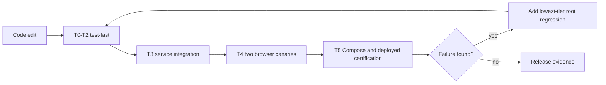

# Harden-LLM Parallel Test Feedback Hierarchy Plan

## 1. Title and metadata

- Project name: `harden-llm`
- Target repository: `/home/kirill/p/harden-llm`
- Version: `1.0.0-plan`
- Date: 2026-08-23
- Document ID: `PLAN-HARDEN-LLM-TEST-FEEDBACK-001`
- Status: approved; implementation executed through P06 under
  `PLAN-HARDEN-LLM-TEST-FEEDBACK-002`; P07 merge/deploy/certification remains
- Decision input: `ask_me/test-feedback-hierarchy-decisions.md`
- Related specifications:
  - `plans/from_utility-llm/harden-llm-self-hosted-test-spec.md`
  - `plans/from_utility-llm/phoenix-liveview-frontend-spec.md`
- Planning baseline: `origin/main` at `6afa5fc`, inspected from the dedicated
  branch `codex/parallel-test-feedback-plan`. The implementation must recheck
  `main`, the worktree, and these file inventories before making changes
  because this baseline can drift.
- Summary: This plan creates a resource-aware hierarchy in which broad,
  deterministic tests run cheaply and concurrently during coding, while real
  services, Chromium, full Compose, deployed systems, and live providers are
  progressively rarer certification boundaries. It preserves assertion
  correctness, keeps LiveView as the owner of server-side UI state, introduces
  no DOM emulator initially, and preserves the existing meaning of
  `make verify`.

This document plans test and test-support work. It does not itself change a
runtime, test command, deployment, test identifier, or certification claim.

## 2. Outcome

The work is complete when an agent can run one fast command repeatedly during
implementation and receive broad, parallel feedback without starting Docker,
Chromium, a public network call, or a live credential path. Higher-fidelity
commands must remain explicit, bounded by resource class, and independently
diagnosable.

The completed hierarchy shall provide:

1. One `make test-fast` command for all T0-T2 checks.
2. One resource policy that owns tier membership, concurrency limits, and
   exclusivity.
3. Broad LiveViewTest coverage for folds, profile state, retry state, uploads,
   host routing, and other server-owned interactions.
4. Dependency-free Node tests for extracted pure JavaScript rules.
5. Two targeted real-browser canaries, plus the existing release-only Compose
   browser gate.
6. Shared Postgres and Garage processes for ordinary integration tests, with
   unique state per test and an explicit isolated exception for destructive
   service-lifecycle behavior.
7. Measured warm/cold timing and resource budgets tied to a reference-host
   fingerprint.
8. Canonical methodology in `AGENTS.md`, the backend and frontend test
   specifications, an ADR, requirements traceability, and a reproducible KER.
9. Preserved comprehensive release certification through `make verify`,
   frontend release gates, Compose, and opt-in live checks.

## 3. Governing principles

### 3.1 Fidelity may be reduced; the oracle may not

A cheap test may replace a browser, database, object store, provider, or full
deployment with a lower-fidelity boundary. Its assertion must still precisely
decide the invariant it claims to cover. For example, a LiveViewTest can prove
that a fold event updates server state and renders the corresponding controls;
it must not claim to prove browser focus, native event serialization, or CSS
overflow.

### 3.2 Use the lowest sufficient tier

Every behavior belongs at the lowest tier capable of proving it. A higher tier
may retain a representative canary for a boundary that the lower tier cannot
exercise. Data permutations do not move upward merely because a browser or
service can execute them.

### 3.3 Parallel means maximum safe parallelism by resource class

Pure and process-isolated tests should use available cores. Service and browser
tests use measured worker limits. Full-system and live certification acquire
exclusive slots. Unlimited machine-wide concurrency is not a requirement.

### 3.4 Expensive failures produce cheap regressions

When T3-T5 finds a defect, the fix must add a T0-T2 regression for the root
invariant whenever that invariant can be represented below the expensive
boundary. The higher-tier canary remains only when it proves a distinct
integration fact.

### 3.5 Production code remains the test implementation

Extracted JavaScript functions are imported by the production hooks and their
tests. Integration fixtures exercise production repositories and stores. No
parallel test-only model may become an alternate implementation path.

## 4. Verified current baseline

| Surface | Current state | Consequence |
| --- | --- | --- |
| Root commands | `make verify` includes formatting, vet, build, static checks, unit, parity, Docker integration, integration race, API, observability, race, and vulnerability checks. | It is comprehensive but unsuitable as the repeated edit-test loop. |
| Backend parallelism | Integration and race package scheduling default to `-p=1`. Fifteen of 61 Go test files currently call `t.Parallel()`. | Cheap Go coverage has useful parallelism, but package/test isolation has not been audited comprehensively. |
| Integration services | Seven integration-tagged test files call helpers that start randomized Compose projects per test. | Isolation is strong, but container startup is repeated and service tests cannot exploit safe state-level concurrency. |
| Garage lifecycle | `TestGarageArtifactStore` restarts its Garage service. | This case cannot share a running Garage process with concurrent consumers and needs an explicit exclusive fixture class. |
| Frontend default | `mix test` excludes `:browser` and `:compose`; Wallaby and asset compilation start only when those tags are selected. | The expensive browser boundary is already opt-in and should remain so. |
| Frontend concurrency | Thirteen frontend modules use `async: false`; two are browser modules, leaving eleven deterministic modules serialized. Four modules use `async: true`. | Most deterministic LiveView/HTTP coverage currently leaves ExUnit concurrency unused. |
| HTTP fixtures | LiveView tests switch `Req.Test` into globally shared mode even though Req 0.6.1 provides private ownership and explicit allowances for concurrent processes. | A focused ownership refactor can remove the main serialization cause without adding a mock framework. |
| LiveView ownership | `ProfileWidgetComponent.handle_event/3` owns widget transitions; parent LiveViews receive namespaced messages. | Fold, cache, profile, retry, upload, and multi-instance state matrices belong primarily in LiveViewTest. |
| Browser coverage | `full_workflow_test.exs` has desktop, mobile, and two-instance features; `compose_smoke_test.exs` is a separate full-system feature. | Browser-specific facts can be retained in two canaries while server-state permutations move down a tier. |
| Client JavaScript | `app.js` defines `Clipboard`, `PromptShortcut`, `SchemaPending`, `SearchableCombobox`, and `SecretStager`; there is no JavaScript test stack or `package.json`. | Pure rules can use Node's built-in test runner with no npm, Vitest, Happy DOM, or jsdom dependency. |
| Hosted CI | No `.github/workflows/` directory exists in this planning baseline. | Local target semantics must be canonical; hosted lanes can consume them without becoming a second orchestration source. |

## 5. Approved decisions

| ID | Decision | Implementation consequence |
| --- | --- | --- |
| TFH-DEC-001 | Measure the fast-loop baseline before enforcing an SLO. | Record warm/cold wall time, CPU, and peak memory on a fingerprinted reference host; do not invent a universal time limit. |
| TFH-DEC-002 | Schedule by resource class. | T0-T2 run freely, T3-T4 have measured limits, and T5/live work is exclusive. |
| TFH-DEC-003 | Add tiered commands and preserve `make verify`. | Existing callers keep the current comprehensive backend contract. |
| TFH-DEC-004 | Retain two Chromium canaries plus release Compose. | Browser tests prove browser-only boundaries, not every fold/profile/input permutation. |
| TFH-DEC-005 | Start with a pure JavaScript core and Node's built-in test runner. | Do not add Happy DOM, jsdom, Vitest, npm dependencies, or a `package.json` in the initial implementation. |
| TFH-DEC-006 | Pool ordinary service infrastructure after isolation proof. | Postgres databases/schemas and Garage buckets/prefixes are unique per test; lifecycle-destructive tests remain explicit exceptions. |
| TFH-DEC-007 | Audit every deterministic `async: false` module now. | Convert safe modules to `async: true`; retain only named, documented global-state exceptions. |
| TFH-DEC-008 | Record policy in instructions, specifications, and an ADR. | `AGENTS.md` stays concise; specifications own obligations; the ADR owns rationale; KER owns measurements. |
| TFH-DEC-009 | Preserve oracle correctness. | Every test records its exact invariant and the production boundary it intentionally does not prove. |

## 6. Scope and non-goals

### 6.1 In scope

- Root Make targets and a dependency-free test-tier runner.
- Test tier/resource metadata and static policy validation.
- Go unit/integration parallelism and service-fixture lifecycle.
- ExUnit ownership/isolation and LiveViewTest coverage.
- Pure JavaScript extraction and Node tests.
- Real-browser suite reduction and classification.
- Benchmarking, resource evidence, and regression budgets.
- Local and hosted execution lanes that invoke the same commands.
- Documentation, ADR, KER, status, traceability, release evidence, and a
  related tracking issue.
- Merge, production deployment, and hosted verification if the production
  JavaScript bundle changes.

### 6.2 Out of scope

- Changing the OpenAPI contract, provider behavior, retry semantics, profile
  semantics, authentication model, or persisted application data.
- Replacing LiveView with client-owned state.
- Testing CSS layout or native browser behavior with a synthetic DOM.
- Adding Happy DOM or jsdom preemptively.
- Running live provider calls in `test-fast`, `make verify`, or ordinary CI.
- Multiplying Chromium runs across all profiles, folds, viewports, or input
  combinations.
- Making a service-pooling optimization before cross-test contamination and
  cleanup are proved.
- Weak snapshots or partial string checks where an exact deterministic oracle
  is available.

## 7. Canonical requirements

| ID | Type | Requirement | Acceptance criteria |
| --- | --- | --- | --- |
| TFH-REQ-001 | performance | The repository shall expose one default fast loop containing every T0-T2 suite. | `make test-fast` runs Go default-tag tests, parity fixture verification, deterministic Phoenix tests, and pure JavaScript tests; it starts no Docker, Chromium, public network, or live credential path. |
| TFH-REQ-002 | architecture | Every test suite and command shall have one tier and one resource class. | A machine-checked manifest rejects unclassified commands, duplicate ownership, unknown classes, and forbidden fast-tier dependencies. |
| TFH-REQ-003 | concurrency | Test execution shall use maximum safe parallelism by resource class. | T0-T2 tasks run concurrently across frameworks and within each framework; measured T3-T4 caps and an exclusive T5 lock are honored. |
| TFH-REQ-004 | observability | Fast-loop budgets shall be benchmark-derived and reproducible. | A KER records host/toolchain fingerprint, samples, method, p95/max, headroom, and resulting limits; enforcement occurs only on a matching reference class. |
| TFH-REQ-005 | correctness | Lower fidelity shall never weaken the truth condition of an assertion. | Each new or moved case names the invariant it proves and any browser/service/deployment fact left to a higher tier. |
| TFH-REQ-006 | frontend | Server-owned UI transitions shall be broadly covered without Chromium. | LiveViewTest covers all main/nested folds, profile/cache/reasoning transitions, retry projection, upload namespaces, parent routing, and multi-instance independence. |
| TFH-REQ-007 | frontend | Deterministic frontend tests shall run concurrently unless they mutate unavoidable global state. | Every deterministic `async: false` module has a checked-in exception and rationale; all other modules use private Req ownership and `async: true`. |
| TFH-REQ-008 | client | Pure client-side state rules shall have dependency-free JavaScript tests. | Production hook modules import the tested pure functions; `node --test` covers filtering, navigation, commit/revert, shortcut, and schema-pending decisions. |
| TFH-REQ-009 | browser | Real-browser coverage shall be small and boundary-specific. | Exactly two ordinary browser canaries prove LiveSocket/DOM patching, native events, hooks, focus, responsive overflow, authentication/run/reconnect/logout, and two-instance isolation; Compose browser remains separate. |
| TFH-REQ-010 | integration | Ordinary service tests shall share processes while isolating all mutable state. | Concurrent sentinel tests prove unique Postgres and Garage namespaces, no cross-read/write/delete, deterministic cleanup, and no leaked state after the run. |
| TFH-REQ-011 | integration | Destructive service-lifecycle tests shall never disrupt shared consumers. | The Garage restart test uses an explicitly exclusive/dedicated resource path and cannot overlap another Garage consumer. |
| TFH-REQ-012 | compatibility | Existing comprehensive and live gate meanings shall not silently weaken. | `make verify` retains its current backend composition; live provider commands remain explicit; `make test-release` adds rather than replaces frontend/browser/Compose certification. |
| TFH-REQ-013 | security | Cheap and deterministic tiers shall be credential-free and network-hermetic by contract. | Test policy and static boundary checks reject live tags, production origins, credential reads, and browser/service commands from T0-T2. |
| TFH-REQ-014 | regression | Every expensive defect shall be evaluated for a cheap root-invariant regression. | PR evidence links the T3-T5 failure to a T0-T2 case or explains why the invariant exists only at the expensive boundary. |
| TFH-REQ-015 | operability | Temporary reports, screenshots, caches, projects, databases, buckets, and locks shall be bounded and cleaned. | Successful runs leave no Compose projects, test namespaces, lock holders, or unignored artifacts; failure evidence is redacted and written only under ignored paths. |
| TFH-REQ-016 | traceability | Policy, tests, plans, ADR, KER, status, issues, and release evidence shall agree. | Machine checks and final review map every new `TEST-###`/`WEB-TEST-###` case to requirements, files, commands, and final disposition. |

## 8. Test hierarchy

| Tier | Name | Proves | Excludes | Default parallelism | Invocation frequency |
| --- | --- | --- | --- | --- | --- |
| T0 | Pure | Pure Go/Elixir/JavaScript functions, parsers, validation, state transitions, fixture integrity, static boundaries. | Endpoint servers, OTP application state where avoidable, Docker, browser, public network. | Available cores. | Every edit. |
| T1 | In-process | `httptest`, Plug/ConnCase, LiveView processes/diffs, local Req stubs, supervised per-test processes. | External services, Chromium, public network. | Available cores after ownership isolation. | Every edit. |
| T2 | Client logic | Pure client-side rules imported by production hooks under Node's built-in runner. | Synthetic DOM, LiveSocket, CSS, layout, native browser APIs. | Available cores. | Every edit touching frontend/client logic. |
| T3 | Service integration | Real Postgres, Garage, race-instrumented integration, migrations, repositories, S3 behavior. | Full product topology, public network, live providers. | Measured service slots; unique state per test. | Before PR readiness and when service boundaries change. |
| T4 | Browser | Chromium, LiveSocket patches, hook adapters, native input/event behavior, focus, viewport and overflow. | Full production topology and live providers. | One worker initially; increase only from KER evidence. | UI/client-hook readiness and release. |
| T5 | Full system | Full Compose, routing, recovery, cross-runtime telemetry, deployed acceptance, and separately authorized live providers. | Nothing inside the declared release scope. | Exclusive. | Merge/release/deployment certification. |

## 9. Ownership matrix for frontend behavior

| Behavior | Canonical owner | Primary tier | Higher-tier canary |
| --- | --- | --- | --- |
| Main and nested fold open/close state | `ProfileWidgetComponent` and host LiveViews | T1 LiveViewTest | One T4 widget canary proves browser event serialization and patching. |
| Profile, model, reasoning, cache, retry, and repair draft transitions | LiveView/component server state | T1 LiveViewTest | T4 exercises one representative sequence. |
| Upload namespacing and parent message routing | LiveView/component process topology | T1 LiveViewTest | T4 proves one two-instance browser path. |
| Run payload validation and omission of unsupported values | LiveView plus Go API boundary | T0/T1 | T5 may execute one configured profile; no profile matrix in Chromium. |
| Combobox filtering and highlight arithmetic | Extracted JavaScript pure core | T2 Node | T4 proves real input/change/blur events. |
| Prompt shortcut decision and schema-pending text decision | Extracted JavaScript pure core | T2 Node | T4 only if adapter behavior changes. |
| Listener attachment/removal, clipboard API, secret attribute timing | Thin hook adapters | T4 | None below T4 unless adapter complexity later justifies a DOM emulator. |
| Focus, native validation, CSS layout, responsive overflow | Browser/rendering engine | T4 | Deployed T5 check after frontend release. |
| Persisted profile/history/provider behavior | Go/OpenAPI/service boundary | T0/T1/T3 | T5 bounded smoke where release policy requires it. |

LiveViewTest does render server-produced HTML/diffs, but it does not start a
browser or execute custom hook JavaScript. Tests should drive public LiveView
events and rendered selectors rather than call private callback functions
directly. That keeps the test aligned with the server-side LiveView contract
without paying for Chromium.

## 10. Canonical command contract

| Command | Composition | Resource contract |
| --- | --- | --- |
| `make test-fast` | Default-tag `go test ./...`, parity fixture verification, `cd frontend && mix test`, and `node --test` client-core tests. Independent framework jobs start concurrently. | T0-T2 only; no Docker, Chromium, public network, or credentials. |
| `make test-unit` | Existing default-tag Go suite. | T0-T1 Go; retain for focused callers. |
| `make test-parity` | Existing fixture verifier and parity/contract Go cases. | T0-T1; retain current meaning. |
| `make test-integration` | Pooled Postgres/Garage setup, parallel isolated Go integration cases, exclusive Garage lifecycle case, contamination check, teardown. | T3 measured service pool. |
| `make test-browser` | Two ordinary Wallaby canaries only. | T4; one worker until evidence supports more. |
| `make test-compose` | Existing backend full-Compose smoke. | T5 exclusive. |
| `make test-release` | `make verify`, frontend format/compile/audit/deterministic tests, client-core tests, two browser canaries, backend Compose smoke, and frontend Compose browser smoke. | T3-T5 scheduled in bounded lanes; no implicit live provider call. |
| `make test-live` | Existing live provider and live gateway commands selected explicitly. | T5 exclusive; requires explicit credentials/authorization. |
| `make benchmark-test-feedback` | Repeated warm/cold measurements for each tier and resource class. | Exclusive measurement mode; no concurrent unrelated workload. |
| `make verify` | Existing comprehensive deterministic backend gate. | Semantics remain unchanged. |

The Makefile remains the human-facing command surface. A dependency-free Node
runner owns process orchestration because it can start Go, Mix, and Node jobs
concurrently, enforce resource slots, propagate cancellation, preserve each
child's exit status, and emit one machine-readable timing record without adding
another package manager. In fast mode it also disables dependency-network
fallbacks where the toolchain supports that control; missing locked
dependencies are a setup failure, not permission to contact the public network.

## 11. Resource policy and evidence design

### 11.1 Single source of truth

Create `test/test-tiers.json` with:

- schema version;
- task ID and exact command;
- tier and resource class;
- worker policy (`cpu`, measured integer, or `exclusive`);
- required/forbidden environment capabilities;
- timeout policy reference, if any;
- report/cleanup ownership;
- canonical `TEST-###` or `WEB-TEST-###` identifiers.

`scripts/run-test-tier.mjs` reads the manifest. `Makefile` targets delegate to
the runner. `scripts/verify-test-tiers.mjs` rejects drift. Documentation
describes the policy but does not duplicate task composition.

### 11.2 Initial resource classes

- `pure`: CPU-bound and process-isolated; use available cores.
- `in_process`: local sockets/OTP processes; use available cores after the
  ownership audit.
- `service_postgres`: shared process, unique database/schema, measured slots.
- `service_garage`: shared process, unique bucket/prefix, measured slots.
- `service_garage_exclusive`: dedicated restartable Garage; one slot.
- `race`: measured package cap; never overlaps browser/full-system work on the
  reference host unless measurements prove that useful.
- `browser`: one slot initially.
- `full_system`: exclusive lock.
- `live`: exclusive lock and explicit credential opt-in.

### 11.3 Benchmark method

Create `scripts/benchmark-test-feedback.mjs` and
`ker/test-feedback/baseline.json`.

1. Record OS/kernel, CPU count/model, memory, Docker/Compose, Go, Node,
   Elixir/OTP, and dependency-lock hashes.
2. Measure at least five warm successful samples for `test-fast` and each T3-T5
   lane.
3. Measure at least three cold-compile samples using temporary Go and Mix build
   caches. Do not delete a developer's caches or redownload dependencies merely
   to manufacture cold data.
4. Capture wall time, user/system CPU, peak resident memory, child exit status,
   and cleanup duration.
5. Record p50, p95, maximum, and sample values. The initial limit is the greater
   of p95 and maximum, plus 25% headroom, rounded up to a stable unit.
6. Enforce the limit only when the current host matches the recorded resource
   class. Other hosts report timing without failing on the reference threshold.
7. A budget increase requires a new KER measurement and root-cause note; it may
   not mask deadlock, leaked resources, retries, network drift, or lost
   parallelism.

## 12. Implementation phases

### 12.1 PTF-00: Rebaseline and record the decision

#### Files

- `plans/from_utility-llm/harden-llm-parallel-test-feedback-plan.md`
- `docs/adr/ADR-HLLM-015-parallel-test-feedback-hierarchy.md`
- `docs/adr/README.md`
- `ker/test-feedback/README.md`
- `ker/test-feedback/baseline.json`
- `scripts/benchmark-test-feedback.mjs`
- `plans/implementation-status.json`

#### Work

1. Fetch the remote, compare `HEAD`, `origin/main`, and the feature branch, and
   preserve unrelated work before implementation.
2. Recount test files, tags, browser features, `async` declarations,
   `t.Parallel()` use, Compose-starting helpers, and global mutable state.
3. Record ADR-HLLM-015 as accepted: resource tiers, preserved `make verify`,
   pure JavaScript core, no initial DOM emulator, two browser canaries, and
   conditional service pooling.
4. Add a `testFeedbackHierarchy` section to implementation status with phases
   PTF-00 through PTF-06 initially marked `planned` or `in_progress`.
5. Benchmark existing commands before changing suite composition. Store raw
   output under ignored `plans/evidence/harden-llm/<run-id>/`; commit only the
   redacted aggregate KER.

#### Exit criteria

- Current costs and bottlenecks are measured, not inferred.
- The ADR, plan, KER schema, and status use the same decision vocabulary.
- No production or test behavior has changed.

### 12.2 PTF-01: Add tier policy, orchestration, and fast boundary guards

#### Files

- `Makefile`
- `test/test-tiers.json`
- `scripts/run-test-tier.mjs`
- `scripts/verify-test-tiers.mjs`
- `internal/testkit/test_tier_policy_test.go`
- `plans/from_utility-llm/harden-llm-self-hosted-test-spec.md`

#### Work

1. Add `test-fast`, `test-browser`, `test-release`, `test-live`, and benchmark
   targets while retaining every existing target and the exact `verify`
   dependency list.
2. Run default Go, parity fixture, and deterministic Phoenix jobs concurrently
   under one cancellation-aware runner. PTF-03 registers the client-core job as
   soon as that suite exists; there is no placeholder or no-op task.
3. Terminate remaining children after the first failure, preserve the first
   causal error, and report every child that had already completed.
4. Use an ignored `tmp/test-feedback/<run-id>/` for JSON timings, locks, and
   captured logs. Remove it after success; retain redacted failure evidence
   only when explicitly requested.
5. Add TEST-041 for the tier manifest, fast-boundary exclusions, command
   composition, cancellation, exit propagation, and cleanup contract.
6. Prove `test-fast` cannot select integration/compose/live Go tags,
   `:browser`/`:compose` ExUnit tags, Docker commands, production origins, or
   credential-bearing commands.

#### Exit criteria

- `make test-fast` invokes all and only T0-T2 tasks and uses cross-framework
  concurrency.
- Existing focused targets and `make verify` produce the same selected work as
  before this phase.
- Runner unit/contract tests pass without Docker.

### 12.3 PTF-02: Parallelize deterministic Phoenix and deepen LiveView coverage

#### Files

- `frontend/test/support/conn_case.ex`
- `frontend/test/support/api_fixtures.ex`
- `frontend/test/harden_llm_web/harden_api_test.exs`
- `frontend/test/harden_llm_web/controllers/*_test.exs`
- `frontend/test/harden_llm_web/live/*_test.exs`
- `frontend/test/harden_llm_web/session_vault_test.exs`
- `frontend/test/harden_llm_web/security_observability_test.exs`
- new `frontend/test/harden_llm_web/live/profile_widget_component_test.exs`
- new `frontend/test/harden_llm_web/test_policy_test.exs`
- production files only if dependency injection is necessary:
  `frontend/lib/harden_llm_web/harden_api.ex` and
  `frontend/lib/harden_llm_web/session_vault.ex`

#### Work

1. Replace blanket `Req.Test.set_req_test_to_shared/0` use with
   `Req.Test.set_req_test_from_context/1`, private ownership, and explicit
   `Req.Test.allow/3` only for child processes that do not inherit ownership.
2. Give each test unique session handles, fixture IDs, files, and process names.
   Do not mutate `Application` configuration in an async test.
3. Audit all eleven deterministic `async: false` modules. Convert every safe
   module to `async: true`. Retain a checked-in exception only for demonstrated
   process-global behavior such as restarting the named `SessionVault`,
   replacing the application clock, or reconfiguring observability.
4. Prefer process-local injection over `Application.put_env/3`. If production
   seams are added, keep one runtime path and default them to the existing
   application configuration.
5. Move exhaustive fold/profile/retry/cache/upload/message matrices into a
   focused component host exercised through LiveViewTest. Keep workspace and
   embedding tests for parent integration, not duplicate permutations.
6. Cover every top-level and nested fold in both directions, unique generated
   IDs, tagged parent messages, main/escalation upload channels, two component
   instances, capability-aware reasoning, cache migration, saved-profile
   gating, and retry/repair projection.
7. Add WEB-TEST-044 for server-owned widget state and WEB-TEST-045 for
   deterministic frontend parallel safety/resource exceptions.
8. Run the suite repeatedly with randomized seeds and several `--max-cases`
   values. A test that passes only when serialized is not complete.

#### Exit criteria

- Every deterministic frontend module is async or appears in the machine-
  checked exception list with a concrete global resource.
- LiveViewTest carries all state permutations formerly requiring multiple
  browser workflows.
- Repeated high-concurrency runs have no Req ownership errors, session
  cross-talk, leaked processes, or order dependence.

### 12.4 PTF-03: Extract and test the pure JavaScript functional core

#### Files

- `frontend/assets/js/app.js`
- new `frontend/assets/js/hooks/searchable_combobox_core.mjs`
- new `frontend/assets/js/hooks/prompt_shortcut_core.mjs`
- new `frontend/assets/js/hooks/schema_pending_core.mjs`
- new `frontend/assets/js/hooks/index.js`
- new `frontend/assets/test/searchable_combobox_core.test.mjs`
- new `frontend/assets/test/prompt_shortcut_core.test.mjs`
- new `frontend/assets/test/schema_pending_core.test.mjs`
- `frontend/test/harden_llm_web/boundary_test.exs`

#### Work

1. Extract query normalization, option visibility, highlight wraparound,
   known/custom value resolution, Enter/Escape/blur decisions, shortcut
   qualification, and schema-pending display decisions into pure functions.
2. Keep DOM lookup, listener lifecycle, focus, `requestSubmit`, clipboard,
   event dispatch, class mutation, scrolling, and zero-delay secret cleanup in
   thin adapters imported by `app.js`.
3. Test the pure functions with `node --test` and table-driven exact values.
4. Import the same pure modules into the production hooks; do not duplicate the
   logic in tests.
5. Add WEB-TEST-046 for client functional-core coverage and a boundary
   assertion that no Happy DOM, jsdom, Vitest, npm lockfile, or client test
   dependency was introduced.
6. Build the production assets and inspect the bundle for successful imports,
   absence of Node-only APIs, and unchanged hook registration names.

#### Exit criteria

- Client state-rule regressions fail in milliseconds under Node.
- The browser adapters remain small enough that two real-browser canaries are
  sufficient.
- `mix assets.build` and the production frontend image build succeed without
  Node/npm in the runtime image.

#### DOM-emulator promotion rule

Happy DOM may be proposed later only when at least two real defects arise in
adapter listener/mutation behavior that cannot be represented as pure rules
and whose repeated Chromium cost is material. The proposal must compare Happy
DOM against jsdom for the exact missing APIs, add an ADR amendment, and keep a
Chromium canary for the synthetic-to-real boundary. Until then, neither is a
dependency.

### 12.5 PTF-04: Reduce and sharpen Chromium coverage

#### Files

- replace `frontend/test/browser/full_workflow_test.exs` with:
  - `frontend/test/browser/widget_canary_test.exs`
  - `frontend/test/browser/authenticated_workflow_canary_test.exs`
- retain `frontend/test/browser/compose_smoke_test.exs`
- `frontend/test/test_helper.exs`
- `frontend/test/support/browser_backend.ex`
- `frontend/test/harden_llm_web/test_policy_test.exs`

#### Work

1. Create one widget/client-hook canary that proves searchable selection and
   custom commit, nested folding, secret staging non-disclosure, native event
   propagation, two-instance isolation, focus behavior, and desktop/mobile
   overflow in one browser session.
2. Create one authenticated workflow canary that proves login, workspace
   hydration, one run, result/history rendering, reconnect-safe state,
   ambiguous-failure guidance, and logout in one browser session.
3. Delete duplicate desktop/mobile state permutations only after each removed
   invariant is mapped to T1/T2 or one of the two canaries.
4. Keep the Compose browser feature tagged `:compose` and release-only.
5. Start with one browser worker. Increase only after benchmark evidence shows
   lower wall time without unacceptable peak memory or instability.
6. Keep screenshots on failure only and clean `frontend/tmp/wallaby` after a
   successful run.
7. Add WEB-TEST-047 for the two-canary browser boundary and a policy check that
   ordinary browser feature count cannot grow without a specification/ADR
   update.

#### Exit criteria

- Ordinary Chromium coverage is exactly two independently diagnosable
  features.
- No server-state/profile/fold matrix exists only in Chromium.
- Both canaries pass against the deterministic local backend; no provider
  tokens are spent.

### 12.6 PTF-05: Pool integration services and prove isolation

#### Files

- `deploy/test/compose.integration.yml`
- replace the per-test lifecycle in `internal/integrationtest/compose.go` with
  explicit pooled and exclusive fixture APIs
- new `internal/integrationtest/isolation_test.go`
- `internal/postgres/cache_test.go`
- `internal/postgres/repository_test.go`
- `internal/artifacts/garage_test.go`
- `internal/gateway/auth_profile_test.go`
- `internal/gateway/profile_seed_test.go`
- `internal/gateway/resource_routes_test.go`
- `internal/gateway/run_test.go`
- `scripts/run-test-tier.mjs`
- `test/test-tiers.json`

#### Work

1. Start one Postgres and one ordinary Garage service per T3 runner, using one
   randomized Compose project and dynamic loopback ports.
2. Allocate one random Postgres database or schema per test, run migrations in
   that namespace, cap connections, terminate remaining connections during
   cleanup, and drop the namespace.
3. Prototype a unique Garage bucket per test. If the pinned default credentials
   cannot safely create/delete buckets, use a cryptographically unique key
   prefix and prove that every list/read/delete path is prefix-scoped. Do not
   choose prefixing without that proof.
4. Keep `TestGarageArtifactStore`, which restarts its service, on a dedicated
   restartable Garage resource. This is the one intentional exception to the
   shared-process rule because restarting a shared service would invalidate
   concurrent tests.
5. Add `t.Parallel()` near the start of each affected test only after fixture
   allocation and cleanup have been proven concurrency-safe. Set Go package
   parallelism from the measured service slot count rather than leaving a
   hard-coded global `-p=1`.
6. Add TEST-042 for concurrent namespace isolation, cross-owner sentinels,
   cleanup, and leak detection. Add TEST-043 for the exclusive Garage lifecycle
   resource and scheduler lock.
7. Run contamination tests in both normal and race modes. Seed one namespace
   with recognizable sentinels, concurrently mutate another, and prove neither
   can observe or delete the other's state.
8. On interruption or failure, the outer runner tears down the exact randomized
   Compose project. It must never target the repository's production Compose
   project or an unresolved environment-derived project name.

#### Go/no-go gate

Adopt pooling only if all isolation tests pass and measured warm wall time or
peak resource use improves materially. If isolation cannot be proved, retain
per-test process isolation for that service, record the failed prototype in
the KER, and improve selection/concurrency elsewhere. Correctness outranks the
optimization.

#### Exit criteria

- Ordinary T3 tests reuse service processes and isolate all mutable state.
- The destructive Garage lifecycle case cannot overlap shared Garage work.
- Failed and interrupted runs leave no project, database, bucket/prefix, or
  volume leak.

### 12.7 PTF-06: Documentation, CI lanes, merge, deployment, and certification

#### Files

- `AGENTS.md`
- `README.md`
- `frontend/README.md`
- `plans/from_utility-llm/harden-llm-self-hosted-test-spec.md`
- `plans/from_utility-llm/phoenix-liveview-frontend-spec.md`
- `plans/from_utility-llm/harden-llm-self-hosted-implementation-plan.md`
- `plans/implementation-status.json`
- `docs/requirements-traceability.md`
- `docs/architecture.md`
- `docs/release-certification.md`
- `docs/adr/ADR-HLLM-015-parallel-test-feedback-hierarchy.md`
- `docs/adr/README.md`
- `ker/test-feedback/*`
- optional new `.github/workflows/test-hierarchy.yml`, if hosted Actions are
  enabled for this repository
- the related GitHub tracking issue and pull request

#### Work

1. Put concise agent behavior in `AGENTS.md`: run `test-fast` repeatedly, select
   the lowest sufficient tier, prefer async/parallel-safe fixtures, justify new
   serial/expensive tests, and add cheap regressions for expensive failures.
2. Define TEST-041 through TEST-043 once in the backend test specification and
   WEB-TEST-044 through WEB-TEST-047 once in the frontend specification.
3. Update requirements traceability, implementation status, ADR index,
   architecture, developer commands, and release gate descriptions without
   duplicating the tier manifest.
4. Create or update one tracking issue with requirement IDs, phase checklist,
   benchmark evidence, and links to the ADR/PR. Close it only after merged and
   deployed verification is recorded.
5. If hosted Actions are enabled, add separate `fast`, `integration`,
   `browser`, and `release` jobs that invoke the canonical Make targets. Do not
   recreate command composition in workflow YAML. Use concurrency groups so
   expensive jobs cannot saturate the same self-hosted runner.
6. Implement in small conventional commits, push the feature branch, open a PR,
   wait for required checks, and merge only from a clean, current branch.
7. Because PTF-03 changes the production JavaScript bundle, build and promote
   an immutable frontend image after merge using the existing production
   release procedure and the explicit Compose project `harden-llm`. Do not
   create a duplicate stack. The gateway need not be rebuilt unless its source
   or image inputs changed.
8. Verify image release label/digest, container health, public frontend/API
   probes, the hosted widget canary, one bounded authenticated CPA prompt, and
   cleanup of its smoke history. Never persist the credential or live output.
9. Commit the final redacted release evidence and completed implementation
   status in a follow-up documentation change, merge it, and recheck
   `main == origin/main`.

#### Exit criteria

- Human instructions, machine policy, specifications, tests, ADR, KER, issue,
  status, and release evidence agree.
- The final merged revision passes every required tier.
- The deployed frontend revision/image matches the merged source if the bundle
  changed.
- All temporary benchmark files, Wallaby screenshots from successful runs,
  Compose projects, databases, Garage namespaces, browser sessions, and locks
  are gone.

## 13. Test identifier allocation

| ID | Planned obligation | Primary files |
| --- | --- | --- |
| TEST-041 | Tier manifest, fast-boundary exclusions, runner cancellation/exit/cleanup, and preserved `make verify` composition. | `internal/testkit/test_tier_policy_test.go`, `scripts/verify-test-tiers.mjs`, `test/test-tiers.json` |
| TEST-042 | Shared Postgres/Garage namespace isolation, contamination resistance, and cleanup. | `internal/integrationtest/isolation_test.go`, integration consumers |
| TEST-043 | Resource locks, exclusive Garage restart behavior, and measured service scheduling. | `scripts/run-test-tier.mjs`, `internal/artifacts/garage_test.go` |
| WEB-TEST-044 | Complete server-owned widget/fold/state/message/upload matrix under LiveViewTest. | `profile_widget_component_test.exs`, workspace/embedding tests |
| WEB-TEST-045 | Deterministic frontend private ownership, async safety, and justified serial exceptions. | `test_policy_test.exs`, `conn_case.ex`, affected tests |
| WEB-TEST-046 | Pure JavaScript functional core imported by production hooks. | `frontend/assets/js/hooks/`, `frontend/assets/test/` |
| WEB-TEST-047 | Two ordinary Chromium canaries and separate Compose browser certification. | `widget_canary_test.exs`, `authenticated_workflow_canary_test.exs`, `compose_smoke_test.exs` |

Before implementation, rerun the identifier scan. If another merged change has
claimed any number, allocate the next free canonical ID and update this plan,
both specifications, traceability, and status atomically.

## 14. Verification matrix

| Phase | Required command/evidence | Pass condition |
| --- | --- | --- |
| PTF-00 | Benchmark harness against unchanged baseline | Samples and host fingerprint recorded; no developer caches destroyed. |
| PTF-01 | runner unit tests; `make test-fast`; old/new command selection comparison | Fast exclusions pass; all child failures propagate; `verify` composition unchanged. |
| PTF-02 | frontend format/compile; repeated `mix test` at multiple seeds/max-cases | No ownership/order failures; serial exceptions are explicit. |
| PTF-03 | `node --test`; `mix assets.build`; frontend boundary tests | Pure matrix passes; production bundle builds; no DOM/npm dependency. |
| PTF-04 | `make test-browser` | Exactly two ordinary canaries pass with deterministic local fixtures. |
| PTF-05 | `make test-integration`; integration race; leak/contamination audit | Shared namespaces remain isolated; exclusive restart is safe; teardown complete. |
| PTF-06 | `make test-fast`; `make verify`; `make test-browser`; `make test-release`; `git diff --check` | All deterministic release gates pass from the merged candidate. |
| Deployment | image/label/digest, Compose health, public probes, authenticated hosted widget/run | Deployed frontend matches merge; prompt succeeds; smoke history removed. |
| Final Git | branch/remote ancestry and clean status | `main == origin/main`; no untracked or ignored task artifact remains. |

`make test-release` is expected to be expensive. It is not part of the coding
loop and must not be used as evidence that `test-fast` meets its budget.

## 15. Parallel-safety audit checklist

For every test or fixture converted to concurrent execution, verify:

- no shared `Application.put_env/3` or `System.put_env/2` mutation;
- no globally registered process restart or replacement;
- unique ports, session handles, owners, IDs, paths, database/schema names,
  buckets/prefixes, and Compose projects;
- process-owned Req stubs and explicit allowances where child callers require
  them;
- no assertion based on another test's timing or residue;
- bounded waits driven by observable readiness rather than sleeps;
- `t.Cleanup`/`on_exit` cleanup is idempotent and targets exact resolved names;
- race-safe production fakes and counters;
- no live credential, provider spend, public origin, or production data;
- failure logs are bounded and redacted;
- repeated randomized/high-concurrency runs produce the same result.

## 16. Risks and mitigations

| Risk | Trigger | Mitigation |
| --- | --- | --- |
| Fast suite becomes a second incomplete gate | A test is omitted to meet time budget. | Classify and optimize it; do not remove a required invariant. TEST-041 checks composition. |
| Private Req stubs are unavailable in LiveView children | Ownership lookup fails after switching from shared mode. | Use explicit `Req.Test.allow/3` at the spawned-process boundary and prove it under repeated async runs. |
| Async tests corrupt global session/observability state | A test restarts a named process or changes application config. | Keep it in a named serial class or introduce one process-local production seam; never hide it with retries. |
| Pure extraction changes browser behavior | Hook adapter and core disagree. | Production imports the core; asset build plus one T4 hook canary proves the adapter boundary. |
| Synthetic DOM is added without need | Client adapters become inconvenient to test. | Apply the promotion rule; require concrete defects/API needs and an ADR amendment. |
| Service pooling leaks state | A database, bucket, or prefix is reused or cleanup races. | Unique random namespaces, sentinels, cross-read/delete tests, bounded teardown, and fail closed to process isolation. |
| Garage restart disrupts another test | Lifecycle case shares the ordinary pool. | Dedicated `service_garage_exclusive` class and scheduler lock. |
| More concurrency slows the machine | Browser, race, Docker, and compile jobs contend. | Benchmark each resource class and cap it independently; never infer that more workers means less wall time. |
| Budget flakes across unlike hosts | Reference threshold is applied universally. | Fingerprint resource class; enforce only on matching hosts and report elsewhere. |
| Release evidence drifts from production | Tests pass on a feature branch but a different image is deployed. | Certify merged SHA, immutable image label/digest, Compose project, probes, and authenticated behavior together. |

## 17. Decision points that remain measurement-driven

The following are intentionally not guessed in this plan:

1. Fast-loop warm/cold time limits and peak-memory limits.
2. Safe Postgres, Garage, race, and browser worker counts on the reference
   machine.
3. Whether Garage supports a practical unique-bucket fixture with the pinned
   default credentials; prefix isolation is acceptable only after proof.
4. The final list of unavoidable deterministic ExUnit serial exceptions.
5. Whether hosted Actions are enabled and which runner class can enforce the
   reference-host SLO.

PTF-00 and the PTF-02/PTF-05 isolation probes resolve these without requiring a
product decision. Stop and request guidance only if the measured fastest safe
design conflicts with an approved decision, requires a production contract
change, or cannot preserve isolation.

## 18. Completion and divergence reporting

The final handoff must state plainly whether PTF-00 through PTF-06 are complete
and list any remaining work within this plan. It must also report:

- every phase or file that diverged from this plan;
- the exact evidence that forced the divergence;
- whether the change affected test fidelity, oracle scope, concurrency,
  production code, deployment, or only documentation;
- all updated plans, specifications, ADRs, KERs, tests, status records, and
  issue/PR links;
- benchmark deltas by tier and resource class;
- tests run and tests intentionally not run;
- temporary artifacts and external resources cleaned;
- commit, PR, merge SHA, image digest/release label, deployment project, and
  public verification where applicable.

No plan-related work remains only when the implementation, merge, applicable
deployment, hosted verification, evidence update, and cleanup all agree. After
that closure, the next concrete work is to observe several weeks of timing and
failure data, tune measured worker limits, and reconsider a lightweight DOM
environment only if real adapter defects justify it.
