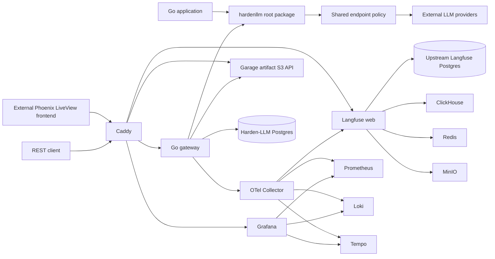

# Harden-LLM Backend and REST API Implementation Plan

## 1. Title and metadata

- Project name: `harden-llm`
- Target repository: `/home/kirill/harden-llm`
- Contract source repository: `/home/kirill/utility-llm`
- Version: `1.3.0-backend-plan`
- Owners: package maintainers and self-hosted runtime implementers
- Date: 2026-07-12
- Document ID: `PLAN-HARDEN-LLM-SELF-HOSTED-001`
- Summary: This plan defines the verification-first implementation of the `harden-llm` backend in its initially empty target repository. The product is one root Go library package, one versioned REST/OpenAPI gateway, Harden-LLM Postgres records, Garage-backed trace artifacts and diagnostic attachments, Caddy, OpenTelemetry Collector, Prometheus, Loki, Tempo, Grafana, and a pinned upstream Langfuse OSS Compose fragment. It contains no frontend implementation, browser session, Phoenix/LiveView, React/Vite, HTML, or asset work. The separately specified Phoenix LiveView frontend consumes only the REST/OpenAPI contract. Langfuse retains its own default Postgres, Redis, ClickHouse, and MinIO services; Harden-LLM does not substitute Garage into Langfuse and never uses Langfuse's MinIO.

## 2. Design consensus and trade-offs

| Topic | Verdict | Rationale grounded in repository and deployment constraints |
| --- | --- | --- |
| Implement in `/home/kirill/harden-llm` | DECISION | The repository already maps to `github.com/prls-co/harden-llm`; the module path and source location match without a repository rename. |
| Use Go | FOR | The workload is provider-bound HTTP/JSON orchestration with retries, persistence, and diagnostics. Go provides a small deployment unit and direct control over concurrency and cancellation. |
| Use one root public package | DECISION | `hardenllm` exposes one stable client API, profile/catalog types, credential/cache interfaces, and endpoint policy while built-in provider, retry, schema, cache-key, trace, pricing, and redaction implementations remain internal. |
| Use one `Client.Call` result contract | DECISION | One detailed `Result` serves Go users and the gateway. JS direct-output parity maps to `Result.Output`; there is no second expanded-result path. |
| Use a thin REST gateway | DECISION | HTTP handlers own transport, auth, authorization, and persistence orchestration and call the root library once for runtime behavior. |
| Publish OpenAPI 3.1 | DECISION | `api/openapi.yaml` is the only backend/frontend contract. Router and fixture conformance tests prevent undocumented routes or frontend-specific server behavior. |
| Use Postgres for application records | DECISION | Application state needs concurrent writes, transactions, JSONB, indexes, and migrations. SQLite is not a Harden-LLM application database. Garage's upstream-supported internal SQLite metadata engine does not create a second application persistence contract. |
| Keep upstream Langfuse defaults | DECISION | LLM-specific diagnostics are required, but Harden-LLM does not own Langfuse dependency migration. The pinned official Compose fragment retains its own Postgres, Redis, ClickHouse, and MinIO services until Langfuse upstream changes them. |
| Use Garage for Harden-LLM artifacts | DECISION | Current Firebase Storage behavior writes linked JSON trace artifacts and diagnostic attachments. Garage replaces only that application-owned surface. Langfuse continues using its upstream MinIO and receives no Garage endpoint or credential. |
| Use one telemetry export path | DECISION | The Go process sends OTel to the Collector; the Collector sends traces to Tempo and complete `harden-llm` traces once to Langfuse over OTLP/HTTP. |
| Use `slog` JSON for logs | DECISION | Application code has one stable logging API. A composed handler writes JSON stdout and mirrors the same record through a pinned OTel slog bridge; Collector sends those OTel logs to Loki. |
| Keep frontend implementation separate | DECISION | The backend exposes bearer-authenticated REST only. Phoenix LiveView owns HTML, browser sessions, CSRF, and UI state transitions under `phoenix-liveview-frontend-spec.md`; no frontend runtime enters this plan. |
| Remove Firebase from the backend | DECISION | Current Firebase server/storage behavior informs parity fixtures, but no Firebase code, package, environment variable, server, emulator, or deploy script enters the backend implementation. |
| Add provider endpoint safety | FOR | User-configured provider endpoints require one shared SSRF, DNS, redirect, TLS, header, and credential-origin policy. |
| Keep request idempotency out of v1 | AGAINST | A distributed idempotency ledger and async run state are not required for the initial synchronous gateway. Client retry behavior is documented instead. |
| Keep scheduled retention and backup automation out of v1 | AGAINST | Schema timestamps preserve future options, but schedulers, backup orchestration, and restore automation do not block the first self-hosted release. |
| Keep Temporal out of v1 | AGAINST | Provider and repair retries are library semantics. No current workflow needs another required service. |

## 3. PRD / stakeholder and system needs

- Problem: `utility-llm` currently combines a Node package with Firebase-backed service surfaces. Operators and independent clients need a free, self-hosted Go library and REST backend with equivalent runtime behavior and substantially better diagnostics.
- Users:
  - Go applications importing `hardenllm`.
  - Non-Go clients calling the REST gateway.
  - Phoenix LiveView and other REST client implementers.
  - Operators diagnosing provider, retry, cache, schema, database, and telemetry failures.
- Value:
  - One self-hosted deployment with no Firebase or managed application dependency.
  - One implementation home for runtime behavior.
  - Correlated product state, traces, metrics, logs, and Langfuse generations.
  - Deterministic parity evidence for the JS-to-Go migration.
- Business goals:
  - Deliver a usable Go module and REST gateway from the existing target repository.
  - Preserve current provider/retry/schema/cache/profile semantics unless an ADR records an intentional break.
  - Make production diagnostics useful without Sentry or a paid backend.
- Success metrics:
  - 100% pass rate for deterministic TEST-001 through TEST-036, TEST-039, and TEST-040.
  - 100% required OTel signal coverage and zero secret leaks in adversarial fixtures.
  - 100% fixture manifest integrity and annotated intentional parity differences only.
  - All fifteen Compose services ready within 300 seconds on the reference host.
  - Zero Firebase, frontend implementation, or direct Langfuse exporter paths in backend-owned code, builds, and the base deployment.
- Scope:
  - Root Go library, built-in providers, retry/repair/backup behavior, cache, schema, usage/pricing, profiles, traces/stats, diagnostics, Harden-LLM Postgres, Garage artifacts, local bearer auth, REST/OpenAPI gateway, OTel/Grafana/Langfuse stack, Caddy, and Compose.
- Non-goals:
  - Frontend implementation, Phoenix/LiveView runtime, browser auth/session/CSRF, application SQLite, Sentry, Temporal, Kubernetes, OIDC, public registration, async run queues, distributed idempotency, scheduled retention, automated backup/restore, multi-node Garage, and local substitution of any Langfuse-owned dependency.
- Dependencies:
  - Source repository at the recorded fixture-capture SHA.
  - Go toolchain selected in P00.
  - Node 20+ only for fixture capture/verification scripts inherited from the source migration.
  - Docker Engine and Compose for Harden-LLM Postgres, Garage, and full-stack tests.
  - Pinned Harden-LLM images for Postgres, Garage, Caddy, Collector Contrib, Prometheus, Loki, Tempo, and Grafana.
  - One official Langfuse release/commit and byte-for-byte Compose SHA-256; its Postgres, Redis, ClickHouse, MinIO, web, and worker service choices remain upstream-owned.
- Risks:
  - Contract drift between source and target.
  - SSRF or credential leakage through provider base URLs.
  - Duplicate behavior in gateway handlers.
  - Telemetry duplication or loops between Collector and Langfuse.
  - Full-stack resource pressure and slow readiness.
  - Upstream Langfuse Compose drift or a local override that accidentally substitutes an owned dependency.
  - Single-node Garage has no host-failure tolerance and must not be represented as HA.
  - Undocumented REST drift forces frontend clients to infer gateway behavior.
  - Firebase or frontend implementation enters backend-owned paths or the backend build/release graph.
- Assumptions:
  - The source deterministic tests pass before fixture capture.
  - The target repository remains the production and release home.
  - Docker Compose on one Linux host is the first deployment topology.
  - Live provider tests are explicit release actions only.

## 4. SRS / canonical requirements

| ID | Type | Requirement | Acceptance criteria |
| --- | --- | --- | --- |
| REQ-001 | int | The target shall be module `github.com/prls-co/harden-llm` with one root package named `hardenllm`. | External-package tests import `New`, `Client.Call`, request/result, profile/catalog, credential/cache/artifact, endpoint-policy, and telemetry surfaces; built-in provider, Garage, and all other implementation packages remain private. |
| REQ-002 | func | The library shall expose `New(Options)` and one `Client.Call(context.Context, Request) (Result, error)` execution path. | `Result` contains output and normalized call metadata; no simple/detailed split exists. |
| REQ-003 | func | Retry, structured repair, and backup-profile behavior shall preserve current total-attempt, classification, backoff, cancellation, graph, and fallback boundaries. | Deterministic fixtures match source behavior and caller context bounds the complete candidate sequence. |
| REQ-004 | int | Built-in providers shall cover OpenAI-compatible Chat, OpenAI Responses, Gemini GenerateContent, Anthropic Messages, and generic OpenAI-compatible endpoints. | Request, response, error, usage, and cost fixtures match current contracts. |
| REQ-005 | security | All provider-bound HTTP operations shall use one endpoint-security policy. | Unsafe schemes, addresses, redirects, DNS rebinding, headers, TLS controls, and credential-origin changes fail before unintended dialing. |
| REQ-006 | func | Contracted schema handling and operation-cache identity/replay shall preserve current behavior. | Schema/parse/repair fixtures and cache hash/mode/replay fixtures match source behavior. |
| REQ-007 | data | Usage, pricing, profiles, domain traces, observations, stats, and diagnostics shall preserve canonical semantic fields. | Canonicalized Go projections match source fixtures or carry an ADR annotation. |
| REQ-008 | security | Endpoint credentials shall use versioned AES-256-GCM records with key ID, nonce, and owner/credential/origin AAD. | Tamper, wrong-key, wrong-owner, and wrong-origin tests fail; API state is redacted. |
| REQ-009 | data | Dedicated Harden-LLM Postgres shall own application records and Garage artifact indexes without sharing credentials, databases, or migrations with Langfuse's upstream Postgres service. | Migrations, constraints, indexes, advisory locking, repository round trips, artifact references, and cross-service configuration isolation pass. |
| REQ-010 | security | The gateway shall own bootstrap local users, Argon2id verification, opaque hashed bearer sessions, and owner isolation without browser-cookie or CSRF behavior. | Login returns the token once, protected routes require one valid bearer credential, only token digests persist, and two-user isolation passes for every user-owned resource. |
| REQ-011 | int | The gateway shall expose the versioned `/api/v1` resource routes defined by the stack specification. | Health, auth, state, profile, bundle, model, history, run, trace, and owner-authorized artifact routes use stable envelopes and root library calls. |
| REQ-012 | int | The backend shall publish a frontend-independent OpenAPI 3.1 contract and contain no Firebase or frontend implementation surface. | OpenAPI/router/request/response conformance passes; scoped static scans find no Firebase, Phoenix/LiveView, React/Vite, HTML-template, browser-session, or asset implementation. |
| REQ-013 | nfr | The application shall emit OTel traces/metrics and correlated `slog` JSON with bounded, redacted attributes. | Required signal coverage is complete, metric labels are bounded, and secret scans pass. |
| REQ-014 | reliability | Telemetry backend failures shall not alter provider results and process shutdown shall be bounded. | Collector outage tests preserve results, bound queues, report safely, and finish shutdown within the configured budget. |
| REQ-015 | int | Collector shall be the single telemetry router to Prometheus, Loki, Tempo, and Langfuse. | Collector tests prove one Langfuse OTLP/HTTP path, complete root/child traces, no loop, and required processors. |
| REQ-016 | int | Grafana shall provision Prometheus, Loki, and Tempo datasources and required dashboards. | Provisioning and dashboard queries parse, use bounded labels, and correlate logs/traces. |
| REQ-017 | reliability | Docker Compose and Caddy shall provide the complete fifteen-service self-hosted stack while preserving the pinned upstream Langfuse service graph. | All services become healthy, only Caddy is externally reachable in the effective topology, the upstream Langfuse Compose content/provenance and Postgres/Redis/ClickHouse/MinIO graph remain unchanged, Langfuse is initialized headlessly, and an end-to-end fake run appears in every intended backend. |
| REQ-018 | reliability | Migration shall use source-SHA-pinned fixtures and remove Firebase from the target. | Fixture integrity passes, parity is phase-local, and the target has no source runtime/build/test dependency. |
| REQ-019 | nfr | The target shall keep one implementation home and pass formatting, build, race, vet, and vulnerability gates. | Static dependency/AST checks and `make verify` pass without wrappers or duplicate exporters. |
| REQ-020 | data | Harden-LLM shall replace Firebase Storage with one Garage-backed artifact store for private redacted trace JSON and diagnostic attachments, indexed by owner in Postgres. | Real-Garage tests prove canonical bytes, hashes, sizes, short-lived presigning, owner authorization, non-fatal bounded failures, and strict separation from Langfuse MinIO. |

### Error handling and telemetry expectations

- API errors use stable safe codes and field keys inside `{ state, result, error }`.
- Provider errors preserve normalized status, category, retryability, and safe hashes without raw secrets.
- Unsafe endpoints fail before DNS/dial/credential use whenever the failing input can be rejected earlier.
- Telemetry and Langfuse failures are diagnostic failures, not provider-call failures.
- Garage artifact failures are diagnostic persistence failures, not provider-call failures; they cannot create an available Postgres artifact row or leak storage credentials.
- `/api/v1/run` is synchronous; clients must not automatically replay an ambiguous transport failure.
- Timeout changes follow TEST-039 and require evidence when increased after the baseline is established.

### Architecture diagram



```text
System: harden-llm

  Repository: /home/kirill/harden-llm
    Public component: root package hardenllm
      New, Client.Call, Request, Result, Profile, ProfileCatalog,
      CredentialResolver, EndpointPolicy, CacheStore, ArtifactStore
    Internal components:
      runtime, providers, endpoint policy, retry, schema, cache key,
      profiles, pricing, traces, stats, diagnostics, artifacts, redaction
    Gateway:
      HTTP transport, bearer auth, authorization, OpenAPI contract,
      Postgres orchestration, process telemetry setup
    External client contract:
      OpenAPI 3.1 over /api/v1; no frontend implementation in backend

  Deployment: Docker Compose
    Edge: Caddy
    Product: gateway, Harden-LLM Postgres, Garage artifact store
    General diagnostics: Collector, Prometheus, Loki, Tempo, Grafana
    LLM diagnostics: pinned upstream Langfuse web/worker, Postgres,
      Redis, ClickHouse, MinIO
```

## 5. Iterative implementation and test plan

### Compute controls

- `branch_limits`: one production implementation per behavior; seams only for external I/O, clock, randomness, DNS, and telemetry testing.
- `reflection_passes`: two per phase, first for requirement/test coverage and second for duplication, scope, and public-surface review.
- `early_stop%`: 90; stop adding behavior when phase acceptance is complete and additional work does not close a requirement.

### Phase strategy

- P00 establishes target commands, root package shell, source-SHA fixture provenance, and static boundaries.
- P01 ports root runtime, retry, repair/backup, schema, and cache with parity in the same phase.
- P02 ports providers, endpoint security, usage/pricing, traces/stats, profiles, credentials, and diagnostics with parity in the same phase.
- P03 adds Harden-LLM Postgres, Garage artifact persistence, cache concurrency, local auth, owner isolation, and profile-save orchestration.
- P04 adds `/api/v1`, OpenAPI/router conformance, and the Firebase/frontend absence boundary.
- P05 adds OTel traces/metrics, `slog` JSON, Collector routing, failure isolation, and Grafana artifacts.
- P06 adds the complete Compose/Caddy deployment, the byte-for-byte pinned upstream Langfuse fragment, and end-to-end diagnostic/artifact smoke.
- P07 runs aggregate parity, full deterministic certification, timeout policy, optional live tests, and migration closure.
- The P07 closeout received a post-certification frontend parity amendment on 2026-08-18 after the current `utility-llm` frontend inventory found missing Phoenix behavior. The amendment preserves the P07 backend phase and records its frontend scope, tests, and intentional adaptations in ADR-HLLM-012.

### Risk register

| Risk | Trigger | Mitigation |
| --- | --- | --- |
| Source fixtures drift | Fixture SHA or canonical output changes after capture | Manifest pins source SHA and per-slice parity blocks dependent phases. |
| Public API expands accidentally | Internal packages or alternate call methods become imported by callers | Root external-package tests and AST/dependency boundaries block the phase. |
| SSRF or credential forwarding | Profile endpoint resolves to unsafe address or redirects | One injected endpoint policy and adversarial IPv4/IPv6/DNS tests run before gateway work. |
| Gateway duplicates runtime logic | Handler constructs provider payload, retry, schema, cache, pricing, or trace data | Static boundaries run after gateway changes. |
| Telemetry is duplicated | Direct Langfuse call or second logging path appears | Static dependency scan and Collector signal-count test require one path. |
| Langfuse resource pressure | Full stack misses readiness budget | Reference hardware, pinned images, per-service readiness timing, and 300-second gate. |
| Langfuse dependency drift | Local Compose edits replace, share, or tune upstream Postgres, Redis, ClickHouse, or MinIO | Pin the upstream fragment by release, commit, and SHA-256; restrict the integration overlay and compare it statically. |
| Garage data loss on one host | Garage volume, process, disk, or host fails | Label v1 as non-HA, use persistent metadata/data volumes with consistent mode, expose storage failures, and keep multi-node/backup automation out until separately designed. |
| REST/OpenAPI drift | Router, envelope, auth, or examples change independently | TEST-026 compares both directions and validates request/response fixtures. |
| Firebase or frontend enters backend | Source server/UI code is copied instead of porting contracts | TEST-027 scopes backend dependency, AST, command, and filesystem scans. |
| Secret leakage | Fake secret appears in logs, spans, bundles, API, or evidence | Shared redaction tests and adversarial evaluation block phase exit. |

### Suspension and resumption criteria

- Suspend a behavior change when its RED command does not fail for the intended reason.
- Suspend when a source contract needed by parity is ambiguous or its deterministic source test fails.
- Suspend when endpoint safety requires a second HTTP implementation.
- Suspend when a target phase requires live provider credentials for deterministic acceptance.
- Resume from the last passing phase after recording target/source SHAs, failed command, changed files, and blocker.
- Stop when acceptance requires Firebase, frontend rendering/session code, an application SQLite database, a direct Langfuse exporter, a local Langfuse dependency substitution, or another provider/retry implementation path.

### Standards tailoring note

- This plan is standards-informed and is not a claim of ISO/IEEE/FAA compliance.
- Each phase produces requirements, code-surface, verification, validation, configuration, risk, and assumption evidence.
- Safety-critical use requires a separate assurance-level, independence, structural-coverage, tool-qualification, and certification-data plan.

### Phase P00: Target foundation and parity provenance pass

Phase goal: the empty target becomes a valid Go module with one root public package, canonical commands, static boundaries, and verified source-SHA parity fixtures.

Scope and objectives, including impacted REQ-###: REQ-001, REQ-018, REQ-019.

Impacted surfaces: target `go.mod`, root package shell, `api/openapi.yaml`, `Makefile`, `internal/testkit/`, `scripts/`, `fixtures/parity/`, and source deterministic tests.

Lifecycle evidence:

- Requirements evidence: target/module, migration, and one-path requirements.
- Design/code surface evidence: root package shell, test harness, command definitions, fixture manifest.
- Verification method: TEST-001 through TEST-005.
- Validation purpose: prove the target and contract baseline before behavior implementation.
- Configuration checkpoint: source SHA and tool versions recorded; no provider credentials used.
- Risks and assumptions: source deterministic commands pass at capture time.

Plan-and-Solve subtasks:

- `P00.S01 Add failing foundation and provenance coverage`
  - Action: Create the minimal `go.mod`, root package declaration, Node fixture verifier, and TEST-001 through TEST-005 files; define canonical `Makefile` targets without implementing runtime behavior.
  - Why now: Later phases need executable commands and one canonical test namespace.
  - Files/surfaces: `go.mod`, `doc.go`, `Makefile`, `internal/testkit/*_test.go`, `scripts/verify-parity-fixtures.mjs`.
  - Requirement link: REQ-001, REQ-018, REQ-019.
  - Verification link: TEST-001, TEST-002, TEST-003, TEST-004, TEST-005.
  - Verification mode: RED
  - Command/procedure: `go test ./internal/testkit/... -run 'TestTargetLayout|TestImplementationBoundaries|TestForbiddenDependencies|TestTraceability' -count=1 && node scripts/verify-parity-fixtures.mjs`.
  - Expected result: Command fails because target layout and parity fixtures are incomplete.
  - Evidence produced: failing static/provenance transcript.
  - Stop/escalate condition: Stop if the module path does not resolve to the target repository.
  - Unlocks: P00.S02.
- `P00.S02 Build the target layout and capture source fixtures`
  - Action: Run current source contract/core/behavior and relevant server-contract tests, create the bounded backend layout and initial `api/openapi.yaml` shell, adopt the governing documents in `plans/from_utility-llm/` as the single plan/spec home, initialize `plans/implementation-status.json` with P00 complete, capture deterministic fixtures with source SHA and hashes, and complete canonical Make targets.
  - Why now: Runtime work requires trusted source inputs and stable commands.
  - Files/surfaces: root files, `cmd/`, `api/openapi.yaml`, needed `internal/` roots, `scripts/capture-utility-llm-fixtures.mjs`, `fixtures/parity/manifest.json`.
  - Requirement link: REQ-001, REQ-018, REQ-019.
  - Verification link: TEST-001, TEST-002, TEST-003, TEST-004, TEST-005.
  - Verification mode: GREEN
  - Command/procedure: `go test ./internal/testkit/... -run 'TestTargetLayout|TestImplementationBoundaries|TestForbiddenDependencies|TestTraceability' -count=1 && node scripts/verify-parity-fixtures.mjs`.
  - Expected result: Command passes; fixture manifest records the exact passing source SHA.
  - Evidence produced: source command transcript, fixture manifest, target layout, and passing tests.
  - Stop/escalate condition: Escalate if a source deterministic gate fails or fixture capture requires live credentials.
  - Unlocks: P00.S03.
- `P00.S03 Review the foundation for unnecessary public surface`
  - Action: Run boundaries again and inspect exported root identifiers and empty internal directories; remove any package that has no immediate phase owner and confirm P00 status traceability.
  - Why now: The empty target should not freeze a speculative package structure.
  - Files/surfaces: root Go files, `internal/`, `Makefile`.
  - Requirement link: REQ-001, REQ-019.
  - Verification link: TEST-002, TEST-003.
  - Verification mode: VERIFY
  - Command/procedure: `go test ./internal/testkit/... -run 'TestImplementationBoundaries|TestForbiddenDependencies' -count=1`.
  - Expected result: Command passes. No refactor is needed when only the root contract and phase-owned harness exist.
  - Evidence produced: export/dependency scan output and phase log.
  - Stop/escalate condition: Refactor before phase exit if a wrapper or unused public package exists.
  - Unlocks: P00 exit.

Exit gates:

- Proceed: TEST-001 through TEST-005 pass and source SHA evidence is complete.
- Escalate: source contract or fixture provenance is ambiguous.
- Stop: target setup requires a second module or compatibility package.

Phase metrics with estimated value and one-sentence rationale:

- Confidence %: 88, because module identity and fixture provenance are directly executable.
- Long-term robustness %: 86, because public boundaries and source SHA are fixed before behavior.
- Internal interactions: 6, across root module, API contract shell, scripts, fixtures, tests, and commands.
- External interactions: 1, the local source repository.
- Complexity %: 35, because no runtime behavior exists yet.
- Feature creep %: 5, because speculative packages are removed.
- Technical debt %: 8, because the command surface is established early.
- YAGNI score: 94, because only immediate foundation files are created.
- MoSCoW: Must.
- Local/non-local scope: Local across two repositories, with writes only in target.
- Architectural changes count: 3, module, public root boundary, fixture provenance.

### Phase P01: Core runtime parity passes

Phase goal: one root `Client.Call` path implements result, retry, repair/backup, schema, and cache behavior with source parity.

Scope and objectives, including impacted REQ-###: REQ-002, REQ-003, REQ-006, REQ-007, REQ-019.

Impacted surfaces: root public files, `internal/runtime/`, `internal/retry/`, `internal/schema/`, `internal/cachekey/`, and parity fixtures.

Lifecycle evidence:

- Requirements evidence: root call, retry, schema/cache, and one-path requirements.
- Design/code surface evidence: root types and internal core packages.
- Verification method: TEST-006 through TEST-011.
- Validation purpose: prove deterministic core behavior before real provider protocols.
- Configuration checkpoint: fake providers/cache only; fixed clocks and IDs.
- Risks and assumptions: source fixtures fully describe current core behavior.

Plan-and-Solve subtasks:

- `P01.S01 Add failing root runtime and retry coverage`
  - Action: Add TEST-006 through TEST-009 for the detailed Result, observability context, retry, structured repair, and backup-profile graph behavior.
  - Why now: The root API and attempt semantics constrain all later provider work.
  - Files/surfaces: `client_test.go`, `internal/runtime/*_test.go`, `internal/retry/*_test.go`.
  - Requirement link: REQ-002, REQ-003, REQ-007.
  - Verification link: TEST-006, TEST-007, TEST-008, TEST-009.
  - Verification mode: RED
  - Command/procedure: `go test . ./internal/runtime/... ./internal/retry/... -run 'TestClientCallResult|TestObservabilityContext|TestRetryContract|TestStructuredRepair|TestBackupProfiles' -count=1`.
  - Expected result: Command fails because core implementation is absent.
  - Evidence produced: failing runtime/retry transcript.
  - Stop/escalate condition: Escalate if current backup graph or repair fixtures conflict.
  - Unlocks: P01.S02.
- `P01.S02 Implement one root runtime and retry path`
  - Action: Implement root types/New/Call and internal runtime/retry/repair/backup logic using a profile catalog, credential resolver, local fake-provider transport, cache, clock, IDs, OTel providers, and logger.
  - Why now: Schema and cache execution depend on one normalized call record and attempt model.
  - Files/surfaces: root Go files, `internal/runtime/`, `internal/retry/`.
  - Requirement link: REQ-002, REQ-003, REQ-007.
  - Verification link: TEST-006, TEST-007, TEST-008, TEST-009.
  - Verification mode: GREEN
  - Command/procedure: `go test . ./internal/runtime/... ./internal/retry/... -run 'TestClientCallResult|TestObservabilityContext|TestRetryContract|TestStructuredRepair|TestBackupProfiles' -count=1`.
  - Expected result: Command passes with source-parity output and attempt metadata.
  - Evidence produced: passing tests and root/internal implementation diff.
  - Stop/escalate condition: Stop if implementation needs a second execution method or gateway retry.
  - Unlocks: P01.S03.
- `P01.S03 Add failing schema and cache parity coverage`
  - Action: Add TEST-010 and TEST-011 using committed source schema, parser, cache-hash, mode, and replay fixtures.
  - Why now: Provider implementations require stable schema and cache contracts.
  - Files/surfaces: `internal/schema/schema_test.go`, `internal/cachekey/cache_test.go`, `client_cache_test.go`.
  - Requirement link: REQ-006, REQ-018.
  - Verification link: TEST-010, TEST-011.
  - Verification mode: RED
  - Command/procedure: `go test . ./internal/schema/... ./internal/cachekey/... -run 'TestSchemaContract|TestCacheIdentity|TestCacheReplay' -count=1`.
  - Expected result: Command fails because schema/cache implementation is absent.
  - Evidence produced: failing parity transcript.
  - Stop/escalate condition: Escalate if canonical JSON or hash encoding is ambiguous.
  - Unlocks: P01.S04.
- `P01.S04 Implement schema and cache behavior`
  - Action: Implement fail-closed contracted schema normalization/validation, parse diagnostics, repair extraction, cache-key canonicalization, modes, and replay through the normalized call record.
  - Why now: This completes the provider-independent runtime contract.
  - Files/surfaces: `internal/schema/`, `internal/cachekey/`, root cache interface and client flow.
  - Requirement link: REQ-006, REQ-018.
  - Verification link: TEST-010, TEST-011.
  - Verification mode: GREEN
  - Command/procedure: `go test . ./internal/schema/... ./internal/cachekey/... -run 'TestSchemaContract|TestCacheIdentity|TestCacheReplay' -count=1`.
  - Expected result: Command passes and all hash/schema fixtures match.
  - Evidence produced: passing parity tests and implementation diff.
  - Stop/escalate condition: Stop if unsupported schema keywords are accepted silently.
  - Unlocks: P01.S05.
- `P01.S05 Review the core for duplicate state or APIs`
  - Action: Mark P01 complete in `plans/implementation-status.json`, run the phase suite and static boundaries, then inspect whether Result metadata, telemetry data, and cache records derive from one normalized call record.
  - Why now: Core duplication would spread into every provider and gateway phase.
  - Files/surfaces: root and P01 internal packages.
  - Requirement link: REQ-019.
  - Verification link: TEST-002, TEST-005, TEST-006, TEST-011.
  - Verification mode: VERIFY
  - Command/procedure: `go test . ./internal/runtime/... ./internal/retry/... ./internal/schema/... ./internal/cachekey/... ./internal/testkit/... -count=1`.
  - Expected result: Command passes. No refactor is needed when one call record feeds result, telemetry hooks, and cache behavior.
  - Evidence produced: phase transcript and structure review note.
  - Stop/escalate condition: Refactor before exit if result or attempt normalization is duplicated.
  - Unlocks: P01 exit.

Exit gates:

- Proceed: TEST-006 through TEST-011 and TEST-002 pass.
- Escalate: source core parity cannot be expressed deterministically.
- Stop: acceptance needs a second runtime path.

Phase metrics with estimated value and one-sentence rationale:

- Confidence %: 86, because all core behavior is fixture-backed.
- Long-term robustness %: 90, because one call record and cancellation model are established.
- Internal interactions: 12, across public types, runtime, retry, schema, cache, and telemetry hooks.
- External interactions: 0, because providers and stores are fake.
- Complexity %: 68, because retry, repair, backup, and cache state interact.
- Feature creep %: 8, because provider breadth and persistence remain outside the phase.
- Technical debt %: 12, because duplicate-state review is an exit gate.
- YAGNI score: 90, because only source-contracted behavior is implemented.
- MoSCoW: Must.
- Local/non-local scope: Local.
- Architectural changes count: 5, root API plus four internal behavior areas.

### Phase P02: Providers and domain projections pass securely

Phase goal: all provider protocols, endpoint safety, usage/pricing, traces/stats, profiles, credentials, and diagnostics pass source parity and redaction tests.

Scope and objectives, including impacted REQ-###: REQ-004, REQ-005, REQ-007, REQ-008, REQ-015, REQ-018, REQ-019, REQ-020.

Impacted surfaces: `internal/providers/`, `internal/pricing/`, `internal/traces/`, `internal/stats/`, `internal/profiles/`, `internal/diagnostics/`, `internal/redaction/`, and root provider interfaces.

Lifecycle evidence:

- Requirements evidence: provider, endpoint security, domain data, credential, migration, and boundary requirements.
- Design/code surface evidence: one shared provider HTTP client and internal projections.
- Verification method: TEST-012 through TEST-019 and EVAL-001/EVAL-002.
- Validation purpose: prove every external provider path is safe before gateway exposure.
- Configuration checkpoint: local HTTP/TLS servers and injected DNS only.
- Risks and assumptions: private self-hosted provider access is represented by exact allowlist fixtures.

Plan-and-Solve subtasks:

- `P02.S01 Add failing provider and endpoint-policy coverage`
  - Action: Add TEST-012 through TEST-014 for request parity, response/error normalization, and adversarial endpoint policy.
  - Why now: Provider behavior and outbound safety must share one HTTP path from the start.
  - Files/surfaces: `internal/providers/*_test.go`, endpoint fixtures.
  - Requirement link: REQ-004, REQ-005, REQ-015, REQ-018.
  - Verification link: TEST-012, TEST-013, TEST-014.
  - Verification mode: RED
  - Command/procedure: `go test ./internal/providers/... -run 'TestProviderRequestParity|TestProviderNormalization|TestEndpointPolicy' -count=1`.
  - Expected result: Command fails because providers and endpoint policy are absent.
  - Evidence produced: failing provider/security transcript.
  - Stop/escalate condition: Stop if any provider bypasses the shared endpoint policy.
  - Unlocks: P02.S02.
- `P02.S02 Implement providers through one safe HTTP client`
  - Action: Implement built-in provider adapters, response/error normalization, shared transport deadlines, endpoint validation, injected resolver/dialer, no-redirect policy, header filtering, origin-bound credentials, and TLS enforcement.
  - Why now: All later profile and gateway flows depend on safe provider execution.
  - Files/surfaces: `internal/providers/`, root profile/catalog, credential-resolver, and endpoint-policy types.
  - Requirement link: REQ-004, REQ-005, REQ-015, REQ-018.
  - Verification link: TEST-012, TEST-013, TEST-014.
  - Verification mode: GREEN
  - Command/procedure: `go test ./internal/providers/... -run 'TestProviderRequestParity|TestProviderNormalization|TestEndpointPolicy' -count=1`.
  - Expected result: Command passes for all protocol and adversarial fixtures.
  - Evidence produced: provider implementation, endpoint-policy code, passing transcript.
  - Stop/escalate condition: Escalate if a provider requires redirects or production TLS bypass.
  - Unlocks: P02.S03.
- `P02.S03 Add failing domain-projection parity coverage`
  - Action: Add TEST-015 through TEST-017 for usage/pricing, traces/stats including canonical artifact projections, and profile catalog parity.
  - Why now: Persistence schemas must not be designed before domain projections are fixed.
  - Files/surfaces: `internal/pricing/*_test.go`, `internal/traces/*_test.go`, `internal/stats/*_test.go`, `internal/profiles/profile_test.go`, and the source-derived profile catalog tests.
  - Requirement link: REQ-007, REQ-018, REQ-020.
  - Verification link: TEST-015, TEST-016, TEST-017.
  - Verification mode: RED
  - Command/procedure: `go test ./internal/pricing/... ./internal/traces/... ./internal/stats/... ./internal/profiles/... -run 'TestUsageCostParity|TestParity|TestProfileParity' -count=1`.
  - Expected result: Command fails because domain projections are absent.
  - Evidence produced: failing parity transcript.
  - Stop/escalate condition: Escalate if source profile graph limits or cost precedence are unclear.
  - Unlocks: P02.S04.
- `P02.S04 Implement domain projections and profiles`
  - Action: Implement usage/cost normalization, pricing snapshots, domain trace/observations, canonical redacted artifact projections, strict stats, profile catalog/backup graph validation, and shared redaction inputs.
  - Why now: Credential bundles and Postgres schemas consume these exact shapes.
  - Files/surfaces: `internal/pricing/`, `internal/traces/`, `internal/stats/`, `internal/profiles/`, `internal/redaction/`.
  - Requirement link: REQ-007, REQ-018, REQ-020.
  - Verification link: TEST-015, TEST-016, TEST-017.
  - Verification mode: GREEN
  - Command/procedure: `go test ./internal/pricing/... ./internal/traces/... ./internal/stats/... ./internal/profiles/... -run 'TestUsageCostParity|TestParity|TestProfileParity' -count=1`.
  - Expected result: Command passes and canonical JSON matches fixtures.
  - Evidence produced: passing parity transcript and domain implementation.
  - Stop/escalate condition: Stop if unknown/partial stats fields are silently accepted.
  - Unlocks: P02.S05.
- `P02.S05 Add failing credential and diagnostics coverage`
  - Action: Add TEST-018 and TEST-019 for versioned AES-GCM/AAD, bundle parity, Garage-neutral artifact references, diagnostics shape, storage-failure semantics, and adversarial redaction.
  - Why now: Postgres must store only already-tested encrypted and redacted shapes.
  - Files/surfaces: `internal/profiles/credentials_test.go`, `internal/diagnostics/bundle_test.go`, redaction fixtures.
  - Requirement link: REQ-008, REQ-007, REQ-015, REQ-020.
  - Verification link: TEST-018, TEST-019.
  - Verification mode: RED
  - Command/procedure: `go test ./internal/profiles/... ./internal/diagnostics/... -run 'TestCredentialBundle|TestDiagnosticsBundle' -count=1`.
  - Expected result: Command fails because crypto and diagnostics are absent.
  - Evidence produced: failing security transcript.
  - Stop/escalate condition: Stop if bundle parity would expose raw credentials.
  - Unlocks: P02.S06.
- `P02.S06 Implement credential and diagnostic contracts`
  - Action: Implement AES-256-GCM records with key ID/random nonce/AAD, encrypted bundle import/export, diagnostics bundle construction, storage-neutral artifact identities, bounded non-fatal artifact failures, and one shared redactor.
  - Why now: This closes all state shapes before database work.
  - Files/surfaces: `internal/profiles/`, `internal/diagnostics/`, `internal/redaction/`.
  - Requirement link: REQ-008, REQ-007, REQ-015, REQ-020.
  - Verification link: TEST-018, TEST-019.
  - Verification mode: GREEN
  - Command/procedure: `go test ./internal/profiles/... ./internal/diagnostics/... -run 'TestCredentialBundle|TestDiagnosticsBundle' -count=1`.
  - Expected result: Command passes with zero adversarial secret leaks.
  - Evidence produced: crypto/diagnostic implementation and passing transcript.
  - Stop/escalate condition: Stop on any secret leak or unauthenticated ciphertext exposure.
  - Unlocks: P02.S07.
- `P02.S07 Measure provider parity and endpoint safety`
  - Action: Run parity and endpoint adversarial evaluations over all fixtures.
  - Why now: Provider correctness and egress safety are thresholded release properties.
  - Files/surfaces: P02 tests and `internal/eval/`.
  - Requirement link: REQ-004, REQ-005, REQ-018.
  - Verification link: EVAL-001, EVAL-002.
  - Verification mode: MEASURE
  - Command/procedure: `go test ./internal/eval/... -run 'TestParityCoverageEval|TestEndpointSafetyEval' -count=1`.
  - Expected result: parity coverage is 100%, unintended dial count is zero, and adversarial pass rate is 100%.
  - Evidence produced: evaluation metrics.
  - Stop/escalate condition: Threshold changes require an ADR.
  - Unlocks: P02.S08.
- `P02.S08 Review provider and redaction ownership`
  - Action: Mark P02 complete in `plans/implementation-status.json`, run static boundaries, and inspect all outbound HTTP construction and redaction call sites.
  - Why now: Provider breadth is the highest risk for duplicate transports and redactors.
  - Files/surfaces: root profile/credential/endpoint-policy types and P02 internal packages.
  - Requirement link: REQ-019.
  - Verification link: TEST-002, TEST-003, TEST-005.
  - Verification mode: VERIFY
  - Command/procedure: `go test ./internal/testkit/... -run 'TestImplementationBoundaries|TestForbiddenDependencies|TestTraceability' -count=1`.
  - Expected result: Command passes. No refactor is needed when one transport policy and one redactor serve all providers.
  - Evidence produced: dependency scan and phase review note.
  - Stop/escalate condition: Refactor before exit if any adapter creates its own HTTP client policy or redactor.
  - Unlocks: P02 exit.

Exit gates:

- Proceed: TEST-012 through TEST-019, TEST-002, TEST-003, EVAL-001, and EVAL-002 pass.
- Escalate: provider parity or safe endpoint behavior remains ambiguous.
- Stop: a provider requires bypassing the shared endpoint policy.

Phase metrics with estimated value and one-sentence rationale:

- Confidence %: 84, because all protocols and adversarial endpoint cases use local fixtures.
- Long-term robustness %: 92, because egress safety and redaction are central shared contracts.
- Internal interactions: 18, across providers, transport, pricing, traces, stats, profiles, credentials, and diagnostics.
- External interactions: 0 public; local HTTP, TLS, and DNS doubles only.
- Complexity %: 78, because provider breadth and security policy interact.
- Feature creep %: 10, because no proxy DSL or alternate object store is added.
- Technical debt %: 14, because shared transport/redaction ownership is verified.
- YAGNI score: 88, because provider behavior follows current source contracts.
- MoSCoW: Must.
- Local/non-local scope: Non-local behavior tested locally.
- Architectural changes count: 7, provider transport plus six domain/security components.

### Phase P03: Postgres, Garage artifacts, and local identity pass

Phase goal: Harden-LLM Postgres migrations/repositories, real Garage artifact persistence, cache concurrency, local sessions, owner isolation, and profile-save orchestration pass integration tests.

Scope and objectives, including impacted REQ-###: REQ-005, REQ-008, REQ-009, REQ-010, REQ-019, REQ-020.

Impacted surfaces: `internal/postgres/`, migrations, root `ArtifactStore`, `internal/artifacts/`, `deploy/postgres/`, `deploy/garage/`, `internal/gateway/auth/`, profile service, and integration test harness.

Lifecycle evidence:

- Requirements evidence: credential, data, artifact, auth, and boundary requirements.
- Design/code surface evidence: migrations, repositories, Garage artifact adapter, auth/session service, profile-save transaction.
- Verification method: TEST-020 through TEST-022 and TEST-040.
- Validation purpose: prove durable owner-scoped records and Firebase Storage replacement before HTTP routes.
- Configuration checkpoint: isolated Compose Harden-LLM Postgres and pinned single-node Garage with generated test credentials.
- Risks and assumptions: network probes and Garage uploads execute outside short Postgres transactions; single-node Garage is explicitly non-HA.

Plan-and-Solve subtasks:

- `P03.S01 Add failing migration, repository, and cache coverage`
  - Action: Add TEST-020 and TEST-021 for advisory-locked migrations, application-only repositories, artifact indexes, and concurrent cache writes.
  - Why now: Gateway services need a fixed record-persistence contract.
  - Files/surfaces: `internal/postgres/*_test.go`, test migrations and fixtures.
  - Requirement link: REQ-009, REQ-020.
  - Verification link: TEST-020, TEST-021.
  - Verification mode: RED
  - Command/procedure: `go test ./internal/postgres/... -tags=integration -run 'TestRepositoryContract|TestCacheConcurrency' -count=1`.
  - Expected result: Command fails because migrations and repositories are absent.
  - Evidence produced: failing Postgres transcript.
  - Stop/escalate condition: Escalate if application migrations or credentials need access to Langfuse's Postgres service.
  - Unlocks: P03.S02.
- `P03.S02 Implement migrations and repositories`
  - Action: Implement one advisory-locked migration runner, application schema including `llm_artifacts`, strict repositories, owner scoping, and cache upsert without any Langfuse database initialization.
  - Why now: Artifact, auth, and profile services require durable application records.
  - Files/surfaces: `internal/postgres/`, `internal/postgres/migrations/`, `deploy/postgres/`.
  - Requirement link: REQ-009, REQ-020.
  - Verification link: TEST-020, TEST-021.
  - Verification mode: GREEN
  - Command/procedure: `go test ./internal/postgres/... -tags=integration -run 'TestRepositoryContract|TestCacheConcurrency' -count=1`.
  - Expected result: Command passes under concurrent migration and cache cases with no Langfuse configuration dependency.
  - Evidence produced: migration/repository code and passing transcript.
  - Stop/escalate condition: Stop if Harden-LLM Postgres code can address the upstream Langfuse Postgres service.
  - Unlocks: P03.S03.
- `P03.S03 Add failing Garage artifact coverage`
  - Action: Add TEST-040 for canonical JSON writes, exact hash/size metadata, short-lived presigning, key isolation, real Garage failure behavior, and strict MinIO/Langfuse separation.
  - Why now: The Firebase Storage replacement must be real before gateway trace routes depend on it.
  - Files/surfaces: `internal/artifacts/garage_test.go`, `deploy/test/compose.integration.yml`, artifact fixtures.
  - Requirement link: REQ-009, REQ-020.
  - Verification link: TEST-040.
  - Verification mode: RED
  - Command/procedure: `go test ./internal/artifacts/... -tags=integration -run TestGarageArtifactStore -count=1`.
  - Expected result: Command fails because the Garage adapter and deployment are absent.
  - Evidence produced: failing real-Garage integration transcript.
  - Stop/escalate condition: Stop if passing requires configuring Garage as a Langfuse dependency or using Langfuse MinIO credentials.
  - Unlocks: P03.S04.
- `P03.S04 Implement the Garage artifact store`
  - Action: Implement the root storage-neutral `ArtifactStore` contract, one internal Garage S3 adapter, canonical redacted JSON bytes, unique owner-scoped keys, SHA-256/size metadata, bounded calls, short-lived presigning, and the pinned persistent Garage v2.3 test profile using its supported `--single-node --default-bucket` startup path.
  - Why now: Authenticated artifact routes need one verified storage implementation.
  - Files/surfaces: `artifacts.go`, `internal/artifacts/`, `deploy/garage/`, integration harness.
  - Requirement link: REQ-001, REQ-009, REQ-020.
  - Verification link: TEST-040.
  - Verification mode: GREEN
  - Command/procedure: `go test ./internal/artifacts/... -tags=integration -run TestGarageArtifactStore -count=1`.
  - Expected result: Command passes against pinned Garage with no MinIO or Langfuse application setting.
  - Evidence produced: artifact interface/adapter, deployment config, and passing transcript.
  - Stop/escalate condition: Escalate if Garage cannot satisfy canonical write, immediate read, or presign behavior required by the artifact contract.
  - Unlocks: P03.S05.
- `P03.S05 Add failing auth and profile-save coverage`
  - Action: Add TEST-022 for Argon2id, one-time opaque bearer issuance, digest-only session persistence, strict authorization-header parsing, expiry/revocation, two-user isolation, endpoint-safe probe, and no-write-on-probe-failure behavior.
  - Why now: Stateful gateway routes must build on tested auth and transaction services.
  - Files/surfaces: `internal/gateway/auth_profile_test.go`.
  - Requirement link: REQ-008, REQ-010, REQ-005.
  - Verification link: TEST-022.
  - Verification mode: RED
  - Command/procedure: `go test ./internal/gateway/... -tags=integration -run TestAuthProfileContract -count=1`.
  - Expected result: Command fails because auth/profile services are absent.
  - Evidence produced: failing auth/profile transcript.
  - Stop/escalate condition: Stop if profile probes hold database transactions open across network calls.
  - Unlocks: P03.S06.
- `P03.S06 Implement local auth and profile-save orchestration`
  - Action: Implement bootstrap user command support, Argon2id verification, opaque bearer-token generation, SHA-256 session-digest persistence, strict authorization-header parsing, expiry/revocation, owner authorization, safe profile probe, and atomic profile/credential commit. Do not add browser cookies, CSRF, or CORS behavior.
  - Why now: P04 HTTP handlers will compose these services.
  - Files/surfaces: `internal/gateway/auth/`, `internal/gateway/profile_service.go`, `internal/postgres/`, gateway command bootstrap surface.
  - Requirement link: REQ-008, REQ-010, REQ-005.
  - Verification link: TEST-022.
  - Verification mode: GREEN
  - Command/procedure: `go test ./internal/gateway/... -tags=integration -run TestAuthProfileContract -count=1`.
  - Expected result: Command passes with strict owner isolation and no partial writes.
  - Evidence produced: auth/profile implementation and passing transcript.
  - Stop/escalate condition: Stop on cross-user visibility or endpoint-policy bypass.
  - Unlocks: P03.S07.
- `P03.S07 Review persistence and auth boundaries`
  - Action: Mark P03 complete in `plans/implementation-status.json`, run the Postgres, Garage, and auth integration subsets plus static boundaries, and inspect transaction scopes, repository ownership predicates, and object-store ownership.
  - Why now: Persistence abstractions should remain small before route count expands.
  - Files/surfaces: `internal/postgres/`, `internal/artifacts/`, `internal/gateway/auth/`, profile service.
  - Requirement link: REQ-009, REQ-010, REQ-019, REQ-020.
  - Verification link: TEST-002, TEST-005, TEST-020, TEST-022, TEST-040.
  - Verification mode: VERIFY
  - Command/procedure: `go test ./internal/postgres/... ./internal/artifacts/... ./internal/gateway/... -tags=integration -count=1 && go test ./internal/testkit/... -run 'TestImplementationBoundaries|TestTraceability' -count=1`.
  - Expected result: Command passes. No refactor is needed when repositories own SQL, one adapter owns Garage S3, and services own short orchestration only.
  - Evidence produced: integration/static transcript and persistence-boundary review note.
  - Stop/escalate condition: Refactor before exit if SQL or S3 calls appear in HTTP handlers, or if MinIO appears in Harden-LLM application configuration.
  - Unlocks: P03 exit.

Exit gates:

- Proceed: TEST-020 through TEST-022, TEST-040, and TEST-002 pass.
- Escalate: migration locking, Garage compatibility, or profile transaction boundaries remain uncertain.
- Stop: application persistence requires Firebase Storage, Langfuse MinIO, or a second object-store implementation.

Phase metrics with estimated value and one-sentence rationale:

- Confidence %: 84, because state and artifacts run against real Postgres and Garage.
- Long-term robustness %: 88, because migration races, owner isolation, artifact integrity, and failure behavior are directly tested.
- Internal interactions: 18, across migrations, repositories, artifacts, crypto, auth, and profile service.
- External interactions: 2, local Harden-LLM Postgres and Garage.
- Complexity %: 75, because auth, transactions, and object persistence interact.
- Feature creep %: 8, because Garage replaces a current Firebase Storage responsibility while clustering, registration, OIDC, retention, and backup automation remain out.
- Technical debt %: 15, because single-node Garage is explicitly non-HA but its boundary and failure behavior are tested.
- YAGNI score: 89, because storage covers only existing trace artifacts and diagnostic attachments.
- MoSCoW: Must.
- Local/non-local scope: Non-local state and artifact integration.
- Architectural changes count: 5, application database, migrations, artifact store, auth, profile service.

### Phase P04: Versioned REST and OpenAPI contract pass

Phase goal: every `/api/v1` route executes through root services, conforms to OpenAPI 3.1, uses opaque bearer authentication, and leaves no Firebase or frontend implementation in the backend.

Scope and objectives, including impacted REQ-###: REQ-005, REQ-009, REQ-010, REQ-011, REQ-012, REQ-018, REQ-019, REQ-020.

Impacted surfaces: `cmd/harden-llm-gateway/`, `internal/gateway/httpapi/`, `api/openapi.yaml`, Postgres services, Garage artifact service, and backend static tests.

Lifecycle evidence:

- Requirements evidence: endpoint, bearer-auth, OpenAPI, migration, and backend-boundary requirements.
- Design/code surface evidence: router/middleware/handlers, OpenAPI schemas/examples, and static dependency boundaries.
- Verification method: TEST-023 through TEST-027.
- Validation purpose: prove a complete frontend-independent REST contract for Phoenix and other clients.
- Configuration checkpoint: fake provider, isolated Harden-LLM Postgres, Garage artifact bucket, and deterministic API examples.
- Risks and assumptions: current product workflows can be represented without browser-specific server behavior.

Plan-and-Solve subtasks:

- `P04.S01 Add failing HTTP shell coverage`
  - Action: Add TEST-023 for liveness/readiness including Postgres and Garage, envelopes, strict JSON, errors, request limits, and authorization-header handling.
  - Why now: Shared transport behavior must precede feature routes.
  - Files/surfaces: `internal/gateway/http_contract_test.go`.
  - Requirement link: REQ-011, REQ-010.
  - Verification link: TEST-023.
  - Verification mode: RED
  - Command/procedure: `go test ./internal/gateway/... -run TestHTTPContract -count=1`.
  - Expected result: Command fails because router and middleware are absent.
  - Evidence produced: failing HTTP transcript.
  - Stop/escalate condition: Escalate if stable envelope behavior cannot represent a source server contract.
  - Unlocks: P04.S02.
- `P04.S02 Implement the gateway shell`
  - Action: Implement config loading, chi router, liveness/readiness, strict decoder, envelope/error writer, request limits, opaque bearer middleware, safe forwarded-header handling, CORS-disabled defaults, and bounded server shutdown.
  - Why now: Resource routes require one transport shell.
  - Files/surfaces: `cmd/harden-llm-gateway/main.go`, `internal/gateway/httpapi/`, middleware/config.
  - Requirement link: REQ-011, REQ-010.
  - Verification link: TEST-023.
  - Verification mode: GREEN
  - Command/procedure: `go test ./internal/gateway/... -run TestHTTPContract -count=1`.
  - Expected result: Command passes for all HTTP tables without issuing cookies or adding CSRF behavior.
  - Evidence produced: gateway shell and passing transcript.
  - Stop/escalate condition: Stop if handlers initialize provider/runtime logic directly or add a browser-specific auth path.
  - Unlocks: P04.S03.
- `P04.S03 Add failing resource and run-route coverage`
  - Action: Add TEST-024 and TEST-025 for state, profiles, bundles, models, history, traces, owner-authorized short-lived artifact access, and run execution through root `Client.Call`.
  - Why now: Resource routes require real service composition and owner-scoped persistence.
  - Files/surfaces: `internal/gateway/resource_routes_test.go`, `internal/gateway/run_test.go`.
  - Requirement link: REQ-005, REQ-009, REQ-010, REQ-011, REQ-020.
  - Verification link: TEST-024, TEST-025.
  - Verification mode: RED
  - Command/procedure: `go test ./internal/gateway/... -tags=integration -run 'TestResourceRoutes|TestRunRoute' -count=1`.
  - Expected result: Command fails because resource handlers are absent.
  - Evidence produced: failing route transcript.
  - Stop/escalate condition: Stop if tests require live providers or public trace tokens.
  - Unlocks: P04.S04.
- `P04.S04 Implement resource routes over root services`
  - Action: Implement all stack-spec `/api/v1` handlers by composing bearer auth, Postgres repositories, profile service, the Garage-backed artifact store, and one root Client call; enforce the 60-second maximum run deadline without HTTP retries, authorize artifact metadata before returning a short-lived presigned redirect, and preserve stable state/result/error envelopes.
  - Why now: This is the complete REST adapter behavior.
  - Files/surfaces: `internal/gateway/httpapi/`, service composition, gateway main wiring.
  - Requirement link: REQ-005, REQ-009, REQ-010, REQ-011, REQ-020.
  - Verification link: TEST-024, TEST-025.
  - Verification mode: GREEN
  - Command/procedure: `go test ./internal/gateway/... -tags=integration -run 'TestResourceRoutes|TestRunRoute' -count=1`.
  - Expected result: Command passes and root client invocation count is exact.
  - Evidence produced: route implementation and passing transcript.
  - Stop/escalate condition: Stop if provider, retry, schema, pricing, cache-key, trace projection, or frontend state-transition logic appears in a handler.
  - Unlocks: P04.S05.
- `P04.S05 Add failing REST contract and backend-boundary coverage`
  - Action: Add TEST-026 and TEST-027 for bidirectional OpenAPI/router parity, bearer security, request/response fixtures, and absence of Firebase and frontend implementation surfaces.
  - Why now: The backend must publish a complete client contract before an independent Phoenix implementation can rely on it.
  - Files/surfaces: `api/openapi.yaml`, `internal/gateway/openapi_contract_test.go`, `internal/testkit/firebase_frontend_absence_test.go`.
  - Requirement link: REQ-010, REQ-011, REQ-012, REQ-018.
  - Verification link: TEST-026, TEST-027.
  - Verification mode: RED
  - Command/procedure: `go test ./internal/gateway/... -run TestOpenAPIContract -count=1 && go test ./internal/testkit/... -run TestFirebaseFrontendAbsent -count=1`.
  - Expected result: Command fails because the OpenAPI document is incomplete and the backend boundary has not been certified.
  - Evidence produced: failing OpenAPI/static transcript.
  - Stop/escalate condition: Escalate if a required client workflow cannot be represented by the versioned REST contract.
  - Unlocks: P04.S06.
- `P04.S06 Publish OpenAPI and enforce the backend boundary`
  - Action: Complete `api/openapi.yaml` with stable operation IDs, bearer security, request/response schemas, limits, envelopes, errors, and examples; implement bidirectional router conformance and scoped static scans. Do not add frontend code or generate a frontend client in the backend.
  - Why now: Route behavior is stable enough to become the independent client contract.
  - Files/surfaces: `api/openapi.yaml`, `internal/gateway/openapi_contract_test.go`, `internal/testkit/firebase_frontend_absence_test.go`.
  - Requirement link: REQ-010, REQ-011, REQ-012, REQ-018.
  - Verification link: TEST-026, TEST-027.
  - Verification mode: GREEN
  - Command/procedure: `go test ./internal/gateway/... -run TestOpenAPIContract -count=1 && go test ./internal/testkit/... -run TestFirebaseFrontendAbsent -count=1`.
  - Expected result: Command passes with complete route/schema parity and no Firebase or frontend implementation in the backend scope.
  - Evidence produced: OpenAPI document, conformance/static tests, and passing transcript.
  - Stop/escalate condition: Stop if conformance requires duplicated route definitions or if backend build/test invokes a frontend toolchain.
  - Unlocks: P04.S07.
- `P04.S07 Review gateway and REST boundaries`
  - Action: Mark P04 complete in `plans/implementation-status.json`, then run implementation, dependency, OpenAPI, Firebase/frontend absence, and traceability boundaries after full route implementation.
  - Why now: HTTP breadth can introduce alternate validation, undocumented routes, or presentation behavior.
  - Files/surfaces: gateway, root library, `api/openapi.yaml`, static tests.
  - Requirement link: REQ-011, REQ-012, REQ-018, REQ-019.
  - Verification link: TEST-002, TEST-003, TEST-005, TEST-026, TEST-027.
  - Verification mode: VERIFY
  - Command/procedure: `go test ./internal/gateway/... -run TestOpenAPIContract -count=1 && go test ./internal/testkit/... -run 'TestImplementationBoundaries|TestForbiddenDependencies|TestFirebaseFrontendAbsent|TestTraceability' -count=1`.
  - Expected result: Command passes. No refactor is needed when the root library owns runtime behavior, gateway owns REST transport/orchestration, and OpenAPI is the only client contract.
  - Evidence produced: boundary/conformance transcript and phase review note.
  - Stop/escalate condition: Refactor before exit on any copied validator, provider logic, undocumented route, presentation logic, Firebase path, or frontend build command.
  - Unlocks: P04 exit.

Exit gates:

- Proceed: TEST-023 through TEST-027, TEST-002, and TEST-003 pass.
- Escalate: a required client workflow lacks a stable REST/OpenAPI representation.
- Stop: acceptance requires Firebase, HTML rendering, browser sessions, CSRF, or frontend runtime code in the backend.

Phase metrics with estimated value and one-sentence rationale:

- Confidence %: 87, because REST behavior and the machine-readable contract run against fake providers, real Postgres, and real Garage artifact behavior.
- Long-term robustness %: 92, because bidirectional OpenAPI parity and frontend independence are executable gates.
- Internal interactions: 18, across HTTP, bearer auth, repositories, artifact authorization, root client, OpenAPI, and static boundaries.
- External interactions: 2, local Harden-LLM Postgres and Garage.
- Complexity %: 70, because transport, persistence, security, and schema contracts interact without UI migration work.
- Feature creep %: 6, because routes remain limited to current product workflows and one client-neutral contract.
- Technical debt %: 10, because undocumented route drift and frontend coupling are blocked before release.
- YAGNI score: 93, because no frontend, generated client, generic proxy, or admin UI is added.
- MoSCoW: Must.
- Local/non-local scope: Non-local REST contract validated locally.
- Architectural changes count: 3, gateway shell, resource API, and OpenAPI boundary.

### Phase P05: One correlated diagnostic pipeline passes

Phase goal: OTel traces/metrics, `slog` JSON, Collector fanout, failure isolation, bounded shutdown, and Grafana artifacts pass with one Langfuse path.

Scope and objectives, including impacted REQ-###: REQ-013, REQ-014, REQ-015, REQ-016, REQ-019, REQ-020.

Impacted surfaces: root telemetry options, runtime/gateway instrumentation, `deploy/otel/collector.yaml`, Grafana provisioning/dashboards, and observability fixtures.

Lifecycle evidence:

- Requirements evidence: signal, failure isolation, Collector, Grafana, and boundary requirements.
- Design/code surface evidence: instrumentation, process SDK setup, log handler, Collector config, dashboards.
- Verification method: TEST-028 through TEST-032 and EVAL-003.
- Validation purpose: make diagnostics useful and non-disruptive before full deployment.
- Configuration checkpoint: in-memory exporters and fake OTLP backends.
- Risks and assumptions: Collector filters preserve complete harden-llm traces.

Plan-and-Solve subtasks:

- `P05.S01 Add failing application instrumentation coverage`
  - Action: Add TEST-028 and TEST-029 for required spans/metrics including Garage artifact persistence, bounded labels, `slog` JSON correlation, and redaction.
  - Why now: Signal schema must be fixed before Collector routes and dashboards depend on it.
  - Files/surfaces: runtime/gateway telemetry tests and logging tests.
  - Requirement link: REQ-013, REQ-019, REQ-020.
  - Verification link: TEST-028, TEST-029.
  - Verification mode: RED
  - Command/procedure: `go test ./internal/runtime/... ./internal/gateway/... -run 'TestOTelContract|TestStructuredLogging' -count=1`.
  - Expected result: Command fails because instrumentation is incomplete.
  - Evidence produced: failing signal transcript.
  - Stop/escalate condition: Escalate if a required metric needs an unbounded label.
  - Unlocks: P05.S02.
- `P05.S02 Implement OTel and slog instrumentation`
  - Action: Add library-level spans/metrics through injected providers, gateway SDK/resource setup, bounded instruments for Postgres and Garage persistence, one composed `slog` handler for JSON stdout and a pinned OTel bridge, trace/span correlation, and shared redaction.
  - Why now: Collector configuration and dashboards consume this exact schema.
  - Files/surfaces: root telemetry options, runtime/gateway instrumentation and logging.
  - Requirement link: REQ-013, REQ-019, REQ-020.
  - Verification link: TEST-028, TEST-029.
  - Verification mode: GREEN
  - Command/procedure: `go test ./internal/runtime/... ./internal/gateway/... -run 'TestOTelContract|TestStructuredLogging' -count=1`.
  - Expected result: Command passes with complete signals and zero leaks.
  - Evidence produced: instrumentation code and passing transcript.
  - Stop/escalate condition: Stop if application code emits the same event through two log APIs.
  - Unlocks: P05.S03.
- `P05.S03 Add failing Collector and Grafana coverage`
  - Action: Add TEST-030 and TEST-032 for Tempo/Loki/Prometheus/Langfuse routing, loop prevention, processors, datasources, and dashboards including Garage artifact persistence health/failures.
  - Why now: Deployment configuration must be tested before full Compose exists.
  - Files/surfaces: `internal/deploytest/collector_test.go`, `grafana_test.go`, deploy configs.
  - Requirement link: REQ-015, REQ-016.
  - Verification link: TEST-030, TEST-032.
  - Verification mode: RED
  - Command/procedure: `go test ./internal/deploytest/... -run 'TestCollectorPipelines|TestGrafanaArtifacts' -count=1`.
  - Expected result: Command fails because Collector/Grafana artifacts are incomplete.
  - Evidence produced: failing deploy-config transcript.
  - Stop/escalate condition: Stop if Langfuse needs a direct Go exporter.
  - Unlocks: P05.S04.
- `P05.S04 Implement the single Collector and Grafana path`
  - Action: Configure OTLP trace/metric/log receivers, Tempo, Loki OTLP, Prometheus scrape, filtered complete-trace Langfuse OTLP/HTTP export, loop prevention, processors, datasource provisioning, and dashboards.
  - Why now: This establishes one diagnostic data route before Compose wiring.
  - Files/surfaces: `deploy/otel/`, `deploy/grafana/`, `deploy/prometheus/`, `deploy/loki/`, `deploy/tempo/`.
  - Requirement link: REQ-015, REQ-016.
  - Verification link: TEST-030, TEST-032.
  - Verification mode: GREEN
  - Command/procedure: `go test ./internal/deploytest/... -run 'TestCollectorPipelines|TestGrafanaArtifacts' -count=1`.
  - Expected result: Command passes with one Langfuse exporter and stable datasource UIDs.
  - Evidence produced: deploy configs, dashboards, passing transcript.
  - Stop/escalate condition: Stop on trace loops, child-only Langfuse traces, or duplicate export.
  - Unlocks: P05.S05.
- `P05.S05 Add failing telemetry failure and shutdown coverage`
  - Action: Add TEST-031 with failing/hanging exporters and a fixed shutdown budget.
  - Why now: Diagnostics must not become a call-availability dependency.
  - Files/surfaces: `internal/gateway/telemetry_failure_test.go`.
  - Requirement link: REQ-014.
  - Verification link: TEST-031.
  - Verification mode: RED
  - Command/procedure: `go test ./internal/gateway/... -run TestTelemetryFailureIsolation -count=1`.
  - Expected result: Command fails because queue/failure/shutdown behavior is incomplete.
  - Evidence produced: failing failure-isolation transcript.
  - Stop/escalate condition: Escalate if exporter failure changes a provider result.
  - Unlocks: P05.S06.
- `P05.S06 Implement bounded telemetry failure handling`
  - Action: Configure bounded batch queues/retries, no-op/failure-safe recording, stderr fallback, and ordered HTTP/telemetry shutdown within the fixed budget.
  - Why now: Full-stack outages must be safe before deployment smoke.
  - Files/surfaces: gateway telemetry lifecycle and process shutdown.
  - Requirement link: REQ-014.
  - Verification link: TEST-031.
  - Verification mode: GREEN
  - Command/procedure: `go test ./internal/gateway/... -run TestTelemetryFailureIsolation -count=1`.
  - Expected result: Command passes with unchanged call result and bounded shutdown.
  - Evidence produced: lifecycle implementation and passing transcript.
  - Stop/escalate condition: Stop if shutdown requires a timeout increase without TEST-039 evidence.
  - Unlocks: P05.S07.
- `P05.S07 Measure diagnostic completeness and redaction`
  - Action: Run signal coverage and adversarial leak evaluation over successful, retried, repaired, cached, and failed calls.
  - Why now: Diagnostic quality is a thresholded requirement.
  - Files/surfaces: instrumentation, logs, diagnostics, Collector fixtures, `internal/eval/`.
  - Requirement link: REQ-013, REQ-014, REQ-015.
  - Verification link: EVAL-003.
  - Verification mode: MEASURE
  - Command/procedure: `go test ./internal/eval/... -run TestDiagnosticCompletenessEval -count=1`.
  - Expected result: required signal coverage is 100% and secret leak count is zero.
  - Evidence produced: diagnostic evaluation metrics.
  - Stop/escalate condition: Threshold changes require an ADR.
  - Unlocks: P05.S08.
- `P05.S08 Review diagnostic ownership`
  - Action: Mark P05 complete in `plans/implementation-status.json`, then run forbidden dependency and boundary scans across Go and deploy configuration.
  - Why now: Telemetry work can create direct vendor clients and parallel redactors.
  - Files/surfaces: application instrumentation, diagnostics, Collector config.
  - Requirement link: REQ-019.
  - Verification link: TEST-002, TEST-003, TEST-005.
  - Verification mode: VERIFY
  - Command/procedure: `go test ./internal/testkit/... -run 'TestImplementationBoundaries|TestForbiddenDependencies|TestTraceability' -count=1`.
  - Expected result: Command passes. No refactor is needed when application emits once and Collector owns every backend export.
  - Evidence produced: dependency scan and phase review note.
  - Stop/escalate condition: Refactor before exit if any direct Langfuse request or second log path exists.
  - Unlocks: P05 exit.

Exit gates:

- Proceed: TEST-028 through TEST-032, TEST-002, TEST-003, and EVAL-003 pass.
- Escalate: complete-trace Langfuse fanout or log collection is unreliable.
- Stop: acceptance needs a direct Langfuse exporter or paid diagnostic service.

Phase metrics with estimated value and one-sentence rationale:

- Confidence %: 84, because signal schema and routing are exercised with fake backends.
- Long-term robustness %: 93, because outage isolation and one export path are explicit.
- Internal interactions: 16, across library, gateway, Collector, four backends, and dashboards.
- External interactions: 0 live; fake OTLP endpoints only.
- Complexity %: 74, because four signals/backends require careful routing.
- Feature creep %: 8, because Sentry and direct vendor SDKs remain absent.
- Technical debt %: 12, because dashboards and routing share stable schemas.
- YAGNI score: 90, because every diagnostic component is required by the chosen stack.
- MoSCoW: Must.
- Local/non-local scope: Non-local diagnostics tested locally.
- Architectural changes count: 5, OTel, slog, Collector, Grafana provisioning, failure lifecycle.

### Phase P06: Full self-hosted Compose stack passes

Phase goal: the nine Harden-LLM/observability services and the pinned six-service upstream Langfuse topology start without dependency substitution and correlate one fake run plus its Garage artifact.

Scope and objectives, including impacted REQ-###: REQ-009, REQ-015, REQ-016, REQ-017, REQ-019, REQ-020.

Impacted surfaces: `docker-compose.yml`, `deploy/langfuse/docker-compose.upstream.yml`, `deploy/langfuse/compose.private.yml`, `deploy/langfuse/UPSTREAM.md`, `deploy/garage/`, all other `deploy/` services, `.env.example`, `internal/deploytest/`, and `internal/smoke/`.

Lifecycle evidence:

- Requirements evidence: record/artifact ownership, upstream Langfuse preservation, Collector, Grafana, deployment, and quality requirements.
- Design/code surface evidence: Compose, upstream provenance/hash, narrow integration overlay, Caddy, service configs, volumes, health checks.
- Verification method: TEST-033, TEST-034, and EVAL-004.
- Validation purpose: prove the complete free self-hosted topology rather than config syntax alone.
- Configuration checkpoint: generated non-production secrets, pinned Harden-LLM images, pinned Langfuse release/commit/Compose hash and resolved image digests, reference hardware, no live provider credentials.
- Risks and assumptions: timed readiness begins after images are locally available; upstream service choices remain unchanged even when a local alternative appears preferable.

Plan-and-Solve subtasks:

- `P06.S01 Add failing Compose and Caddy coverage`
  - Action: Add TEST-033 for all fifteen services, byte-for-byte upstream Langfuse Compose provenance, the unchanged Langfuse Postgres/Redis/ClickHouse/MinIO graph, separate Harden-LLM Postgres/Garage ownership, headless Langfuse project/key initialization, image controls, named volumes, health checks, Caddy API/Grafana/Langfuse/artifact hosts, one trusted empty `conf.d` extension point, absence of frontend services/assets in the base deployment, TLS/security headers, and effective public-port restrictions.
  - Why now: Deployment topology must fail before Compose artifacts are assembled.
  - Files/surfaces: `internal/deploytest/compose_caddy_test.go`.
  - Requirement link: REQ-009, REQ-017, REQ-019, REQ-020.
  - Verification link: TEST-033.
  - Verification mode: RED
  - Command/procedure: `go test ./internal/deploytest/... -tags=compose -run TestComposeCaddyContract -count=1`.
  - Expected result: Command fails because full deployment artifacts are incomplete.
  - Evidence produced: failing topology transcript.
  - Stop/escalate condition: Escalate if the pinned upstream Langfuse fragment cannot run without a local dependency substitution or source patch.
  - Unlocks: P06.S02.
- `P06.S02 Implement the complete deployment topology`
  - Action: Add the nine pinned Harden-LLM/observability services including dedicated application Postgres and Garage, configure Garage v2.3 with persistent metadata/data volumes and its supported `--single-node --default-bucket` startup path using the same bucket-scoped values supplied to the gateway, vendor the official six-service Langfuse Compose fragment byte for byte from one released commit, record provenance/SHA-256, add a narrow private-network/secrets/public-URL/port-exposure overlay without dependency substitution, configure supported headless Langfuse initialization, Caddy API/Grafana/Langfuse/Garage artifact routing plus one trusted empty `conf.d` import, health checks, and safe `.env.example` names. Do not add a custom Garage bootstrap service, frontend service, frontend asset route, or change to a Langfuse-owned service.
  - Why now: Full smoke requires executable deployment artifacts.
  - Files/surfaces: `docker-compose.yml`, `deploy/`, `.env.example`.
  - Requirement link: REQ-009, REQ-017, REQ-019, REQ-020.
  - Verification link: TEST-033.
  - Verification mode: GREEN
  - Command/procedure: `go test ./internal/deploytest/... -tags=compose -run TestComposeCaddyContract -count=1`.
  - Expected result: Command and `docker compose config --quiet` pass.
  - Evidence produced: deployment files and passing topology transcript.
  - Stop/escalate condition: Stop if the effective topology exposes a non-Caddy service, if Harden-LLM points to MinIO, if Langfuse points to Garage, or if the upstream fragment is locally edited.
  - Unlocks: P06.S03.
- `P06.S03 Add failing full-stack smoke coverage`
  - Action: Add TEST-034 and `deploy/test/compose.smoke.yml` for a private test-only fake provider, fifteen-service readiness, Caddy API routing, opaque bearer login/lifecycle, Harden-LLM Postgres state, Garage artifact integrity/presigning, Tempo/Langfuse trace, Prometheus metric, Loki log, Grafana datasource correlation, and strict MinIO/Garage ownership.
  - Why now: Parseable config does not prove integrated diagnostics.
  - Files/surfaces: `internal/smoke/compose_smoke_test.go`.
  - Requirement link: REQ-015, REQ-016, REQ-017, REQ-020.
  - Verification link: TEST-034.
  - Verification mode: RED
  - Command/procedure: `go test ./internal/smoke/... -tags=compose -run TestComposeSmoke -count=1`.
  - Expected result: Command fails until service wiring and smoke helpers are complete.
  - Evidence produced: failing smoke transcript and per-service timings.
  - Stop/escalate condition: Escalate if test hardware is below the documented reference profile.
  - Unlocks: P06.S04.
- `P06.S04 Make the full-stack smoke pass`
  - Action: Wire internal networking, the private fake-provider allowlist, health dependencies, Caddy test hostnames, Harden-LLM Postgres/Garage initialization, Collector endpoints, Grafana provisioning, and Langfuse OTLP ingestion until one fake call correlates across all stores and its redacted artifact round-trips from Garage.
  - Why now: This is deployment acceptance.
  - Files/surfaces: Compose, deploy configs, smoke helpers.
  - Requirement link: REQ-015, REQ-016, REQ-017, REQ-020.
  - Verification link: TEST-034.
  - Verification mode: GREEN
  - Command/procedure: `go test ./internal/smoke/... -tags=compose -run TestComposeSmoke -count=1`.
  - Expected result: Command passes within the 360-second test runtime and 300-second readiness budget.
  - Evidence produced: correlated IDs, health results, readiness timings, and passing transcript.
  - Stop/escalate condition: Stop on duplicate Langfuse traces, missing logs/metrics/traces/artifacts, cross-use of object-store credentials, upstream fragment drift, or public internal ports.
  - Unlocks: P06.S05.
- `P06.S05 Measure full-stack readiness and correlation`
  - Action: Evaluate service readiness rate/time and diagnostic correlation from a clean named Compose project.
  - Why now: Full-stack reliability is a thresholded deployment property.
  - Files/surfaces: `internal/eval/compose_eval_test.go`, Compose evidence.
  - Requirement link: REQ-017.
  - Verification link: EVAL-004.
  - Verification mode: MEASURE
  - Command/procedure: `go test ./internal/eval/... -tags=compose -run TestComposeReadinessEval -count=1`.
  - Expected result: ready rate is 100%, readiness is at most 300 seconds, and backend correlation is 100%.
  - Evidence produced: per-service readiness and correlation metrics.
  - Stop/escalate condition: Threshold changes require an ADR.
  - Unlocks: P06.S06.
- `P06.S06 Review the deployment for alternate services`
  - Action: Mark P06 complete in `plans/implementation-status.json`, then run Compose, upstream provenance, storage-ownership, dependency, and Collector path scans together.
  - Why now: Full deployment assembly can reintroduce local Langfuse substitutions or cross-wire MinIO and Garage.
  - Files/surfaces: Compose, deploy configs, static tests.
  - Requirement link: REQ-017, REQ-019, REQ-020.
  - Verification link: TEST-003, TEST-005, TEST-030, TEST-033.
  - Verification mode: VERIFY
  - Command/procedure: `go test ./internal/testkit/... ./internal/deploytest/... -tags=compose -run 'TestForbiddenDependencies|TestTraceability|TestCollectorPipelines|TestComposeCaddyContract' -count=1`.
  - Expected result: Command passes. No refactor is needed when Garage exclusively serves Harden-LLM artifacts, upstream MinIO exclusively serves Langfuse, and Collector is the only telemetry router.
  - Evidence produced: combined topology scan.
  - Stop/escalate condition: Refactor before exit if duplicate services or direct exporters appear.
  - Unlocks: P06 exit.

Exit gates:

- Proceed: TEST-003, TEST-030, TEST-033, TEST-034, and EVAL-004 pass.
- Escalate: reference hardware cannot meet documented readiness with pinned images.
- Stop: full Langfuse requires a managed or paid dependency.

Phase metrics with estimated value and one-sentence rationale:

- Confidence %: 80, because all required services and signal paths run together.
- Long-term robustness %: 88, because topology, health, and correlation are executable.
- Internal interactions: 29, across fifteen services, two explicit storage ownership domains, volumes, hosts, and signal paths.
- External interactions: 15 local containers; no live provider.
- Complexity %: 86, because the upstream Langfuse dependency graph coexists with separate Harden-LLM Postgres and Garage services.
- Feature creep %: 6, because every included service is required by the selected stack.
- Technical debt %: 16, because single-host Compose is intentionally the only topology.
- YAGNI score: 85, because Garage replaces current Firebase Storage behavior while clustering, Kubernetes, Temporal, and Langfuse dependency migration remain absent.
- MoSCoW: Must.
- Local/non-local scope: Non-local deployment.
- Architectural changes count: 7, edge, product DB, product artifacts, general diagnostics, pinned Langfuse app, upstream Langfuse stores, volumes.

### Phase P07: Release certification and migration closure pass

Phase goal: aggregate parity, full deterministic quality gates, timeout policy, optional live workflows, and target independence from Firebase/source runtime pass.

Scope and objectives, including impacted REQ-###: REQ-001 through REQ-020.

Impacted surfaces: all backend-owned repository paths, parity manifest, `README.md`, operational docs, `ker/`, evidence, and backend release configuration. The original P07 backend closure kept `frontend/` and `deploy/frontend/` outside the backend gate; the post-certification frontend parity amendment below adds only the separate Phoenix/Go contract surfaces and does not make backend gates invoke the frontend.

Lifecycle evidence:

- Requirements evidence: complete RTM and final test/evaluation results.
- Design/code surface evidence: final target diff and dependency graph.
- Verification method: TEST-035 through TEST-039 plus all prior phase gates, including TEST-040.
- Validation purpose: prove the target is self-contained and ready for review/release.
- Configuration checkpoint: target/source SHAs, tool versions, image pins, env-name fingerprint, and live-test status.
- Risks and assumptions: live tests require explicit credentials and are not deterministic acceptance.

Plan-and-Solve subtasks:

- `P07.S01 Add failing timeout policy coverage`
  - Action: Add TEST-039 against the established timeout baseline and required RCA fields.
  - Why now: Future provider, gateway, telemetry, and Compose timeout changes need a durable guard.
  - Files/surfaces: `internal/testkit/timeout_policy_test.go`, timeout baseline, `ker/`.
  - Requirement link: REQ-003, REQ-014, REQ-017.
  - Verification link: TEST-039.
  - Verification mode: RED
  - Command/procedure: `go test ./internal/testkit/... -run TestTimeoutPolicy -count=1`.
  - Expected result: Command fails until baseline and RCA validation exist.
  - Evidence produced: failing policy transcript.
  - Stop/escalate condition: Escalate if an existing increase lacks timing evidence.
  - Unlocks: P07.S02.
- `P07.S02 Implement the timeout policy guard`
  - Action: Record baseline timeouts, document the 300-second Langfuse Compose basis, and validate required RCA fields for later increases.
  - Why now: Certification must preserve measured timeout discipline.
  - Files/surfaces: timeout baseline, static test, `ker/` guidance.
  - Requirement link: REQ-003, REQ-014, REQ-017.
  - Verification link: TEST-039.
  - Verification mode: GREEN
  - Command/procedure: `go test ./internal/testkit/... -run TestTimeoutPolicy -count=1`.
  - Expected result: Command passes for unchanged baseline values.
  - Evidence produced: baseline manifest, policy test, passing transcript.
  - Stop/escalate condition: Stop if a timeout increase is used to hide a readiness or routing defect.
  - Unlocks: P07.S03.
- `P07.S03 Run aggregate parity certification`
  - Action: Run TEST-035 across every source-derived contract fixture.
  - Why now: Each slice is implemented and final aggregation must reveal no cross-slice drift.
  - Files/surfaces: all parity tests, fixture manifest, ADR annotations.
  - Requirement link: REQ-003, REQ-004, REQ-006, REQ-007, REQ-008, REQ-018.
  - Verification link: TEST-035.
  - Verification mode: VERIFY
  - Command/procedure: `make test-parity`.
  - Expected result: Command passes without reading the source repository at runtime.
  - Evidence produced: aggregate parity transcript and manifest hash.
  - Stop/escalate condition: Escalate on any unannotated difference.
  - Unlocks: P07.S04.
- `P07.S04 Run full deterministic certification`
  - Action: Run formatting, build, static, unit, parity, integration, API/OpenAPI, observability, Compose artifact, unit/integration race, vet, and vulnerability gates.
  - Why now: All deterministic requirements need one release command.
  - Files/surfaces: all backend-owned paths; exclude `frontend/` and `deploy/frontend/`.
  - Requirement link: REQ-001 through REQ-020.
  - Verification link: TEST-036.
  - Verification mode: VERIFY
  - Command/procedure: `make verify`.
  - Expected result: Command exits zero without live credentials.
  - Evidence produced: complete deterministic certification transcript.
  - Stop/escalate condition: Fix every deterministic failure before live certification.
  - Unlocks: P07.S05.
- `P07.S05 Re-run full Compose correlation smoke`
  - Action: Run TEST-034 once after the final deterministic build.
  - Why now: Release artifacts and final configuration need end-to-end confirmation.
  - Files/surfaces: final binary/image, Compose, deploy configs, smoke tests.
  - Requirement link: REQ-015, REQ-016, REQ-017, REQ-020.
  - Verification link: TEST-034.
  - Verification mode: VERIFY
  - Command/procedure: `go test ./internal/smoke/... -tags=compose -run TestComposeSmoke -count=1`.
  - Expected result: All fifteen services become healthy and one fake run correlates across Postgres, Garage, telemetry backends, and Langfuse without crossing object-store credentials or endpoints.
  - Evidence produced: final smoke correlation and readiness evidence.
  - Stop/escalate condition: Stop on any missing or duplicate diagnostic record, unavailable artifact, or Garage/MinIO ownership violation.
  - Unlocks: P07.S06.
- `P07.S06 Run optional live provider certification`
  - Action: Run TEST-037 only when explicit local credentials and model IDs are configured.
  - Why now: Real provider contracts are release evidence after deterministic parity passes.
  - Files/surfaces: live provider tests and ignored local environment.
  - Requirement link: REQ-004, REQ-005.
  - Verification link: TEST-037.
  - Verification mode: VERIFY
  - Command/procedure: `go test ./internal/providers/... -tags=live -run TestLiveProviders -count=1`.
  - Expected result: Configured providers pass, or evidence states `not run: credentials absent` without affecting deterministic acceptance.
  - Evidence produced: redacted live transcript or explicit not-run record.
  - Stop/escalate condition: Stop if output contains credential material.
  - Unlocks: P07.S07.
- `P07.S07 Run optional live gateway lifecycle`
  - Action: Run TEST-038 when the full stack and one test provider credential are configured.
  - Why now: This proves the complete real-provider user workflow.
  - Files/surfaces: live gateway smoke and running stack.
  - Requirement link: REQ-005, REQ-010, REQ-011, REQ-012, REQ-015, REQ-020.
  - Verification link: TEST-038.
  - Verification mode: VERIFY
  - Command/procedure: `go test ./internal/smoke/... -tags=live -run TestLiveGatewayLifecycle -count=1`.
  - Expected result: Lifecycle, artifact retrieval, and cleanup pass, or evidence states `not run: credentials absent`.
  - Evidence produced: redacted lifecycle/correlation evidence or explicit not-run record.
  - Stop/escalate condition: Stop if cleanup fails or diagnostics leak secrets.
  - Unlocks: P07.S08.
- `P07.S08 Close target migration and documentation`
  - Action: Mark P07 complete in `plans/implementation-status.json`, update README, self-hosting/operator docs, environment reference, OpenAPI usage, source and upstream Langfuse provenance, storage-ownership boundaries, API/library examples, backend/frontend ownership reference, RTM, execution log, and ADR index, then run final Firebase/frontend/dependency scans.
  - Why now: Release is incomplete until the target is self-contained and its contracts are documented.
  - Files/surfaces: target docs, examples, plan evidence, static tests.
  - Requirement link: REQ-001, REQ-012, REQ-018, REQ-019, REQ-020.
  - Verification link: TEST-001, TEST-002, TEST-003, TEST-004, TEST-005, TEST-027.
  - Verification mode: VERIFY
  - Command/procedure: `go test ./internal/testkit/... -count=1 && go test ./internal/gateway/... -run TestOpenAPIContract -count=1 && node scripts/verify-parity-fixtures.mjs`.
  - Expected result: Backend is self-contained, traceable, OpenAPI-conformant, and contains no Firebase, frontend implementation, or alternate runtime path.
  - Evidence produced: final docs, RTM, execution log, scans, and target dependency graph.
  - Stop/escalate condition: Stop if any target command requires the source repository after fixture capture.
  - Unlocks: P07.S09.
- `P07.S09 Reconcile the current utility-llm frontend parity inventory`
  - Action: Implement the missing Workspace, Profiles, History, trace/resource, schema, retry, pricing, credential, and persisted-fold behavior through the existing Phoenix/Go/OpenAPI path; add the source-derived WEB-TEST-031 through WEB-TEST-036 cases; update the frontend specification, parity inventory, RTM, implementation status, ADR index, and release documentation.
  - Why now: The original P07 closure certified the initial frontend baseline, but the current utility-llm frontend revision exposed functional controls that were not yet represented in the Phoenix console.
  - Files/surfaces: `frontend/`, `api/openapi.yaml`, Go gateway/runtime projections, `docs/utility-llm-frontend-parity-inventory.md`, frontend specification, RTM, `plans/implementation-status.json`, and ADR-HLLM-012. No Firebase, GCP, browser provider, second persistence, or alternate runtime path is added.
  - Requirement link: REQ-007, REQ-011, REQ-012, REQ-018, REQ-019 and `SPEC-HARDEN-LLM-PHOENIX-LIVEVIEW-001`.
  - Verification link: WEB-TEST-031 through WEB-TEST-036, `make verify`, `make test-compose`, the pinned Phoenix suite, and the desktop/mobile browser workflow.
  - Verification mode: VERIFY
  - Command/procedure: `mix format --check-formatted && mix compile --warnings-as-errors && mix test`; `mix test --only browser test/browser/full_workflow_test.exs`; `make verify`; `make test-compose`; `git diff --check`.
  - Expected result: All translated controls are functional, secrets remain write-only/redacted, the backend contract remains one-way and self-hosted, and the final deterministic/browser/Compose gates pass.
  - Evidence produced: parity inventory, ADR-HLLM-012, supplemental frontend test catalog, final gate results, and the release/deployment record.
  - Deviation: native editable datalist and deep-link profile editor replace duplicated Downshift/inline editor ownership; cursor/limit pagination replaces offset/page-number quick-jump; the rationale is recorded in ADR-HLLM-012.
  - KER impact: none; no production or test timeout changed.
  - Unlocks: P07.S10.

- `P07.S10 Reconcile the current utility-llm profile catalog and all-profile tests`
  - Action: Embed the exact 28-profile catalog from `/home/kirill/p/utility-llm` revision `5c0309e` (`0.15.0`), backfill missing presets for owners through Postgres, and translate the source catalog, pricing, reasoning, credential-redaction, and all-profile smoke preparation cases.
  - Why now: The original backend parity fixture was an older two-profile synthetic catalog, while the current utility-llm source exposes 28 curated presets and tests the complete preset list.
  - Files/surfaces: `internal/profiles/default-profile-catalog.json`, `internal/profiles/default_catalog.go`, `internal/profiles/default_catalog_test.go`, `internal/providers/default_profile_catalog_test.go`, `internal/gateway/profile_seed_test.go`, `internal/gateway/profile_service.go`, `internal/gateway/profile_resources.go`, `internal/gateway/runtime_profiles.go`, `internal/postgres/repository.go`, `cmd/harden-llm-gateway/server.go`, `docs/adr/ADR-HLLM-013-profile-catalog-seed.md`, and the profile/API/RTM documentation.
  - Requirement link: REQ-004, REQ-007, REQ-008, REQ-009, REQ-010, REQ-011, REQ-018, REQ-019.
  - Verification link: TEST-017, the deterministic Go suite, and the tagged Postgres seed test.
  - Verification mode: VERIFY
  - Command/procedure: `go test ./... -count=1`; `go test ./internal/gateway/... -tags=integration -run TestDefaultProfileSeedParity -count=1`.
  - Expected result: All 28 source profiles parse and prepare through the shared provider path; first use inserts every missing credential-free preset without overwriting operator rows or custom profiles.
  - Evidence produced: source revision/path/hash, exact-name parity test, all-profile provider matrix, all-profile missing-credential boundary test, owner-seed concurrency test, ADR-HLLM-013, and updated status/traceability records.
  - Stop/escalate condition: Stop if a seed contains credential-shaped material, a profile is missing or transport-mapped differently, an existing owner catalog is overwritten, or a live-provider requirement would enter the deterministic gate.
  - Deviation: The source paid all-profile execution is translated to deterministic request preparation plus an opt-in live boundary; Firebase/Firestore registry-profile backfill is translated to owner-locked Postgres missing-row insertion because the target is self-hosted.
  - KER impact: none; no production or test timeout changed.
  - Unlocks: P07 exit.

Exit gates:

- Proceed: TEST-001 through TEST-036, TEST-039, and TEST-040 pass; TEST-037/TEST-038 pass when configured or are explicitly recorded as not run.
- Frontend closeout additionally requires WEB-TEST-001 through WEB-TEST-012 and WEB-TEST-031 through WEB-TEST-036, the exact Phoenix formatting/compile/unit gates, the browser workflow, and `make test-compose` when deployment validation is requested.
- Escalate: unannotated parity difference, provider uncertainty, or target dependency remains.
- Stop: release requires Firebase, duplicate telemetry, another implementation path, or substitution of a Langfuse-owned dependency.

Phase metrics with estimated value and one-sentence rationale:

- Confidence %: 91, because deterministic, race, vulnerability, Compose, and parity gates run together.
- Long-term robustness %: 92, because migration independence and diagnostics are release controls.
- Internal interactions: 32, across the entire target.
- External interactions: fifteen local services plus optional providers.
- Complexity %: 78, because certification integrates every subsystem without adding behavior.
- Feature creep %: 5, because deferred features remain explicitly excluded.
- Technical debt %: 10, because final boundaries and docs close known migration debt.
- YAGNI score: 92, because release work validates only selected v1 scope.
- MoSCoW: Must.
- Local/non-local scope: Non-local release system.
- Architectural changes count: 0 new; certification and closure only.

## 6. Evaluations

```yaml
evals:
  - id: EVAL-001
    purpose: holdout
    metrics:
      - parity_fixture_pass_rate
      - unannotated_difference_count
    thresholds:
      parity_fixture_pass_rate: "1.0"
      unannotated_difference_count: "0"
    seeds: [12001]
    runtime_budget: "120s"
  - id: EVAL-002
    purpose: adversarial
    metrics:
      - endpoint_policy_pass_rate
      - unintended_dial_count
      - credential_cross_origin_count
    thresholds:
      endpoint_policy_pass_rate: "1.0"
      unintended_dial_count: "0"
      credential_cross_origin_count: "0"
    seeds: [22002, 22003]
    runtime_budget: "60s"
  - id: EVAL-003
    purpose: adversarial
    metrics:
      - required_signal_coverage
      - secret_leak_count
      - duplicate_export_count
    thresholds:
      required_signal_coverage: "1.0"
      secret_leak_count: "0"
      duplicate_export_count: "0"
    seeds: [33003, 33004]
    runtime_budget: "90s"
  - id: EVAL-004
    purpose: holdout
    metrics:
      - compose_service_ready_rate
      - compose_readiness_seconds
      - backend_correlation_rate
    thresholds:
      compose_service_ready_rate: "1.0"
      compose_readiness_seconds: "<= 300"
      backend_correlation_rate: "1.0"
    seeds: [44004]
    runtime_budget: "360s"
```

## 7. Tests

### 7.1 Test inventory

Source repository runners used only during P00 fixture capture:

- Plain Node `assert` tests under `/home/kirill/utility-llm/tests/`.
- Existing source commands: `npm run test:contract`, `npm run test:core`, and `npm run test:behavior`.

Target runners created in P00:

- Go `testing` for root/internal unit, integration, static, eval, and smoke tests.
- Node fixture capture and integrity scripts under `scripts/`.
- Docker Compose for Harden-LLM Postgres, Garage, and full-stack integration, plus the pinned upstream Langfuse fragment.
- `go test -race`, `go vet`, and pinned `govulncheck` tool execution through `make verify`.

Target locations:

- Root tests: `*_test.go`.
- Internal tests: `internal/**/*_test.go`.
- Static tests: `internal/testkit/*_test.go`.
- Integration tests: files built with `integration` tag.
- Deployment tests: `internal/deploytest/*_test.go`.
- Smoke tests: `internal/smoke/*_test.go`.
- Evaluations: `internal/eval/*_test.go`.
- REST/OpenAPI tests: `internal/gateway/*_test.go` and `api/openapi.yaml`.
- Fixtures: `fixtures/**`.

### 7.2 Test suites overview

| name | purpose | runner | command | runtime budget | when it runs |
| --- | --- | --- | --- | --- | --- |
| Static | Module, API, dependencies, Firebase/frontend absence, traceability | Go/Node | `make test-static` | 30s | pre-commit and CI |
| Unit | Root and internal deterministic behavior | Go | `make test-unit` | 120s | pre-commit and CI |
| Data Drift | Source-SHA fixture integrity and per-slice parity | Go/Node | `make test-parity` | 120s | CI |
| Integration | Harden-LLM Postgres, Garage artifacts, auth, and gateway | Go + Docker | `make test-integration` | 240s | CI |
| API | OpenAPI validation, router parity, auth, envelopes, and backend boundary | Go | `make test-api` | 120s | CI |
| Observability | Signals, logs, Collector, dashboards, failure isolation | Go | `make test-observability` | 120s | CI |
| E2E | Full fifteen-service correlation and artifact smoke | Go + Compose | `go test ./internal/smoke/... -tags=compose -run TestComposeSmoke -count=1` | 360s | release |
| Race | Unit and integration race detection | Go | `make test-race` | 360s | CI |
| Full | All deterministic quality gates | Make | `make verify` | 900s | release |
| Live | Real provider and gateway lifecycle | Go | explicit TEST-037/TEST-038 commands | 360s | explicit release certification |

### 7.3 Test definitions

| id | name | type | verifies | location | command | fixtures/mocks/data | deterministic controls | pass_criteria | expected_runtime |
| --- | --- | --- | --- | --- | --- | --- | --- | --- | --- |
| TEST-001 | Target layout | static | REQ-001 | `internal/testkit/static_layout_test.go` | `go test ./internal/testkit/... -run TestTargetLayout -count=1` | target filesystem | no network | Module, root package, binary, OpenAPI, deploy, fixture, and migration paths match spec | 5s |
| TEST-002 | Public API and boundaries | static | REQ-001, REQ-002, REQ-019, REQ-020 | `internal/testkit/static_boundaries_test.go` | `go test ./internal/testkit/... -run TestImplementationBoundaries -count=1` | Go AST/dependency graph | no network | Root API is minimal, providers/Garage stay private, and gateway cannot bypass it | 10s |
| TEST-003 | Forbidden dependencies | static | REQ-012, REQ-015, REQ-019, REQ-020 | `internal/testkit/static_dependencies_test.go` | `go test ./internal/testkit/... -run TestForbiddenDependencies -count=1` | source/config manifests | no network | No Firebase/frontend/application SQLite/Temporal/Sentry/direct Langfuse path; object-store ownership is exact | 10s |
| TEST-004 | Fixture provenance | static | REQ-018 | `scripts/verify-parity-fixtures.mjs` | `node scripts/verify-parity-fixtures.mjs` | parity manifest/files | SHA-256, no network | Source SHA, hashes, schema versions, and secret scan pass | 10s |
| TEST-005 | Traceability | static | REQ-018, REQ-019 | `internal/testkit/static_traceability_test.go` | `go test ./internal/testkit/... -run TestTraceability -count=1` | specs/plan/tests | no network | One TEST namespace with no duplicates | 5s |
| TEST-006 | Root call result | unit | REQ-002, REQ-007 | `client_test.go` | `go test . -run TestClientCallResult -count=1` | fake provider/cache, parity output | fixed clock/IDs | One Result and normalized record pass all cases | 10s |
| TEST-007 | Observability context | unit | REQ-002, REQ-006 | `internal/runtime/context_test.go` | `go test ./internal/runtime/... -run TestObservabilityContext -count=1` | context/cache fixtures | fixed inputs | Merge and cache exclusions are exact | 5s |
| TEST-008 | Retry contract | unit | REQ-003 | `internal/retry/retry_test.go` | `go test ./internal/retry/... -run TestRetryContract -count=1` | error tables | fake timer, seed 12001 | Attempts, categories, waits, and cancellation match | 10s |
| TEST-009 | Repair and backups | unit | REQ-003 | `internal/runtime/repair_backup_test.go` | `go test ./internal/runtime/... ./internal/retry/... -run 'TestStructuredRepair\|TestBackupProfiles' -count=1` | repair/profile graphs | fixed clock/context | Repair budget and backup graph/fallback parity pass | 10s |
| TEST-010 | Schema contract | unit | REQ-006 | `internal/schema/schema_test.go` | `go test ./internal/schema/... -run TestSchemaContract -count=1` | schema/parser fixtures | no network | Supported shapes pass and unsupported shapes fail closed | 10s |
| TEST-011 | Cache parity | unit | REQ-006, REQ-018 | `internal/cachekey/cache_test.go`, `client_cache_test.go` | `go test . ./internal/cachekey/... -run 'TestCacheIdentity\|TestCacheReplay' -count=1` | hash/replay goldens | canonical JSON | Hash, modes, and replay match source | 10s |
| TEST-012 | Provider requests | unit | REQ-004, REQ-018 | `internal/providers/requests_test.go` | `go test ./internal/providers/... -run TestProviderRequestParity -count=1` | request goldens, httptest | local only | All provider requests match | 15s |
| TEST-013 | Provider normalization | unit | REQ-004, REQ-007 | `internal/providers/normalization_test.go` | `go test ./internal/providers/... -run TestProviderNormalization -count=1` | response/error fixtures | local only | Output/usage/cost/errors normalize safely | 15s |
| TEST-014 | Endpoint policy | unit | REQ-005 | `internal/providers/endpoint_policy_test.go` | `go test ./internal/providers/... -run TestEndpointPolicy -count=1` | DNS/IP/TLS/header fixtures | injected resolver/dialer | Adversarial cases cause zero unintended dials | 15s |
| TEST-015 | Usage and pricing | unit | REQ-007, REQ-018 | `internal/pricing/usage_cost_test.go` | `go test ./internal/pricing/... -run TestUsageCostParity -count=1` | usage/pricing goldens | fixed catalog | Usage/cost parity passes | 10s |
| TEST-016 | Trace and stats | unit | REQ-007, REQ-018, REQ-020 | `internal/traces/parity_test.go`, `internal/stats/parity_test.go` | `go test ./internal/traces/... ./internal/stats/... -run TestParity -count=1` | trace/stats/artifact goldens | fixed time/IDs | Domain and artifact projections match source semantics | 10s |
| TEST-017 | Profiles and current catalog seed | unit/integration | REQ-003, REQ-004, REQ-007, REQ-008, REQ-009, REQ-010, REQ-018, REQ-019 | `internal/profiles/default_catalog_test.go`, `internal/profiles/profile_test.go`, `internal/providers/default_profile_catalog_test.go`, `internal/gateway/profile_seed_test.go` | `go test ./internal/profiles/... ./internal/providers/... -run 'Test(DefaultCatalogParity\|ProfileParity\|DefaultProfileCatalogParity)' -count=1`; tagged Postgres seed command | current 28-profile source catalog, graph fixtures, fixed endpoint resolver, isolated Postgres | no credentials/network for unit; owner advisory lock for seed | Current source catalog, every-profile preparation, credential non-disclosure, graph rules, concurrent missing-row backfill, and custom-row preservation pass | 10s unit; 90s integration |
| TEST-018 | Credential bundle | unit | REQ-008, REQ-018 | `internal/profiles/credentials_test.go` | `go test ./internal/profiles/... -run TestCredentialBundle -count=1` | test keys/bundles | injected random reader | Encryption, tamper, AAD, and bundle cases pass | 10s |
| TEST-019 | Diagnostics bundle | unit | REQ-007, REQ-013, REQ-020 | `internal/diagnostics/bundle_test.go` | `go test ./internal/diagnostics/... -run TestDiagnosticsBundle -count=1` | adversarial secrets and artifact failures | fixed identity | Bundle/artifact references validate with zero leaks and non-fatal storage failure | 10s |
| TEST-020 | Postgres repositories | integration | REQ-009, REQ-020 | `internal/postgres/repository_test.go` | `go test ./internal/postgres/... -tags=integration -run TestRepositoryContract -count=1` | isolated Harden-LLM Postgres | concurrent runners | Migrations, schema, artifact indexes, and round trips pass without Langfuse access | 90s |
| TEST-021 | Cache concurrency | integration | REQ-009 | `internal/postgres/cache_test.go` | `go test ./internal/postgres/... -tags=integration -run TestCacheConcurrency -count=1` | isolated Postgres | concurrent table | One canonical row and owner/version isolation pass | 30s |
| TEST-022 | Auth and profile save | integration | REQ-005, REQ-008, REQ-010 | `internal/gateway/auth_profile_test.go` | `go test ./internal/gateway/... -tags=integration -run TestAuthProfileContract -count=1` | two users, fake endpoint | fixed session clock | Bearer issuance/digest/revocation, isolation, and no-partial-write behavior pass | 60s |
| TEST-023 | HTTP contract | unit | REQ-010, REQ-011 | `internal/gateway/http_contract_test.go` | `go test ./internal/gateway/... -run TestHTTPContract -count=1` | httptest/limits | fixed checks | Health, envelope, decoding, and limits pass | 15s |
| TEST-024 | Resource routes | integration | REQ-010, REQ-011, REQ-020 | `internal/gateway/resource_routes_test.go` | `go test ./internal/gateway/... -tags=integration -run TestResourceRoutes -count=1` | Postgres/Garage/fake provider | fixed IDs/time | Owner-scoped `/api/v1` resources and short-lived artifact access pass | 90s |
| TEST-025 | Run route | integration | REQ-005, REQ-011, REQ-020 | `internal/gateway/run_test.go` | `go test ./internal/gateway/... -tags=integration -run TestRunRoute -count=1` | Postgres/fake root client/artifact store | fixed IDs/time | Root Client is called once; run deadline, no-retry, record, and artifact outcomes pass | 60s |
| TEST-026 | OpenAPI/router conformance | static | REQ-010, REQ-011, REQ-012 | `api/openapi.yaml`, `internal/gateway/openapi_contract_test.go` | `go test ./internal/gateway/... -run TestOpenAPIContract -count=1` | router/request/response fixtures | no network | OpenAPI 3.1, route parity, bearer security, schemas, envelopes, and examples pass | 20s |
| TEST-027 | Firebase/frontend absence | static | REQ-012, REQ-018 | `internal/testkit/firebase_frontend_absence_test.go` | `go test ./internal/testkit/... -run TestFirebaseFrontendAbsent -count=1` | backend-owned paths/base manifests | no network | No Firebase or frontend implementation enters backend code/builds/base deployment; separate frontend paths are excluded | 10s |
| TEST-028 | OTel contract | unit | REQ-013 | `internal/runtime/telemetry_test.go`, `internal/gateway/telemetry_test.go` | `go test ./internal/runtime/... ./internal/gateway/... -run TestOTelContract -count=1` | in-memory exporters | fixed trace IDs | Required signals and bounded attributes pass | 20s |
| TEST-029 | Structured logging | unit | REQ-013, REQ-019 | `internal/gateway/logging_test.go` | `go test ./internal/gateway/... -run TestStructuredLogging -count=1` | buffer JSON logger | fixed trace IDs | JSON correlation with zero leaks/duplicates | 10s |
| TEST-030 | Collector pipelines | integration | REQ-015 | `internal/deploytest/collector_test.go` | `go test ./internal/deploytest/... -run TestCollectorPipelines -count=1` | config/fake OTLP | fixed signal set | Tempo/Loki/Prometheus/one Langfuse path pass | 20s |
| TEST-031 | Telemetry failure isolation | unit | REQ-014 | `internal/gateway/telemetry_failure_test.go` | `go test ./internal/gateway/... -run TestTelemetryFailureIsolation -count=1` | failing exporter | fixed 2s budget | Result unchanged and bounded shutdown pass | 10s |
| TEST-032 | Grafana artifacts | static | REQ-016 | `internal/deploytest/grafana_test.go` | `go test ./internal/deploytest/... -run TestGrafanaArtifacts -count=1` | YAML/dashboard JSON | stable UIDs | Datasources/panels/queries/correlation pass | 10s |
| TEST-033 | Compose and Caddy | static | REQ-009, REQ-017, REQ-019, REQ-020 | `internal/deploytest/compose_caddy_test.go` | `go test ./internal/deploytest/... -tags=compose -run TestComposeCaddyContract -count=1` | Compose/Caddy/upstream provenance/images | no live network | Fifteen backend services, no frontend service/assets, unchanged Langfuse graph, storage ownership, hosts, volumes, and ports pass | 20s |
| TEST-034 | Full Compose smoke | e2e | REQ-015, REQ-016, REQ-017, REQ-020 | `internal/smoke/compose_smoke_test.go` | `go test ./internal/smoke/... -tags=compose -run TestComposeSmoke -count=1` | full stack/fake provider | pinned/recorded images | Health, artifact integrity, ownership, and backend correlation pass | 360s |
| TEST-035 | Aggregate parity | unit | REQ-018 | parity-bearing tests and fixture verifier | `make test-parity` | all parity fixtures | manifest hashes | All parity passes or has ADR annotation | 120s |
| TEST-036 | Full deterministic certification | integration | REQ-001 through REQ-020 | all backend-owned paths and base deployment | `make verify` | all deterministic fixtures/services | no live credentials | All backend deterministic quality gates pass without invoking the frontend | 900s |
| TEST-037 | Live providers | e2e | REQ-004, REQ-005 | `internal/providers/live_test.go` | `go test ./internal/providers/... -tags=live -run TestLiveProviders -count=1` | explicit credentials | live opt-in | Configured providers pass safely | 240s |
| TEST-038 | Live gateway lifecycle | e2e | REQ-005, REQ-010, REQ-011, REQ-012, REQ-015, REQ-020 | `internal/smoke/live_gateway_test.go` | `go test ./internal/smoke/... -tags=live -run TestLiveGatewayLifecycle -count=1` | running stack/credential | live opt-in | User lifecycle, Garage artifacts, diagnostics, and cleanup pass | 360s |
| TEST-039 | Timeout policy | static | REQ-003, REQ-014, REQ-017 | `internal/testkit/timeout_policy_test.go` | `go test ./internal/testkit/... -run TestTimeoutPolicy -count=1` | diff/baseline/RCA docs | no network | Unsupported increases fail; baseline passes | 10s |
| TEST-040 | Garage artifact store | integration | REQ-009, REQ-020 | `internal/artifacts/garage_test.go` | `go test ./internal/artifacts/... -tags=integration -run TestGarageArtifactStore -count=1` | pinned real Garage and artifact fixtures | isolated project/fixed clock | Canonical bytes, hashes, presigning, restart persistence, isolation, failures, and MinIO separation pass | 90s |

### 7.4 Manual checks

No manual checks are required for v1 acceptance. Live certification is automated by TEST-037 and TEST-038 when explicitly configured.

## 8. Data contract

Schema snapshot:

- Root `Result`: output, call/trace IDs, usage, cost, attempts, cache facts, and storage-neutral artifact references.
- `users`: identity, normalized email, Argon2id metadata, timestamps.
- `user_sessions`: token hash, owner, expiry, revocation, timestamps.
- `llm_profiles`: owner, profile identity, API interface, normalized endpoint, model data, options, pricing, backup references, credential reference, timestamps.
- `llm_endpoint_credentials`: owner, credential ID, key ID, nonce, ciphertext, normalized origin, metadata, timestamps.
- `llm_client_state`: owner and strict client-state JSONB.
- `llm_runs`: owner, run/profile/trace IDs, request/result summary, status, timestamps.
- `llm_traces`: owner, normalized domain call record, timestamps.
- `llm_trace_observations`: owner/trace, sequence, type, redacted data, timestamps.
- `llm_artifacts`: owner/trace/artifact IDs, kind, Garage object key, content type, SHA-256, byte length, availability state, timestamps.
- `llm_operation_cache`: owner, version, operation hash, result/envelope projection, usage/cost, timestamps.
- `llm_stats_totals`: owner/scope and strict totals.
- `schema_migrations`: version and applied timestamp.
- `plans/implementation-status.json`: document ID and ordered completed-phase list used by TEST-005.
- Garage owns canonical redacted JSON trace artifacts and diagnostic attachments; Postgres owns their authorization/index metadata.
- The pinned upstream Langfuse fragment owns its separate Postgres, Redis, ClickHouse, and MinIO schemas/data. Harden-LLM migrations and storage clients cannot address them.

Invariants:

- One normalized call record feeds Result, domain trace, stats, cache metadata, and telemetry.
- Cache identity excludes runtime-only metadata.
- Endpoint credentials are bound to owner, credential identity, and normalized endpoint origin.
- Gateway handlers call the root library and do not own runtime transforms.
- Artifact bytes are canonicalized and redacted once, then indexed by exact SHA-256 and byte length. Object keys are never accepted directly from users.
- MinIO is Langfuse-only and Garage is Harden-LLM-only; no endpoint, bucket, or credential crosses that boundary.
- Postgres product state, Tempo traces, Loki logs, Prometheus metrics, and Langfuse LLM views have distinct ownership.
- Collector is the only backend telemetry router.
- The target contains no Firebase production/test/deploy surface.

Privacy and data-quality constraints:

- General OTel traces, metrics, and logs omit prompt/response content by default.
- Langfuse receives only designated redacted LLM content and safe metadata.
- User/request/run/trace/profile/model IDs are log/trace fields, never Prometheus labels.
- Raw API keys, auth headers, cookies, encryption keys, ciphertext internals, URL userinfo, and secret query values never appear in API, telemetry, diagnostics, or evidence.
- Raw provider envelopes are not stored in v1.

## 9. Reproducibility

- Seeds:
  - Retry jitter: `12001`.
  - Endpoint adversarial evaluation: `22002`, `22003`.
  - Diagnostic evaluation: `33003`, `33004`.
  - Compose evaluation: `44004`.
- Reference hardware:
  - Linux Docker host.
  - 8 vCPU.
  - 24 GiB RAM.
  - 100 GiB available persistent disk.
- Timed Compose readiness starts after pinned images are present locally.
- Toolchain versions are pinned in `go.mod`, `go.sum`, tool declarations, the upstream Langfuse provenance record, and the image manifest.
- Relevant application variables:
  - `HARDEN_LLM_API_HOST`
  - `HARDEN_LLM_GRAFANA_HOST`
  - `HARDEN_LLM_LANGFUSE_HOST`
  - `HARDEN_LLM_ARTIFACT_HOST`
  - `HARDEN_LLM_ARTIFACT_ENDPOINT`
  - `HARDEN_LLM_ARTIFACT_EXTERNAL_ENDPOINT`
  - `HARDEN_LLM_ARTIFACT_BUCKET`
  - `HARDEN_LLM_ARTIFACT_ACCESS_KEY_ID`
  - `HARDEN_LLM_ARTIFACT_SECRET_ACCESS_KEY`
  - `HARDEN_LLM_ARTIFACT_PRESIGN_TTL`
  - `HARDEN_LLM_DATABASE_URL`
  - `HARDEN_LLM_ENCRYPTION_KEYS`
  - `HARDEN_LLM_ACTIVE_ENCRYPTION_KEY_ID`
  - `HARDEN_LLM_OTEL_EXPORTER_OTLP_ENDPOINT`
  - `HARDEN_LLM_SERVICE_NAME`
  - `HARDEN_LLM_ENVIRONMENT`
  - `HARDEN_LLM_RELEASE`
  - `HARDEN_LLM_SESSION_TTL`
  - `HARDEN_LLM_MAX_RUN_DURATION_MS`
  - `HARDEN_LLM_PROVIDER_ALLOWED_HOSTS`
  - `HARDEN_LLM_PROVIDER_PRIVATE_ALLOWLIST`
- Deployment secrets also cover Harden-LLM Postgres, Garage RPC/admin/bucket access, upstream Langfuse Postgres, Langfuse auth/encryption, ClickHouse, Redis, MinIO, and Grafana. Evidence records names only.
- `deploy/langfuse/UPSTREAM.md` records the Langfuse release, commit, source URL, Compose SHA-256, and resolved image digests used by the verified run.

## 10. Requirements Traceability Matrix

| Phase | REQ-### | TEST-### | Test Path | Command |
| --- | --- | --- | --- | --- |
| P00 | REQ-001 | TEST-001 | `internal/testkit/static_layout_test.go` | `go test ./internal/testkit/... -run TestTargetLayout -count=1` |
| P00 | REQ-001 | TEST-002 | `internal/testkit/static_boundaries_test.go` | `go test ./internal/testkit/... -run TestImplementationBoundaries -count=1` |
| P00 | REQ-019 | TEST-003 | `internal/testkit/static_dependencies_test.go` | `go test ./internal/testkit/... -run TestForbiddenDependencies -count=1` |
| P00 | REQ-018 | TEST-004 | `scripts/verify-parity-fixtures.mjs` | `node scripts/verify-parity-fixtures.mjs` |
| P00 | REQ-018 | TEST-005 | `internal/testkit/static_traceability_test.go` | `go test ./internal/testkit/... -run TestTraceability -count=1` |
| P01 | REQ-002 | TEST-006 | `client_test.go` | `go test . -run TestClientCallResult -count=1` |
| P01 | REQ-002 | TEST-007 | `internal/runtime/context_test.go` | `go test ./internal/runtime/... -run TestObservabilityContext -count=1` |
| P01 | REQ-003 | TEST-008 | `internal/retry/retry_test.go` | `go test ./internal/retry/... -run TestRetryContract -count=1` |
| P01 | REQ-003 | TEST-009 | `internal/runtime/repair_backup_test.go` | `go test ./internal/runtime/... ./internal/retry/... -run 'TestStructuredRepair\|TestBackupProfiles' -count=1` |
| P01 | REQ-006 | TEST-010 | `internal/schema/schema_test.go` | `go test ./internal/schema/... -run TestSchemaContract -count=1` |
| P01 | REQ-006 | TEST-011 | `internal/cachekey/cache_test.go`, `client_cache_test.go` | `go test . ./internal/cachekey/... -run 'TestCacheIdentity\|TestCacheReplay' -count=1` |
| P02 | REQ-004 | TEST-012 | `internal/providers/requests_test.go` | `go test ./internal/providers/... -run TestProviderRequestParity -count=1` |
| P02 | REQ-004 | TEST-013 | `internal/providers/normalization_test.go` | `go test ./internal/providers/... -run TestProviderNormalization -count=1` |
| P02 | REQ-005 | TEST-014 | `internal/providers/endpoint_policy_test.go` | `go test ./internal/providers/... -run TestEndpointPolicy -count=1` |
| P02 | REQ-007 | TEST-015 | `internal/pricing/usage_cost_test.go` | `go test ./internal/pricing/... -run TestUsageCostParity -count=1` |
| P02 | REQ-007 | TEST-016 | `internal/traces/parity_test.go`, `internal/stats/parity_test.go` | `go test ./internal/traces/... ./internal/stats/... -run TestParity -count=1` |
| P02/P07.S10 | REQ-004, REQ-007, REQ-008, REQ-009, REQ-010, REQ-018, REQ-019 | TEST-017 | `internal/profiles/default_catalog_test.go`, `internal/profiles/profile_test.go`, `internal/providers/default_profile_catalog_test.go`, `internal/gateway/profile_seed_test.go` | `go test ./internal/profiles/... ./internal/providers/... -run 'Test(DefaultCatalogParity\|ProfileParity\|DefaultProfileCatalogParity)' -count=1`; tagged Postgres seed command |
| P02 | REQ-008 | TEST-018 | `internal/profiles/credentials_test.go` | `go test ./internal/profiles/... -run TestCredentialBundle -count=1` |
| P02 | REQ-013 | TEST-019 | `internal/diagnostics/bundle_test.go` | `go test ./internal/diagnostics/... -run TestDiagnosticsBundle -count=1` |
| P03 | REQ-009 | TEST-020 | `internal/postgres/repository_test.go` | `go test ./internal/postgres/... -tags=integration -run TestRepositoryContract -count=1` |
| P03 | REQ-009 | TEST-021 | `internal/postgres/cache_test.go` | `go test ./internal/postgres/... -tags=integration -run TestCacheConcurrency -count=1` |
| P03 | REQ-020 | TEST-040 | `internal/artifacts/garage_test.go` | `go test ./internal/artifacts/... -tags=integration -run TestGarageArtifactStore -count=1` |
| P03 | REQ-010 | TEST-022 | `internal/gateway/auth_profile_test.go` | `go test ./internal/gateway/... -tags=integration -run TestAuthProfileContract -count=1` |
| P04 | REQ-011 | TEST-023 | `internal/gateway/http_contract_test.go` | `go test ./internal/gateway/... -run TestHTTPContract -count=1` |
| P04 | REQ-011 | TEST-024 | `internal/gateway/resource_routes_test.go` | `go test ./internal/gateway/... -tags=integration -run TestResourceRoutes -count=1` |
| P04 | REQ-020 | TEST-024 | `internal/gateway/resource_routes_test.go` | `go test ./internal/gateway/... -tags=integration -run TestResourceRoutes -count=1` |
| P04 | REQ-011 | TEST-025 | `internal/gateway/run_test.go` | `go test ./internal/gateway/... -tags=integration -run TestRunRoute -count=1` |
| P04 | REQ-012 | TEST-026 | `api/openapi.yaml`, `internal/gateway/openapi_contract_test.go` | `go test ./internal/gateway/... -run TestOpenAPIContract -count=1` |
| P04 | REQ-012 | TEST-027 | `internal/testkit/firebase_frontend_absence_test.go` | `go test ./internal/testkit/... -run TestFirebaseFrontendAbsent -count=1` |
| P05 | REQ-013 | TEST-028 | `internal/runtime/telemetry_test.go`, `internal/gateway/telemetry_test.go` | `go test ./internal/runtime/... ./internal/gateway/... -run TestOTelContract -count=1` |
| P05 | REQ-013 | TEST-029 | `internal/gateway/logging_test.go` | `go test ./internal/gateway/... -run TestStructuredLogging -count=1` |
| P05 | REQ-014 | TEST-031 | `internal/gateway/telemetry_failure_test.go` | `go test ./internal/gateway/... -run TestTelemetryFailureIsolation -count=1` |
| P05 | REQ-015 | TEST-030 | `internal/deploytest/collector_test.go` | `go test ./internal/deploytest/... -run TestCollectorPipelines -count=1` |
| P05 | REQ-016 | TEST-032 | `internal/deploytest/grafana_test.go` | `go test ./internal/deploytest/... -run TestGrafanaArtifacts -count=1` |
| P06 | REQ-017 | TEST-033 | `internal/deploytest/compose_caddy_test.go` | `go test ./internal/deploytest/... -tags=compose -run TestComposeCaddyContract -count=1` |
| P06 | REQ-017 | TEST-034 | `internal/smoke/compose_smoke_test.go` | `go test ./internal/smoke/... -tags=compose -run TestComposeSmoke -count=1` |
| P06 | REQ-020 | TEST-034 | `internal/smoke/compose_smoke_test.go` | `go test ./internal/smoke/... -tags=compose -run TestComposeSmoke -count=1` |
| P07 | REQ-018 | TEST-035 | parity-bearing tests and fixture verifier | `make test-parity` |
| P07 | REQ-019 | TEST-036 | all backend-owned paths and base deployment | `make verify` |
| P07 | REQ-004 | TEST-037 | `internal/providers/live_test.go` | `go test ./internal/providers/... -tags=live -run TestLiveProviders -count=1` |
| P07 | REQ-015 | TEST-038 | `internal/smoke/live_gateway_test.go` | `go test ./internal/smoke/... -tags=live -run TestLiveGatewayLifecycle -count=1` |
| P07 | REQ-014 | TEST-039 | `internal/testkit/timeout_policy_test.go` | `go test ./internal/testkit/... -run TestTimeoutPolicy -count=1` |

### Frontend parity closeout amendment

| Amendment | Surface | Tests | Verification |
| --- | --- | --- | --- |
| P07.S09 | `frontend/lib/harden_llm_web/live/workspace_live.ex`, `profiles_live.ex`, `history_live.ex`, `api/openapi.yaml`, Go state/run projections | WEB-TEST-031 through WEB-TEST-036 | pinned Phoenix suite, browser workflow, `make verify`, `make test-compose` |
| P07.S10 | `internal/profiles/default-profile-catalog.json`, gateway profile resources, Postgres seed, provider preparation | TEST-017 | `go test ./... -count=1`; tagged Postgres seed test |
| P07.S11 | `frontend/assets/css/app.css`, `frontend/lib/harden_llm_web/live/profiles_live.html.heex`, `workspace_live.html.heex`, profile/workspace/rendering/browser tests, parity docs | WEB-TEST-037 plus WEB-TEST-006, WEB-TEST-007, WEB-TEST-010, WEB-TEST-011 | pinned Phoenix format/compile/live tests, desktop/mobile browser workflow, deployed Playwright audit |
| P07.S12 | Workspace fold event payloads and browser regression coverage | WEB-TEST-037 plus deployed Playwright fold checks | pinned Phoenix suite and real browser event serialization; redeploy and public smoke |
| P07.S13 | Workspace draft preservation for field-local browser change events | WEB-TEST-037 plus Wallaby select changes and deployed CPA run | merge partial `phx-change` maps, rerun deterministic/browser gates, and verify a real profile run |

## 11. Execution log

### Phase Status

- Phase: P07 plus P07.S09-P07.S13 frontend parity closeout amendments
- Status: Complete after final publication and deployment verification
- Target SHA: `7c55266b878fb894b78c4731ffc3a1d6bcedc04e` (PR `#17`)
- Backend source fixture SHA: `09769424ca34b9d759e273a7e9dccf4fd00a5f6c`
- Frontend source revision: `utility-llm` `5c0309e` / `0.15.0`
- Evidence: `make verify`, pinned Phoenix suite, Wallaby desktop/mobile workflow, deployed Playwright desktop/mobile acceptance, CPA Luna run, and final deployed health/readback checks

### Completed Steps

| Step | Result | Evidence path |
| --- | --- | --- |
| P07 deterministic closure | Pass | `make verify` |
| P07 full Compose correlation | Pass after harness normalization | `make test-compose`; `internal/smoke/tempo_trace_id.go` |
| P07.S09 utility frontend parity audit | Implemented and tested | `docs/utility-llm-frontend-parity-inventory.md`; WEB-TEST-031..036 |
| P07.S11 utility layout topology and interaction coverage | Implemented and tested: inline profile/delete folds, compact profile cards, single-column studio stack, and control matrix | `docs/utility-llm-frontend-parity-inventory.md`; WEB-TEST-037; pinned Phoenix/browser gates; deployed Playwright audit |
| P07.S12 workspace fold event serialization correction | Implemented: renamed the browser fold-state payload from reserved `phx-value-value` to `phx-value-open` and added browser assertions for model, advanced input, retry, and history folds | `frontend/lib/harden_llm_web/live/workspace_live.html.heex`; WEB-TEST-037; browser workflow |
| P07.S13 workspace draft preservation | Implemented: merged field-local browser `phx-change` payloads so Reasoning and Cache changes preserve the selected profile; added regression coverage and real hosted run verification | `frontend/lib/harden_llm_web/live/workspace_live.ex`; WEB-TEST-037; Wallaby; deployed Playwright |
| Final frontend validation | Pass: focused Phoenix/rendering 20 passed; full deterministic frontend 83 passed/3 excluded; browser 2 passed in 99.3s; hosted Playwright passed | `frontend/` test suites; deployed Playwright record |
| Publication and deployment | Pass: PR `#16` merged as `31d3106`, PR `#17` merged as `7c55266`; gateway remained healthy at `8f69e2b`, frontend image `sha256:3a8eb2bdc9096210a1c768c87d69c365fbe09b2f1b07d37c6c3d80b64263528d`; public API/frontend probes HTTP 200 | `docs/release-certification.md` |

### Quantitative Results

| Metric | Result | Threshold | Disposition |
| --- | --- | --- | --- |
| `make verify` | Pass; `govulncheck` reported zero called vulnerabilities | exit 0 | Accepted |
| `make test-compose` | Pass in 183.924s after the trace-ID parser fix and kin-openapi upgrade; earlier parity run was 176.997s | full correlation | Accepted |
| Phoenix suite | Focused workspace/rendering suite 20 passed; full deterministic frontend suite 83 passed, 3 excluded | formatter, warnings-as-errors, unit suite | Accepted |
| Browser workflow | 2 passed in 99.3s after P07.S13 draft preservation | desktop and mobile | Accepted |
| Hosted Playwright | Passed on release `7c55266`: workspace/profile folds and actions, 29 profile cards, CPA Luna run, mobile bounds, no overlays, and zero page errors | deployed desktop/mobile UI | Accepted |

### Issues/Resolutions

| Issue | Root cause | Resolution | Verification |
| --- | --- | --- | --- |
| Compose correlation initially failed | Tempo returned a 31-character trace ID with one leading zero nibble omitted; the smoke parser required exactly 32 characters | Shared normalization restores the omitted nibble; unit coverage added for Compose/live helpers | `go test ./internal/smoke/...`; `make test-compose` |
| Frontend parity was incomplete after original P07 closure | The original phase certified the initial Phoenix baseline while the current utility frontend had additional controls and behavior | Added P07.S09, source-derived WEB-TEST-031..036, parity inventory, and ADR-HLLM-012 | Phoenix/browser gates and inventory audit |
| Workspace folds stayed closed in a real browser | Phoenix LiveView's browser serializer overwrote `phx-value-value` with the button's native empty `value`; server-side `render_click` did not reproduce that browser serialization | Renamed the payload key to `phx-value-open` and added real Wallaby fold assertions | focused Phoenix suite; desktop/mobile browser workflow; deployed Playwright |
| Selected profile disappeared after changing Reasoning or Cache in a real browser | Those controls emit field-local `phx-change` maps, while the handler treated each map as the complete workspace form | Merge incoming event fields over the server's current draft and cover the sequence in LiveView, Wallaby, and hosted Playwright tests | focused suite 20 passed; browser 2 passed; hosted CPA Luna run returned output |

### Failed Attempts

| Attempt | Command | Failure | Learning |
| --- | --- | --- | --- |
| First final Compose run | `make test-compose` | Tempo correlation remained 3/5 because the parser rejected the omitted leading zero | Normalize external trace-ID serialization; do not increase a timeout to mask a parser defect |

### Deviations

| Planned | Actual | Reason | ADR |
| --- | --- | --- | --- |
| Initial frontend P07 baseline only | Added a post-P07 parity amendment covering the current utility frontend | The source-derived inventory found missing functional controls after the original frontend certification | ADR-HLLM-012 |
| Utility Downshift inline/editor and offset quick-jump behavior | Native editable datalist/deep-link profile ownership and cursor/limit history | Preserve one Phoenix/Go owner and the authoritative cursor REST contract | ADR-HLLM-012 |
| Profile modal/editor and wide table/side-rail topology | In-flow profile/delete folds, compact profile cards, and one vertical Workspace stack | The requested utility-llm information density keeps surrounding facts visible and avoids overlay-hidden controls | ADR-HLLM-012 |
| Standalone tabbed/page-shell embedding | Stable single-column studio surfaces with no tabs, side rail, or fixed overlay; route layout remains an adapter shell | The UI is intended to be placed inside host applications as a visual component; direct functional LiveComponent extraction is a follow-up beyond this parity plan | ADR-HLLM-012 |
| Timeout RCA record | No new KER | The Tempo correction changed parsing only; no timeout or budget changed | None |
| Production routing values | Public `*.prls.co` hostnames with tunnel-trusted private-PKI `internal` TLS | The first deployment inherited development `*.harden.localhost` values and returned 502; the corrected effective Compose config passed health/readiness probes | Release certification |

### Lessons Learned

- The frontend source inventory is a living audit input. Keep source revision,
  self-hosted adaptations, executable WEB tests, and the release record aligned
  when the utility frontend changes.
- P07.S11 introduced no KER or timeout-budget change and no related issue was
  created; the layout decision and interaction evidence are tracked by
  ADR-HLLM-012, WEB-TEST-037, and the release certification.
- P07.S12 introduced no KER, timeout-budget, or provider-policy change and no
  related issue was created; it corrected a browser event serialization detail
  and is tracked by ADR-HLLM-012, WEB-TEST-037, and the release certification.
- P07.S13 introduced no KER, timeout-budget, or provider-policy change and no
  related issue was created; it corrected partial form-event state loss and is
  tracked by ADR-HLLM-012, WEB-TEST-037, and the release certification.
- The visual embedding constraint is deliberate: preserve stable studio roots,
  in-flow folds, and one vertical surface when a host application supplies its
  own shell. A direct reusable LiveComponent/package boundary is the next
  concrete step if another application needs functional mounting rather than
  visual composition.

### ADR Updates

| ADR | Status | Decision |
| --- | --- | --- |
| ADR-HLLM-012 | Accepted | Complete the utility frontend behavior through one self-hosted Phoenix/Go path with explicit editor, pagination, infrastructure, and in-flow layout adaptations. |
| ADR-HLLM-013 | Accepted | Embed the current 28-profile utility-llm catalog and backfill missing owner presets without credentials or overwrite. |

### Post-certification profile catalog amendment

- Amendment: `P07.S10 Reconcile the current utility-llm profile catalog and all-profile tests`
- Status: Complete in the current worktree; deterministic verification and the tagged Postgres seed verification passed.
- Source: `/home/kirill/p/utility-llm` revision `5c0309e2508dc5b7a87d0880c8d794123353c5b0` (`0.15.0`), `examples/react-trace-studio/llm-profile-catalog.json`.
- Seed: 28 credential-free profiles embedded at `internal/profiles/default-profile-catalog.json`; SHA-256 `864552eb5e8bf63de590704ef65c2e45ad228e7cc15d4af048609e680348b2f9`.
- Implementation: first-use catalog backfill is transactionally owner-locked in Postgres; only missing preset rows are inserted, existing catalogs are never replaced, and unconfigured rows expose only non-secret credential metadata.
- Runtime correction: credential-free seed rows remain in the runtime catalog so configured profiles can execute; selecting an unconfigured profile returns a non-ambiguous `credential_required` response, persists failed history, and never reaches the provider.
- Test translation: `TEST-017` now covers exact catalog parity, profile graph validation, every-profile text/structured provider preparation, pricing/reasoning, credential non-disclosure, concurrent seed behavior, and unconfigured-runtime handling.
- Verification: `go test ./... -count=1` passed; `go test ./internal/gateway/... -tags=integration -run TestDefaultProfileSeedParity -count=1` passed in 4.51s; `make verify` passed and `govulncheck` found no called vulnerabilities.
- Deviation: source live execution is not part of deterministic acceptance; its all-profile setup is exercised without network/credentials, with real provider execution remaining opt-in under TEST-037/TEST-038. Firebase/Firestore registry-profile backfill is intentionally replaced by the target's owner-scoped Postgres.
- KER impact: none; no timeout, retry budget, or operational budget changed.
- Related issue: no issue ID was supplied or created; this amendment is tracked by ADR-HLLM-013, TEST-017, and the implementation-status record.

## 12. Appendix: ADR index

| ADR | Status | Decision trigger |
| --- | --- | --- |
| ADR-HLLM-001 | Accepted | Intentional JS-to-Go security, persistence, and telemetry projections are accepted instead of copied literally. |
| ADR-HLLM-002 | Accepted | The public root API uses one typed Go call surface. |
| ADR-HLLM-003 | Planned | Endpoint policy permits a new unsafe class or alternate transport. |
| ADR-HLLM-004 | Planned | Metric/evaluation threshold changes. |
| ADR-HLLM-005 | Planned | Timeout increases after the recorded baseline. |
| ADR-HLLM-006 | Planned | A Harden-LLM storage owner changes, a second application database/object store is proposed, or a Langfuse-owned dependency is locally substituted. |
| ADR-HLLM-007 | Planned | Temporal, Sentry, OIDC, idempotency infrastructure, retention automation, or backup automation enters scope. |
| ADR-HLLM-008 | Accepted | Complete the redacted profile collection, historical-run, and process-bind REST contracts. |
| ADR-HLLM-009 | Accepted | Keep the patched Phoenix LiveView 1.2.9 security pin. |
| ADR-HLLM-010 | Accepted | Use independent read-only frontend Caddy and Grafana mount points. |
| ADR-HLLM-011 | Accepted | Keep the current Go 1.26.6 security-patched toolchain after the original 1.26.5 decision. |
| ADR-HLLM-012 | Accepted | Complete utility frontend behavior through one self-hosted Phoenix/Go path with explicit editor, pagination, and infrastructure adaptations. |
| ADR-HLLM-013 | Accepted | Embed the current utility-llm 28-profile catalog and backfill missing owner presets without credentials or overwrite. |
