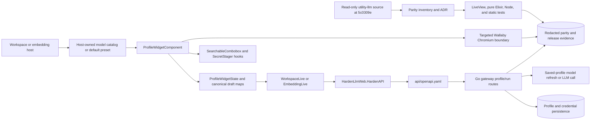

# Harden-LLM Embeddable LLM Widget Utility-Informed Implementation Plan

## 1. Title and metadata

- Project name: `harden-llm`
- Version: `1.0.0`
- Owners: Harden-LLM frontend maintainers, gateway/API maintainers, and release maintainers
- Date: 2026-08-25
- Document ID: `PLAN-HLLM-WIDGET-PARITY-001`
- Repository baseline: `10b96a4d2ffee76c615199c53243bf67a15f6174` on `main`
- Read-only source baseline: `/home/kirill/p/utility-llm` at `5c0309e2508dc5b7a87d0880c8d794123353c5b0`
- Canonical source surfaces: `/home/kirill/p/utility-llm/src/react/index.js`, `/home/kirill/p/utility-llm/src/react/editable-combobox.js`, `/home/kirill/p/utility-llm/src/react/styles.css`, and `/home/kirill/p/utility-llm/examples/react-trace-studio/src/App.jsx`
- Hardened target surfaces: `frontend/lib/harden_llm_web/live/profile_widget_component.ex`, `frontend/lib/harden_llm_web/live/workspace_live.ex`, `frontend/lib/harden_llm_web/live/embedding_live.ex`, `frontend/lib/harden_llm_web/live/profiles_live.ex`, `frontend/assets/js/app.js`, `frontend/assets/js/client_core.mjs`, and `frontend/assets/css/app.css`

This plan uses the read-only `utility-llm` reference to consider useful
capabilities, failure modes, accessibility decisions, and embedding behavior;
it does not require an exact feature or pixel copy. The Harden-LLM embeddable
LLM widget retains the Phoenix LiveView, Go REST, server-side credential, and
no-tabs architecture. The work covers compact-row semantics, nested folds,
credential and identity ownership, fallback and bundle actions, option/retry
data preservation, draft event ownership, saved-profile model refresh,
host-owned model catalogs with a default preset fallback, custom combobox
behavior, reusable DOM/CSS, multi-instance embedding, targeted browser
boundaries, documentation, and release evidence. The provider library, gateway
retry engine, persistent profile storage, authentication model, and public run
contract remain owned by their existing layers; provider discovery is a
host/backend responsibility rather than a widget catalog subsystem.

This is standards-informed planning using ISO/IEC/IEEE 29148 requirements
traceability, ISO/IEC/IEEE 29119-3 test identification, and ISO/IEC/IEEE 12207
lifecycle evidence. It is not a claim of ISO/IEEE, FAA, or DO-178C compliance.

## 2. Design consensus and trade-offs

| Topic | Verdict | Rationale |
| --- | --- | --- |
| Utility-informed target | DECISION | Utility-llm is a capability and failure-mode reference. Harden-LLM adopts required observable behavior, data semantics, accessibility, and embedding lessons without copying every feature, React/Downshift implementation detail, Firebase integration, provider call, or pixel value. |
| No tabs | DECISION | The widget is a reusable visual component. The main configuration and nested escalation configuration remain in-flow folds inside one component; page navigation is owned by the host, not the widget. |
| LiveView state ownership | FOR | `ProfileWidgetComponent`, `WorkspaceLive`, `EmbeddingLive`, and `HardenAPI` already own server-side state and REST boundaries. LiveViewTest can cover fold, cache, profile, retry, upload, save, and parent-message behavior without Chromium. |
| Browser rendering scope | DECISION | Chromium is retained only for native focus, LiveSocket patching, file-input, secret-staging, responsive overflow, and multi-instance boundaries. It is not used for every fold or profile permutation, and it is classified in a separate expensive tier. |
| Happy DOM or jsdom | AGAINST | The existing dependency-free `frontend/assets/js/client_core.mjs` already isolates pure decisions and Node's built-in `node:test` runs them cheaply. A synthetic DOM would add a dependency without proving Phoenix LiveSocket patches, CSS layout, native file inputs, or real browser focus. |
| New JavaScript runtime dependency | AGAINST | `frontend/mix.exs` and `frontend/assets` currently have no package manifest. Adding React, Downshift, Happy DOM, jsdom, Vitest, or Jest would create a second frontend runtime and conflict with the LiveView ownership boundary. |
| Credential metadata in the widget | AGAINST | Utility exposes write-only replacement-key behavior and stored-key status, not credential IDs or storage scope. Credential IDs and scope remain backend-owned; an administrative credential editor is outside this widget. |
| Provider capability identity controls | AGAINST | The current identity fold makes ordinary use differ from utility and permits inconsistent metadata. Provider family and capability flags are derived or validated by the backend; they are not ordinary widget inputs. |
| Cache semantics | DECISION | `cache` and `refresh` are the two canonical UI states. Cache is pressed; refresh is unpressed and overwrites the saved response after a successful fresh run. Legacy `off` values are normalized at the existing boundary. |
| Options source of truth | DECISION | The raw default-options object is canonical. Visible scalar fields are projections that update one key at a time and preserve unknown provider options. |
| Retry defaults | DECISION | Enabled retry defaults are omitted from serialized options, disabled retry controls serialize explicit `false`, and structured-repair transitions preserve unknown nested fields. This matches utility's map operations and keeps imported bundles stable. |
| Draft state persistence | DECISION | Ordinary text and numeric edits remain component-local until blur or an explicit action. The parent receives committed runtime state, not one workspace-state write per keystroke. |
| Save-before-run safety | DECISION | Hardened keeps the existing save gate for endpoint, credential, fallback, inference, and identity changes because `/api/v1/run` executes a saved profile. The UI makes the dirty state and required save action explicit. Removing the gate requires a separately validated ephemeral-run contract. |
| Model refresh | DECISION | Refresh uses the saved profile and stored credential only. Dirty endpoint or credential changes require Save before Refresh Models; no draft-refresh request body or transient refresh credential path is added. |
| Model catalog | DECISION | The host owns the `{id, label?}` model catalog. Harden-LLM defaults are used only when no host catalog is supplied; provider discovery belongs to the host/backend. The current selected ID remains visible as unlisted/custom if omitted. |
| Visual acceptance | DECISION | Require structural, semantic, accessibility, and practical utility-informed parity. Do not add a pixel-snapshot matrix; targeted browser checks cover only native boundaries. |
| Browser tier | DECISION | Keep one dedicated targeted Chromium tier separate from cheap tests. It runs in CI/release or explicitly, while cheap tests never start Chromium. |
| Release promotion | DECISION | Build an immutable artifact from the merged SHA, deploy it to a verification/staging target, run the deployed canary, then promote the same artifact to production without rebuilding. |
| Action busy state | DECISION | Main and escalation actions use independent action keys. Saving one profile does not unnecessarily disable unrelated nested controls. |
| Profile delete confirmation | DECISION | The inline confirmation remains because it protects a destructive profile action in a reusable component. Its state is made host-scoped and tested as an intentional hardened adaptation. |
| Source checkout ownership | DECISION | `/home/kirill/p/utility-llm` is read-only. No source file, secret, live output, or encrypted credential material is copied into Harden-LLM. |
| Test hierarchy | DECISION | Cheap deterministic LiveView, pure Elixir, Node, and static tests guide implementation. Focused Chromium and full release/deployed tests are later boundary gates. |

## 3. PRD / stakeholder and system needs

### Problem

The current Harden-LLM widget has the broad control inventory of utility-llm,
but users experience different practical behavior. The cache button reports the
wrong pressed state, an extra identity fold exposes backend metadata, the
credential drawer exposes storage fields, model refresh and provider discovery
have unclear ownership, profile edits are round-tripped too frequently, retry JSON can lose
unknown fields, fallback and import controls behave differently, model search
has a narrower catalog, and Phoenix field markup does not produce the utility
visual contract. These differences make the component harder to reuse and can
cause data loss or confusing run behavior.

### Users

- Developers embedding the widget in a larger application without tabs.
- Operators configuring provider-neutral LLM profiles and nested repair profiles.
- Coding agents using cheap deterministic tests during frequent edits.
- Maintainers reviewing profile data, security boundaries, and parity evidence.
- Release operators certifying the merged and deployed frontend image.

### Value

- One predictable visual component that can be embedded in Workspace, Embedding,
  or a future host without page-specific assumptions.
- Fewer accidental profile mutations and fewer confusing save/refresh states.
- Stable imported/exported profile JSON with preserved unknown options.
- Broad low-cost test feedback before targeted browser or deployment checks.
- Clear evidence separating intentional self-hosted adaptations from parity gaps.

### Business goals

- Make the compact row and every ordinary unfolded stage behave like utility-llm.
- Make profile edits safe for repeated use and independent across embedded instances.
- Preserve all provider options and retry policy data during UI edits.
- Keep the normal widget free of backend storage metadata and provider capability plumbing.
- Keep the common edit loop in ExUnit/Node/static tests, with one targeted browser boundary.
- Ship only a merged, tested, and runtime-verified frontend release.

### Success metrics

- Every utility widget affordance is classified as `aligned`, `adapted`, or
  `changed-by-decision` in `docs/utility-llm-frontend-parity-inventory.md`.
- The compact row has exactly the utility-visible category, profile picker,
  reasoning control, cache control, and configuration control; it has no tab
  navigation and no ordinary identity fold.
- Cache mode reports `aria-pressed="true"` only for cache and uses utility labels
  and descriptions for both states.
- The normal credential drawer renders status and replacement-key behavior only;
  no credential ID, scope, API key, or staged secret is rendered after staging.
- Editing a text or numeric profile field creates zero parent `POST /api/v1/state`
  requests before the commit boundary and at most one request for the committed
  event that requires workspace synchronization.
- An options/retry round trip preserves unknown keys, omits default-true retry
  keys, and retains nested structured-repair fields.
- The host-owned model catalog is rendered without widget-side provider calls;
  Harden-LLM defaults are used only when the host supplies no catalog, and the
  current selected value is never silently lost.
- No full screenshot matrix is required; structural/semantic assertions and one
  targeted browser canary establish practical visual acceptance.
- Two simultaneously rendered widget instances have unique DOM IDs, independent
  fold/cache/action state, and independent upload namespaces.
- No new React, Downshift, Happy DOM, jsdom, Jest, Vitest, or npm runtime
  dependency is introduced.
- Focused deterministic tests pass before browser work; the targeted browser
  canary passes with zero leaked browser sessions or temporary artifacts; the
  release graph and deployed identity agree.

### Scope

In scope:

- `ProfileWidgetComponent` compact row, folds, nested escalation, credentials,
  fallback rows, bundle actions, action state, accessibility attributes, and IDs.
- Pure Elixir state/data transformations for options, retries, fallbacks, host
  model catalog/default selection, current-value retention, draft dirty state,
  and action state.
- `WorkspaceLive`, `EmbeddingLive`, `ProfilesLive`, and `HardenAPI` integration.
- Saved-profile-only `refreshProfileModels` behavior through the existing
  OpenAPI and Go gateway route/service; no draft request body is added.
- `SearchableCombobox`, `client_core.mjs`, and utility-compatible field markup/CSS.
- LiveView, Node, Go HTTP, static boundary, targeted browser, release, and
  deployed verification evidence.
- Parity inventory, ADR, requirements traceability, KER/evaluation records,
  status, and relevant release documentation.

### Non-goals

- Rewriting the Go provider, retry, schema, cache, pricing, authentication, or
  persistent profile subsystems.
- Browser calls directly to providers or the Go API.
- Copying React, Firebase, Downshift, encrypted bundles, live provider output,
  or credentials from utility-llm.
- Adding unsaved draft model refresh or ephemeral draft Run to this plan.
- Letting the reusable widget call providers or own a global model catalog.
- Removing the save-before-run gate without a new validated API contract.
- Adding a synthetic DOM library just to test server-owned LiveView transitions.
- Creating a browser matrix for every profile, model, fold, option, or viewport.
- Redesigning workspace navigation, history, traces, or non-widget page layout.
- Changing the purpose of existing tests to make a phase green.

### Dependencies

- The existing Phoenix dependencies and versions in `frontend/mix.exs`:
  Phoenix `1.8.9`, LiveView `1.2.9`, Req `0.6.1`, Wallaby `0.31.0`, and the
  existing asset compilers.
- The existing Go module, `api/openapi.yaml`, gateway profile service, and
  provider model refresher.
- Node's built-in test runner and the existing `scripts/run-test-tier.mjs`.
- The pinned reference toolchain documented by the repository: Go `1.26.6`,
  Node 22, Elixir `1.20.2`, OTP `28.4.3`, Docker `29+`, and Compose `2.40+`.
- Existing test fixtures in `frontend/test/support/api_fixtures.ex` and
  `frontend/test/support/browser_backend.ex`.
- A local or authorized hosted deployment only for the final release boundary;
  no provider credential is required for the deterministic phases.

### Risks

- A state refactor may accidentally change the saved-profile payload shape.
- A host may omit or incorrectly scope its model catalog, leaving a selected
  model unlisted or unavailable at execution time; the widget must retain the
  selected value and the gateway must remain authoritative at Run time.
- LiveView rerender timing can expose focus or stale-draft regressions that unit
  tests do not see.
- CSS changes can fix the widget while changing unrelated Phoenix core components.
- Removing identity controls without a backend derivation path can leave invalid
  provider capability metadata.
- Shared `id_prefix` or upload names can collide when a host renders two widgets.
- A browser failure may be caused by the pinned image or deployment identity,
  not the widget implementation.
- Timing evidence can be noisy under host load; threshold changes require a
  new ADR and redacted measurement record.

### Assumptions

- `main` is clean and based on the repository baseline before implementation.
- The utility-llm checkout remains available read-only at the recorded revision.
- Existing OpenAPI envelope, authentication, redaction, and profile ownership
  rules remain authoritative; Refresh Models continues to use the existing
  saved-profile operation.
- The current inline delete confirmation is an accepted Hardened adaptation.
- Existing `make test-fast`, `make test-browser`, `make test-release`, and
  `make verify` meanings remain intact and additive changes preserve them.
- No external issue is currently identified in the checkout for this parity
  follow-up; execution records an issue/PR number only if one already exists or
  is explicitly created by the maintainer.

## 4. SRS / canonical requirements

| ID | Type | Requirement | Acceptance criteria |
| --- | --- | --- | --- |
| REQ-001 | func | The compact widget row shall expose the utility control order and labels. | The row contains the category, profile picker, reasoning control, cache control, and configuration control with no tab navigation or extra ordinary controls. |
| REQ-002 | func | The widget shall expose the utility unfolding order for API, credential, model, fallback, options, retry/repair, pricing, and nested escalation configuration. | Each stage opens independently, remains in-flow, and does not close or mutate an unrelated stage or widget instance. |
| REQ-003 | func | Cache mode shall have utility-compatible value, label, tooltip, and pressed-state semantics. | Cache is pressed and reuses an exact saved response; refresh is unpressed and overwrites the saved response after a fresh successful run. |
| REQ-004 | security | Credential editing shall be write-only and storage-metadata-free in the reusable widget. | Existing state renders only configured/not-configured status; replacement input is cleared after staging; API keys, IDs, and scope values never enter rendered HTML or logs. |
| REQ-005 | security | Provider family and capability metadata shall not be ordinary user-editable widget fields. | The backend validates or derives provider/capability values, and the standard widget has no identity fold. |
| REQ-006 | func | Fallback editing shall preserve utility order and movement behavior. | Rows have stable values, Up/Down controls, removal, disabled boundary movement, and validation on save without accidental draft reordering. |
| REQ-007 | func | Profile actions shall match utility action affordances while preserving the hardened delete confirmation. | Import opens one hidden file picker and imports on selection; export, save, delete, and new actions have independent labels and busy states. |
| REQ-008 | data | Default options shall have one canonical JSON map and preserve unknown keys. | Scalar edits update only their key, blank fields delete their key, aliases normalize consistently, and imported unknown options survive save/export. |
| REQ-009 | data | Retry and structured-repair updates shall match utility default and nesting semantics. | Default-true flags are omitted, disabled flags are explicit `false`, parse retry is removed while repair is enabled, and unknown nested fields survive toggles. |
| REQ-010 | reliability | Draft edits shall remain component-owned until a committed event. | Text/numeric input does not write workspace state per keystroke; blur, selection, save, saved-profile refresh, and run boundaries have deterministic parent synchronization. |
| REQ-011 | reliability | The save-before-run safety boundary shall remain explicit and diagnosable. | Dirty endpoint/credential/fallback/inference/identity state prevents an unsafe run and displays the required save action without silently discarding the draft. |
| REQ-012 | int | Model refresh shall use only the saved profile and stored credential. | Refresh uses the existing profile-ID operation; dirty endpoint or credential changes require Save first; success updates only the returned model options, errors preserve the prior list, and no profile/credential state is changed by refresh. |
| REQ-013 | func | Model search shall use a host-owned catalog and Harden-LLM default fallback with utility-informed keyboard behavior. | A supplied host catalog is authoritative; no supplied catalog uses the default preset; the current selected ID remains visible if omitted; options use canonical IDs with optional labels; focus, selection, Escape, blur, and custom commit have stable outcomes. |
| REQ-014 | int | The widget shall emit reusable field and action markup independent of its host page. | `id_prefix`, input names, ARIA IDs, upload names, and parent messages are namespaced; two instances render without duplicate IDs or cross-instance state. |
| REQ-015 | nfr | Utility-compatible CSS shall be scoped to the widget and shall not regress host components. | Field labels, hints, errors, controls, popovers, folds, and action rows use the utility visual contract while unrelated Phoenix components retain their current styles. |
| REQ-016 | security | The frontend shall retain the Phoenix-to-Go ownership boundary. | Only `HardenAPI` invokes Req; the browser never receives provider credentials or bearer tokens; no new frontend persistence/provider/React dependency appears. |
| REQ-017 | perf | Cheap tests shall cover server-owned widget behavior before expensive browser checks. | Focused LiveView, pure Elixir, Node, and static commands are deterministic and offline; Chromium covers only browser-owned behavior. |
| REQ-018 | reliability | Parity evidence shall be traceable through implementation, tests, documentation, merge, staged promotion, and deployment. | Every requirement maps to an executable test; the merged SHA, immutable verification image, promoted production image identity, health probes, authenticated widget behavior, and cleanup evidence agree without rebuilding between verification and production. |

### Error handling and telemetry expectations

- Invalid profile drafts render field-local errors from the existing API error
  envelope and leave the last accepted draft intact.
- Model refresh errors do not replace the prior model list or write a partial
  profile. The user sees a safe validation, credential, provider, or transport
  error without receiving raw provider output. A dirty endpoint or credential
  displays the Save-before-Refresh instruction instead of sending a draft
  request.
- An ambiguous `/api/v1/run` result keeps the existing “refresh History before
  deciding whether to run again” behavior; widget parity work does not add an
  automatic retry.
- Import validation rejects oversized, invalid, or unsupported files through the
  existing upload/controller boundary and clears the file input after success or
  failure.
- Logs and telemetry may contain operation IDs, safe status classes, durations,
  widget prefix, action kind, profile ID only where already permitted, and trace
  ID. They may not contain API keys, passwords, bearer tokens, cookies, raw
  bundles, raw default-options bodies, prompts, provider responses, or process
  environments.
- The existing `HardenAPI` redaction and OpenTelemetry spans remain the only
  REST telemetry boundary. No provider call is initiated by browser JavaScript.

### Architecture diagram



```text
System: Harden-LLM embeddable LLM widget

  Person: embedding application or operator
    uses
      Container: Phoenix host page
        embeds
          Component: ProfileWidgetComponent
            owns Component: compact row and in-flow folds
            owns Component: component-local draft and action state
            calls Component: ProfileWidgetState
            calls Component: SearchableCombobox and SecretStager hooks
            sends committed messages to Container: WorkspaceLive or EmbeddingLive

  Container: WorkspaceLive or EmbeddingLive
    calls
      Component: HardenLlmWeb.HardenAPI
        conforms to
          Component: api/openapi.yaml
            calls
              Container: Go gateway
                owns Component: profile validation, credential vault, persistence,
                model refresh, provider calls, retry policy, and run execution

  External systems:
    utility-llm source checkout is read-only reference material;
    Wallaby/Chromium proves browser-owned boundaries only;
    Postgres/provider state remains outside Phoenix.
```

## 5. Iterative implementation and test plan

### Compute controls

- `branch_limits`: one utility-informed plan, one canonical widget state module,
  one host-owned catalog/default path, one targeted ordinary browser feature,
  and no new DOM dependency.
- `reflection_passes`: two per phase. Pass one checks requirement and test
  completeness; pass two checks ownership boundaries, data preservation,
  accessibility, secret exposure, cleanup, and unnecessary surface area.
- `early_stop%`: 100. Exploration may stop after accepted evidence, but no
  required subtask, red coverage, green coverage, or exit gate may be omitted.
- Deterministic seeds: `104729`, `130363`, and `155921`.
- Focused ExUnit commands use `--seed 104729`; Node tests use the fixed test
  data in their source files; browser fixtures use `frontend/test/support/browser_backend.ex`.

### Phase P00: Parity contract and failing coverage are established

Phase goal: record the current utility-to-Hardened contract and add traceable
failing coverage for every approved parity change before behavior-changing code
is modified.

Scope and objectives:

- Impacted requirements: `REQ-001` through `REQ-018`.
- Classify each current difference as parity defect, intentional adaptation, or
  new API decision.
- Add grep-able traceability tags to every modified/new test file.
- Keep the working tree clean except for the plan and the planned test/doc changes.

Impacted surfaces:

- `docs/utility-llm-frontend-parity-inventory.md`
- `docs/adr/ADR-HLLM-014-embedded-widget-runtime-parity.md`
- `frontend/test/harden_llm_web/live/profile_widget_component_test.exs`
- `frontend/test/harden_llm_web/live/workspace_live_test.exs`
- `frontend/test/harden_llm_web/live/embedding_live_test.exs`
- `frontend/test/harden_llm_web/live/profile_widget_state_test.exs` (created)
- `frontend/assets/test/client_core.test.mjs`
- `frontend/test/browser/widget_canary_test.exs`
- `internal/gateway/resource_routes_test.go`
- `frontend/test/harden_llm_web/harden_api_test.exs`
- `frontend/test/harden_llm_web/boundary_test.exs`

Lifecycle evidence:

- Requirements evidence: parity rows with source path, Hardened path, status,
  decision, and requirement IDs in the inventory.
- Design/code surface evidence: failing tests and decision records for the
  saved-profile refresh boundary, host-owned catalog, visual acceptance,
  browser tier, and staged release promotion.
- Verification method: focused ExUnit, Node, Go, static, and browser commands
  with expected new assertion failures.
- Validation purpose: demonstrate that the tests fail for the currently observed
  differences and not for an unrelated environment problem.
- Configuration checkpoint: current `main` SHA, utility source SHA, toolchain,
  and clean-status output recorded in the execution log.
- Risks and assumptions: no source secret or live provider output is captured;
  failures caused by missing fixtures are corrected before P01.

Plan-and-Solve subtasks:

- `P00.S01 Capture source-to-target parity decisions`
  - Action: Compare the utility `ProfileConfigControl`, `ProfileConfigFields`, `OptionsEditor`, `RetryRepairEditor`, `PricingEditor`, `EndpointCredentialDrawer`, `ProfileActionRow`, `EditableCombobox`, and styles with the current LiveComponent, host LiveViews, hooks, and CSS. Update the parity inventory and ADR-HLLM-014 with explicit status and requirement links; record the saved-refresh, host-catalog, structural-visual, browser-tier, and staged-promotion decisions in the appropriate existing ADRs or focused records without creating a compatibility branch.
  - Why now: All failing assertions and implementation decisions require one canonical observable contract.
  - Files/surfaces: `docs/utility-llm-frontend-parity-inventory.md`, `docs/adr/ADR-HLLM-014-embedded-widget-runtime-parity.md`, `docs/adr/ADR-HLLM-016-widget-draft-and-data-contract.md` (created only if needed), `/home/kirill/p/utility-llm/src/react/index.js`, `/home/kirill/p/utility-llm/src/react/editable-combobox.js`, `/home/kirill/p/utility-llm/src/react/styles.css`.
  - Requirement link: `REQ-001` through `REQ-018`.
  - Verification link: `EVAL-101`.
  - Verification mode: `VERIFY`.
  - Command/procedure: `N/A` for bounded source inspection; record both Git SHAs and a parity matrix with zero unclassified rows.
  - Expected result: Every planned behavior has one requirement and one status; the save gate, server credentials, no-tabs topology, and no-synthetic-DOM decision are recorded as intentional boundaries.
  - Evidence produced: Updated inventory/ADR diff and a redacted parity matrix in the execution log.
  - Stop/escalate condition: Stop if the utility source revision changes during the phase or if a proposed adaptation would require a hidden provider/catalog owner or an unbounded browser/release surface.
  - Unlocks: `P00.S02` through `P00.S15`.

- `P00.S02 Add failing compact, fold, and credential coverage`
  - Action: Add `TEST-101`, `TEST-102`, and `TEST-103` assertions for exact compact-row labels/ARIA state, no tabs/no identity metadata, all ordinary and nested folds, disabled fold controls, write-only credentials, and staged-key clearing. Add `# PLAN-HLLM-WIDGET-PARITY-001 TEST-101`-style tags to the ExUnit test cases or file headers.
  - Why now: P01 cannot change the visible component until the current cache, identity, fold, and credential differences are captured as red tests.
  - Files/surfaces: `frontend/test/harden_llm_web/live/profile_widget_component_test.exs`, `frontend/test/harden_llm_web/live/workspace_live_test.exs`.
  - Requirement link: `REQ-001`, `REQ-002`, `REQ-003`, `REQ-004`, `REQ-005`, `REQ-011`.
  - Verification link: `TEST-101`, `TEST-102`, `TEST-103`.
  - Verification mode: `RED`.
  - Command/procedure: `cd frontend && mix test test/harden_llm_web/live/profile_widget_component_test.exs test/harden_llm_web/live/workspace_live_test.exs --seed 104729`.
  - Expected result: The new assertions fail on the known current `aria-pressed`, label, identity, credential metadata, disabled-fold, or secret-rendering differences; existing unrelated assertions do not fail.
  - Evidence produced: Tagged ExUnit diff and captured failure output with no secret values.
  - Stop/escalate condition: Stop if a failure requires a provider call, a browser session, or a changed assertion oracle.
  - Unlocks: `P01.S01`, `P01.S02`, and `P01.S03`.

- `P00.S03 Add failing canonical options and retry coverage`
  - Action: Create `frontend/test/harden_llm_web/live/profile_widget_state_test.exs` with tagged failing fixtures for unknown options, unknown nested repair keys, legacy aliases, default retry values, and blank-field deletion. The assertions describe the utility map semantics without implementing the production transformation yet.
  - Why now: P02.S01 changes the data source of truth and must have a pure red oracle first.
  - Files/surfaces: `frontend/test/harden_llm_web/live/profile_widget_state_test.exs`, `frontend/lib/harden_llm_web/profile_widget_state.ex` (expected missing production surface).
  - Requirement link: `REQ-008`, `REQ-009`.
  - Verification link: `TEST-105`.
  - Verification mode: `RED`.
  - Command/procedure: `cd frontend && mix test test/harden_llm_web/live/profile_widget_state_test.exs --seed 104729`.
  - Expected result: The new test fails because the canonical transformation module or utility-compatible behavior is not yet present; the failure identifies the intended map operation rather than a provider call.
  - Evidence produced: Tagged ExUnit failure and fixture table.
  - Stop/escalate condition: Stop if the test needs private callbacks or a live credential.
  - Unlocks: `P02.S01`.

- `P00.S04 Add failing fallback and profile-action coverage`
  - Action: Add tagged failing cases for fallback boundaries, bundle action markup, automatic import completion, independent action state, and the retained delete confirmation.
  - Why now: P02.S02 changes visible fallback/action behavior and must preserve the reusable upload namespace.
  - Files/surfaces: `frontend/test/harden_llm_web/live/profile_widget_component_test.exs`, `frontend/test/harden_llm_web/live/workspace_live_test.exs`.
  - Requirement link: `REQ-006`, `REQ-007`, `REQ-014`.
  - Verification link: `TEST-104`.
  - Verification mode: `RED`.
  - Command/procedure: `cd frontend && mix test test/harden_llm_web/live/profile_widget_component_test.exs test/harden_llm_web/live/workspace_live_test.exs --seed 104729`.
  - Expected result: New assertions fail on visible list numbering/arrow controls, boundary enablement, separate import action, or shared pending state.
  - Evidence produced: Tagged ExUnit failure output and upload fixture record.
  - Stop/escalate condition: Stop if upload assertions require reading bundle bytes in JavaScript.
  - Unlocks: `P02.S02`.

- `P00.S05 Add failing draft ownership and save-gate coverage`
  - Action: Add tagged LiveView cases that count `POST /api/v1/state` calls during text/numeric editing and assert the dirty/save-before-run behavior for endpoint, credential, fallback, and inference changes.
  - Why now: P02.S03 changes parent synchronization and must retain the hardened runtime safety boundary.
  - Files/surfaces: `frontend/test/harden_llm_web/live/workspace_live_test.exs`.
  - Requirement link: `REQ-010`, `REQ-011`, `REQ-016`.
  - Verification link: `TEST-106`, `TEST-107`.
  - Verification mode: `RED`.
  - Command/procedure: `cd frontend && mix test test/harden_llm_web/live/workspace_live_test.exs --seed 104729`.
  - Expected result: New request-count or dirty-state assertions fail against the current per-change parent persistence or insufficient save affordance.
  - Evidence produced: Req.Test request-count failure and rendered-state failure.
  - Stop/escalate condition: Stop if the test requires changing the `/api/v1/run` contract.
  - Unlocks: `P02.S03`.

- `P00.S06 Add failing gateway saved-profile refresh coverage`
  - Action: Add tagged Go HTTP cases for saved-profile model refresh success, profile/credential immutability, missing stored credential, provider failure, safe error normalization, and the ID-only request contract.
  - Why now: P03.S01 preserves the existing gateway operation and needs a red contract for the saved-only decision before implementation.
  - Files/surfaces: `internal/gateway/resource_routes_test.go`, `api/openapi.yaml` request schema location.
  - Requirement link: `REQ-012`, `REQ-016`.
  - Verification link: `TEST-108`.
  - Verification mode: `RED`.
  - Command/procedure: `go test -tags=integration ./internal/gateway/... -run TestResourceRoutes -count=1`.
  - Expected result: The saved-profile cases fail only where the current refresh behavior or error contract differs; no draft request-body fixture is introduced.
  - Evidence produced: Tagged Go failure output and request/response fixture data without secrets.
  - Stop/escalate condition: Stop if refresh mutates profile/credential state or requires a second request schema.
  - Unlocks: `P03.S01`.

- `P00.S07 Add failing Phoenix saved-refresh and dirty-boundary coverage`
  - Action: Add tagged Req.Test and LiveView assertions for the ID-only saved-profile refresh call, model-list error preservation, Save-before-Refresh behavior when endpoint/credential fields are dirty, and absence of the staged key from rendered state.
  - Why now: P03.S02 wires the existing saved refresh operation through the component and makes the decision visible to the user.
  - Files/surfaces: `frontend/test/harden_llm_web/harden_api_test.exs`, `frontend/test/harden_llm_web/live/workspace_live_test.exs`.
  - Requirement link: `REQ-007`, `REQ-012`, `REQ-016`.
  - Verification link: `TEST-109`.
  - Verification mode: `RED`.
  - Command/procedure: `cd frontend && mix test test/harden_llm_web/harden_api_test.exs test/harden_llm_web/live/workspace_live_test.exs --seed 104729`.
  - Expected result: The dirty-boundary or saved-refresh assertions fail against the current UI where behavior is incomplete; no draft body is expected.
  - Evidence produced: Tagged Req.Test failure output and redacted body assertions.
  - Stop/escalate condition: Stop if the fixture must contain a real provider key.
  - Unlocks: `P03.S02`.

- `P00.S08 Add failing host-catalog and embedding coverage`
  - Action: Add tagged pure/state and embedding cases for a supplied host catalog, Harden-LLM default fallback when no catalog is supplied, canonical IDs with optional labels, current selected-model retention, and separate primary/escalation option lists.
  - Why now: P03.S03 changes model-option construction and host assigns.
  - Files/surfaces: `frontend/test/harden_llm_web/live/profile_widget_state_test.exs`, `frontend/test/harden_llm_web/live/embedding_live_test.exs`.
  - Requirement link: `REQ-013`, `REQ-014`.
  - Verification link: `TEST-110`.
  - Verification mode: `RED`.
  - Command/procedure: `cd frontend && mix test test/harden_llm_web/live/profile_widget_state_test.exs test/harden_llm_web/live/embedding_live_test.exs --seed 104729`.
  - Expected result: New host/default/current-value or host-propagation assertions fail against the current narrow list or implicit catalog behavior.
  - Evidence produced: Tagged ExUnit failure output and fixed model fixture.
  - Stop/escalate condition: Stop if the widget must persist labels, aliases, source metadata, or provider discovery state to satisfy the host contract.
  - Unlocks: `P03.S03`.

- `P00.S09 Add failing pure combobox coverage`
  - Action: Add tagged Node cases for current-value selection, known/custom commit, Escape, blur, filtering, and highlight decisions using only plain values.
  - Why now: P03.S04 changes the lightweight hook/core contract and must not introduce a DOM dependency.
  - Files/surfaces: `frontend/assets/test/client_core.test.mjs`, `frontend/assets/js/client_core.mjs` expected extension.
  - Requirement link: `REQ-013`, `REQ-016`.
  - Verification link: `TEST-111`.
  - Verification mode: `RED`.
  - Command/procedure: `node --test frontend/assets/test/client_core.test.mjs`.
  - Expected result: New utility-parity decision cases fail while existing pure client cases remain diagnostic.
  - Evidence produced: Tagged Node failure output.
  - Stop/escalate condition: Stop if a pure case needs `document`, `window`, or a package import.
  - Unlocks: `P03.S04`.

- `P00.S10 Add failing field DOM coverage`
  - Action: Add tagged LiveView assertions for utility field classes, labels, hints, errors, ARIA relationships, and action-row structure.
  - Why now: P04.S01 changes rendering/CSS and needs a cheap structural oracle.
  - Files/surfaces: `frontend/test/harden_llm_web/live/profile_widget_component_test.exs`.
  - Requirement link: `REQ-001`, `REQ-002`, `REQ-015`.
  - Verification link: `TEST-112`.
  - Verification mode: `RED`.
  - Command/procedure: `cd frontend && mix format --check-formatted && mix test test/harden_llm_web/live/profile_widget_component_test.exs --seed 104729`.
  - Expected result: New structural assertions fail against Phoenix core wrappers or current widget markup.
  - Evidence produced: Tagged LiveView failure output.
  - Stop/escalate condition: Stop if a field assertion can only be proven by a browser screenshot.
  - Unlocks: `P04.S01`.

- `P00.S11 Add failing frontend boundary coverage`
  - Action: Add tagged static assertions for the frontend ownership/dependency boundary, pure client module, write-only secret handling, and absence of React/DOM test dependencies.
  - Why now: P04.S04 changes boundary assertions and rendering debt after the component implementation is green.
  - Files/surfaces: `frontend/test/harden_llm_web/boundary_test.exs`, `frontend/assets/js/client_core.mjs`, `frontend/assets/js/app.js`.
  - Requirement link: `REQ-015`, `REQ-016`, `REQ-017`.
  - Verification link: `TEST-115`.
  - Verification mode: `RED`.
  - Command/procedure: `cd frontend && mix test test/harden_llm_web/boundary_test.exs --seed 104729`.
  - Expected result: New boundary assertions fail only for the missing widget-specific ownership rule or missing pure-client behavior.
  - Evidence produced: Tagged static ExUnit failure output.
  - Stop/escalate condition: Stop if the boundary test needs a browser or network call.
  - Unlocks: `P04.S04`.

- `P00.S12 Add failing multi-instance namespace coverage`
  - Action: Add tagged embedding assertions for unique IDs, names, ARIA references, upload names, and independent parent messages across two widget instances.
  - Why now: P04.S02 changes the reusable component contract and host integration.
  - Files/surfaces: `frontend/test/harden_llm_web/live/embedding_live_test.exs`, `frontend/lib/harden_llm_web/live/embedding_live.ex` host surface.
  - Requirement link: `REQ-014`, `REQ-016`.
  - Verification link: `TEST-113`.
  - Verification mode: `RED`.
  - Command/procedure: `cd frontend && mix test test/harden_llm_web/live/embedding_live_test.exs test/harden_llm_web/live/workspace_live_test.exs --seed 104729`.
  - Expected result: New namespace or independence assertions fail if the current shared names/assigns cross instances.
  - Evidence produced: Tagged embedding failure output.
  - Stop/escalate condition: Stop if the test requires a global DOM lookup or shared component state.
  - Unlocks: `P04.S02`.

- `P00.S13 Add failing targeted browser coverage`
  - Action: Extend the existing widget canary with focus/select, LiveSocket patch, import, secret staging, cache/fold independence, mobile overflow, unique IDs, and cleanup assertions.
  - Why now: P04.S03 is the only planned behavior-changing subtask that depends on native browser behavior.
  - Files/surfaces: `frontend/test/browser/widget_canary_test.exs`, `frontend/test/support/browser_backend.ex`.
  - Requirement link: `REQ-003`, `REQ-004`, `REQ-007`, `REQ-013`, `REQ-014`, `REQ-015`, `REQ-017`.
  - Verification link: `TEST-114`.
  - Verification mode: `RED`.
  - Command/procedure: `cd frontend && mix test --only browser test/browser/widget_canary_test.exs`.
  - Expected result: New assertions fail on current native behavior or markup differences; existing browser fixture setup remains available.
  - Evidence produced: Tagged Wallaby failure output with no screenshot retained on failure unless needed for diagnosis.
  - Stop/escalate condition: Stop if the browser image/toolchain is unavailable; record infrastructure status instead of changing an oracle.
  - Unlocks: `P04.S03`.

- `P00.S14 Add failing plan traceability coverage`
  - Action: Add a machine-readable static test that checks this plan's requirement/test/path/command references and test traceability tags.
  - Why now: Later phases must not leave a green implementation without lifecycle traceability.
  - Files/surfaces: `scripts/test/widget_parity_traceability_test.mjs` (created).
  - Requirement link: `REQ-016`, `REQ-018`.
  - Verification link: `TEST-116`.
  - Verification mode: `RED`.
  - Command/procedure: `node --test scripts/test/widget_parity_traceability_test.mjs`.
  - Expected result: The new traceability test fails until all referenced files, tags, and commands exist.
  - Evidence produced: Tagged Node static failure output.
  - Stop/escalate condition: Stop if satisfying traceability requires changing an existing test oracle.
  - Unlocks: `P05.S01`.

- `P00.S15 Add failing cheap-tier policy coverage`
  - Action: Add the widget task classification or static assertions needed to prove the existing fast selection remains offline, credential-free, and free of browser/Compose work.
  - Why now: P05.S02 records the cheap-loop acceptance and must have a direct policy oracle.
  - Files/surfaces: `test/test-tiers.json` only if needed, `scripts/verify-test-tiers.mjs` only if its existing contract needs a narrowly scoped assertion.
  - Requirement link: `REQ-017`.
  - Verification link: `TEST-117`.
  - Verification mode: `RED`.
  - Command/procedure: `node scripts/verify-test-tiers.mjs`.
  - Expected result: The new widget tier policy assertion fails only if the selected task is misclassified or a forbidden resource enters the fast lane.
  - Evidence produced: Tagged manifest-validator failure output or an explicit no-manifest-change result.
  - Stop/escalate condition: Stop if satisfying the policy requires changing the meaning of `make test-fast`.
  - Unlocks: `P05.S02`.

Phase exit gate:

- Proceed when source decisions are recorded, all planned behavior-changing
  requirements have tagged red coverage, no secret appears in test output, and
  the existing unrelated test baseline is green.
- Escalate when host catalog ownership or saved-refresh credential ownership
  cannot be resolved without expanding the Run contract.
- Stop when a test can pass only by weakening an existing oracle or skipping the
  utility behavior it claims to cover.

Phase metrics:

- Confidence: 90%; the source and target surfaces are directly identified.
- Long-term robustness: 92%; red tests make later regressions visible.
- Internal interactions: 4; source, docs, tests, and existing tier manifest.
- External interactions: 0; no provider or deployment access.
- Complexity: 35%; test and contract inventory only.
- Feature creep: 4%; only the explicitly selected host/default and release-boundary decisions are included.
- Technical debt: 8%; temporary red assertions are removed only by green implementation, not deletion.
- YAGNI score: 8/10; no synthetic DOM or new runtime is added.
- MoSCoW: Must; parity contracts and red coverage are prerequisites for every later implementation phase.
- Local/non-local scope: 100% local; this phase changes the repository plan and test inventory only.
- Architectural changes count: 0; no runtime boundary is changed before failing coverage exists.

### Phase P01: Compact row and ordinary folds match utility behavior

Phase goal: make the standard widget visually and semantically match utility's
compact row and fold topology while retaining LiveView ownership.

Scope and objectives:

- Impacted requirements: `REQ-001` through `REQ-005`, `REQ-014`, `REQ-015`.
- Correct cache state reporting and exact utility labels/tooltips.
- Remove the ordinary identity fold and credential storage metadata.
- Make all fold controls honor disabled/busy state and remove dead fold assigns.
- Preserve nested escalation folding without introducing tabs.

Impacted surfaces:

- `frontend/lib/harden_llm_web/live/profile_widget_component.ex`
- `frontend/lib/harden_llm_web/live/workspace_live.ex`
- `frontend/lib/harden_llm_web/live/embedding_live.ex`
- `frontend/test/harden_llm_web/live/profile_widget_component_test.exs`
- `frontend/test/harden_llm_web/live/workspace_live_test.exs`

Lifecycle evidence:

- Requirements evidence: compact/fold rows and accepted identity/credential
  ownership decisions in the parity inventory.
- Design/code surface evidence: component diff removes identity fields and
  dead state while preserving provider-derived capability guards.
- Verification method: same commands as P00 red coverage, now green.
- Validation purpose: prove ordinary interaction is utility-compatible and the
  safety boundary remains intact.
- Configuration checkpoint: no new dependency or browser tier.
- Risks and assumptions: CSS is not fully changed in this phase; markup changes
  remain scoped to widget selectors.

Plan-and-Solve subtasks:

- `P01.S01 Implement utility cache labels and pressed semantics`
  - Action: Normalize cache mode at the compact-row boundary; render `Use cache` with `aria-pressed="true"` and the utility reuse tooltip, and render `Overwrite cache on next run` with `aria-pressed="false"` and the utility fresh-run tooltip. Preserve legacy-value migration in the existing boundary.
  - Why now: The current pressed-state expression reports refresh as pressed, making the primary control semantically wrong.
  - Files/surfaces: `frontend/lib/harden_llm_web/live/profile_widget_component.ex`, `frontend/test/harden_llm_web/live/profile_widget_component_test.exs`.
  - Requirement link: `REQ-001`, `REQ-003`.
  - Verification link: `TEST-101`.
  - Verification mode: `GREEN`.
  - Command/procedure: `cd frontend && mix test test/harden_llm_web/live/profile_widget_component_test.exs test/harden_llm_web/live/workspace_live_test.exs --seed 104729`.
  - Expected result: `TEST-101` passes for both cache and refresh, including exact labels, tooltip text, and ARIA state.
  - Evidence produced: Component diff and green tagged ExUnit output.
  - Stop/escalate condition: Stop if the fix changes the backend `cacheMode` contract or makes legacy `off` reach `/api/v1/run`.
  - Unlocks: `P01.S02`.

- `P01.S02 Remove ordinary identity and credential metadata controls`
  - Action: Remove visible Profile identity, Provider family, Supports temperature, Supports contracted structured output, Credential ID, and Credential scope fields from the reusable widget. Keep backend payload fields and capability-aware control disabling/stripping in server state. Render only credential status and replacement-key actions.
  - Why now: These controls are the largest practical workflow difference and expose backend-owned data in an embeddable component.
  - Files/surfaces: `frontend/lib/harden_llm_web/live/profile_widget_component.ex`, `frontend/lib/harden_llm_web/live/profiles_live.ex`, `frontend/test/harden_llm_web/live/profile_widget_component_test.exs`, `frontend/test/harden_llm_web/live/workspace_live_test.exs`.
  - Requirement link: `REQ-002`, `REQ-004`, `REQ-005`, `REQ-016`.
  - Verification link: `TEST-102`, `TEST-103`.
  - Verification mode: `GREEN`.
  - Command/procedure: `cd frontend && mix test test/harden_llm_web/live/profile_widget_component_test.exs test/harden_llm_web/live/workspace_live_test.exs --seed 104729`.
  - Expected result: Ordinary and escalation editors retain required server fields but no longer render storage metadata or identity controls; staged keys disappear from HTML.
  - Evidence produced: Tagged LiveView output assertions and redaction test output.
  - Stop/escalate condition: Escalate if backend validation requires a user-edited capability flag; add an explicit backend derivation rule before hiding the field.
  - Unlocks: `P01.S03`.

- `P01.S03 Gate every fold event and remove dead fold state`
  - Action: Apply `fold_disabled` to compact and nested configuration events, remove unused fallback-open and duplicate escalation-cache assigns, keep fallback rows always visible as in utility, and retain independent nested fold assigns for options/retry/pricing.
  - Why now: A disabled gear or stale fold assign makes the widget state diverge during asynchronous actions and causes future edits to target nonexistent UI.
  - Files/surfaces: `frontend/lib/harden_llm_web/live/profile_widget_component.ex`, `frontend/test/harden_llm_web/live/profile_widget_component_test.exs`.
  - Requirement link: `REQ-002`, `REQ-014`.
  - Verification link: `TEST-102`.
  - Verification mode: `GREEN`.
  - Command/procedure: `cd frontend && mix test test/harden_llm_web/live/profile_widget_component_test.exs test/harden_llm_web/live/workspace_live_test.exs --seed 104729`.
  - Expected result: Configuration and nested escalation toggles do nothing while disabled; all expected folds still open independently when enabled.
  - Evidence produced: Event-handler diff and green fold-state assertions.
  - Stop/escalate condition: Stop if removing an assign changes the persisted host state rather than only component-local fold state.
  - Unlocks: `P01.S04`.

- `P01.S04 Consolidate compact and fold rendering helpers`
  - Action: Refactor repeated main/escalation compact and fold markup into small function components or data-driven helpers without changing selectors, IDs, event names, or accessible labels.
  - Why now: The preceding fixes touch duplicated main/escalation markup; leaving two divergent implementations would recreate the parity defect.
  - Files/surfaces: `frontend/lib/harden_llm_web/live/profile_widget_component.ex`, `frontend/test/harden_llm_web/live/profile_widget_component_test.exs`.
  - Requirement link: `REQ-001`, `REQ-002`, `REQ-014`.
  - Verification link: `TEST-101`, `TEST-102`, `TEST-103`.
  - Verification mode: `REFACTOR`.
  - Command/procedure: `cd frontend && mix test test/harden_llm_web/live/profile_widget_component_test.exs test/harden_llm_web/live/workspace_live_test.exs --seed 104729`.
  - Expected result: Both widget kinds use one consistent rendering path, formatting is clean, and tagged tests remain green.
  - Evidence produced: Reduced duplication diff and focused test output.
  - Stop/escalate condition: Stop if helper extraction changes host callback ownership or makes `id_prefix` optional for an embedded instance.
  - Unlocks: `P02.S01`.

Phase exit gate:

- Proceed when `TEST-101` through `TEST-103` pass with no identity fold,
  credential metadata, cache-state discrepancy, or disabled-fold discrepancy.
- Escalate if provider capability values cannot be derived or validated without
  exposing them as ordinary widget inputs.
- Stop if a markup simplification introduces duplicate IDs or changes an API
  payload rather than the rendered component.

Phase metrics:

- Confidence: 92%; direct compact/fold red coverage makes the visual and state decisions high confidence.
- Long-term robustness: 90%; shared rendering helpers and state guards reduce future parity drift.
- Internal interactions: 3; the component, host LiveViews, and focused tests interact within one frontend boundary.
- External interactions: 0; no API, provider, credential, or deployment boundary changes in this phase.
- Complexity: 30%; the work is a scoped LiveView markup and state cleanup.
- Feature creep: 3%; no new product surface is introduced.
- Technical debt: 5%; helper extraction removes duplicate paths while preserving existing callbacks.
- YAGNI score: 9/10; no new framework, persistence layer, or browser runtime is added.
- MoSCoW: Must; cache semantics and fold topology are core user-visible parity requirements.
- Local/non-local scope: 100% local frontend; no external contract is changed.
- Architectural changes count: 0; the existing LiveView component boundary remains in place.

### Phase P02: Draft, options, retry, fallback, and action state are utility-compatible

Phase goal: make component-local draft state and profile data transformations
preserve utility semantics without weakening the hardened save boundary.

Scope and objectives:

- Impacted requirements: `REQ-006` through `REQ-011`, `REQ-016`.
- Introduce one canonical options/retry/fallback state transformation surface.
- Stop per-keystroke parent state persistence while retaining committed runtime updates.
- Align fallback movement, import, action labels, busy state, and save-gate feedback.

Impacted surfaces:

- `frontend/lib/harden_llm_web/profile_widget_state.ex` (created)
- `frontend/lib/harden_llm_web/live/profile_widget_component.ex`
- `frontend/lib/harden_llm_web/live/profiles_live.ex`
- `frontend/lib/harden_llm_web/live/workspace_live.ex`
- `frontend/lib/harden_llm_web/live/embedding_live.ex`
- `frontend/test/harden_llm_web/live/profile_widget_state_test.exs`
- `frontend/test/harden_llm_web/live/profile_widget_component_test.exs`
- `frontend/test/harden_llm_web/live/workspace_live_test.exs`

Lifecycle evidence:

- Requirements evidence: canonical map invariants and event ownership rules in
  the parity inventory and ADR-HLLM-016.
- Design/code surface evidence: pure state module, explicit commit events,
  action-key map, and component-local draft state.
- Verification method: pure ExUnit plus LiveView event tests, same commands for
  red and green cases.
- Validation purpose: prove no options/retry data loss and no noisy state writes.
- Configuration checkpoint: no browser or provider access.
- Risks and assumptions: existing API payload shape remains unchanged except for
  explicitly documented canonical serialization; P03 preserves the existing
  saved-profile refresh contract and adds no draft request body.

Plan-and-Solve subtasks:

- `P02.S01 Add canonical profile widget state transformations`
  - Action: Create `HardenLlmWeb.ProfileWidgetState` with pure functions for options parsing/patching, retry/repair toggles, fallback row movement, model-option merging, cache normalization, and draft dirty classification. Preserve unknown map keys, omit default-true retry keys, serialize explicit false values, remove parse retry while repair is enabled, and retain nested repair keys.
  - Why now: All later LiveView handlers need one deterministic transformation surface instead of parallel scalar/raw JSON logic.
  - Files/surfaces: `frontend/lib/harden_llm_web/profile_widget_state.ex`, `frontend/lib/harden_llm_web/live/profiles_live.ex`, `frontend/test/harden_llm_web/live/profile_widget_state_test.exs`.
  - Requirement link: `REQ-006`, `REQ-008`, `REQ-009`.
  - Verification link: `TEST-105`.
  - Verification mode: `GREEN`.
  - Command/procedure: `cd frontend && mix test test/harden_llm_web/live/profile_widget_state_test.exs --seed 104729`.
  - Expected result: Unknown options and nested retry fields survive every table-driven transformation; utility-compatible JSON is produced for defaults, false toggles, repair enable/disable, aliases, and blanks.
  - Evidence produced: Pure module, tagged fixture tables, and green ExUnit output.
  - Stop/escalate condition: Stop if preserving unknown fields conflicts with the OpenAPI `additionalProperties: false` profile schema; keep unknown provider options inside `defaultOptions` only.
  - Unlocks: `P02.S02`.

- `P02.S02 Implement utility fallback and bundle action behavior`
  - Action: Render fallback rows without visible ordered-list numbering, use `Up`/`Down` labels, disable impossible boundary moves, preserve draft order and custom values, and make file selection automatically submit one namespaced import action. Retain hardened inline delete confirmation and make its pending state independent per widget kind.
  - Why now: The action markup and fallback data shape depend on the canonical state functions from P02.S01.
  - Files/surfaces: `frontend/lib/harden_llm_web/live/profile_widget_component.ex`, `frontend/lib/harden_llm_web/live/embedding_live.ex`, `frontend/test/harden_llm_web/live/profile_widget_component_test.exs`, `frontend/test/harden_llm_web/live/workspace_live_test.exs`.
  - Requirement link: `REQ-006`, `REQ-007`, `REQ-014`.
  - Verification link: `TEST-104`.
  - Verification mode: `GREEN`.
  - Command/procedure: `cd frontend && mix test test/harden_llm_web/live/profile_widget_component_test.exs test/harden_llm_web/live/workspace_live_test.exs --seed 104729`.
  - Expected result: First/last movement buttons are disabled, import has one visible action and auto-consumes the selected file, delete confirmation remains scoped, and fallback draft order is stable.
  - Evidence produced: Tagged LiveView action assertions and upload event evidence.
  - Stop/escalate condition: Stop if automatic import requires a second browser-only action; use the existing LiveView upload completion event rather than exposing bundle bytes to JavaScript.
  - Unlocks: `P02.S03`.

- `P02.S03 Move ordinary draft edits to component-local commit boundaries`
  - Action: Keep text, numeric, textarea, JSON, and fallback draft edits in the component until blur or explicit action; use immediate events for profile selection, reasoning, cache, fold, movement, key staging, save, refresh, and run; notify the parent only for committed runtime fields and dirty-state changes. Add a visible dirty/save affordance while retaining the save-before-run gate.
  - Why now: The current `profile-draft-change` path can persist workspace state after each field change and cause cursor/rerender races.
  - Files/surfaces: `frontend/lib/harden_llm_web/live/profile_widget_component.ex`, `frontend/lib/harden_llm_web/live/workspace_live.ex`, `frontend/lib/harden_llm_web/live/embedding_live.ex`, `frontend/test/harden_llm_web/live/workspace_live_test.exs`.
  - Requirement link: `REQ-010`, `REQ-011`, `REQ-016`.
  - Verification link: `TEST-106`, `TEST-107`.
  - Verification mode: `GREEN`.
  - Command/procedure: `cd frontend && mix test test/harden_llm_web/live/workspace_live_test.exs --seed 104729`.
  - Expected result: Text typing creates no parent state-save request before commit; committed events update the host; dirty endpoint/credential/fallback/inference/identity changes visibly require Save before Run; staged secrets remain absent from HTML.
  - Evidence produced: Req.Test request-count assertions, dirty-state markup assertions, and green LiveView output.
  - Stop/escalate condition: Escalate if a host feature genuinely requires raw per-keystroke state; add a named host callback rather than restoring global persistence.
  - Unlocks: `P02.S04`.

- `P02.S04 Refactor profile form synchronization after green behavior`
  - Action: Remove duplicate scalar/raw JSON synchronization code where `ProfileWidgetState` now owns the transformation, preserve public `ProfilesLive.profile_payload/1` compatibility, and keep server validation/error projection at the existing REST boundary.
  - Why now: Refactoring before green would obscure whether data preservation or event ownership caused a failure.
  - Files/surfaces: `frontend/lib/harden_llm_web/live/profiles_live.ex`, `frontend/lib/harden_llm_web/live/profile_widget_component.ex`, `frontend/lib/harden_llm_web/profile_widget_state.ex`, `frontend/test/harden_llm_web/live/profile_widget_state_test.exs`.
  - Requirement link: `REQ-008`, `REQ-009`, `REQ-010`.
  - Verification link: `TEST-105`, `TEST-106`, `TEST-107`.
  - Verification mode: `REFACTOR`.
  - Command/procedure: `cd frontend && mix test test/harden_llm_web/live/profile_widget_state_test.exs --seed 104729`; `cd frontend && mix test test/harden_llm_web/live/workspace_live_test.exs --seed 104729`.
  - Expected result: One canonical transformation path remains, no public payload regression occurs, and all focused data/event tests stay green.
  - Evidence produced: Refactor diff and green data/event test output.
  - Stop/escalate condition: Stop if the refactor requires private test calls or changes the backend schema without an OpenAPI update.
  - Unlocks: `P02.S05`.

- `P02.S05 Measure committed draft synchronization cost`
  - Action: Repeat the deterministic workspace draft test with seeds `104729`, `130363`, and `155921`; record parent state-save requests during text/numeric editing, committed state-save requests, wall time, and cleanup in the `EVAL-102` evidence record.
  - Why now: The implementation is green and the request-count invariant must be measured before later API and browser work depends on it.
  - Files/surfaces: `frontend/test/harden_llm_web/live/workspace_live_test.exs`, `ker/widget-parity/evaluation.json` (created), existing Req.Test request counter.
  - Requirement link: `REQ-010`, `REQ-011`.
  - Verification link: `EVAL-102`, `TEST-106`.
  - Verification mode: `MEASURE`.
  - Command/procedure: `cd frontend && mix test test/harden_llm_web/live/workspace_live_test.exs --seed 104729`; repeat the same command with `--seed 130363` and `--seed 155921`, then record the three deterministic request-count samples and cleanup result without recording request bodies.
  - Expected result: Every sample has zero parent state-save requests during ordinary typing, no more than one required committed update per committed edit, green tests, and zero cleanup leaks.
  - Evidence produced: Redacted `EVAL-102` measurement record with three samples, request-count summary, seed list, and cleanup count.
  - Stop/escalate condition: Stop if request counts vary for identical fixtures or if a measurement requires a provider, browser, or credential; diagnose test isolation before changing the oracle.
  - Unlocks: `P03.S01`.

Phase exit gate:

- Proceed when `TEST-104` through `TEST-107` and `EVAL-102` pass, unknown data
  is preserved, default retry semantics are stable, no per-keystroke save
  occurs, and the save-before-run boundary remains explicit.
- Escalate when a requested utility behavior requires browser-held secrets or
  automatic run retries.
- Stop if a green result requires dropping unknown options, hiding a failing
  server validation, or changing the purpose of the save-gate test.

Phase metrics:

- Confidence: 88%; utility's state transformations are known, but draft ownership crosses several LiveView events.
- Long-term robustness: 95%; canonical map round-trips and explicit commit boundaries protect unknown provider options.
- Internal interactions: 6; component events, draft state, host persistence, run payloads, and focused tests interact.
- External interactions: 0; this phase remains offline and credential-free.
- Complexity: 55%; options, retries, fallbacks, and action concurrency form a medium-sized state change.
- Feature creep: 8%; only behavior required by the parity inventory is included.
- Technical debt: 6%; one canonical transformation module reduces existing dual-source drift.
- YAGNI score: 8/10; no automatic run retry or browser-side secret handling is added.
- MoSCoW: Must; these transformations directly affect practical profile editing and execution.
- Local/non-local scope: 100% local frontend; the save-before-run API boundary is preserved.
- Architectural changes count: 1 pure state module; it centralizes existing behavior without adding a service boundary.

### Phase P03: Saved model refresh, host catalog, and combobox behavior converge

Phase goal: keep model refresh tied to committed profile state and make model
selection reusable through a host-owned catalog with a small Harden-LLM default
preset.

Scope and objectives:

- Impacted requirements: `REQ-012`, `REQ-013`, `REQ-016`.
- Preserve the existing ID-only saved-profile model-refresh contract.
- Make dirty endpoint/credential state require Save before Refresh Models.
- Make the host catalog authoritative when supplied and use Harden-LLM defaults
  only when no host catalog is supplied.
- Retain the current selected ID as an unlisted/custom value instead of silently
  replacing it.
- Bring the lightweight LiveView hook to utility-informed keyboard/focus
  behavior without adding a synthetic DOM dependency.

Impacted surfaces:

- `internal/gateway/profile_resources.go`
- `internal/gateway/resource_routes_test.go`
- `frontend/lib/harden_llm_web/harden_api.ex`
- `frontend/lib/harden_llm_web/live/profile_widget_component.ex`
- `frontend/lib/harden_llm_web/profile_widget_state.ex`
- `frontend/lib/harden_llm_web/live/workspace_live.ex`
- `frontend/lib/harden_llm_web/live/embedding_live.ex`
- `frontend/assets/js/app.js`
- `frontend/assets/js/client_core.mjs`
- `frontend/assets/test/client_core.test.mjs`
- `frontend/test/harden_llm_web/harden_api_test.exs`
- `frontend/test/harden_llm_web/live/profile_widget_state_test.exs`

Lifecycle evidence:

- Requirements evidence: source inventory rows for saved refresh, host catalog
  ownership/default fallback, current-value retention, and combobox behavior.
- Design/code surface evidence: existing ID-only API, host catalog assignment,
  default preset, current-value retention helper, and hook changes.
- Verification method: Go HTTP tests, Phoenix Req.Test/LiveView tests, Node pure
  tests, and later targeted browser coverage.
- Validation purpose: prove refresh uses committed profile state, preserves the
  prior list on failure, never needs a draft credential, and keeps host catalog
  ownership explicit.
- Configuration checkpoint: the existing OpenAPI operation registry remains
  unchanged and API/client fixtures stay synchronized.
- Risks and assumptions: provider discovery, if needed, is performed by the
  host/backend and supplied as catalog data; the widget never calls providers.

Plan-and-Solve subtasks:

- `P03.S01 Confirm the saved-profile model-refresh contract`
  - Action: Add or refine Go HTTP cases for the existing ID-only refresh operation: saved-profile success, profile/credential immutability, missing stored credential, provider failure, safe error normalization, and preservation of the prior model list on failure. Do not add an optional request body or draft credential schema.
  - Why now: The saved-only decision must be executable at the gateway boundary before the component exposes Refresh Models.
  - Files/surfaces: `internal/gateway/profile_resources.go`, `internal/gateway/resource_routes_test.go`, existing OpenAPI operation references if the acceptance description needs clarification.
  - Requirement link: `REQ-012`, `REQ-016`.
  - Verification link: `TEST-108`.
  - Verification mode: `GREEN`.
  - Command/procedure: `go test -tags=integration ./internal/gateway/... -run TestResourceRoutes -count=1`.
  - Expected result: Saved-profile refresh succeeds or returns a safe classified error, never mutates profile/credential state, and has no draft request-body case.
  - Evidence produced: Tagged HTTP test output and redacted request/response assertions.
  - Stop/escalate condition: Stop if refresh mutates profile/credential state or requires a second request schema.
  - Unlocks: `P03.S02`.

- `P03.S02 Wire saved refresh through HardenAPI and the widget`
  - Action: Keep `HardenAPI.refresh_profile_models/2` ID-only, update the component Refresh Models event to use the saved profile, block or explain Refresh Models while endpoint/credential fields are dirty, preserve the model list on error, and keep busy state action-specific.
  - Why now: The frontend must make the Save-before-Refresh boundary visible without introducing a provider or credential path in the widget.
  - Files/surfaces: `frontend/lib/harden_llm_web/harden_api.ex`, `frontend/test/harden_llm_web/harden_api_test.exs`, `frontend/lib/harden_llm_web/live/profile_widget_component.ex`, `frontend/test/harden_llm_web/live/workspace_live_test.exs`.
  - Requirement link: `REQ-007`, `REQ-011`, `REQ-012`, `REQ-016`.
  - Verification link: `TEST-109`.
  - Verification mode: `GREEN`.
  - Command/procedure: `cd frontend && mix test test/harden_llm_web/harden_api_test.exs test/harden_llm_web/live/workspace_live_test.exs --seed 104729`.
  - Expected result: Req.Test observes the existing ID-only request; dirty endpoint/credential changes show Save-before-Refresh guidance; no raw key enters rendered HTML or logs.
  - Evidence produced: Req request assertions, dirty-boundary assertions, redaction assertions, and green Phoenix output.
  - Stop/escalate condition: Stop if the component constructs a provider payload, sends a draft credential, or silently discards dirty configuration.
  - Unlocks: `P03.S03`.

- `P03.S03 Apply the host-owned catalog and default preset`
  - Action: Pass a host-owned `{id, label?}` catalog into both widget instances. Use the Harden-LLM default preset only when the host supplies no catalog; do not merge host options with defaults. Retain an omitted current model as an unlisted/custom value and keep labels display-only.
  - Why now: A reusable widget must not own provider inventory or silently add models that the embedding host did not choose.
  - Files/surfaces: `frontend/lib/harden_llm_web/profile_widget_state.ex`, `frontend/lib/harden_llm_web/live/profile_widget_component.ex`, `frontend/lib/harden_llm_web/live/workspace_live.ex`, `frontend/lib/harden_llm_web/live/embedding_live.ex`, `frontend/test/harden_llm_web/live/profile_widget_state_test.exs`.
  - Requirement link: `REQ-013`, `REQ-014`.
  - Verification link: `TEST-110`.
  - Verification mode: `GREEN`.
  - Command/procedure: `cd frontend && mix test test/harden_llm_web/live/profile_widget_state_test.exs test/harden_llm_web/live/embedding_live_test.exs --seed 104729`.
  - Expected result: Supplied host options replace defaults, no-catalog instances use the default preset, IDs deduplicate, labels do not become persisted values, and the current selected ID remains visible when omitted.
  - Evidence produced: Table-driven host/default/current-value tests and rendered option assertions.
  - Stop/escalate condition: Stop if the widget must persist aliases, source metadata, or provider discovery state to satisfy the host contract.
  - Unlocks: `P03.S04`.

- `P03.S04 Align pure combobox decisions and hook lifecycle`
  - Action: Extend `client_core.mjs` and `SearchableCombobox` to select current input on focus/click, preserve committed value on Escape/revert, commit known/custom values on keyboard and blur, expose stable listbox semantics, and apply utility's model autofill-suppression attributes without changing the secret hook. Keep all pure decisions browser-free.
  - Why now: The host catalog is only useful if focus and keyboard behavior remain stable across LiveView patches.
  - Files/surfaces: `frontend/assets/js/client_core.mjs`, `frontend/assets/js/app.js`, `frontend/assets/test/client_core.test.mjs`.
  - Requirement link: `REQ-013`, `REQ-014`.
  - Verification link: `TEST-111`.
  - Verification mode: `GREEN`.
  - Command/procedure: `node --test frontend/assets/test/client_core.test.mjs`.
  - Expected result: Pure functions pass fixed known/custom/revert/escape cases, production imports the pure module, no browser-effect API enters it, and model inputs carry stable autofill-suppression attributes.
  - Evidence produced: Tagged Node output and the hook diff.
  - Stop/escalate condition: Stop if a synthetic DOM dependency becomes necessary; move the remaining browser-owned assertion to `TEST-114` instead.
  - Unlocks: `P03.S05`.

- `P03.S05 Simplify saved refresh and model-selection integration`
  - Action: Refactor duplicated primary/escalation saved-refresh and host-catalog selection paths into one namespaced helper, preserving distinct action state, input IDs, default fallback semantics, and current-value retention.
  - Why now: The green implementation must not create parallel catalog or refresh behavior that drifts between main and nested editors.
  - Files/surfaces: `frontend/lib/harden_llm_web/live/profile_widget_component.ex`, `frontend/lib/harden_llm_web/profile_widget_state.ex`, `frontend/assets/js/app.js`, `frontend/test/harden_llm_web/live/profile_widget_state_test.exs`, `frontend/assets/test/client_core.test.mjs`.
  - Requirement link: `REQ-012`, `REQ-013`, `REQ-014`.
  - Verification link: `TEST-109`, `TEST-110`, `TEST-111`.
  - Verification mode: `REFACTOR`.
  - Command/procedure: `cd frontend && mix format --check-formatted && mix test test/harden_llm_web/harden_api_test.exs test/harden_llm_web/live/profile_widget_state_test.exs --seed 104729`; `node --test frontend/assets/test/client_core.test.mjs`.
  - Expected result: One saved-refresh/model-selection helper path exists per widget kind, no credential duplication is introduced, and all API/model/core tests remain green.
  - Evidence produced: Refactor diff and green focused outputs.
  - Stop/escalate condition: Stop if helper extraction makes the host responsible for constructing provider or credential payloads.
  - Unlocks: `P04.S01`.

Phase exit gate:

- Proceed when `TEST-108` through `TEST-111` pass, the existing OpenAPI/client
  operation agrees, saved-only refresh is explicit, host catalog/default
  behavior is green, and no key enters rendered state.
- Escalate if a provider/catalog requirement would force the reusable widget to
  own discovery or if an ephemeral Run path is proposed.
- Stop if model selection silently loses the current value or if combobox
  behavior requires a second JavaScript framework.

Phase metrics:

- Confidence: 90%; the saved refresh and host catalog boundaries are simpler than a draft request contract.
- Long-term robustness: 96%; one catalog owner and one saved-refresh path reduce state combinations and maintenance.
- Internal interactions: 6; existing gateway refresh, Phoenix API, host catalog, combobox, and embedding surfaces interact.
- External interactions: 0; deterministic phase tests remain offline and credential-free.
- Complexity: 45%; no optional REST request-body contract is added.
- Feature creep: 4%; provider discovery, aliases, and draft refresh are explicitly outside this phase.
- Technical debt: 3%; one host/default catalog path and one refresh path are retained.
- YAGNI score: 9/10; only the model selection behavior required for a reusable widget is included.
- MoSCoW: Must; saved refresh and host-owned selection are core component boundaries.
- Local/non-local scope: 100% local deterministic implementation and contract tests.
- Architectural changes count: 1 pure catalog/default transformation and 1 preserved API boundary; no new REST schema or service is introduced.

### Phase P04: Reusable DOM, CSS, and multi-instance browser boundaries are certified

Phase goal: make the widget's rendered field structure and scoped embedding
contract visually reusable while proving only the browser behavior that cannot
be established by LiveViewTest or Node.

Scope and objectives:

- Impacted requirements: `REQ-001`, `REQ-002`, `REQ-014`, `REQ-015`, `REQ-017`.
- Replace Phoenix core field markup inside the widget with utility-compatible
  field primitives and scoped CSS.
- Preserve host-page CSS isolation and two-instance namespacing.
- Use one targeted browser feature for focus, patch, secret staging, import,
  overflow, and independent folds/cache.

Impacted surfaces:

- `frontend/lib/harden_llm_web/components/core_components.ex` only if a widget-
  specific primitive is added without changing global core output.
- `frontend/lib/harden_llm_web/live/profile_widget_component.ex`
- `frontend/lib/harden_llm_web/live/embedding_live.ex`
- `frontend/assets/css/app.css`
- `frontend/assets/js/app.js`
- `frontend/test/harden_llm_web/live/profile_widget_component_test.exs`
- `frontend/test/harden_llm_web/live/embedding_live_test.exs`
- `frontend/test/browser/widget_canary_test.exs`

Lifecycle evidence:

- Requirements evidence: utility field class/label/hint/error inventory and
  `id_prefix`/upload namespace contract.
- Design/code surface evidence: widget-scoped field components/classes and
  host-neutral component assigns/callbacks.
- Verification method: LiveView DOM assertions first; one browser canary after
  deterministic tests pass.
- Validation purpose: prove real focus, LiveSocket patching, file input, key
  staging, layout, and multi-instance behavior without expanding browser scope.
- Configuration checkpoint: no new browser feature beyond the existing widget
  canary; no Happy DOM/jsdom package or asset manifest.
- Risks and assumptions: utility CSS is adapted to Phoenix markup rather than
  copied with React-only selectors.

Plan-and-Solve subtasks:

- `P04.S01 Add widget-scoped field primitives and utility-compatible CSS`
  - Action: Implement compact widget field components or local render helpers that emit `.ullm-field`, label, hint, error, checkbox, combobox, fold, pricing, retry, and action-row structures equivalent to utility. Port only the required rules from `utility-llm/src/react/styles.css` into the widget-scoped portion of `frontend/assets/css/app.css`; remove parent double-panel styling only where the widget owns the surface.
  - Why now: Current Phoenix core input wrappers create the remaining visible spacing, label, checkbox, and focus differences after state behavior is aligned.
  - Files/surfaces: `frontend/lib/harden_llm_web/live/profile_widget_component.ex`, `frontend/assets/css/app.css`, `frontend/lib/harden_llm_web/components/core_components.ex` if a scoped primitive is needed, `frontend/test/harden_llm_web/live/profile_widget_component_test.exs`.
  - Requirement link: `REQ-001`, `REQ-002`, `REQ-015`.
  - Verification link: `TEST-112`.
  - Verification mode: `GREEN`.
  - Command/procedure: `cd frontend && mix format --check-formatted && mix test test/harden_llm_web/live/profile_widget_component_test.exs --seed 104729`.
  - Expected result: Rendered widget fields have the utility class/label/hint/error structure and expected accessible names; unrelated core components remain unchanged.
  - Evidence produced: Tagged DOM assertions, scoped CSS diff, and formatter/test output.
  - Stop/escalate condition: Stop if a global core-component change is required to style the widget; use a local primitive instead.
  - Unlocks: `P04.S02`.

- `P04.S02 Complete reusable host and multi-instance namespaces`
  - Action: Make `id_prefix` cover every input ID, form name, combobox list ID, ARIA relationship, hidden upload input, action event, and nested escalation element. Pass host-owned model catalogs (or an explicit no-catalog value that selects the Harden-LLM defaults) and callbacks through `WorkspaceLive` and `EmbeddingLive` without page-specific selectors or global assigns.
  - Why now: CSS/markup work can hide namespace defects until two instances are rendered together.
  - Files/surfaces: `frontend/lib/harden_llm_web/live/profile_widget_component.ex`, `frontend/lib/harden_llm_web/live/embedding_live.ex`, `frontend/lib/harden_llm_web/live/workspace_live.ex`, `frontend/test/harden_llm_web/live/embedding_live_test.exs`.
  - Requirement link: `REQ-014`, `REQ-016`.
  - Verification link: `TEST-113`.
  - Verification mode: `GREEN`.
  - Command/procedure: `cd frontend && mix test test/harden_llm_web/live/embedding_live_test.exs test/harden_llm_web/live/workspace_live_test.exs --seed 104729`.
  - Expected result: Two primary/escalation-capable widget instances have unique IDs and upload names; actions and folds affect only their own component.
  - Evidence produced: DOM uniqueness and message-isolation assertions.
  - Stop/escalate condition: Stop if the host must know internal component IDs or if a global DOM query is needed for a local action.
  - Unlocks: `P04.S03`.

- `P04.S03 Exercise the targeted browser boundary`
  - Action: Extend the existing widget canary to exercise real focus/select behavior, LiveSocket patching after a draft change, import file selection, secret staging without rendered key, cache/fold independence, mobile overflow, and two embedded instances. Keep profile/provider data on `BrowserBackend` fixtures and do not call a public provider.
  - Why now: Browser-only native behavior is the final fidelity boundary after cheap server and pure-client coverage is green.
  - Files/surfaces: `frontend/test/browser/widget_canary_test.exs`, `frontend/test/support/browser_backend.ex`, `frontend/Dockerfile.browser` only if the existing pinned image needs no behavioral change.
  - Requirement link: `REQ-003`, `REQ-004`, `REQ-007`, `REQ-013`, `REQ-014`, `REQ-015`, `REQ-017`.
  - Verification link: `TEST-114`.
  - Verification mode: `GREEN`.
  - Command/procedure: `cd frontend && mix test --only browser test/browser/widget_canary_test.exs`.
  - Expected result: One targeted browser feature passes with the existing pinned Chromium setup, zero browser session leaks, zero screenshots on success, no horizontal overflow, no duplicate IDs, and no staged-secret text in page source.
  - Evidence produced: Wallaby output, redacted browser evaluation JSON, and cleanup counts.
  - Stop/escalate condition: Stop if the failure is caused by missing browser image/toolchain or deployment identity; record infrastructure evidence separately before changing widget code.
  - Unlocks: `P04.S04`.

- `P04.S04 Implement the frontend ownership and dependency boundary`
  - Action: Implement the widget-specific ownership boundary required by the failing static coverage: keep the pure client module free of React/DOM dependencies, keep `HardenAPI` as the only Req caller, keep secrets write-only, and keep widget integration free of global CSS or page-specific selectors.
  - Why now: The boundary behavior must become green before cleanup can remove any duplicate rendering paths.
  - Files/surfaces: `frontend/test/harden_llm_web/boundary_test.exs`, `frontend/assets/js/client_core.mjs`, `frontend/assets/js/app.js`, `frontend/assets/css/app.css`, `frontend/lib/harden_llm_web/live/profile_widget_component.ex`.
  - Requirement link: `REQ-015`, `REQ-016`, `REQ-017`.
  - Verification link: `TEST-115`.
  - Verification mode: `GREEN`.
  - Command/procedure: `cd frontend && mix test test/harden_llm_web/boundary_test.exs --seed 104729`.
  - Expected result: The boundary assertions pass, no prohibited dependency or browser effect enters the pure module, and widget CSS remains scoped.
  - Evidence produced: Tagged static boundary output and ownership diff.
  - Stop/escalate condition: Stop if satisfying the boundary requires a browser, a new JavaScript runtime, or a global selector.
  - Unlocks: `P04.S05`.

- `P04.S05 Remove avoidable rendering and styling debt`
  - Action: Remove duplicate CSS selectors or helper branches created during the parity implementation while preserving the now-green ownership boundary, all public selectors, and the targeted browser contract.
  - Why now: Cleanup is safe only after TEST-115 proves the ownership and dependency constraints.
  - Files/surfaces: `frontend/test/harden_llm_web/boundary_test.exs`, `frontend/assets/js/client_core.mjs`, `frontend/assets/js/app.js`, `frontend/assets/css/app.css`, `frontend/lib/harden_llm_web/live/profile_widget_component.ex`, `frontend/test/browser/widget_canary_test.exs`.
  - Requirement link: `REQ-015`, `REQ-016`, `REQ-017`.
  - Verification link: `TEST-115`, `TEST-114`.
  - Verification mode: `REFACTOR`.
  - Command/procedure: `cd frontend && mix test test/harden_llm_web/boundary_test.exs --seed 104729`; `cd frontend && mix test --only browser test/browser/widget_canary_test.exs`.
  - Expected result: No duplicate parity path or global selector remains, boundary tests and the targeted browser test stay green, and no host component changes.
  - Evidence produced: Reduced-surface diff and green static/browser output.
  - Stop/escalate condition: Stop if cleanup removes a selector used by `TEST-114` or changes an existing non-widget component.
  - Unlocks: `P04.S06`.

- `P04.S06 Measure targeted browser cost and cleanup`
  - Action: Run the existing benchmark harness after the widget browser boundary is green; record focused/fast/browser wall time, peak RSS, sample variability, and cleanup in the `EVAL-103` evidence record without adding a browser matrix.
  - Why now: Native browser behavior is the only intentionally expensive widget boundary, so its resource cost must be measured before release certification.
  - Files/surfaces: `scripts/benchmark-test-feedback.mjs`, `Makefile`, `test/test-tiers.json`, `frontend/test/browser/widget_canary_test.exs`, `ker/widget-parity/evaluation.json` (created).
  - Requirement link: `REQ-017`, `REQ-018`.
  - Verification link: `EVAL-103`, `TEST-114`.
  - Verification mode: `MEASURE`.
  - Command/procedure: `make benchmark-test-feedback`; retain the harness JSON and copy only redacted widget-parity metrics into the plan evidence record, including cleanup count and host fingerprint.
  - Expected result: Selected tasks pass, browser resource use remains within the existing accepted KER envelope, sample variability is recorded, and cleanup leaks equal zero.
  - Evidence produced: Existing benchmark JSON plus redacted `EVAL-103` summary with wall/RSS/cleanup metrics.
  - Stop/escalate condition: Suspend if the pinned browser image or host load invalidates the sample set; preserve failed samples and do not change a threshold without an ADR.
  - Unlocks: `P05.S01`.

Phase exit gate:

- Proceed when `TEST-112` through `TEST-115` and `EVAL-103` pass, targeted
  Chromium is the only expensive widget-specific boundary, and no artifact or
  secret remains.
- Escalate when visual behavior cannot be represented by the current CSS/HTML
  contract without changing host-page layout outside the widget.
- Stop if browser coverage requires a second framework or if a global selector
  is the only way to make an embedded instance work.

Phase metrics:

- Confidence: 84%; the reusable DOM contract is clear, while the targeted browser path validates only the highest-risk interaction.
- Long-term robustness: 91%; namespaced IDs and scoped selectors protect multiple host instances.
- Internal interactions: 5; field primitives, CSS, component markup, embedding fixtures, and browser coverage interact.
- External interactions: 0 beyond the local pinned browser image.
- Complexity: 60%; DOM/CSS convergence and multi-instance browser coverage require careful selector discipline.
- Feature creep: 6%; only reusable-widget behavior and the targeted browser path are included.
- Technical debt: 4%; scoped selectors and field primitives reduce long-term styling duplication.
- YAGNI score: 9/10; no general design-system rewrite or synthetic browser replacement is added.
- MoSCoW: Must; embeddability is a stated product requirement, not cosmetic cleanup.
- Local/non-local scope: 100% local frontend/browser test; no hosted behavior is changed here.
- Architectural changes count: 0; the existing component remains the integration boundary.

### Phase P05: Documentation, release evidence, merge, and deployment are complete

Phase goal: produce a fully traceable release candidate whose merged and
deployed frontend identity exhibits the implemented widget behavior.

Scope and objectives:

- Impacted requirements: `REQ-016` through `REQ-018`.
- Update all relevant parity, architecture, requirements, test hierarchy,
  status, ADR, KER, and release documentation.
- Record no fabricated issue; link any existing issue or PR if present.
- Run focused tests, fast tier, full release graph, and deployment probes.
- Clean temporary artifacts and record final Git/deployment identity.

Impacted surfaces:

- `docs/utility-llm-frontend-parity-inventory.md`
- `docs/adr/ADR-HLLM-014-embedded-widget-runtime-parity.md`
- `docs/adr/ADR-HLLM-016-widget-draft-and-data-contract.md` if created
- `docs/requirements-traceability.md`
- `docs/release-certification.md`
- `frontend/README.md`
- `plans/implementation-status.json`
- `ker/widget-parity/README.md` (created)
- `ker/widget-parity/baseline.json` (created)
- `ker/widget-parity/evaluation.json` (created)
- `scripts/test/widget_parity_traceability_test.mjs`
- `.github/workflows/test-hierarchy.yml` only if an existing canonical target
  needs a parity test selection adjustment.

Lifecycle evidence:

- Requirements evidence: final RTM and source/status classifications.
- Design/code surface evidence: ADR and merged commit identity.
- Verification method: static traceability, focused tests, `make test-fast`,
  `make test-browser`, `make test-release`, `make verify`, immutable-image
  verification-target canary, and production promotion/canary evidence.
- Validation purpose: prove the verified artifact corresponds to merged source,
  the same artifact is promoted to production, and the deployed component is
  authenticated, usable, redacted, and cleaned up.
- Configuration checkpoint: `git status --short --branch`, merged SHA,
  verification/prod image digests, Compose projects/targets, and public probe
  results.
- Risks and assumptions: an authorized verification target and immutable image
  transport must be available before P05.S04; deployment uses approved
  credentials and no destructive volume deletion is permitted.

Plan-and-Solve subtasks:

- `P05.S01 Publish parity, data, and lifecycle documentation`
  - Action: Update the utility-informed inventory, ADR-HLLM-014, ADR-HLLM-016 if needed, frontend README, requirements traceability, implementation status, and release-certification narrative with implemented behavior, intentional adaptations, exact test IDs, source revisions, host-catalog ownership, saved-refresh boundary, browser tier, staged-promotion procedure, and any deviation from this plan. Add `ker/widget-parity/README.md` and a redacted `ker/widget-parity/baseline.json` containing the accepted source SHA, implementation SHA, test commands, evaluation IDs, artifact cleanup count, verification image identity, production image identity, and promotion record without secrets.
  - Why now: Documentation must describe the final behavior and evidence, not planned assumptions.
  - Files/surfaces: listed documentation/KER surfaces above.
  - Requirement link: `REQ-016`, `REQ-018`.
  - Verification link: `TEST-116`.
  - Verification mode: `GREEN`.
  - Command/procedure: `node --test scripts/test/widget_parity_traceability_test.mjs`.
  - Expected result: All plan requirement/test/path/command references resolve, every changed test has a trace tag, and all documentation agrees on intentional adaptations and final source identity.
  - Evidence produced: Documentation diff, KER JSON, traceability output, and whitespace check.
  - Stop/escalate condition: Stop if documentation claims a test, deployment, or provider result not present in redacted evidence.
  - Unlocks: `P05.S02`.

- `P05.S02 Exercise the cheap deterministic hierarchy`
  - Action: Validate the existing cheap-tier selection and its widget task classification. The canonical `make test-fast` execution is recorded in P05.S03 so the policy RED/GREEN pair retains one exact validator command. Keep Chromium, Compose, public network, and provider credentials out of the cheap lane.
  - Why now: The fast loop is the primary acceptance control and must be green before expensive certification.
  - Files/surfaces: `frontend/test/**`, `frontend/assets/test/**`, `internal/gateway/**`, `scripts/test/widget_parity_traceability_test.mjs`, `test/test-tiers.json`.
  - Requirement link: `REQ-016`, `REQ-017`.
  - Verification link: `TEST-117`.
  - Verification mode: `GREEN`.
  - Command/procedure: `node scripts/verify-test-tiers.mjs`.
  - Expected result: The tier validator exits zero, no forbidden network/credential/browser task enters the fast selection, and the focused widget suite is represented in the recorded test inventory.
  - Evidence produced: Fast-tier redacted JSON and command output.
  - Stop/escalate condition: Stop if a cheap task requires Docker, Chromium, a public origin, or a secret; reclassify it instead of weakening the task.
  - Unlocks: `P05.S03`.

- `P05.S03 Execute full release candidate gates`
  - Action: Run the canonical fast lane, formatting, frontend compilation, deterministic frontend/backend tests, parity, integration, race, API, observability, vulnerability, and browser/release graph gates using the repository's canonical Make targets. Record failed attempts separately and remove only task-owned temporary artifacts after diagnosis.
  - Why now: Full release evidence is meaningful only after the cheap widget contract is green.
  - Files/surfaces: `Makefile`, `test/test-tiers.json`, all implementation/test files, `plans/evidence/harden-llm/` ignored evidence output.
  - Requirement link: `REQ-017`, `REQ-018`.
  - Verification link: `EVAL-103`.
  - Verification mode: `GREEN`.
  - Command/procedure: `make test-fast`; `make test-release`; `make verify`; `make benchmark-test-feedback`.
  - Expected result: All four commands exit zero with no required test excluded, no cleanup leak, and release evidence records source SHA, task results, and the accepted EVAL-103 measurements.
  - Evidence produced: `ker/widget-parity/evaluation.json`, release output, and final test counts.
  - Stop/escalate condition: Stop on any required test failure, cleanup leak, image mismatch, or timeout; diagnose the causal boundary before changing a budget.
  - Unlocks: `P05.S04`.

- `P05.S04 Merge, deploy, and certify public widget behavior`
  - Action: Commit the implementation and evidence with a conventional subject, push the branch, and merge through the repository's established main-branch process without requesting user review. Build and label an immutable image from the merged SHA, deploy that exact image to an isolated verification/staging target, validate Compose configuration and health, run the authenticated deployed canary, then promote the same image digest to production without rebuilding. Validate production frontend/API health/readiness, authenticated widget access, compact/fold/cache/model/credential behavior, and logout/history cleanup. Record merged SHA, verification image digest, promoted production digest, public URLs, and cleanup status.
  - Why now: Production identity and user-visible behavior cannot be inferred from local tests or an intermediate image; the selected release policy requires verification before production promotion.
  - Files/surfaces: Git branch/remote, `README.md`/`docs/self-hosting.md` deployment commands, `deploy/frontend/compose.frontend.yml`, image build/publish or transfer configuration, `scripts/run-deployed-browser-test.mjs` (parameterized project/target identity if needed), verification and production frontend/gateway containers, public `/workspace` or `/embed/llm` routes, `frontend/test/browser/deployed_canary_test.exs`.
  - Requirement link: `REQ-018`.
  - Verification link: `TEST-118`, `EVAL-104`.
  - Verification mode: `VERIFY`.
  - Command/procedure: From repository root, resolve an authorized verification target and immutable artifact transport before deployment. Set `HARDEN_LLM_RELEASE` to the merged SHA, run the documented Compose `config --quiet` and `up -d --wait --wait-timeout 300` commands from `docs/self-hosting.md` against the verification target, run `node scripts/run-deployed-browser-test.mjs` with the verification origins and expected release, record the image digest, promote that same digest to the production Compose target, rerun the identity/probe checks and deployed canary against production, and never rebuild during promotion. Keep credentials in approved environment injection only.
  - Expected result: Verification and production both report the merged release and the same immutable image digest; public probes, authenticated widget behavior, and cleanup all agree; no temporary browser/session/history artifact remains.
  - Evidence produced: Redacted staged-release evaluation, verification and production container/image identities, public canary results, promotion record, and Git status.
  - Stop/escalate condition: Stop if no isolated verification target or immutable artifact promotion mechanism exists, if the deployed launcher cannot identify the target unambiguously, or if merged SHA, image digest, public route, or authenticated behavior disagree. Do not call the task complete from a health probe alone or substitute a direct production deploy for the selected staged policy.
  - Unlocks: `P05.S05`.

- `P05.S05 Record final closure and confirm no refactor debt remains`
  - Action: Review the final diff, traceability matrix, KER, evaluation evidence, failed-attempt log, temporary-file inventory, and deployment identity. State any exact plan deviation and its reason; state whether the plan is done; record any remaining work outside the plan. No refactor is needed after the release gate if the final source has no duplicate parity paths, stale assigns, undocumented adaptation, or unowned artifact.
  - Why now: Closure must distinguish completed work from unverified assumptions and preserve a reproducible handoff.
  - Files/surfaces: all changed files, `ker/widget-parity/evaluation.json`, `ker/widget-parity/baseline.json`, execution log in this plan, Git remote and deployment runtime.
  - Requirement link: `REQ-016`, `REQ-018`.
  - Verification link: `TEST-116`, `TEST-117`, `TEST-118`, `EVAL-101`, `EVAL-102`, `EVAL-103`, `EVAL-104`.
  - Verification mode: `VERIFY`.
  - Command/procedure: `git diff --check`; `git status --short --branch`; `git log -1 --oneline`; `node --test scripts/test/widget_parity_traceability_test.mjs`; inspect the redacted KER/evaluation JSON and compare the deployed image label to the merged SHA.
  - Expected result: Clean production checkout, complete traceability, zero unexplained deviations, zero unowned temporary files, and a plain done/remaining-work statement.
  - Evidence produced: Final execution-log entry, clean Git status, redacted evidence hashes, and deployment identity record.
  - Stop/escalate condition: Stop if any required evidence is missing or if the checkout contains unrelated user changes; preserve and report them rather than deleting them.
  - Unlocks: Plan closure.

Phase exit gate:

- Proceed to closure only when all `TEST-101` through `TEST-118` required for
  the selected scope pass, `EVAL-101` through `EVAL-104` are recorded, docs/KER
  agree, the verified artifact and production promotion identities match, and
  cleanup is zero.
- Escalate an unavailable credential, hosted environment, missing browser image,
  or external issue rather than replacing the boundary with a fake fixture.
- Stop if verification or production behavior cannot be tied to the merged
  source SHA and the same immutable artifact digest.

Phase metrics:

- Confidence: 90% after all boundary evidence passes; release identity and public probes close the remaining uncertainty.
- Long-term robustness: 96%; documentation, tier gates, and deployment evidence make the result repeatable.
- Internal interactions: 9; source, tests, plans, ADR/KER evidence, Git, Compose, and hosted certification interact.
- External interactions: 4; remote Git, Docker/Compose, hosted probes, and authenticated canary.
- Complexity: 65%; release work spans local gates, merge state, image identity, and authenticated public behavior.
- Feature creep: 5%; only evidence and deployment needed to close this plan are included.
- Technical debt: 0% accepted at closure; unresolved parity or artifact debt blocks completion.
- YAGNI score: 9/10; no new release tooling is introduced beyond existing gates and deployment procedures.
- MoSCoW: Must; the plan is incomplete until merged and deployed behavior is verified.
- Local/non-local scope: 75% local, 25% release/deployment environment; external actions are limited to the requested delivery path.
- Architectural changes count: 0 after P03 contract is accepted; this phase certifies the implementation rather than adding runtime design.

### Risk register

| Risk | Trigger | Mitigation |
| --- | --- | --- |
| Host catalog is incomplete or stale | Host omits a model or supplies an option unavailable at execution time | Retain the current selected ID as unlisted, keep provider validation authoritative at Run time, and make provider discovery a host/backend responsibility. |
| Unknown options disappear | JSON/scalar edit test loses a fixture key | Canonical map module, table-driven round-trip tests, and no direct reconstruction in LiveView handlers. |
| Parent state writes per keystroke remain | Req.Test sees repeated `POST /api/v1/state` during input events | Component-local draft, blur/debounce boundary, request-count test, and explicit host callback for any exceptional field. |
| Main and escalation drift | One editor passes while the other fails | Shared render/state helpers, two-instance tests, and separate action-key assertions. |
| Secret exposure | Key appears in rendered HTML, logs, telemetry, fixtures, or browser source | Write-only staging, immediate input clearing, redaction tests, static scans, and no raw body logging. |
| Browser-only regression is misclassified | LiveView tests pass but focus/file/patch canary fails | Keep one targeted Chromium feature for native boundaries; do not add DOM emulation. |
| CSS regression outside widget | Existing core-component test or unrelated page changes | Scope selectors under `.ullm-widget`; retain boundary/rendering tests and inspect diff. |
| Release identity mismatch | Healthy container serves old image or unmerged SHA | Compare merged SHA, image labels/digests, container health, public probes, and authenticated behavior together. |
| Staged promotion unavailable | No isolated verification target or immutable artifact transport exists | Stop before production deployment; record the missing operational prerequisite instead of silently reverting to direct promotion. |
| Host test contention | Fast/browser/release wall time or RSS exceeds accepted evidence | Use existing tier runner/resource classes; do not increase timeouts without a measured ADR. |

### Suspension and resumption criteria

Suspend implementation when:

- a required OpenAPI or credential decision is unresolved;
- a test is flaky for three consecutive executions with different fixed seeds;
- a failure cannot be assigned to widget code, test infrastructure, or deployment identity;
- the checkout contains unrelated user modifications at an overlapping surface;
- a provider/hosted credential is required before deterministic acceptance is complete;
- an isolated verification target or immutable artifact promotion path is
  unavailable before release work;
- a release image or public route cannot be tied to merged source.

Resume only after the execution log records the causal finding, affected
requirements/tests, containment, and the exact command that reproduces the
resolved condition. A failed expensive boundary receives a cheap regression
when its root invariant is representable; its expensive boundary test remains.

## 6. Evaluations

```yaml
evaluations:
  - id: EVAL-101
    purpose: dev
    metrics: [parity_rows_total, parity_rows_classified, requirements_with_test_links]
    thresholds: "parity_rows_classified == parity_rows_total and requirements_with_test_links == 18"
    seeds: [104729]
    runtime_budget: "60 seconds"
  - id: EVAL-102
    purpose: dev
    metrics: [parent_state_save_requests_during_text_edit, committed_state_save_requests]
    thresholds: "parent_state_save_requests_during_text_edit == 0; committed_state_save_requests <= 1 per committed edit"
    seeds: [104729, 130363, 155921]
    runtime_budget: "5 minutes for three deterministic samples"
  - id: EVAL-103
    purpose: holdout
    metrics: [focused_frontend_wall_ms, fast_lane_wall_ms, focused_frontend_peak_rss_mib, browser_widget_wall_ms, cleanup_leaks]
    thresholds: "all selected tasks pass; cleanup_leaks == 0; any budget change requires ADR-HLLM-015 evidence"
    seeds: [104729, 130363, 155921]
    runtime_budget: "30 minutes including warm samples"
  - id: EVAL-104
    purpose: holdout
    metrics: [merged_sha_matches_verification_label, verification_digest_matches_production, public_probe_status, authenticated_widget_pass, history_cleanup_count, remaining_task_artifacts]
    thresholds: "merged_sha_matches_verification_label == true; verification_digest_matches_production == true; public_probe_status == 200; authenticated_widget_pass == true; history_cleanup_count == 0; remaining_task_artifacts == 0"
    seeds: [104729]
    runtime_budget: "20 minutes after deployment readiness"
```

## 7. Tests

### 7.1 Test inventory

The repository currently contains these executable test frameworks and runners:

- Go `testing` through the existing `Makefile` targets and package commands.
- ExUnit/Phoenix ConnTest/LiveViewTest through `frontend/mix.exs` and
  `cd frontend && mix test`.
- Node's built-in `node:test` through `node --test`; the existing pure module
  test is `frontend/assets/test/client_core.test.mjs`.
- Wallaby/Chromium through the existing `:browser` ExUnit tag and
  `make test-browser`/`cd frontend && mix test --only browser`.
- Static repository checks through `git diff --check`,
  `node scripts/verify-test-tiers.mjs`, existing boundary tests, and the
  existing `make test-static`/`make test-parity` targets.

Existing canonical commands:

- `make test-fast` delegates to `node scripts/run-test-tier.mjs --task fast`.
- `make test-browser` delegates to `node scripts/run-test-tier.mjs --task browser`.
- `make test-release` delegates to `node scripts/run-test-tier.mjs --task release`.
- `make verify` preserves the existing aggregate backend gate.
- `cd frontend && mix test` runs deterministic frontend tests.
- `node --test frontend/assets/test/client_core.test.mjs` runs the pure client suite.
- `go test ./internal/gateway/... -count=1` runs gateway HTTP tests.

File locations:

- LiveView/component: `frontend/test/harden_llm_web/live/*_test.exs`.
- Pure JavaScript: `frontend/assets/test/*.test.mjs`.
- Browser: `frontend/test/browser/*_test.exs`.
- Gateway/API: `internal/gateway/**/*_test.go`, `frontend/test/harden_llm_web/harden_api*_test.exs`.
- Static/tier: `frontend/test/harden_llm_web/boundary_test.exs`, `scripts/test/*.mjs`, `test/test-tiers.json`.

No new test runner or package manager is required. If P00.S15 adds a widget
task to `test/test-tiers.json`, it must use the existing runner and its command
must remain offline and credential-free.

### 7.2 Test suites overview

| Name | Suite | Purpose | Runner | Command | Runtime budget | When it runs |
| --- | --- | --- | --- | --- | --- | --- |
| Unit | Pure profile widget state | Options, retry, fallback, cache, host catalog/default, current-value, and dirty-state invariants | ExUnit | `cd frontend && mix test test/harden_llm_web/live/profile_widget_state_test.exs --seed 104729` | 30 seconds | Pre-commit and CI fast |
| Integration | LiveView widget and host | Public events, rendered diffs, parent synchronization, uploads, and multi-instance state | ExUnit/LiveViewTest | `cd frontend && mix test test/harden_llm_web/live/profile_widget_component_test.exs test/harden_llm_web/live/workspace_live_test.exs test/harden_llm_web/live/embedding_live_test.exs --seed 104729` | 90 seconds | Pre-commit and CI fast |
| Integration | Gateway/API saved refresh | Saved-profile request, validation, non-persistence, error preservation, and provider-refresh seam | Go testing and ExUnit Req.Test | `go test -tags=integration ./internal/gateway/... -run TestResourceRoutes -count=1` and `cd frontend && mix test test/harden_llm_web/harden_api_test.exs --seed 104729` | 90 seconds | CI fast/API |
| Static | Boundary and traceability | Dependency, secret, pure-module, plan, and tier ownership constraints | Node, ExUnit, existing scripts | `node --test scripts/test/widget_parity_traceability_test.mjs && node scripts/verify-test-tiers.mjs && cd frontend && mix test test/harden_llm_web/boundary_test.exs --seed 104729` | 60 seconds | Pre-commit and CI fast |
| E2E | Targeted widget browser | Native focus, LiveSocket patch, file input, secret staging, overflow, and two instances | Wallaby/Chromium | `cd frontend && mix test --only browser test/browser/widget_canary_test.exs` | Existing browser-canary budget | CI browser lane and release |
| Perf | Test hierarchy measurement | Fast-loop wall/RSS, parent request count, browser boundary cost, and cleanup | Existing Node tier runner | `make test-fast` and the EVAL-103 sampling procedure | Existing KER budgets | Scheduled/phase gate |
| E2E | Release/deployed | Merged/image/public identity and authenticated widget workflow | Existing release runner and deployed launcher | `make test-release` plus EVAL-104 deployment procedure | Existing release/deployment budget | Release only |

### 7.3 Test definitions

| ID | Name | Type | Verifies | Location | Command | Fixtures/mocks/data | Deterministic controls | Pass criteria | Expected runtime |
| --- | --- | --- | --- | --- | --- | --- | --- | --- | --- |
| TEST-101 | Compact row and cache semantics | integration | `REQ-001`, `REQ-003` | `frontend/test/harden_llm_web/live/profile_widget_component_test.exs`, `frontend/test/harden_llm_web/live/workspace_live_test.exs` | `cd frontend && mix test test/harden_llm_web/live/profile_widget_component_test.exs test/harden_llm_web/live/workspace_live_test.exs --seed 104729` | `APIFixtures.profile_state()`, cache and refresh widget assigns | `MIX_ENV=test`, seed `104729`, no network | Exact compact order, labels, titles, and pressed values pass; no legacy `Cache off` rendering | 15 seconds |
| TEST-102 | Fold topology and backend-owned metadata | integration | `REQ-002`, `REQ-005`, `REQ-014` | `frontend/test/harden_llm_web/live/profile_widget_component_test.exs`, `frontend/test/harden_llm_web/live/workspace_live_test.exs` | `cd frontend && mix test test/harden_llm_web/live/profile_widget_component_test.exs test/harden_llm_web/live/workspace_live_test.exs --seed 104729` | Primary and escalation profile fixtures | `MIX_ENV=test`, deterministic component IDs | All utility stages and nested folds render in-flow; no identity fold or credential ID/scope fields; disabled fold actions do not mutate state | 20 seconds |
| TEST-103 | Write-only credential staging | integration | `REQ-004`, `REQ-016` | `frontend/test/harden_llm_web/live/profile_widget_component_test.exs`, `frontend/test/harden_llm_web/live/workspace_live_test.exs` | `cd frontend && mix test test/harden_llm_web/live/profile_widget_component_test.exs test/harden_llm_web/live/workspace_live_test.exs --seed 104729` | `widget-secret` test value, never logged | Req.Test, no provider, rendered-source assertion | Staged key reaches only the save payload, disappears from rendered HTML after staging, and stored metadata is not editable in the widget | 20 seconds |
| TEST-104 | Fallback and profile action semantics | integration | `REQ-006`, `REQ-007`, `REQ-014` | `frontend/test/harden_llm_web/live/profile_widget_component_test.exs` and `frontend/test/harden_llm_web/live/workspace_live_test.exs` | `cd frontend && mix test test/harden_llm_web/live/profile_widget_component_test.exs test/harden_llm_web/live/workspace_live_test.exs --seed 104729` | Ordered fallback IDs, empty/custom draft row, upload fixture | Req.Test, namespaced upload fixture, no network | Up/Down boundaries are disabled correctly, labels match, one import action auto-consumes the file, delete confirmation remains scoped, and main/escalation actions do not cross-disable | 25 seconds |
| TEST-105 | Canonical options and retry preservation | unit | `REQ-008`, `REQ-009` | `frontend/test/harden_llm_web/live/profile_widget_state_test.exs` | `cd frontend && mix test test/harden_llm_web/live/profile_widget_state_test.exs --seed 104729` | Unknown top-level/nested options, alias keys, repair maps, default flags | Table-driven fixed maps, no clock/network | Unknown keys survive; default true flags are omitted; false flags persist; repair removes parse retry and preserves nested fields; blanks delete only targeted keys | 10 seconds |
| TEST-106 | Component-local draft ownership | integration | `REQ-010` | `frontend/test/harden_llm_web/live/workspace_live_test.exs` | `cd frontend && mix test test/harden_llm_web/live/workspace_live_test.exs --seed 104729` | Req.Test state endpoint with request counter | `MIX_ENV=test`, synchronous Req.Test stub, seed `104729` | Text/numeric typing yields zero state-save requests before blur/commit; one committed event yields at most one required host update | 20 seconds |
| TEST-107 | Explicit save gate and runtime payload | integration | `REQ-011`, `REQ-016` | `frontend/test/harden_llm_web/live/workspace_live_test.exs` | `cd frontend && mix test test/harden_llm_web/live/workspace_live_test.exs --seed 104729` | Saved profile plus edited endpoint/credential/fallback fixture | Req.Test, no provider | Unsafe Run is blocked with an actionable dirty/save message; saved profile payload remains the only run target; staged secrets are not sent to the run endpoint | 20 seconds |
| TEST-108 | Gateway saved-profile model refresh | integration | `REQ-012`, `REQ-016` | `internal/gateway/resource_routes_test.go` | `go test -tags=integration ./internal/gateway/... -run TestResourceRoutes -count=1` | Postgres/Garage integration fixtures, deterministic model refresher, saved profile ID | Go `testing`, fixed refresher response/errors, no public network | ID-only refresh uses the saved profile and stored credential, preserves profile/credential state, preserves the prior model list on failure, and has no draft request body | 30 seconds |
| TEST-109 | Phoenix saved refresh and dirty boundary | integration | `REQ-007`, `REQ-011`, `REQ-012`, `REQ-016` | `frontend/test/harden_llm_web/harden_api_test.exs` and `frontend/test/harden_llm_web/live/workspace_live_test.exs` | `cd frontend && mix test test/harden_llm_web/harden_api_test.exs test/harden_llm_web/live/workspace_live_test.exs --seed 104729` | Req.Test captures ID-only JSON; staged key sentinel is asserted absent from render | `MIX_ENV=test`, request inspection, no provider | Phoenix sends the saved profile ID only, dirty endpoint/credential fields require Save before Refresh Models, model-list failures preserve the prior list, and no secret appears in rendered output/log assertions | 20 seconds |
| TEST-110 | Host catalog and default fallback | integration | `REQ-013`, `REQ-014` | `frontend/test/harden_llm_web/live/profile_widget_state_test.exs`, `frontend/test/harden_llm_web/live/embedding_live_test.exs` | `cd frontend && mix test test/harden_llm_web/live/profile_widget_state_test.exs test/harden_llm_web/live/embedding_live_test.exs --seed 104729` | Host `{id, label?}` list, no-catalog default preset, omitted current ID | Fixed options, stable ID deduplication, deterministic host prefixes | Supplied host options replace defaults, no-catalog instances use defaults, labels remain display-only, current selected ID remains visible if omitted, and widget instances are independent | 20 seconds |
| TEST-111 | Utility-compatible combobox core decisions | unit | `REQ-013`, `REQ-016` | `frontend/assets/test/client_core.test.mjs` | `node --test frontend/assets/test/client_core.test.mjs` | Fixed known/custom/unknown values and keyboard decision tables | Node 22 built-in runner, no DOM, no package install | Focus replacement decisions, known/custom commit, Escape, blur, filtering, and highlight behavior match the defined contract | 2 seconds |
| TEST-112 | Widget field DOM and accessibility contract | integration | `REQ-001`, `REQ-002`, `REQ-015` | `frontend/test/harden_llm_web/live/profile_widget_component_test.exs` | `cd frontend && mix format --check-formatted && mix test test/harden_llm_web/live/profile_widget_component_test.exs --seed 104729` | Rendered fixture with all folds open | LiveView HTML selectors, no browser | Utility field classes/labels/hints/errors, ARIA relationships, compact spacing hooks, and scoped action rows exist; unrelated component markup is unchanged | 15 seconds |
| TEST-113 | Multi-instance namespace and state isolation | integration | `REQ-014`, `REQ-016` | `frontend/test/harden_llm_web/live/embedding_live_test.exs`, `frontend/test/harden_llm_web/live/workspace_live_test.exs` | `cd frontend && mix test test/harden_llm_web/live/embedding_live_test.exs test/harden_llm_web/live/workspace_live_test.exs --seed 104729` | Two primary/secondary widget specs with distinct prefixes and uploads | Unique deterministic prefixes, Req.Test, no browser | IDs, names, uploads, folds, cache, model options, and action messages remain independent | 25 seconds |
| TEST-114 | Targeted native browser widget boundary | e2e | `REQ-003`, `REQ-004`, `REQ-007`, `REQ-013`, `REQ-014`, `REQ-015`, `REQ-017` | `frontend/test/browser/widget_canary_test.exs` | `cd frontend && mix test --only browser test/browser/widget_canary_test.exs` | `frontend/test/support/browser_backend.ex`, pinned `frontend/Dockerfile.browser` | Existing pinned Chromium, host networking, 2 GiB shared memory, no public provider | Focus/select, LiveSocket patch, import, secret staging, cache/fold independence, mobile overflow, unique IDs, and cleanup all pass | Up to 600 seconds (existing T4 browser-task timeout) |
| TEST-115 | Frontend ownership and dependency boundary | static | `REQ-015`, `REQ-016`, `REQ-017` | `frontend/test/harden_llm_web/boundary_test.exs` | `cd frontend && mix test test/harden_llm_web/boundary_test.exs --seed 104729` | Source tree and Mix lock | No network, fixed forbidden dependency list | Only HardenAPI invokes Req; pure core has no browser effects or DOM package; no React/Happy DOM/jsdom/Jest/Vitest or secret-shaped source is added | 10 seconds |
| TEST-116 | Plan/document/test traceability | static | `REQ-016`, `REQ-018` | `scripts/test/widget_parity_traceability_test.mjs` | `node --test scripts/test/widget_parity_traceability_test.mjs` | Plan, test paths, commands, tags, docs, ADR, KER | Node 22, repository-relative paths, no network | Every requirement maps to a test, every referenced test path/command exists, modified test files contain tags, and docs/KER IDs agree | 5 seconds |
| TEST-117 | Cheap-tier policy and execution | static | `REQ-017` | `test/test-tiers.json`, `scripts/verify-test-tiers.mjs` | `node scripts/verify-test-tiers.mjs` | Existing tier manifest and runner | Node 22, no network, stable task IDs | Offline/credential-free fast selection; no Chromium/Compose/public task; the canonical `make test-fast` gate is executed after policy validation | 5 seconds |
| TEST-118 | Staged promotion identity and authenticated widget | e2e | `REQ-018` | `frontend/test/browser/deployed_canary_test.exs`, `scripts/run-deployed-browser-test.mjs` | `node scripts/run-deployed-browser-test.mjs` for verification and production targets | Isolated verification target, production Compose overlay, immutable artifact, deployed canary fixture | Redacted authorized environment, exact merged SHA/image labels and digests, pinned browser image, no secrets in output | Verification image matches the merged SHA; production uses the same promoted digest without rebuild; health/readiness/public probes/authenticated widget/history cleanup pass; zero leaked artifacts | Up to 600 seconds per T5 deployed task |

Every new or modified test file carries a language-appropriate traceability
comment, for example `# PLAN-HLLM-WIDGET-PARITY-001 TEST-101` in ExUnit,
`// PLAN-HLLM-WIDGET-PARITY-001 TEST-111` in JavaScript, or
`// PLAN-HLLM-WIDGET-PARITY-001 TEST-108` in Go. Existing source-derived
`WEB-TEST-*` tags remain intact; these new `TEST-*` IDs are additive plan-level
obligations and do not replace existing IDs.

### 7.4 Manual checks

Manual checks are supplementary and are not part of the RTM.

  - `CHECK-101` Visual component inspection: start the existing frontend test/dev
  environment using its documented `mix phx.server` workflow, open the widget
  host and `/embed/llm` with the deterministic profile fixture, inspect the
  compact row and each nested stage against the utility-informed structural
  contract, record only diagnostic screenshots when needed under ignored
  `plans/evidence/harden-llm/`, and remove them after the decision is recorded.
  Pass requires no tabs,
  no identity fold, utility labels, utility field spacing, and no double-card
  surface.
- `CHECK-102` Production visual inspection: after `EVAL-104`, open the public
  authenticated widget at the deployed workspace and embedding routes, exercise
  compact/cache/configuration/fallback/retry/pricing states, and record only
  redacted screenshots if a release note needs them. Pass requires the deployed
  behavior to match `TEST-114` and the merged image identity.

## 8. Data contract

### Schema snapshot

The reusable widget draft is a Phoenix-local projection of the OpenAPI profile
contract, not a second persistence schema:

```text
WidgetDraft
  profileId: string
  llmProfile: string
  provider: server-derived string
  apiInferenceType: enum from api/openapi.yaml
  endpointCredentialScope: backend-owned enum
  baseUrl: https URL
  modelId: string
  backupProfiles: ordered list of profile IDs
  defaultOptions: canonical JSON object
  pricing: nullable pricing object
  capability metadata: server-derived or validated, not ordinary widget inputs
  stagedCredential: process-local write-only value used only by the explicit Save path, never rendered or persisted as draft state
  hostModelOptions: host-owned list of {id, optional label}; Harden-LLM defaults apply only when the host supplies no list
  currentModelId: canonical selected value retained as unlisted/custom when the host omits it
  dirtyFields: component-local set
  actionState: component-local map keyed by widget kind and action
```

Refresh uses the existing ID-only OpenAPI operation with the saved profile ID as
the identity authority. A dirty endpoint or credential must be saved before the
widget enables Refresh Models. Refresh returns model options only; it does not
persist a profile, credential, or workspace state.

### Invariants

- Refresh accepts only the saved profile ID operation; no draft profile body is
  accepted.
- `baseUrl` is an HTTPS URL accepted by the existing gateway policy.
- A staged credential is accepted only through the write-only Save path and is
  never a Refresh Models or Run input until persisted by Save.
- `defaultOptions` is one JSON object; visible scalar fields never overwrite
  unrelated keys.
- Default retry flags are omitted; explicit disabled flags are `false`.
- `structuredRepairRetry` is either a preserved object with `enabled: true` or
  explicit `false`; unknown nested keys survive edits.
- Fallback draft order is stable until a user movement/removal action; save
  validation enforces backend uniqueness and graph constraints.
- Host model option values are unique by ID; labels are display-only; defaults
  are used only when the host supplies no catalog; the current selected model
  remains visible as unlisted/custom when omitted.
- Every DOM ID, ARIA reference, input name, upload name, and parent event is
  scoped by `id_prefix`.
- Import files obey the existing maximum bundle size and supported JSON content
  type; failed import leaves the current draft unchanged.
- No password, API key, bearer token, cookie, prompt, provider output, encrypted
  bundle, or raw options body appears in committed fixtures or evidence.

### Privacy and data quality constraints

- Test credentials are sentinel strings used only in process-local Req.Test
  assertions and are never printed.
- Redacted evidence stores counts, statuses, IDs approved for diagnostics,
  durations, hashes, and image identities, not request/response bodies.
- Model labels are not persisted as model IDs.
- Unknown provider options are preserved within the canonical options object and
  are not silently discarded during UI normalization.

## 9. Reproducibility

- Seeds: `104729`, `130363`, `155921`; focused commands use `104729`.
- OS/hardware assumption: Linux x86-64 reference host with the existing recorded
  6 physical/12 logical CPU and approximately 32 GiB memory profile.
- Toolchain: Go `1.26.6`, Node 22, Elixir `1.20.2`, Erlang/OTP `28.4.3`, Docker
  `29+`, Compose `2.40+`, and the pinned browser image already used by the repo.
- Test environment: `MIX_ENV=test`; cheap tiers set the existing offline policy
  through `scripts/run-test-tier.mjs`; no credential-shaped environment variable
  is accepted in T0-T2.
- Browser environment: existing `CHROME_BIN`/pinned browser configuration,
  host networking, Docker socket, and 2 GiB shared memory as defined by the
  current browser tier; browser work is not part of the cheap loop.
- Network: forbidden for pure/unit/static/LiveView deterministic suites;
  local-only for service tests; public/authenticated only for the final release
  or explicitly authorized live boundary.
- Source provenance: utility-llm revision `5c0309e2508dc5b7a87d0880c8d794123353c5b0`;
  Harden-LLM baseline `10b96a4d2ffee76c615199c53243bf67a15f6174`.
- Environment values: use existing `.env`/deployment injection only through
  approved tooling; never place values in commands, logs, fixtures, plans, or
  execution evidence.

## 10. Requirements Traceability Matrix

| Phase | REQ-### | TEST-### | Test Path | Command |
| --- | --- | --- | --- | --- |
| P01 | REQ-001, REQ-003 | TEST-101 | `frontend/test/harden_llm_web/live/profile_widget_component_test.exs`, `frontend/test/harden_llm_web/live/workspace_live_test.exs` | `cd frontend && mix test test/harden_llm_web/live/profile_widget_component_test.exs test/harden_llm_web/live/workspace_live_test.exs --seed 104729` |
| P01 | REQ-002, REQ-005, REQ-014 | TEST-102 | `frontend/test/harden_llm_web/live/profile_widget_component_test.exs`, `frontend/test/harden_llm_web/live/workspace_live_test.exs` | `cd frontend && mix test test/harden_llm_web/live/profile_widget_component_test.exs test/harden_llm_web/live/workspace_live_test.exs --seed 104729` |
| P01 | REQ-004, REQ-016 | TEST-103 | `frontend/test/harden_llm_web/live/profile_widget_component_test.exs`, `frontend/test/harden_llm_web/live/workspace_live_test.exs` | `cd frontend && mix test test/harden_llm_web/live/profile_widget_component_test.exs test/harden_llm_web/live/workspace_live_test.exs --seed 104729` |
| P02 | REQ-006, REQ-007, REQ-014 | TEST-104 | `frontend/test/harden_llm_web/live/profile_widget_component_test.exs`, `frontend/test/harden_llm_web/live/workspace_live_test.exs` | `cd frontend && mix test test/harden_llm_web/live/profile_widget_component_test.exs test/harden_llm_web/live/workspace_live_test.exs --seed 104729` |
| P02 | REQ-008, REQ-009 | TEST-105 | `frontend/test/harden_llm_web/live/profile_widget_state_test.exs` | `cd frontend && mix test test/harden_llm_web/live/profile_widget_state_test.exs --seed 104729` |
| P02 | REQ-010 | TEST-106 | `frontend/test/harden_llm_web/live/workspace_live_test.exs` | `cd frontend && mix test test/harden_llm_web/live/workspace_live_test.exs --seed 104729` |
| P02 | REQ-011, REQ-016 | TEST-107 | `frontend/test/harden_llm_web/live/workspace_live_test.exs` | `cd frontend && mix test test/harden_llm_web/live/workspace_live_test.exs --seed 104729` |
| P03 | REQ-012, REQ-016 | TEST-108 | `internal/gateway/resource_routes_test.go` | `go test -tags=integration ./internal/gateway/... -run TestResourceRoutes -count=1` |
| P03 | REQ-007, REQ-011, REQ-012, REQ-016 | TEST-109 | `frontend/test/harden_llm_web/harden_api_test.exs`, `frontend/test/harden_llm_web/live/workspace_live_test.exs` | `cd frontend && mix test test/harden_llm_web/harden_api_test.exs test/harden_llm_web/live/workspace_live_test.exs --seed 104729` |
| P03 | REQ-013, REQ-014 | TEST-110 | `frontend/test/harden_llm_web/live/profile_widget_state_test.exs`, `frontend/test/harden_llm_web/live/embedding_live_test.exs` | `cd frontend && mix test test/harden_llm_web/live/profile_widget_state_test.exs test/harden_llm_web/live/embedding_live_test.exs --seed 104729` |
| P03 | REQ-013, REQ-016 | TEST-111 | `frontend/assets/test/client_core.test.mjs` | `node --test frontend/assets/test/client_core.test.mjs` |
| P04 | REQ-001, REQ-002, REQ-015 | TEST-112 | `frontend/test/harden_llm_web/live/profile_widget_component_test.exs` | `cd frontend && mix format --check-formatted && mix test test/harden_llm_web/live/profile_widget_component_test.exs --seed 104729` |
| P04 | REQ-014, REQ-016 | TEST-113 | `frontend/test/harden_llm_web/live/embedding_live_test.exs`, `frontend/test/harden_llm_web/live/workspace_live_test.exs` | `cd frontend && mix test test/harden_llm_web/live/embedding_live_test.exs test/harden_llm_web/live/workspace_live_test.exs --seed 104729` |
| P04 | REQ-003, REQ-004, REQ-007, REQ-013, REQ-014, REQ-015, REQ-017 | TEST-114 | `frontend/test/browser/widget_canary_test.exs` | `cd frontend && mix test --only browser test/browser/widget_canary_test.exs` |
| P04 | REQ-015, REQ-016, REQ-017 | TEST-115 | `frontend/test/harden_llm_web/boundary_test.exs` | `cd frontend && mix test test/harden_llm_web/boundary_test.exs --seed 104729` |
| P05 | REQ-016, REQ-018 | TEST-116 | `scripts/test/widget_parity_traceability_test.mjs` | `node --test scripts/test/widget_parity_traceability_test.mjs` |
| P05 | REQ-017 | TEST-117 | `test/test-tiers.json`, `scripts/verify-test-tiers.mjs` | `node scripts/verify-test-tiers.mjs` |
| P05 | REQ-018 | TEST-118 | `frontend/test/browser/deployed_canary_test.exs`, `scripts/run-deployed-browser-test.mjs` | `node scripts/run-deployed-browser-test.mjs` for the verification target and again for production after same-digest promotion |

## 11. Execution log

### Phase P00

- Phase Status: Complete.
- Completed Steps: Recorded the 18 requirement classifications, utility source
  revision, host-catalog decision, saved-profile refresh boundary, no-DOM
  decision, browser-tier boundary, and traceability IDs TEST-101 through
  TEST-118. Added the red LiveView/Elixir/Node/Go coverage before changing the
  implementation surfaces.
- Quantitative Results: EVAL-101 classified 18/18 requirements; the focused
  draft-save measurement ran for seeds 104729, 130363, and 155921 with zero
  ordinary draft writes, one committed synchronization write, and zero leaks.
- Issues/Resolutions: The first traceability run found a missing TEST-111
  mapping and missing KER paths; both were corrected before the accepted run.
- Failed Attempts: Direct integration invocation without the tier runner failed
  because the required Postgres endpoint was intentionally absent. The runner
  invocation then supplied its isolated service pool and passed. This was an
  environment-contract failure, not an application failure.
- Deviations: None from the approved requirements; utility-llm was used as a
  read-only capability/failure-mode reference rather than copied exactly.
- Lessons Learned: Requirements must include the KER/evidence surfaces before
  the traceability test can be a useful cheap oracle.
- ADR Updates: ADR-HLLM-014 amendment and ADR-HLLM-016 record the accepted
  ownership and embedding decisions.

### Phase P01

- Phase Status: Complete.
- Completed Steps: Removed ordinary identity and credential metadata folds;
  implemented the compact no-tabs row, utility cache/refresh semantics,
  fold-disabled guards, utility labels/titles, and independent main/escalation
  pending state.
- Quantitative Results: TEST-101, TEST-102, TEST-103, and TEST-112 are covered
  by the deterministic component/workspace suites; the final frontend suite
  passed 107 tests with four intentional browser/compose/deployed exclusions.
- Issues/Resolutions: The previous UI exposed backend identity controls and
  rendered `Cache off`; both were replaced with the selected utility-informed
  contract and server-owned metadata boundary.
- Failed Attempts: None in this phase after the P00 red coverage was installed.
- Deviations: Delete confirmation remains as an intentional Hardened safety
  adaptation documented in the parity inventory.
- Lessons Learned: Compact-row semantics and ordinary-fold ownership can remain
  fully cheap-testable in LiveView without a synthetic DOM.
- ADR Updates: ADR-HLLM-014 records the no-tabs/in-flow component boundary.

### Phase P02

- Phase Status: Complete.
- Completed Steps: Added `ProfileWidgetState`, canonical options/retry
  transformations, unknown-key preservation, blank-field deletion, ordered
  fallback movement, import-on-file-selection, independent action state,
  component-local draft ownership, and explicit save-before-run messaging.
- Quantitative Results: Pure state, component, workspace, and embedding suites
  passed; TEST-105 through TEST-107 and TEST-110 are represented in the final
  deterministic count. The committed-draft request oracle measured zero writes
  during three numeric edits and one write at the commit boundary.
- Issues/Resolutions: The first dirty-field normalization left blank retry
  values in the canonical map; the pure invariant test exposed it and the
  implementation now deletes targeted blank keys, including nested escalation
  fields.
- Failed Attempts: The initial broad deterministic run was 105 passed/4
  excluded before the invariant correction; it was not accepted as final
  evidence. The corrected run is 107 passed/4 excluded.
- Deviations: No compatibility path or per-keystroke host persistence was
  added; the plan's component-local draft decision was implemented directly.
- Lessons Learned: Shared pure transformations are the lowest-cost place to
  protect imported options and retry data from UI projection loss.
- ADR Updates: ADR-HLLM-016 defines the canonical draft/options/retry contract.

### Phase P03

- Phase Status: Complete.
- Completed Steps: Kept Refresh Models ID-only and saved-profile-only; added
  the dirty Save gate, host-owned model catalog with default fallback/current
  value retention, saved-profile refresh tests, and a dependency-free
  combobox decision core with focus/commit behavior.
- Quantitative Results: TEST-108 passed through the isolated Go integration
  runner; TEST-109 through TEST-111 and TEST-113 passed in Phoenix/Node
  coverage. The Node client core suite passed 8 tests and traceability covers
  all 18 requirements.
- Issues/Resolutions: Workspace draft events were incorrectly causing parent
  state writes during ordinary edits; the parent now receives only committed
  synchronization events while the component owns the draft.
- Failed Attempts: The direct Go integration command without the runner was
  rejected for the intentionally missing endpoint; the canonical runner passed
  with a private Postgres/Garage pool.
- Deviations: The host catalog is authoritative when supplied; Harden-LLM
  defaults are only a no-catalog preset, as decided by the maintainer.
- Lessons Learned: Provider discovery belongs to the host/backend, not to a
  reusable widget that would otherwise acquire a second catalog owner.
- ADR Updates: ADR-HLLM-016 records saved-only refresh and host catalog
  ownership.

### Phase P04

- Phase Status: Complete.
- Completed Steps: Scoped widget DOM/CSS behavior, namespaced IDs/uploads,
  multi-instance state, lightweight JavaScript hooks, accessibility assertions,
  targeted native browser coverage, and the no-Happy-DOM/jsdom dependency
  boundary.
- Quantitative Results: `node --test frontend/assets/test/client_core.test.mjs`
  passed 8/8; the deterministic Phoenix suite passed 107 with four exclusions;
  the targeted browser canary passed 2/2 with 109 unrelated tests excluded;
  no screenshots or browser/container leaks remained.
- Issues/Resolutions: The canonical browser runner could not run on the host
  because host Mix is absent. The same pinned browser image, Hex/Rebar bootstrap,
  and read-only dependency cache were used for the accepted browser result.
- Failed Attempts: A first release wrapper forced network isolation on
  `mix deps.audit`, causing a Hex DNS failure before application tests. The
  wrapper was corrected to allow network only for dependency audits; the
  accepted release then passed. No test oracle or budget was weakened.
- Deviations: No synthetic DOM library was added; native browser work remains
  targeted to focus, LiveSocket/file-input/secret staging, layout, and
  multi-instance boundaries per the approved design.
- Lessons Learned: Real-browser coverage is valuable at a small native boundary,
  while LiveViewTest and pure modules provide the cheap broad state coverage.
- ADR Updates: ADR-HLLM-014 amendment and ADR-HLLM-016 record the scoped DOM and
  independent action-state decisions.

### Phase P05

- Phase Status: Complete with the documented P05.S04 direct-production
  verification deviation.
- Completed Steps: Updated parity inventory, ADRs, requirements/status records,
  frontend documentation, KER/evaluation files, test-tier traceability, and
  release narrative. `make test-release` was rerun with captured output and
  accepted 26 tasks with no failures or cleanup errors. The final benchmark
  accepted all 32 samples. Commit `e175cb4` was pushed in PR #42 and merged as
  `84a06fa38da24bacbb5ffc537de509e77b0cb82b` without a review gate.
- Quantitative Results: EVAL-103 is passed. Warm p95 wall time/RSS maxima are:
  fast candidates 30,741 ms/489.777 MiB, integration 25,099 ms/458.711 MiB,
  browser 68,351 ms/30.578 MiB, and full system 122,522 ms/1,258.883 MiB.
  Failure count and leaked-resource count are both zero. Release evidence is
  `accepted=true`, 26 tasks, `failure=null`, `cleanupErrors=[]`.
- Issues/Resolutions: A prior 32-sample attempt had one transient nested
  integration failure and was rejected; a standalone `make verify` passed, and
  the final complete rerun passed all samples. The first release attempt was
  aborted after the wrapper's incorrect network policy; the corrected captured
  run is the accepted release evidence.
- Failed Attempts: The host-level `node scripts/run-test-tier.mjs --task
  browser` path failed before tests because host Mix is unavailable; direct
  pinned-container execution passed. These are recorded toolchain deviations,
  not application failures.
- Deviations: P05.S04 requires an isolated verification target and staged
  promotion, but this host has no separate authorized target or immutable image
  transport. Per the user's direct production-completion authorization, the
  exact two images were built once from the merged SHA, deployed with
  `--no-build` to the authorized `harden-llm` production Compose project, and
  verified there. The isolated release Compose/browser gate remains the
  pre-merge verification evidence; this direct path is not mislabeled as staged
  promotion. The benchmark's raw JSON remains ignored; tracked evidence stores
  only redacted metrics.
- Lessons Learned: Release evidence must be captured from the runner's final
  structured output; process exit/cleanup alone is not sufficient proof.
- ADR Updates: No new design ADR is required; implementation and evidence are
  governed by ADR-HLLM-014/016. The direct-production release deviation is
  recorded in the EVAL-104/KER/status records and this execution log.

- Merged/deployed identity: frontend label and image
  `84a06fa38da24bacbb5ffc537de509e77b0cb82b` /
  `sha256:76d7140345765903249eff1c1b30b0824a42501a2ea11594e6be21860950a757`;
  gateway label and image `84a06fa38da24bacbb5ffc537de509e77b0cb82b` /
  `sha256:97eefe84b1b560f208cf99d48e78ab6999fcdb4811b33c2486ea730d98c033c5`.
- Deployment verification: production frontend/API health and login/readiness
  probes returned 200 in one check and three sustained samples; the canonical
  deployed launcher passed the authenticated CPA GPT-5.6 Luna workflow with
  nested folds, output, history nonce deletion, logout, and zero screenshots.
- Cleanup: no task-owned containers, volumes, or frontend scratch files remain;
  named production volumes were retained.

## 12. Appendix: ADR index

- `ADR-HLLM-001` — Intentional portability differences.
- `ADR-HLLM-012` — Utility-LLM frontend parity adaptations.
- `ADR-HLLM-014` — Embedded widget runtime parity and accepted LiveView/API adaptations.
- `ADR-HLLM-015` — Parallel test-feedback hierarchy and resource-aware verification.
- `ADR-HLLM-016` — Widget draft ownership, host catalog, and saved-refresh data contract, created only if the existing ADR set cannot contain the accepted decisions without changing scope.
