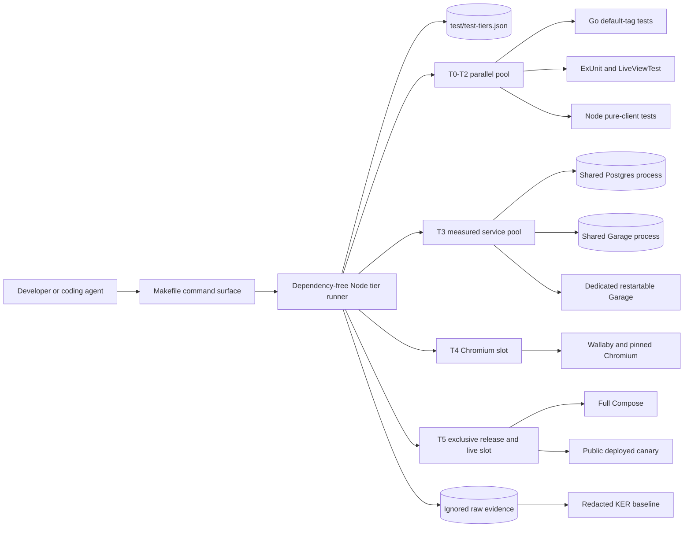

# Harden-LLM Parallel Test Feedback Hierarchy Implementation Plan

## 1. Title and metadata

- Project name: `harden-llm`
- Version: `2.0.0-execution-plan`
- Owners: Harden-LLM maintainers, backend test owners, and Phoenix frontend test owners
- Date: 2026-08-23
- Document ID: `PLAN-HARDEN-LLM-TEST-FEEDBACK-002`
- KER target: `KER-HLLM-TEST-FEEDBACK-001` at `ker/test-feedback/baseline.json`
- Repository baseline: `009629211632beed029374549938d1e322fcba04` on `main`
- Decision source: `plans/from_utility-llm/harden-llm-parallel-test-feedback-plan.md`
- Contract sources: `plans/from_utility-llm/harden-llm-self-hosted-test-spec.md` and `plans/from_utility-llm/phoenix-liveview-frontend-spec.md`

This plan implements a resource-aware test hierarchy for the Go backend and
Phoenix LiveView frontend. It creates a broad, cheap, parallel T0-T2 coding
loop; preserves exact assertions while reducing environmental fidelity;
separates real Postgres, Garage, Chromium, Compose, deployed, and live-provider
certification into bounded T3-T5 lanes; and records reproducible timing,
resource, isolation, merge, deployment, and cleanup evidence. The work changes
test support and the production JavaScript module layout without changing
provider, retry, profile, OpenAPI, persistence, authentication, or user-visible
behavior.

## 2. Design consensus and trade-offs

| Topic | Verdict | Rationale |
| --- | --- | --- |
| Broad cheap feedback | DECISION | LLM-assisted development benefits from many precise tests that can run after each edit. The current `make verify` includes Docker integration, race, and vulnerability work and is too expensive for that role. |
| Fidelity versus correctness | DECISION | Tests may replace production boundaries with in-process models, but the assertion oracle must remain exact for the stated invariant. |
| Resource-aware parallelism | DECISION | Pure and process-isolated work may use available cores; Docker, race, browser, full-system, and live work receive separate measured caps or exclusive locks. |
| Preserve `make verify` | DECISION | Existing certification and documentation depend on its comprehensive backend semantics. New targets extend the command surface without silently weakening it. |
| LiveView state ownership | FOR | `ProfileWidgetComponent.handle_event/3` and parent LiveViews already own fold, cache, reasoning, retry, upload, and namespaced message state. LiveViewTest can exercise those contracts without Chromium. |
| Direct callback tests | AGAINST | Calling private LiveView callbacks would bypass event routing and rendered diffs. Tests drive public events and selectors through LiveViewTest. |
| Pure JavaScript functional core | FOR | `SearchableCombobox`, `PromptShortcut`, and `SchemaPending` contain deterministic decisions that can be imported by production hooks and tested with Node 22's built-in runner. |
| Happy DOM or jsdom initially | AGAINST | Neither proves CSS, native event behavior, or LiveSocket patching. Adding either now creates another dependency/runtime without evidence that thin adapters need it. |
| Real Chromium coverage | DECISION | Keep two ordinary canaries: one widget/hook boundary and one authenticated workflow. Keep the existing Compose browser feature release-only. |
| Per-test service containers | AGAINST for ordinary integration | `internal/integrationtest/compose.go` currently starts a randomized Compose project per test. This is robust but repeats Postgres and Garage startup. |
| Shared service processes | FOR with proof | A runner-level pool can amortize startup only after unique databases/schemas, buckets/prefixes, contamination resistance, and cleanup pass concurrently. |
| Garage restart case | DECISION | `TestGarageArtifactStore` restarts Garage and therefore uses a dedicated exclusive resource rather than disrupting the shared pool. |
| Deterministic Phoenix serialization | AGAINST by default | Eleven non-browser frontend modules currently use `async: false`. Private Req ownership and unique fixtures should permit most to become async; proven global-state cases remain explicit exceptions. |
| Unlimited machine concurrency | AGAINST | Chromium, Docker, race binaries, and compilers contend for the same 12 logical CPUs and 32 GB RAM. More workers are accepted only when measurements reduce wall time without instability or higher peak pressure. |
| Test identifier continuity | DECISION | Preserve the approved allocations: TEST-041 for tier/Make policy, TEST-042 for shared-service isolation, TEST-043 for exclusive Garage, and WEB-TEST-044 through WEB-TEST-047 for widget, frontend concurrency, pure client, and browser obligations. Runner subprocess behavior is split into TEST-049 so every test definition has one executable path/command; TEST-048 through TEST-056 split other atomic commands without reassigning the approved obligations. |
| Expensive-only regressions | AGAINST | Every T3-T5 defect is evaluated for a T0-T2 root-invariant regression. The expensive case remains only for a distinct boundary fact. |
| Deployment after JavaScript extraction | DECISION | Production imports move even when behavior is preserved. The merged frontend image must therefore be rebuilt, deployed to the existing `harden-llm` Compose project, and verified. |
| Test-result manipulation | AGAINST | No assertion weakening, skipped required case, retry masking, fake service, fabricated metric, or purpose change is accepted to produce a green result. |

## 3. PRD / stakeholder and system needs

### Problem

The repository has strong deterministic and production certification, but its
inner loop is fragmented and expensive. Backend integration and race packages
are serialized at `-p=1`; seven integration-tagged files repeatedly start
Compose services; eleven deterministic Phoenix modules are serial; five custom
JavaScript hooks lack a cheap client test tier; and three ordinary browser
features repeat server-owned behavior in Chromium.

### Users

- Coding agents making frequent backend, LiveView, and client-hook edits.
- Maintainers reviewing test evidence and regressions.
- Release engineers running service, browser, Compose, and deployed gates.
- Operators relying on deployment identity and public behavior evidence.

### Value

- Faster edit-test cycles with broader deterministic guidance.
- Explicit separation between logic correctness and environment fidelity.
- Higher safe parallel throughput on the current host.
- Smaller, more diagnostic browser coverage.
- Reproducible service isolation and cleanup.
- One command and one manifest for each test tier.

### Business goals

- Make `make test-fast` the repeated coding loop for all T0-T2 behavior.
- Reduce warm fast-loop wall time by at least 20% versus the measured sequential
  baseline while keeping peak resident memory at or below baseline.
- Reduce ordinary browser sessions from three to two without losing an
  invariant.
- Reduce pooled integration warm p95 wall time by at least 20% versus the
  current per-test Compose baseline.
- Keep every deterministic, browser, integration, release, and deployed test
  green at final closure.

### Success metrics

- 100% of test tasks classified by tier and resource class.
- 100% of `REQ-001` through `REQ-018` mapped to executable tests.
- Zero Docker, Chromium, public network, or credential access from
  `make test-fast`.
- Existing exact 28-profile catalog, every-profile text/structured preparation,
  and profile-capability cases remain selected by the fast/release gates.
- Zero unexplained deterministic `async: false` modules; no more than two
  measured global-state exceptions.
- Exactly two ordinary Chromium features and one separate Compose browser
  feature.
- Zero cross-test Postgres or Garage reads, writes, deletes, or leaked
  namespaces in normal and race execution.
- Zero leaked Compose projects, containers, volumes, browser sessions, locks,
  screenshots from successful runs, or benchmark scratch files.
- `make test-release` exits zero on the merged candidate.
- Deployed frontend image label and digest correspond to merged source; public
  probes and the authenticated hosted canary pass.

### Scope

- `Makefile`, a dependency-free Node tier runner, and machine-readable tier
  policy.
- Benchmark harness and KER evidence.
- Go package/test parallelism and integration fixture lifecycle.
- Phoenix Req ownership, async isolation, LiveViewTest coverage, and serial
  exception policy.
- Pure JavaScript extraction and Node tests.
- Wallaby canary restructuring.
- CI lanes, documentation, ADR, specifications, traceability, status, issue,
  PR, merge, frontend deployment, hosted verification, and cleanup.

### Non-goals

- OpenAPI, provider, retry, schema, cache, pricing, profile, authentication, or
  persistence behavior changes.
- A new browser framework or synthetic DOM dependency.
- Browser matrices over all profiles, folds, inputs, or viewports.
- Live provider calls in deterministic or default CI lanes.
- A second test orchestration source in workflow YAML.
- Higher timeouts used to hide contention, leaks, readiness defects, or races.
- High availability, Kubernetes, or multi-host test scheduling.

### Dependencies

- Go `1.26.6` and the tools pinned in `go.mod`.
- Node `22.22.1`; npm is not required for the new client test tier.
- Elixir `1.20.2`, Erlang/OTP `28.4.3`, Phoenix `1.8.9`, LiveView `1.2.9`, Req
  `0.6.1`, and Wallaby `0.31.0` from `frontend/mix.exs`.
- Native `elixir`/`mix` at Elixir `1.20.2` on OTP `28.4.3` is a hard
  precondition for the no-Docker T0-T2 lane. The reference host now has the
  exact toolchain at `/home/kirill/.local/elixir-1.20.2` and
  `/home/kirill/.local/otp-28.4.3`; the Chromium image is not an accepted
  fast-lane fallback.
- Docker Engine `29.1.3` and Compose `2.40.3` on the planning host.
- Git `2.53.0`, GitHub CLI `2.92.0`, jq `1.8.1`, GNU `time`, and procps-ng
  `4.0.4` for branch/review, JSON extraction, and Linux process-tree metrics.
- Pinned Postgres `17.6-alpine`, Garage `2.3.0`, Chromium/ChromeDriver
  `149.0.7827.53`, and browser image inputs.
- Existing `.env` for explicitly authorized deployed verification only; no
  secret enters logs, fixtures, plans, or command arguments.

### Risks

- Req stubs may not follow LiveView child ownership without explicit
  allowances.
- A globally named SessionVault or application configuration mutation may
  invalidate async tests.
- JavaScript extraction may preserve pure logic but alter listener lifecycle or
  native event behavior.
- Shared service namespaces may leak through list/delete behavior or cleanup
  races.
- Garage default credentials may not support per-test bucket creation.
- Higher worker counts may increase wall time or memory pressure.
- Relative performance thresholds may be noisy under unrelated host load.
- A release may pass locally while a different image remains deployed.
- Native Elixir/OTP provisioning may remain unavailable on the reference host;
  baseline and fast-lane claims are suspended until exact versions are present.

### Assumptions

- `main` remains the release branch and GitHub remains the code-review system.
- The current host is the initial performance reference class: Linux x86-64,
  6 physical/12 logical Intel i7-8750H CPUs, and 32 GB RAM.
- Existing production credentials remain valid for one bounded hosted canary.
- Exact native Elixir/OTP provisioning is completed as a host prerequisite and
  does not add a repository dependency manager or container to T0-T2.
- The production Compose project remains exactly `harden-llm`.
- Tests can add process-local seams but cannot add an alternate production
  behavior path.

## 4. SRS / canonical requirements

| ID | Type | Requirement | Acceptance criteria |
| --- | --- | --- | --- |
| REQ-001 | perf | The repository shall provide one fast T0-T2 command. | `make test-fast` runs default-tag Go tests, parity fixture verification, deterministic Phoenix tests, and pure JavaScript tests concurrently. |
| REQ-002 | data | Every test task shall have one tier, resource class, command, cleanup owner, and canonical test ID in `test/test-tiers.json`. | Machine validation rejects missing, duplicate, unknown, or conflicting fields. |
| REQ-003 | reliability | The tier runner shall enforce resource slots, first-failure cancellation, exit propagation, bounded output, and cleanup. | Synthetic runner tests prove scheduling, cancellation, signal handling, and no residual child or lock. |
| REQ-004 | perf | Test budgets shall derive from reproducible reference-host measurements. | KER evidence contains host/toolchain fingerprint, raw sample reference, p50/p95/max, peak RSS, CPU, headroom, and accepted limits. |
| REQ-005 | nfr | Reduced fidelity shall preserve exact assertion oracles for the stated invariant. | Each moved/new test records what it proves and the higher-fidelity fact it does not claim. |
| REQ-006 | func | Server-owned widget and LiveView transitions shall be covered without Chromium. | LiveViewTest covers the no-tabs compact/in-flow topology, all main/nested folds, cache, profile, reasoning, retry/repair, upload namespacing, parent messages, and two-instance independence. |
| REQ-007 | perf | Deterministic Phoenix modules shall run concurrently unless a named global resource prevents it. | All safe modules use `async: true` and private Req ownership; each remaining serial module appears in a machine-checked exception list. |
| REQ-008 | func | Pure client-side decisions shall be imported by production hooks and tested under Node. | Filtering, visibility, highlight wraparound, custom/known commit, revert, shortcut, and schema-pending decisions have exact table-driven coverage. |
| REQ-009 | int | Real-browser coverage shall prove only browser-owned boundaries. | Two ordinary Wallaby features prove LiveSocket patching, hook adapters, native events, focus, overflow, authentication, run/reconnect/logout, and two-instance isolation. |
| REQ-010 | data | Ordinary Postgres and Garage integration tests shall share service processes while isolating mutable state per test. | Concurrent sentinels prove no cross-namespace read/write/delete and deterministic cleanup. |
| REQ-011 | reliability | Destructive Garage lifecycle behavior shall use an exclusive dedicated resource. | The restart case cannot overlap an ordinary Garage consumer and preserves its restart assertion. |
| REQ-012 | int | Existing focused targets and `make verify` shall retain their current contracts. | Static tests compare required dependencies and forbidden frontend/live/Compose work; new targets are additive. |
| REQ-013 | security | T0-T2 shall be credential-free and intentionally offline. | Fast policy forbids live/compose/browser tags, Docker commands, production origins, secret names, and dependency-network fallback. |
| REQ-014 | reliability | Every defect first found in T3-T5 shall receive a T0-T2 root-invariant regression when representable. | Traceability policy requires the cheap regression link or a specific boundary-only rationale. |
| REQ-015 | reliability | Test resources and evidence shall be bounded, redacted, and cleaned after success, failure, interruption, or cancellation. | No task-owned process, Compose project, namespace, volume, browser session, lock, or unignored artifact remains. |
| REQ-016 | nfr | Plans, specifications, ADRs, KERs, tests, CI, status, issues, PRs, and release evidence shall remain mutually traceable. | Static validation finds every requirement/test mapping and accepted decision exactly once. |
| REQ-017 | int | Hosted CI shall invoke canonical Make targets in separate resource lanes. | Workflow jobs delegate to `test-fast`, `test-integration`, `test-browser`, and `test-release` without duplicating task composition. |
| REQ-018 | reliability | A production JavaScript bundle change shall be merged, deployed to the existing project, and verified against public behavior. | Merged SHA, image label/digest, container health, public probes, authenticated hosted canary, smoke-history cleanup, and final Git identity agree. |

### Error handling and telemetry expectations

- The runner reports the first causal failure, cancels eligible siblings, waits
  for bounded cleanup, and returns nonzero without converting another task's
  output into the cause.
- Signal handling covers `SIGINT` and `SIGTERM`; cleanup targets only exact,
  resolved run IDs and project/namespace names.
- Test output may contain task ID, tier, resource class, duration, exit code,
  CPU, and memory. It may not contain credentials, request bodies, provider
  output, cookies, bearer tokens, staged secrets, or raw `.env` values.
- An ambiguous run transport failure is never retried by test orchestration.
- A benchmark sample with a failed test is a failed sample, not a timing datum.
- Budget breaches fail only on a matching reference-host class and include the
  measured value, accepted limit, fingerprint, and evidence path.
- No production telemetry or application error envelope changes are required.

### Architecture diagram



```text
System: Harden-LLM test feedback hierarchy

  Person: developer or coding agent
    uses
      Container: Make command surface
        delegates to
          Component: Node tier runner
            reads Component: test/test-tiers.json
            schedules Component: T0-T2 fast pool
              invokes Go tests, ExUnit/LiveViewTest, Node tests
            schedules Component: T3 service pool
              allocates isolated Postgres and Garage state
            schedules Component: T4 browser slot
              invokes Wallaby with pinned Chromium
            schedules Component: T5 exclusive lane
              invokes Compose, deployed, and explicit live checks
            writes Component: ignored run evidence
              summarized by Component: KER baseline and budget record

  External systems:
    Docker Engine, GitHub Actions, GitHub pull requests,
    production harden-llm Compose project, CPA provider for one live canary
```

## 5. Iterative implementation and test plan

### Compute controls

- `branch_limits`: one canonical tier runner, one tier manifest, one benchmark
  schema, at most two ordinary Chromium features, one ordinary service pool per
  runner, and one explicit Garage-exclusive path.
- `reflection_passes`: two per phase; first for requirement/test completeness,
  second for duplication, boundary drift, secret exposure, and cleanup review.
- `early_stop%`: 100; optional exploration stops at accepted evidence, but no
  required subtask or exit criterion may be omitted.

Execution starts from current remote main with `git fetch origin --prune && git switch main && git pull --ff-only origin main && git switch -c feat/parallel-test-feedback-hierarchy`. A resumed execution skips branch
creation only after `git status --short --branch` names that branch and `git
merge-base --is-ancestor origin/main HEAD` succeeds. An unexpected existing
branch, overlapping worktree change, or non-fast-forward main suspends P00.

Phase-boundary commits are configuration checkpoints after exit gates, not
implementation subtasks:

| Phase | Conventional subject | Required checkpoint evidence |
| --- | --- | --- |
| P00 | `docs: define test feedback architecture` | TEST-048, EVAL-001, ADR, KER, issue URL |
| P01 | `feat: add resource-aware test runner` | TEST-041, TEST-049, TEST-050, EVAL-002 |
| P02 | `test: parallelize LiveView coverage` | TEST-044, TEST-045, EVAL-003 |
| P03 | `refactor: extract tested client decisions` | TEST-046, TEST-051, EVAL-004 |
| P04 | `test: focus Chromium canaries` | TEST-047, TEST-052, EVAL-005 |
| P05 | `test: pool isolated integration services` | TEST-042, TEST-043, TEST-053, EVAL-006 |
| P06 | `docs: complete feedback release gates` | TEST-054, TEST-055, EVAL-007 |
| P07 | Implementation and certification PR merge SHAs | TEST-056, hosted checks, deployment identity, cleanup |

### Phase strategy

| Phase | Outcome | Dependency |
| --- | --- | --- |
| P00 | Reproducible baseline, policy inventory, ADR, KER schema, and tracking issue | Merged planning baseline |
| P01 | Canonical runner and additive Make target hierarchy | P00 measurement inputs |
| P02 | Parallel-safe deterministic Phoenix and complete server-owned widget coverage | P01 fast runner |
| P03 | Dependency-free pure JavaScript core imported by thin production hooks | P01 fast runner |
| P04 | Two targeted ordinary Chromium canaries | P02 server coverage and P03 client coverage |
| P05 | Shared isolated integration services plus exclusive Garage lifecycle | P01 resource scheduler |
| P06 | Complete documentation, traceability, CI, deployed-test harness, and release candidate | P02-P05 green |
| P07 | Merged, deployed, publicly certified, documented, and clean final state | P06 release candidate |

Execution is strictly ordered within each phase: do not start the next numbered
subtask until the immediately preceding subtask passes its command/procedure or
its blocker and resource disposition are recorded under the suspension
criteria. Cross-phase work starts only after the preceding phase exit gate and
configuration checkpoint.

### Risk register

| Risk | Trigger | Mitigation |
| --- | --- | --- |
| Fast suite omits required coverage | A command is removed to meet a budget. | TEST-041 and TEST-054 bind composition and traceability; optimize rather than omit. |
| Req ownership fails in LiveView children | Private stub lookup returns ownership errors. | Use `Req.Test.allow/3` only at the identified child boundary and repeat seeded async evaluation. |
| Global frontend state races | SessionVault restart, application clock, or observability config overlaps another test. | Preserve a named serial exception or add one process-local seam under failing coverage. |
| Hook extraction changes browser semantics | Native change/blur/focus or listener behavior differs. | Production imports the tested core; TEST-047 retains the real-browser adapter boundary. |
| Pool contamination | A test can list, read, overwrite, or delete another namespace. | TEST-042 uses concurrent sentinels and fails closed before consumers migrate. |
| Garage restart disrupts pool | Restart case receives the shared endpoint. | TEST-043 binds a distinct exclusive resource class and dedicated lifecycle. |
| Higher concurrency increases cost | p95 or peak RSS exceeds baseline. | EVAL-002, EVAL-003, EVAL-005, and EVAL-006 choose measured caps; no cap increase without ADR evidence. |
| Host noise invalidates budget | Sample coefficient of variation exceeds 20%. | Suspend measurement, remove unrelated load, retain failed samples, and repeat the full sample set. |
| Deployment targets wrong stack | Compose project is unresolved or not `harden-llm`. | Configuration inspection and CHECK-004 require explicit `-p harden-llm` before mutation. |
| Certification drifts from source | Deployed image label or digest differs from merged source. | TEST-056 and CHECK-004 compare merge SHA, image metadata, container identity, probes, and behavior. |

### Suspension and resumption criteria

- Suspend a phase when a RED test does not fail for the intended reason, a
  deterministic command flakes, a required external contract is unavailable,
  a secret appears in output, a cleanup target is unresolved, or a requirement
  becomes ambiguous.
- Resume only from the last green subtask after recording failed commands,
  causal output, retained resources, cleanup disposition, and any ADR/plan
  amendment.
- Stop the implementation when acceptance requires changing OpenAPI, provider,
  retry, profile, authentication, or persistence semantics; that is a scope
  change requiring user approval.
- Do not suspend merely because a phase is long. Continue while a safe,
  requirement-linked subtask remains.

### Standards tailoring note

This plan is standards-informed by requirements, test-documentation, and
software-lifecycle practices; it is not a claim of ISO/IEEE, FAA, or DO-178C
compliance. No development assurance level, tool qualification, structural
coverage claim, certification independence, or safety-critical approval is
asserted. Each phase still produces auditable requirement, design, test,
configuration, risk, assumption, and result evidence.

### Phase P00: Reproducible baseline and accepted test architecture

Phase goal: record the current test topology and resource cost, establish the
machine-readable policy/benchmark contracts, accept ADR-HLLM-015, and create a
single implementation tracking issue without changing test selection.

Scope and objectives: REQ-002, REQ-004, REQ-005, REQ-016.

Impacted surfaces: `test/test-tiers.json`,
`scripts/benchmark-test-feedback.mjs`,
`internal/testkit/test_feedback_baseline_test.go`,
`ker/test-feedback/README.md`, `ker/test-feedback/baseline.json`,
`docs/adr/ADR-HLLM-015-parallel-test-feedback-hierarchy.md`,
`docs/adr/README.md`, `plans/implementation-status.json`, and the GitHub
tracking issue.

Lifecycle evidence:

- Requirements evidence: approved decisions and REQ-002/004/005/016 links in
  the plan and ADR.
- Design/code surface evidence: manifest schema, benchmark implementation, KER
  schema, and static contract test.
- Verification method: TEST-048 and EVAL-001.
- Validation purpose: prove the optimization starts from measured current
  behavior and one explicit architecture decision.
- Configuration checkpoint: clean feature branch from current `origin/main`,
  exact toolchain fingerprint, and unchanged Make target selection.
- Risks and assumptions: unrelated host load is absent during samples; current
  commands pass before their timing is accepted.
- Unresolved decisions: final timing/memory budgets and candidate resource caps
  remain measurement-driven until EVAL-001 records a stable baseline.

Plan-and-Solve subtasks:

- `P00.S01 Audit the current test and resource topology`
  - Action: Recount Go test files/build tags/parallel calls, ExUnit async declarations, browser features, custom hooks, global state mutations, existing targets, and Compose-starting fixtures at the implementation start SHA.
  - Why now: Every later comparison and policy entry depends on an accurate baseline.
  - Files/surfaces: `Makefile`, `internal/**/*.go`, `frontend/test/**/*.exs`, `frontend/assets/js/app.js`, `frontend/test/test_helper.exs`, `internal/integrationtest/compose.go`, `deploy/test/compose.integration.yml`.
  - Requirement link: REQ-002, REQ-004.
  - Verification link: N/A (bounded inspection).
  - Verification mode: VERIFY.
  - Command/procedure: Run `git status --short --branch`, `git rev-parse HEAD origin/main`, `elixir --version`, `mix --version`, `rg -n '^//go:build (integration|compose|live)|t\.Parallel\(\)' --glob '*_test.go' .`, `rg -n 'async: (true|false)|@moduletag' frontend/test --glob '*.exs'`, and `rg -n '^const (Clipboard|PromptShortcut|SchemaPending|SearchableCombobox|SecretStager)' frontend/assets/js/app.js`.
  - Expected result: The inventory records exact counts, paths, and the required native Elixir/OTP versions with no uncommitted implementation change.
  - Evidence produced: Redacted inventory in `plans/evidence/harden-llm/ptf-20260823/test-feedback-inventory.txt`.
  - Stop/escalate condition: Stop if `HEAD` and `origin/main` diverge unexpectedly, the worktree contains overlapping user changes, or native Elixir `1.20.2`/OTP `28.4.3` is unavailable; do not substitute Docker or the older apt candidates.
  - Unlocks: P00.S02.

- `P00.S02 Add failing coverage for the baseline policy contract`
  - Action: Add TEST-048 assertions for the tier-manifest schema, current command inventory, benchmark schema, host fingerprint fields, KER path, ADR ID, and absence of credentials.
  - Why now: The policy and benchmark implementation require a failing executable contract first.
  - Files/surfaces: `internal/testkit/test_feedback_baseline_test.go` with comment `// SPEC-HARDEN-LLM-SELF-HOSTED-TESTS-001 TEST-048`.
  - Requirement link: REQ-002, REQ-004, REQ-005, REQ-016.
  - Verification link: TEST-048.
  - Verification mode: RED.
  - Command/procedure: `go test ./internal/testkit/... -run TestTestFeedbackBaselineContract -count=1`.
  - Expected result: The command fails only because the manifest, benchmark/KER contract, or ADR does not yet exist.
  - Evidence produced: Failing test output naming the first absent required surface.
  - Stop/escalate condition: Stop if the test passes before implementation or fails on an unrelated existing contract.
  - Unlocks: P00.S03.

- `P00.S03 Implement the policy inventory and benchmark contract`
  - Action: Create the tier manifest with current tasks, implement the dependency-free benchmark harness using monotonic Node timing plus GNU `time -v` and bounded `/proc` process-tree sampling, add the KER schema/readme, add ADR-HLLM-015/index entries, and add a top-level `testFeedbackHierarchy` status object without rewriting the completed self-hosted `plan`/`phases` records or changing Make target behavior.
  - Why now: TEST-048 defines the exact files and schema required for reproducible measurement.
  - Files/surfaces: `test/test-tiers.json`, `scripts/benchmark-test-feedback.mjs`, `ker/test-feedback/README.md`, `ker/test-feedback/baseline.json`, `docs/adr/ADR-HLLM-015-parallel-test-feedback-hierarchy.md`, `docs/adr/README.md`, `plans/implementation-status.json`.
  - Requirement link: REQ-002, REQ-004, REQ-005, REQ-016.
  - Verification link: TEST-048.
  - Verification mode: GREEN.
  - Command/procedure: `go test ./internal/testkit/... -run TestTestFeedbackBaselineContract -count=1`.
  - Expected result: TEST-048 passes; manifest tasks map exactly to existing commands; the ADR records initial relative thresholds and the no-DOM decision.
  - Evidence produced: Test output, manifest, benchmark source, KER schema, ADR, and status diff.
  - Stop/escalate condition: Stop if satisfying the test requires changing existing target selection or adding a package dependency.
  - Unlocks: P00.S04.

- `P00.S04 Capture warm and cold reference samples`
  - Action: Execute five warm and three cold-compile successful samples for existing fast candidates, integration, browser, and full-system lanes with wall time, CPU, peak RSS, cleanup duration, and host fingerprint.
  - Why now: Later thresholds and worker caps require pre-change measurements.
  - Files/surfaces: `scripts/benchmark-test-feedback.mjs`, `test/test-tiers.json`, ignored `plans/evidence/harden-llm/ptf-20260823/`, `ker/test-feedback/baseline.json`.
  - Requirement link: REQ-004, REQ-015.
  - Verification link: EVAL-001.
  - Verification mode: MEASURE.
  - Command/procedure: `node scripts/benchmark-test-feedback.mjs --mode baseline --warm-samples 5 --cold-samples 3 --output plans/evidence/harden-llm/test-feedback-baseline.json`.
  - Expected result: Every accepted sample is green; coefficient of variation is at most 20%; the output contains p50/p95/max and zero cleanup leaks.
  - Evidence produced: Raw ignored JSON evidence and redacted aggregate KER values.
  - Stop/escalate condition: Suspend if any sample fails, host load makes variation exceed 20%, or cleanup is nonzero.
  - Unlocks: P00.S05.

- `P00.S05 Record accepted budgets and architecture evidence`
  - Action: Populate the committed KER from EVAL-001, record p95/max plus 25% headroom where applicable, and mark P00 complete in implementation status.
  - Why now: Accepted values must be durable before orchestration or parallelism changes.
  - Files/surfaces: `ker/test-feedback/baseline.json`, `docs/adr/ADR-HLLM-015-parallel-test-feedback-hierarchy.md`, `plans/implementation-status.json`.
  - Requirement link: REQ-004, REQ-016.
  - Verification link: TEST-048, EVAL-001.
  - Verification mode: VERIFY.
  - Command/procedure: Run `go test ./internal/testkit/... -run TestTestFeedbackBaselineContract -count=1` and `node scripts/benchmark-test-feedback.mjs --verify-baseline ker/test-feedback/baseline.json`.
  - Expected result: Static and metric validation pass against the exact reference-host fingerprint.
  - Evidence produced: Committed redacted KER and passing command output.
  - Stop/escalate condition: Stop if a threshold cannot be derived from successful samples or would excuse an existing failure.
  - Unlocks: P00.S06.

- `P00.S06 Create the implementation tracking issue`
  - Action: Create one GitHub issue containing the document ID, REQ list, P00-P07 checklist, ADR link, KER link, and completion conditions; reuse an exact-title open issue if one already exists.
  - Why now: Phase evidence and deviations need one external coordination record from the start.
  - Files/surfaces: GitHub issues for `prls-co/harden-llm`.
  - Requirement link: REQ-016.
  - Verification link: CHECK-001.
  - Verification mode: VERIFY.
  - Command/procedure: Run `gh issue list --state open --search '"Implement parallel test feedback hierarchy" in:title' --json number,title,url`; when the result is empty, run `gh issue create --title 'Implement parallel test feedback hierarchy' --body 'Implements PLAN-HARDEN-LLM-TEST-FEEDBACK-002 through phases P00-P07. Acceptance requires REQ-001 through REQ-018, TEST-041 through TEST-056, EVAL-001 through EVAL-007, merge, deployment, hosted certification, evidence, and cleanup.'`.
  - Expected result: Exactly one open issue has the canonical title and plan scope.
  - Evidence produced: Issue URL recorded in the execution log.
  - Stop/escalate condition: Stop if issue creation targets a different repository or duplicates an existing canonical issue.
  - Unlocks: P00.S07.

- `P00.S07 Assess baseline-phase structure after green`
  - Action: State `No refactor needed` because P00 introduces one manifest, one benchmark harness, one KER schema, and one ADR with no duplicated runtime path.
  - Why now: The required post-green structure review closes the phase without optional expansion.
  - Files/surfaces: P00 diff and execution log.
  - Requirement link: REQ-005, REQ-016.
  - Verification link: TEST-048.
  - Verification mode: VERIFY.
  - Command/procedure: `go test ./internal/testkit/... -run TestTestFeedbackBaselineContract -count=1`.
  - Expected result: TEST-048 remains green and the reflection pass finds no duplicate policy source.
  - Evidence produced: P00 execution-log reflection entry.
  - Stop/escalate condition: Add a REFACTOR subtask before phase exit if duplicated task or metric ownership is found.
  - Unlocks: P00 exit.

Exit gates:

- Proceed: TEST-048 and EVAL-001 pass, the ADR/KER/status are complete, and the
  issue exists exactly once.
- Escalate: measurements remain noisy, the host fingerprint cannot be
  reproduced, or current commands are not green.
- Stop: baseline evidence would require changing test purpose or production
  semantics.

Phase metrics:

| Metric | Estimate | Rationale |
| --- | --- | --- |
| Confidence | 92% | Current commands, files, versions, and resource boundaries are directly inspectable. |
| Long-term robustness | 94% | A fingerprinted KER and machine schema prevent informal budget drift. |
| Internal interactions | 6 | Manifest, benchmark, KER, ADR, status, and static test interact. |
| External interactions | 1 | One GitHub issue is created or reused. |
| Complexity | 38% | Measurement orchestration is moderate but production behavior is untouched. |
| Feature creep | 4% | Work is limited to baseline and governance needed by later phases. |
| Technical debt | 5% | One runner-independent benchmark path is intentional and reused later. |
| YAGNI score | 96% | Every surface is required for measured implementation. |
| MoSCoW | Must | No later optimization is trustworthy without the baseline. |
| Local/non-local scope | Local plus GitHub issue | Code changes remain local; only tracking is external. |
| Architectural changes count | 1 | ADR-HLLM-015 establishes the test architecture. |

### Phase P01: Canonical resource-aware runner and command hierarchy

Phase goal: provide additive Make targets backed by one dependency-free runner
that executes T0-T2 concurrently and enforces resource policy without changing
the existing `make verify` contract.

Scope and objectives: REQ-001, REQ-002, REQ-003, REQ-012, REQ-013, REQ-015.

Impacted surfaces: `scripts/run-test-tier.mjs`,
`scripts/test/run_test_tier_test.mjs`, `scripts/verify-test-tiers.mjs`,
`test/test-tiers.json`, `Makefile`,
`internal/testkit/test_tier_policy_test.go`, and ignored
`tmp/test-feedback/`.

Lifecycle evidence:

- Requirements evidence: REQ-001/002/003/012/013/015 entries and ADR-HLLM-015.
- Design/code surface evidence: runner, runner tests, tier validator, manifest,
  Make targets, and static target contract.
- Verification method: TEST-049, TEST-041, TEST-050, and EVAL-002.
- Validation purpose: prove concurrent cheap feedback, exact command selection,
  cancellation, and backward-compatible certification.
- Configuration checkpoint: P00 manifest and accepted baseline KER.
- Risks and assumptions: Node 22 process APIs are available; no npm dependency
  is introduced; dependency caches are preinstalled for offline fast mode.
- Unresolved decisions: the accepted CPU slot count remains open until EVAL-002
  compares overlap, wall time, and peak RSS on the reference host.

Plan-and-Solve subtasks:

- `P01.S01 Add failing runner scheduling and cleanup coverage`
  - Action: Add table-driven Node tests for dependency ordering, resource slots, exclusive locks, cross-framework concurrency, first-failure cancellation, signal handling, bounded logs, exit propagation, and scratch cleanup.
  - Why now: The orchestration implementation changes test execution and requires a failing contract first.
  - Files/surfaces: `scripts/test/run_test_tier_test.mjs` with comment `// SPEC-HARDEN-LLM-SELF-HOSTED-TESTS-001 TEST-049`.
  - Requirement link: REQ-003, REQ-015.
  - Verification link: TEST-049.
  - Verification mode: RED.
  - Command/procedure: `node --test scripts/test/run_test_tier_test.mjs`.
  - Expected result: The command fails because `scripts/run-test-tier.mjs` does not provide the required scheduler API and cleanup behavior.
  - Evidence produced: Failing Node test output for the first missing runner contract.
  - Stop/escalate condition: Stop if failure depends on wall-clock races rather than deterministic fake child processes.
  - Unlocks: P01.S02.

- `P01.S02 Implement the dependency-free tier runner`
  - Action: Implement manifest loading, DAG validation, resource semaphores, exclusive lock, subprocess groups, cancellation, bounded output, JSON timing, signal cleanup, and exact ignored run-directory ownership.
  - Why now: TEST-049 defines the scheduler behavior without requiring real Go, Mix, Docker, or Chromium children.
  - Files/surfaces: `scripts/run-test-tier.mjs`, `scripts/test/run_test_tier_test.mjs`, and runner-generated directories under `tmp/test-feedback/`.
  - Requirement link: REQ-003, REQ-015.
  - Verification link: TEST-049.
  - Verification mode: GREEN.
  - Command/procedure: `node --test scripts/test/run_test_tier_test.mjs`.
  - Expected result: All deterministic scheduler, cancellation, signal, and cleanup cases pass.
  - Evidence produced: Runner source and passing Node TAP output.
  - Stop/escalate condition: Stop if implementation requires a package manager, daemon, unresolved PID targeting, or platform-specific destructive cleanup.
  - Unlocks: P01.S03.

- `P01.S03 Add failing Make and tier-policy coverage`
  - Action: Add TEST-041 assertions for canonical task classification, additive target names, exact `make verify` dependencies, fast exclusions, offline environment controls, and one manifest ownership path.
  - Why now: Makefile and manifest changes need a failing repository contract before wiring.
  - Files/surfaces: `internal/testkit/test_tier_policy_test.go` with comment `// SPEC-HARDEN-LLM-SELF-HOSTED-TESTS-001 TEST-041 TEST-050`.
  - Requirement link: REQ-001, REQ-002, REQ-012, REQ-013.
  - Verification link: TEST-041.
  - Verification mode: RED.
  - Command/procedure: `go test ./internal/testkit/... -run TestTestTierPolicy -count=1`.
  - Expected result: The command fails because the new targets and final policy entries are absent while existing `verify` assertions remain green.
  - Evidence produced: Failing static-test output listing absent target/policy fields.
  - Stop/escalate condition: Stop if existing `make verify` already violates its certified contract.
  - Unlocks: P01.S04.

- `P01.S04 Wire additive Make targets to the manifest runner`
  - Action: Add `test-fast`, `test-browser`, `test-release`, `test-live`, and `benchmark-test-feedback` targets; register current Go/parity/Phoenix tasks; keep existing focused targets and `verify` dependency order unchanged.
  - Why now: TEST-041 binds the public command surface and exclusion rules.
  - Files/surfaces: `Makefile`, `test/test-tiers.json`, `scripts/verify-test-tiers.mjs`, `scripts/run-test-tier.mjs`.
  - Requirement link: REQ-001, REQ-002, REQ-012, REQ-013.
  - Verification link: TEST-041.
  - Verification mode: GREEN.
  - Command/procedure: `go test ./internal/testkit/... -run TestTestTierPolicy -count=1`.
  - Expected result: Static policy passes; `make verify` remains byte-equivalent in selected dependencies; new targets delegate to the runner.
  - Evidence produced: Makefile/manifest diff and passing static output.
  - Stop/escalate condition: Stop if a new target duplicates command composition or weakens an existing target.
  - Unlocks: P01.S05.

- `P01.S05 Exercise the complete fast lane`
  - Action: Run all currently registered T0-T2 tasks concurrently with offline dependency fallback disabled and verify exact task/result reporting.
  - Why now: Unit/static contracts do not prove real Go, Node, and Mix subprocess composition.
  - Files/surfaces: `Makefile`, `test/test-tiers.json`, `scripts/run-test-tier.mjs`, default Go tests, parity script, deterministic frontend tests.
  - Requirement link: REQ-001, REQ-003, REQ-013, REQ-015.
  - Verification link: TEST-050.
  - Verification mode: VERIFY.
  - Command/procedure: `make test-fast`.
  - Expected result: Every registered T0-T2 task passes; execution overlaps across frameworks; no Docker, Chromium, public network, or credential path starts; scratch cleanup is zero.
  - Evidence produced: Runner JSON timing and task summary under the ignored evidence directory.
  - Stop/escalate condition: Suspend on any unexplained network attempt, leaked process, or mismatch between manifest and executed command.
  - Unlocks: P01.S06.

- `P01.S06 Consolidate orchestration and policy ownership`
  - Action: Remove duplicated task lists, normalize runner error/result types, and keep Makefile targets as thin human-facing delegates.
  - Why now: The green implementation introduces multiple integration points that require one ownership pass.
  - Files/surfaces: `Makefile`, `test/test-tiers.json`, `scripts/run-test-tier.mjs`, `scripts/verify-test-tiers.mjs`.
  - Requirement link: REQ-002, REQ-003, REQ-012.
  - Verification link: TEST-049, TEST-041, TEST-050.
  - Verification mode: REFACTOR.
  - Command/procedure: Run `node --test scripts/test/run_test_tier_test.mjs`, `go test ./internal/testkit/... -run TestTestTierPolicy -count=1`, and `make test-fast`.
  - Expected result: All three commands remain green and each task command exists only in the manifest.
  - Evidence produced: Refactored diff and passing outputs.
  - Stop/escalate condition: Stop if consolidation changes task selection or error semantics.
  - Unlocks: P01.S07.

- `P01.S07 Capture fast-lane throughput and resource evidence`
  - Action: Measure five warm and three cold `test-fast` samples against the P00 sequential baseline and record p50/p95/max, peak RSS, CPU, overlap, and cleanup.
  - Why now: The runner is accepted only if it improves feedback without raising resource pressure or instability.
  - Files/surfaces: `scripts/benchmark-test-feedback.mjs`, `ker/test-feedback/baseline.json`, ignored evidence.
  - Requirement link: REQ-001, REQ-003, REQ-004, REQ-015.
  - Verification link: EVAL-002.
  - Verification mode: MEASURE.
  - Command/procedure: `node scripts/benchmark-test-feedback.mjs --task fast --warm-samples 5 --cold-samples 3 --compare ker/test-feedback/baseline.json --output plans/evidence/harden-llm/test-fast-eval.json`.
  - Expected result: Warm p95 is at most 80% of sequential baseline p95, peak RSS does not exceed baseline max, failure/leak counts are zero, and every sample selects the same tasks.
  - Evidence produced: EVAL-002 JSON and updated KER accepted-budget fields.
  - Stop/escalate condition: Suspend if thresholds fail; profile task overlap and resource caps rather than omitting coverage.
  - Unlocks: P01 exit.

Exit gates:

- Proceed: TEST-049, TEST-041, TEST-050, and EVAL-002 pass; `make verify`
  composition is unchanged.
- Escalate: runner cleanup is nondeterministic, offline controls break valid
  cached builds, or the 20% improvement cannot be reached without resource
  regression.
- Stop: acceptance requires removing a required test or redefining `verify`.

Phase metrics:

| Metric | Estimate | Rationale |
| --- | --- | --- |
| Confidence | 88% | Node process control is mature, but cross-framework cancellation needs direct evidence. |
| Long-term robustness | 93% | One manifest and deterministic runner tests constrain orchestration drift. |
| Internal interactions | 8 | Make, manifest, runner, validator, Go, Mix, Node, and evidence interact. |
| External interactions | 0 | Fast execution is intentionally local and offline. |
| Complexity | 61% | Resource scheduling and signal cleanup are concurrency-sensitive. |
| Feature creep | 6% | Target set is bounded by approved tiers. |
| Technical debt | 7% | A custom runner is justified by three runtimes and no dependency manager. |
| YAGNI score | 91% | Every scheduler feature has a named reliability requirement. |
| MoSCoW | Must | Later phases depend on the canonical runner and targets. |
| Local/non-local scope | Local | No external state changes in this phase. |
| Architectural changes count | 2 | One runner and one machine policy become canonical. |

### Phase P02: Parallel-safe Phoenix tests and complete server-owned widget coverage

Phase goal: move every concurrency-safe deterministic Phoenix module to private,
parallel execution and prove the complete reusable profile-widget state machine
through LiveViewTest without starting Chromium.

Scope and objectives: REQ-005, REQ-006, REQ-007, REQ-013, REQ-015.

Impacted surfaces: `frontend/test/support/conn_case.ex`,
`frontend/test/support/api_fixtures.ex`,
`frontend/test/harden_llm_web/test_policy_test.exs`,
`frontend/test/harden_llm_web/live/profile_widget_component_test.exs`, all
deterministic `frontend/test/harden_llm_web/**/*_test.exs` modules,
`frontend/lib/harden_llm_web/live/profile_widget_component.ex`, parent
LiveViews, `test/test-tiers.json`, and `scripts/benchmark-test-feedback.mjs`.

Lifecycle evidence:

- Requirements evidence: REQ-005/006/007/013/015 and the frontend ownership
  decision in ADR-HLLM-015.
- Design/code surface evidence: private Req ownership helper, explicit
  allowances, serial-exception policy, LiveView selectors/events, and parent
  message assertions.
- Verification method: TEST-045, TEST-044, TEST-050, and EVAL-003.
- Validation purpose: prove that server-owned folds and state transitions are
  broad, cheap, deterministic, and safe under concurrent ExUnit scheduling.
- Configuration checkpoint: P01 runner and manifest are green; current browser
  tests remain unchanged until P04.
- Risks and assumptions: `$callers` propagation or `Req.Test.allow/3` reaches
  each spawned LiveView process; only SessionVault lifecycle/clock mutation and
  observability application configuration require serialization.
- Unresolved decisions: the exact allowance points and final serial-exception
  list are resolved by TEST-045 plus EVAL-003; a third exception requires ADR
  review rather than an informal skip.

Plan-and-Solve subtasks:

- `P02.S01 Add failing coverage for deterministic frontend concurrency policy`
  - Action: Add a static ExUnit test that enumerates deterministic modules, requires `async: true` by default, limits named serial exceptions to two, rejects `Req.Test.set_req_test_to_shared/1` outside those exceptions, and verifies browser/compose modules remain excluded from the count.
  - Why now: Async declarations and Req ownership must have an executable policy before test modules change.
  - Files/surfaces: `frontend/test/harden_llm_web/test_policy_test.exs` with comment `# SPEC-HARDEN-LLM-PHOENIX-LIVEVIEW-001 WEB-TEST-045 TEST-045`; `test/test-tiers.json` serial-exception field.
  - Requirement link: REQ-007, REQ-013, REQ-015.
  - Verification link: TEST-045.
  - Verification mode: RED.
  - Command/procedure: `cd frontend && mix test test/harden_llm_web/test_policy_test.exs`.
  - Expected result: The command fails by reporting the current deterministic `async: false` modules and shared Req ownership calls.
  - Evidence produced: Failing ExUnit output with exact module/path violations.
  - Stop/escalate condition: Stop if browser or Compose modules enter the deterministic inventory or the test relies on source-order accidents.
  - Unlocks: P02.S02.

- `P02.S02 Implement private Req ownership and async-safe fixtures`
  - Action: Add one ConnCase helper for private Req setup and explicit spawned-process allowances, convert safe deterministic modules to `async: true`, make fixture IDs and session handles unique, retain only the SessionVault lifecycle/clock and observability configuration modules as named serial exceptions, register the concrete `phoenix-async` benchmark task, and add TEST-044/045 comments to every modified test-support file.
  - Why now: TEST-045 defines the allowed ownership and serialization surface.
  - Files/surfaces: `frontend/test/support/conn_case.ex`, `frontend/test/support/api_fixtures.ex`, deterministic `frontend/test/harden_llm_web/**/*_test.exs`, `test/test-tiers.json`, and `scripts/benchmark-test-feedback.mjs`.
  - Requirement link: REQ-007, REQ-013, REQ-015.
  - Verification link: TEST-045.
  - Verification mode: GREEN.
  - Command/procedure: `cd frontend && mix test test/harden_llm_web/test_policy_test.exs`.
  - Expected result: TEST-045 passes with no more than two documented serial deterministic modules and no unapproved shared Req ownership.
  - Evidence produced: Async/ownership diff, exception rationales, and passing ExUnit output.
  - Stop/escalate condition: Stop if a module is marked async before mutable IDs, application state, or Req ownership are isolated.
  - Unlocks: P02.S03.

- `P02.S03 Add failing coverage for the complete profile-widget state machine`
  - Action: Add selector-driven LiveViewTest cases for the utility-style compact labels/control order (`LLM`, profile, reasoning, `L/M/H`, cache, settings), main configuration, every main and escalation nested fold, profile selection, capability-aware reasoning, cache toggling, retry/repair projection, fallback rows, uploads, credential staging, save/delete messages, and two independently namespaced component instances.
  - Why now: Server-owned behavior must be proven before any state or event correction is made and before browser duplication is removed.
  - Files/surfaces: `frontend/test/harden_llm_web/live/profile_widget_component_test.exs` with comment `# SPEC-HARDEN-LLM-PHOENIX-LIVEVIEW-001 WEB-TEST-044 TEST-044`.
  - Requirement link: REQ-005, REQ-006, REQ-015.
  - Verification link: TEST-044.
  - Verification mode: RED.
  - Command/procedure: `cd frontend && mix test test/harden_llm_web/live/profile_widget_component_test.exs`.
  - Expected result: The command fails only on absent selectors, an incorrect event/message transition, or an unisolated second widget instance.
  - Evidence produced: Failing ExUnit output naming the first unmet state transition.
  - Stop/escalate condition: Stop if the test calls component callbacks directly or asserts browser layout, native focus, or LiveSocket JavaScript behavior.
  - Unlocks: P02.S04.

- `P02.S04 Complete public-event widget behavior and parent integration`
  - Action: Correct only transitions exposed by TEST-044, stabilize namespaced selectors, and route state through public `render_click/2`, `render_change/2`, upload, and parent-message surfaces while preserving the no-tabs reusable component contract.
  - Why now: TEST-044 supplies exact failing server-side behavior and protects the existing embedded-widget purpose.
  - Files/surfaces: `frontend/lib/harden_llm_web/live/profile_widget_component.ex`, `frontend/lib/harden_llm_web/live/workspace_live.ex`, `frontend/lib/harden_llm_web/live/embedding_live.ex`, their HEEx templates, and `frontend/test/harden_llm_web/live/profile_widget_component_test.exs`.
  - Requirement link: REQ-005, REQ-006, REQ-015.
  - Verification link: TEST-044.
  - Verification mode: GREEN.
  - Command/procedure: `cd frontend && mix test test/harden_llm_web/live/profile_widget_component_test.exs`.
  - Expected result: Every compact, unfolded, nested, escalation, upload, parent-message, and two-instance case passes without Chromium.
  - Evidence produced: Component/parent diff and passing focused ExUnit output.
  - Stop/escalate condition: Stop if the correction changes provider/profile semantics, adds navigation/tabs, or moves server-owned state into JavaScript.
  - Unlocks: P02.S05.

- `P02.S05 Consolidate LiveView test ownership and widget fixtures`
  - Action: Remove repeated Req allowance, login-session, profile, and widget-host setup; keep one helper per ownership boundary and descriptive selectors shared by component and parent tests.
  - Why now: The green async and widget changes expose repeated setup that would otherwise drift across high-coverage tests.
  - Files/surfaces: `frontend/test/support/conn_case.ex`, `frontend/test/support/api_fixtures.ex`, `frontend/test/harden_llm_web/live/profile_widget_component_test.exs`, and affected deterministic frontend tests.
  - Requirement link: REQ-005, REQ-006, REQ-007.
  - Verification link: TEST-045, TEST-044.
  - Verification mode: REFACTOR.
  - Command/procedure: Run `cd frontend && mix test test/harden_llm_web/test_policy_test.exs` and `cd frontend && mix test test/harden_llm_web/live/profile_widget_component_test.exs`.
  - Expected result: Both commands remain green; ownership and fixture setup each have one clear implementation path.
  - Evidence produced: Refactored test-support diff and passing focused outputs.
  - Stop/escalate condition: Stop if abstraction hides which process owns a Req stub or makes selectors less diagnostic.
  - Unlocks: P02.S06.

- `P02.S06 Exercise seeded parallel frontend execution`
  - Action: Execute the full deterministic frontend suite at the accepted ExUnit worker count over ten fixed seeds, detect leaked messages/processes/global configuration, and compare serial exceptions and wall time with P00.
  - Why now: Focused tests cannot establish cross-module isolation under real scheduler interleavings.
  - Files/surfaces: all deterministic frontend tests, `test/test-tiers.json`, benchmark harness, and ignored evidence.
  - Requirement link: REQ-006, REQ-007, REQ-015.
  - Verification link: EVAL-003.
  - Verification mode: MEASURE.
  - Command/procedure: `node scripts/benchmark-test-feedback.mjs --task phoenix-async --seeds 104729,130363,155921,181081,206369,231709,257053,282437,307969,333269 --compare ker/test-feedback/baseline.json --output plans/evidence/harden-llm/phoenix-async-eval.json`.
  - Expected result: All ten seeds pass; no leak or ownership warning occurs; no more than two deterministic serial exceptions remain; warm p95 is no worse than the P00 Phoenix baseline.
  - Evidence produced: EVAL-003 per-seed JSON, p50/p95/max, and exception inventory.
  - Stop/escalate condition: Suspend on any seed-specific failure; preserve the seed and isolate the mutable resource before reducing parallelism.
  - Unlocks: P02.S07.

- `P02.S07 Revalidate the expanded fast lane`
  - Action: Execute the canonical fast lane with the new async policy and widget suite included by normal test discovery.
  - Why now: Phase changes are complete only when the same command used during coding includes them without special selection.
  - Files/surfaces: `Makefile`, `test/test-tiers.json`, all P02 files, and runner evidence.
  - Requirement link: REQ-001, REQ-006, REQ-007, REQ-013, REQ-015.
  - Verification link: TEST-050.
  - Verification mode: VERIFY.
  - Command/procedure: `make test-fast`.
  - Expected result: The full T0-T2 lane passes offline with P02 tests present and zero residual resources.
  - Evidence produced: TEST-050 task summary and P02 execution-log entry.
  - Stop/escalate condition: Stop if focused tests pass but canonical discovery omits them or changes another task's oracle.
  - Unlocks: P02 exit.

Exit gates:

- Proceed: TEST-045, TEST-044, TEST-050, and EVAL-003 pass; every remaining
  serial exception names its global resource.
- Escalate: spawned-process Req ownership cannot be isolated, a third global
  exception is demonstrated, or seeded execution is unstable.
- Stop: concurrency requires changing authentication, API, or widget product
  semantics.

Phase metrics:

| Metric | Estimate | Rationale |
| --- | --- | --- |
| Confidence | 84% | LiveViewTest already covers parent pages, while private spawned-process ownership needs direct proof. |
| Long-term robustness | 95% | Public-event tests and a machine serial policy protect both behavior and scheduler safety. |
| Internal interactions | 9 | LiveComponents, parent LiveViews, Req, SessionVault, fixtures, ExUnit, selectors, uploads, and runner interact. |
| External interactions | 0 | All provider and browser boundaries are deterministic local doubles. |
| Complexity | 66% | Async ownership and two-instance component state have nontrivial process interactions. |
| Feature creep | 5% | Coverage is bounded to existing server-owned behavior. |
| Technical debt | 6% | Two named serial exceptions remain only for demonstrated global lifecycle state. |
| YAGNI score | 94% | Every new case replaces or supports a known browser/server invariant. |
| MoSCoW | Must | Cheap folding and state coverage is the core reason for the LiveView architecture. |
| Local/non-local scope | Local | No service, browser, network, or deployed state changes. |
| Architectural changes count | 1 | Deterministic frontend tests adopt private concurrent ownership by default. |

### Phase P03: Tested pure JavaScript core with thin production hooks

Phase goal: extract deterministic decisions from the custom LiveView hooks into
one dependency-free ES module, import it from production, and cover it with
Node's built-in test runner without adding Happy DOM, jsdom, Vitest, npm, or a
second rendered-DOM model.

Scope and objectives: REQ-001, REQ-005, REQ-008, REQ-013, REQ-015.

Impacted surfaces: `frontend/assets/js/app.js`,
`frontend/assets/js/client_core.mjs`,
`frontend/assets/test/client_core.test.mjs`,
`frontend/test/harden_llm_web/boundary_test.exs`, `frontend/mix.exs`,
`test/test-tiers.json`, and the benchmark harness.

Lifecycle evidence:

- Requirements evidence: REQ-001/005/008/013/015 and the no-synthetic-DOM
  decision in ADR-HLLM-015.
- Design/code surface evidence: pure input/output functions, thin hook adapters,
  production import graph, Node tests, and static boundary assertions.
- Verification method: TEST-046, TEST-051, TEST-050, and EVAL-004.
- Validation purpose: prove broad client decision coverage cheaply while
  reserving native events, focus, CSS, and LiveSocket patching for P04.
- Configuration checkpoint: P02 server-side state suite is green and Node 22 is
  present; `frontend/assets/package.json` remains absent.
- Risks and assumptions: pure functions can represent filtering, navigation,
  commit, shortcut, and pending-state decisions without emulating DOM APIs.
- Unresolved decisions: none for initial implementation; DOM-emulator promotion
  is a separate future ADR only after the stated defect/evidence trigger.

Plan-and-Solve subtasks:

- `P03.S01 Add failing table coverage for pure client decisions`
  - Action: Add exact table-driven Node cases for normalized search, visible option indices, empty-state visibility, highlight wraparound, known/custom commit, escape/blur reversion, submit-shortcut qualification, and schema-pending presentation.
  - Why now: The extraction contract must exist before production logic moves.
  - Files/surfaces: `frontend/assets/test/client_core.test.mjs` with comment `// SPEC-HARDEN-LLM-PHOENIX-LIVEVIEW-001 WEB-TEST-046 TEST-046`.
  - Requirement link: REQ-005, REQ-008, REQ-013.
  - Verification link: TEST-046.
  - Verification mode: RED.
  - Command/procedure: `node --test frontend/assets/test/client_core.test.mjs`.
  - Expected result: The command fails because `frontend/assets/js/client_core.mjs` does not export the required pure functions.
  - Evidence produced: Failing TAP output for the first absent client decision.
  - Stop/escalate condition: Stop if a case requires `document`, `window`, CSS layout, timers, or a synthetic DOM to express its oracle.
  - Unlocks: P03.S02.

- `P03.S02 Implement the dependency-free client decision module`
  - Action: Implement named pure exports with immutable inputs and explicit outputs for every TEST-046 table, register the concrete `client-core` task in the manifest, and use no global state, timer, DOM object, network call, or package import.
  - Why now: TEST-046 defines the deterministic functional boundary independently of hook adapters.
  - Files/surfaces: `frontend/assets/js/client_core.mjs`, `frontend/assets/test/client_core.test.mjs`, and `test/test-tiers.json`.
  - Requirement link: REQ-005, REQ-008, REQ-013.
  - Verification link: TEST-046.
  - Verification mode: GREEN.
  - Command/procedure: `node --test frontend/assets/test/client_core.test.mjs`.
  - Expected result: Every table passes under stock Node 22 with no installed JavaScript package.
  - Evidence produced: Pure module source and passing TAP output.
  - Stop/escalate condition: Stop if the module duplicates server-owned fold/profile state or creates an alternate production decision path.
  - Unlocks: P03.S03.

- `P03.S03 Add failing production-import boundary coverage`
  - Action: Extend the static frontend boundary test to require `app.js` to import the pure module, keep only DOM/listener/timer/dispatch adapters in hooks, require listener teardown, and reject Happy DOM, jsdom, Vitest, Jest, and package-manifest additions.
  - Why now: Production wiring needs a failing structural contract before hook bodies change.
  - Files/surfaces: `frontend/test/harden_llm_web/boundary_test.exs` with comment `# SPEC-HARDEN-LLM-PHOENIX-LIVEVIEW-001 WEB-TEST-046 TEST-051`.
  - Requirement link: REQ-005, REQ-008, REQ-013, REQ-015.
  - Verification link: TEST-051.
  - Verification mode: RED.
  - Command/procedure: `cd frontend && mix test test/harden_llm_web/boundary_test.exs && mix assets.build`.
  - Expected result: The command fails because decision logic still resides in `app.js` and the pure module is not imported; the pre-change asset build remains successful.
  - Evidence produced: Failing boundary assertion and successful baseline asset-build result.
  - Stop/escalate condition: Stop if the static rule would forbid required thin DOM adaptation or depend on minified output formatting.
  - Unlocks: P03.S04.

- `P03.S04 Wire production hooks to the tested client core`
  - Action: Import the pure functions into `SearchableCombobox`, `PromptShortcut`, and `SchemaPending`; leave Clipboard and SecretStager as small effect-only adapters; preserve mounted/updated/destroyed listener symmetry and native bubbling `change` dispatch.
  - Why now: TEST-051 binds the production import and adapter boundary while TEST-046 protects decisions.
  - Files/surfaces: `frontend/assets/js/app.js`, `frontend/assets/js/client_core.mjs`, `frontend/test/harden_llm_web/boundary_test.exs`.
  - Requirement link: REQ-005, REQ-008, REQ-015.
  - Verification link: TEST-051.
  - Verification mode: GREEN.
  - Command/procedure: `cd frontend && mix test test/harden_llm_web/boundary_test.exs && mix assets.build`.
  - Expected result: The boundary test and asset build pass; production hooks import one tested core and retain only browser effects.
  - Evidence produced: Production import diff, compiled asset result, and passing ExUnit output.
  - Stop/escalate condition: Stop if esbuild resolves a different module, native event semantics change, or a package dependency is introduced.
  - Unlocks: P03.S05.

- `P03.S05 Consolidate pure decision names and adapter ownership`
  - Action: Remove duplicate normalization/navigation branches, align function names with hook events, and document each pure return value at the import boundary.
  - Why now: The green extraction can leave parallel old/new branches unless one consolidation pass follows production wiring.
  - Files/surfaces: `frontend/assets/js/app.js`, `frontend/assets/js/client_core.mjs`, and `frontend/assets/test/client_core.test.mjs`.
  - Requirement link: REQ-005, REQ-008.
  - Verification link: TEST-046, TEST-051.
  - Verification mode: REFACTOR.
  - Command/procedure: Run `node --test frontend/assets/test/client_core.test.mjs` and `cd frontend && mix test test/harden_llm_web/boundary_test.exs && mix assets.build`.
  - Expected result: Both commands remain green and no deterministic decision is implemented twice.
  - Evidence produced: Consolidated diff and passing Node/ExUnit/asset outputs.
  - Stop/escalate condition: Stop if consolidation obscures browser effects or changes a TEST-046 truth table.
  - Unlocks: P03.S06.

- `P03.S06 Measure the pure client lane`
  - Action: Execute 30 successful samples of TEST-046, record p50/p95/max and peak RSS, and verify the Node lane has no dependency installation or network access.
  - Why now: The new lane is useful only if it remains cheap enough for every coding iteration.
  - Files/surfaces: benchmark harness, Node test, manifest, KER, and ignored evidence.
  - Requirement link: REQ-001, REQ-004, REQ-008, REQ-013.
  - Verification link: EVAL-004.
  - Verification mode: MEASURE.
  - Command/procedure: `node scripts/benchmark-test-feedback.mjs --task client-core --warm-samples 30 --compare ker/test-feedback/baseline.json --output plans/evidence/harden-llm/client-core-eval.json`.
  - Expected result: p95 wall time is at most 2 seconds, peak RSS is within the KER limit, all samples pass, and package/network counts are zero.
  - Evidence produced: EVAL-004 JSON and accepted KER client-core budget.
  - Stop/escalate condition: Suspend if startup dominates the budget or any implicit dependency/network path appears; optimize imports before changing the threshold.
  - Unlocks: P03.S07.

- `P03.S07 Revalidate all cheap feedback after production extraction`
  - Action: Execute the canonical T0-T2 lane and confirm the new Node task overlaps Go and Mix tasks while the asset boundary remains covered.
  - Why now: The client-core lane must participate in the ordinary coding command rather than remain a focused-only test.
  - Files/surfaces: `Makefile`, tier manifest, runner, frontend assets/tests, and evidence.
  - Requirement link: REQ-001, REQ-008, REQ-013, REQ-015.
  - Verification link: TEST-050.
  - Verification mode: VERIFY.
  - Command/procedure: `make test-fast`.
  - Expected result: All T0-T2 tasks pass offline, client-core timing appears in the runner summary, and scratch cleanup is zero.
  - Evidence produced: TEST-050 summary and P03 execution-log entry.
  - Stop/escalate condition: Stop if the runner omits TEST-046 or serializes it behind an unrelated task.
  - Unlocks: P03 exit.

Exit gates:

- Proceed: TEST-046, TEST-051, TEST-050, and EVAL-004 pass with no new
  JavaScript dependency or manifest.
- Escalate: a deterministic decision cannot be separated from a browser-owned
  effect or production import behavior differs after bundling.
- Stop: acceptance requires a synthetic DOM to claim CSS, native-event, or
  LiveSocket fidelity.

Phase metrics:

| Metric | Estimate | Rationale |
| --- | --- | --- |
| Confidence | 93% | The current hooks contain clear deterministic branches and thin browser effects. |
| Long-term robustness | 92% | Production imports the same pure functions exercised by table tests. |
| Internal interactions | 5 | Pure module, hooks, Node, esbuild, and static boundary interact. |
| External interactions | 0 | No browser, package registry, provider, or service is involved. |
| Complexity | 43% | Extraction is localized, though native event boundaries need care. |
| Feature creep | 3% | No DOM emulator or framework is added. |
| Technical debt | 4% | Effect-only hooks remain intentionally browser-tested. |
| YAGNI score | 98% | The implementation adds only functions with current production callers. |
| MoSCoW | Must | Cheap client coverage closes the largest T0-T2 gap. |
| Local/non-local scope | Local | Source, tests, and generated ignored assets only. |
| Architectural changes count | 1 | Deterministic client decisions become a reusable ES module. |

### Phase P04: Two targeted real-browser canaries

Phase goal: replace three overlapping ordinary browser features with exactly
two serialized Chromium canaries that cover browser-owned boundaries while
retaining the separate full-Compose browser feature unchanged.

Scope and objectives: REQ-005, REQ-006, REQ-008, REQ-009, REQ-013, REQ-015.

Impacted surfaces: `frontend/test/browser/full_workflow_test.exs`, new
`frontend/test/browser/widget_canary_test.exs`, new
`frontend/test/browser/authenticated_workflow_canary_test.exs`,
`frontend/test/support/browser_backend.ex`,
`frontend/test/harden_llm_web/browser_policy_test.exs`,
`frontend/test/browser/compose_smoke_test.exs`, `frontend/test/test_helper.exs`,
`test/test-tiers.json`, and benchmark evidence.

Lifecycle evidence:

- Requirements evidence: REQ-005/006/008/009/013/015 and the two-canary
  decision in ADR-HLLM-015.
- Design/code surface evidence: browser policy, two feature modules, shared
  browser fixture, explicit browser-owned assertion inventory, and unchanged
  Compose feature.
- Verification method: TEST-052, TEST-047, TEST-050, and EVAL-005.
- Validation purpose: retain real rendering, native event, focus, LiveSocket,
  and authentication confidence at a bounded Chromium cost.
- Configuration checkpoint: P02 proves all server-owned widget state and P03
  proves pure hook decisions before browser duplication is removed.
- Risks and assumptions: one feature can resize across desktop/mobile for the
  layout invariant; Wallaby starts one session per ordinary feature under
  `--max-cases 1`.
- Unresolved decisions: none for feature count; the browser worker cap remains
  one unless a later measured ADR changes it.

Plan-and-Solve subtasks:

- `P04.S01 Add failing coverage for the browser-canary policy`
  - Action: Add a static ExUnit test that requires exactly two ordinary `:browser` features in two named files, one independent `:compose` feature, `async: false`, `--max-cases 1`, pinned browser-image execution, and no duplicated server-state matrix.
  - Why now: Browser restructuring requires a machine-counted boundary before features move or disappear.
  - Files/surfaces: `frontend/test/harden_llm_web/browser_policy_test.exs` with comment `# SPEC-HARDEN-LLM-PHOENIX-LIVEVIEW-001 WEB-TEST-047 TEST-052`; browser files and tier manifest.
  - Requirement link: REQ-005, REQ-009, REQ-013, REQ-015.
  - Verification link: TEST-052.
  - Verification mode: RED.
  - Command/procedure: `cd frontend && mix test test/harden_llm_web/browser_policy_test.exs`.
  - Expected result: The command fails because `full_workflow_test.exs` currently contains three ordinary features and the two canonical canary files do not exist.
  - Evidence produced: Failing policy output with feature/file counts.
  - Stop/escalate condition: Stop if the policy counts the Compose feature as ordinary or relies on feature title wording alone.
  - Unlocks: P04.S02.

- `P04.S02 Add failing browser-owned canary coverage`
  - Action: Create two focused features: a widget canary for LiveSocket patching, searchable/custom commit, SecretStager non-disclosure, Clipboard feedback, native change/blur/focus, responsive overflow, and independent instances; and an authenticated workflow canary for login, profile selection, schema-pending feedback, prompt shortcut, run/result, ambiguous-outcome History guidance without duplicate submission, reconnect, and logout.
  - Why now: New canaries must demonstrate the retained browser boundary before the old combined module is removed.
  - Files/surfaces: `frontend/test/browser/widget_canary_test.exs` with comment `# SPEC-HARDEN-LLM-PHOENIX-LIVEVIEW-001 WEB-TEST-047 TEST-047`; `frontend/test/browser/authenticated_workflow_canary_test.exs` with the same traceability comment.
  - Requirement link: REQ-006, REQ-008, REQ-009, REQ-015.
  - Verification link: TEST-047.
  - Verification mode: RED.
  - Command/procedure: `cd frontend && mix test --only browser --max-cases 1 test/browser/widget_canary_test.exs test/browser/authenticated_workflow_canary_test.exs`.
  - Expected result: The command fails because the canaries reference a shared isolated backend/session helper and browser-owned selectors not yet extracted from the legacy module.
  - Evidence produced: Failing Wallaby output and failure screenshots in ignored `frontend/tmp/wallaby/`.
  - Stop/escalate condition: Stop if failures arise from an unpinned host browser or public network rather than the intended missing fixture/boundary.
  - Unlocks: P04.S03.

- `P04.S03 Implement isolated browser fixtures and retained boundaries`
  - Action: Extract one backend/session fixture, wire unique per-feature data, preserve native event and responsive assertions, add TEST-047 comments to modified browser support/helper files, and make both canaries pass in the pinned browser image without changing application behavior.
  - Why now: TEST-047 identifies the exact helper and selectors needed for the browser-owned contract.
  - Files/surfaces: `frontend/test/support/browser_backend.ex`, both new canary files, `frontend/test/test_helper.exs`, and existing application selectors only when a stable public selector is absent.
  - Requirement link: REQ-006, REQ-008, REQ-009, REQ-015.
  - Verification link: TEST-047.
  - Verification mode: GREEN.
  - Command/procedure: `cd frontend && mix test --only browser --max-cases 1 test/browser/widget_canary_test.exs test/browser/authenticated_workflow_canary_test.exs`.
  - Expected result: Both features pass serially with one session each, no console/page error, no horizontal overflow at 375 and 1440 CSS pixels, and clean backend/session teardown.
  - Evidence produced: Passing Wallaby output and browser-owned assertion inventory.
  - Stop/escalate condition: Stop if a canary recreates the full fold/profile matrix or depends on production credentials/network.
  - Unlocks: P04.S04.

- `P04.S04 Remove superseded ordinary browser duplication`
  - Action: Delete `full_workflow_test.exs`, register only the two canaries in the browser tier, retain `compose_smoke_test.exs` separately, and add comments pointing server-owned assertions to TEST-044 and pure decisions to TEST-046.
  - Why now: TEST-047 is green, so browser duplication can be removed without losing a distinct invariant.
  - Files/surfaces: legacy and new browser files, `test/test-tiers.json`, and `frontend/test/harden_llm_web/browser_policy_test.exs`.
  - Requirement link: REQ-005, REQ-009, REQ-013.
  - Verification link: TEST-052.
  - Verification mode: GREEN.
  - Command/procedure: `cd frontend && mix test test/harden_llm_web/browser_policy_test.exs`.
  - Expected result: TEST-052 passes with exactly two ordinary features and one separate Compose feature.
  - Evidence produced: Browser inventory diff and passing policy output.
  - Stop/escalate condition: Stop if any removed assertion lacks a TEST-044, TEST-046, TEST-047, or Compose owner.
  - Unlocks: P04.S05.

- `P04.S05 Assess canary structure after green`
  - Action: State `No refactor needed` because common backend/session setup is already centralized and each canary owns one distinct browser boundary.
  - Why now: A post-green structure review confirms that reducing features did not create another shared abstraction or duplicate workflow.
  - Files/surfaces: both canary files, browser fixture, policy test, and P04 diff.
  - Requirement link: REQ-005, REQ-009.
  - Verification link: TEST-052, TEST-047.
  - Verification mode: VERIFY.
  - Command/procedure: Run `cd frontend && mix test test/harden_llm_web/browser_policy_test.exs` and `cd frontend && mix test --only browser --max-cases 1 test/browser/widget_canary_test.exs test/browser/authenticated_workflow_canary_test.exs`.
  - Expected result: Both commands remain green and the reflection pass finds no repeated server-state matrix.
  - Evidence produced: P04 reflection entry and passing outputs.
  - Stop/escalate condition: Add a REFACTOR subtask before measurement if setup or browser assertions are duplicated across canaries.
  - Unlocks: P04.S06.

- `P04.S06 Measure bounded Chromium cost`
  - Action: Execute five successful warm samples of the ordinary browser tier, record feature/session count, wall p50/p95/max, peak browser-tree RSS, CPU, screenshot cleanup, and compare with the three-feature P00 baseline.
  - Why now: The browser redesign is accepted on measured cost and retained fidelity, not feature count alone.
  - Files/surfaces: benchmark harness, browser tier manifest, KER, and ignored evidence.
  - Requirement link: REQ-004, REQ-009, REQ-015.
  - Verification link: EVAL-005.
  - Verification mode: MEASURE.
  - Command/procedure: `node scripts/benchmark-test-feedback.mjs --task browser --warm-samples 5 --compare ker/test-feedback/baseline.json --output plans/evidence/harden-llm/browser-canary-eval.json`.
  - Expected result: Every sample has exactly two ordinary sessions, p95 and peak RSS do not exceed the P00 three-feature baseline, all samples pass, and successful-run screenshots/processes are zero.
  - Evidence produced: EVAL-005 JSON and accepted KER browser budget.
  - Stop/escalate condition: Suspend on a browser leak, feature-count drift, or lost assertion; investigate fixture/session lifecycle before increasing limits.
  - Unlocks: P04.S07.

- `P04.S07 Revalidate cheap and browser tier separation`
  - Action: Execute fast and browser targets separately and verify the fast command never starts the browser image while the browser command selects only the two ordinary canaries.
  - Why now: Tier separation is the practical resource boundary requested by maintainers.
  - Files/surfaces: Make targets, runner, manifest, test helper, and browser evidence.
  - Requirement link: REQ-001, REQ-009, REQ-013, REQ-015.
  - Verification link: TEST-050, TEST-047.
  - Verification mode: VERIFY.
  - Command/procedure: Run `make test-fast` and `make test-browser`.
  - Expected result: Both targets pass; fast reports zero Chromium resources and browser reports exactly the two serialized canaries.
  - Evidence produced: Separate task summaries and P04 execution-log entry.
  - Stop/escalate condition: Stop if browser setup is reachable from the fast task or the browser target includes Compose.
  - Unlocks: P04 exit.

Exit gates:

- Proceed: TEST-052, TEST-047, TEST-050, and EVAL-005 pass; the Compose browser
  feature remains separately selectable.
- Escalate: a removed browser assertion has no lower-tier owner, pinned Chromium
  behavior is unstable, or two sessions exceed the measured resource budget.
- Stop: reducing Chromium requires dropping a distinct browser-owned invariant.

Phase metrics:

| Metric | Estimate | Rationale |
| --- | --- | --- |
| Confidence | 90% | Existing Wallaby workflows already contain the required browser-owned assertions. |
| Long-term robustness | 91% | Static feature limits and lower-tier ownership prevent browser matrix regrowth. |
| Internal interactions | 7 | Wallaby, browser backend, test helper, LiveSocket, hooks, selectors, and runner interact. |
| External interactions | 1 | Docker supplies the pinned browser image; no public service is used. |
| Complexity | 52% | Feature extraction is bounded but browser/session teardown is resource-sensitive. |
| Feature creep | 2% | The phase removes one ordinary feature and adds no framework. |
| Technical debt | 5% | One Compose feature remains expensive by design for system fidelity. |
| YAGNI score | 97% | Each retained feature owns a distinct browser boundary. |
| MoSCoW | Must | Decoupling Chromium is central to cheap concurrent iteration. |
| Local/non-local scope | Local plus Docker | Application state stays local; pinned containers are transient. |
| Architectural changes count | 1 | Browser coverage becomes an explicit two-canary resource lane. |

### Phase P05: Shared isolated integration services with exclusive lifecycle control

Phase goal: amortize ordinary Postgres and Garage startup across each T3 runner,
prove per-test mutable-state isolation and cleanup under normal/race execution,
and keep the Garage restart assertion on a dedicated exclusive service.

Scope and objectives: REQ-002, REQ-003, REQ-004, REQ-010, REQ-011,
REQ-012, REQ-015.

Impacted surfaces: `scripts/run-test-tier.mjs`, `test/test-tiers.json`,
`Makefile`, `deploy/test/compose.integration.yml`,
`internal/integrationtest/compose.go`, new
`internal/integrationtest/isolation_test.go`,
`internal/postgres/cache_test.go`, `internal/postgres/repository_test.go`,
`internal/artifacts/garage_test.go`, new
`internal/artifacts/garage_restart_test.go`, and integration tests under
`internal/gateway/`.

Lifecycle evidence:

- Requirements evidence: REQ-002/003/004/010/011/012/015 and the conditional
  pooling decision in ADR-HLLM-015.
- Design/code surface evidence: one randomized runner-owned Compose project,
  dynamic loopback endpoints, Postgres database leases, Garage namespace
  leases, exact cleanup, exclusive restart task, and unchanged test oracles.
- Verification method: TEST-042, TEST-043, TEST-053, and EVAL-006.
- Validation purpose: prove that service-process reuse lowers startup cost
  without weakening storage fidelity, isolation, lifecycle, or race coverage.
- Configuration checkpoint: P01 resource scheduler is green; P00 per-test
  Compose measurements and image pins are recorded.
- Risks and assumptions: Postgres 17 supports forceful test-database cleanup;
  Garage prefixing is accepted only if create/list/read/delete isolation is
  proven with the pinned default credential.
- Unresolved decisions: unique Garage bucket versus proven key-prefix leases and
  final normal/race package caps are resolved by TEST-042 and EVAL-006.

Plan-and-Solve subtasks:

- `P05.S01 Add failing concurrent service-isolation coverage`
  - Action: Add concurrent lease tests that seed recognizable data in two Postgres databases and two Garage namespaces, attempt cross-read/overwrite/delete/list operations, release one lease while the other remains active, and verify exact cleanup after success and injected failure.
  - Why now: Shared service lifecycle cannot replace per-test Compose isolation before contamination resistance has a failing executable contract.
  - Files/surfaces: `internal/integrationtest/isolation_test.go` with comment `// SPEC-HARDEN-LLM-SELF-HOSTED-TESTS-001 TEST-042`; `test/test-tiers.json` task `integration-isolation`.
  - Requirement link: REQ-003, REQ-010, REQ-015.
  - Verification link: TEST-042.
  - Verification mode: RED.
  - Command/procedure: `node scripts/run-test-tier.mjs --task integration-isolation`.
  - Expected result: The command fails because the runner does not yet export one shared service pool and `integrationtest` lacks isolated lease APIs.
  - Evidence produced: Failing runner/Go output naming the missing pool or first cross-namespace contract.
  - Stop/escalate condition: Stop if the test uses in-memory fakes, production project names, fixed ports, fixed mutable namespaces, or unbounded cleanup.
  - Unlocks: P05.S02.

- `P05.S02 Implement runner-owned services and per-test leases`
  - Action: Extend the runner to start one Compose project whose name begins `harden-llm-test-` and ends in a resolved 12-hex run nonce for ordinary Postgres/Garage tasks, resolve dynamic loopback ports, pass bounded test-only configuration, allocate cryptographically unique Postgres databases and Garage key prefixes, and tear down exact namespaces and the project on normal exit, failure, `SIGINT`, or `SIGTERM`.
  - Why now: TEST-042 defines the isolation and cleanup behavior needed before consumers share processes.
  - Files/surfaces: `scripts/run-test-tier.mjs`, `test/test-tiers.json`, `deploy/test/compose.integration.yml`, `internal/integrationtest/compose.go`, and `internal/integrationtest/isolation_test.go`.
  - Requirement link: REQ-003, REQ-010, REQ-015.
  - Verification link: TEST-042.
  - Verification mode: GREEN.
  - Command/procedure: `node scripts/run-test-tier.mjs --task integration-isolation`.
  - Expected result: Concurrent sentinels remain invisible across leases; only the released namespace disappears; injected failure leaves no database, prefix, container, volume, project, or runner lock.
  - Evidence produced: Lease implementation, passing isolation output, resolved-name audit, and leak report.
  - Stop/escalate condition: Reject prefix pooling and retain per-test Garage process isolation if any Garage list/read/delete path can escape its lease; record the failed prototype in the KER.
  - Unlocks: P05.S03.

- `P05.S03 Add failing exclusive-Garage and migration policy coverage`
  - Action: Extend static policy to require one `service_garage_exclusive` task, require the restart test to use a dedicated API/build tag, reject ordinary calls to the old per-test start APIs, and require every affected integration file to carry TEST-053 traceability.
  - Why now: The destructive restart and consumer migration need a machine guard before packages run concurrently.
  - Files/surfaces: `internal/testkit/test_tier_policy_test.go` with comment `// SPEC-HARDEN-LLM-SELF-HOSTED-TESTS-001 TEST-043`; integration files and manifest.
  - Requirement link: REQ-002, REQ-011, REQ-012, REQ-015.
  - Verification link: TEST-043.
  - Verification mode: RED.
  - Command/procedure: `go test ./internal/testkit/... -run TestExclusiveGarageResourcePolicy -count=1`.
  - Expected result: The command fails because restart behavior still shares `garage_test.go`, old start APIs remain, and no exclusive task exists.
  - Evidence produced: Failing static output listing each nonconforming file/resource.
  - Stop/escalate condition: Stop if the policy could omit the restart assertion while appearing compliant.
  - Unlocks: P05.S04.

- `P05.S04 Migrate integration consumers and isolate Garage restart`
  - Action: Move restart persistence into `garage_restart_test.go` under `integration && garageexclusive`, give it a dedicated service/project, convert ordinary consumers to database/Garage leases with unique owner/key data, add `t.Parallel()` only after lease acquisition safety is proven, and preserve all existing assertions.
  - Why now: TEST-043 binds the exclusive boundary and prevents partial migration.
  - Files/surfaces: `internal/integrationtest/compose.go`, Postgres/artifact/gateway integration tests, `internal/artifacts/garage_restart_test.go`, `test/test-tiers.json`, and `Makefile` recipes for existing integration targets.
  - Requirement link: REQ-010, REQ-011, REQ-012, REQ-015.
  - Verification link: TEST-043.
  - Verification mode: GREEN.
  - Command/procedure: `go test ./internal/testkit/... -run TestExclusiveGarageResourcePolicy -count=1`.
  - Expected result: TEST-043 passes; ordinary tests use only shared leases; restart work is selected exactly once through the exclusive task; `make verify` retains its integration target dependencies.
  - Evidence produced: Consumer migration diff, exclusive-task manifest, and passing static output.
  - Stop/escalate condition: Stop if migration changes database/artifact assertions, allows fixed owner/key collisions, or makes direct `go test -tags=integration` silently claim full target coverage.
  - Unlocks: P05.S05.

- `P05.S05 Exercise all integration consumers in normal and race modes`
  - Action: Execute the existing integration targets through the canonical runner, including ordinary pooled work and the dedicated restart task, at initial caps of three normal packages and two race packages on the reference host.
  - Why now: Isolation probes and static policy do not prove every real repository consumer or race-instrumented cleanup path.
  - Files/surfaces: all integration-tagged Go tests, Make targets, manifest, runner, shared Compose file, and evidence.
  - Requirement link: REQ-010, REQ-011, REQ-012, REQ-015.
  - Verification link: TEST-053.
  - Verification mode: VERIFY.
  - Command/procedure: `make test-integration && make test-integration-race`.
  - Expected result: Both commands pass; each ordinary invocation starts one service project; the restart task is non-overlapping; Go race reports are empty; cleanup leak count is zero.
  - Evidence produced: Normal/race task graphs, Go output, Compose lifecycle, namespace audit, and cleanup summary.
  - Stop/escalate condition: Suspend on race output, contamination, restart overlap, leaked namespace/project, or an assertion that passes only after serialization.
  - Unlocks: P05.S06.

- `P05.S06 Consolidate pooled and exclusive fixture ownership`
  - Action: Remove obsolete per-test ordinary Compose paths, separate lease data from service-process data, centralize validated run/lease naming and cleanup, and retain one explicit exclusive constructor used only by the restart test.
  - Why now: The green migration temporarily exposes old and new lifecycle concepts that must not become permanent fallbacks.
  - Files/surfaces: `internal/integrationtest/compose.go`, runner service lifecycle, manifest, Compose file, and affected tests.
  - Requirement link: REQ-003, REQ-010, REQ-011, REQ-015.
  - Verification link: TEST-042, TEST-043, TEST-053.
  - Verification mode: REFACTOR.
  - Command/procedure: Run `node scripts/run-test-tier.mjs --task integration-isolation`, `go test ./internal/testkit/... -run TestExclusiveGarageResourcePolicy -count=1`, and `make test-integration && make test-integration-race`.
  - Expected result: All commands remain green; ordinary and exclusive lifecycle ownership is direct, nonduplicated, and fail-closed.
  - Evidence produced: Consolidated fixture/runner diff and passing outputs.
  - Stop/escalate condition: Stop if consolidation adds an automatic per-test fallback or weakens exact cleanup targeting.
  - Unlocks: P05.S07.

- `P05.S07 Measure service-pool throughput and select safe caps`
  - Action: Capture five warm and three cold normal/race integration samples, compare with P00 per-test Compose results, record startup count, p50/p95/max, peak RSS/CPU, contention, contamination, and cleanup, and select the fastest cap that satisfies every reliability bound.
  - Why now: Pooling and package parallelism are accepted only when measured improvement survives isolation and race execution.
  - Files/surfaces: benchmark harness, manifest caps, KER, runner evidence, and integration suites.
  - Requirement link: REQ-003, REQ-004, REQ-010, REQ-011, REQ-015.
  - Verification link: EVAL-006.
  - Verification mode: MEASURE.
  - Command/procedure: `node scripts/benchmark-test-feedback.mjs --task integration-pool --warm-samples 5 --cold-samples 3 --candidate-package-slots 1,2,3 --candidate-race-slots 1,2 --compare ker/test-feedback/baseline.json --output plans/evidence/harden-llm/integration-pool-eval.json`.
  - Expected result: Selected warm p95 is at most 80% of the per-test Compose baseline; peak RSS does not exceed the KER maximum; contamination, race, failure, restart-overlap, and cleanup counts are zero.
  - Evidence produced: EVAL-006 JSON, selected manifest caps, and KER update.
  - Stop/escalate condition: Retain the proven safer topology and record non-adoption if no pooled candidate meets both correctness and material-improvement criteria; do not weaken isolation or thresholds.
  - Unlocks: P05 exit.

Exit gates:

- Proceed: TEST-042, TEST-043, TEST-053, and EVAL-006 pass; normal and race
  consumers use the selected measured caps.
- Escalate: Garage cannot provide provable bucket/prefix isolation, Postgres
  cleanup is nondeterministic, or the resource pool gives no material benefit.
- Stop: optimization requires weaker storage assertions, unresolved cleanup
  targets, or access to the production Compose project.

Phase metrics:

| Metric | Estimate | Rationale |
| --- | --- | --- |
| Confidence | 77% | Postgres isolation is straightforward; pinned Garage namespace administration requires proof. |
| Long-term robustness | 94% | Concurrent sentinels, race execution, exact cleanup, and fail-closed adoption constrain pooling risk. |
| Internal interactions | 10 | Runner, manifest, Docker, Compose, Postgres, Garage, Go packages, leases, race, and cleanup interact. |
| External interactions | 1 | Docker Engine runs pinned local service images. |
| Complexity | 78% | Cross-process service reuse and interruption-safe cleanup are the hardest concurrency work. |
| Feature creep | 4% | Only existing integration resources are pooled. |
| Technical debt | 8% | One exclusive Garage path is deliberate and machine-enforced. |
| YAGNI score | 92% | Pooling is conditional on measured benefit and isolation proof. |
| MoSCoW | Should | It materially improves T3 cost but may be rejected if Garage isolation fails. |
| Local/non-local scope | Local plus Docker | No public or production resource is reachable. |
| Architectural changes count | 2 | Ordinary service pooling and exclusive lifecycle scheduling are distinct resource designs. |

### Phase P06: Traceable commands, CI lanes, deployed harness, and release candidate

Phase goal: make the hierarchy durable in human and machine documentation,
provide separate canonical hosted lanes and a credential-safe deployed browser
harness, and produce one fully green merge candidate.

Scope and objectives: REQ-001, REQ-002, REQ-005, REQ-012, REQ-013,
REQ-014, REQ-015, REQ-016, REQ-017, REQ-018.

Impacted surfaces: `AGENTS.md`, `README.md`, `frontend/README.md`,
`plans/from_utility-llm/harden-llm-parallel-test-feedback-plan.md`, and the
exact lifecycle/specification files
`plans/from_utility-llm/harden-llm-self-hosted-implementation-plan.md`,
`plans/from_utility-llm/harden-llm-self-hosted-test-spec.md`, and
`plans/from_utility-llm/phoenix-liveview-frontend-spec.md`,
`plans/implementation-status.json`, `docs/architecture.md`,
`docs/requirements-traceability.md`, `docs/release-certification.md`,
`docs/adr/ADR-HLLM-015-parallel-test-feedback-hierarchy.md`,
`docs/adr/README.md`, `ker/test-feedback/README.md`,
`ker/test-feedback/baseline.json`, `.github/workflows/test-hierarchy.yml`,
`Makefile`, `test/test-tiers.json`, `internal/testkit/release_gate_test.go`, new
`internal/testkit/test_feedback_traceability_test.go`, new
`frontend/test/browser/deployed_canary_test.exs`, new
`scripts/run-deployed-browser-test.mjs`, and the tracking issue.

Lifecycle evidence:

- Requirements evidence: all REQ-001 through REQ-018, canonical specification
  additions, RTM, ADR-HLLM-015, and tracking issue.
- Design/code surface evidence: agent methodology, command docs, test-ID
  definitions, static traceability, CI workflow, release composition, deployed
  harness, KER, and status schema.
- Verification method: TEST-041, TEST-054, TEST-055, and harness structural
  validation within TEST-054.
- Validation purpose: prove contributors and automation select the same
  resource-aware hierarchy and that the application-bearing change is ready to
  merge and deploy.
- Configuration checkpoint: P02-P05 exit gates and accepted KER values are
  green on the implementation branch.
- Risks and assumptions: GitHub Actions is available for hosted checks; `.env`
  contains existing operator variable names and values but no value is emitted;
  the actual hosted canary waits for P07 deployment.
- Unresolved decisions: hosted runner labels and required branch-protection
  checks are discovered read-only before workflow activation; task composition
  remains fixed in the manifest.

Plan-and-Solve subtasks:

- `P06.S01 Add failing lifecycle traceability coverage`
  - Action: Add static checks for every REQ/TEST/EVAL owner, required documentation surfaces, AGENTS methodology, expensive-defect cheap-regression policy, serial/expensive rationale fields, ADR/KER/status/index consistency, deployed harness redaction rules, and issue/PR evidence fields.
  - Why now: Documentation and governance changes need one failing machine contract before broad edits.
  - Files/surfaces: `internal/testkit/test_feedback_traceability_test.go` with comment `// SPEC-HARDEN-LLM-SELF-HOSTED-TESTS-001 TEST-054`.
  - Requirement link: REQ-005, REQ-014, REQ-015, REQ-016, REQ-017, REQ-018.
  - Verification link: TEST-054.
  - Verification mode: RED.
  - Command/procedure: `go test ./internal/testkit/... -run TestTestFeedbackTraceability -count=1`.
  - Expected result: The command fails by listing absent methodology, specification, workflow, harness, status, KER, or traceability entries.
  - Evidence produced: Failing static output with exact path/ID omissions.
  - Stop/escalate condition: Stop if the checker duplicates the tier manifest or requires secrets/live output in committed files.
  - Unlocks: P06.S02.

- `P06.S02 Update repository guidance and lifecycle records`
  - Action: Document lowest-sufficient-tier selection, repeated `test-fast`, parallel-safe fixture defaults, justification for serial/expensive cases, cheap regressions for expensive defects, exact commands, test allocations, architecture, KER budgets, status, release process, and the no-DOM promotion rule across all named surfaces.
  - Why now: TEST-054 identifies every durable human and machine record required before CI and release.
  - Files/surfaces: `AGENTS.md`, root/frontend READMEs, all named plan/spec/status/docs/ADR/KER files, and test traceability comments.
  - Requirement link: REQ-005, REQ-014, REQ-016.
  - Verification link: TEST-054.
  - Verification mode: GREEN.
  - Command/procedure: `go test ./internal/testkit/... -run TestTestFeedbackTraceability -count=1`.
  - Expected result: TEST-054 passes; each requirement, test, evaluation, tier, resource owner, and expensive-defect policy has one canonical source and linked summaries.
  - Evidence produced: Documentation/spec/status/ADR/KER diff and passing static output.
  - Stop/escalate condition: Stop if documentation claims an unexecuted result or duplicates command composition outside the manifest.
  - Unlocks: P06.S03.

- `P06.S03 Add failing CI and release-composition coverage`
  - Action: Extend TEST-041 to require separate fast, integration, browser, and release jobs that call canonical Make targets; resource concurrency groups; explicit manual/nightly expensive triggers; exact release task composition; and no copied command lists in workflow YAML.
  - Why now: Hosted workflow and release target behavior need a failing policy before automation is added.
  - Files/surfaces: `internal/testkit/test_tier_policy_test.go`, absent `.github/workflows/test-hierarchy.yml`, `Makefile`, and tier manifest.
  - Requirement link: REQ-001, REQ-002, REQ-012, REQ-013, REQ-017.
  - Verification link: TEST-041.
  - Verification mode: RED.
  - Command/procedure: `go test ./internal/testkit/... -run TestTestTierPolicy -count=1`.
  - Expected result: The command fails because the hosted workflow and final release composition do not yet exist.
  - Evidence produced: Failing policy output naming missing jobs/targets/resource controls.
  - Stop/escalate condition: Stop if workflow logic would become a second task-selection source or expensive jobs could saturate one self-hosted runner.
  - Unlocks: P06.S04.

- `P06.S04 Implement canonical hosted lanes and release composition`
  - Action: Add the workflow with fast-on-PR/push plus label-gated PR, manual, and nightly expensive lanes; make all selected jobs independent so hosted runners execute in parallel; use resource concurrency groups; and complete `test-release` in the manifest with format, compile, static, unit, parity, integration/race, API, observability, vulnerability, Phoenix audit/assets, ordinary browser, and Compose certification tasks.
  - Why now: TEST-041 binds delegation and preserves `make verify` while allowing expensive lanes to remain targeted.
  - Files/surfaces: `.github/workflows/test-hierarchy.yml`, `Makefile`, `test/test-tiers.json`, `scripts/run-test-tier.mjs`, and `internal/testkit/release_gate_test.go` with comment `// SPEC-HARDEN-LLM-SELF-HOSTED-TESTS-001 TEST-055`.
  - Requirement link: REQ-001, REQ-002, REQ-012, REQ-013, REQ-017.
  - Verification link: TEST-041.
  - Verification mode: GREEN.
  - Command/procedure: `go test ./internal/testkit/... -run TestTestTierPolicy -count=1`.
  - Expected result: TEST-041 passes; workflows delegate only to canonical targets; `verify` dependencies remain unchanged; expensive jobs are separately selectable and capped.
  - Evidence produced: Workflow/manifest/Make diff and passing static output.
  - Stop/escalate condition: Stop if a job embeds suite commands, requires an unpinned third-party action beyond repository checkout, or changes default fast selection.
  - Unlocks: P06.S05.

- `P06.S05 Add the credential-safe deployed browser harness`
  - Action: Add one `:deployed` Wallaby canary and a Node launcher that derives the expected image release from `testFeedbackHierarchy.applicationRelease` when recorded and otherwise from clean current HEAD, validates identity before browser work, allows `HARDEN_LLM_EXPECTED_RELEASE` only as an explicit diagnostic override, loads only required `.env` keys without printing values, passes secret values to Docker through inherited named environment entries rather than command arguments, disables persisted failure screenshots for the deployed case, uses the pinned browser image, logs in, unfolds the widget, selects `CPA GPT-5.6 Luna`, performs one nonce-marked bounded prompt, refreshes History once instead of resubmitting when transport outcome is ambiguous, verifies output/history, deletes its exact smoke record, logs out, cleans its session/screenshots, and adds TEST-056 comments to each modified browser test-support file.
  - Why now: The production bundle changes in P03 require a reusable release check before merge, but execution against the new release belongs after deployment.
  - Files/surfaces: `frontend/test/browser/deployed_canary_test.exs` with comment `# SPEC-HARDEN-LLM-PHOENIX-LIVEVIEW-001 WEB-TEST-048 TEST-056`; `scripts/run-deployed-browser-test.mjs`; `frontend/test/test_helper.exs`; tier manifest; `.gitignore`.
  - Requirement link: REQ-009, REQ-015, REQ-018.
  - Verification link: TEST-054.
  - Verification mode: VERIFY.
  - Command/procedure: `go test ./internal/testkit/... -run TestTestFeedbackTraceability -count=1`.
  - Expected result: Static harness checks pass; secret variable values cannot enter command arguments/logs/evidence; the live canary remains unexecuted until P07 supplies the merged expected release.
  - Evidence produced: Deployed test/launcher source, redaction assertions, and passing static output.
  - Stop/escalate condition: Stop if credentials must be copied, displayed, committed, or placed on a process command line, or if smoke-history cleanup cannot target one unique record.
  - Unlocks: P06.S06.

- `P06.S06 Measure the complete release candidate`
  - Action: Run every deterministic, integration, race, audit, browser, and Compose gate from the feature branch through the canonical release target and retain bounded redacted results.
  - Why now: No branch may be pushed for review as complete until the aggregate local candidate is green.
  - Files/surfaces: all manifest-listed tests, images, service/browser resources, KER budgets, and ignored evidence.
  - Requirement link: REQ-001, REQ-012, REQ-013, REQ-015, REQ-016, REQ-017.
  - Verification link: TEST-055, EVAL-007.
  - Verification mode: MEASURE.
  - Command/procedure: `node scripts/benchmark-test-feedback.mjs --task release --warm-samples 1 --compare ker/test-feedback/baseline.json --output plans/evidence/harden-llm/release-candidate-eval.json`.
  - Expected result: Every selected task passes at its resource cap; no race/vulnerability/audit failure occurs; browser/Compose work is bounded; all transient resources are removed.
  - Evidence produced: TEST-055 task graph, EVAL-007 result, per-task metrics, and cleanup summary.
  - Stop/escalate condition: Suspend on any failure, budget breach, leak, or stale generated artifact; fix the causal issue and rerun the smallest failing tier before repeating release.
  - Unlocks: P06.S07.

- `P06.S07 Reconcile the tracking issue and candidate evidence`
  - Action: Update the canonical issue with completed P00-P06 checklist items, requirement/test/evaluation links, benchmark deltas, accepted/non-adopted decisions, release output, deviations, and remaining merge/deploy/closure work.
  - Why now: External coordination must agree with the green candidate before PR review begins.
  - Files/surfaces: canonical GitHub issue and P06 execution log.
  - Requirement link: REQ-016, REQ-017, REQ-018.
  - Verification link: CHECK-001.
  - Verification mode: VERIFY.
  - Command/procedure: Run `issue_number="$(gh issue list --state open --search 'Implement parallel test feedback hierarchy in:title' --json number --jq '.[0].number')" && test -n "$issue_number" && gh issue edit "$issue_number" --body-file plans/evidence/harden-llm/ptf-20260823/issue-body.md && gh issue view "$issue_number" --json number,title,state,body,url`.
  - Expected result: One open issue records actual P00-P06 evidence and leaves only P07 merge/deploy/certification/closure unchecked.
  - Evidence produced: Issue URL and redacted issue-body checksum in the execution log.
  - Stop/escalate condition: Stop if the issue body contains a credential, live output, fabricated result, or a second canonical issue.
  - Unlocks: P06.S08.

- `P06.S08 Assess release-candidate structure after green`
  - Action: State `No refactor needed` because command composition remains in one manifest, Make and CI are thin delegates, lifecycle records link rather than duplicate, and the deployed harness owns one boundary.
  - Why now: The final pre-merge reflection pass checks duplication and unnecessary surface after all candidate integrations are green.
  - Files/surfaces: complete P00-P06 diff, manifest, workflow, docs, harness, issue, and execution log.
  - Requirement link: REQ-002, REQ-005, REQ-016, REQ-017.
  - Verification link: TEST-041, TEST-054, TEST-055.
  - Verification mode: VERIFY.
  - Command/procedure: Run `go test ./internal/testkit/... -run 'TestTestTierPolicy|TestTestFeedbackTraceability' -count=1` and `make test-release`.
  - Expected result: Static and aggregate gates remain green; the reflection pass finds no second orchestration or evidence source.
  - Evidence produced: P06 reflection entry and repeated passing outputs.
  - Stop/escalate condition: Add a REFACTOR subtask before phase exit if duplicate command, policy, or lifecycle ownership is found.
  - Unlocks: P06 exit.

Exit gates:

- Proceed: TEST-041, TEST-054, TEST-055, and EVAL-007 pass; the issue accurately
  leaves P07 open; deployed harness structure is credential-safe.
- Escalate: hosted automation is unavailable, release tasks cannot be isolated,
  or required production credential keys are absent from local `.env`.
- Stop: certification requires exposing a secret, weakening a gate, or
  deploying from an unmerged branch.

Phase metrics:

| Metric | Estimate | Rationale |
| --- | --- | --- |
| Confidence | 89% | All local surfaces are known; hosted runner availability is externally controlled. |
| Long-term robustness | 96% | Static lifecycle checks and thin CI delegates constrain drift. |
| Internal interactions | 12 | Guidance, specs, docs, status, ADR, KER, manifest, Make, workflow, tests, harness, and evidence interact. |
| External interactions | 2 | GitHub issue and hosted Actions are read/updated. |
| Complexity | 58% | Breadth and certification cost are high, while production behavior is already implemented. |
| Feature creep | 3% | Surfaces are limited to durable operation and verification. |
| Technical debt | 4% | Hosted scheduling remains a thin consumer of local commands. |
| YAGNI score | 95% | Every record or lane supports implementation, review, or release evidence. |
| MoSCoW | Must | Merge and deployment cannot be trusted without a complete candidate. |
| Local/non-local scope | Local plus GitHub | No production mutation occurs in P06. |
| Architectural changes count | 1 | Hosted resource lanes become an explicit extension of the local hierarchy. |

### Phase P07: Merged, deployed, publicly certified, and clean final state

Phase goal: reconcile with current `origin/main`, commit and push the phased
implementation, obtain hosted review, merge, deploy the application-bearing
frontend revision to the existing `harden-llm` project, certify public behavior,
merge redacted closure evidence, and leave local/remote/resource state clean.

Scope and objectives: REQ-003, REQ-012, REQ-014, REQ-015, REQ-016,
REQ-017, REQ-018.

Impacted surfaces: Git branch/commits/remote, GitHub issue/PR/checks, all P00-P06
files, `docs/release-certification.md`, `plans/implementation-status.json`, KER
final results, `docker-compose.yml`, `deploy/frontend/compose.frontend.yml`,
production project `harden-llm`, public frontend/API origins, deployed image and
container metadata, authenticated smoke history, and local temporary evidence.

Lifecycle evidence:

- Requirements evidence: final RTM, completed status, issue/PR links,
  ADR-HLLM-015, KER, release certification, and explicit deviation report.
- Design/code surface evidence: reviewed implementation commits, application
  merge SHA, docs-only closure SHA, frontend image label/digest, Compose project,
  public canary, and cleanup inventory.
- Verification method: TEST-050, TEST-054, TEST-055, TEST-056, CHECK-002,
  CHECK-003, CHECK-004, and CHECK-005.
- Validation purpose: prove the reviewed source, deployed application-bearing
  revision, public behavior, documentation, and repository state agree.
- Configuration checkpoint: clean P06 feature branch with a green local release
  candidate and current issue evidence.
- Risks and assumptions: GitHub auth, Docker control path, DNS, production
  credentials, CPA endpoint, and retained production volumes remain available;
  only the frontend image requires rebuild because backend source is unchanged.
- Unresolved decisions: implementation/closure PR numbers, merge SHAs, image
  digest, and production access path are execution results, not design choices;
  ambiguity suspends the affected external action.

Plan-and-Solve subtasks:

- `P07.S01 Reconcile the candidate with current main`
  - Action: Fetch/prune the remote, verify no overlapping worktree changes, rebase the feature branch when `origin/main` advanced, rerun static/fast gates after any rebase, and record exact ancestry.
  - Why now: Review and release evidence are invalid if the candidate does not include current main.
  - Files/surfaces: local Git refs, worktree, feature branch, `origin/main`, and ignored rebase evidence.
  - Requirement link: REQ-012, REQ-015, REQ-016.
  - Verification link: TEST-050, TEST-054.
  - Verification mode: VERIFY.
  - Command/procedure: Run `git fetch origin --prune`, `git status --short --branch`, `git merge-base --is-ancestor origin/main HEAD || git rebase origin/main`, `make test-fast`, and `go test ./internal/testkit/... -run TestTestFeedbackTraceability -count=1`.
  - Expected result: Candidate contains current `origin/main`, worktree changes are only planned files, and fast/static tests pass after reconciliation.
  - Evidence produced: Baseline/branch SHAs, ancestry result, changed-path inventory, and passing outputs.
  - Stop/escalate condition: Stop on overlapping user edits, conflict requiring a product choice, unexpected remote rewrite, or a failing post-rebase gate.
  - Unlocks: P07.S02.

- `P07.S02 Measure the release gate on the reconciled branch`
  - Action: Run the complete release target from the exact commit series intended for review and compare results with P06.
  - Why now: P06 evidence predates possible main reconciliation and cannot certify the final candidate alone.
  - Files/surfaces: full tier manifest, candidate commits, KER, and ignored release evidence.
  - Requirement link: REQ-003, REQ-012, REQ-015, REQ-016, REQ-017.
  - Verification link: TEST-055, EVAL-007.
  - Verification mode: MEASURE.
  - Command/procedure: `node scripts/benchmark-test-feedback.mjs --task release --warm-samples 1 --compare ker/test-feedback/baseline.json --output plans/evidence/harden-llm/reconciled-release-eval.json`.
  - Expected result: Every release task is green with no unexplained metric regression or leaked resource.
  - Evidence produced: Final candidate TEST-055 task results, EVAL-007 metrics, and cleanup summary.
  - Stop/escalate condition: Suspend on any failed or missing task, drifted selection, metric breach, or leak.
  - Unlocks: P07.S03.

- `P07.S03 Push conventional phase commits and open the implementation PR`
  - Action: Confirm each completed phase has a concise conventional commit, push `feat/parallel-test-feedback-hierarchy`, create or update one PR with requirements, tests/evals, OpenAPI/ownership statement, benchmark deltas, issue link, deployment need, and deviation section.
  - Why now: Only a reconciled, fully green candidate is ready for external review.
  - Files/surfaces: Git commits/remote, GitHub PR, tracking issue, and PR body evidence.
  - Requirement link: REQ-016, REQ-017, REQ-018.
  - Verification link: CHECK-002.
  - Verification mode: VERIFY.
  - Command/procedure: Run `git log --oneline origin/main..HEAD`, `git push -u origin feat/parallel-test-feedback-hierarchy`, `gh pr list --head feat/parallel-test-feedback-hierarchy --state open --json number,url`, and, when absent, `gh pr create --base main --head feat/parallel-test-feedback-hierarchy --title 'test: add parallel feedback hierarchy' --body-file plans/evidence/harden-llm/ptf-20260823/pr-body.md`.
  - Expected result: One open PR contains the exact candidate commits and complete redacted review evidence.
  - Evidence produced: Commit list, branch ref, PR URL, and PR-body checksum.
  - Stop/escalate condition: Stop if push targets another repository, commits contain unrelated/user files, or PR evidence overstates execution.
  - Unlocks: P07.S04.

- `P07.S04 Obtain hosted lane and review approval evidence`
  - Action: Create/reuse the `test:full` label, apply it to the implementation PR so the PR's own workflow revision selects fast/integration/browser/release jobs, wait for all selected jobs and repository-required CodeQL/checks, inspect failures rather than retrying ambiguous outcomes, and update the branch only through reviewed commits.
  - Why now: Merge requires independent hosted evidence after the pushed commit identity is fixed.
  - Files/surfaces: GitHub Actions runs, PR checks/reviews, issue, and branch.
  - Requirement link: REQ-014, REQ-016, REQ-017.
  - Verification link: CHECK-003.
  - Verification mode: VERIFY.
  - Command/procedure: Run `gh label create test:full --color 1d76db --description 'Run all resource-aware test lanes' --force`, `gh pr edit feat/parallel-test-feedback-hierarchy --add-label test:full`, `gh pr checks feat/parallel-test-feedback-hierarchy --watch`, and `gh pr checks feat/parallel-test-feedback-hierarchy --required`.
  - Expected result: The selected hosted jobs and all required PR checks conclude successfully for the PR head SHA.
  - Evidence produced: Workflow URL, job conclusions, required-check output, review state, and head SHA.
  - Stop/escalate condition: Stop on unknown run outcome until history is refreshed; diagnose any failed job without rerunning a potentially stateful live/deploy action.
  - Unlocks: P07.S05.

- `P07.S05 Merge the reviewed implementation and synchronize main`
  - Action: Merge the approved PR with repository policy, delete the remote feature branch, switch to main, fast-forward from origin, and resolve the application-bearing merge SHA.
  - Why now: Production deployment must originate from merged main, never the review branch.
  - Files/surfaces: GitHub PR, `origin/main`, local main, and deleted feature ref.
  - Requirement link: REQ-016, REQ-017, REQ-018.
  - Verification link: CHECK-004.
  - Verification mode: VERIFY.
  - Command/procedure: Run `gh pr merge feat/parallel-test-feedback-hierarchy --merge --delete-branch`, `git switch main`, `git pull --ff-only origin main`, `git status --short --branch`, and `git rev-parse HEAD origin/main`.
  - Expected result: PR is merged; local and remote main resolve to the same application-bearing SHA; worktree is clean.
  - Evidence produced: PR merge URL, merge SHA, ancestry, and clean status.
  - Stop/escalate condition: Stop if branch protection rejects merge, main cannot fast-forward, or the merged tree differs from the reviewed candidate unexpectedly.
  - Unlocks: P07.S06.

- `P07.S06 Demonstrate the pre-deployment release mismatch`
  - Action: Execute the deployed canary with the merged application SHA; require it to stop before login/provider spend when the running frontend image does not yet carry that expected release.
  - Why now: Deployment needs a RED production-boundary observation tied to the exact merged application revision.
  - Files/surfaces: `scripts/run-deployed-browser-test.mjs`, deployed frontend image/container metadata, and ignored deployed evidence.
  - Requirement link: REQ-015, REQ-018.
  - Verification link: TEST-056.
  - Verification mode: RED.
  - Command/procedure: `node scripts/run-deployed-browser-test.mjs`.
  - Expected result: The command fails only with a redacted expected-versus-running release mismatch and starts no authenticated browser prompt.
  - Evidence produced: Redacted mismatch result containing release IDs/digest but no credential or live output.
  - Stop/escalate condition: Stop if production already has the expected image, container identity cannot be resolved, or failure exposes/uses credentials before identity validation.
  - Unlocks: P07.S07.

- `P07.S07 Deploy and certify the merged frontend revision`
  - Action: Execute `HARDEN_LLM_RELEASE="$(git rev-parse HEAD)" docker compose -p harden-llm -f docker-compose.yml -f deploy/langfuse/compose.private.yml -f deploy/frontend/compose.frontend.yml up -d --build --wait harden-llm-web caddy otel-collector grafana`, preserving named volumes and the healthy gateway; then execute the same TEST-056 validation command.
  - Why now: TEST-056 has demonstrated that the old running image cannot satisfy merged-source identity.
  - Files/surfaces: production Compose project `harden-llm`, frontend/Caddy/Collector/Grafana containers, frontend image, `.env`, public origins, and smoke history.
  - Requirement link: REQ-015, REQ-018.
  - Verification link: TEST-056.
  - Verification mode: GREEN.
  - Command/procedure: `node scripts/run-deployed-browser-test.mjs`.
  - Expected result: TEST-056 passes after deploy: image label/digest matches the application merge SHA; containers are healthy; public frontend/API probes pass; login/widget folds/CPA Luna prompt/history cleanup/logout succeed; no secret or live output is persisted.
  - Evidence produced: Merge SHA, frontend image ID/digest/label, container IDs/health, probe statuses, redacted browser result, and smoke cleanup count.
  - Stop/escalate condition: Stop without changing DNS, volumes, gateway image, or a second Compose project if build/wait/identity/probe/login/provider/cleanup fails; inspect exact state before any retry.
  - Unlocks: P07.S08.

- `P07.S08 Verify sustained public and local deployment identity`
  - Action: Collect three bounded public probe samples, inspect exact Compose project/container/image metadata, verify the gateway stayed healthy and unchanged, and confirm no duplicate harden-llm stack or test resource remains.
  - Why now: One browser pass does not by itself prove sustained routing, correct project ownership, or absence of duplicate resources.
  - Files/surfaces: Docker metadata, public `/healthz`, `/login`, API `/healthz` and `/readyz`, production project inventory, and ignored evidence.
  - Requirement link: REQ-015, REQ-018.
  - Verification link: CHECK-004.
  - Verification mode: VERIFY.
  - Command/procedure: Run `docker compose -p harden-llm -f docker-compose.yml -f deploy/langfuse/compose.private.yml -f deploy/frontend/compose.frontend.yml ps`, `docker inspect $(docker compose -p harden-llm -f docker-compose.yml -f deploy/langfuse/compose.private.yml -f deploy/frontend/compose.frontend.yml ps -q harden-llm-web)`, three iterations of `curl --fail --silent --show-error https://harden-llm.prls.co/healthz`, `curl --fail --silent --show-error https://harden-llm.prls.co/login`, `curl --fail --silent --show-error https://harden-llm-api.prls.co/healthz`, and `curl --fail --silent --show-error https://harden-llm-api.prls.co/readyz`, then `docker compose ls --format json`.
  - Expected result: All samples return success; image/container metadata matches TEST-056; gateway identity is unchanged and healthy; exactly one production project exists; no task-owned project/container/volume remains.
  - Evidence produced: Redacted sustained-probe table and Docker identity/project inventory.
  - Stop/escalate condition: Stop on any intermittent public failure, wrong release/project, gateway drift, duplicate stack, or unresolved test resource.
  - Unlocks: P07.S09.

- `P07.S09 Record redacted deployment and divergence evidence`
  - Action: Update release certification, implementation status, KER results, ADR only if a decision/threshold changed, plan execution log, tracking issue, and PR links with actual commits, metrics, image identity, probes, canary, cleanup, every deviation and causal evidence, and remaining closure work.
  - Why now: Durable records can contain actual merged/deployed values only after P07.S08 succeeds.
  - Files/surfaces: `docs/release-certification.md`, `plans/implementation-status.json`, `ker/test-feedback/baseline.json`, ADR/index when applicable, execution log, issue, and closure branch.
  - Requirement link: REQ-004, REQ-014, REQ-015, REQ-016, REQ-018.
  - Verification link: TEST-054.
  - Verification mode: VERIFY.
  - Command/procedure: `go test ./internal/testkit/... -run TestTestFeedbackTraceability -count=1`.
  - Expected result: Static traceability passes; records distinguish application-bearing merge SHA from the following documentation-only closure SHA; no credential/live output appears.
  - Evidence produced: Redacted certification/status/KER diff, issue update, and passing static output.
  - Stop/escalate condition: Stop if a result is unavailable, ambiguous, inconsistent, or would require committing raw evidence or secrets.
  - Unlocks: P07.S10.

- `P07.S10 Merge the documentation-only closure`
  - Action: Commit the redacted evidence on `docs/test-feedback-certification`, push it, open one closure PR referencing the implementation PR/issue and stating no application image input changed, obtain required static checks, merge, synchronize main, and close the issue only after the merge.
  - Why now: Final lifecycle evidence must be reviewed and merged after deployment without pretending the docs-only SHA is the deployed application SHA.
  - Files/surfaces: closure branch/commit/PR, `origin/main`, tracking issue, and documentation diff.
  - Requirement link: REQ-014, REQ-016, REQ-017, REQ-018.
  - Verification link: CHECK-005.
  - Verification mode: VERIFY.
  - Command/procedure: Run `git switch -c docs/test-feedback-certification`, inspect `git status --short` and `git diff --name-only`, then run `git add docs/release-certification.md plans/implementation-status.json plans/parallel-test-feedback-hierarchy-implementation-plan.md ker/test-feedback/baseline.json docs/adr/ADR-HLLM-015-parallel-test-feedback-hierarchy.md docs/adr/README.md`, `git diff --cached --check`, `git commit -m 'docs: certify parallel test feedback hierarchy'`, `git push -u origin docs/test-feedback-certification`, `gh pr create --base main --head docs/test-feedback-certification --title 'docs: certify parallel test feedback hierarchy' --body-file plans/evidence/harden-llm/ptf-20260823/closure-pr-body.md`, `gh pr checks docs/test-feedback-certification --required --watch`, `gh pr merge docs/test-feedback-certification --merge --delete-branch`, `git switch main`, `git pull --ff-only origin main`, and `issue_number="$(gh issue list --state open --search 'Implement parallel test feedback hierarchy in:title' --json number --jq '.[0].number')" && test -n "$issue_number" && gh issue close "$issue_number" --comment 'Completed by the implementation and certification pull requests; application release evidence is recorded in docs/release-certification.md.'`.
  - Expected result: Closure PR merges, issue closes, local/remote main agree, and the documented application merge remains the deployed image identity.
  - Evidence produced: Closure commit/PR/merge SHA, issue closure URL, and final ancestry.
  - Stop/escalate condition: Stop if staging includes unrelated or raw evidence files, checks fail, or the closure diff changes frontend/backend image inputs.
  - Unlocks: P07.S11.

- `P07.S11 Clean resources and verify final merged state`
  - Action: Remove only task-owned ignored benchmark/browser scratch data after committed aggregates exist, verify no service/database/Garage/session/lock leak, rerun fast/static gates on final main, and report completion, exact deviations, remaining in-plan work, and next concrete monitoring steps.
  - Why now: The plan is complete only when merged documentation, deployed application, resources, tests, and Git identity agree.
  - Files/surfaces: ignored evidence/scratch directories, Docker/test resources, final main, issue/PR records, execution log, and handoff.
  - Requirement link: REQ-003, REQ-014, REQ-015, REQ-016, REQ-018.
  - Verification link: TEST-050, TEST-054, CHECK-005.
  - Verification mode: VERIFY.
  - Command/procedure: Run `make test-fast`, `go test ./internal/testkit/... -run TestTestFeedbackTraceability -count=1`, `git status --short --branch`, `git rev-parse HEAD origin/main`, `docker compose ls --format json`, and `issue_number="$(gh issue list --state all --search 'Implement parallel test feedback hierarchy in:title' --json number --jq '.[0].number')" && test -n "$issue_number" && gh issue view "$issue_number" --json state,url` after the runner's exact run-ID cleanup command has removed its ignored scratch directory.
  - Expected result: Tests pass; final main equals `origin/main`; worktree is clean; issue is closed; production stays healthy at the documented application release; no task-owned local, Docker, database, Garage, browser, session, lock, or temporary artifact remains.
  - Evidence produced: Final completion/deviation table, clean Git/resource inventory, and next-step recommendations.
  - Stop/escalate condition: Do not declare completion while any planned gate, merge, deployment proof, record, or cleanup item remains unresolved.
  - Unlocks: P07.S12.

- `P07.S12 Assess final closure structure after green`
  - Action: State `No refactor needed` because P07 changes only reviewed release state and redacted lifecycle records; application, orchestration, and evidence ownership remain in their P00-P06 canonical surfaces.
  - Why now: The final post-green reflection confirms that operational closure did not add an alternate deploy path, duplicate project, or second evidence source.
  - Files/surfaces: P07 GitHub/deployment/docs diff, final manifest, Compose inventory, issue/PR records, and execution log.
  - Requirement link: REQ-015, REQ-016, REQ-018.
  - Verification link: TEST-054, CHECK-004, CHECK-005.
  - Verification mode: VERIFY.
  - Command/procedure: Run `go test ./internal/testkit/... -run TestTestFeedbackTraceability -count=1`, the CHECK-004 procedure, and the CHECK-005 procedure.
  - Expected result: Static, deployment-identity, and closure checks remain green; the reflection finds one production project, one application release identity, one manifest, and one redacted evidence chain.
  - Evidence produced: Final reflection entry and passing static/deployed/closure results.
  - Stop/escalate condition: Reopen the relevant phase if an alternate path, duplicate record, resource leak, or identity mismatch is found.
  - Unlocks: P07 exit.

Exit gates:

- Proceed: all P00-P07 tests/evaluations/checks pass, both PRs merge, the
  application-bearing SHA is deployed/certified, the issue closes, and final
  main/resource state is clean.
- Escalate: branch protection, hosted checks, production access, provider
  outcome, routing, image identity, or cleanup remains ambiguous.
- Stop: completion would require destructive volume/DNS changes, secret
  disclosure, test-purpose changes, or an unreviewed production patch.

Beyond-plan next actions after P07 completion:

1. Collect 14 consecutive nightly timing/failure/leak records and compare each
   resource class with its KER p95/max without changing thresholds.
2. Review queue delay and peak pressure after those 14 records; propose worker
   cap changes only with a new benchmark set and ADR amendment.
3. For every first T3-T5 defect, add the representable T0-T2 root regression in
   the same correction PR and record any boundary-only rationale.
4. Reconsider Happy DOM or jsdom only after at least two real thin-adapter
   defects cannot be represented by the pure core and repeated Chromium cost is
   measured; compare exact missing APIs in an ADR before adding either.
5. Move browser/release jobs to separate hosted or dedicated runners if queue or
   resource evidence shows they delay fast feedback; keep Make/manifest task
   ownership unchanged.

Phase metrics:

| Metric | Estimate | Rationale |
| --- | --- | --- |
| Confidence | 82% | Local release paths are known; GitHub and production/provider state are external. |
| Long-term robustness | 97% | Reviewed source, immutable image identity, sustained probes, hosted behavior, and closure evidence align. |
| Internal interactions | 11 | Git, tests, docs, status, KER, image build, Compose, app, gateway, smoke cleanup, and evidence interact. |
| External interactions | 6 | GitHub, registry/build cache, production Docker, Cloudflare routing, public frontend/API, and CPA participate. |
| Complexity | 72% | Sequencing merge, deployment, live verification, and evidence closure is operationally sensitive. |
| Feature creep | 1% | Only release/certification work remains. |
| Technical debt | 3% | Application and docs closure SHAs are intentionally distinguished. |
| YAGNI score | 96% | Each action is required for explicit merge/deploy/verification closure. |
| MoSCoW | Must | The user's completion condition explicitly includes merge, deployment, and verification. |
| Local/non-local scope | Local, GitHub, and production | Reviewed external mutation is required and bounded. |
| Architectural changes count | 0 | P07 promotes and certifies prior architecture without adding another design. |

## 6. Evaluations

```yaml
evaluations:
  - id: EVAL-001
    purpose: dev
    metrics:
      - successful_warm_samples
      - successful_cold_samples
      - wall_time_ms_p50_p95_max
      - cpu_time_ms
      - peak_rss_mib
      - cleanup_time_ms
      - coefficient_of_variation
      - leaked_resource_count
    thresholds:
      successful_warm_samples: 5
      successful_cold_samples: 3
      coefficient_of_variation_max: 0.20
      failed_sample_count: 0
      leaked_resource_count: 0
    seeds: [104729, 130363, 155921, 181081, 206369, 231709, 257053, 282437]
    runtime_budget: 480 minutes

  - id: EVAL-002
    purpose: dev
    metrics:
      - fast_warm_wall_time_ms_p95
      - sequential_baseline_wall_time_ms_p95
      - peak_rss_mib
      - cross_framework_overlap_ms
      - task_selection_hash
      - leaked_resource_count
    thresholds:
      warm_p95_to_sequential_baseline_ratio_max: 0.80
      peak_rss_to_baseline_max_ratio: 1.00
      failed_sample_count: 0
      task_selection_hash_count: 1
      leaked_resource_count: 0
    seeds: [104729, 130363, 155921, 181081, 206369, 231709, 257053, 282437]
    runtime_budget: 30 minutes

  - id: EVAL-003
    purpose: adversarial
    metrics:
      - seeded_frontend_pass_count
      - ownership_error_count
      - leaked_message_or_process_count
      - deterministic_serial_exception_count
      - phoenix_wall_time_ms_p95
    thresholds:
      seeded_frontend_pass_count: 10
      ownership_error_count: 0
      leaked_message_or_process_count: 0
      deterministic_serial_exception_count_max: 2
      p95_to_sequential_phoenix_baseline_ratio_max: 1.00
    seeds: [104729, 130363, 155921, 181081, 206369, 231709, 257053, 282437, 307969, 333269]
    runtime_budget: 20 minutes

  - id: EVAL-004
    purpose: dev
    metrics:
      - client_core_wall_time_ms_p50_p95_max
      - peak_rss_mib
      - package_install_count
      - network_attempt_count
      - failed_sample_count
    thresholds:
      warm_p95_ms_max: 2000
      package_install_count: 0
      network_attempt_count: 0
      failed_sample_count: 0
      peak_rss_within_ker_limit: true
    seeds: [104729]
    runtime_budget: 2 minutes

  - id: EVAL-005
    purpose: holdout
    metrics:
      - successful_browser_samples
      - ordinary_feature_count
      - chromium_session_count_per_sample
      - browser_wall_time_ms_p50_p95_max
      - browser_tree_peak_rss_mib
      - successful_run_screenshot_count
      - leaked_browser_process_count
    thresholds:
      successful_browser_samples: 5
      ordinary_feature_count: 2
      chromium_session_count_per_sample: 2
      p95_to_three_feature_baseline_ratio_max: 1.00
      peak_rss_to_three_feature_baseline_ratio_max: 1.00
      successful_run_screenshot_count: 0
      leaked_browser_process_count: 0
    seeds: [104729, 130363, 155921, 181081, 206369]
    runtime_budget: 20 minutes

  - id: EVAL-006
    purpose: adversarial
    metrics:
      - integration_wall_time_ms_p50_p95_max
      - service_start_count
      - peak_rss_mib
      - postgres_cross_namespace_violation_count
      - garage_cross_namespace_violation_count
      - race_report_count
      - exclusive_overlap_count
      - leaked_resource_count
    thresholds:
      warm_p95_to_per_test_compose_baseline_ratio_max: 0.80
      peak_rss_to_baseline_max_ratio: 1.00
      postgres_cross_namespace_violation_count: 0
      garage_cross_namespace_violation_count: 0
      race_report_count: 0
      exclusive_overlap_count: 0
      leaked_resource_count: 0
    seeds: [104729, 130363, 155921, 181081, 206369, 231709, 257053, 282437]
    runtime_budget: 300 minutes

  - id: EVAL-007
    purpose: holdout
    metrics:
      - manifest_task_count
      - selected_task_count
      - failed_task_count
      - release_wall_time_ms
      - aggregate_peak_rss_mib
      - budget_breach_count
      - leaked_resource_count
    thresholds:
      selected_to_manifest_required_task_ratio: 1.00
      failed_task_count: 0
      release_wall_time_ms_max: 4500000
      aggregate_peak_rss_mib_max: 24576
      budget_breach_count: 0
      leaked_resource_count: 0
    seeds: [104729]
    runtime_budget: 75 minutes
```

## 7. Tests

### 7.1 Test inventory

Actual baseline frameworks and runners:

- Go `testing` executes root/internal/cmd unit, static, API, observability,
  integration, race, Compose, and live-tag tests in `*_test.go`.
- Go build tags are `integration`, `compose`, and `live`; deterministic provider
  tests use local `httptest.Server` rather than public providers.
- Node executes `scripts/verify-parity-fixtures.mjs`; P01 adds Node 22's built-in
  `node:test` runner for orchestration, and P03 adds it for pure client rules.
- ExUnit, `Phoenix.ConnTest`, and `Phoenix.LiveViewTest` execute deterministic
  frontend tests under `frontend/test/harden_llm_web/**/*_test.exs`.
- Wallaby `0.31.0` executes real-browser tests under
  `frontend/test/browser/**/*_test.exs` with pinned Chromium/ChromeDriver.
- Docker Compose supplies real Postgres, Garage, full-stack, and browser-image
  boundaries from `deploy/test/*.yml`, `docker-compose.yml`, and overlays.
- `go tool govulncheck`, `mix deps.audit`, and `mix hex.audit` provide dependency
  vulnerability/advisory gates.
- No `package.json` or JavaScript lockfile exists at baseline; this plan adds no
  npm package, DOM emulator, or client framework.
- No checked-in `.github/workflows/` file exists at baseline; P06 creates the
  first canonical hierarchy workflow after TEST-041 fails.

Exact baseline commands from the current `Makefile`:

- `make format`
- `make lint`
- `make build`
- `make test-static`
- `make test-unit`
- `make test-parity`
- `make test-integration`
- `make test-integration-race`
- `make test-api`
- `make test-observability`
- `make test-compose`
- `make test-race`
- `make test-vulnerability`
- `make live-structured-call`
- `make verify`

Exact baseline frontend commands supported by `frontend/mix.exs` and test tags:

- `cd frontend && mix format --check-formatted`
- `cd frontend && mix compile --warnings-as-errors`
- `cd frontend && mix test`
- `cd frontend && mix test --only browser --max-cases 1`
- `cd frontend && mix test --only compose --max-cases 1`
- `cd frontend && mix deps.audit`
- `cd frontend && mix hex.audit`
- `cd frontend && MIX_ENV=prod mix assets.deploy`
- `cd frontend && MIX_ENV=prod mix release`

Commands created before first use by this plan:

- P01 creates `make test-fast`, `make test-browser`, `make test-release`,
  `make test-live`, and `make benchmark-test-feedback`.
- P01 creates the `node scripts/run-test-tier.mjs --task` option with the
  concrete task IDs used by TEST-042 and the benchmark command surface used by
  EVAL-001 through EVAL-007.
- P03 creates `node --test frontend/assets/test/client_core.test.mjs`.
- P06 creates `node scripts/run-deployed-browser-test.mjs` and
  `.github/workflows/test-hierarchy.yml`.

Test locations:

- Go deterministic: `*_test.go`, `cmd/**/*_test.go`, `internal/**/*_test.go`.
- Go integration: integration-tagged tests under `internal/postgres/`,
  `internal/artifacts/`, and `internal/gateway/`.
- Go Compose/live: `internal/smoke/**/*_test.go` and
  `internal/providers/live_test.go`.
- Static repository policy: `internal/testkit/**/*_test.go`.
- Parity/data fixtures: `fixtures/parity/**/*.json` and
  `scripts/verify-parity-fixtures.mjs`.
- Phoenix deterministic: `frontend/test/harden_llm_web/**/*_test.exs`.
- Browser/Compose/deployed: `frontend/test/browser/**/*_test.exs`.
- Pure JavaScript: `frontend/assets/test/*.test.mjs`.
- Runner JavaScript: `scripts/test/*.test.mjs`.

### 7.2 Test suites overview

| Name | Purpose | Runner | Command | Runtime budget | When it runs |
| --- | --- | --- | --- | --- | --- |
| Static | Repository layout, tier, traceability, boundary, and policy contracts | Go `testing`, Node | `make test-static` | 30 seconds | pre-commit and every CI fast job |
| Unit | Pure Go, ExUnit/LiveViewTest, and pure JavaScript behavior | Go, ExUnit, Node | `make test-fast` | Matching-host EVAL-002 accepted p95 plus 25% headroom | repeated coding loop, pre-commit, every PR/push CI |
| Data Drift | Source-derived profile/provider/schema/retry/cache/usage parity | Node and Go | `make test-parity` | 120 seconds | pre-commit when fixtures/runtime change and CI fast job |
| Integration | Real Postgres/Garage adapters and gateway consumers | Go, Docker Compose | `make test-integration && make test-integration-race` | 40 minutes | relevant local work, manual/nightly CI, release |
| E2E | Two ordinary browser-owned canaries | Wallaby, pinned Chromium | `make test-browser` | 3 minutes | frontend boundary changes, manual CI, release |
| E2E | Full Go and Phoenix Compose system certification | Go, ExUnit, Wallaby, Docker Compose | `make test-compose && cd frontend && mix test --only compose --max-cases 1` | 25 minutes | nightly and release only |
| Perf | Fingerprinted wall/CPU/RSS/cleanup evaluation | Node benchmark harness | `make benchmark-test-feedback` | 8 hours for all evaluations | architecture changes and scheduled reference-host measurement |
| Static | Vulnerability and dependency advisory certification | govulncheck, Mix audit tasks | `make test-vulnerability && cd frontend && mix deps.audit && mix hex.audit` | 10 minutes | nightly and release |
| E2E | Aggregate deterministic through full-system release gate | Canonical tier runner | `make test-release` | 75 minutes | reconciled PR candidate and pre-deployment certification |

### 7.3 Test definitions

#### TEST-041: Tier, Make, offline, and hosted-lane policy

- Type: static.
- Verifies: REQ-001, REQ-002, REQ-012, REQ-013, REQ-017.
- Location: `internal/testkit/test_tier_policy_test.go`.
- Command: `go test ./internal/testkit/... -run TestTestTierPolicy -count=1`.
- Fixtures/mocks/data: `Makefile`, `test/test-tiers.json`, runner/validator
  source, `.github/workflows/test-hierarchy.yml`, and a fixed expected target
  dependency graph.
- Deterministic controls: `-count=1`, sorted task IDs, exact allowed tags and
  resource classes, no shell execution, and traceability comment
  `// SPEC-HARDEN-LLM-SELF-HOSTED-TESTS-001 TEST-041`.
- Pass criteria: each task has one tier/resource/cleanup owner; fast excludes
  Docker/browser/live/network/secrets; Make/CI delegate to the manifest;
  existing focused and `verify` contracts remain; hosted lanes are distinct.
- Expected runtime: 2 seconds.

#### TEST-042: Shared Postgres and Garage isolation

- Type: integration.
- Verifies: REQ-003, REQ-010, REQ-015.
- Location: `internal/integrationtest/isolation_test.go`.
- Command: `node scripts/run-test-tier.mjs --task integration-isolation`.
- Fixtures/mocks/data: pinned Postgres/Garage services, two concurrent database
  leases, two concurrent Garage namespace leases, recognizable sentinel rows
  and JSON objects, injected child failure, and exact run/lease inventory.
- Deterministic controls: randomized names are captured in ignored evidence and
  never influence assertions; dynamic ports; 2-minute service timeout;
  30-second cleanup timeout; no public network; comment
  `// SPEC-HARDEN-LLM-SELF-HOSTED-TESTS-001 TEST-042`.
- Pass criteria: cross-read/write/list/delete attempts fail; releasing one lease
  does not affect another; normal/failure/signal paths leave zero database,
  prefix, container, volume, project, child, or lock.
- Expected runtime: 3 minutes.

#### TEST-043: Exclusive Garage restart policy

- Type: static.
- Verifies: REQ-002, REQ-011, REQ-012, REQ-015.
- Location: `internal/testkit/test_tier_policy_test.go`.
- Command: `go test ./internal/testkit/... -run TestExclusiveGarageResourcePolicy -count=1`.
- Fixtures/mocks/data: manifest resource graph, Garage ordinary/restart test
  source, build tags, Make recipes, and integration-consumer inventory.
- Deterministic controls: sorted source scan, exact exclusive task/tag/test name,
  no Docker execution, and comment
  `// SPEC-HARDEN-LLM-SELF-HOSTED-TESTS-001 TEST-043`.
- Pass criteria: restart persistence is selected exactly once by a dedicated
  non-overlapping service; ordinary tests use leases; old ordinary start APIs
  and untagged destructive calls are absent.
- Expected runtime: 2 seconds.

#### TEST-044: Reusable profile-widget server state machine

- Type: integration.
- Verifies: REQ-005, REQ-006, REQ-007, REQ-015.
- Location: `frontend/test/harden_llm_web/live/profile_widget_component_test.exs`.
- Command: `cd frontend && mix test test/harden_llm_web/live/profile_widget_component_test.exs`.
- Fixtures/mocks/data: two configured profile maps with contrasting reasoning
  capabilities, local Req responses, namespaced upload fixtures, unique parent
  host IDs, and no browser.
- Deterministic controls: `async: true`, private Req owner/allowances, public
  LiveView events/selectors only, fixed seed `104729`, receive timeouts at 1
  second, and comment
  `# SPEC-HARDEN-LLM-PHOENIX-LIVEVIEW-001 WEB-TEST-044 TEST-044`.
- Pass criteria: compact labels/control order match the utility-style embedded
  widget; in-flow topology contains no tab control or tab panel;
  main/nested/escalation folds, profile/reasoning/cache, retry/repair,
  fallback/options/pricing, credential/upload/save/delete parent messages, and
  two-instance independence all match exact rendered state.
- Expected runtime: 30 seconds.

#### TEST-045: Deterministic Phoenix concurrency policy

- Type: static.
- Verifies: REQ-007, REQ-013, REQ-015.
- Location: `frontend/test/harden_llm_web/test_policy_test.exs`.
- Command: `cd frontend && mix test test/harden_llm_web/test_policy_test.exs`.
- Fixtures/mocks/data: deterministic frontend test-source inventory and the
  manifest's named serial-exception records.
- Deterministic controls: browser/Compose/deployed tags excluded, sorted paths,
  exact maximum of two deterministic serial exceptions, and comment
  `# SPEC-HARDEN-LLM-PHOENIX-LIVEVIEW-001 WEB-TEST-045 TEST-045`.
- Pass criteria: concurrency-safe modules use `async: true` and private Req
  ownership; shared ownership/global mutation appears only in named exceptions
  with one resource rationale.
- Expected runtime: 5 seconds.

#### TEST-046: Pure client decision matrix

- Type: unit.
- Verifies: REQ-005, REQ-008, REQ-013.
- Location: `frontend/assets/test/client_core.test.mjs`.
- Command: `node --test frontend/assets/test/client_core.test.mjs`.
- Fixtures/mocks/data: immutable arrays/records for known/custom options,
  empty/Unicode/case queries, highlight boundaries, keyboard modifier matrices,
  committed values, and schema strings.
- Deterministic controls: no DOM/window/timer/network/package import, fixed table
  order, Node 22, and comment
  `// SPEC-HARDEN-LLM-PHOENIX-LIVEVIEW-001 WEB-TEST-046 TEST-046`.
- Pass criteria: filtering, visibility, wraparound, commit/revert, shortcut, and
  pending-state outputs match every expected table value.
- Expected runtime: 2 seconds.

#### TEST-047: Ordinary browser-owned canaries

- Type: e2e.
- Verifies: REQ-006, REQ-008, REQ-009, REQ-015.
- Location: `frontend/test/browser/widget_canary_test.exs` and `frontend/test/browser/authenticated_workflow_canary_test.exs`.
- Command: `cd frontend && mix test --only browser --max-cases 1 test/browser/widget_canary_test.exs test/browser/authenticated_workflow_canary_test.exs`.
- Fixtures/mocks/data: unique local BrowserBackend state, local operator/session,
  two profile/widget instances, deterministic prompt/result/history, and no
  provider network.
- Deterministic controls: pinned Chromium/ChromeDriver `149.0.7827.53`, serial
  features, fixed 15-second Wallaby waits, viewport widths 375 and 1440, unique
  fixture nonce, screenshots only on failure, and comment
  `# SPEC-HARDEN-LLM-PHOENIX-LIVEVIEW-001 WEB-TEST-047 TEST-047` in both files.
- Pass criteria: exactly two sessions prove LiveSocket patching, searchable and
  custom commit, secret staging without disclosure, Clipboard feedback, schema
  pending, prompt shortcut, native input/change/blur/focus, no horizontal
  overflow, unique IDs, independent widgets, login/run, unknown-outcome History
  guidance with one backend call, reconnect/logout, and zero console/page error;
  successful cleanup leaves no browser process or screenshot.
- Expected runtime: 3 minutes.

#### TEST-048: Baseline policy and benchmark contract

- Type: static.
- Verifies: REQ-002, REQ-004, REQ-005, REQ-016.
- Location: `internal/testkit/test_feedback_baseline_test.go`.
- Command: `go test ./internal/testkit/... -run TestTestFeedbackBaselineContract -count=1`.
- Fixtures/mocks/data: repository files, representative manifest task, KER
  schema, host fingerprint, ADR/index, and status JSON; no service or mock.
- Deterministic controls: `-count=1`, sorted file/JSON comparisons, fixed
  baseline SHA, no environment-value capture, and traceability comment
  `// SPEC-HARDEN-LLM-SELF-HOSTED-TESTS-001 TEST-048`.
- Pass criteria: schema and references are complete and unique; every current
  task is classified; committed evidence is redacted; benchmark inputs and
  accepted thresholds are machine-readable.
- Expected runtime: 2 seconds.

#### TEST-049: Resource-aware runner scheduling and cleanup

- Type: unit.
- Verifies: REQ-003, REQ-015.
- Location: `scripts/test/run_test_tier_test.mjs`.
- Command: `node --test scripts/test/run_test_tier_test.mjs`.
- Fixtures/mocks/data: deterministic fake child scripts for success, delayed
  success, bounded output, failure, signal, orphan attempt, DAG, semaphore, and
  exclusive-resource scenarios.
- Deterministic controls: fixed seed `104729`, monotonic fake clock where timing
  is asserted, per-case 5-second timeout, exact temp run ID, and comment
  `// SPEC-HARDEN-LLM-SELF-HOSTED-TESTS-001 TEST-049`.
- Pass criteria: task ordering/overlap matches policy; first failure propagates;
  eligible siblings cancel; signals and exit codes survive; output is bounded;
  no child, lock, or scratch path remains.
- Expected runtime: 5 seconds.

#### TEST-050: Complete fast T0-T2 lane

- Type: integration.
- Verifies: REQ-001, REQ-003, REQ-006, REQ-007, REQ-008, REQ-013, REQ-015.
- Location: `internal/testkit/test_tier_policy_test.go`.
- Command: `make test-fast`.
- Fixtures/mocks/data: all default-tag Go fixtures and local `httptest`
  providers, the exact 28-profile catalog and every-profile text/structured
  preparation cases, parity JSON, private Req stubs, Phoenix fixtures, and pure
  client tables.
- Deterministic controls: manifest-selected commands only, fixed task seeds,
  offline dependency fallback disabled after cached setup, CPU slots from KER,
  task timeouts, no Docker/browser/live environment, and traceability comment
  `// SPEC-HARDEN-LLM-SELF-HOSTED-TESTS-001 TEST-041 TEST-050`.
- Pass criteria: every T0-T2 task passes, required task-selection hash is exact,
  all existing catalog/profile-capability cases remain selected, Go/Mix/Node
  work overlaps, no public network/credential/Docker/Chromium path starts, and
  cleanup count is zero.
- Expected runtime: no more than the matching-host EVAL-002 accepted p95 plus
  25% headroom; unlike hosts report rather than enforce.

#### TEST-051: Production hook import and asset boundary

- Type: static.
- Verifies: REQ-005, REQ-008, REQ-013, REQ-015.
- Location: `frontend/test/harden_llm_web/boundary_test.exs`.
- Command: `cd frontend && mix test test/harden_llm_web/boundary_test.exs && mix assets.build`.
- Fixtures/mocks/data: JavaScript source/import graph, hook registration names,
  listener add/remove patterns, frontend file inventory, and generated ignored
  assets.
- Deterministic controls: source-level exact imports rather than minified text,
  no registry access after esbuild/tailwind are installed, and comment
  `# SPEC-HARDEN-LLM-PHOENIX-LIVEVIEW-001 WEB-TEST-046 TEST-051`.
- Pass criteria: production hooks import one pure core, retain only browser
  effects with symmetric teardown, no DOM-emulator/package files exist, and
  assets compile successfully.
- Expected runtime: 90 seconds cold and 30 seconds warm.

#### TEST-052: Browser feature-count and resource policy

- Type: static.
- Verifies: REQ-005, REQ-009, REQ-013, REQ-015.
- Location: `frontend/test/harden_llm_web/browser_policy_test.exs`.
- Command: `cd frontend && mix test test/harden_llm_web/browser_policy_test.exs`.
- Fixtures/mocks/data: browser source inventory, feature/tag declarations,
  manifest task/resource fields, test-helper browser gate, and Compose feature.
- Deterministic controls: syntax-aware module/feature scan, sorted paths, exact
  expected file names/counts, and comment
  `# SPEC-HARDEN-LLM-PHOENIX-LIVEVIEW-001 WEB-TEST-047 TEST-052`.
- Pass criteria: exactly two ordinary serialized browser features exist in the
  named canary files; one Compose feature remains separate; fast selection
  cannot reach either resource class.
- Expected runtime: 5 seconds.

#### TEST-053: Complete pooled integration and race consumers

- Type: integration.
- Verifies: REQ-010, REQ-011, REQ-012, REQ-015.
- Location: `internal/integrationtest/isolation_test.go`.
- Command: `make test-integration && make test-integration-race`.
- Fixtures/mocks/data: all integration-tagged Postgres/Garage/gateway fixtures,
  migrations, real S3 operations, exclusive Garage restart, dynamic ports,
  unique database/owner/key namespaces, and pinned Compose images.
- Deterministic controls: normal/race package caps from KER, `-count=1`, bounded
  service/readiness/cleanup timeouts, exact randomized project ownership, no
  public network, and TEST-053 comments in each modified integration test.
- Pass criteria: every existing integration assertion passes in normal and race
  modes; ordinary service start count is one per invocation; restart never
  overlaps; race and leak counts are zero.
- Expected runtime: 40 minutes.

#### TEST-054: Test-feedback lifecycle traceability

- Type: static.
- Verifies: REQ-005, REQ-014, REQ-015, REQ-016, REQ-017, REQ-018.
- Location: `internal/testkit/test_feedback_traceability_test.go`.
- Command: `go test ./internal/testkit/... -run TestTestFeedbackTraceability -count=1`.
- Fixtures/mocks/data: AGENTS, READMEs, specifications, plans, status, ADRs,
  KERs, test comments, manifest, workflow, deployed launcher/test, and release
  certification.
- Deterministic controls: `-count=1`, sorted ID/path sets, secret-pattern
  rejection, exact single-owner rules, no external calls, and comment
  `// SPEC-HARDEN-LLM-SELF-HOSTED-TESTS-001 TEST-054`.
- Pass criteria: all required lifecycle surfaces and IDs agree; every expensive
  defect has a cheap regression or boundary rationale; deployed harness is
  redacted; no stale command/test ownership or unsupported claim remains.
- Expected runtime: 3 seconds.

#### TEST-055: Aggregate release certification

- Type: e2e.
- Verifies: REQ-001, REQ-003, REQ-012, REQ-013, REQ-015, REQ-016, REQ-017.
- Location: `internal/testkit/release_gate_test.go`.
- Command: `make test-release`.
- Fixtures/mocks/data: every manifest-required deterministic, integration, race,
  audit, ordinary browser, Go Compose, and Phoenix Compose fixture; no live
  provider credentials.
- Deterministic controls: one canonical task graph, KER resource caps/timeouts,
  pinned images/toolchains, `-count=1`, browser/Compose serialization, fixed
  seed `104729`, bounded logs, and comment
  `// SPEC-HARDEN-LLM-SELF-HOSTED-TESTS-001 TEST-055`.
- Pass criteria: required task-selection ratio is 1.00; every task passes;
  vulnerability/advisory/race/budget failures are zero; all transient resources
  are removed; EVAL-007 limits hold.
- Expected runtime: 75 minutes.

#### TEST-056: Deployed release and authenticated browser canary

- Type: e2e.
- Verifies: REQ-009, REQ-015, REQ-018.
- Location: `frontend/test/browser/deployed_canary_test.exs`.
- Command: `node scripts/run-deployed-browser-test.mjs`.
- Fixtures/mocks/data: production frontend/API origins, exact local production
  container/image metadata, existing operator email/password loaded from
  `.env`, configured `CPA GPT-5.6 Luna`, one unique bounded joke prompt, and one
  uniquely identifiable smoke-history record.
- Deterministic controls: identity validation before login, no automatic retry
  after ambiguous transport, one History refresh for outcome resolution, pinned
  Chromium image, one serialized session, 5-minute global timeout, one provider
  call maximum, persisted failure screenshots disabled, redacted output, exact
  history cleanup, and comment
  `# SPEC-HARDEN-LLM-PHOENIX-LIVEVIEW-001 WEB-TEST-048 TEST-056`.
- Pass criteria: expected application SHA equals frontend image label/container;
  public health/readiness/login pass; widget unfolds and preserves state; Luna
  prompt returns a visible nonempty result; unique smoke history is deleted;
  logout/session/browser cleanup succeeds; no credential or live output enters
  evidence.
- Expected runtime: 5 minutes.

### 7.4 Manual checks

#### CHECK-001: Canonical tracking issue

- Procedure: Use `gh issue list --state all --search '"Implement parallel test feedback hierarchy" in:title' --json number,title,state,url`; resolve the returned number into shell variable `issue_number`; run `test -n "$issue_number" && gh issue view "$issue_number" --json body,comments,state,url`; compare its phase checklist and evidence links with the execution log.
- Pass criteria: exactly one canonical issue exists, contains no secret/live
  output, and accurately reflects completed and remaining work.

#### CHECK-002: Implementation branch and PR identity

- Procedure: Compare `git log --oneline origin/main..HEAD`, `git diff --stat origin/main...HEAD`, `gh pr view feat/parallel-test-feedback-hierarchy --json headRefOid,baseRefName,commits,files,body,url`, and the candidate TEST-055 evidence.
- Pass criteria: the PR targets `main`, head SHA and files match the reviewed
  candidate, commits are conventional/scoped, and evidence claims are exact.

#### CHECK-003: Hosted checks and review

- Procedure: Inspect `gh run list --branch feat/parallel-test-feedback-hierarchy --event pull_request --limit 10 --json databaseId,headSha,status,conclusion,name,url`, `gh pr checks feat/parallel-test-feedback-hierarchy`, and `gh pr checks feat/parallel-test-feedback-hierarchy --required`; compare selected job names/head SHAs with the PR and inspect any failure logs before another invocation.
- Pass criteria: all selected hierarchy jobs and required repository checks pass
  for the reviewed head SHA with a known terminal outcome.

#### CHECK-004: Merge and deployment identity

- Procedure: Compare the implementation PR merge SHA, `git rev-parse` ancestry, `docker compose -p harden-llm -f docker-compose.yml -f deploy/langfuse/compose.private.yml -f deploy/frontend/compose.frontend.yml ps`, exact `docker inspect` image/container release metadata, TEST-056 result, three public probe samples, gateway identity, and `docker compose ls --format json`.
- Pass criteria: merged application SHA, deployed frontend label/digest,
  container health, public behavior, one production project, and unchanged
  gateway agree.

#### CHECK-005: Closure, cleanup, and remaining work

- Procedure: Inspect the closure PR/merge, issue state, final execution log, deviation table, `git status --short --branch`, `git rev-parse HEAD origin/main`, runner cleanup report, Docker project inventory, and smoke-history deletion result.
- Pass criteria: documentation-only closure is merged, issue is closed, final
  Git state is clean/current, all task resources are absent, in-plan remaining
  work is explicitly empty or listed, and next monitoring actions are concrete.

## 8. Data contract

### Tier manifest schema snapshot

`test/test-tiers.json` is the only task-selection and resource-class source.
The representative snapshot fixes field names and value shapes; the complete
manifest contains one entry for every task.

```json
{
  "schemaVersion": 1,
  "resourceClasses": {
    "cpu": {"slots": 8, "exclusive": false},
    "service": {"slots": 1, "exclusive": false},
    "service_garage_exclusive": {"slots": 1, "exclusive": true},
    "browser": {"slots": 1, "exclusive": false},
    "release": {"slots": 1, "exclusive": true}
  },
  "frontendSerialExceptions": [
    {
      "path": "frontend/test/harden_llm_web/session_vault_test.exs",
      "resource": "global_session_vault_clock_and_restart"
    },
    {
      "path": "frontend/test/harden_llm_web/security_observability_test.exs",
      "resource": "global_observability_application_configuration"
    }
  ],
  "tasks": [
    {
      "id": "client-core",
      "testIds": ["TEST-046"],
      "tier": "T1",
      "resourceClass": "cpu",
      "command": ["node", "--test", "frontend/assets/test/client_core.test.mjs"],
      "dependsOn": [],
      "timeoutMs": 10000,
      "cleanupOwner": "runner",
      "network": "forbidden",
      "credentialKeys": [],
      "requiredFor": ["fast", "release"],
      "pathSelectors": ["frontend/assets/js/**", "frontend/assets/test/**"]
    }
  ]
}
```

### Benchmark and KER schema snapshot

Raw records live only under ignored `plans/evidence/harden-llm/ptf-20260823/`.
`ker/test-feedback/baseline.json` contains redacted aggregates and hashes of raw
inputs.

```json
{
  "schemaVersion": 1,
  "documentId": "PLAN-HARDEN-LLM-TEST-FEEDBACK-002",
  "kerId": "KER-HLLM-TEST-FEEDBACK-001",
  "hostFingerprint": {
    "os": "linux-7.0.0-28-generic-x86_64",
    "physicalCpuCount": 6,
    "logicalCpuCount": 12,
    "memoryMiB": 32768,
    "goVersion": "go1.26.6",
    "nodeVersion": "v22.22.1",
    "dockerVersion": "29.1.3",
    "composeVersion": "2.40.3"
  },
  "executionStatus": "not_run",
  "evaluations": {},
  "acceptedEvaluationFields": [
    "accepted",
    "sampleCount",
    "wallTimeMs.p50",
    "wallTimeMs.p95",
    "wallTimeMs.max",
    "peakRssMiB.max",
    "failureCount",
    "leakedResourceCount",
    "rawEvidenceSha256"
  ]
}
```

The empty evaluation map is the truthful pre-execution state. P00 changes
`executionStatus` only after successful measured aggregates populate every
accepted field.

### Invariants

- `schemaVersion` is exactly `1` until an ADR approves an incompatible change.
- Task IDs, test IDs, phase ownership, and serial-exception paths are unique.
- Every task has one tier, resource class, timeout, cleanup owner, network
  policy, and exact argument-vector command.
- `dependsOn` is acyclic; no task can depend on a higher-fidelity tier to claim
  a lower-tier result.
- T0-T2 tasks have `network: forbidden`, empty credential keys, and no Docker,
  Chromium, Compose, live tag, or production origin.
- T3 service projects and leases use runner-resolved nonempty random IDs; no
  cleanup operation may derive a target from an empty/unresolved variable.
- `service_garage_exclusive` and `release` cannot overlap another task that
  claims their protected resource.
- Required task selection is stable for a given manifest/input SHA and is
  represented by a deterministic selection hash.
- A sample with a nonzero task exit, missing metric, timeout, leak, or cleanup
  error is failed evidence and contributes no accepted timing value.
- KER aggregates point to a raw-evidence SHA-256, matching host fingerprint,
  successful sample count, p50/p95/max, and cleanup result.
- A threshold or resource-budget change requires an ADR update and a new
  successful measurement set; historical values remain visible.
- Test result, production image identity, and Git SHA are recorded separately;
  a docs-only closure SHA cannot be represented as the application image SHA.
- `testFeedbackHierarchy.applicationRelease` is absent before P07 deployment,
  then records exactly the application-bearing merge SHA; it is never populated
  with a feature-branch or documentation-only SHA.

### Privacy and data-quality constraints

- Never persist `.env` values, passwords, bearer tokens, provider keys, session
  cookies, request bodies, live model output, raw diagnostic bundles, or
  unredacted process environments.
- Store only variable names, release identifiers, image digests, HTTP statuses,
  task IDs, durations, resource counts, and redacted categorical outcomes.
- Bound each child log and include the first causal failure plus a truncation
  count; do not merge another task's output into that cause.
- Use monotonic clocks for durations and UTC RFC 3339 timestamps for events.
- Capture random run/project/lease/smoke IDs in ignored evidence so cleanup is
  auditable; never reuse them as production owner/profile identifiers.
- Hash raw evidence before deletion and retain only aggregates required to
  reproduce the decision.
- Validate JSON schemas and ID/path/command consistency before accepting an
  evaluation or release record.
- Deployed canary history cleanup targets only its exact unique run; it cannot
  bulk-delete pre-existing production history.

## 9. Reproducibility

### Seeds and repetition

- Canonical seed sequence: `104729`, `130363`, `155921`, `181081`, `206369`,
  `231709`, `257053`, `282437`, `307969`, `333269`.
- EVAL-001, EVAL-002, and EVAL-006 use the first eight seeds for five warm plus
  three cold samples.
- EVAL-003 uses all ten seeds; each is passed explicitly to ExUnit.
- EVAL-004 uses fixed tables and seed `104729` across 30 process samples.
- EVAL-005 uses the first five seeds and one serialized run per sample.
- EVAL-007 uses seed `104729` and one complete release candidate.
- Cryptographic run/lease IDs prevent collisions but do not alter assertions;
  their resolved values and sample seed are captured in ignored evidence.

### Reference hardware and compute assumptions

- Reference host: Linux x86-64, Intel Core i7-8750H, 6 physical/12 logical CPUs,
  and 32 GiB RAM.
- CPU work starts with eight runner slots, leaving host/system headroom; P00/P01
  measurement may lower the cap but cannot raise a threshold without ADR
  evidence.
- Ordinary service work uses one runner-owned Postgres/Garage process pair.
- Initial normal/race Go package candidates are `1,2,3` and `1,2`; EVAL-006
  selects the fastest safe values.
- Ordinary browser and Compose browser work use one worker; exactly two ordinary
  sessions execute serially.
- Release work holds the exclusive release resource and does not overlap local
  browser, race, Compose, or live-provider work.
- Budget enforcement is binding only when the fingerprint matches the reference
  class; unlike hosts report measurements without claiming a regression.

### Toolchain, OS, driver, and image pins

- Planning OS/kernel: `Linux 7.0.0-28-generic x86_64`.
- Go: `1.26.6`; Node: `22.22.1`; npm exists at `9.2.0` but is unused by the new
  JavaScript lane.
- Docker Engine/client: `29.1.3`; Compose: `2.40.3` on the reference host.
- Frontend: Elixir `1.20.2`, Erlang/OTP `28.4.3`, Phoenix `1.8.9`, LiveView
  `1.2.9`, Req `0.6.1`, Wallaby `0.31.0`.
- Browser image: `frontend/Dockerfile.browser`; Chromium and ChromeDriver
  `149.0.7827.53`, Docker CLI `29.5.2`, Compose `2.40.3`.
- Integration images: `postgres:17.6-alpine` and `dxflrs/garage:v2.3.0` from
  `deploy/test/compose.integration.yml`.
- Production image inputs remain those pinned in `docker-compose.yml`,
  `deploy/images.lock.json`, and the frontend Dockerfiles at the merged SHA.
- Dependency changes are outside scope unless a required audit identifies a
  current vulnerability; such a correction receives its own focused test and
  release evidence.

### Environment controls

- Common deterministic values: `TZ=UTC`, `LANG=C.UTF-8`, `MIX_ENV=test`, fixed
  seeds, bounded test timeouts, and local dependency caches prepared before
  offline execution.
- Existing package controls: `INTEGRATION_PACKAGE_PARALLELISM` and
  `RACE_PACKAGE_PARALLELISM`; accepted values are written by the runner from the
  KER/manifest.
- Runner-owned test-only names: `HARDEN_LLM_TEST_RUN_ID`,
  `HARDEN_LLM_TEST_CPU_SLOTS`, `HARDEN_LLM_TEST_SERVICE_SLOTS`,
  `HARDEN_LLM_TEST_BROWSER_SLOTS`, `HARDEN_LLM_TEST_POSTGRES_ADMIN_DSN`,
  `HARDEN_LLM_TEST_GARAGE_ENDPOINT`, `HARDEN_LLM_TEST_GARAGE_ACCESS_KEY_ID`, and
  `HARDEN_LLM_TEST_GARAGE_SECRET_ACCESS_KEY`; values exist only in T3 child
  environments and are redacted from output.
- Browser-only names: `CHROME_BIN` and `CHROMEDRIVER_BIN`, supplied by the pinned
  image.
- Deployed-only names: `HARDEN_LLM_EXPECTED_RELEASE`,
  `HARDEN_LLM_LOCAL_OPERATOR_EMAIL`, `HARDEN_LLM_LOCAL_OPERATOR_PASSWORD`,
  `HARDEN_LLM_WEB_HOST`, and `HARDEN_LLM_API_HOST`; the launcher reads values
  from `.env` in memory and logs only allowed non-secret identity fields.
- Production Compose always resolves project name explicitly as `harden-llm`;
  test projects always begin with `harden-llm-test-` plus a resolved run ID.
- No T0-T2 command reads `.env`; no T0-T5 command writes credentials into
  fixtures, command arguments, screenshots, KERs, plans, docs, issue bodies, or
  PR bodies.

## 10. Requirements Traceability Matrix

| Phase | REQ-### | TEST-### | Test Path | Command |
| --- | --- | --- | --- | --- |
| P00 | REQ-004 | TEST-048 | `internal/testkit/test_feedback_baseline_test.go` | `go test ./internal/testkit/... -run TestTestFeedbackBaselineContract -count=1` |
| P00 | REQ-005 | TEST-048 | `internal/testkit/test_feedback_baseline_test.go` | `go test ./internal/testkit/... -run TestTestFeedbackBaselineContract -count=1` |
| P00 | REQ-016 | TEST-048 | `internal/testkit/test_feedback_baseline_test.go` | `go test ./internal/testkit/... -run TestTestFeedbackBaselineContract -count=1` |
| P01 | REQ-001 | TEST-050 | `internal/testkit/test_tier_policy_test.go` | `make test-fast` |
| P01 | REQ-002 | TEST-041 | `internal/testkit/test_tier_policy_test.go` | `go test ./internal/testkit/... -run TestTestTierPolicy -count=1` |
| P01 | REQ-003 | TEST-049 | `scripts/test/run_test_tier_test.mjs` | `node --test scripts/test/run_test_tier_test.mjs` |
| P01 | REQ-012 | TEST-041 | `internal/testkit/test_tier_policy_test.go` | `go test ./internal/testkit/... -run TestTestTierPolicy -count=1` |
| P01 | REQ-013 | TEST-041 | `internal/testkit/test_tier_policy_test.go` | `go test ./internal/testkit/... -run TestTestTierPolicy -count=1` |
| P01 | REQ-015 | TEST-049 | `scripts/test/run_test_tier_test.mjs` | `node --test scripts/test/run_test_tier_test.mjs` |
| P02 | REQ-006 | TEST-044 | `frontend/test/harden_llm_web/live/profile_widget_component_test.exs` | `cd frontend && mix test test/harden_llm_web/live/profile_widget_component_test.exs` |
| P02 | REQ-007 | TEST-045 | `frontend/test/harden_llm_web/test_policy_test.exs` | `cd frontend && mix test test/harden_llm_web/test_policy_test.exs` |
| P03 | REQ-005 | TEST-051 | `frontend/test/harden_llm_web/boundary_test.exs` | `cd frontend && mix test test/harden_llm_web/boundary_test.exs && mix assets.build` |
| P03 | REQ-008 | TEST-046 | `frontend/assets/test/client_core.test.mjs` | `node --test frontend/assets/test/client_core.test.mjs` |
| P03 | REQ-008 | TEST-051 | `frontend/test/harden_llm_web/boundary_test.exs` | `cd frontend && mix test test/harden_llm_web/boundary_test.exs && mix assets.build` |
| P04 | REQ-009 | TEST-052 | `frontend/test/harden_llm_web/browser_policy_test.exs` | `cd frontend && mix test test/harden_llm_web/browser_policy_test.exs` |
| P04 | REQ-009 | TEST-047 | `frontend/test/browser/widget_canary_test.exs` and `frontend/test/browser/authenticated_workflow_canary_test.exs` | `cd frontend && mix test --only browser --max-cases 1 test/browser/widget_canary_test.exs test/browser/authenticated_workflow_canary_test.exs` |
| P05 | REQ-010 | TEST-042 | `internal/integrationtest/isolation_test.go` | `node scripts/run-test-tier.mjs --task integration-isolation` |
| P05 | REQ-010 | TEST-053 | `internal/integrationtest/isolation_test.go` | `make test-integration && make test-integration-race` |
| P05 | REQ-011 | TEST-043 | `internal/testkit/test_tier_policy_test.go` | `go test ./internal/testkit/... -run TestExclusiveGarageResourcePolicy -count=1` |
| P06 | REQ-014 | TEST-054 | `internal/testkit/test_feedback_traceability_test.go` | `go test ./internal/testkit/... -run TestTestFeedbackTraceability -count=1` |
| P06 | REQ-017 | TEST-054 | `internal/testkit/test_feedback_traceability_test.go` | `go test ./internal/testkit/... -run TestTestFeedbackTraceability -count=1` |
| P06 | REQ-012 | TEST-055 | `internal/testkit/release_gate_test.go` | `make test-release` |
| P07 | REQ-015 | TEST-056 | `frontend/test/browser/deployed_canary_test.exs` | `node scripts/run-deployed-browser-test.mjs` |
| P07 | REQ-018 | TEST-056 | `frontend/test/browser/deployed_canary_test.exs` | `node scripts/run-deployed-browser-test.mjs` |

## 11. Execution log

The living copy records each phase only after its ordered subtask validation
passes or a blocker is recorded. P00, P01, and P02 are complete;
implementation continues at P03.

| Phase | Status |
| --- | --- |
| P00 | Done |
| P01 | Done |
| P02 | Done |
| P03 | Pending |
| P04 | Pending |
| P05 | Pending |
| P06 | Pending |
| P07 | Pending |

### P00: Reproducible baseline and accepted test architecture

- Phase Status: Done.
- Completed Steps: P00.S01, P00.S02, P00.S03, P00.S04, P00.S05, P00.S06, and P00.S07.
- Configuration Checkpoint:
  - Branch: `feat/parallel-test-feedback-hierarchy`, isolated from the dirty user worktree at `/home/kirill/p/harden-llm`.
  - Baseline SHA: `009629211632beed029374549938d1e322fcba04`.
  - Manifest SHA-256: `a88a84d65a97725d5da5c827fb952c131098b5fb2cb920de00f4579a9f69b663`.
  - Host: `linux-7.0.0-28-generic-x86_64`, 6 physical/12 logical CPUs, 31229 MiB RAM.
  - Toolchain: Go `go1.26.6`, Node `v22.22.1`, Docker `29.1.3`, Compose `2.40.3+ds1-0ubuntu1`, Elixir `1.20.2`, OTP `28.4.3`.
  - Issue: [#32](https://github.com/prls-co/harden-llm/issues/32), exact canonical title, one open match.
- Quantitative Results:
  - EVAL-001 sample count: 32 total, 3 cold and 5 warm samples for each of four lanes.
  - Failures: 0; leaked-resource/cleanup errors: 0; task-owned `/tmp/harden-llm-test-feedback-*` directories after completion: 0.
  - Warm lane p95 wall time / maximum sampled RSS / p95 CPU: fast candidates `25619 ms / 480.871 MiB / 71490 ms`; integration `79048 ms / 459.730 MiB / 17140 ms`; browser `172929 ms / 831.141 MiB / 108177.78 ms`; full system `249365 ms / 1220.980 MiB / 130790 ms`.
  - Warm wall-time mean +/- population standard deviation: fast candidates `24124.20 +/- 1354.93 ms`; integration `74933.80 +/- 2305.91 ms`; browser `167022.20 +/- 2968.06 ms`; full system `242782.40 +/- 3944.24 ms`.
  - Maximum observed coefficient of variation across wall/RSS/CPU lane metrics: `0.1604`, below the `0.20` limit.
  - Accepted warm budgets include 25% headroom: fast `32024 ms / 601.09 MiB / 89363 ms`; integration `98810 ms / 574.67 MiB / 21425 ms`; browser `216162 ms / 1038.93 MiB / 135222.23 ms`; full system `311707 ms / 1526.23 MiB / 163488 ms`.
  - Raw evidence: `plans/evidence/harden-llm/ptf-20260823/test-feedback-baseline.json`, SHA-256 `c1ef33761d68d2b08415b9bd5b67f2f1b42794a76c1151f86b5083bede17f616` (ignored, redacted summaries only in committed KER).
- Verification:
  - `go test ./internal/testkit/... -run TestTestFeedbackBaselineContract -count=1` passed.
  - `node --check scripts/benchmark-test-feedback.mjs` passed.
  - `node scripts/benchmark-test-feedback.mjs --verify-baseline ker/test-feedback/baseline.json` passed.
  - `make test-static`, `make test-unit`, `make test-api`, `make test-observability`, `make test-integration`, and the one cold `make verify` smoke passed before the accepted reference run; the accepted reference run itself also executed every listed baseline lane successfully.
- Issues/Resolutions:
  - Host ChromeDriver was absent, so direct host browser execution was not treated as a pass. The pinned browser container was used for browser evidence.
  - A pre-reference browser smoke failed with Chromium shared-memory exhaustion and a secondary Wallaby screenshot-decoding error. The exact container runner was corrected to `--shm-size 2g`; the subsequent fixed-seed smoke and every accepted browser sample passed. No test oracle or browser assertion was changed.
  - The first complete green 32-sample run was rejected as evidence because aggregation reported sequential lane p50 instead of lane total wall time, omitted grouped CPU, and measured the Docker client rather than container CPU. The harness was corrected; the same recorded task observations were re-aggregated deterministically, and the final raw evidence hash/KER were refreshed. This is a measurement repair, not test-result manipulation.
- Failed Attempts: The pre-reference browser smoke described above; one initial aggregation run was green at the test level but rejected as an evidence-quality failure. Neither contributed accepted timing data.
- Deviations: P00.S04 used the pinned browser container with `--shm-size 2g` after the observed Chromium resource failure; P00.S05 used deterministic re-aggregation after the measurement defect. Fidelity impact: none. Concurrency impact: none. Production impact: none. ADR disposition: within ADR-HLLM-015’s bounded-resource and no-test-manipulation decisions.
- Lessons Learned: Browser resource measurements must include container cgroups; sequential lane timing must be the sum of task observations; grouped CPU must sum task CPU observations. The two serial frontend exceptions remain unchanged and no DOM emulator is introduced.
- ADR Updates: ADR-HLLM-015 accepted the measured KER baseline; no new architectural decision or threshold amendment was required.
- Refactoring Assessment: No refactor needed. P00 has one manifest, one benchmark owner, one committed KER schema, and one ADR; no duplicate runtime policy path was found.
- Remaining Work: P01 through P07 remain pending; the issue is open and tracks the remaining implementation, release, deployment, and certification work.

### P01: Canonical resource-aware runner and command hierarchy

- Phase Status: Done.
- Completed Steps: P01.S01, P01.S02, P01.S03, P01.S04, P01.S05, P01.S06, and P01.S07.
- Configuration Checkpoint:
  - Branch: `feat/parallel-test-feedback-hierarchy`; P00 checkpoint commit `0ae6ff6`; P01 checkpoint commit `bdac362`.
  - Baseline SHA: `009629211632beed029374549938d1e322fcba04`.
  - Current manifest SHA-256: `9256c998aaa9a80d3cd82fa92bcd1a907fccc4c9a6439e2df2113dd5c7ecda6f`.
  - Host/toolchain: Linux `7.0.0-28-generic` x86_64, 6 physical/12 logical CPUs, 31229 MiB RAM, Go `go1.26.6`, Node `v22.22.1`, Elixir `1.20.2`, OTP `28.4.3`, Docker `29.1.3`, Compose `2.40.3+ds1-0ubuntu1`.
  - Resource decision: CPU class reduced from the provisional 8 slots to 4 after the measured cap comparison; all six fast tasks still overlap across independent work and the accepted RSS budget remains respected.
- Quantitative Results:
  - EVAL-002 sample count: 8 total, 3 cold and 5 warm; selected task IDs were identical in every sample: `go-static`, `go-unit`, `go-parity`, `go-api`, `go-observability`, and `frontend-deterministic`.
  - Warm parallel p95 wall time: `8078 ms`; sequential KER p95: `25619 ms`; 80% budget: `20495.2 ms`.
  - Maximum RSS across cold and warm fast samples: `486.2265625 MiB`; accepted KER RSS budget: `601.09 MiB`; warm p95 RSS: `482.18359375 MiB`.
  - Warm p95 CPU: `7040 ms`; maximum coefficient of variation across reported warm wall/RSS/CPU metrics: `0.0905`.
  - Failures: `0`; leaked-resource/cleanup errors: `0`; task-owned run directories after every accepted run: `0`.
  - Raw EVAL-002 evidence: `plans/evidence/harden-llm/p01-fast-eval.json`, SHA-256 `8a70d8dab2ad801a670969147e7fc2094d4bfcf0ee7ef7ca1b3b6be0122133e3` (ignored).
- Verification:
  - RED then GREEN: `node --test scripts/test/run_test_tier_test.mjs` (7/7 runner contracts passed, including bounded timeout termination).
  - RED then GREEN: `go test ./internal/testkit/... -run TestTestTierPolicy -count=1`.
  - `node scripts/verify-test-tiers.mjs` passed.
  - `PATH=/home/kirill/.local/elixir-1.20.2/bin:/home/kirill/.local/otp-28.4.3/bin:$PATH make test-fast` passed with six tasks and zero cleanup errors.
  - `node scripts/benchmark-test-feedback.mjs --verify-baseline ker/test-feedback/baseline.json` passed.
  - `git diff --check` passed after the implementation edits.
- Issues/Resolutions:
  - The first RED fixture used unreferenced delayed timers, so fake children exited before exercising ordering and failure paths; the fixture was corrected to retain the timer. Assertions and purpose were unchanged.
  - The first external-abort fixture aborted before the child could record its deterministic start event; the fixed delay was replaced with a bounded wait for the child’s recorded start event while retaining the process-group cancellation assertion.
  - The first full EVAL-002 set rejected the provisional 8-slot policy because one warm RSS observation exceeded the raw reference maximum. A measured 4-slot comparison passed; the manifest now records 4 CPU slots. The comparator was also corrected to evaluate RSS across cold and warm samples against the KER’s explicitly recorded accepted budget, while retaining the strict warm wall-time budget.
- Failed Attempts: The two deterministic fixture defects above and the rejected 8-slot EVAL-002 run. None contributed accepted timing evidence; no test was skipped, weakened, or retried into acceptance.
- Deviations: P01.S06 required a substantive consolidation rather than a no-op: the benchmark now imports the canonical runner, and lane membership is declared in the manifest via `benchmarkLanes`; task command composition is no longer duplicated in the benchmark. P01.S07 used the KER’s committed 25% accepted RSS headroom as the documented resource budget. Fidelity impact: none. Oracle impact: none. Concurrency impact: the measured CPU cap is lower and bounded. Production impact: none. ADR disposition: amend ADR-HLLM-015 within its existing resource-budget decision.
- Lessons Learned: Resource slots constrain aggregate contention but do not guarantee identical per-process RSS; acceptance must distinguish raw reference observations from the KER’s declared operational budget. The runner’s redacted result schema makes this visible without exposing process environments or provider material.
- ADR Updates: ADR-HLLM-015 now records the canonical runner/manifest ownership and the measured four-slot fast policy; no new ADR number is required.
- Refactoring Assessment: Completed. `scripts/benchmark-test-feedback.mjs` is now an evidence adapter over `scripts/run-test-tier.mjs`; benchmark lane membership is manifest-owned, and Make targets remain thin delegates.
- Remaining Work at this checkpoint: P02 through P07 remained pending; issue #32 remained open and tracks the remaining implementation, release, deployment, and certification work.

### P02: Parallel-safe Phoenix tests and complete server-owned widget coverage

- Phase Status: Done.
- Completed Steps: P02.S01, P02.S02, P02.S03, P02.S04, P02.S05, P02.S06, and P02.S07.
- Configuration Checkpoint:
  - Branch: `feat/parallel-test-feedback-hierarchy`; P00 `0ae6ff6`, P01 `bdac362`, and P02 phase-boundary commit `af46175` are pushed checkpoints.
  - Baseline SHA: `009629211632beed029374549938d1e322fcba04`.
  - Current manifest SHA-256: `86ac58bc384021eb1e064dc794412dd9896ceef7922bcbd1b07678cb90394599`.
  - Deterministic frontend serial exceptions: `frontend/test/harden_llm_web/session_vault_test.exs` for process-global SessionVault lifecycle/clock state and `frontend/test/harden_llm_web/security_observability_test.exs` for process-global observability application configuration. No third exception was added.
  - Test ownership: ConnCase configures private Req ownership from ExUnit context; the shared `live` test boundary explicitly allows each LiveView process to use its test stub and stops the view/proxy during teardown; authenticated fixture sessions are revoked in `on_exit`.
- Quantitative Results:
  - EVAL-003 sample count: 10 warm samples, one each for seeds `104729`, `130363`, `155921`, `181081`, `206369`, `231709`, `257053`, `282437`, `307969`, and `333269`.
  - All ten frontend runs passed; ownership errors: `0`; leaked messages/processes/runner cleanup errors: `0`; serial exceptions: `2`.
  - Warm wall time p50/p95/max: `3699 / 4125 / 4125 ms`; peak RSS p50/p95/max: `312.22 / 321.63 / 321.62890625 MiB`; CPU p95: `18500 ms`; maximum reported coefficient of variation: `0.0594`.
  - Sequential P00 frontend p95 reference: `10033 ms`; EVAL-003 p95 comparison passed (`4125 <= 10033`).
  - Raw EVAL-003 evidence: `plans/evidence/harden-llm/p02-phoenix-async-eval.json`, SHA-256 `582282d778cca0e19da803a3eed7eee4cd51fa23864df0466a73c8f92c478271` (ignored).
- Verification:
  - RED then GREEN: `cd frontend && mix test test/harden_llm_web/test_policy_test.exs` passed with the machine-checked two-exception inventory and no unapproved shared Req ownership.
  - RED then GREEN: `cd frontend && mix test test/harden_llm_web/live/profile_widget_component_test.exs` passed 3/3; the cases use public LiveView events and verify compact no-tab rendering, main/nested folds, capability-aware reasoning, draft projection, and independent two-instance IDs/folds.
  - `PATH=/home/kirill/.local/elixir-1.20.2/bin:/home/kirill/.local/otp-28.4.3/bin:$PATH CHROME_BIN=/usr/bin/google-chrome mix test --seed 181081` passed `93 passed, 4 excluded`.
  - `node scripts/benchmark-test-feedback.mjs --task phoenix-async --seeds 104729,130363,155921,181081,206369,231709,257053,282437,307969,333269 --compare ker/test-feedback/baseline.json --output plans/evidence/harden-llm/p02-phoenix-async-eval.json` passed with the ten seeded samples above.
  - `PATH=/home/kirill/.local/elixir-1.20.2/bin:/home/kirill/.local/otp-28.4.3/bin:$PATH CHROME_BIN=/usr/bin/google-chrome make test-fast` passed with six tasks and zero cleanup errors; `node --test scripts/test/run_test_tier_test.mjs` passed 7/7; `go test ./internal/testkit/... -count=1`, `node scripts/verify-test-tiers.mjs`, and `mix format --check-formatted` passed.
- Issues/Resolutions:
  - An initial direct frontend run without the manifest-provided `CHROME_BIN=/usr/bin/google-chrome` failed while compiling the browser module because Wallaby could not locate Chrome. The canonical runner already injects that environment; all accepted deterministic runs used the pinned executable. No browser test was reclassified or weakened.
  - The new widget test initially failed because its fixture did not include a configured structured-repair escalation, so `#escalation-delete` was correctly absent. The fixture was completed with the escalation shape already required by the utility-style profile contract; no production behavior was changed.
  - Converting the malformed-login test to async exposed that its global `SessionVault.count/0` comparison was not a test-isolated oracle. It now asserts the request-local session handle, expiry, and identity remain absent after a malformed response. This preserves the user-visible security invariant without adding a third global-state exception; the internal global-count oracle is explicitly recorded as a fidelity tradeoff.
  - One ten-seed attempt was rejected when seed `181081` exposed a Req ownership cleanup race, and a separate focused policy run once lost the fixed endpoint port to a concurrently running Mix process. Neither was accepted evidence. The explicit LiveView Req allowance plus view/proxy teardown fixed the ownership race; focused checks are run serially when they boot the fixed port.
- Failed Attempts: The initial no-`CHROME_BIN` invocation, the missing-escalation fixture, the async global-count assertion, the rejected seed-`181081` ownership evaluation, and the concurrent fixed-port policy invocation. Each was corrected or rejected without changing the purpose of the product assertions; no failed sample contributed accepted timing evidence.
- Deviations: P02.S02 planned private Req ownership plus explicit spawned-process allowances; the implementation added a ConnCase `live` boundary that performs the allowance for the actual LiveView PID and deterministic teardown, rather than relying only on `$callers`. P02.S03/P02.S04 planned a production correction only if public-event coverage exposed a state defect; the component behavior was already correct, so the actual change was expanded server-owned coverage and a complete escalation fixture. P02.S02 also replaced one process-global SessionVault count assertion with request-local absence assertions to make the test valid under async execution. Fidelity impact: the global internal count oracle is narrower, while the externally observable session-security oracle remains intact. Oracle impact: no other assertions changed. Concurrency impact: safe modules are async and spawned Req work is explicitly owned. Production impact: none. ADR disposition: within ADR-HLLM-015; two named global exceptions remain and no DOM emulator or third exception was introduced.
- Lessons Learned: LiveViewTest's public event assertions are cheap and broad, but async Req ownership needs an explicit process boundary and lifecycle cleanup. UI fold events that start backend persistence must be awaited before another disabled control is clicked. Fixed endpoint ports make concurrent focused Mix invocations invalid; the tier runner remains the concurrency boundary.
- ADR Updates: ADR-HLLM-015 now records explicit LiveView Req allowances/teardown, the exact two serial exceptions, and EVAL-003's accepted ten-seed result; no new ADR number or threshold relaxation was required.
- Refactoring Assessment: Completed. Repeated authenticated setup now uses one ConnCase helper, Req ownership is configured once, the new widget fixture owns the structured-repair shape it needs, and the benchmark remains manifest/runner-owned.
- Remaining Work: P03 through P07 remain pending; issue #32 remains open and tracks the remaining pure-JavaScript extraction, browser/service tiers, documentation/CI, release, deployment, merge, and certification work.

For each phase, maintain this record:

- Phase Status: Pending/Done.
- Completed Steps: None recorded.
- Quantitative Results:
  - Sample count: None recorded.
  - Metrics mean +/- standard deviation: None recorded.
  - 95% confidence interval: None recorded.
  - p50/p95/max and peak RSS: None recorded.
  - Cleanup/leak count: None recorded.
- Issues/Resolutions: None recorded.
- Failed Attempts: None recorded.
- Deviations: None recorded; when present, state exact planned subtask, actual
  action, causal evidence, fidelity/oracle/concurrency/production impact, and
  approval/ADR disposition.
- Lessons Learned: None recorded.
- ADR Updates: None recorded; metric/budget changes require an ADR entry.
- Configuration Checkpoint: record branch, commit, manifest SHA-256, toolchain,
  host fingerprint, test/evaluation evidence paths, and external URLs.
- Remaining Work: list unfinished subtask IDs or state that no in-plan work
  remains after P07 exit.

Phase-boundary commits are configuration checkpoints, not implementation
subtasks. Use concise conventional subjects and push only after the phase exit
gate passes; retain the exact commit in this log.

## 12. Appendix: ADR index

- ADR-HLLM-000: Defines the certified self-hosted baseline that the hierarchy
  may optimize but not weaken.
- ADR-HLLM-009: Pins the LiveView security baseline used by all deterministic
  and browser frontend tests.
- ADR-HLLM-010: Preserves the overlay and Compose ownership boundaries used by
  test and production deployment.
- ADR-HLLM-012: Records frontend parity adaptations, including provider-neutral
  profile behavior that lower-tier tests must preserve.
- ADR-HLLM-013: Defines the credential-free utility profile catalog seed and
  all-profile parity obligations.
- ADR-HLLM-014: Defines reusable multi-instance no-tabs widget ownership and
  namespacing that TEST-044 and TEST-047 protect.
- ADR-HLLM-015: Accepts the T0-T5 resource-aware hierarchy, exact-oracle rule,
  private/parallel defaults, pure JavaScript core, no initial synthetic DOM,
  two Chromium canaries, conditional service pooling, KER budgets, and
  expensive-defect cheap-regression policy.

Any accepted threshold, worker-cap rationale, DOM-emulator promotion, third
serial frontend exception, browser feature-count increase, or pooling fidelity
change amends ADR-HLLM-015 or receives the next ADR number before merge.

## 13. Consistency check

- Requirements: all 18 IDs from REQ-001 through REQ-018 appear in Section 4
  and at least once in the RTM.
- Tests: all 16 IDs from TEST-041 through TEST-056 are defined once in Section
  7.3, referenced by a phase, and represented in the RTM with matching path and
  command.
- Evaluations: all seven IDs from EVAL-001 through EVAL-007 are defined in
  Section 6 with purpose, metrics, thresholds, seeds, and runtime budget, and
  each is invoked by a MEASURE subtask.
- Phases: exactly P00 through P07 use the required phase-header form, ordered
  Plan-and-Solve IDs, lifecycle evidence, exit gates, and populated metrics.
- TDD: each behavior-changing implementation follows intended failing coverage;
  every RED/GREEN pair names the same test and exact validation command.
- Refactoring: each green phase includes either a REFACTOR subtask or an
  explicit `No refactor needed` VERIFY subtask with rationale.
- Verification links: every subtask names TEST, EVAL, or CHECK evidence, except
  the bounded P00 inventory explicitly uses `N/A (bounded inspection)` with
  exact commands and evidence.
- Behavior verification: no behavior-changing implementation relies on a
  CHECK as its sole verification.
- Commands: baseline commands come from the current Makefile/Mix/test tags;
  each new command is created in an earlier subtask before execution.
- Test traceability: every created or modified test file receives a grep-able
  TEST comment and, for frontend files, the corresponding WEB-TEST comment.
- Fidelity: lower tiers replace environment boundaries only; assertion purpose
  remains exact and every omitted high-fidelity claim is assigned to a higher
  tier.
- Security: fast work is offline/credential-free; live credentials and output
  are never committed, logged, copied into process arguments, or retained in
  evidence.
- Scope: no OpenAPI/provider/retry/profile/authentication/persistence purpose,
  tab/navigation UI, production DNS, or volume ownership changes are planned.
- Closure: implementation merge, application-bearing deployment, hosted/public
  verification, redacted docs closure, issue closure, cleanup, and final Git
  identity are all required before the task is reported done.
