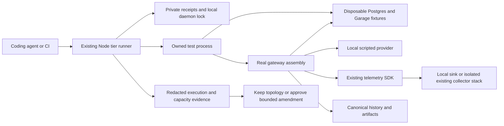

# 1. Harden-LLM resource efficiency and measured capacity plan

- Project: Harden-LLM self-hosted REST gateway and test infrastructure.
- Document ID: `PLAN-HLLM-SCALE-001`.
- Version: `3.0`; date: `2026-09-21`.
- Owners: repository maintainer for scope and release approval; implementing coding agent for changes and evidence; deployment operator for private configuration and promotion.
- Status: implementation active; P00 complete, P01 in progress, P02-P04 pending.
- Reviewed source: `67937729b4e5b0d58d2883bdd09155e49ac72612`; local `main` is seven commits ahead of its recorded `origin/main`. Refresh before execution.
- Governing documents: [repository instructions](../AGENTS.md), [complete testing guidelines](../docs/liveview-go-testing-guidelines.md), [architecture](../docs/architecture.md), [OpenAPI](../api/openapi.yaml), and [canonical backend test catalog](from_utility-llm/harden-llm-self-hosted-test-spec.md).

Make Docker-backed verification trustworthy, measure the existing application under bounded synthetic traffic, and select only evidence-backed capacity changes. Reuse the current runner, service pools, persistence, telemetry, and release tooling. The default successful result retains the production topology. This document defines implementation and release gates; editing it does not authorize running workloads, changing production, or publishing the seven existing local commits.

## 2. Design consensus and trade-offs

| Topic | Verdict | Decision and rationale |
| --- | --- | --- |
| Cleanup before capacity redesign | FOR | Leaked fixtures consume shared-host resources and invalidate timing evidence. Fix ownership and teardown first. |
| Containers as request workers | AGAINST | The production services are persistent; production requests do not each create a container. Container count alone is not a scaling metric. |
| Reuse current components | FOR | The Node runner already schedules tasks and starts pooled Postgres/Garage; gateway telemetry already batches asynchronously. Extend their boundaries, not their replacements. |
| Global local coordination | DECISION | Coordinate independent Docker selections against the same local daemon using a shared Linux process lock. Existing per-invocation exclusivity is insufficient. |
| Share every database/bucket | AGAINST | Application Postgres/Garage and Langfuse storage have distinct owners and contracts. Collapsing them is a migration, not routine pooling. |
| Move telemetry to save money | DECISION | Moving a service shifts cost. Claim savings only for removed duplication, reduced retained data, downsizing, or an avoided purchase. |
| Scale gateway independently | FOR | Reuse existing stores/collector when capacity permits; a gateway replica does not imply another complete observability stack. |
| Shared Phoenix sessions first | AGAINST | The single-replica encrypted vault is not a prerequisite for REST gateway capacity work. UI horizontal availability is a separate requirement. |
| Increase timeouts | AGAINST | Preserve existing deadlines, readiness intervals, and assertions; diagnose setup, attempts, waits, provider latency, host pressure, and cleanup. |
| Full trace delivery through any outage | AGAINST | Finite buffers and non-blocking export cannot guarantee unlimited lossless retention. Canonical execution records and accounting remain durable. |
| Exactly-once provider replay | AGAINST | A lost response can have an unknown paid-provider outcome. No automatic replay or inferred idempotency contract. |
| Immediate infrastructure expansion | AGAINST | No default Kubernetes, new broker/cache, managed-store migration, or application ClickHouse projection. Evidence and a concrete amendment come first. |
| Separate release tracks | DECISION | After cleanup is trustworthy, [recovery production closeout](recovery-production-closeout-plan.md) can resume independently of capacity exploration. Its remaining acceptance does not become a benchmark dependency. |
| Synthetic capacity evidence | DECISION | Local scripted providers exercise application overhead and recovery mechanics, not real-provider capacity or semantic quality. |
| Production promotion | DECISION | Docs/test-only changes publish source and reports without rebuilding application images. Runtime changes use scoped immutable artifacts and explicit production authority. |

## 3. PRD: stakeholder and system needs

- Problem: interrupted Compose fixtures and competing test invocations can leave expensive services behind. Slow verification then encourages timeout guesses. Project-level resource totals can also be wrong when human-readable memory units are parsed incompletely.
- Users: coding agents diagnosing failures; maintainers certifying changes; REST clients and agent systems using the gateway; operators managing a shared Docker host.
- Value: reliable failures, bounded feedback cost, recoverable ownership records, and defensible decisions about millions of requests.
- Business goals: prevent abandoned test resources; reduce avoidable setup duplication; identify safe sustainable workload regions and actual cost drivers without growing the architecture speculatively.
- Success metrics: zero unaccounted task-owned resources after accepted cleanup; zero deletion of sentinel/non-owned resources; complete workload accounting; truthful measurement units and provenance; unchanged existing acceptance thresholds.
- Scope: test lifecycle ownership, local invocation coordination, bounded failure evidence, opt-in application capacity harness, cost/comparability reports, decision gates, and applicable source/release closeout.
- Non-goals: production traffic generation, browser testing, paid-provider canaries, session-vault migration, database consolidation, new telemetry databases, background job APIs, and distributed request replay.
- Dependencies: available Linux Docker/Compose host or existing isolated GitHub runner; current pinned toolchains; canonical contracts; synthetic credentials; an explicit traffic/SLO contract for production capacity certification.
- Assumptions: one maintainer-controlled local daemon for host-lock guarantees; trusted repository processes; private persistent receipt storage outside disposable scratch; no production data in fixtures.
- Risks: Docker can become unresponsive; a supervisor can receive SIGKILL; concurrent work can change source identity; current telemetry backends have shared consumers; benchmark results can be limited by the driver itself.
- Scope boundary: no current business SLO or “millions” time interval is asserted. One million requests/day is approximately 11.6 requests/second; this arithmetic is not capacity certification.

### 3.1 Evidence baseline and reuse map

Historical observations recorded during incident analysis were 109 running containers: 16 production Harden-LLM, 14 abandoned smoke, 79 elsewhere. They are not a refreshed inventory. Sampled Docker memory was approximately 3.53 GiB for production and 2.13 GiB for smoke; these are snapshots, not RSS, peaks, or guaranteed savings. An earlier aggregate for other projects was invalid because it ignored GiB-valued rows; do not reuse it.

| Existing surface | Current capability or gap | Planned treatment |
| --- | --- | --- |
| `scripts/run-test-tier.mjs` | Per-task Postgres/Garage pool; invocation-local resource classes; temporary run directory removed after execution | Keep scheduling and pools; add durable ownership, authoritative parent cleanup, and daemon-scoped local guard. |
| `internal/integrationtest/pool.go` | Unique database and artifact-prefix isolation | Retain isolation; no wider pool lifetime without measured benefit. |
| `internal/integrationtest/compose.go` | Exclusive Garage lifecycle; cleanup registration follows some startup work | Register before first mutation. |
| `internal/smoke/harness_compose.go` | Pre-start unbounded `down`; cleanup errors logged; child owns callback | Remove the unnecessary pre-start deletion; transfer final cleanup acceptance to parent. |
| `internal/smoke/frontend_fixture_test.go` | Related fixture lifecycle | Reuse ownership protocol without enabling its browser path. |
| `scripts/benchmark-test-feedback.mjs` | Fingerprints, timings, runner reuse; some benchmark lanes include browsers | Reuse primitives; never invoke all lanes implicitly. |
| `.github/workflows/test-hierarchy.yml` | Existing `ubuntu-latest` browser-free release job | Reuse isolated CI; retain bounded failure artifacts. |
| `internal/gateway/telemetry_runtime.go`, `internal/gateway/telemetry_failure_test.go` | Bounded SDK queues and blocked-exporter isolation coverage | Measure existing implementation; retain cheap failure regression. |
| `deploy/otel/collector.yaml` | Memory limiter, queues, batching, redaction, environment pipelines, tail sampling | Inventory consumers before any policy change. |
| `cmd/harden-llm-gateway/server.go`, `internal/postgres/store.go` | Real application assembly, connection pool, readiness and bounded shutdown | Exercise these components directly. |
| `internal/gateway/run_service.go`, `internal/postgres/artifact_lifecycle.go` | Canonical persistence and advisory-lock reconciliation | Preserve them; do not add a second leader or persistence mechanism. |
| `frontend/lib/harden_llm_web/session_vault.ex` | Single-replica encrypted session vault | No changes in this plan. |

## 4. SRS: canonical requirements

The following IDs are proposed additions; P00 checks for allocation collisions. Acceptance is defined here; test mappings exist only in Sections 7 and 10.

| Requirement | Type | Acceptance criteria |
| --- | --- | --- |
| REQ-341 | func | Every managed Docker fixture records validated run/project/daemon ownership before creation; a missing or invalid receipt prevents mutation. |
| REQ-342 | reliability | The parent terminates/reaps owned creation processes, removes only proven-owned disposable resources, and inventories leftovers. Unknown state, failed exact cleanup, non-empty final inventory, or unpersisted ownership makes the task unaccepted without hiding its original failure. A failed best-effort Compose `down` may be a warning only when exact fallback cleanup, empty final inventory, and the `cleaned` receipt are all verified; the warning remains in the report. |
| REQ-343 | security | Independent local Docker invocations share a daemon-specific lock. Recovery requires dead-owner proof; active, ambiguous, corrupt, or non-owned resources are not deleted. |
| REQ-344 | nfr | Existing pools, isolation, timeout budgets, assertions, recovery policies, and opt-in tiers remain intact. Fast selection stays offline, Docker-free, and browser-free. |
| REQ-345 | reliability | Setup, diagnostics, cleanup, and evidence are bounded. Redacted receipts and cleanup-pending reports survive child failure, supervisor death, and temporary-run-directory removal. |
| REQ-346 | data | Resource reports use bytes and exact project attribution; all accepted memory units are parsed or rejected explicitly. Snapshots, sampled peaks, process RSS, and host pressure have different fields. |
| REQ-347 | int | Capacity tests use real auth, REST/client decoding, application assembly, runtime/provider adapter, Postgres, and Garage with isolated synthetic data and a local scripted provider. No production endpoint or paid credential is accepted. |
| REQ-348 | perf | Offered arrivals are scheduled independently of completions, work is bounded, and all launched/unsent/terminal outcomes reconcile. HTTP 200 alone is not streaming success; a terminal success event is required. |
| REQ-349 | reliability | Canonical history, stage accounting, and artifacts remain accurate when external export is blocked. Missing observations and uncertain provider outcomes are not fabricated as zero or retried automatically. |
| REQ-350 | data | Cost comparisons carry matching workload/configuration fingerprints, explicit retention assumptions, request/output denominators, and price provenance. Unknown actual cost stays unknown; official-equivalent CPA token pricing is labeled separately. |
| REQ-351 | func | The report yields sufficient-current-topology, measured-bottleneck, availability-requirement, or insufficient-evidence. No production topology change proceeds without a concrete, approved requirement/test amendment. UI session scaling is independent. |
| REQ-352 | int | Accepted release evidence identifies tested source, remote commit, affected artifacts, deployed identities when applicable, rollback boundary, and unperformed checks. Docs/test-only publication does not imply an application deployment. |

### 4.1 Errors and telemetry

- Preserve first application failure plus separate cleanup failures and warnings; never convert unknown inventory into zero leftovers. A Compose `down` warning is non-fatal only after exact fallback cleanup, an empty final inventory, and durable `cleaned` receipt are verified.
- Emit structured phase timings: lock wait, registration, pull/build/start/readiness, request execution, diagnostics, child stop, cleanup, final inventory.
- Keep receipts on failure with `cleanup_pending`; report unavailable Docker separately from failed assertions.
- Retain existing trace/origin/run/stage IDs and persisted diagnostics; do not log tokens, prompts, credentials, connection strings, or unredacted Docker environment.
- Record provider calls by stage and model, retry waits, time to first event, stream progress, terminal state, and dispatch count. Cache hits and programmatic repair are not provider calls.
- Preserve the 300-second Compose readiness measurement including `up --build --wait` and the existing default 60-second run budget. New internal limits do not grant larger enclosing task deadlines.

### 4.2 Architecture



```text
System: Harden-LLM
  Person: maintainer/coding agent
    -> Container: existing Node test supervisor
       -> Component: local-daemon lock + durable receipt ledger
       -> Container: owned test process
          -> Component: real gateway, auth, runtime, provider adapter
          -> Containers: disposable application Postgres/Garage
          -> Container: scripted local provider
          -> Containers: existing telemetry topology, when selected
       -> Data: bounded redacted reports outside disposable scratch
  Production boundary: unchanged unless a separate measured amendment passes
  UI boundary: Phoenix and its current session vault remain independent
```

## 5. Iterative implementation and test plan

### 5.1 Strategy and controls

- Standards tailoring: informed by ISO/IEC/IEEE 29148, 29119-3, and 12207; not a claim of ISO, IEEE, or FAA compliance. Safety-critical use requires separate assurance-level, independence, review, structural-coverage, tool-qualification, and certification-output decisions.
- Work sequentially by subtask. Advance only after its validation passes or a blocker is recorded; never treat a documented blocker as permission to execute a dependent mutation.
- Follow RED, GREEN, then justified REFACTOR/VERIFY. RED must fail an assertion about the missing behavior, not merely a missing executable or syntax error. Introduce test seams without changing observable behavior when necessary.
- Register each new test in the canonical catalog, `docs/requirements-traceability.md`, and its primary task when its file becomes executable. Every added/changed test file carries `SPEC-HARDEN-LLM-SELF-HOSTED-TESTS-001` and a comment such as `// TEST-271`.
- Do not invent production APIs or commands. Proposed files and task selectors below are created in the named subtask before first execution; ordinary Node/Go runners already exist.
- `branch_limits: 1` implementation line and at most one evidence-backed remedy under review; no parallel competing Docker experiments.
- `reflection_passes: 2` bounded reviews per phase: requirements/test adequacy before implementation, evidence/scope review before exit.
- `early_stop%: 100` for safety failures: any ownership ambiguity, secret exposure, production endpoint, or invalid accounting stops that workload immediately. Capacity-pressure stops use Section 6; failed samples remain in the report.
- No automatic rerun of ambiguous paid or mutating operations. Diagnose any timeout before repeating; no timeout increase without RCA and ADR.
- Any metric threshold change requires an ADR revision, rationale, and the same benchmark/oracle rerun. The initial proposed new thresholds are ratified in ADR-HLLM-027 before execution.
- At phase boundaries, record source SHA and diff state, commit only reviewed files, and name the checkpoint in Section 11. Git tags/restore points are phase-boundary records, not coding subtasks; never reset unrelated work.

| Phase | Dependency | Outcome |
| --- | --- | --- |
| P00 | None | Recorded baseline and binding acceptance contracts |
| P01 | P00 | Trustworthy managed Docker lifecycle |
| P02 | P01 | Reproducible current-topology capacity and cost evidence |
| P03 | P02 | Evidence-backed architecture disposition |
| P04 | Applicable preceding gates | Published scoped changes and complete evidence |

P01 can unblock the separate recovery closeout before P02 finishes. Capacity certification may remain explicitly unavailable while a completed cleanup fix ships.

### 5.2 Risk register and stop/resume policy

| Risk | Trigger | Mitigation |
| --- | --- | --- |
| Wrong-resource deletion | Receipt mismatch, non-owned attachment, reused PID, corrupt state | Stop deletion; preserve receipt; require exact owner resolution. Never use global prune. |
| Dead Docker daemon | Bounded inventory/cleanup deadline expires | Mark unknown/cleanup-pending and fail acceptance; recover on the next guarded invocation after daemon recovery. |
| Supervisor SIGKILL | No final cleanup report | Surviving supervisor cleans its child; killed supervisor is recovered only by a later owner with boot/PID/start-time proof. No immediate-cleanup claim. |
| Local lock overclaim | Remote daemon shared by multiple client hosts | Stop automatic recovery/certification; require daemon-owner coordination. A local file lock is not distributed exclusion. |
| Late creation race | Docker creation still active during teardown | Stop and reap process group before removal; inventory repeatedly within bounded cleanup and reject unresolved resources. |
| Invalid benchmark | Generator lags, missing outcomes, unsupported metric | Publish raw evidence as invalid/insufficient, not capacity success. |
| Host interference | Low disk/memory headroom or unrelated load spike | Stop next scenario, preserve current report, rerun only after a recorded environmental change. |
| Storage contamination | Production DSN, unsafe bucket/prefix, shared user data | Fail before dispatch; use synthetic owners and owned database/bucket resources. |
| Scope expansion | Proposed new service, migration, availability SLO, or purchase | Amend this file with concrete requirements, failing tests, rollback, and authority before implementation. |
| Release drift | Candidate SHA differs from CI/runtime/artifacts | Reconcile identities and rerun affected gates; do not silently certify a different candidate. |

Resume from the last accepted subtask after the trigger is resolved and recorded. Never erase failed attempts, skip required cases, weaken assertions, or mark selected unfinished work complete. Metric estimates below are planning judgments, not measured pass probabilities; YAGNI is 1–5, where 5 means strongly justified.


### Phase P00: Recorded baseline and binding acceptance contracts

- Goal: an implementer can identify the source, ownership boundaries, and acceptance controls without guessing.
- Scope: REQ-341–REQ-352 contract allocation only; no runtime mutation.
- Impacted surfaces: this plan; `docs/adr/ADR-HLLM-027-resource-ownership-and-measured-capacity.md` (proposed); `plans/from_utility-llm/harden-llm-self-hosted-implementation-plan.md`; canonical backend test catalog; `docs/requirements-traceability.md`.
- Lifecycle evidence: requirement table and ID audit; source/runner/fixture inspection; static policy verification for executable registration; purpose is scope and reproducibility; checkpoint is reviewed source plus docs diff; risks are stale Git state and overlapping ID allocation.
- Unresolved decision: production workload/SLO and any infrastructure purchase remain unapproved; exploratory measurements need neither.

- `P00.S01 Record the checkout and lifecycle ownership baseline`
  - Action: Read AGENTS.md and the complete testing guidelines; inspect the reuse-map sources and existing recovery release record. Record candidate ancestry without discarding local work.
  - Why now: All later evidence must identify the actual source and resource owner.
  - Files/surfaces: `AGENTS.md`; `docs/liveview-go-testing-guidelines.md`; `scripts/run-test-tier.mjs`; `internal/smoke/harness_compose.go`; `plans/recovery-production-closeout-plan.md`.
  - Requirement link: REQ-341, REQ-344, REQ-352
  - Verification link: N/A: bounded source inspection
  - Verification mode: VERIFY
  - Command/procedure: `git status --short --branch`; `git rev-parse HEAD`; `git log --oneline origin/main..HEAD`; inspect the named files without invoking Docker.
  - Expected result: Current ancestry, lifecycle gaps, and existing capabilities are recorded, with historical observations labeled historical.
  - Evidence produced: Section 11 baseline entry and exact source SHA.
  - Stop/escalate condition: Unrelated edits overlap target files or production ownership is ambiguous.
  - Unlocks: P00.S02
- `P00.S02 Register requirements and ratify the new bounded contracts`
  - Action: Reserve new IDs after searching the catalog; add requirement/test definitions as planned, not passing. Write ADR-HLLM-027 with receipt/guard boundaries and initial evaluation limits. Add the new static test tag without changing policy behavior. No refactor needed: only documentation and a traceability comment change here.
  - Why now: Acceptance must exist before implementation; no future task command becomes mandatory before its test file exists.
  - Files/surfaces: `docs/adr/ADR-HLLM-027-resource-ownership-and-measured-capacity.md` (proposed); `docs/requirements-traceability.md`; `plans/from_utility-llm/harden-llm-self-hosted-test-spec.md`; `scripts/verify-test-tiers.mjs`.
  - Requirement link: REQ-341, REQ-343, REQ-344, REQ-348, REQ-352
  - Verification link: TEST-279; EVAL-008
  - Verification mode: VERIFY
  - Command/procedure: `node scripts/verify-test-tiers.mjs`; `git diff HEAD --check`.
  - Expected result: Existing static baseline passes; future coverage remains pending. No active manifest entry references an absent file.
  - Evidence produced: ADR, allocation audit, and baseline command output.
  - Stop/escalate condition: ID collision, unexplained baseline failure, or a proposed threshold contradicts existing timeout policy.
  - Unlocks: P00.S03
- `P00.S03 Confirm the planning checkpoint has no runtime effect`
  - Action: No refactor needed: this phase changes documentation and traceability comments only. Record static policy violations and command elapsed time.
  - Why now: Establish a clean planning exit without application builds.
  - Files/surfaces: This plan; `scripts/verify-test-tiers.mjs`.
  - Requirement link: REQ-344, REQ-352
  - Verification link: TEST-279; EVAL-008
  - Verification mode: MEASURE
  - Command/procedure: `node scripts/verify-test-tiers.mjs`; `git diff HEAD --check`.
  - Expected result: Zero policy/whitespace violations and no runtime/configuration changes.
  - Evidence produced: Static output, elapsed time, and phase checkpoint.
  - Stop/escalate condition: A docs change requires a behavioral workaround to pass.
  - Unlocks: P00 exit

- Exit: proceed when IDs/contracts and static baseline are valid; escalate collisions or unclear scope; stop if resolving them requires unapproved runtime work.
- Estimates: confidence 95% (source is local); robustness 90% (explicit contracts reduce drift); internal interactions 4 (plan/catalog/ADR/policy); external interactions 0 (offline); complexity 15% (documentation); creep 5% (bounded scope); debt 5% (one authoritative plan); YAGNI 5/5 (required groundwork); MoSCoW Must; scope local; architectural changes 0.

### Phase P01: Trustworthy managed Docker lifecycle

- Goal: every accepted managed Docker task has a proven clean resource inventory and retained failure evidence.
- Scope: REQ-341–REQ-345 and REQ-352; retain pooling and all existing test meanings.
- Impacted surfaces: `scripts/run-test-tier.mjs`; proposed `scripts/test-resource-lifecycle.mjs`; proposed Node lifecycle tests; proposed `internal/integrationtest/resource_receipt.go` and its test; existing smoke/frontend/exclusive-Garage fixtures; `Makefile`; `test/test-tiers.json`; static policy; existing CI workflow.
- Lifecycle evidence: receipt/state contract and RED fixtures; runner/Go integration diffs; fake-Docker checks before real boundary checks; purpose is reliable failure and cancellation handling; checkpoint includes source, fixture digests, daemon identity, reports; assumptions are trusted Linux processes and one local daemon coordination domain.
- Unresolved decision: remote multi-host daemon exclusion is outside this local-lock guarantee.

- `P01.S01 Add failing ownership teardown and routing regressions`
  - Progress: DONE — the new tests fail at the expected behavior assertions; no production implementation began before these RED observations.
  - Action: Create executable pure Node tests for receipt ordering, parent teardown, flock coordination, and fault cases; add untagged pure Go receipt coverage. Add static assertions for managed Make routing and cheap/expensive task isolation. Use minimal behavior-preserving seams to get assertion failures.
  - Why now: These failures bind every lifecycle behavior changed by the next steps.
  - Files/surfaces: `scripts/test/test_resource_lifecycle_test.mjs`; `internal/integrationtest/resource_receipt_test.go` (both proposed); `scripts/test/run_test_tier_test.mjs`; `scripts/verify-test-tiers.mjs`.
  - Requirement link: REQ-341, REQ-342, REQ-343, REQ-344, REQ-345, REQ-352
  - Verification link: TEST-271, TEST-272, TEST-273, TEST-279, TEST-280
  - Verification mode: RED
  - Command/procedure: `node --test --test-name-pattern=TEST-271 scripts/test/test_resource_lifecycle_test.mjs`; `node --test --test-name-pattern=TEST-272 scripts/test/test_resource_lifecycle_test.mjs`; `node --test --test-name-pattern=TEST-273 scripts/test/test_resource_lifecycle_test.mjs`; `node scripts/verify-test-tiers.mjs`; `go test ./internal/integrationtest -run '^TestResourceReceipt' -count=1`.
  - Expected result: Each new invariant fails for its missing behavior; existing assertions remain intact.
  - Evidence produced: Tagged regression files and named failing assertions.
  - Stop/escalate condition: Failure is only import/compile failure, depends on real Docker, or requires weakening existing assertions.
  - Unlocks: P01.S02
- `P01.S02 Register fixture ownership before Docker creation`
  - Progress: DONE — Node and Go use the version-1 shared receipt vector; managed pool and Go Compose paths register before create/pull/up.
  - Action: Implement the private atomic Node/Go receipt contract. Allocate ownership before pool, smoke, frontend fixture, or exclusive Garage mutation. Bind each resource ID to the receipt's unique Compose project and run; require exact Docker project labels for Compose resources, and add a custom label only where the existing Compose resource definition supports it. Reject unmanaged fixture entrypoints with the managed command. Remove newly generated projects' unnecessary pre-start down.
  - Why now: Parent cleanup cannot safely act without durable ownership established before startup.
  - Files/surfaces: `scripts/test-resource-lifecycle.mjs`; `internal/integrationtest/resource_receipt.go` (proposed); `scripts/run-test-tier.mjs`; `internal/integrationtest/compose.go`; `internal/smoke/harness_compose.go`; `internal/smoke/frontend_fixture_test.go`.
  - Requirement link: REQ-341, REQ-345
  - Verification link: TEST-271, TEST-280
  - Verification mode: GREEN
  - Command/procedure: `node --test --test-name-pattern=TEST-271 scripts/test/test_resource_lifecycle_test.mjs`; `go test ./internal/integrationtest -run '^TestResourceReceipt' -count=1`.
  - Expected result: Receipts survive scratch removal; registration failures cause zero Docker mutation.
  - Evidence produced: Passing Node/Go contract output and fixture registration diff.
  - Stop/escalate condition: Any creation path can bypass registration or requires persisting credentials.
  - Unlocks: P01.S03
- `P01.S03 Make parent cleanup authoritative and bounded`
  - Progress: DONE — unresolved cleanup failures fail acceptance; the runner reaps timed-out child groups before reconciliation and removes only exact project-labeled resources with no foreign attachments. A failed best-effort Compose `down` is reported as a warning only when exact fallback cleanup, empty final inventory, and durable `cleaned` receipt are all verified. New TEST-281 also proves ordinary task cleanup cannot age later tasks' bounded cleanup allowance; only failure/cancellation begins the shared bounded tail.
  - Action: Stop/reap owned child process groups; perform bounded diagnostics and exact-ID cleanup after validating labels/attachments. Re-inventory late creations; fail on leftovers or unknown state. Preserve original failure and cleanup error separately. Keep receipt/report outside deleted runner scratch.
  - Why now: Ownership now exists; teardown can become an acceptance condition.
  - Files/surfaces: `scripts/run-test-tier.mjs`; `scripts/test-resource-lifecycle.mjs`; existing smoke and frontend fixture cleanup callbacks.
  - Requirement link: REQ-342, REQ-345
  - Verification link: TEST-272, TEST-281
  - Verification mode: GREEN
  - Command/procedure: `node --test --test-name-pattern=TEST-272 scripts/test/test_resource_lifecycle_test.mjs`; `node --test --test-name-pattern='TEST-281 cleanup budgets' scripts/test/run_test_tier_test.mjs`.
  - Expected result: Success cannot mask unresolved cleanup failure; a verified exact fallback after failed Compose `down` is visible as a warning, while unknown inventory, failed removal, attachments, remaining resources, or receipt-write failure still fails acceptance. Buffers and total cleanup work remain bounded.
  - Evidence produced: Fault-matrix output, redacted pending receipt examples, and phase timings.
  - Stop/escalate condition: Non-owned attachment, unavailable identity, or teardown exceeds its remaining budget.
  - Unlocks: P01.S04
- `P01.S04 Coordinate independent local Docker invocations`
  - Progress: DONE — Docker selections use a private daemon-keyed Linux flock, pass a verified lease through nested managed tasks, and recover only receipts whose prior supervisor is proven dead.
  - Action: Acquire one shared daemon-keyed flock for Docker selections, including direct benchmark runTasks callers. Pass one owned lease through managed child paths to prevent nested deadlock. Recover stale receipts only with boot ID, PID, and process-start proof; TTL alone never authorizes deletion. Reject non-local Docker endpoints; cap lock wait at 30 s and report daemon-identification, lock-wait, and stale-recovery durations separately.
  - Why now: Now teardown is safe, independent invocations can coordinate creation and recovery.
  - Files/surfaces: `scripts/test-resource-lifecycle.mjs`; `scripts/run-test-tier.mjs`; `scripts/benchmark-test-feedback.mjs`.
  - Requirement link: REQ-343, REQ-344
  - Verification link: TEST-273
  - Verification mode: GREEN
  - Command/procedure: `node --test --test-name-pattern=TEST-273 scripts/test/test_resource_lifecycle_test.mjs`.
  - Expected result: Same-daemon test invocations serialize; different daemon IDs do not collide; pure tasks avoid Docker and the guard; active/corrupt owners and unrelated-daemon resources survive; dead/reused-PID/prior-boot receipts recover; lock timeout is bounded; nested execution reuses its lease.
  - Evidence produced: Two-process exclusion and dead-owner recovery evidence.
  - Stop/escalate condition: Remote shared daemon, untrusted lock directory, reused PID ambiguity, or lease recursion.
  - Unlocks: P01.S05
- `P01.S05 Wire managed entrypoints and retained CI evidence`
  - Progress: DONE — the public Compose target uses the manifest runner; bounded private reports are retained for fast/integration/release CI; focused and aggregate static checks pass.
  - Action: Route make test-compose to the existing runner's go-compose task; make that task execute the original raw Go smoke command, avoiding recursion. Register runner-contracts in fast/release with existing runner tests and new pure Node files. Register the pure Go receipt contract in go-static. Update static requiredCommands accordingly. Keep integration pools per task and Garage exclusivity. Atomically persist private per-run reports capped at 2 MiB and add always-upload report steps to the existing fast, integration, and release jobs so routine timeout failures retain evidence.
  - Why now: Ownership must cover public entrypoints and reports must survive CI cancellation/failure.
  - Files/surfaces: `Makefile`; `test/test-tiers.json`; `scripts/verify-test-tiers.mjs`; `.github/workflows/test-hierarchy.yml`; `docs/requirements-traceability.md`.
  - Requirement link: REQ-344, REQ-352
  - Verification link: TEST-279
  - Verification mode: GREEN
  - Command/procedure: `node scripts/verify-test-tiers.mjs`.
  - Expected result: No bypass or recursive Make path; no Docker/browser/live work in fast; executable runner tests become discoverable; hosted artifact handling cannot hide test failure.
  - Evidence produced: Manifest selection, workflow, traceability, and static output.
  - Stop/escalate condition: Task registration changes existing release contents, permits browsers implicitly, or uploads unredacted records.
  - Unlocks: P01.S06
- `P01.S06 Consolidate lifecycle helpers without changing assertions`
  - Progress: DONE — focused review found no redundant lifecycle owner or duplicate cleanup implementation worth extracting; a no-op refactor avoided adding abstractions.
  - Action: Keep one Node lifecycle helper and one pure Go receipt adapter; remove duplicate ownership/cleanup logic. Preserve fixture assertions and budgets; compile Compose-tagged frontend fixtures without executing them.
  - Why now: Three lifecycle fixes must not leave competing owners or duplicated policy.
  - Files/surfaces: `scripts/test-resource-lifecycle.mjs`; `scripts/run-test-tier.mjs`; `internal/integrationtest/resource_receipt.go`; existing fixture files.
  - Requirement link: REQ-341, REQ-342, REQ-343, REQ-344, REQ-345
  - Verification link: TEST-271, TEST-272, TEST-273, TEST-279, TEST-280
  - Verification mode: REFACTOR
  - Command/procedure: `node --test --test-name-pattern=TEST-271 scripts/test/test_resource_lifecycle_test.mjs`; `node --test --test-name-pattern=TEST-272 scripts/test/test_resource_lifecycle_test.mjs`; `node --test --test-name-pattern=TEST-273 scripts/test/test_resource_lifecycle_test.mjs`; `node scripts/verify-test-tiers.mjs`; `go test ./internal/integrationtest -run '^TestResourceReceipt' -count=1`; `node --test scripts/test/run_test_tier_test.mjs`; `go test -tags=compose ./internal/smoke ./internal/eval -run '^$'`; `make test-fast`.
  - Expected result: All affected deterministic checks pass; compile-only command starts no fixtures.
  - Evidence produced: Refactor diff and broad fast report.
  - Stop/escalate condition: Coverage loses an assertion, helper adds a new scheduler, or existing timeouts change.
  - Unlocks: P01.S07
- `P01.S07 Exercise owned cancellation against a real Docker daemon`
  - Progress: PARTIAL — deterministic policy and fast gates pass. The real Docker TEST-274 passed four scenarios (success, partial create, TERM, supervisor SIGKILL/next-owner recovery), preserved the independently receipted sentinel, left all receipts `cleaned`, and produced no cleanup warnings/errors. Adding a TERM trap to PID 1 eliminated the prior 30-second Compose stop warnings; no task timeout/readiness limit changed. The distinct full Compose smoke failed at the one-shot bootstrap command after 321.765 s; its original assertion is not waived. Diagnose/verify the retry path on an isolated runner before P01 exit.
  - Action: Create and register the opt-in test-resource-lifecycle-docker task and its test file before running it. Use cached `alpine@sha256:d9e853e87e55526f6b2917df91a2115c36dd7c696a35be12163d44e6e2a4b6bc` with pulls disabled, a separately receipted sentinel project, and an owned child-supervisor tree. Exercise success, partial create, TERM, SIGKILL, and next-owner recovery without killing the test controller or daemon. Run the existing full Compose smoke for its distinct topology/correlation boundary. After its full-stack readiness and topology checks, the one-shot bootstrap command must reuse running dependencies and the built image (`--no-deps --pull never`); it still performs the original bootstrap/login/run/correlation assertions.
  - Why now: Cheap root invariants are green; the remaining uncertainty is actual Docker/process behavior.
  - Files/surfaces: `scripts/test/test_resource_lifecycle_docker_test.mjs` (proposed); `test/test-tiers.json`; `scripts/verify-test-tiers.mjs`; `internal/smoke/harness_compose.go`.
  - Requirement link: REQ-341, REQ-342, REQ-343, REQ-344, REQ-345
  - Verification link: TEST-274, TEST-279; EVAL-009
  - Verification mode: MEASURE
  - Command/procedure: `node scripts/verify-test-tiers.mjs`; `node scripts/run-test-tier.mjs --task test-resource-lifecycle-docker`; `node scripts/run-test-tier.mjs --task go-compose --output tmp/test-feedback/scale-compose.json`.
  - Expected result: Zero owned leftovers and zero sentinel deletions; full topology/readiness/correlation assertions unchanged; cleanup reports survive. The one-shot bootstrap runs against the just-verified stack without dependency restart or image resolution.
  - Evidence produced: Daemon/image fingerprints, fault results, receipt inventory, and full-smoke report.
  - Stop/escalate condition: Wrong-owner deletion attempt, Docker loss, missing cached digest, sentinel mutation, changed readiness interval, or unresolved cleanup. On ownership ambiguity, stop and preserve receipts and fixture Compose files.
  - Risks/follow-ups: The real fault boundary was observed on one local daemon only. Keep warning reporting; if another daemon/Compose combination warns, capture exact command, container state, and daemon logs before attributing cause. This is not broad multi-host Docker certification. The shared reference host has 109 running containers, 99.9% swap used, and 8.8% 5-minute full I/O pressure; do not repeat the 15-service Compose stack there while pressure remains high. Use an isolated CI runner or wait for a verified lower-pressure window; never stop unrelated containers to manufacture headroom. Preserve explicit-only selection and existing cleanup bounds.
  - Unlocks: P01 exit

- Exit: proceed after cheap and real boundaries pass with zero unaccounted resources; escalate daemon/ownership uncertainty; stop unapproved infrastructure expansion. Record the checkpoint and unblock independent recovery closeout.
- Estimates: confidence 85% (known source defects); robustness 90% (parent plus durable recovery); internal interactions 8 (runner/helper/fixtures/policy/CI); external interactions 2 (Docker and hosted CI); complexity 65% (process cancellation races); creep 15% (strict local-daemon scope); debt 15% (one cross-language receipt contract); YAGNI 5/5 (confirmed leak risk); MoSCoW Must; scope local orchestration plus CI; architectural changes 1 (test lifecycle ownership only).


### Phase P02: Reproducible current-topology capacity and cost evidence

- Goal: bounded reports distinguish application throughput, provider/recovery amplification, storage cost, and measurement limits.
- Scope: REQ-346–REQ-350; REQ-351 report disposition; preserve REQ-344.
- Impacted surfaces: proposed `internal/capacity/scenario.go`, `driver.go`, `provider.go`, `report.go` and tests; proposed `test/capacity-scenarios.json`; proposed measurement helper/tests; proposed command-package capacity test; existing server assembly, smoke fixture, runner, and manifest.
- Lifecycle evidence: scenario/report contracts, failing arithmetic/scheduling/oracle cases, real persistence checks, bounded measurements; purpose is finding constraints without synthetic success claims; checkpoint includes source/config/scenario hashes, host/image fingerprints, seeds, and reports.
- Risks/assumptions: no agreed production SLO; scripted providers are not production provider evidence; CPU-bound client scheduling can invalidate results; secret-free real-service isolation is mandatory.
- Unresolved decisions: paid-provider pricing and production traffic distribution remain unknown unless supplied with provenance.

- `P02.S01 Add failing measurement driver and report oracles`
  - Progress: DONE for the deterministic instrument oracles. Driver, report, unit/resource, safety-threshold, and runner report-contract tests are registered at their existing cheap tiers; the first intended RED transcript was not retained, so no RED result is claimed in this record.
  - Action: Create pure resource-parser, Go driver, and report tests before their implementations. Cover complete units, scheduled arrivals, stream EOF, call-stage counts, endpoint rejection, unknown costs, and incompatible fingerprints. Add minimal compilable interfaces where needed.
  - Why now: The measurement instrument must have independently known answers before it measures the application.
  - Files/surfaces: `scripts/test/test_resource_measurement_test.mjs`; `internal/capacity/driver_test.go`; `internal/capacity/report_test.go` (proposed).
  - Requirement link: REQ-346, REQ-347, REQ-348, REQ-349, REQ-350, REQ-351
  - Verification link: TEST-275, TEST-276, TEST-278
  - Verification mode: RED
  - Command/procedure: `node --test scripts/test/test_resource_measurement_test.mjs`; `go test ./internal/capacity -run '^TestCapacityDriver' -count=1`; `go test ./internal/capacity -run '^TestCapacityReport' -count=1`.
  - Expected result: Known-answer fixtures expose missing instrument behavior through assertions.
  - Evidence produced: Tagged tests and RED output.
  - Stop/escalate condition: Oracles duplicate implementation arithmetic, depend on real providers, or fail only to compile.
  - Unlocks: P02.S02
- `P02.S02 Implement exact resource measurement and attribution`
  - Progress: Local deterministic checks pass and hosted identity/resource sampling succeeds. The latest hosted report attributes two containers/images exactly. TEST-275 now preserves parser reasons, explicitly reports RSS/volume-used bytes as uncollected, and sums fractional CPU percentages using finite decimal arithmetic. Docker memory remains null when the Docker CLI's human-readable binary-unit display would convert to a fractional byte; this avoids false exactness. The newer CPU aggregation requires one same-workload hosted correctness rerun before S02 is closed.
  - Action: Extend current runner measurements with numeric Docker API bytes and exact labels; isolate new pure conversion logic in one helper. If CLI text is used, support all listed units and reject unknown units. Record sampled peaks, timestamps, sampling gaps, host pressure, and unavailable metrics distinctly.
  - Why now: Resource accounting is independently testable and required by cost reporting.
  - Files/surfaces: `scripts/measure-test-resources.mjs` (proposed helper, not a new daemon); `scripts/run-test-tier.mjs`; `scripts/test/test_resource_measurement_test.mjs`.
  - Requirement link: REQ-346
  - Verification link: TEST-275
  - Verification mode: GREEN
  - Command/procedure: `node --test scripts/test/test_resource_measurement_test.mjs`.
  - Expected result: Mixed-unit examples and project totals match byte-exact expected values.
  - Evidence produced: Passing arithmetic/attribution cases and versioned resource record.
  - Stop/escalate condition: Implementation relabels Docker memory as RSS or treats a missing sample as zero.
  - Unlocks: P02.S03
- `P02.S03 Implement bounded scheduling and terminal-outcome accounting`
  - Progress: DONE for local deterministic checks. TEST-276 passes, including open-loop scheduling, recovery stages, stream terminal/EOF outcomes, accounting reconciliation, and exploration stop thresholds.
  - Action: Implement schema validation, open-loop arrival scheduling, bounded in-flight work, local scripted provider, and client outcome collection. Keep offered/sent/terminal counters and dispatch-stage counts distinct. Reject non-owned/non-local endpoints before dialing; represent unknown server admission honestly.
  - Why now: Correct scheduling and outcomes precede any real application measurement.
  - Files/surfaces: `internal/capacity/scenario.go`; `internal/capacity/driver.go`; `internal/capacity/provider.go`; `test/capacity-scenarios.json` (proposed).
  - Requirement link: REQ-347, REQ-348, REQ-349
  - Verification link: TEST-276
  - Verification mode: GREEN
  - Command/procedure: `go test ./internal/capacity -run '^TestCapacityDriver' -count=1`.
  - Expected result: Request/concurrency limits hold; launch lag and unsent work are visible; only run.completed denotes streaming success.
  - Evidence produced: Passing deterministic schedules and fault traces.
  - Stop/escalate condition: Driver hides backlog by waiting for completions, retries an unknown outcome, or uses production credentials.
  - Unlocks: P02.S04
- `P02.S04 Implement honest cost comparison and disposition output`
  - Progress: DONE for local deterministic checks. Cost/null reasoning, denominators, fingerprints, disposition classes, nearest-rank latency, p99 sample floor, and stream event/byte summaries are tested; real capacity data remains uncollected.
  - Action: Compute per-client-request and per-successful-output costs, token costs by stage/model, storage bytes and retention scenarios. Separate official-equivalent prices from actual bills. Require comparable fingerprints and sample quality before improvement claims; emit one of the four dispositions.
  - Why now: The application harness needs a report that cannot accidentally certify incomplete evidence.
  - Files/surfaces: `internal/capacity/report.go`; `internal/capacity/report_test.go`.
  - Requirement link: REQ-346, REQ-350, REQ-351
  - Verification link: TEST-278
  - Verification mode: GREEN
  - Command/procedure: `go test ./internal/capacity -run '^TestCapacityReport' -count=1`.
  - Expected result: Unknowns remain null with reasons; no-change and insufficient-evidence are both valid distinct outcomes.
  - Evidence produced: Known-answer costs and disposition fixtures.
  - Stop/escalate condition: Saving calculation assumes unpriced hardware is free or equates moving services with eliminating cost.
  - Unlocks: P02.S05
- `P02.S05 Add failing real-application capacity acceptance`
  - Progress: IMPLEMENTED; manifest/static policy, tagged compilation, local fast gate, and hosted correctness passed at `bffdf219`. Hosted RED evidence for earlier candidates remains below: owner setup first returned HTTP 401 and the Docker CPU report then exposed integer-only aggregation. The fixture uses existing `bootstrap-user`, shuts down the gateway before exporter dependencies, and TEST-275 now preserves exact unavailable-metric reasons and sums fractional CPU values. A later exploration revealed the history verifier and oversized-report issues recorded below; fresh correctness/exploration runs are required after those corrections.
  - Action: Create the capacity test and register capacity-baseline as explicit opt-in before invoking it. Use a minimal real application fixture and demand the missing workload/report/persistence integration. Register real-service ownership and capacity build tags, not a fake RunService. Extend static policy to exclude capacity from fast/default integration/release.
  - Why now: Pure instrument checks are green; the application and persistence boundary remains unproved.
  - Files/surfaces: `cmd/harden-llm-gateway/capacity_test.go` (proposed); `test/test-tiers.json`; `scripts/verify-test-tiers.mjs`; canonical catalog.
  - Requirement link: REQ-347, REQ-348, REQ-349
  - Verification link: TEST-277, TEST-279
  - Verification mode: RED
  - Command/procedure: `node scripts/run-test-tier.mjs --task capacity-baseline --output tmp/test-feedback/capacity-baseline.json`; `node scripts/verify-test-tiers.mjs`.
  - Expected result: Capacity acceptance fails on a missing real integration/report assertion, not absent commands or files; static selection remains valid.
  - Evidence produced: Executable opt-in task and named real-boundary failure.
  - Stop/escalate condition: Task enters an automatic selector, uses recordingRuntimeCaller, or substitutes a mock store for the boundary under test.
  - Unlocks: P02.S06
- `P02.S06 Connect the driver to real isolated application boundaries`
  - Progress: IMPLEMENTED; hosted correctness passed on `bffdf219af837be511ede1aeb62d42a7d179a2fa` after owner bootstrap, LIFO cleanup, metric-reason preservation, and fractional CPU aggregation. It exercised real auth, profile setup, six provider/runtime/cache/stream/export cases, persisted history/artifacts, and origin/stage accounting. The 44-second run reports CPU percentages as finite decimals; exact Docker memory remains unknown for the documented CLI precision reason.
  - Action: Call runGatewayServer from the command-package test with an injected environment and existing bootstrap/auth/profile paths. Use the existing Postgres/Garage leases, real provider adapter, synthetic credentials, and local TLS fixture. Verify stored history/artifact digests and origin/stage IDs. Keep the existing full-stack smoke as its own boundary; do not duplicate it or create another stack owner.
  - Why now: All missing behavior has failing pure and real-boundary coverage.
  - Files/surfaces: `cmd/harden-llm-gateway/capacity_test.go`; `cmd/harden-llm-gateway/server.go` (reuse); `internal/integrationtest/pool.go` (reuse); `internal/smoke/harness_compose.go`; `internal/capacity/driver.go`.
  - Requirement link: REQ-347, REQ-348, REQ-349
  - Verification link: TEST-277
  - Verification mode: GREEN
  - Command/procedure: `node scripts/run-test-tier.mjs --task capacity-baseline --output tmp/test-feedback/capacity-baseline.json`.
  - Expected result: Correctness cases pass through actual auth/runtime/persistence; local export failure does not corrupt canonical output; all fixtures clean up.
  - Evidence produced: Stored-state assertions, report, provider receive counts, and ownership inventory.
  - Stop/escalate condition: Artifact isolation cannot be proven, existing smoke assertions change, or full-stack reuse requires a public-provider call.
  - Unlocks: P02.S07
- `P02.S07 Consolidate the harness around existing owners`
  - Progress: DONE for local code review/static checks. Capacity owns only scenario generation/reporting; existing service pools and Compose smoke retain their owners. Full fast selector and pure report/resource tests pass on the current candidate except that the last tagged-only fingerprint hardening received compile-only verification.
  - Action: Remove duplicated bootstrap, wire-shape, measurement, or cleanup logic; keep only capacity-specific scheduling/reporting in the new package. Register new pure tests in their existing cheap lanes; preserve a separate expensive boundary.
  - Why now: Keep the new instrument small and prevent tests from creating alternate application behavior.
  - Files/surfaces: `internal/capacity/`; `cmd/harden-llm-gateway/capacity_test.go`; `internal/smoke/harness_compose.go`; `test/test-tiers.json`.
  - Requirement link: REQ-344, REQ-346, REQ-347, REQ-348, REQ-349, REQ-350, REQ-351
  - Verification link: TEST-275, TEST-276, TEST-278, TEST-279
  - Verification mode: REFACTOR
  - Command/procedure: `node --test scripts/test/test_resource_measurement_test.mjs`; `go test ./internal/capacity -run '^TestCapacityDriver' -count=1`; `go test ./internal/capacity -run '^TestCapacityReport' -count=1`; `node scripts/verify-test-tiers.mjs`; `make test-fast`.
  - Expected result: All instrument oracles and broad fast checks pass without Docker in fast.
  - Evidence produced: Refactor diff and fast report.
  - Stop/escalate condition: Helper duplicates production decisions or removes a real-boundary assertion.
  - Unlocks: P02.S08
- `P02.S08 Measure the bounded exploratory workloads`
  - Progress: First hosted exploration attempt on `bffdf219` failed in TEST-277 at the history assertion after `twelve-rps-short`. The REST verifier requested only the first 100-row page and ignored `nextCursor`; canonical store/run/trace/artifact checks for the scenario completed before that history assertion, so this was a verifier defect, not persistence loss. The partial report also exceeded its 1 MiB bound because it serialized full request results; the fallback report then failed to publish. No timeout, safety stop, or cleanup failure occurred. TEST-282 and TEST-278 now have regressions for cursor traversal and bounded v2 reporting. Fresh hosted correctness must pass before repeating exploration.
  - Action: Execute the Section 6 exploration set with project-level samples and a local telemetry sink. Keep full-stack smoke evidence separate and reuse it only for its distinct lifecycle/runtime assertion. Retain initial failures, generator lag, missing metrics, sample sizes, and bounded evidence. Record means, spread, and confidence limits only when supported.
  - Why now: Instrumentation and real integration now have verified oracles.
  - Files/surfaces: `test/capacity-scenarios.json`; `internal/capacity/report.go`; `tmp/test-feedback/capacity-baseline.json`; private retained lifecycle ledger.
  - Requirement link: REQ-346, REQ-347, REQ-348, REQ-349, REQ-350
  - Verification link: TEST-277; EVAL-010
  - Verification mode: MEASURE
  - Command/procedure: `HARDEN_LLM_CAPACITY_CASE_SET=exploration node scripts/run-test-tier.mjs --task capacity-baseline --output tmp/test-feedback/capacity-baseline-exploration.json`; use a separately named `holdout` run for the selected operating point. Run `make test-compose` only when its distinct service lifecycle boundary is required, preserving its existing assertions and task owner.
  - Expected result: Valid bounded baseline or explicit insufficient-evidence with cause; zero owned leftovers.
  - Evidence produced: Fingerprint-matched resource, timing, accounting, and cost reports.
  - Stop/escalate condition: Any Section 6 safety/pressure stop; never increase rate after the first failing scenario.
  - Unlocks: P02 exit

- Exit: proceed when instrument and real-boundary assertions pass and reports truthfully classify measurement quality; escalate missing capacity targets or unstable infrastructure; stop invalid safety/accounting. Missing business SLO means capacity is not certified, not that the cleanup fix failed.
- Estimates: confidence 80% (real assembly exists); robustness 85% (deterministic instrument oracles); internal interactions 7 (driver/server/auth/stores/provider/telemetry/report); external interactions 2 (Docker and isolated telemetry); complexity 70% (measurement validity); creep 20% (bounded scenario set); debt 20% (small reusable package); YAGNI 4/5 (needed before investment); MoSCoW Must for evidence, Could for production-scale certification; scope cross-module, no production mutation; architectural changes 0 to production.

### Phase P03: Evidence-backed architecture disposition

- Goal: one justified decision closes capacity planning without inventing a migration.
- Scope: REQ-349–REQ-351; no speculative behavior change.
- Impacted surfaces: this plan; `internal/capacity/report.go` (reuse); proposed ADR-HLLM-027; `tmp/test-feedback/capacity-baseline.json`.
- Lifecycle evidence: report provenance, cheap decision-oracle checks, independent holdout sample, signed-off disposition; purpose is distinguishing measured bottlenecks from guesses; checkpoint binds report and scenario hashes.
- Risks/assumptions: exploratory throughput is not a customer SLO; unknown price is not zero; initial samples may be too short for meaningful tail statistics.
- Unresolved decision: a runtime remedy cannot be specified truthfully before the bottleneck is known. A selected remedy requires a same-file amendment with exact files, REQs, RED/GREEN commands, budgets, and rollback before coding.

- `P03.S01 Select the smallest evidence-supported disposition`
  - Action: Read the baseline and inspect its accounting validity, driver lag, service pressure, and unknowns. Apply the existing tested report classification. If a bottleneck exists, rank only directly relevant remedies: admission/concurrency, DB pool sizing, cache behavior, existing telemetry configuration, or gateway replicas.
  - Why now: Capacity evidence must drive scope, not container count.
  - Files/surfaces: `internal/capacity/report.go`; `tmp/test-feedback/capacity-baseline.json`; this plan.
  - Requirement link: REQ-349, REQ-350, REQ-351
  - Verification link: TEST-278
  - Verification mode: VERIFY
  - Command/procedure: `go test ./internal/capacity -run '^TestCapacityReport' -count=1`; inspect the versioned report fields defined in Section 8.
  - Expected result: One disposition and its exact supporting measurements are recorded.
  - Evidence produced: Decision entry with alternatives rejected and reasons.
  - Stop/escalate condition: Insufficient or non-comparable data is being labeled a production-capacity success.
  - Unlocks: P03.S02
- `P03.S02 Record the no-change result or concrete amendment boundary`
  - Action: No refactor needed: this step records a decision, not runtime code. For sufficient current topology, close architecture work with no migration. For insufficient evidence, state capacity not certified. For a selected in-scope remedy, amend this same plan with a complete RED/GREEN implementation phase and revalidate traceability before executing it; request approval for expanded authority.
  - Why now: Unknown future remedies cannot receive blanket implementation permission.
  - Files/surfaces: This plan; `docs/adr/ADR-HLLM-027-resource-ownership-and-measured-capacity.md`.
  - Requirement link: REQ-350, REQ-351
  - Verification link: TEST-278
  - Verification mode: VERIFY
  - Command/procedure: `go test ./internal/capacity -run '^TestCapacityReport' -count=1`; `git diff HEAD --check`.
  - Expected result: Disposition has explicit completion or blocked status; no hidden prerequisites or new services.
  - Evidence produced: ADR decision and, only if needed, a concrete reviewed amendment.
  - Stop/escalate condition: A selected remedy lacks exact invariants, tests, compatible data/rollback plan, or authority.
  - Unlocks: P03.S03, only for an approved measurable disposition
- `P03.S03 Validate the selected operating point with holdout evidence`
  - Action: Repeat one selected safe workload using the held-out seed and three bounded samples. For an approved remedy, compare the identical before/after workload and fingerprints after its inserted RED/GREEN steps. Retain no-change if evidence supports it; otherwise report insufficient capacity evidence.
  - Why now: A single exploratory sample is not robust performance evidence.
  - Files/surfaces: `test/capacity-scenarios.json`; `cmd/harden-llm-gateway/capacity_test.go`; `internal/capacity/report.go`.
  - Requirement link: REQ-347, REQ-348, REQ-350, REQ-351
  - Verification link: TEST-277, TEST-278; EVAL-011
  - Verification mode: MEASURE
  - Command/procedure: `HARDEN_LLM_CAPACITY_CASE_SET=holdout node scripts/run-test-tier.mjs --task capacity-baseline --output tmp/test-feedback/capacity-baseline.json`; `go test ./internal/capacity -run '^TestCapacityReport' -count=1`.
  - Expected result: Three bounded comparable samples with accounting integrity, spread, and honest uncertainty, or a documented stop before unsafe repetition.
  - Evidence produced: Holdout report and disposition update.
  - Stop/escalate condition: Any safety/pressure stop, unmatched comparison, or remedy not yet approved and verified.
  - Unlocks: P03 exit

- Exit: proceed with accepted no-change or completed approved remedy; report insufficient evidence separately from production capacity certification; escalate a missing SLO/price/availability decision; stop an unapproved migration. A selected unfinished remedy remains open.
- Estimates: confidence 90% in decision process (explicit evidence gate); robustness 85% (holdout and unchanged oracles); internal interactions 3 (report/ADR/plan); external interactions 1 (isolated holdout environment); complexity 35% (bounded analysis); creep 10% (amendment gate); debt 5% (no default runtime code); YAGNI 5/5 (prevents speculative expansion); MoSCoW Must; scope local evidence, non-local only by amendment; architectural changes 0 by default.

### Phase P04: Published scoped changes and complete evidence

- Goal: applicable source and production work have verifiable identities, accepted checks, and a complete operator handoff.
- Scope: REQ-344 and REQ-352; coordinate, but do not replace, the independent recovery release.
- Impacted surfaces: Git branch/remote; `.github/workflows/test-hierarchy.yml`; `docs/release-certification.md`; this plan; production descriptor and images only for explicitly approved runtime changes.
- Lifecycle evidence: final diff and task selection, exact release output, remote SHA, artifact/deployment identity when applicable, rollback record; purpose is preventing “local passed” from meaning “published and deployed.”
- Risks/assumptions: main is already ahead; publishing all existing commits is not incidental; private descriptor secrets never enter Git; browser and real-provider checks remain unperformed unless separately authorized.
- Unresolved decision: exact runtime artifacts depend on accepted scope. No application rebuild for the default test-only changes.

- `P04.S01 Certify the exact applicable candidate`
  - Action: Review final ancestry and diff; execute one final browser-free release graph for implementation/runner changes on an isolated adequate host. Reuse accepted earlier evidence only for identical inputs. For documentation-only plan edits, use static/Markdown checks without application builds. No refactor needed: release verification changes no runtime code.
  - Why now: Publication must refer to the tested candidate, not the current working directory by assumption.
  - Files/surfaces: `test/test-tiers.json`; `scripts/run-test-tier.mjs`; `scripts/verify-test-tiers.mjs`; `docs/release-certification.md`.
  - Requirement link: REQ-344, REQ-352
  - Verification link: TEST-279; EVAL-012
  - Verification mode: VERIFY
  - Command/procedure: `node scripts/verify-test-tiers.mjs`; `git diff HEAD --check`; for implementation release: `node scripts/run-test-tier.mjs --task release --output tmp/test-feedback/scale-release.json`.
  - Expected result: All required selected tasks pass and cleanup is accepted; excluded capacity/browser/provider tracks are named.
  - Evidence produced: Candidate SHA, diff inventory, full release report, and exclusions.
  - Stop/escalate condition: Any required task failed, skipped, timed out, or has unknown cleanup; do not combine make verify and all its constituents redundantly.
  - Unlocks: P04.S02
- `P04.S02 Publish only the approved source and artifact scope`
  - Action: Use dev for normal iteration; promote the verified candidate to main only with explicit authority. Follow Section 9 publication procedures, reviewing every commit already ahead of `origin/main` plus this phase's candidate. For test-only scope, publish source and redacted CI reports, with no application rebuild. For approved runtime/recovery scope, use the existing exact-image descriptor workflow and scoped read-only identity checks.
  - Why now: Accepted local evidence now permits the explicitly authorized publication boundary.
  - Files/surfaces: Git remote; existing hosted workflow; `scripts/production-config.mjs`; private descriptor; `docs/release-certification.md`.
  - Requirement link: REQ-352
  - Verification link: TEST-279; TEST-269 only for the existing two-application recovery candidate; CHECK-001
  - Verification mode: VERIFY
  - Command/procedure: Execute the applicable Section 9.2 procedure; `node scripts/verify-test-tiers.mjs`. For the approved paired runtime candidate only: `node scripts/production-config.mjs check --descriptor /home/kirill/.config/harden-llm/production.json --services harden-llm-gateway,harden-llm-web --expected-release "$HLLM_RELEASE_SHA"`.
  - Expected result: Remote commit matches the authorized candidate; hosted evidence is retained; runtime identity or not-applicable is recorded honestly.
  - Evidence produced: Remote SHA, CI run URL, report location, and registry/runtime identities only if actually produced.
  - Stop/escalate condition: Non-fast-forward update, unapproved ancestry, missing registry contract, identity mismatch, or missing production authority.
  - Unlocks: P04.S03
- `P04.S03 Close lifecycle records and operator follow-ups`
  - Action: No refactor needed: this step closes evidence and operational records. Record failures, risks, disposition, source versus runtime completion, and exact rollback boundary. List the next failed/canceled-run cleanup review and real-load observations without making them prerequisites for already accepted scope.
  - Why now: The handoff must remain understandable after the session ends.
  - Files/surfaces: This plan; `docs/release-certification.md`; `plans/recovery-production-closeout-plan.md` where affected; existing operational runbooks.
  - Requirement link: REQ-344, REQ-352
  - Verification link: TEST-279; EVAL-012; CHECK-001
  - Verification mode: MEASURE
  - Command/procedure: `node scripts/verify-test-tiers.mjs`; `git diff HEAD --check`; inspect the accepted `tmp/test-feedback/scale-release.json` and phase reports without re-executing the release graph.
  - Expected result: All applicable phase gates and identity categories have evidence; no selected unfinished work is marked Done.
  - Evidence produced: Completed execution ledger, retained metrics, unresolved external follow-ups, and deployment exclusions.
  - Stop/escalate condition: Missing evidence is being presented as success or cleanup-pending records would be deleted.
  - Unlocks: P04 exit

- Exit: done only for fully accepted, published authorized scope; escalate publication/deployment identity blockers; stop if further completion needs new authority. Capacity, browser layout, and live-provider behavior remain explicitly uncertified where not exercised.
- Estimates: confidence 90% (existing workflow); robustness 90% (identity-separated evidence); internal interactions 4 (Git/runner/records/descriptor); external interactions 2 (GitHub and conditional deployment host); complexity 40% (scope/ancestry); creep 5% (affected artifacts only); debt 5% (reuse release tools); YAGNI 5/5 (production integrity); MoSCoW Must when implementing; scope local plus authorized remote; architectural changes 0.


## 6. Evaluations

All new thresholds below are proposed initial acceptance controls recorded in ADR-HLLM-027 before implementation. They do not increase existing timeout limits. Commands run once at their named step; later references may inspect retained evidence instead of repeating expensive work. The case-set environment and capacity selector are created in P02.S03/P02.S05 before use.

```yaml
evaluations:
  - id: EVAL-008
    purpose: dev
    command: node scripts/verify-test-tiers.mjs
    metrics: [static_policy_violations, elapsed_seconds]
    thresholds: {static_policy_violations: 0}
    seeds: [104729]
    runtime_budget: 10s
  - id: EVAL-009
    purpose: adversarial
    commands:
      - node scripts/run-test-tier.mjs --task test-resource-lifecycle-docker
      - node scripts/run-test-tier.mjs --task go-compose --output tmp/test-feedback/scale-compose.json
    metrics: [owned_leftovers, sentinel_deletions, cleanup_unknowns, cleanup_seconds, ready_rate, readiness_seconds, backend_correlation_rate]
    thresholds:
      owned_leftovers: 0
      sentinel_deletions: 0
      cleanup_unknowns: 0
      cleanup_seconds_max: 120
      ready_rate: 1.0
      readiness_seconds_max: 300
      backend_correlation_rate: 1.0
    seeds: [104729]
    runtime_budget: 38m total, including the existing 30m go-compose deadline, new 5m lifecycle-test deadline, termination grace, and one bounded 120s cleanup tail; task deadlines themselves are unchanged
  - id: EVAL-010
    purpose: dev
    commands:
      - HARDEN_LLM_CAPACITY_CASE_SET=exploration node scripts/run-test-tier.mjs --task capacity-baseline --output tmp/test-feedback/capacity-baseline-exploration.json
    metrics: [offered, launched, unsent, succeeded, failed, rejected, canceled, unfinished, launch_lag_ms, latency_p50_ms, latency_p95_ms, first_event_latency, sse_event_count, sse_events_per_request, response_bytes, provider_attempts, memory_bytes, cpu_core_seconds, disk_bytes, canonical_artifact_bytes, export_drops]
    thresholds:
      accounting_mismatches: 0
      production_endpoint_calls: 0
      nonterminal_sse_successes: 0
      owned_leftovers: 0
      max_requests_per_scenario: 2000
      max_inflight: 256
      latency_or_throughput_slo: not_assigned
    seeds: [104729]
    runtime_budget: 15m exploration plus existing pool setup and bounded cleanup; no second full-stack scenario
  - id: EVAL-011
    purpose: holdout
    command: HARDEN_LLM_CAPACITY_CASE_SET=holdout node scripts/run-test-tier.mjs --task capacity-baseline --output tmp/test-feedback/capacity-baseline.json
    metrics: [sample_count, throughput_mean, throughput_std, throughput_ci95, latency_distribution, accounting_mismatches, owned_leftovers, comparable_fingerprints]
    thresholds:
      sample_count: 3
      accounting_mismatches: 0
      owned_leftovers: 0
      comparable_fingerprints: true
      minimum_improvement: not_assigned
    seeds: [130363]
    runtime_budget: 15m total; stop after first unsafe or invalid sample
  - id: EVAL-012
    purpose: holdout
    command: node scripts/run-test-tier.mjs --task release --output tmp/test-feedback/scale-release.json
    metrics: [required_tasks_passed, required_tasks_total, cleanup_errors, unknown_inventory_count, candidate_identity_match]
    thresholds:
      all_required_tasks_pass: true
      cleanup_errors: 0
      unknown_inventory_count: 0
      candidate_identity_match: true
    seeds: [104729]
    runtime_budget: existing task budgets and existing hosted 180m job limit; no increase
```

### 6.1 Bounded workload selection

- Default `correctness` set: small valid-text, cache-hit, 429/retry, malformed-JSON recovery, stream-terminal/truncated-EOF, and blocked-exporter cases. Faults are expected only in their declared case; the oracle still checks the exact terminal outcome and canonical accounting.
- `exploration`: four points, executed sequentially: 1 RPS/100 ms provider delay; 12 RPS/1 s; 24 RPS/1 s; 12 RPS/10 s. No Cartesian product. Each uses 10 s warmup, 60 s measured offered traffic, and at most 60 s drain within the remaining invocation budget.
- Existing `go-compose` remains the separately owned full-stack smoke/correlation boundary. Do not run it as a synthetic capacity case or conflate its fixed fake-provider timing with a load result.
- `holdout`: one previously safe workload, three samples, seed 130363. Compare before/after only with equivalent latency, cache/recovery mix, topology, resources, and measurement boundaries.
- Every scenario has at most 2,000 offered requests and 256 in-flight requests. Stop scheduling when its bound is reached; record unsent work rather than queueing unbounded tasks.
- Read-only test credentials and production-like fixtures are not interchangeable: all workload credentials are synthetic with spending authority disabled. Real provider endpoints are rejected.
- Recovery correctness may explicitly budget six provider stages in its fixture to exercise the full branch; do not change the production default attempt budget. Provider latency patterns and expected stage outputs are deterministic.
- Preserve the existing smoke provider's five-second HTTP write timeout. Use the dedicated capacity-only local provider for the 10-second case, not a relaxed smoke timeout.
- Reserve cleanup time inside every invocation. Stop scheduling on any OOM, failed ownership check, host available-memory ratio below 10%, less than 5 GiB free in Docker's configured data root, or insufficient recorded image-unpack space. The 5 GiB floor is not an image-size forecast; preserve this as a measurement limitation and verify selected image requirements before increasing load.
- Stop escalation to a higher-rate scenario after more than 5% unexpected failures in at least 100 launched requests, or after generator launch lag exceeds 100 ms at p95. These are exploration validity/pressure stops, not a promised production SLO.
- Safety failures stop immediately, without waiting for the 100-request diagnostic window.
- Report p99 only with at least 1,000 observed completions and an explicit sample count; label shorter-run tails insufficient. Three throughput samples can produce descriptive spread and a stated-method interval, not a reliability guarantee.
- A local sink proves SDK/transport isolation, not collector/Tempo/Langfuse capacity. Missing backend queue/drop metrics remain null with a reason; canonical records are checked independently.

## 7. Tests

### 7.1 Inventory and command bootstrap

Existing runners and locations:

| Runner | Existing command | Locations and scope |
| --- | --- | --- |
| Go testing | `go test ./... -count=1` | `*_test.go`; default tags; no live provider |
| Go integration via tier runner | `make test-integration`; `make test-integration-race` | `internal/**/*_test.go` and command-package tests selected by `integration` tags |
| Go compose compilation only | `go test -tags=compose ./internal/smoke ./internal/eval -run '^$'` | Compiles Compose fixtures without starting them |
| Node built-in test runner | `node --test scripts/test/run_test_tier_test.mjs` | `scripts/test/*_test.mjs`; existing runner contracts |
| Static policy | `node scripts/verify-test-tiers.mjs` | Actual manifest, Makefile, and specifications |
| Phoenix ExUnit/LiveViewTest | `cd frontend && mix test` | `frontend/test/**/*_test.exs`; deterministic default exclusions |
| Plain Node client core | `make test-fast` | Manifest-selected client core plus Go/Phoenix/static checks |
| Existing service boundary | `make test-compose` | Backend smoke; P01 changes routing, not assertions |
| Existing browser-free release | `make test-release` | Manifest release selector, no implicit browser/live provider |

Proposed executable registration order:

| Phase | Created before first use | Task and policy |
| --- | --- | --- |
| P01 | `P01.S01` pure Node/Go tests; `P01.S05` task registration | `runner-contracts`, T1 CPU, offline, no credentials or actual Docker lock; selected by fast/release |
| P01 | `P01.S07` Docker test file and selector | `test-resource-lifecycle-docker`, explicit-only service-boundary task with a 300 s test deadline plus the existing bounded post-stop cleanup tail |
| P02 | `P02.S01` pure instrument tests | Go default lane and existing `runner-contracts` extended when files exist |
| P02 | `P02.S05` capacity test and selector | `capacity-baseline`, explicit only; child `go test ./cmd/harden-llm-gateway -tags=integration,capacity -run '^TestGatewayCapacityBaseline$' -count=1`; no automatic fast/integration/release inclusion |

The capacity task has a 40-minute enclosing limit; correctness, exploration, and holdout use bounded scenario catalogs, while the inner gateway context is capped at 22 minutes. A manual GitHub Actions `capacity` suite selects only this task and accepts `correctness`, `exploration`, or `holdout`; no selector runs it by default. The added `capacity` tag prevents ordinary integration from selecting the harness. This is a test command, not a new production CLI.

`TEST-279` reuses an existing executable static checker; its new lifecycle assertions are added RED in P01.S01 and made GREEN in P01.S05. P00 baseline output does not claim that those future assertions passed. No bare benchmark invocation is allowed because existing default lanes can include browsers.

### 7.2 Suites overview

| Suite | Purpose | Runner and command | Runtime budget | When |
| --- | --- | --- | --- | --- |
| Unit | Lifecycle/instrument oracles | Node/Go commands in Section 7.3; `make test-fast` for broad feedback | Per-case limits below; existing fast task limits unchanged | Pre-commit and CI |
| Integration | Real Docker ownership and real stores | `node scripts/run-test-tier.mjs --task test-resource-lifecycle-docker`; `make test-integration` | 300 s task deadline for new tiny boundary plus at most the shared 120 s cleanup tail; existing integration limits | Focused change verification and relevant CI |
| E2E | Existing backend topology and correlation, not a browser | `node scripts/run-test-tier.mjs --task go-compose --output tmp/test-feedback/scale-compose.json` | Existing 30-minute task; unchanged 300-second readiness assertion | Explicit release certification |
| Perf | Application capacity and costs | `node scripts/run-test-tier.mjs --task capacity-baseline --output tmp/test-feedback/capacity-baseline.json` | Case-set limits in Section 6 | Explicit operator measurement; not automatic nightly |
| Data Drift | Detect incomparable scenario/configuration inputs, not semantic model drift | `go test ./internal/capacity -run '^TestCapacityReport' -count=1` | 5 s | Pre-commit and CI |
| Static | Task policy, contracts, traceability | `node scripts/verify-test-tiers.mjs`; `git diff HEAD --check` | 10 s | Pre-commit and CI |

No DOM emulator, browser suite, model-quality evaluation, or new nightly job is introduced.

### 7.3 Concrete test definitions

Each proposed source file is created in its bootstrap step before execution. New/changed test files include their listed ID and the canonical specification tag. Existing operational identity checking is conditional, not a hidden live-provider test.

#### TEST-271: Ownership precedes mutation

- Type: unit.
- Verifies: REQ-341, REQ-345.
- Location: `scripts/test/test_resource_lifecycle_test.mjs`.
- Command: `node --test --test-name-pattern=TEST-271 scripts/test/test_resource_lifecycle_test.mjs`.
- Bootstrap: P01.S01.
- Fixtures/mocks/data: Fake Docker command recorder; private temporary ledger; invalid receipt and write-failure fixtures.
- Deterministic controls: Injected clock, deterministic run IDs, no daemon/socket access, 5-second per-case deadline.
- Pass criteria: No create before durable valid receipt; invalid registration prevents dispatch; atomic private records survive scratch removal; secrets absent.
- Expected runtime: 10 seconds.

#### TEST-272: Parent teardown controls acceptance

- Type: unit.
- Verifies: REQ-342, REQ-345.
- Location: `scripts/test/test_resource_lifecycle_test.mjs`.
- Command: `node --test --test-name-pattern=TEST-272 scripts/test/test_resource_lifecycle_test.mjs`.
- Bootstrap: P01.S01.
- Fixtures/mocks/data: Fake child/process-group controller; partial creation, TERM, child crash, hanging inventory, and foreign attachment fixtures.
- Deterministic controls: Injected monotonic clock and fake Docker; 5-second per-case deadline; bounded output buffer.
- Pass criteria: Original failure retained; owned child reaped before deletion; unknown/leftovers fail acceptance; only exact owned IDs removed; pending evidence retained.
- Expected runtime: 15 seconds.

#### TEST-273: Daemon guard and dead-owner recovery

- Type: unit.
- Verifies: REQ-343, REQ-344.
- Location: `scripts/test/test_resource_lifecycle_test.mjs`.
- Command: `node --test --test-name-pattern=TEST-273 scripts/test/test_resource_lifecycle_test.mjs`.
- Bootstrap: P01.S01.
- Fixtures/mocks/data: Two real local processes with temporary flock directory and synthetic daemon identities; active/dead/reused PID and boot-ID fixtures; corrupt receipt, remote endpoint, pure task, bounded wait, and nested-run lease fixtures.
- Deterministic controls: No real Docker; explicit ready/release IPC, no sleep-based ordering; 5-second subprocess deadline.
- Pass criteria: Same-daemon invocations exclude each other; different identities do not collide; dead proof required; corrupt/active/sentinel records preserved; remote Docker is rejected before lock/mutation; lock wait is bounded; pure tasks never contact Docker; nested execution does not reacquire or deadlock.
- Expected runtime: 20 seconds.

#### TEST-274: Actual disposable Docker cancellation boundary

- Type: integration.
- Verifies: REQ-341, REQ-342, REQ-343, REQ-345.
- Location: `scripts/test/test_resource_lifecycle_docker_test.mjs`.
- Command: `node scripts/run-test-tier.mjs --task test-resource-lifecycle-docker`.
- Bootstrap: P01.S07.
- Fixtures/mocks/data: Tiny isolated container/network/volume from an existing pinned fixture image; owned child-supervisor tree; separate sentinel resources.
- Deterministic controls: Single guarded daemon; synthetic keys; existing cached image pinned by digest; controlled IPC; 300-second task limit including cleanup.
- Pass criteria: Success, partial creation, child TERM/crash, and child-supervisor SIGKILL followed by recovery leave zero owned resources; sentinel IDs remain; retained receipts describe outcomes.
- Expected runtime: Up to 5 minutes.

#### TEST-275: Resource units and attribution

- Type: unit.
- Verifies: REQ-346.
- Location: `scripts/test/test_resource_measurement_test.mjs`.
- Command: `node --test scripts/test/test_resource_measurement_test.mjs`.
- Bootstrap: P02.S01.
- Fixtures/mocks/data: Numeric Docker API records plus B/kB/MB/GB and KiB/MiB/GiB CLI cases; missing/malformed units, CPU, duplicate/project-label fixtures.
- Deterministic controls: Frozen data, no daemon, exact integer-byte expectations, seed 104729.
- Pass criteria: Valid units convert correctly; malformed values are unknown/errors, not zero; exact project grouping; snapshots/peaks/RSS never conflated.
- Expected runtime: 5 seconds.

#### TEST-276: Bounded load generation and streaming accounting

- Type: unit.
- Verifies: REQ-347, REQ-348, REQ-349.
- Location: `internal/capacity/driver_test.go`.
- Command: `go test ./internal/capacity -run '^TestCapacityDriver' -count=1`.
- Bootstrap: P02.S01.
- Fixtures/mocks/data: Fake clock/transport; scripted delayed responses, 429, broken JSON, recovery, cache hits, streamed completion and truncated EOF.
- Deterministic controls: Seed 104729; finite event queues; no Docker or internet; test-level contexts capped at 5 seconds.
- Pass criteria: Open-loop arrivals remain independent; all counts reconcile; concurrency/request budgets enforced; EOF without terminal success fails; recovery dispatch counts equal script; production endpoints rejected.
- Expected runtime: 10 seconds.

#### TEST-277: Real application capacity boundary

- Type: perf.
- Verifies: REQ-347, REQ-348, REQ-349.
- Location: `cmd/harden-llm-gateway/capacity_test.go`.
- Command: `node scripts/run-test-tier.mjs --task capacity-baseline --output tmp/test-feedback/capacity-baseline.json`.
- Bootstrap: P02.S05.
- Fixtures/mocks/data: Real runGatewayServer, public REST/client, auth, disposable Postgres/Garage, scripted local TLS provider, and local export sink; existing full-stack Compose smoke remains a separate test owner.
- Deterministic controls: Build tags `integration,capacity`; seed 104729; synthetic credentials; scenario/request/concurrency bounds from Section 6; no live or browser tags.
- Pass criteria: Paginated REST history and persisted artifacts match successful/staged outcomes; local provider count matches runtime attempts; SSE terminal oracle holds; `harden-llm-capacity.v2` report stays within 1 MiB with bounded diagnostics; zero owned leftovers.
- Expected runtime: Correctness set up to 5 minutes; exploration up to 15 minutes; holdout up to 5 minutes, within the registered 40-minute task deadline.

#### TEST-278: Comparable cost and decision reports

- Type: unit.
- Verifies: REQ-346, REQ-350, REQ-351.
- Location: `internal/capacity/report_test.go`.
- Command: `go test ./internal/capacity -run '^TestCapacityReport' -count=1`.
- Bootstrap: P02.S01.
- Fixtures/mocks/data: Synthetic byte/token/price datasets, mismatched fingerprints, unknown actual CPA price, missing SLO, bounded-host resource and exporter-drop cases.
- Deterministic controls: Fixed decimal inputs and seed 104729; no external pricing lookup or real calls.
- Pass criteria: Exact denominator/unit arithmetic; incompatible samples not compared; missing prices/metrics are null with reason; p99 is absent below 1,000 samples; SSE rates/volume are summarized; stage/model token totals aggregate exactly; maximum 2,000-request scenario publishes under 1 MiB with no raw request array, at most 96 traceable failure/outlier diagnostics (including first-event latency), and explicit omitted count; no unsupported savings/SLO claim; only four allowed dispositions.
- Expected runtime: 5 seconds.

#### TEST-279: Task policy and registration integrity

- Type: static.
- Verifies: REQ-344, REQ-352.
- Location: `scripts/verify-test-tiers.mjs`.
- Command: `node scripts/verify-test-tiers.mjs`.
- Bootstrap: Existing command; allocation documented in P00.S02; new assertions in P01.S01.
- Fixtures/mocks/data: Actual Makefile, manifest, canonical catalog, traceability, workflow source; existing immutable timeout baseline checked through existing fast Go policy coverage.
- Deterministic controls: Offline source reads; no Docker; current baseline and opt-in policies unchanged.
- Pass criteria: Registered executable tests discoverable; new cheap runner task stays Docker-free; no Make/manifest recursion; capacity remains opt-in; full release remains browser-free; failure-artifact upload and source identity recorded.
- Expected runtime: 5 seconds.

#### TEST-280: Cross-language receipt contract

- Type: unit.
- Verifies: REQ-341, REQ-345.
- Location: `internal/integrationtest/resource_receipt_test.go`.
- Command: `go test ./internal/integrationtest -run '^TestResourceReceipt' -count=1`.
- Bootstrap: P01.S01.
- Fixtures/mocks/data: Private temporary receipt directory; common JSON schema vectors; invalid run/project/daemon/permissions and atomic-write failures.
- Deterministic controls: New helper and this test are untagged pure Go; no Docker; fixed IDs/clock; 5-second test context.
- Pass criteria: Go and Node agree on receipt fields and transitions; invalid ownership rejected before fixture creation; no credentials serialized; private atomic files.
- Expected runtime: 5 seconds.

#### TEST-281: Cleanup deadline scoping

- Type: unit.
- Verifies: REQ-342, REQ-345.
- Location: `scripts/test/run_test_tier_test.mjs`.
- Command: `node --test --test-name-pattern='TEST-281 cleanup budgets' scripts/test/run_test_tier_test.mjs`.
- Bootstrap: Added during P01.S03 after hosted release evidence showed one normal task could consume a later task's cleanup budget.
- Fixtures/mocks/data: Synthetic invocation/task cleanup state and monotonic timestamps; no Docker or child process.
- Deterministic controls: Injected clock values; no sleeps or environment timing dependency; existing cleanup timeout values are unchanged.
- Pass criteria: A successful earlier task cannot age a later task's allowance; repeated cleanup for one task shares its deadline; first failure or external cancellation caps remaining cleanup at one invocation-wide deadline.
- Expected runtime: Under 1 second.

#### TEST-282: Capacity history cursor pagination

- Type: unit.
- Verifies: REQ-349.
- Location: `cmd/harden-llm-gateway/capacity_history_test.go`.
- Command: `go test ./cmd/harden-llm-gateway -run '^TestCapacityHistoryPagination' -count=1`.
- Bootstrap: P02.S05.
- Fixtures/mocks/data: Local HTTP history pages with opaque cursors, expected run/trace pairs split across pages, and repeated-cursor input.
- Deterministic controls: `httptest`; no gateway, Docker, database, credentials, or timing sleeps.
- Pass criteria: Follow the REST limit-100 cursor contract until all expected pairs are found; reject repeated or oversized cursors/pages; a missing pair is reported only after the final page or page bound.
- Expected runtime: Under 1 second.

#### TEST-269: Candidate deployment identity matches source

- Type: integration.
- Verifies: REQ-352.
- Location: `scripts/production-config.mjs`.
- Command: `node scripts/production-config.mjs check --descriptor /home/kirill/.config/harden-llm/production.json --services harden-llm-gateway,harden-llm-web --expected-release "$HLLM_RELEASE_SHA"`.
- Bootstrap: Existing operational check; only when both applications are in the approved candidate scope.
- Fixtures/mocks/data: Private existing production descriptor and running applications; never copy secrets into evidence.
- Deterministic controls: HLLM_RELEASE_SHA is the verified immutable candidate; read-only check; existing tool deadlines; no inference calls.
- Pass criteria: Both explicitly selected application identities match candidate and descriptor. For a one-service amendment, register its exact scoped command in this plan before use; do not force an unrelated service upgrade.
- Expected runtime: Up to 2 minutes.

### 7.4 Human scope check

- CHECK-001: the maintainer/operator reviews the actual candidate ancestry, intended remote branch, affected artifact list, production authority, and any infrastructure purchase or migration. Compare the intended scope to Section 9 evidence; reject unrelated commits or services. Record approval/blocker without copying private configuration. This review does not replace automated identity, test, or cleanup checks and is not in the RTM.

## 8. Data contract

These are test/evidence contracts, not additions to `api/openapi.yaml`.

### 8.1 Private ownership receipt

```json
{
  "schemaVersion": 1,
  "repository": "harden-llm",
  "environment": "test",
  "disposable": true,
  "runId": "synthetic-run-id",
  "project": "exact-owned-compose-project",
  "sourceSHA": "67937729b4e5b0d58d2883bdd09155e49ac72612",
  "daemonId": "verified-local-daemon-identity",
  "hostBootId": "recorded-boot-identity",
  "supervisorPid": 1234,
  "supervisorStart": "process-start-identity",
  "state": "registered",
  "createdAt": "2026-09-21T00:00:00Z",
  "resourceIds": {"containers": [], "volumes": [], "networks": []}
}
```

- States: `registered -> creating -> running -> cleaning -> cleaned`; any unresolved cleanup becomes `cleanup_pending`. Failure before creation still retains a record with no resources.
- The registered receipt precedes every create. Resource IDs are reconciled against its unique project and existing Compose project labels; add run/disposable labels only where supported. Labels alone without a valid receipt do not authorize deletion.
- Use atomic replacement; directories 0700, files 0600; private trusted ledger outside `runTasks` disposable temporary directory. All checkouts using one local daemon share the guard/ledger root.
- Record process start identity plus boot ID, not PID or TTL alone. Validate symlink/owner/permission boundaries before trusting the ledger.
- First stop all owned creation processes, then inspect ownership/attachments, remove exact proven IDs, and inventory again. A foreign attachment or unknown daemon result halts destructive action.
- Do not remove images, build cache, unowned volumes, a broad path, or all projects matching a prefix. Legacy orphan projects lacking receipts require explicit exact-target operator handling.
- Proposed `HARDEN_LLM_TEST_RESOURCE_DIR` identifies the configured private ledger; `HARDEN_LLM_TEST_RESOURCE_RECEIPT` is the child protocol path; existing `HARDEN_LLM_TEST_RUN_ID` stays authoritative. Document actual defaults in the ADR during P01.
- No credentials, Docker env dumps, provider responses, raw prompts, bearer tokens, or private endpoint URLs in receipts.

### 8.2 Capacity scenario and report

- Scenario fields: `schemaVersion`, `caseSet`, `seed`, `offeredRps`, `warmupSeconds`, `measurementSeconds`, `drainSeconds`, `maxRequests`, `maxInflight`, `providerScript`, `cacheMode`, `recoveryPolicy`, `telemetryMode`.
- Report fields: source/dirty-state/config/scenario/image fingerprints; monotonic timing boundaries; wall-clock timestamps; synthetic origin/run/trace IDs; workload counters; aggregated provider stage/model/token counts; bounded outlier trace diagnostics; known/unknown costs; memory/CPU/disk/queue metrics; cleanup status; disposition and limitations. The private report contract is `harden-llm-capacity.v2` and omits raw request arrays.
- Per measurement window: `offered = launched + unsent`. Per launched request: exactly one of `succeeded, failed, rejected, canceled, unfinished`. Therefore `launched = succeeded + failed + rejected + canceled + unfinished`.
- `admitted` is a separate server-observed fact, not a sixth terminal outcome. If admission cannot be observed reliably, record null; client HTTP send does not prove server admission.
- Warmup and measured requests have separate IDs and counters; drain finishes already offered work without extending the measurement window. All timings and denominators state which population they cover.
- SSE success requires the actual terminal success contract; provider errors after HTTP 200 are failures. A disconnected client can leave an unknown server/provider outcome, which is recorded without automatic replay.
- Preserve canonical execution/token/artifact totals regardless of export sampling. The proposed report reuses existing `harden-llm.trace.v2` and `harden-llm.diagnostics.v1` facts rather than another production tracing schema.
- Cost model includes input/cached-input/output tokens where known, model/stage prices with timestamp/source, storage retention/compression/index/replica assumptions, and infrastructure billing units. Report cost per client request and per successful final output separately.
- Resource records use numeric bytes, timestamps, project identity, source of measurement, and `nullReason`. Docker CPU 100% is approximately one CPU core; do not sum percentages as host utilization without the host denominator.
- The workload remains bounded at 2,000 requests per scenario. Its v2 report retains at most 96 body-free request diagnostics (non-success outcomes plus the highest full/first-event latency, launch lag, stream bytes, and event counts), exact aggregate counters/distributions and stage/model token totals, and an explicit omitted-request count. Raw per-request arrays are not serialized. Enforce bounded buffering before accumulation; a capacity report is capped at 1 MiB and the enclosing redacted runner report at 2 MiB.
- Lifecycle bounds: 5 s Docker-context identity probe, 10 s Docker-daemon identity probe, 30 s daemon-lock wait, 15 s per inventory attempt, 20 s total diagnostic collection, 10 s graceful child stop, and a shared 120 s cleanup safety tail per runner invocation. The task/test child timeout is unchanged and cleanup never restarts or extends that child or any provider/LLM call. Because cleanup must still run after a child timeout or cancellation, the runner's wall-clock bound is the configured child budget plus its existing termination grace and at most one cleanup tail; cleanup that reaches its cap remains `cleanup-pending` and fails acceptance. This is not permission to extend a test timeout to make it pass.
- `tmp/test-feedback/capacity-baseline.json` is a convenient aggregate output, not the sole crash-safe store. Write uniquely identified private per-invocation reports and upload only redacted report artifacts. A forcibly terminated hosted VM may prevent upload; record absence honestly.


## 9. Reproducibility and publication procedures

### 9.1 Environment

- Source: record full SHA and dirty state before every accepted sample. Recheck actual image digests; a source-equivalent claim is not an immutable artifact identity.
- Tools: repository CI pins Go 1.26.6, Node 22.22.1, Elixir 1.20.2, OTP 28.4.3. Record actual versions and lockfile hashes; do not silently upgrade them.
- On the reference host before Mix or broad fast/release commands:

```bash
export PATH=/home/kirill/.local/elixir-1.20.2/bin:/home/kirill/.local/otp-28.4.3/bin:$PATH
```

- OS/driver: Linux with process start/boot identity and util-linux flock; record kernel, architecture, Docker server ID/version, Compose version, and daemon endpoint class. Missing flock is a diagnosed prerequisite, not permission for an unlocked fallback.
- Hardware: record CPU model/count, RAM, available memory, filesystem/free bytes, Docker storage driver, cgroup limits, and concurrent workload observations. No universal hardware size or cost is assumed.
- Containers: use current pinned fixture definitions in `docker-compose.yml`, `deploy/test/compose.smoke.yml`, and `deploy/langfuse/`; record resolved digests. Do not replace pinned images with `latest` to make startup pass.
- Seeds: 104729 development; 130363 holdout. Random resource suffixes isolate runs but do not change scripted provider outcomes.
- Existing isolation variables: `HARDEN_LLM_TEST_POOL`, `HARDEN_LLM_TEST_RUN_ID`, `HARDEN_LLM_TEST_POSTGRES_ENDPOINT`, `HARDEN_LLM_TEST_GARAGE_ENDPOINT`. Keep their values private where credential-bearing.
- Proposed test-only variables: `HARDEN_LLM_TEST_RESOURCE_DIR`, `HARDEN_LLM_TEST_RESOURCE_RECEIPT`, `HARDEN_LLM_CAPACITY_CASE_SET`. The last accepts only `correctness`, `exploration`, or `holdout`; unknown values fail before mutation.
- Use existing leased databases and isolated Garage namespaces. If the real adapter cannot safely scope a benchmark workload, allocate a proven-owned disposable bucket/service through the same receipt protocol; never use production storage.
- The local capacity provider has its own bounded request/response lifecycle for slow scenarios. No public DNS/provider endpoints, browser environment, or real API key is needed.
- Compare independent command-level samples, not correlated individual requests as if they were independent trials. Report mean ± standard deviation, sample count, and the interval method. For insufficient sample count, CI is unavailable with a reason.

### 9.2 Applicable publication procedures

These are implementation-phase procedures, not actions taken by this plan revision. Execute commands individually and stop on failure. Record the reviewed candidate before a later documentation-only evidence commit.

```bash
git fetch origin
git status --short --branch
git diff HEAD --check
git log --oneline origin/main..HEAD
export HLLM_RELEASE_SHA="$(git rev-parse HEAD)"
test -z "$(git status --porcelain)"
```

- A verified normal-development checkpoint follows the `dev` policy. An authorized main promotion uses the exact reviewed ancestry; no force push, automatic reset, or incidental promotion of unrelated commits.
- For explicitly authorized main publication:

```bash
git push origin HEAD:main
git ls-remote origin refs/heads/main
test "$(git ls-remote origin refs/heads/main | cut -f1)" = "$HLLM_RELEASE_SHA"
```

- Confirm the hosted browser-free workflow runs on that commit and retains redacted artifacts. A passing local gate is not a hosted result.
- Default scope is runner/tests/docs: source publication and CI evidence are the artifacts. Application image publication and production deployment are not applicable.
- If the existing two-application recovery candidate is also explicitly authorized, follow [its exact release procedure](recovery-production-closeout-plan.md#92-candidate-image-apply-and-rollback-procedure) with its unchanged acceptance gates. That separate release is not certified merely by this plan's cleanup checks.
- If a capacity remedy changes runtime code, P03 must first amend this file with the exact changed service list, build/publish commands, registry target, digest capture, migration compatibility, descriptor fields, read-only probes, and rollback. Current local-image tooling does not by itself establish registry publication.
- Existing paired-candidate read-only identity command, used only after the applicable rollout:

```bash
node scripts/production-config.mjs check --descriptor /home/kirill/.config/harden-llm/production.json --services harden-llm-gateway,harden-llm-web --expected-release "$HLLM_RELEASE_SHA"
```

- Do not run that paired command to force a frontend update for a gateway-only remedy; register its exact scoped variant in the amendment.
- Preserve each service's previous immutable image and private descriptor checkpoint. Revert only approved service/configuration changes through the existing scoped apply tool; no volume deletion or automatic data rollback.
- Production probes are HTTP health/readiness/authentication and existing read-only state checks only. No interactive profile-save mutation or real-provider call is an automatic smoke.
- Record branch, source SHA, image ID and registry digest separately, URL, check results, and unperformed browser/provider verification. Do not call a local image “published” without registry evidence.

## 10. Requirements Traceability Matrix

Planned mappings below become execution evidence only when the defined command has actually run. A requirement may need more than one boundary check; conditional runtime identity does not replace source/CI evidence.

| Phase | REQ-### | TEST-### | Test Path | Command |
| --- | --- | --- | --- | --- |
| P00 | REQ-344 | TEST-279 | `scripts/verify-test-tiers.mjs` | `node scripts/verify-test-tiers.mjs` |
| P01 | REQ-341 | TEST-271 | `scripts/test/test_resource_lifecycle_test.mjs` | `node --test --test-name-pattern=TEST-271 scripts/test/test_resource_lifecycle_test.mjs` |
| P01 | REQ-341 | TEST-280 | `internal/integrationtest/resource_receipt_test.go` | `go test ./internal/integrationtest -run '^TestResourceReceipt' -count=1` |
| P01 | REQ-342 | TEST-272 | `scripts/test/test_resource_lifecycle_test.mjs` | `node --test --test-name-pattern=TEST-272 scripts/test/test_resource_lifecycle_test.mjs` |
| P01 | REQ-342 | TEST-274 | `scripts/test/test_resource_lifecycle_docker_test.mjs` | `node scripts/run-test-tier.mjs --task test-resource-lifecycle-docker` |
| P01 | REQ-343 | TEST-273 | `scripts/test/test_resource_lifecycle_test.mjs` | `node --test --test-name-pattern=TEST-273 scripts/test/test_resource_lifecycle_test.mjs` |
| P01 | REQ-343 | TEST-274 | `scripts/test/test_resource_lifecycle_docker_test.mjs` | `node scripts/run-test-tier.mjs --task test-resource-lifecycle-docker` |
| P01 | REQ-344 | TEST-279 | `scripts/verify-test-tiers.mjs` | `node scripts/verify-test-tiers.mjs` |
| P01 | REQ-345 | TEST-271 | `scripts/test/test_resource_lifecycle_test.mjs` | `node --test --test-name-pattern=TEST-271 scripts/test/test_resource_lifecycle_test.mjs` |
| P01 | REQ-345 | TEST-272 | `scripts/test/test_resource_lifecycle_test.mjs` | `node --test --test-name-pattern=TEST-272 scripts/test/test_resource_lifecycle_test.mjs` |
| P01 | REQ-345 | TEST-280 | `internal/integrationtest/resource_receipt_test.go` | `go test ./internal/integrationtest -run '^TestResourceReceipt' -count=1` |
| P01 | REQ-342 | TEST-281 | `scripts/test/run_test_tier_test.mjs` | `node --test --test-name-pattern='TEST-281 cleanup budgets' scripts/test/run_test_tier_test.mjs` |
| P01 | REQ-345 | TEST-281 | `scripts/test/run_test_tier_test.mjs` | `node --test --test-name-pattern='TEST-281 cleanup budgets' scripts/test/run_test_tier_test.mjs` |
| P02 | REQ-346 | TEST-275 | `scripts/test/test_resource_measurement_test.mjs` | `node --test scripts/test/test_resource_measurement_test.mjs` |
| P02 | REQ-346 | TEST-278 | `internal/capacity/report_test.go` | `go test ./internal/capacity -run '^TestCapacityReport' -count=1` |
| P02 | REQ-347 | TEST-276 | `internal/capacity/driver_test.go` | `go test ./internal/capacity -run '^TestCapacityDriver' -count=1` |
| P02 | REQ-347 | TEST-277 | `cmd/harden-llm-gateway/capacity_test.go` | `node scripts/run-test-tier.mjs --task capacity-baseline --output tmp/test-feedback/capacity-baseline.json` |
| P02 | REQ-348 | TEST-276 | `internal/capacity/driver_test.go` | `go test ./internal/capacity -run '^TestCapacityDriver' -count=1` |
| P02 | REQ-348 | TEST-277 | `cmd/harden-llm-gateway/capacity_test.go` | `node scripts/run-test-tier.mjs --task capacity-baseline --output tmp/test-feedback/capacity-baseline.json` |
| P02 | REQ-349 | TEST-276 | `internal/capacity/driver_test.go` | `go test ./internal/capacity -run '^TestCapacityDriver' -count=1` |
| P02 | REQ-349 | TEST-277 | `cmd/harden-llm-gateway/capacity_test.go` | `node scripts/run-test-tier.mjs --task capacity-baseline --output tmp/test-feedback/capacity-baseline.json` |
| P02 | REQ-349 | TEST-282 | `cmd/harden-llm-gateway/capacity_history_test.go` | `go test ./cmd/harden-llm-gateway -run '^TestCapacityHistoryPagination' -count=1` |
| P02 | REQ-350 | TEST-278 | `internal/capacity/report_test.go` | `go test ./internal/capacity -run '^TestCapacityReport' -count=1` |
| P03 | REQ-351 | TEST-278 | `internal/capacity/report_test.go` | `go test ./internal/capacity -run '^TestCapacityReport' -count=1` |
| P04 | REQ-352 | TEST-279 | `scripts/verify-test-tiers.mjs` | `node scripts/verify-test-tiers.mjs` |
| P04 | REQ-352 | TEST-269 | `scripts/production-config.mjs` | `node scripts/production-config.mjs check --descriptor /home/kirill/.config/harden-llm/production.json --services harden-llm-gateway,harden-llm-web --expected-release "$HLLM_RELEASE_SHA"` |

## 11. Execution log template

This section is a blank implementation ledger. Planning validation is not implementation completion. Copy the entry template for each step; keep failures and superseded measurements visible.

| Phase | Status | Accepted checkpoint |
| --- | --- | --- |
| P00 | Done | Local P00 documentation checkpoint on `main` at source `67937729b4e5b0d58d2883bdd09155e49ac72612`; commit recorded below. |
| P01 | Done | Exact-candidate isolated TEST-274 run [35701002741](https://github.com/prls-co/harden-llm/actions/runs/35701002741) passed all four scenarios; each receipt was cleaned, the sentinel remained, and cleanup warnings/errors were zero. |
| P02 | Implemented; hosted exploration correction pending | TEST-277 correctness passed at `bffdf219`; diagnostics established the exact Docker-memory precision limitation, and TEST-275 fixes fractional CPU aggregation. Exploration [35706489518](https://github.com/prls-co/harden-llm/actions/runs/35706489518) exposed a first-page-only history oracle and unbounded report payload; TEST-282/TEST-278 now cover the fixes. Rerun correctness and exploration on the corrected exact SHA. |
| P03 | Pending | None |
| P04 | Pending | None |

```yaml
phase_entry:
  phase: null
  phase_status: Pending
  source_sha: null
  branch: null
  completed_steps: []
  commands_and_exit_codes: []
  quantitative_results:
    metrics: []
    mean: null
    standard_deviation: null
    confidence_interval_95: null
    interval_method: null
    sample_count: null
    unavailable_reason: null
  requirement_and_test_evidence: []
  configuration_checkpoint: null
  receipt_and_report_locations: []
  issues_and_resolutions: []
  failed_attempts: []
  deviations: []
  lessons_learned: []
  adr_updates: []
  risks_and_unresolved_decisions: []
  remote_commit: null
  hosted_ci_evidence: []
  published_artifacts: []
  deployed_identities: []
  rollback_boundary: null
  next_step: null
  operator_followups: []
```

### P00 execution record — 2026-09-21

- Phase status: Done. Source before the phase checkpoint: `67937729b4e5b0d58d2883bdd09155e49ac72612`; branch `main`.
- Completed steps: P00.S01, P00.S02, P00.S03.
- Commands and results:
  - `node scripts/verify-test-tiers.mjs` — exit 0; accepted manifest; 9 fast tasks; measured elapsed 0.098 s on this invocation (EVAL-008).
  - `go test ./internal/testkit/... -run TestTraceability -count=1` — exit 0; 0.492 s.
  - `go test ./internal/testkit/... -run TestTimeoutPolicy -count=1` — exit 0; 0.005 s.
  - `git diff HEAD --check` — exit 0; tracked changes have no whitespace errors.
  - A read-only Node whitespace check over all seven changed/new P00 surfaces passed. `git diff --no-index --check /dev/null <new-file>` returned 1 because an untracked file differs from `/dev/null`; it emitted no whitespace diagnostic and was not treated as a test failure.
- Quantitative results: static policy violations 0; current timeout-policy assertions pass; no test command was repeated to manufacture extra samples. A confidence interval is not meaningful for these single command checks.
- Requirement/test evidence: REQ-341–REQ-352 allocated in the source implementation plan; TEST-271–TEST-280 registered in the canonical test catalog; traceability and ADR updated. TEST-279's new assertions remain unimplemented until P01.S01/P01.S05.
- Configuration checkpoint: seven commits were already ahead of `origin/main`; none were pushed during P00. No runtime, Docker, provider, image, or production configuration was changed.
- Accepted local checkpoint commit: `85cef82` (`docs: register resource capacity controls`).
- Issues/resolutions: resource ownership is based on a valid receipt plus the unique Compose project and existing project labels. Custom labels are optional where supported; requiring identical labels on every volume/network would assume Compose features not established by the current stack.
- Failed attempts: none that changed repository state. The `/dev/null` diff status above is an expected comparison result, not a failed check.
- Deviations: none from P00 scope. The receipt label clarification is recorded above and in ADR-HLLM-027.
- Lessons learned: static registration passes before the future lifecycle assertions exist, so that baseline is not evidence for P01 behavior. The Go traceability checker accepts the new canonical requirement/test entries.
- ADR updates: ADR-HLLM-027 added with test-only caps and explicit statement that they are not production SLOs.
- Risks and unresolved decisions: lock coordinates only client processes sharing one local daemon; remote multi-host daemon ownership needs a different contract. The seven existing commits still require ancestry review before production promotion. Performance/price/SLO remain unmeasured.
- Next step: P01.S01 red regressions have now been observed; proceed with P01.S02 only after recording and reviewing these results.
- Operator follow-ups: after deployment, inspect one failed/canceled runner report and confirm its exact owned inventory; the production-capacity claim remains open pending representative traffic/SLO.

### P01 execution record — 2026-09-21

- Current step: P01.S05 complete; P01.S06 next. P01 lifecycle implementation remains uncommitted.
- Exact source at start: `85cef82` (`docs: register resource capacity controls`), with the P00 checkpoint note still uncommitted.
- Tests added before implementation: `scripts/test/test_resource_lifecycle_test.mjs` and `internal/integrationtest/resource_receipt_test.go`; the Go receipt type is an explicit RED seam, not accepted production behavior.
- RED evidence:
  - `node --test --test-name-pattern=TEST-271 scripts/test/test_resource_lifecycle_test.mjs` — fails at `a durable receipt must exist before Compose up`; fake Compose confirms no receipt was present at the create boundary.
  - `node --test --test-name-pattern=TEST-272 scripts/test/test_resource_lifecycle_test.mjs` — both independent checks fail: a leaked/uncertain cleanup still returns `accepted: true`, and cleanup uncertainty is absent from top-level `cleanupErrors` while the original task failure is present.
  - `node --test --test-name-pattern=TEST-273 scripts/test/test_resource_lifecycle_test.mjs` — bounded wait fails because the second same-daemon runner never attempts a shared lock; workers are terminated by the test cleanup hook.
  - `node scripts/verify-test-tiers.mjs` — fails the new TEST-279 assertion because `make test-compose` bypasses the managed runner.
  - `go test ./internal/integrationtest -run '^TestResourceReceipt' -count=1` — the valid ownership vector is rejected by the deliberately unimplemented receipt validator.
- Harness correction: the first TEST-271 attempt produced an invalid fake-port diagnostic due to an escaped newline in the fake Docker output. Corrected the fixture encoding, reran the exact command, and observed the intended missing-receipt assertion. This was fixture setup, not evidence about the runner.
- Issues/resolutions: split TEST-272 into two independent Node tests so one expected failure cannot hide the other; replaced polling sleeps with filesystem event watchers in the concurrency fixture; fixed event-stream newline encoding. No existing assertions or timeout budgets were changed.
- Risks/follow-ups: current TEST-273 proves only same-daemon exclusion once implemented; before accepting P01.S04, expand it to cover different-daemon non-collision, live/dead/reused PID proof, corrupt receipt preservation, and no nested-lock deadlock. Current TEST-272 uses fake partial/leftover/unknown inventory; add child process-group termination and foreign-attachment cases before claiming the full canonical criteria.
- Phase evidence: all five exact RED commands above exited nonzero at behavioral assertions (not compilation/import failures). No Docker daemon, browser, provider, application image, publication, or deployment was exercised.
- Next: coordinate independent local Docker invocations and add dead-owner recovery in P01.S04.
- P01.S02 result: DONE. Node runner service pools and Go-owned exclusive/smoke/frontend Compose fixtures now create receipts before resource mutation; pre-start Compose `down` calls were removed. The parent runner identity (PID plus `/proc` start field) is passed to Go fixtures on Linux so later recovery can verify the actual cleanup owner rather than a short-lived test child.
- P01.S02 verification:
  - `go test ./internal/integrationtest -run '^TestResourceReceipt' -count=1` — PASS, including the shared JSON vector, malformed ownership cases, private permissions, atomic writes, and state transitions.
  - `go test -tags=integration ./internal/integrationtest -run '^$' -count=1` — PASS; compile-only, no fixture execution.
  - `go test -tags=compose ./internal/smoke ./internal/eval -run '^$' -count=1` — PASS; compile-only, no Docker or browser.
  - `node --test --test-name-pattern=TEST-271 scripts/test/test_resource_lifecycle_test.mjs` — PASS, 2 tests; durable-before-create, survival after scratch removal, private mode, invalid receipt, and unwritable ledger all covered.
  - `node --check scripts/test-resource-lifecycle.mjs`; `node --check scripts/run-test-tier.mjs`; `git diff --check` — PASS.
  - `PATH=/home/kirill/.local/elixir-1.20.2/bin:/home/kirill/.local/otp-28.4.3/bin:$PATH make test-fast` — PASS, accepted fast selector with 9 tasks, no task failures or cleanup errors. The same command without the pinned toolchain failed immediately because `mix` was not on PATH; it ran no frontend test and did not change assertions or budgets.
- P01.S02 issues/resolutions: initial receipt test data used an escaped fake-port newline and failed before the target assertion; the fixture was corrected and the exact TEST-271 command then observed the intended missing receipt. Go's test temporary directory was mode `0775` on this host, so the security test now explicitly chmods only its own temp fixture to `0700`; production code continues to reject broad permissions rather than silently changing them.
- P01.S02 risks/follow-ups: hard-link registration requires a same-filesystem private ledger; unsupported filesystems fail closed before Docker mutation. `sourceSHA` currently identifies `git rev-parse HEAD`, not uncommitted worktree contents; exact dirty-tree fingerprinting remains a recorded follow-up. Receipt retention/pruning must be bounded without deleting `cleanup-pending` or ambiguous records. Resource ID lists are intentionally empty at creation and are populated during P01.S03 inventory.
- P01.S02 next: make the parent teardown authoritative in P01.S03. Preserve original failure and cleanup failure separately, bound inventory/removal, and test exact project attribution before moving to daemon locking.
- P01.S03 result: DONE. Cleanup is owned by the parent runner; it reaps timed-out child process groups before Docker reconciliation, verifies daemon and project labels, checks volume/network attachments before removal, removes only exact owned IDs, inventories again, retains unresolved receipts as `cleanup-pending`, and makes any cleanup uncertainty fail acceptance without replacing the original test failure.
- P01.S03 verification:
  - `node --test --test-name-pattern=TEST-272 scripts/test/test_resource_lifecycle_test.mjs` — PASS, 6 cases including timeout process-group reaping, foreign volume/network attachments, bounded hung inventory, and parent reconciliation of a Go fixture receipt.
  - `node --test scripts/test/run_test_tier_test.mjs` — PASS, 8 runner regression cases.
  - `go test ./internal/integrationtest -run '^TestResourceReceipt' -count=1` — PASS.
  - `go test -tags=integration ./internal/integrationtest -run '^$' -count=1` and `go test -tags=compose ./internal/smoke ./internal/eval -run '^$' -count=1` — PASS, compile-only; no fixtures started.
  - `PATH=/home/kirill/.local/elixir-1.20.2/bin:/home/kirill/.local/otp-28.4.3/bin:$PATH make test-fast` — PASS, accepted fast selector, 9 tasks, no failures or cleanup errors.
- P01.S03 bounded-time clarification: the child/test timeout remains unchanged. The parent permits one shared, hard-capped 120 s post-stop cleanup tail per `runTasks` invocation so cancellation does not abandon owned resources merely because the test budget expired. This can increase total runner wall time by at most the existing termination grace plus that cleanup cap; it cannot rerun/extend a test or LLM call. Exhaustion persists `cleanup-pending` and fails acceptance. This explicit bound replaces the earlier ambiguous wording that cleanup always consumes only the expired child budget.
- P01.S03 issues/resolutions: a fake network-inspection assertion initially matched only an exact format argument while Docker passes a Go-template string; corrected the fixture matcher to inspect the actual argument value, then reran the unchanged attachment-order oracle successfully. Added a nested Go-owned receipt case after an implementation review showed that checking only the pool receipt would miss separate Compose projects created by Go fixtures.
- P01.S03 risks/follow-ups: a cleanup cap can expire while reconciling multiple receipts/resources, leaving safe `cleanup-pending` evidence for a later owner; P01.S04 must recover only after proving the prior supervisor is dead. The 120 s tail is a cleanup safety bound, not a test timeout recommendation. Lock directory integrity, daemon identity collisions, host reboot, PID reuse, and remote Docker endpoints remain P01.S04 acceptance concerns. The source SHA still describes `HEAD`, not dirty files, and ledger retention remains unresolved.
- P01.S03 infrastructure evidence: all cleanup tests used the fake Docker executable in private temporary fixture directories. No real Docker operation, browser, public provider, image build, publication, or deployment occurred.
- P01.S04 result: DONE. A private lock file is keyed by SHA-256 of verified local Docker daemon identity; `flock` is mandatory (no unlocked fallback), its wait is capped at 30 s, same-process/nested-child lease inheritance validates daemon/path/token/boot/PID/start/holder identity, and pure selections do not query Docker. Before a new owner runs, the runner examines receipts for that exact daemon: live owners block, absent/reused-PID/prior-boot owners qualify as dead only through process-start/boot proof, and malformed/ambiguous receipts block while remaining untouched. It refuses `tcp://`, SSH, and other non-Unix endpoints before lock/resource mutation. Reports now distinguish Docker endpoint/daemon identification, lock wait, and stale-recovery durations.
- P01.S04 RED evidence before implementation: the expanded `node --test --test-name-pattern=TEST-273 scripts/test/test_resource_lifecycle_test.mjs` failed at the missing same-daemon lock attempt, missing distinct daemon lock evidence, active-owner rejection, dead/reused owner reconciliation, corrupt-receipt rejection, and nested lease event. The different-daemon fixture initially hit a watcher API mismatch; it was corrected to callback-based `fs.watch`, then the exact scenario continued to fail at the intended missing-lock assertion. No Docker daemon was used.
- P01.S04 verification:
  - `node --test --test-name-pattern=TEST-273 scripts/test/test_resource_lifecycle_test.mjs` — PASS, 11 tests covering same/different daemon, bounded lock wait, active/dead/reused/prior-boot owners, corrupt receipts, remote endpoints, pure tasks, nested lease, and distinct lifecycle timings.
  - `node --test scripts/test/run_test_tier_test.mjs` — PASS, 8 runner scheduling/timeout/output cases.
  - `node --check scripts/test-resource-lifecycle.mjs`; `node --check scripts/run-test-tier.mjs`; `node --check scripts/test/test_resource_lifecycle_test.mjs` — PASS.
  - The full lifecycle file was also run after lock/recovery integration: 19 tests PASS across TEST-271/272/273. It preceded the final timing-only report addition; TEST-273 was rerun after that addition and passed.
- P01.S04 fixture corrections: the test's direct call to `runTasks` deliberately does not use a wrapper API, proving the benchmark/direct-caller boundary. A remote-endpoint case briefly leaked `DOCKER_HOST` into the next subtest because the fixture failed to restore it; added explicit environment restoration. The nested test observes a single wrapper flock event and verifies both pool creates under that lease. These corrections preserved the invariants and did not relax assertions.
- P01.S04 risks/follow-ups: the local Unix-socket check cannot distinguish a deliberately configured local socket proxy that forwards remotely; lock guarantees remain limited to trusted, same-host local state and Docker processes using this runner. The 30 s acquisition cap may reject a second long-lived local test invocation rather than queue indefinitely. Lock files are intentionally retained to avoid inode replacement races; daemon-ID lock-file growth and completed receipt retention need bounded operational review. `sourceSHA` still fingerprints HEAD rather than dirty worktree content. Actual daemon cancellation/SIGKILL recovery remains unverified until P01.S07.
- P01.S04 no-mutation evidence: all stale recovery and concurrency tests use isolated fake Docker executables, private temporary ledgers, and actual local `flock` subprocesses; tests assert no create event on active/corrupt/remote/timeout preflight failures. No real Docker, browser, provider, image, publication, or deployment activity occurred.
- P01.S05 implementation: `make test-compose` now invokes the runner's `go-compose` task, whose manifest command remains the original raw `go test ./internal/smoke/... -tags=compose -run TestComposeSmoke -count=1`; no Make recursion. `runner-contracts` (pure Node runner/lifecycle tests) is registered in fast/release, the pure Go receipt contract is included in `go-static`, and static checks bind all three. Reports are atomic, mode `0600`, capped at 2 MiB, and written on each run; fast, integration, and release workflows upload them even after failure with 14-day retention. Report tests prove default unique-path output, private mode, measured task fields, and oversize rejection without a partial artifact.
- P01.S05 red/failure evidence and resolution: before implementation, `node scripts/verify-test-tiers.mjs` rejected the unmanaged `make test-compose` route and the new runner report test found no default report. The first post-change `make test-fast` then correctly found a stale TEST-048 baseline expectation that still required `make test-compose` as the task command. Updated that contract to the actual raw Go command while preserving the static assertion that the public Make target delegates to the managed runner; `go test ./internal/testkit/... -count=1` then passed. This changes the represented command, not its test assertion oracle or runtime behavior.
- P01.S05 verification:
  - `node scripts/verify-test-tiers.mjs` — PASS, accepted manifest with 10 fast tasks and managed Make/no-recursion checks.
  - `node --test --test-name-pattern='writes a unique private run report|refuses an oversized diagnostic' scripts/test/run_test_tier_test.mjs` — PASS, 2 focused report tests.
  - `go test ./internal/integrationtest -run '^TestResourceReceipt' -count=1` — PASS.
  - `go test ./internal/testkit/... -count=1` — PASS after updating the stale task-command expectation.
  - `PATH=/home/kirill/.local/elixir-1.20.2/bin:/home/kirill/.local/otp-28.4.3/bin:$PATH make test-fast` — PASS, accepted selector with 10/10 tasks, no task failures or cleanup errors. The first run before the baseline expectation update failed only in `TestTestFeedbackBaselineContract` with `manifest is missing current command "make test-compose"`; this was recorded and resolved as described above, not rerun to manufacture a pass.
  - Fast report `tmp/test-feedback/runner-1790041708941-652719-9c8f02778fa9af07.json` records task statuses, wall/CPU time, peak RSS, output byte counts/previews, timeout/signal, and cleanup status. Go-static took 6.946 s; reports contain no Docker lifecycle timings for this pure selector. The report is a local ignored artifact, not a committed result.
- P01.S05 issues/resolutions: the baseline manifest test was intentionally left as a guard against command drift; updating it to assert the current raw task command plus separate public-route static policy retains both contracts. Fast task output is buffered by the runner and the deterministic Phoenix suite took about two minutes on this host; the existing task timeout and test purpose were not changed.
- P01.S05 risks/follow-ups: artifacts are best-effort under hosted hard-kill/cancel semantics; an abrupt worker loss before upload can still leave no report. The 2 MiB bound intentionally fails report serialization rather than emitting partial evidence. Retention is 14 days and is not a durable analytics database. Existing unrelated `origin/main` ancestry remains unreviewed for promotion.
- P01.S06 review result: the Node helper owns the shared receipt schema/validation, atomic ledger writes, host/process identity, and daemon-lock lease; the runner owns Docker inventory, exact project attribution, cleanup, scheduling, and invocation summaries. The Go code is a deliberately small cross-language receipt adapter because Go fixtures must register before their own Docker mutation. Fixture-local `compose down` is graceful normal-path cleanup; it does not compete with the parent runner, which remains authoritative after failure/cancellation. No duplicate implementation was found that could safely be removed without coupling the languages or weakening failure recovery, so this step is intentionally review-only.
- P01.S06 verification:
  - `node --test scripts/test/run_test_tier_test.mjs` — PASS, 10 tests including report output/size bounds.
  - `node --test scripts/test/test_resource_lifecycle_test.mjs` — PASS, 17 tests across TEST-271/272/273, 57.099 s; no Docker service was started by this unit suite.
  - `go test ./internal/integrationtest -run '^TestResourceReceipt' -count=1` — PASS (previously verified for S05); no Go receipt code changed during S06.
  - `go test -tags=integration ./internal/integrationtest -run '^$' -count=1` and `go test -tags=compose ./internal/smoke ./internal/eval -run '^$' -count=1` — PASS, compile-only; no fixture ran.
  - `make -n test-compose` — PASS; expands only to `node scripts/run-test-tier.mjs --task go-compose`.
  - `node scripts/verify-test-tiers.mjs` — PASS; 10 fast tasks and task-boundary policy accepted. `git diff HEAD --check` — PASS.
  - The full pinned-toolchain `make test-fast` passed after correcting the stale TEST-048 command inventory (recorded under S05); no source code changed after that result.
- P01.S06 risks/follow-ups: shared receipt rules are mirrored in Node and Go and must remain aligned; the cross-language JSON fixture and both adapters are the change guard. Do not introduce a generated schema/codegen layer without demonstrated drift. `compose down` in a Go fixture may fail under cancellation, so the parent receipt reconciliation must remain the final acceptance owner.
- P01.S06 exit evidence: real Docker endpoint identity was read-only verified as `unix:///var/run/docker.sock`, daemon ID `2758d8cf-d2a7-4223-b620-75d23efa27d5`; `docker image inspect alpine:3.20` confirms cached RepoDigest `alpine@sha256:d9e853e87e55526f6b2917df91a2115c36dd7c696a35be12163d44e6e2a4b6bc`. Ten exact synthetic receipts from prior fake-Docker tests carry `fixture-daemon-identity`; all 30 exact project-label Docker inventories (containers/volumes/networks for each) were empty. The files were moved, without deletion, to private archive `/home/kirill/.local/state/harden-llm/test-resource-fixture-archive-20260921/` so fail-closed recovery sees only valid active-ledger entries.
- P01.S07 execution issues/resolutions: the first full `make test-fast` attempt without pinned Elixir/OTP PATH stopped because `mix` was unavailable; this was environment setup, not a test result. The prescribed-path run then passed all suites except TEST-273 distinct-daemon progress, whose 2-second event readiness bound was exceeded under concurrent fast-tier load; the exact test passed in isolation. Bound was aligned to the documented 5-second per-case window without changing its decisive before-release ordering assertion, and a subsequent full fast run passed. Three initial real-Docker runs preserved the sentinel and ended with all four task receipts `cleaned` and project inventories empty, but showed 30-second stop warnings. Docker logs identified PID 1's default signal behavior; an explicit TERM trap fixed the fixture and final TEST-274 passed with zero warnings.
- P01.S07 verification: `PATH=/home/kirill/.local/elixir-1.20.2/bin:/home/kirill/.local/otp-28.4.3/bin:$PATH make test-fast` — PASS, 10/10 tasks; `runner-contracts` 93.655 s and deterministic Phoenix 160.436 s, total runner cleanup/errors/warnings zero. `node scripts/verify-test-tiers.mjs` — PASS, 10 fast tasks. `git diff HEAD --check` — PASS. TEST-274 managed run `tmp/test-feedback/runner-1790045223688-1936473-79e2b4814007df38.json` — PASS, task wall 45.395 s under unchanged 300 s; scenario durations success 16.614 s, partial 12.249 s, TERM 7.385 s, SIGKILL/recovery 3.499 s; all receipts cleaned, sentinel preserved, no cleanup errors/warnings. Local endpoint was `unix:///var/run/docker.sock`, daemon ID `2758d8cf-d2a7-4223-b620-75d23efa27d5`; cached image digest was the pinned Alpine digest in TEST-274.
- P01.S07 full Compose failure and recovery: managed `go-compose` report `tmp/test-feedback/scale-compose.json` — FAIL, task wall 331.355 s; `TestComposeSmoke` failed after 321.765 s while the one-shot `bootstrap-user` Docker Compose command exceeded its unchanged 45 s context. Stack topology/readiness completed; the assertion was not skipped. Fixture teardown then hit Docker stop/containerd-delete deadlines. The parent receipt became `cleanup-pending` with one exact project identity (16 recorded container IDs, 15 volumes, 2 networks); current project-filtered inventory showed 14 containers, all project labels matched. A separate issue made label JSON unparsable because URL redaction ran before parsing; TEST-272 now reproduces OCI `https://` labels, runner parses only bounded raw metadata internally, report output remains redacted, and focused regression/static checks pass. Proven-dead receipt recovery via the same managed runner then completed in 27.832 s: receipt `cleaned`, exact containers/volumes/networks empty, cleanup errors zero; Compose `down` emitted a visible warning because the intentionally unpersisted `PRLS_TESTS_BASIC_AUTH_USER` interpolation value was unavailable, while exact-ID fallback succeeded. Follow-up code makes the already-ready one-shot bootstrap use `--no-deps --pull never`; this preserves the bootstrap test and avoids re-resolving dependencies/images.
- P01.S07 environment risk snapshot (2026-09-21 20:05 PDT, after cleanup): Docker had 109 running containers, 8.46 GB available RAM of 32.75 GB, 8.58 GB of 8.59 GB swap used, and `/proc/pressure/io` reported 8.83% full stall over 300 s. This is a current shared-host snapshot, not a measurement captured at test failure; the contemporaneous daemon journal independently recorded container stop/force/delete deadlines. Do not rerun the full stack on this host while pressure remains high; use an isolated CI runner or recheck the host before one controlled attempt. Do not increase the 45 s bootstrap or any Compose/test timeout without stage-level evidence.

### P01/P02 implementation checkpoint — 2026-09-21

- Source state: uncommitted implementation worktree based on `85cef82` on `main`; eight commits are currently ahead of `origin/main` before adding this implementation checkpoint. The ancestry includes previously authorized recovery/UI fixes as well as P00; review each commit and the complete resulting diff before pushing.
- P01 status: local lifecycle behavior is implemented and tested, but exit remains PARTIAL because the distinct full-stack smoke failed once under a demonstrably pressured shared Docker host. The follow-up `--no-deps --pull never` change has only compile/static coverage so far; it must pass on isolated hosted CI before this failure is closed.
- P02 status: all implementation steps S01–S07 are locally complete. S08 and S06's real application boundary remain hosted-only. No capacity, price, cost-savings, or production-SLO claim is made until those reports are retained and valid.
- Hosted invocation correction: `test-resource-lifecycle-docker` was explicit-only in the manifest but initially had no GitHub workflow selector. Added manual `suite=lifecycle`, isolated from fast/release/browser. That job seeds only the exact pinned Alpine digest before starting the test (the fixture's Compose commands retain `--pull never`), pins Node, and always uploads its bounded runner report. The capacity job also pins Node because it invokes the Node runner. Static policy now checks both explicit routes and keeps TEST-274/TEST-277 out of routine selectors.
- Failure diagnosis retained: the first complete `make test-fast` after runner scheduling edits failed the assertion that a CPU task overlapped the service task. The test inferred overlap from two 750 ms timers, which is not deterministic under observed host scheduling pressure. It was replaced with a ready/release barrier; the assertion still requires CPU task start before service-task completion and still checks the slot/exclusive-resource policy. This changes fixture synchronization only; it does not extend any production or test timeout.
- Verification after that correction:
  - `PATH=/home/kirill/.local/elixir-1.20.2/bin:/home/kirill/.local/otp-28.4.3/bin:$PATH make test-fast` — PASS twice after the scheduling-barrier fix; the latest candidate including manual workflow routing accepted all 10 selected tasks with no task failures or cleanup errors. Latest report: `tmp/test-feedback/runner-1790054848463-1141885-0584f6dbd696a348.json`.
  - `node --test scripts/test/test_resource_measurement_test.mjs scripts/test/run_test_tier_test.mjs scripts/test/preview_policy_test.mjs` — PASS, 34 tests.
  - `go test ./internal/capacity -count=1` and `go test -race ./internal/capacity -count=1` — PASS.
  - `go test ./internal/integrationtest -run '^TestResourceReceipt' -count=1` — PASS.
  - `go test -tags=integration,capacity ./cmd/harden-llm-gateway -run '^$' -count=1` — PASS compile-only, after the final tagged capacity fingerprint hardening.
  - `go test -tags=compose ./internal/smoke ./internal/eval -run '^$' -count=1` — PASS compile-only; no Compose boundary is implied.
  - `node scripts/verify-test-tiers.mjs` — PASS after adding the explicit lifecycle and capacity workflow checks; accepted manifest reports 10 fast tasks.
  - `node --test scripts/test/preview_policy_test.mjs` — PASS, 12 tests after adding lifecycle suite selection and asserting it cannot invoke release/browser suites.
  - `git diff HEAD --check` — PASS.
- Failure history: the pre-barrier fast run failed one scheduling-contract test (38/39 subtests passed); the deterministic barrier resolved that exact race and the subsequent full fast run passed. Separately, the first full Compose smoke remains a real failed attempt as recorded above; no rerun has been represented as passing.
- Shared-host restriction: Docker-backed release/capacity tests are deliberately not rerun on the reference host while host resource pressure remains unsafe. Hosted, isolated runner results are required. Browser and public-provider tests remain excluded and unrequested.
- Risks/follow-ups: hosted runner artifact retention is 14 days, not a durable analytics database; abrupt VM loss may prevent upload. The 5 GiB Docker-root free-space floor is only a harness safety stop, not an image-size forecast. The capacity cases are synthetic-provider/load evidence, not customer traffic or production certification. No production traffic mix/SLO has been supplied. Review any `cleanup-pending` receipts and confirm their exact owned inventory before pruning. Keep the 45 s bootstrap/test limits unchanged unless an isolated run captures stage evidence that proves a specific operation exceeds them.
- Runtime/publication boundary: current changes affect test orchestration, test-only measurement, docs, and CI. No production application code, API, database schema, provider behavior, or deployable image input changes; therefore app image publication and production deployment are not applicable. Publish the source and redacted CI reports only after hosted gates pass.
- Next step: review the full diff and all eight unpublished commits; then push the reviewed candidate so the browser-free release, explicit TEST-274 lifecycle workflow, and manual TEST-277 correctness workload can run on isolated hosted workers.
- Operator follow-ups: if CI reports a failure, preserve the first report and diagnose its owning phase; do not increase timeouts speculatively. Later production capacity work still needs a representative workload, explicit SLO, provider price provenance, and an approved measurement window.

### Hosted release failure and correction — 2026-09-21

- Candidate: `f6fe5aab4264d7c27d8ceed28f1692809c761aa8`, run [35691044610](https://github.com/prls-co/harden-llm/actions/runs/35691044610), suite `release`.
- Result: FAIL after 1m38s in `runner-contracts`; release did not reach the distinct full Compose smoke. The retained redacted runner report is under `tmp/test-feedback/gh-release-failure/` locally and in the workflow artifact. Eleven lifecycle assertions failed downstream of the same preflight condition: `inherited Docker daemon lock lease does not match this daemon or private lock path`.
- Additional local defect found during diagnosis: `runTask` wrote fake-daemon values into process-global `process.env` and restored them after awaiting the runner. Parallel fake-daemon tests therefore raced and could route events to another fixture. This was an independent fixture bug; its correction did not resolve the hosted failure.
- Concurrency RED evidence: TEST-273 command `node --test --test-name-pattern='TEST-273 parallel fake-daemon invocations' scripts/test/test_resource_lifecycle_test.mjs` — FAIL before the first correction because the first fixture did not receive its own Docker event. `runTask` now builds and passes one explicit environment per invocation, with no mutation/restoration of global environment state.
- Second hosted result: run [35692127472](https://github.com/prls-co/harden-llm/actions/runs/35692127472) at `272ec70c44cc62f43ec7ff45d35be227e94aec45` still failed the same way, proving the global-env race was not the hosted root cause. The first Docker fixture failed before any resource create; downstream lifecycle assertions then failed from that shared preflight cause.
- Hosted root cause: the managed release selector acquires a real Docker lease and injects `HARDEN_LLM_TEST_DAEMON_LOCK_*` into every child task, including the pure `runner-contracts` process. Its fake-Docker service fixtures supplied a different daemon/ledger but did not clear that parent's lock token. The fixture runner then correctly rejected the unrelated lease before task start. Running runner-contracts directly/under the fast selector did not carry a Docker lease, which is why those earlier checks passed.
- Lease-isolation RED evidence: new TEST-273 command `node --test --test-name-pattern='TEST-273 fake-daemon fixtures do not inherit' scripts/test/test_resource_lifecycle_test.mjs` — FAIL before correction when a valid-shaped unrelated parent lease is injected through the fixture environment.
- Lease-isolation correction: `baseEnvironment` now explicitly blanks the inherited lease token for fake-daemon runs after applying test-specific fixture values. The fake service runner must acquire its own daemon-keyed lease; once acquired, the runner passes that fake lease to nested children. Production lease validation and the actual Docker lifecycle assertions remain unchanged.
- GREEN evidence:
  - Exact lease-isolation TEST-273 command above — PASS.
  - `env HARDEN_LLM_TEST_DAEMON_LOCK_TOKEN=aaaaaaaaaaaaaaaaaaaaaaaaaaaaaaaaaaaaaaaaaaaaaaaaaaaaaaaaaaaaaaaa HARDEN_LLM_TEST_DAEMON_LOCK_DAEMON_ID=outer-parent-daemon HARDEN_LLM_TEST_DAEMON_LOCK_PATH=/tmp/outer-parent-daemon.lock HARDEN_LLM_TEST_DAEMON_LOCK_OWNER_PID=1 HARDEN_LLM_TEST_DAEMON_LOCK_OWNER_START=1 HARDEN_LLM_TEST_DAEMON_LOCK_HOST_BOOT_ID=outer-boot HARDEN_LLM_TEST_DAEMON_LOCK_HOLDER_PID=1 HARDEN_LLM_TEST_DAEMON_LOCK_HOLDER_START=1 node --test scripts/test/run_test_tier_test.mjs scripts/test/test_resource_lifecycle_test.mjs scripts/test/test_resource_measurement_test.mjs` — PASS, 41 tests, 87.979 s. This injects an unrelated parent lease to reproduce release-task environment without touching Docker.
- Both failed hosted attempts remain failures, not converted passes. Required next checks are full `make test-fast`, then publish the lease-isolation correction and rerun hosted release before lifecycle/capacity acceptance.
- Workflow annotations (non-test warnings): GitHub reported `actions/checkout@v4` currently runs on forced Node.js 24 despite its Node 20 metadata, and `ubuntu-latest` is scheduled to migrate to Ubuntu 26 on 2026-10-19. These are not the release failure cause. Keep them as environment-maintenance risks; do not mix an action-major or OS migration into this recovery unless a gate proves it necessary.

### Hosted release cleanup-budget failure and correction — 2026-09-21

- Candidate: `24c55b5f8fc0de86220b76731879ada4feb61ce7`, hosted release run [35692982655](https://github.com/prls-co/harden-llm/actions/runs/35692982655).
- Result: `runner-contracts` passed and `make test-release` advanced through both `go-integration` and `go-integration-race`. Both Go commands returned status 0 (`69.799 s` and `187.391 s` respectively), but the runner then reported `Docker daemon identity: total cleanup budget exhausted` for the race task's one owned receipt. This is a runner cleanup-policy defect, not a failed Go assertion and not evidence that the Go test timeout is too short.
- Root cause: `resourceCleanupOptions` lazily initialized one invocation-wide 120-second cleanup deadline on the first task's ordinary cleanup. The release selector then reused that already-aging deadline for all later Docker cleanup. A long earlier successful test therefore exhausted the allowance before a later task finished.
- Regression evidence: the initially unallocated cleanup-budget case (then temporarily named `TEST-272 cleanup budgets`) failed before the correction because ordinary cleanup initialized the invocation-wide deadline. The behavior is now registered as the distinct canonical TEST-281, avoiding an overloaded TEST-272 ID; its exact selector passes. The oracle proves same-task cleanup shares one deadline, later successful tasks receive a fresh task budget, and a cancellation tail caps remaining task cleanups to one invocation-wide deadline.
- Correction: cleanup deadlines are now task-local during normal execution, shared by setup/final cleanup for that task, and constrained by one invocation-wide bounded tail only after the first failure or external cancellation. Stale-receipt recovery receives its own bounded task budget. Existing test and command timeouts are unchanged; no cleanup budget was increased.
- Validation completed: targeted TEST-281 passes; the synthetic parent-lease runner/lifecycle/measurement suite passes 42 tests with the hosted-equivalent lease environment injected; it performs no real Docker mutation. `PATH=/home/kirill/.local/elixir-1.20.2/bin:/home/kirill/.local/otp-28.4.3/bin:$PATH make test-fast` passes 10/10 tasks with no cleanup errors or warnings; `node scripts/verify-test-tiers.mjs` and `git diff HEAD --check` pass. A new hosted release is pending.
- Risks/follow-ups: cancellation cleanup remains deliberately bounded, so a stuck owned resource can still leave a `cleanup-pending` receipt for the next proven-dead recovery pass; preserve that record and inspect exact project inventory. The deadline policy now distinguishes normal per-task cleanup from the cancellation tail; ensure future scheduler changes keep the first causal failure and external cancellation as the only events that start the shared tail. Do not respond to cleanup pressure by raising Go/test deadlines.
- Follow-on work: rerun the browser-free fast selector and hosted release, then explicitly run TEST-274 lifecycle and TEST-277 capacity on isolated workers. Keep the prior release result as a failure in the record; only a new passing run can close the hosted gate.

### Hosted capacity correctness failure and diagnostic correction — 2026-09-22

- Candidate: `d0019d8a14211b8bee479ee2214def29067e8028`, capacity correctness run [35696079230](https://github.com/prls-co/harden-llm/actions/runs/35696079230).
- Result: FAIL in 40 seconds before the gateway test ran. The runner started its owned service pool `harden-llm-test-414dc618fc25`, collected three owned volumes, and cleaned the pool with zero errors or warnings. Both Docker container samples were unavailable; the image-set fingerprint was null, so the runner correctly stopped before creating capacity measurements. Available host metrics showed about 14.1–14.2 GiB memory available (90.1–90.8% available), 84.0 GiB Docker-data-root space, and low reported memory pressure; do not attribute this to host pressure from these values alone.
- First failure message: `capacity fingerprint requires one exact immutable image identity per service-pool container`. The retained report's `collectionNullReasons.containers` was only `exact project container sample could not be collected`, so the exact failed stage could not be distinguished between `docker ps`, `docker inspect`, and `docker stats`. `capacityReportFailure` also records that the child report was absent because preflight correctly prevented the child from running.
- No root cause is asserted from the first run. In particular, zero collected containers does not prove Compose failed: `servicePoolStarted` was true, volume inventory succeeded, and the runner's own status did not include container identities. A second correctness attempt on `3eeca24` established that the failing stage was `docker stats`; that build retained no stderr, so the underlying CLI/daemon explanation is still unknown.
- New TEST-275 diagnostic RED/GREEN: `node --test --test-name-pattern='TEST-275 reports which bounded Docker container sampling stage' scripts/test/test_resource_measurement_test.mjs` — RED before the helper change because failures collapsed to one generic reason; PASS after. Its fake-Docker cases exercise inventory, identity inspection, and stats failures and prove raw command output is not retained.
- Correction (before the third attempt): `collectDockerResourceSample` emits one of three fixed stage labels plus the failing command's exit status and an optional 256-character `redactedStderr` preview (the runner supplies only its existing scrubbed tail preview). The fingerprint guard includes the observed/configured container counts or this bounded stage reason, making the next hosted failure actionable without retaining raw Docker output. That diagnostic-only change left thresholds, test purpose, workload, and timeout values unchanged; the narrowly scoped stats-command bound is recorded separately below.
- Validation: all nine TEST-275 resource-measurement tests pass; the complete `make test-fast` run passes all 10 tasks with no cleanup errors or warnings (`tmp/test-feedback/runner-1790059838350-2950365-9847131ffd4b17f3.json`); `node scripts/verify-test-tiers.mjs` and `git diff HEAD --check` pass. A new hosted correctness rerun remains required to reach the actual gateway acceptance.
- Risks/follow-ups: prior reports cannot be retroactively enriched. Capture and inspect the next report before any retry beyond correctness; do not repeat exploration until correctness passes. No production SLO or capacity result can be inferred from this failed preflight.
- Third hosted result: run [35697729317](https://github.com/prls-co/harden-llm/actions/runs/35697729317) on `b2e86e9098b3f667692d655c7b6adbf7a73eed5f` again failed before gateway execution. The improved report narrowed it to `docker stats`, with CLI exit `143`; that version had a per-command `timeoutMs: 2_000`, but did not yet propagate `runExternal.timedOut` or redacted stderr. The configured bound is the leading explanation, not a proven timeout event from that retained report. Host headroom remained ample and cleanup was clean.
- Timeout diagnosis/correction: `docker stats` is the only collector command now given a 5,000 ms command deadline, based on the repeated hosted `exit=143` at the exact sample stage under the previous 2,000 ms bound. `docker ps` and `docker inspect` remain at 2,000 ms. The report now also records `timedOut=true` when the runner timer fired. The correctness case, task ceiling, sample cadence, and assertions remain unchanged; this is a scoped command bound for a read-only Docker diagnostic, not an extension to test execution.
- Regression evidence: TEST-275 synthetic inventory/inspect/stats failures require stage, exit status, timeout indicator when present, caller-redacted stderr capped at 256 characters, and omission of raw stdout. The new timeout oracle failed before the runner propagated `timedOut`; it passes after.
- Follow-up: verify one more isolated correctness run on the new SHA. If `docker stats` still fails, use the retained timeout flag and redacted stderr to choose a fix; do not raise this bound again without new stage evidence. Exploration and holdout remain locked until correctness passes and a selected operating point/SLO makes holdout meaningful.

### Hosted capacity authentication failure and fixture correction — 2026-09-22

- Candidate: `144818e645d3b2cbd8fe6e74dcebd95d26a5850a`, correctness run [35698547460](https://github.com/prls-co/harden-llm/actions/runs/35698547460).
- Measurement result: Docker sampling now succeeds on the isolated worker: three samples each reported both configured service containers and a stable two-image fingerprint; `collectionNullReasons` is empty. The 5,000 ms `docker stats` command bound did not fire. The gateway child actually ran and failed in 2.278 seconds at profile setup with HTTP 401. Runner-owned Postgres/Garage cleanup had no errors or warnings.
- Authentication RCA: `capacityGatewayEnvironment` configures a static token whose owner is `capacity-test-owner`. Static-token authentication calls `UserByID` for that owner. `PostgresLease` creates a fresh empty application database, but the capacity fixture never bootstrapped the owner; therefore profile save is correctly unauthorized. This is a fixture initialization omission, not a gateway auth defect and not a reason to weaken authentication.
- Teardown RCA: after the assertion failed, Go `defer` closed the local provider and OTLP sink before `t.Cleanup` canceled the gateway. Gateway telemetry shutdown then tried to export to the already-stopped local sink and returned `context deadline exceeded`. Docker teardown itself succeeded. Cleanup ordering is corrected by registering those dependencies with `t.Cleanup` before the gateway cleanup, so reverse-order cleanup stops the gateway first.
- Correction: seed the capacity owner using the existing `bootstrap-user` command path with synthetic fixture credentials before starting the gateway; do not insert an incomplete user directly or bypass password hashing. Use LIFO test cleanup for provider/telemetry dependencies so exporter shutdown remains observable and clean. No production API/auth policy, workload, test timeout, or gateway deadline changes.
- Regression evidence: run `35698547460` is the hosted RED for both the missing owner (401) and incorrect telemetry teardown ordering. The same named real boundary remains the GREEN oracle after this correction; local fake stores are not substituted.
- Follow-up: compile the tagged capacity package, rerun `make test-fast`, push, then rerun hosted correctness. Do not start exploration/holdout until correctness passes. If telemetry shutdown still fails, inspect exporter flush and sink stop ordering; do not extend shutdown deadlines without separate timing evidence.

### Local validation after capacity fixture correction — 2026-09-22

- Candidate working tree: based on `144818e645d3b2cbd8fe6e74dcebd95d26a5850a`; fixture correction and canonical TEST-277 detail are not yet committed at this checkpoint.
- `go test -tags=integration,capacity -run '^$' ./cmd/harden-llm-gateway` — PASS; tagged real-boundary fixture compiles without starting Docker.
- `PATH=/home/kirill/.local/elixir-1.20.2/bin:/home/kirill/.local/otp-28.4.3/bin:$PATH make test-fast` — PASS; selector report `tmp/test-feedback/runner-1790061828901-3657566-0500644f1d00167f.json` says accepted=true, 10/10 task statuses 0, no timeout, cleanup error, or cleanup warning. The full selector took about 197 seconds; the two longest tasks were `frontend-deterministic` at 181.532 seconds and `runner-contracts` at 113.225 seconds (overlapped). This is measured duration, not a timeout increase or failed attempt.
- `node scripts/verify-test-tiers.mjs` — PASS; 10 fast tasks registered. `git diff --check` — PASS.
- Traceability update: canonical TEST-277 now explicitly requires fresh-DB owner creation through `bootstrap-user`, successful auth, and orderly gateway/exporter shutdown. The existing file-level `SPEC-HARDEN-LLM-SELF-HOSTED-TESTS-001 TEST-277` tag remains in place.
- Next: review all changes, commit and push to `main`, run hosted release and TEST-277 correctness on the exact SHA, and start the separate bounded exploration only after correctness passes. Keep the observed ~197-second local fast duration as a follow-up for test-cost review; do not change test budgets based on this one observation.

### Hosted correctness and metric-diagnostic refinement — 2026-09-22

- Initial corrected-fixture candidate: `0e9064ce607c801224afdbd88bee67bfbbf0bb95`; TEST-277 correctness run [35701092803](https://github.com/prls-co/harden-llm/actions/runs/35701092803) passed in 52 seconds end-to-end. The runner report is retained locally at `tmp/test-feedback/gh-capacity-correctness-35701092803/` and in the workflow artifact.
- Acceptance details: runner accepted=true; TEST-277 child status 0, wall 20.201 s, no timeout, cleanup errors, or warnings. Three resource samples each attributed exactly two running containers and three volumes, with the same immutable two-image fingerprint. Host memory and Docker data-root disk were available; sample cadence and PSI values are recorded. All six correctness scenarios reconciled provider requests to driver dispatches, persisted their expected execution/artifact rows, and observed their expected terminal outcomes. The report disposition is `insufficient_evidence`, correctly: this synthetic provider does not supply customer traffic, public-provider billing, actual storage/infrastructure prices, or a production SLO.
- Metric gap: exact container inventory and `docker stats` command succeeded, but Docker memory and CPU aggregated as null with generic missing-value reasons. Docker process RSS and volume-used bytes were also null; these latter two are not collected by the current measurement method and must not be inferred from Docker memory or volume inventory. The report contained no raw stats stdout, so the exact memory/CPU field reason was not recoverable.
- TEST-275 RED/GREEN for reason preservation used the same command: `node --test scripts/test/test_resource_measurement_test.mjs`. RED — 9/10 passed; the new malformed Docker stats fixture demonstrated that `collectDockerResourceSample` discarded `parseResourceBytes`' reason and `summarizeResourceSamples` replaced it with `byte count is missing or is not a string/number`. GREEN — 10/10 passed after preserving bounded memory/CPU null reasons and explicitly labeling RSS/volume used-byte metrics as not collected. The test asserts the raw stats sentinel is absent from both the collector sample and summary report.
- Scope: diagnostic-only, with no raw output retention, thresholds, resource caps, workload, timeout, authentication, or production behavior changed. The implementation intentionally does not guess a fix for absent Docker metric fields before the exact reason is observed.
- Local regression gate after this change: `PATH=/home/kirill/.local/elixir-1.20.2/bin:/home/kirill/.local/otp-28.4.3/bin:$PATH make test-fast` — PASS; report `tmp/test-feedback/runner-1790063677450-123192-ea141494e15c0a9e.json` is accepted=true, 10/10 task statuses 0, no timeout, cleanup error, or warning; elapsed selector time about 191 seconds. `runner-contracts` took 107.003 s and Phoenix deterministic tests 176.629 s, overlapping. `node --check` on both modified JavaScript files, `node scripts/verify-test-tiers.mjs`, and `git diff --check` — PASS.
- Next: publish this refinement, run exact-SHA fast/release checks, and rerun TEST-277 correctness. Inspect only the new bounded null reasons and sampled metric values; then run exploration if correctness and resource safety pass. Do not infer production capacity from this synthetic report and do not start holdout without a selected operating point and SLO.

### Hosted resource report and fractional CPU regression — 2026-09-22

- Diagnostic candidate: `616ae92ac0a8a3f28712ff6cf7cc387f97cb1a1e`. Exact-SHA browser-free release [35702313963](https://github.com/prls-co/harden-llm/actions/runs/35702313963) passed all 28 tasks. The `make test-release` step ran 14m38s; the job ran 15m12s. There were zero timeouts, failures, cleanup errors, or cleanup warnings. Against the previous release artifact, the largest task deltas were frontend deterministic +56.814 s, frontend dependency audit +56.766 s, frontend compile +50.462 s, Go race +34.702 s, and Go integration race +30.407 s; this broad increase across independent tasks is consistent with hosted-runner variability, not a reason to increase per-task budgets.
- TEST-277 correctness [35703792177](https://github.com/prls-co/harden-llm/actions/runs/35703792177) passed in 48 seconds end-to-end on the same SHA. The capacity task completed in 17.388 s, with accepted=true, no timeout/cleanup failures/warnings, three samples, two exact containers/images, and all six scripted scenarios meeting expected terminal and persistence/provider-accounting checks. The report correctly remains `insufficient_evidence` because customer traffic/SLO, public-provider billing, infrastructure price, and retained-storage price are absent.
- Resolved metric reason: Docker memory returned null as `converted byte count is not an exact safe integer`. Docker CLI reports human-readable binary-unit memory with display rounding; converting it to an exact integer byte count would invent precision. Keep it null unless collection moves to a numeric-byte source or the contract explicitly adds an approximate measurement. The report names process RSS as not exposed by Docker stats and volume-used bytes as not collected. Host memory/disk and host pressure remain numeric.
- CPU reason: the Docker stats command succeeded, but CPU aggregation returned null because the generic metric sum required integer totals. CPU percentage is fractional by contract, so this was a collector bug, not missing daemon data.
- TEST-275 RED/GREEN used the same command: `node --test scripts/test/test_resource_measurement_test.mjs`. RED — 10/11 passed; fractional container CPU inputs `10.25 + 2.5` returned null instead of `12.75`. GREEN — 11/11 passed after adding a percent-specific finite decimal sum with precision normalization; byte metrics retain safe-integer checks. This does not relax byte accounting or any capacity threshold.
- The focused TEST-275 rerun passed 11/11; `node --check` for the collector/test, `node scripts/verify-test-tiers.mjs`, and `git diff --check` passed. Pinned local `make test-fast` passed 10/10 with accepted=true, no timeouts, cleanup errors, or cleanup warnings; report `tmp/test-feedback/runner-1790065492985-759884-2bad9097517cc1ce.json`. `runner-contracts` took 106.534 s and Phoenix deterministic tests 186.098 s; these overlap. No per-task budget changed.
- Next: publish the CPU fix, repeat the exact-SHA release and TEST-277 correctness. If correctness passes and safety remains clear, run the bounded exploration; record absent exact Docker memory as a limitation rather than adding rounding. Do not run holdout without a selected operating point and SLO.

### Hosted exploration failure and report correction — 2026-09-22

- Failed exploratory candidate: `bffdf219af837be511ede1aeb62d42a7d179a2fa`, run [35706489518](https://github.com/prls-co/harden-llm/actions/runs/35706489518). The capacity child ran 147.085 s (runner task 166.278 s), was not timed out, and left no cleanup errors/warnings. `twelve-rps-short` completed per-request canonical Postgres/trace/artifact checks; the following REST history assertion queried only `limit=100` and failed to walk the existing cursor, falsely reporting one expected run/trace as absent. Fix: extract an untagged pagination helper and TEST-282; follow opaque `nextCursor` values with bounded 100-row pages, repeated/oversized cursor checks, and a 128-page ceiling.
- The same early-stop path could not write its partial evidence because v1 serialized every raw request, duplicating per-request origins, IDs, and provider records beyond the 1 MiB report limit. This was a second, independent evidence-path defect. Fix: v2 aggregates token totals by stage/model; serializes exact population counters/distributions plus at most 96 body-free trace-linked non-success/outlier summaries (full/first-event latency, launch lag, SSE bytes/events); explicitly counts omitted requests; removes unbounded request arrays; retains the 1 MiB cap. The runner rejects v1 after the format cutover.
- TDD RED: `go test ./cmd/harden-llm-gateway -run '^TestCapacityHistory' -count=1` failed because only page one was read and repeated cursors were not detected. `go test ./internal/capacity -run '^TestCapacityReportBoundsRequestDiagnosticsAtMaximumScenarioPopulation$' -count=1` failed with `capacity report exceeds the 1048576-byte limit`. GREEN: both focused Go suites, runner report contracts (including v1 rejection), and tagged gateway compile pass after correction.
- Resource evidence before the assertion failure: 32 samples at approximately five-second cadence; fractional CPU was available (sampled peak 69.25%); host available memory stayed around 90% and Docker data-root free space around 90 GB. Exact Docker memory remained unknown because CLI text loses byte precision; RSS/volume-used bytes are not collected. No pre-approved safety threshold triggered. This is not capacity certification.
- Dispatch note: simultaneous release/capacity `workflow_dispatch` calls shared one top-level workflow concurrency key; capacity run [35704800612](https://github.com/prls-co/harden-llm/actions/runs/35704800612) was canceled before any suite job started. Subsequent gates are deliberately sequential. Follow up on whether suite-specific concurrency groups would improve operator ergonomics; no workflow behavior was changed here.
- Final local regression gate: pinned `make test-fast` passed 10/10 with accepted=true, zero timeouts, cleanup errors, or cleanup warnings; report `tmp/test-feedback/runner-1790068421238-1809630-cb4f7bdf21aaa3b8.json`. `runner-contracts` took 116.342 s and Phoenix deterministic tests 181.378 s (overlapping); no budgets changed. `go test ./internal/capacity -run '^TestCapacity' -count=1`, the TEST-282 cursor suite, Node syntax checks, `node scripts/verify-test-tiers.mjs`, and `git diff --check` pass.
- Next: publish the corrections, then run exact-SHA release, correctness, and exploration in sequence. Keep holdout unrun because there is no approved operating point/SLO; keep `insufficient_evidence` and no production topology change as the expected disposition.

### Measured artifact publication/reconciliation race — 2026-09-22

- Evidence: hosted exploration [35710999223](https://github.com/prls-co/harden-llm/actions/runs/35710999223) on source `81e9d1d59c4c1f264eb3f851eeaf550a42c38e69` completed the `twelve-rps-short` driver population (720/720 successful requests; 840/840 provider dispatches) and verified 590 persisted artifacts before TEST-277 failed with Garage `NoSuchKey` for an artifact whose canonical Postgres row was marked available. The capacity child ran 145.475 s, was not timed out, and cleanup errors/warnings were zero. This is a reproducible-boundary data-integrity failure, not a benchmark timeout or missing provider response.
- Root-cause analysis: `Client.persistCallArtifacts` publishes objects before `RunService.SaveExecution` commits canonical run/artifact metadata. The coordinator marks the journal operation `object_applied` with `next_attempt_at=now`; its 30-second background reconciliation can observe this normal publication-to-metadata gap, decide metadata is absent, and delete the object. The later run transaction can then commit an available metadata row for that missing object. The same immediate eligibility can affect a just-created `pending` publication. Existing publication and persistence bounds are 2 s and 5 s respectively.
- P03 amendment `P03.A01` (authorized within the user's explicit request to complete the plan through production readiness): add a 30-second reconciliation grace for publication operations, including rows created by the preceding implementation during a rolling/restart boundary. Fresh `pending`/`object_applied` publish rows must be deferred without being counted as failed; aged operations still converge, and an orphan with no committed execution metadata is still removed. Delete-operation semantics remain unchanged. No public API, OpenAPI contract, schema migration, provider behavior, retry budget, or service topology changes.
- Exact surfaces: `internal/gateway/artifact_coordinator.go`, `internal/postgres/artifact_lifecycle.go`, `internal/gateway/artifact_coordinator_test.go` (TEST-060), `cmd/harden-llm-gateway/capacity_test.go` (TEST-277 diagnostic context if needed), and `test/test-tiers.json` registration. Update this plan and the canonical TEST-060 criteria.
- TEST-060 RED: test-only commit `f969dde6fa8a59d92f3f1961a547c527fe4abdfb`, hosted integration run [35712303761](https://github.com/prls-co/harden-llm/actions/runs/35712303761) failed specifically at `fresh_publication_survives_reconciliation_until_execution_metadata_commits`: immediate reconcile reported `Completed:1`, and the object was absent. The task completed in 40.192 s, was not timed out, all owned cleanup fields were empty, and other Go packages in the integration task passed. This directly reproduces the publish/metadata race before the implementation change.
- Preliminary GREEN on the implementation worktree: focused default Go tests for gateway/Postgres/gateway command pass; the integration-tagged gateway package compiles; `node scripts/verify-test-tiers.mjs` accepts the registration; pinned `make test-fast` passed 10/10 with no timeout or cleanup issues (`tmp/test-feedback/runner-1790070901951-2679308-caf4d0933cb115cd.json`; runner-contracts 102.850 s and Phoenix deterministic tests 163.500 s overlapped). Hosted TEST-060 and capacity reruns remain pending. The local service-backed command was intentionally not run because the shared Docker host remained under the recorded pressure stop condition.
- First post-fix hosted integration attempt [35713168910](https://github.com/prls-co/harden-llm/actions/runs/35713168910) reached the new race case, which passed, then failed a later audit's exact count because the new test had left its saved fixture artifact under the shared synthetic owner. No cleanup warning or timeout occurred. The regression fixture now deletes only its own execution after proving survival; repeat the complete integration task to verify isolation and behavior together.
- Required GREEN gates: run `go test -tags=integration ./internal/gateway -run '^TestArtifactCoordinatorCrashConvergence$' -count=1` through the repository-owned integration service pool; run `make test-fast`; run exact-SHA browser-free release; rerun capacity correctness and bounded exploration sequentially. Existing test deadlines remain unchanged. The shared reference host is currently at 109 Docker containers, ~204 KiB free swap, and 5.94% full I/O PSI over 10 s; do not start another local Docker-backed service pool while this pressure snapshot remains. Use isolated hosted runners for T3/TEST-277.
- Rollback: revert the narrow source commit; no data migration or artifact-key rewrite exists. Before a production rollout, capture current source/image identities and use the normal application-service rollback. Do not delete or rewrite artifacts to make the test pass.
- Risks/follow-ups: the hosted partial report did not retain the failed request's exact trace/run IDs or object-key digest, so the precise missing request cannot be identified retroactively. Preserve that failure evidence when documenting it; the new TEST-060 regression deterministically covers the code interleaving. A 30-second grace delays crash-orphan cleanup by at most one existing reconciliation interval plus the bounded retry cadence. Recheck artifact integrity after deployment and confirm no pending publication backlog.

Known matters to carry forward:

- The recovery production closeout remains separate; its failed acceptance is not changed to passing by this planning revision.
- The P00-era ancestry had seven unpublished commits at that historical checkpoint. At the current implementation checkpoint eight commits are ahead of `origin/main`; review their exact scope before the explicitly requested push.
- Historical abandoned projects have no new receipts. This plan does not authorize deleting them by prefix.
- Resource “savings” are unmeasured until byte-correct equivalent runs and price provenance exist.
- A missing production traffic/SLO definition limits capacity claims, not the usefulness of lifecycle fixes.
- Operator follow-ups after applicable release: inspect the next failed/canceled hosted run's owned inventory; review cleanup-pending recovery after Docker returns; compare offered/completed throughput and stage amplification at actual load; review DB/queue/artifact pressure only for changed components. These observations are not retroactive certification.
- Report browser layout not checked and live-provider behavior not checked unless separately authorized and actually exercised.

## 12. Appendix: ADR index

| ADR | Status and decision |
| --- | --- |
| ADR-HLLM-015 | Existing `docs/adr/ADR-HLLM-015-parallel-test-feedback-hierarchy.md`: tier selection, cheap feedback, explicit browser opt-in, and resource ownership constraints. Preserve existing assertions. |
| ADR-HLLM-018 | Existing `docs/adr/ADR-HLLM-018-canonical-execution-accounting-and-recovery.md`: canonical accounting remains independent of best-effort export. |
| ADR-HLLM-024 | Existing `docs/adr/ADR-HLLM-024-bounded-recovery-and-progress.md`: reuse bounded recovery/progress semantics rather than another loop. |
| ADR-HLLM-026 | Existing `docs/adr/ADR-HLLM-026-recovery-closeout-verification.md`: preserve the independent candidate and recovery closeout gates. |
| ADR-HLLM-027 | Accepted for the scoped test harness in P00.S02: private receipt protocol, local guard scope, bounded evidence, initial measurement controls, no default topology change. All later threshold or remedy decisions amend the ADR before implementation. |

If external telemetry policy becomes the selected remedy, its amendment must specify what is retained/dropped, queue/byte/age/retry limits, outage behavior, SDK-versus-collector ownership, and affected shared consumers. Tail sampling cannot restore head-dropped spans and requires correct trace routing. No unconditional full-trace guarantee or silent loss of canonical records is allowed.

## 13. Consistency check

- One authoritative plan file: `plans/production-scale-efficiency-plan.md`, updated in place; no parallel replacement plan.
- Five correctly formatted phase headers, P00–P04, with ordered atomic steps, requirement links, verification modes, commands, evidence, and stop conditions.
- Twelve defined requirements, REQ-341–REQ-352, all represented in the RTM.
- Every referenced test has a Section 7.3 definition, exact executable scope, fixtures, controls, criteria, and runtime; every RTM path/command matches that definition.
- New behavior follows named failing coverage; matching RED/GREEN steps use identical test commands. Existing preserved behavior is not deliberately broken to manufacture a RED result.
- Refactor steps are explicit where shared implementation changes; documentation/decision-only work explicitly states why no refactor is needed.
- Five evaluation definitions cover static validity, actual cancellation, bounded capacity, holdout, and final release. Missing production SLO is explicit, not an invented threshold.
- New test files/selectors are created in their stated bootstrap steps before use; commands not yet implemented are not reported as passing.
- Phase metrics are estimates with rationale, not acceptance evidence.
- Human scope review is outside the RTM and cannot substitute for behavior verification.
- No timeout increase, browser/provider authorization, infrastructure purchase, database migration, or production push is implied by editing this document.
- P00 documentation and baseline validation are complete. No runtime implementation, Docker workload, application release, registry publication, or deployment is claimed.
- Structural validation: 5 phases, 24 ordered steps, 12 requirements, 12 defined tests, 5 evaluations, and 7 repository links checked; RED/GREEN command pairs and RTM paths/commands matched. The existing tier-policy checker passed. New TEST-279 assertions and P01–P04 remain pending.
