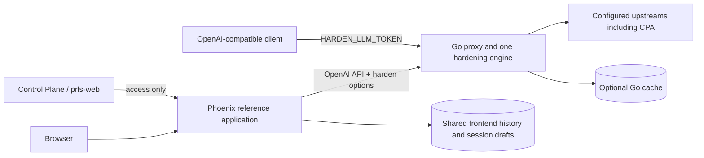

# 1. Harden-LLM proxy and reference application simplification

- Project: Harden-LLM.
- Version: 6; implementation in progress, P00 complete.
- Owners: repository maintainer for scope; Go maintainer for inference; Phoenix maintainer for reference data; deployment operator for cutover. These are existing responsibilities.
- Date: 2026-10-06.
- Document ID: `PLAN-HLLM-PROXY-REFERENCE-001`.
- Source baseline: `main`, `754690c8d0890c664d69fbdf526b16b3e5601060`.
- Policy: [AGENTS.md](../AGENTS.md) and [LiveView/Go testing guidelines](../docs/liveview-go-testing-guidelines.md).

Make Harden-LLM an OpenAI-compatible hardening proxy, with the same core inference API shapes used by CPA. Remove profiles, make human logins access-only, and keep shared history of frontend calls inside the Phoenix reference application. Standard clients use a Harden-LLM base URL and bearer token; optional request extensions expose hardening controls. This is a coordinated breaking change with one execution engine and one configuration path. Implementation, pushing, production promotion and the HLLM-only clean cut are authorized by the maintainer. Browser testing remains opt-in under `AGENTS.md`; the release suite must not make paid-provider calls.

## 2. Design consensus and trade-offs

| Topic | Verdict | Decision and rationale |
| --- | --- | --- |
| Public API | DECISION | Replace `/api/v1/run` with `/v1/chat/completions` and `/v1/responses`; expose `/v1/models`. CPA's checked-in contracts exercise both inference APIs. Ordinary supported OpenAI requests require no Harden-specific wrapper. |
| One implementation | FOR | Two protocol codecs call the same root Go engine. Preserve necessary provider protocol code; delete the native REST execution path, generic adapter proposals and per-owner runtime factories. |
| Compatibility scope | DECISION | Support stateless text, structured outputs, function-tool exchanges and standard SSE. This is inference compatibility, not a promise to implement all OpenAI or CPA features. Publish the exact supported fields. |
| Streaming | DECISION | Finish validation/repair before emitting the final answer through standard SSE. This preserves hardening semantics with one execution path, but delays first content. Do not present it as live provider-token streaming. |
| Authentication | DECISION | `HARDEN_LLM_TOKEN` is the sole incoming bearer setting. Preserve the existing local `.env` value. `CPA_API_KEY` authenticates the upstream connection only. Remove static-token aliases and human-owner bindings in the coordinated cutover. |
| Profiles | AGAINST | Delete profile CRUD, IDs, provisioning, catalogs and preset widgets. Configure upstream connections once and choose native model IDs per request. No replacement per-model profile records. |
| History | DECISION | Only Phoenix's existing request task records its observed calls. All enabled logins share that history. The proxy has no history routes, writes, replay service or product database dependency. |
| Persistence | FOR | One concrete Phoenix domain context and Ecto Repo on existing PostgreSQL hosting. Optional Go cache uses its own restricted storage role. No general storage framework, extra database server or fallback store. |
| Recording guarantee | DECISION | Publish the observed outcome, then attempt one bounded insert. A crash can lose a record. No pending-run ledger, queue, reconciliation worker or provider replay for a save failure. |
| Diagnostics | DECISION | Keep bounded canonical result/accounting/trace data and frontend-generated downloads. Remove full raw-provider documents, artifact links and custom chunk/digest transport. This intentionally narrows the old diagnostic-download feature. |
| Migration | DECISION | Start shared history empty. Remove incompatible HLLM-owned profiles, credentials, per-login histories, traces and artifacts during the coordinated cutover. No import, archive workflow, runtime migration subsystem or compatibility reader. |
| Tests | FOR | Reuse Go, ExUnit/LiveViewTest, plain Node and the existing PostgreSQL service pool. No extra Compose topology, transport benchmark framework or repeated suites just to populate reports. |

Current source still uses `/api/v1/run`, profile-bound requests, per-user product storage and `HARDEN_LLM_STATIC_TOKEN`. Local `.env` contains a nonempty `HARDEN_LLM_TOKEN` that passes the current token length/character constraints; its value was not printed or changed. Token presence is not a live authentication test. The rename and new API are planned behavior, not implemented behavior.

## 3. PRD / stakeholder and system needs

- Problem: a hardening proxy currently depends on profile administration, human identity and history/artifact storage; its custom API also prevents ordinary OpenAI clients from using it directly.
- Users: OpenAI-compatible clients, Go library callers, reference-frontend users and deployment operators.
- Value/business goals: retain hardening, remove product concerns from the proxy, share frontend history and reduce the number of configuration and execution paths.
- Success metrics: supported official SDK calls succeed with base URL/token changes; zero profile resources, core history writes and direct API calls in frontend history; one engine; no inference replay caused by history or downstream transport failures.
- Scope: public Go request types, target/recovery resolution, OpenAPI, bearer auth, optional cache, Phoenix storage/access/forms, configuration and a coordinated data transition.
- Non-goals: full OpenAI platform parity, new identity authority, tenants, personal history, raw-provider archives, background jobs, transparent server-side conversation state, new provider protocols and live-provider certification.
- Dependencies: existing provider transports and hardening engine; shared Control Plane/prls-web access; existing PostgreSQL hosting and test runner; OpenAPI as the Go/Phoenix boundary.
- Risks: lossy message conversion, incorrect tool/stream events, silent unsupported fields, duplicated execution, accidental sharing of old private data and mixed frontend/gateway versions.
- Assumptions: all enabled logins have equal history access, including deletion; history is best effort; clients send their conversation state; the deployment supplies `.env` values to processes through its existing launcher.
- Discussion defaults: both Chat Completions and Responses are in scope. Initial streaming is buffered until hardening finishes. Actual browser layout, public routing and paid-provider behavior require separate evidence.

## 4. SRS / canonical requirements

Acceptance is normative here; test mappings appear in Section 10.

| Requirement | Type | Behavior and acceptance |
| --- | --- | --- |
| REQ-400 | func | Remove saved profiles from Go, REST, frontend, storage and provisioning. Connections contain upstream protocol/endpoint/credential references; requests use native model IDs. |
| REQ-401 | func | One startup-constructed client resolves immutable targets. No per-owner factory or context-injected credential/cache/artifact adapters. Discovery is not a mandatory preflight; unknown pricing remains unknown. |
| REQ-402 | func | Preserve hardening, bounded retries, explicit repair/rerun graphs, cancellation and exact accounting. Replace profile targets with explicit model targets; inherit generation settings without lossy native reasoning conversion. No hidden cross-model fallback. |
| REQ-403 | int | Expose authenticated `/v1/models`, `/v1/chat/completions` and `/v1/responses`, plus existing health/readiness surfaces. Supported ordinary SDK requests work without extensions. Remove `/api/v1/run` and product REST resources in the same release. |
| REQ-404 | int | Preserve ordered messages/content, roles, function calls/results and call IDs. Return standard success/error objects and SSE for each endpoint. One optional `harden` namespace carries controls/diagnostics; no custom outer envelope. |
| REQ-405 | perf | Produce only the final hardened answer in streaming and nonstreaming modes. Bound requests, encoded outcomes and diagnostics; reject excess explicitly without truncation or provider replay. No raw-document framing protocol. |
| REQ-406 | reliability | Cache is optional and deployment/upstream-credential-domain scoped, with no human owner or secret in identity. Disabled cache has no storage dependency; active modes without storage reject before dispatch. Preserve producer/accounting facts. |
| REQ-407 | reliability | Only actual reference-frontend dispatches record observed outcomes, at most one row per submission. Publish the outcome before a bounded insert; recording failure never changes or replays inference. |
| REQ-408 | data | All enabled logins share frontend history, statistics and delete scope. Direct or origin-spoofed API calls never enter it. Missing usage/cost and incomplete recording coverage remain explicit. |
| REQ-409 | security | Phoenix retains shared access checks for reads, edits, downloads and actual dispatch. Core auth uses only `HARDEN_LLM_TOKEN`, independent of human identity. Service/provider credentials stay server-side. |
| REQ-410 | data | Preserve ordered draft autosave/reload using trusted session identity plus component namespace. Reuse existing session lifecycle; no personal dataset or new session manager. Storage failure preserves local edits. |
| REQ-411 | func | Retain pagination, restore, recovery controls and canonical diagnostic downloads through existing UI components/styles. Restore never executes; unavailable models require reselection before dispatch. |
| REQ-412 | data | The authorized clean cut removes incompatible active HLLM profile, credential, per-login history, trace and artifact data; new shared history starts empty. Do not import old data or private drafts. Do not touch unrelated products, shared identity or shared storage. |
| REQ-413 | nfr | With cache disabled, the proxy starts and runs without product PostgreSQL, Garage, Phoenix or Control Plane. Reference storage outages leave the form/inference usable and make history visibly unavailable. |
| REQ-414 | nfr | Retain canonical test IDs, shared contract fixtures, RED/GREEN evidence and offline T0–T2 feedback. Use the existing runner/service pool for real SQL and distinguish SDK, deployment and browser evidence. |
| REQ-415 | security | Replace configuration and clients together, with no old-key aliases or legacy routes. Use the existing `HARDEN_LLM_TOKEN` value from `./.env` for the deployed incoming API token; keep `CPA_API_KEY` upstream-only and preserve secret isolation. Production promotion and the HLLM clean cut are authorized for this work. Preserve exact image/config identity evidence; keep unrelated data and infrastructure outside the reset. |

### 4.1 Public API and client contract

| Surface | Supported initial contract |
| --- | --- |
| `GET /v1/models` | Standard OpenAI list for the configured default upstream. Optional `upstream` query selects another configured connection; optional namespaced metadata provides frontend capabilities/defaults. No second model-catalog API. |
| `POST /v1/chat/completions` | `model`, ordered text `messages` including tool calls/results, structured `response_format`, function `tools`/`tool_choice`, supported native sampling/token/reasoning controls, and `stream`. Output uses `chat.completion` / `chat.completion.chunk` and standard SSE termination. Initial `n` is 1. |
| `POST /v1/responses` | `model`, string or ordered text/function-item `input`, `instructions`, structured `text.format`, function `tools`/`tool_choice`, supported native output/reasoning controls, and `stream`. Output uses a Response with typed `output`; SSE uses the documented typed event lifecycle and sequence numbers. |
| `harden` request extension | Optional `upstream`, `cache`, `timeout_ms`, `recovery` and `diagnostics` fields. Defaults come from one Go definition and work when this object is absent. No arbitrary provider-option escape hatch that bypasses validation. |
| `harden` response extension | Opt-in bounded execution ID, selected/producer targets, recovery attempts, accounting and redacted diagnostics. Normal clients receive ordinary OpenAI objects. Frontend opts in. Final stream objects carry the same selected outcome and requested metadata. |
| Errors | Standard `{ "error": { "message": ..., "type": ..., "param": ..., "code": ... } }` shape and meaningful HTTP status before streaming starts; requested bounded diagnostic metadata may accompany it. No `state/result/error` wrapper. |

The client's base URL is the externally routed Harden-LLM API origin plus `/v1`; the API key is the existing `HARDEN_LLM_TOKEN` value. Do not assume the frontend origin already routes these paths: the cutover must configure and test actual ingress. CPA remains the configured default upstream for this deployment, using `CPA_API_KEY`. No caller must create a profile, choose a company or provide a human user ID.

Normal `model` values stay native IDs, not new qualified aliases. An optional `harden.upstream` selects a different operator-configured connection. Responses and Chat codecs translate only their wire differences into one shared request representation; they never call each other through HTTP or maintain separate execution policies. The current `SystemPrompt`/`UserPrompt` pair cannot represent this contract: generalize the root request once, preserving role order and tool-call linkage through provider dispatch, recovery and cache identity.

Replace the old public two-prompt request shape rather than accepting two library input formats. The frontend can retain its existing prompt controls and construct ordinary ordered API input from them. With `harden` omitted, use the configured default upstream, cache off, the existing deployment deadline, the profile-free default recovery policy below and no diagnostic extension. The frontend reads these defaults from the Go-owned contract instead of maintaining another preset.

Both endpoints are stateless. Omitted/false `store` does not persist API responses. Reject `store: true`, `previous_response_id`, server-side conversation references and `background: true`; do not recreate history through OpenAI storage features. Clients carry the prior messages/items themselves. Media input/output, hosted-tool types and other fields outside the published capability matrix receive explicit validation errors before dispatch. A supported field that the selected upstream cannot honor also fails explicitly; never silently drop it. Existing search functionality stays under its documented supported tool mapping, with one Go capability owner and no new routing fallback.

Preserve native reasoning values for OpenAI-compatible upstreams. Remove the ambiguous three-rank translation from the public wire contract; any necessary non-OpenAI mapping has one Go owner and an explicit capability test. The replacement default recovery policy keeps the existing six-attempt budget, retry categories and 500–8000 ms backoff, but uses the selected generation target for structured repair. It has no implicit alternate model, escalation or rerun. Explicit model-target recovery graphs remain available through `harden.recovery`, under the existing ten-attempt ceiling. This default change removes dependencies on named CPA profiles and must be documented.

For `stream: true`, execute and validate once, then serialize the final outcome as standard endpoint-specific SSE. No provisional invalid output escapes before repair. This supports ordinary SDK stream consumers but delays first content until inference/recovery finishes. Include text and function-tool deltas, IDs, finish/status information, usage when requested and required terminal events. Disconnects cancel active work; neither the gateway nor frontend repeats an ambiguous execution because a downstream stream failed. Client SDK retry policy remains the caller's responsibility; compatibility tests disable client retries to make dispatch counts observable.

Keep the current 256 KiB request limit, 16 MiB upstream response limit and maximum 60 s inference deadline. Adopt one 16 MiB encoded final JSON outcome limit, including an at-most-64 KiB canonical diagnostic extension; standard SSE is generated from that bounded result with bounded text/tool-argument chunks. Reject an oversized outcome explicitly before writing response headers; do not retry the provider or truncate output. Phoenix uses the same JSON outcome limit. These are simple acceptance bounds, not a new transport layer; near-limit escaping/UTF-8 cases belong in existing contract tests. Full raw-provider documents and their download API are removed.

Official references: [Chat Completions and Responses shapes](https://developers.openai.com/api/docs/guides/migrate-to-responses) and [Responses streaming events](https://developers.openai.com/api/docs/guides/streaming-responses). CPA evidence is its sibling checkout's `README.md` and `tests/contract/responses_contract.sh`; that is source evidence, not a live compatibility result.

### 4.2 Ownership, errors and telemetry

- Go owns targets, capabilities, defaults, hardening, cache identity and accounting. Phoenix consumes their OpenAPI representations; it does not copy engine decisions.
- Phoenix stores the submitted public request and observed public outcome once. History/statistics/downloads derive from that record; no separate trace or raw artifact table.
- Distinguish predispatch rejection, known execution failure, unknown transport outcome and history-save failure. Missing usage/cost is not zero. Shared history totals cover recorded frontend calls only.
- Preserve existing redaction, endpoint policy, pooled transports and execution correlation. Logs/metrics contain no prompts, outputs, credentials or session values. Use existing observability rather than a new audit subsystem.
- Root library callers receive the same canonical execution result without depending on HTTP, Phoenix or product storage.



```text
System: Harden-LLM
  Go proxy: bearer gate -> OpenAI codecs -> existing hardening engine
    Configuration: connections, default upstream, one token
    Optional store: restricted cache schema
  Phoenix reference app: shared access -> existing workspace request task
    Domain context + Ecto Repo: shared history, statistics, session drafts
    Client: OpenAPI only; standard JSON inference plus requested diagnostics
  External: Control Plane for web access; provider services; observability
  Forbidden dependency: Go proxy -> Phoenix history or human identity
```

## 5. Iterative implementation and test plan

This plan is standards-informed, not a claim of ISO/IEEE/FAA compliance. Safety-critical adoption would first require an assurance level, independence expectations, structural coverage, tool qualification and certification outputs.

Implementation is authorized. Use this feature branch from current main. Follow ordered subtasks and preserve each assertion oracle between RED and GREEN. Record source/config/fixture/schema hashes at phase boundaries. Push verified checkpoints after local gates; merge after hosted checks pass, then apply the exact candidate to production and record image IDs, routes and browser-free checks.

Compute controls: `branch_limits: 1` implementation branch; `reflection_passes: 2` at contract freeze and candidate acceptance; `early_stop%: 0` tolerance for failed acceptance. Runtime budgets bound diagnostic work, not product latency promises. Stop at a budget overrun or the existing runner resource guard; investigate rather than blindly repeat. Threshold changes require an ADR. Reuse a passing result until a relevant change or unresolved concern justifies rerunning it.

| Risk | Trigger | Mitigation / suspension |
| --- | --- | --- |
| False API compatibility | SDK schema, role ordering or function-call IDs differ | Freeze supported cases; exercise official SDK against local real handlers; stop compatibility claims on failure. |
| Streaming contradicts repair | Invalid provisional content escapes or completion arrives twice | Encode only the final outcome; one execution count oracle for both protocols. |
| Accidental data disclosure | Old history is private to a login and cannot become shared safely | Delete only verified HLLM-owned rows and objects; start the new shared history empty. |
| Duplicate inference | Recording, timeout or downstream-error code retries | Assert one logical submission; only the engine's explicit recovery policy can make additional attempts. |
| Test/infrastructure growth | New store abstraction, topology or benchmark service appears | Reuse concrete Repo, current pool and existing runners; remove duplicated paths. |
| Mixed release | Old route/token/config remains required by a client | Complete the consumer inventory and coordinated cutover; no runtime compatibility mode. |

Resume a blocked phase after the missing decision or contract is recorded and its deterministic assertion can be executed. Do not convert unknown deployment, provider or browser behavior into a passing local claim.

### Phase P00: Executable contracts and test entrypoints are fixed

- Phase goal: Freeze a concrete OpenAI subset and verification entrypoints before runtime changes.
- Scope/objectives: REQ-403, REQ-405, REQ-412, REQ-414; implement only this boundary.
- Impacted surfaces: `api/openapi.yaml`, canonical specs under `plans/from_utility-llm/`, proposed `test/fixtures/proxy-reference-contract.json`, `test/test-tiers.json`, `frontend/test/test_helper.exs`, `go.mod`/`go.sum`, `docs/adr/`.
- Lifecycle evidence:
  - Requirements evidence: named acceptance criteria and RED/GREEN records.
  - Design/code surface evidence: reviewed changes to the listed paths; new paths are proposed until created.
  - Verification method: ordered commands below; service tests prove only their actual boundary.
  - Validation purpose: Future implementation has an executable, finite compatibility target and no hidden test dependencies.
  - Configuration checkpoint: record branch/SHA and fixture/config/schema hashes at phase exit.
  - Risks and assumptions: No live data inventory has been performed. Existing profile/native-route consumers must be enumerated from source; production deletion must be scoped to HLLM-owned data only.

Estimated phase metrics, not measured quality probabilities:

- Confidence: 90%; API and runner surfaces are known, while exact supported-field fixtures still need authoring.
- Long-term robustness: 90%; one owner per responsibility removes competing paths.
- Internal interactions: 4; counts affected module/contract boundaries.
- External interactions: 1; counts service or SDK boundaries exercised.
- Complexity: 20%; estimates cross-boundary implementation effort.
- Feature creep: 5%; only the stated compatibility and ownership change is included.
- Technical debt: 5%; no legacy runtime path is retained.
- YAGNI score: 5/5; each change serves a stated requirement.
- MoSCoW: Must; no import path is in scope.
- Local/non-local scope: non-local; the phase crosses the listed boundaries.
- Architectural changes count: 1; counts changed ownership or public contracts, not files.

Plan-and-Solve subtasks:

- `P00.S01 Record the contracts and source inventory`
  - Action: Write ADR-HLLM-031/032, the shared fixture and TEST-400. Enumerate supported/explicitly rejected fields and native-route/token consumers; record the authorized empty-history clean cut. Pin one official Go OpenAI SDK version for test-only use. Register the PostgreSQL-only task and database-tag exclusion before any integration invocation; align the existing pool PostgreSQL image with the repository production pin. TEST-400 validates these artifacts without starting services.
  - Why now: Contract-only work precedes new runtime behavior.
  - Files/surfaces: `scripts/test/proxy_reference_contract_test.mjs`; phase surfaces below/above as applicable.
  - Requirement link: REQ-403, REQ-405, REQ-412, REQ-414.
  - Verification link: TEST-400.
  - Verification mode: VERIFY.
  - Command/procedure: `node --test scripts/test/proxy_reference_contract_test.mjs`.
  - Expected result: The named checks pass; any retained gap is stated explicitly.
  - Evidence produced: Command result and phase evidence, linked from Section 11.
  - Stop/escalate condition: A supposedly ordinary request needs an unspecified field or the runner would start a browser/provider.
  - Unlocks: P00.S02.

- `P00.S02 Review the ownership and test selection`
  - Action: No refactor needed: this phase creates contract fixtures and manifest entries, not a second runtime. Inspect their diff for duplicate catalogs, schemas or runners; validate with the same static test.
  - Why now: The contract and task entries now exist.
  - Files/surfaces: `scripts/test/proxy_reference_contract_test.mjs`; phase surfaces below/above as applicable.
  - Requirement link: REQ-403, REQ-405, REQ-412, REQ-414.
  - Verification link: TEST-400.
  - Verification mode: VERIFY.
  - Command/procedure: `node --test scripts/test/proxy_reference_contract_test.mjs`.
  - Expected result: The named checks pass; any retained gap is stated explicitly.
  - Evidence produced: Command result and phase evidence, linked from Section 11.
  - Stop/escalate condition: The proposal introduces another configuration authority or service topology.
  - Unlocks: P00.S03.

- `P00.S03 Record the contract coverage baseline`
  - Action: Record EVAL-400 from TEST-400: all required fields/limits and new task mappings are represented. Record inventory counts and the chosen data branch without secret values.
  - Why now: This binds acceptance before implementation.
  - Files/surfaces: `scripts/test/proxy_reference_contract_test.mjs`; phase surfaces below/above as applicable.
  - Requirement link: REQ-403, REQ-405, REQ-412, REQ-414.
  - Verification link: TEST-400, EVAL-400.
  - Verification mode: MEASURE.
  - Command/procedure: `node --test scripts/test/proxy_reference_contract_test.mjs`.
  - Expected result: The linked evaluation thresholds pass using the recorded command results, without an unnecessary repeat.
  - Evidence produced: Command result and phase evidence, linked from Section 11.
  - Stop/escalate condition: Any requirement lacks an executable owner or required field remains ambiguous.
  - Unlocks: P00 exit.

Exit gates: Proceed when the linked tests and EVAL-400 pass, traceability is complete and the checkpoint is recorded. Escalate on an unresolved contract/data decision or unstable test. Stop if acceptance requires a scope change. A documented blocker does not authorize dependent implementation.

### Phase P01: One profile-free engine executes canonical requests

- Phase goal: Replace profile/owner resolution with configured connections and one shared request/result model.
- Scope/objectives: REQ-400, REQ-401, REQ-402, REQ-404, REQ-406, REQ-413; implement only this boundary.
- Impacted surfaces: `types.go`, `client.go`, `internal/runtime/`, `internal/retry/`, `internal/providers/`, `internal/gateway/shared_runtime.go`, `internal/gateway/run_service.go`, existing cache implementation; proposed TEST-401/402 files.
- Lifecycle evidence:
  - Requirements evidence: named acceptance criteria and RED/GREEN records.
  - Design/code surface evidence: reviewed changes to the listed paths; new paths are proposed until created.
  - Verification method: ordered commands below; service tests prove only their actual boundary.
  - Validation purpose: Both public APIs can preserve conversations and use the same hardening/cache behavior.
  - Configuration checkpoint: record branch/SHA and fixture/config/schema hashes at phase exit.
  - Risks and assumptions: Current prompt-pair input and profile-based default recovery are incompatible; their replacement must preserve explicit recovery/accounting behavior while documenting changed defaults.

Estimated phase metrics, not measured quality probabilities:

- Confidence: 80%; Canonical message/tool representation changes several established engine boundaries.
- Long-term robustness: 90%; one owner per responsibility removes competing paths.
- Internal interactions: 7; counts affected module/contract boundaries.
- External interactions: 1; counts service or SDK boundaries exercised.
- Complexity: 65%; estimates cross-boundary implementation effort.
- Feature creep: 5%; only the stated compatibility and ownership change is included.
- Technical debt: 5%; no legacy runtime path is retained.
- YAGNI score: 5/5; each change serves a stated requirement.
- MoSCoW: Must; no import path is in scope.
- Local/non-local scope: non-local; the phase crosses the listed boundaries.
- Architectural changes count: 2; counts changed ownership or public contracts, not files.

Plan-and-Solve subtasks:

- `P01.S01 Add canonical execution regressions`
  - Action: Add TEST-401 covering ordered text/tool conversations, native reasoning, direct model targets and profile-free default repair. Keep existing recovery/accounting assertions for behavior that remains supported.
  - Why now: This captures the behavior before changing public types.
  - Files/surfaces: `proxy_contract_test.go`; phase surfaces below/above as applicable.
  - Requirement link: REQ-400, REQ-401, REQ-402, REQ-404.
  - Verification link: TEST-401.
  - Verification mode: RED.
  - Command/procedure: `go test . -run TestProxyRequestContract -count=1`.
  - Expected result: New assertions fail on the missing behavior for the stated reason; compilation-only failures do not complete RED.
  - Evidence produced: RED failure and test diff, linked from Section 11.
  - Stop/escalate condition: Only compilation fails or the oracle flattens messages into one prompt.
  - Unlocks: P01.S02.

- `P01.S02 Replace profiles in the engine`
  - Action: Generalize the root request once, resolve configured connections and model targets, replace profile-based default recovery, and update existing provider codecs/cache semantics. Delete superseded profile fields rather than translating legacy input.
  - Why now: The canonical execution regressions are failing.
  - Files/surfaces: `proxy_contract_test.go`; phase surfaces below/above as applicable.
  - Requirement link: REQ-400, REQ-401, REQ-402, REQ-404.
  - Verification link: TEST-401.
  - Verification mode: GREEN.
  - Command/procedure: `go test . -run TestProxyRequestContract -count=1`.
  - Expected result: The preceding RED command passes with unchanged assertions.
  - Evidence produced: GREEN output and implementation diff, linked from Section 11.
  - Stop/escalate condition: A provider codec silently loses a supported role, item, option or accounting fact.
  - Unlocks: P01.S03.

- `P01.S03 Add static runtime and cache regressions`
  - Action: Add TEST-402 for one startup client, no owner context, equivalent API semantics and credential-domain cache separation, including cache-disabled behavior.
  - Why now: Engine semantics are fixed before runtime construction changes.
  - Files/surfaces: `internal/gateway/profile_free_runtime_test.go`; phase surfaces below/above as applicable.
  - Requirement link: REQ-401, REQ-406, REQ-413.
  - Verification link: TEST-402.
  - Verification mode: RED.
  - Command/procedure: `go test ./internal/gateway -run TestProfileFreeRuntime -count=1`.
  - Expected result: New assertions fail on the missing behavior for the stated reason; compilation-only failures do not complete RED.
  - Evidence produced: RED failure and test diff, linked from Section 11.
  - Stop/escalate condition: The test cannot observe store access or credential-domain separation.
  - Unlocks: P01.S04.

- `P01.S04 Construct the runtime once`
  - Action: Remove owner factories and context-bound dynamic resolver/store adapters. Supply immutable connections and optional cache directly at startup; remove product persistence from execution. Use one new cache namespace for incompatible identities.
  - Why now: Runtime/cache regressions now fail for the old ownership path.
  - Files/surfaces: `internal/gateway/profile_free_runtime_test.go`; phase surfaces below/above as applicable.
  - Requirement link: REQ-401, REQ-406, REQ-413.
  - Verification link: TEST-402.
  - Verification mode: GREEN.
  - Command/procedure: `go test ./internal/gateway -run TestProfileFreeRuntime -count=1`.
  - Expected result: The preceding RED command passes with unchanged assertions.
  - Evidence produced: GREEN output and implementation diff, linked from Section 11.
  - Stop/escalate condition: An inference path still loads a user/profile or writes a product record.
  - Unlocks: P01.S05.

- `P01.S05 Review the shared engine boundary`
  - Action: No refactor needed only if the diff has one target resolver, one default policy and one accounting implementation. Otherwise remove duplication now and keep both assertion sets unchanged.
  - Why now: Both changed runtime boundaries are green.
  - Files/surfaces: `proxy_contract_test.go`; `internal/gateway/profile_free_runtime_test.go`; phase surfaces below/above as applicable.
  - Requirement link: REQ-400, REQ-401, REQ-402, REQ-404, REQ-406, REQ-413.
  - Verification link: TEST-401, TEST-402.
  - Verification mode: VERIFY.
  - Command/procedure: `go test . -run TestProxyRequestContract -count=1`; `go test ./internal/gateway -run TestProfileFreeRuntime -count=1`.
  - Expected result: The named checks pass; any retained gap is stated explicitly.
  - Evidence produced: Command result and phase evidence, linked from Section 11.
  - Stop/escalate condition: Protocol-specific code duplicates engine decisions or an obsolete path remains callable.
  - Unlocks: P01.S06.

- `P01.S06 Record execution and cache invariants`
  - Action: Record EVAL-401 from the focused results, including dispatch counts, recovery/accounting exactness and cross-domain cache misses.
  - Why now: The final P01 implementation is ready to measure.
  - Files/surfaces: `proxy_contract_test.go`; `internal/gateway/profile_free_runtime_test.go`; phase surfaces below/above as applicable.
  - Requirement link: REQ-400, REQ-401, REQ-402, REQ-404, REQ-406, REQ-413.
  - Verification link: TEST-401, TEST-402, EVAL-401.
  - Verification mode: MEASURE.
  - Command/procedure: `go test . -run TestProxyRequestContract -count=1`; `go test ./internal/gateway -run TestProfileFreeRuntime -count=1`.
  - Expected result: The linked evaluation thresholds pass using the recorded command results, without an unnecessary repeat.
  - Evidence produced: Command result and phase evidence, linked from Section 11.
  - Stop/escalate condition: Any accounting mismatch, profile dependency or invalid cache hit remains.
  - Unlocks: P01 exit.

Exit gates: Proceed when the linked tests and EVAL-401 pass, traceability is complete and the checkpoint is recorded. Escalate on an unresolved contract/data decision or unstable test. Stop if acceptance requires a scope change. A documented blocker does not authorize dependent implementation.

### Phase P02: Standard OpenAI clients reach the hardened proxy

- Phase goal: Serve both OpenAI inference APIs through the shared engine with one deployment bearer.
- Scope/objectives: REQ-403, REQ-404, REQ-405, REQ-409, REQ-413, REQ-415; implement only this boundary.
- Impacted surfaces: `api/openapi.yaml`, `internal/gateway/httpapi/`, `internal/gateway/auth/`, `cmd/harden-llm-gateway/config.go`, `cmd/harden-llm-gateway/server.go`, proposed TEST-403/404 files.
- Lifecycle evidence:
  - Requirements evidence: named acceptance criteria and RED/GREEN records.
  - Design/code surface evidence: reviewed changes to the listed paths; new paths are proposed until created.
  - Verification method: ordered commands below; service tests prove only their actual boundary.
  - Validation purpose: Actual SDK request/response and stream handling works against local real handlers without native REST wrappers.
  - Configuration checkpoint: record branch/SHA and fixture/config/schema hashes at phase exit.
  - Risks and assumptions: Buffered streaming is deliberately slower to first content. SDK compatibility covers only the documented subset; direct upstream parity is not inferred.

Estimated phase metrics, not measured quality probabilities:

- Confidence: 80%; Wire compatibility and tool streaming need exact SDK-level assertions.
- Long-term robustness: 90%; one owner per responsibility removes competing paths.
- Internal interactions: 5; counts affected module/contract boundaries.
- External interactions: 2; counts service or SDK boundaries exercised.
- Complexity: 60%; estimates cross-boundary implementation effort.
- Feature creep: 5%; only the stated compatibility and ownership change is included.
- Technical debt: 5%; no legacy runtime path is retained.
- YAGNI score: 5/5; each change serves a stated requirement.
- MoSCoW: Must; no import path is in scope.
- Local/non-local scope: non-local; the phase crosses the listed boundaries.
- Architectural changes count: 2; counts changed ownership or public contracts, not files.

Plan-and-Solve subtasks:

- `P02.S01 Add official SDK contract regressions`
  - Action: Add TEST-403 using the pinned official SDK and local handlers/provider stubs. Cover both endpoints, standard errors, tool exchanges, final-only streams, extensions, unsupported fields and size limits.
  - Why now: P01 supplies the canonical engine; transport is still missing.
  - Files/surfaces: `internal/gateway/openai_contract_test.go`; phase surfaces below/above as applicable.
  - Requirement link: REQ-403, REQ-404, REQ-405.
  - Verification link: TEST-403.
  - Verification mode: RED.
  - Command/procedure: `go test ./internal/gateway -run TestOpenAIContract -count=1`.
  - Expected result: New assertions fail on the missing behavior for the stated reason; compilation-only failures do not complete RED.
  - Evidence produced: RED failure and test diff, linked from Section 11.
  - Stop/escalate condition: A fake decoder substitutes for the actual SDK or client retries hide extra dispatches.
  - Unlocks: P02.S02.

- `P02.S02 Implement the OpenAI wire contract`
  - Action: Add direct endpoint codecs and standard SSE serializers over the one engine result. Apply bounded canonical diagnostics. Remove native run/state/profile/history/stats/trace/artifact handlers and custom diagnostic SSE/document assembly.
  - Why now: The SDK and wire regressions are failing.
  - Files/surfaces: `internal/gateway/openai_contract_test.go`; phase surfaces below/above as applicable.
  - Requirement link: REQ-403, REQ-404, REQ-405.
  - Verification link: TEST-403.
  - Verification mode: GREEN.
  - Command/procedure: `go test ./internal/gateway -run TestOpenAIContract -count=1`.
  - Expected result: The preceding RED command passes with unchanged assertions.
  - Evidence produced: GREEN output and implementation diff, linked from Section 11.
  - Stop/escalate condition: A legacy endpoint survives, an unsupported field is ignored or output precedes validation.
  - Unlocks: P02.S03.

- `P02.S03 Add token and independent-startup regressions`
  - Action: Add TEST-404 for canonical bearer auth, no identity owner, removed aliases and cache-disabled startup without product services.
  - Why now: The new routes exist before testing their deployment boundary.
  - Files/surfaces: `cmd/harden-llm-gateway/openai_auth_test.go`; phase surfaces below/above as applicable.
  - Requirement link: REQ-403, REQ-409, REQ-413, REQ-415.
  - Verification link: TEST-404.
  - Verification mode: RED.
  - Command/procedure: `go test ./cmd/harden-llm-gateway -run TestOpenAIAuthAndStartup -count=1`.
  - Expected result: New assertions fail on the missing behavior for the stated reason; compilation-only failures do not complete RED.
  - Evidence produced: RED failure and test diff, linked from Section 11.
  - Stop/escalate condition: The tests read real .env values or depend on live identity.
  - Unlocks: P02.S04.

- `P02.S04 Replace core auth and storage requirements`
  - Action: Use only HARDEN_LLM_TOKEN for incoming auth. Remove static-token user binding and core Control Plane/product-storage requirements; health/readiness reflect actual configured proxy dependencies.
  - Why now: The auth/startup regressions expose the old requirements.
  - Files/surfaces: `cmd/harden-llm-gateway/openai_auth_test.go`; phase surfaces below/above as applicable.
  - Requirement link: REQ-403, REQ-409, REQ-413, REQ-415.
  - Verification link: TEST-404.
  - Verification mode: GREEN.
  - Command/procedure: `go test ./cmd/harden-llm-gateway -run TestOpenAIAuthAndStartup -count=1`.
  - Expected result: The preceding RED command passes with unchanged assertions.
  - Evidence produced: GREEN output and implementation diff, linked from Section 11.
  - Stop/escalate condition: Missing optional services still prevent cache-disabled inference.
  - Unlocks: P02.S05.

- `P02.S05 Review codec and policy ownership`
  - Action: No refactor needed only if codecs contain protocol differences and all execution/default/limit policy has one owner. Remove duplicate native transport code uncovered by this review.
  - Why now: Both public interface boundaries are green.
  - Files/surfaces: `internal/gateway/openai_contract_test.go`; `cmd/harden-llm-gateway/openai_auth_test.go`; phase surfaces below/above as applicable.
  - Requirement link: REQ-403, REQ-404, REQ-405, REQ-409, REQ-413, REQ-415.
  - Verification link: TEST-403, TEST-404.
  - Verification mode: VERIFY.
  - Command/procedure: `go test ./internal/gateway -run TestOpenAIContract -count=1`; `go test ./cmd/harden-llm-gateway -run TestOpenAIAuthAndStartup -count=1`.
  - Expected result: The named checks pass; any retained gap is stated explicitly.
  - Evidence produced: Command result and phase evidence, linked from Section 11.
  - Stop/escalate condition: JSON and SSE can choose different hardened outcomes or auth paths.
  - Unlocks: P02.S06.

- `P02.S06 Record supported-client acceptance`
  - Action: Record EVAL-402 from SDK assertions and one boundary-size case per serializer, including final outcome equivalence and dispatch counts. Record buffered first-content semantics explicitly.
  - Why now: The final API surface is now measurable.
  - Files/surfaces: `internal/gateway/openai_contract_test.go`; `cmd/harden-llm-gateway/openai_auth_test.go`; phase surfaces below/above as applicable.
  - Requirement link: REQ-403, REQ-404, REQ-405, REQ-409, REQ-413, REQ-415.
  - Verification link: TEST-403, TEST-404, EVAL-402.
  - Verification mode: MEASURE.
  - Command/procedure: `go test ./internal/gateway -run TestOpenAIContract -count=1`; `go test ./cmd/harden-llm-gateway -run TestOpenAIAuthAndStartup -count=1`.
  - Expected result: The linked evaluation thresholds pass using the recorded command results, without an unnecessary repeat.
  - Evidence produced: Command result and phase evidence, linked from Section 11.
  - Stop/escalate condition: An accepted client request cannot be decoded or a bound can be exceeded silently.
  - Unlocks: P02 exit.

Exit gates: Proceed when the linked tests and EVAL-402 pass, traceability is complete and the checkpoint is recorded. Escalate on an unresolved contract/data decision or unstable test. Stop if acceptance requires a scope change. A documented blocker does not authorize dependent implementation.

### Phase P03: Phoenix owns shared frontend history and session drafts

- Phase goal: Move reference data into one concrete Phoenix context and switch its client to the standard API.
- Scope/objectives: REQ-407, REQ-408, REQ-409, REQ-410, REQ-411, REQ-413; implement only this boundary.
- Impacted surfaces: `frontend/mix.exs`, `frontend/mix.lock`, `frontend/config/`, `frontend/lib/harden_llm/application.ex`, proposed `frontend/lib/harden_llm/repo.ex`, proposed `frontend/lib/harden_llm/reference.ex`, proposed `frontend/priv/repo/migrations/`, `frontend/lib/harden_llm_web/harden_api.ex`, `frontend/lib/harden_llm_web/live/workspace_live.ex`, existing history/access/components.
- Lifecycle evidence:
  - Requirements evidence: named acceptance criteria and RED/GREEN records.
  - Design/code surface evidence: reviewed changes to the listed paths; new paths are proposed until created.
  - Verification method: ordered commands below; service tests prove only their actual boundary.
  - Validation purpose: People share recorded frontend calls while the proxy remains independent of web data and access services.
  - Configuration checkpoint: record branch/SHA and fixture/config/schema hashes at phase exit.
  - Risks and assumptions: History can lose an uncommitted outcome. DB availability must not gate dispatch; real SQL semantics cannot be proven by a test seam.

Estimated phase metrics, not measured quality probabilities:

- Confidence: 85%; Existing workspace tasks and components can be reused, but Phoenix has no Ecto Repo yet.
- Long-term robustness: 90%; one owner per responsibility removes competing paths.
- Internal interactions: 6; counts affected module/contract boundaries.
- External interactions: 2; counts service or SDK boundaries exercised.
- Complexity: 55%; estimates cross-boundary implementation effort.
- Feature creep: 5%; only the stated compatibility and ownership change is included.
- Technical debt: 5%; no legacy runtime path is retained.
- YAGNI score: 5/5; each change serves a stated requirement.
- MoSCoW: Must; no import path is in scope.
- Local/non-local scope: non-local; the phase crosses the listed boundaries.
- Architectural changes count: 1; counts changed ownership or public contracts, not files.

Plan-and-Solve subtasks:

- `P03.S01 Add reference workflow regressions`
  - Action: Add TEST-405/406 before application changes: standard request construction, access checks, outcome-before-save ordering, shared history, unknown accounting, session drafts and canonical downloads.
  - Why now: P02 fixes the public wire contract consumed by Phoenix.
  - Files/surfaces: `frontend/test/harden_llm_web/live/shared_workspace_test.exs`; `frontend/test/harden_llm/reference_test.exs`; phase surfaces below/above as applicable.
  - Requirement link: REQ-407, REQ-408, REQ-409, REQ-410, REQ-411, REQ-413.
  - Verification link: TEST-405, TEST-406.
  - Verification mode: RED.
  - Command/procedure: `cd frontend && mix test test/harden_llm_web/live/shared_workspace_test.exs`; `cd frontend && mix test test/harden_llm/reference_test.exs`.
  - Expected result: New assertions fail on the missing behavior for the stated reason; compilation-only failures do not complete RED.
  - Evidence produced: RED failure and test diff, linked from Section 11.
  - Stop/escalate condition: Frontend fixtures diverge from the shared backend contract or duplicate engine decisions.
  - Unlocks: P03.S02.

- `P03.S02 Move reference ownership into Phoenix`
  - Action: Add ordinary Ecto dependencies/Repo and one Reference context. Update HardenAPI to standard JSON Responses calls with diagnostics; use the existing request task to publish then record. Reuse access/session lifecycle, ordered autosave, pagination, model/recovery components and styles. Delete profile UI and native API/history client code.
  - Why now: Cheap regressions fail before changing observable reference behavior.
  - Files/surfaces: `frontend/test/harden_llm_web/live/shared_workspace_test.exs`; `frontend/test/harden_llm/reference_test.exs`; phase surfaces below/above as applicable.
  - Requirement link: REQ-407, REQ-408, REQ-409, REQ-410, REQ-411, REQ-413.
  - Verification link: TEST-405, TEST-406.
  - Verification mode: GREEN.
  - Command/procedure: `cd frontend && mix test test/harden_llm_web/live/shared_workspace_test.exs`; `cd frontend && mix test test/harden_llm/reference_test.exs`.
  - Expected result: The preceding RED command passes with unchanged assertions.
  - Evidence produced: GREEN output and implementation diff, linked from Section 11.
  - Stop/escalate condition: Implementation requires a storage abstraction, new task manager, queue or copied form logic.
  - Unlocks: P03.S03.

- `P03.S03 Add real PostgreSQL boundary regressions`
  - Action: Add TEST-407 under the pre-registered database task. Cover real schema constraints, indexes/queries, role boundaries, query timeout and disconnected storage behavior with process-owned data.
  - Why now: Pure/context behavior exists; SQL assumptions now need independent coverage.
  - Files/surfaces: `frontend/test/harden_llm/reference_integration_test.exs`; phase surfaces below/above as applicable.
  - Requirement link: REQ-407, REQ-408, REQ-410, REQ-412, REQ-413.
  - Verification link: TEST-407.
  - Verification mode: RED.
  - Command/procedure: `node scripts/run-test-tier.mjs --task frontend-reference-integration`.
  - Expected result: New assertions fail on the missing behavior for the stated reason; compilation-only failures do not complete RED.
  - Evidence produced: RED failure and test diff, linked from Section 11.
  - Stop/escalate condition: The task starts Garage/browser or reuses another test process's rows.
  - Unlocks: P03.S04.

- `P03.S04 Implement the reference schema and queries`
  - Action: Create history/draft migrations and direct Repo queries, using only indexes required for shared pagination, unique submission and draft lookup. Provision separate reference/cache permissions in the existing hosting. Remove the minimal failing database stubs from the production path.
  - Why now: The actual database boundary now has failing assertions.
  - Files/surfaces: `frontend/test/harden_llm/reference_integration_test.exs`; phase surfaces below/above as applicable.
  - Requirement link: REQ-407, REQ-408, REQ-410, REQ-412, REQ-413.
  - Verification link: TEST-407.
  - Verification mode: GREEN.
  - Command/procedure: `node scripts/run-test-tier.mjs --task frontend-reference-integration`.
  - Expected result: The preceding RED command passes with unchanged assertions.
  - Evidence produced: GREEN output and implementation diff, linked from Section 11.
  - Stop/escalate condition: An alternate store, duplicated trace record or unbounded pool wait is introduced.
  - Unlocks: P03.S05.

- `P03.S05 Review the reference data flow`
  - Action: No refactor needed only if the existing task and one context own recording, one canonical row drives views/downloads, and components/styles are reused. Consolidate any duplicates before phase exit.
  - Why now: UI/context/SQL behavior is green.
  - Files/surfaces: `frontend/test/harden_llm_web/live/shared_workspace_test.exs`; `frontend/test/harden_llm/reference_test.exs`; `frontend/test/harden_llm/reference_integration_test.exs`; phase surfaces below/above as applicable.
  - Requirement link: REQ-407, REQ-408, REQ-409, REQ-410, REQ-411, REQ-412, REQ-413.
  - Verification link: TEST-405, TEST-406, TEST-407.
  - Verification mode: VERIFY.
  - Command/procedure: `cd frontend && mix test test/harden_llm_web/live/shared_workspace_test.exs`; `cd frontend && mix test test/harden_llm/reference_test.exs`; `node scripts/run-test-tier.mjs --task frontend-reference-integration`.
  - Expected result: The named checks pass; any retained gap is stated explicitly.
  - Evidence produced: Command result and phase evidence, linked from Section 11.
  - Stop/escalate condition: Core routes are used for history or a save failure can resubmit inference.
  - Unlocks: P03.S06.

- `P03.S06 Record recording and availability guarantees`
  - Action: Record EVAL-403 from existing test receipts: at most one row, zero recording-induced dispatches, outcome published before save and bounded SQL failures. Do not repeat the database suite solely for a report.
  - Why now: The complete reference boundary has been exercised.
  - Files/surfaces: `frontend/test/harden_llm_web/live/shared_workspace_test.exs`; `frontend/test/harden_llm/reference_test.exs`; `frontend/test/harden_llm/reference_integration_test.exs`; phase surfaces below/above as applicable.
  - Requirement link: REQ-407, REQ-408, REQ-409, REQ-410, REQ-411, REQ-412, REQ-413.
  - Verification link: TEST-405, TEST-406, TEST-407, EVAL-403.
  - Verification mode: MEASURE.
  - Command/procedure: `cd frontend && mix test test/harden_llm_web/live/shared_workspace_test.exs`; `cd frontend && mix test test/harden_llm/reference_test.exs`; `node scripts/run-test-tier.mjs --task frontend-reference-integration`.
  - Expected result: The linked evaluation thresholds pass using the recorded command results, without an unnecessary repeat.
  - Evidence produced: Command result and phase evidence, linked from Section 11.
  - Stop/escalate condition: History failure changes a known outcome, leaks a draft or blocks the form.
  - Unlocks: P03 exit.

Exit gates: Proceed when the linked tests and EVAL-403 pass, traceability is complete and the checkpoint is recorded. Escalate on an unresolved contract/data decision or unstable test. Stop if acceptance requires a scope change. A documented blocker does not authorize dependent implementation.

### Phase P04: The candidate has one configuration and cutover path

- Phase goal: Prepare a coherent browser-free candidate and a concrete data transition without deploying production.
- Scope/objectives: REQ-400, REQ-403, REQ-406, REQ-407, REQ-408, REQ-409, REQ-412, REQ-413, REQ-414, REQ-415; implement only this boundary.
- Impacted surfaces: `.env.example`, `README.md`, `AGENTS.md`, `docs/shared-llm-configuration.md`, `docs/self-hosting.md`, `docs/preview-environments.md`, canonical specs/test catalogs, `docker-compose.yml`, `deploy/frontend/compose.frontend.yml`, `deploy/preview/compose.yml`, `scripts/preview-environment.mjs`, `scripts/harden-structured-call.sh`, existing profile-sync tooling, `internal/smoke/compose_smoke_test.go`.
- Lifecycle evidence:
  - Requirements evidence: named acceptance criteria and RED/GREEN records.
  - Design/code surface evidence: reviewed changes to the listed paths; new paths are proposed until created.
  - Verification method: ordered commands below; service tests prove only their actual boundary.
  - Validation purpose: Operators and clients have one documented route/configuration, and the candidate proves the actual service boundaries without browsers or paid inference.
  - Configuration checkpoint: record branch/SHA and fixture/config/schema hashes at phase exit.
  - Risks and assumptions: Local `.env` token presence does not establish public routing. The requested `.env` token must be applied to production through the existing secret path; data import is excluded.

Estimated phase metrics, not measured quality probabilities:

- Confidence: 90%; The cutover touches several consumers but adds no runtime compatibility mechanism.
- Long-term robustness: 90%; one owner per responsibility removes competing paths.
- Internal interactions: 6; counts affected module/contract boundaries.
- External interactions: 3; counts service or SDK boundaries exercised.
- Complexity: 40%; estimates cross-boundary implementation effort.
- Feature creep: 5%; only the stated compatibility and ownership change is included.
- Technical debt: 5%; no legacy runtime path is retained.
- YAGNI score: 5/5; each change serves a stated requirement.
- MoSCoW: Must; no import path is in scope.
- Local/non-local scope: non-local; the phase crosses the listed boundaries.
- Architectural changes count: 1; counts changed ownership or public contracts, not files.

Plan-and-Solve subtasks:

- `P04.S01 Add configuration and cutover regressions`
  - Action: Add TEST-408 using synthetic values. Assert the one incoming token and connection settings across Compose, scripts and docs; removed profiles/aliases; no importer or legacy branch.
  - Why now: Runtime and reference changes are complete before updating deployment consumers.
  - Files/surfaces: `scripts/test/proxy_reference_cutover_test.mjs`; phase surfaces below/above as applicable.
  - Requirement link: REQ-400, REQ-409, REQ-412, REQ-414, REQ-415.
  - Verification link: TEST-408.
  - Verification mode: RED.
  - Command/procedure: `node --test scripts/test/proxy_reference_cutover_test.mjs`.
  - Expected result: New assertions fail on the missing behavior for the stated reason; compilation-only failures do not complete RED.
  - Evidence produced: RED failure and test diff, linked from Section 11.
  - Stop/escalate condition: A test would print a credential or assume local and deployed tokens match.
  - Unlocks: P04.S02.

- `P04.S02 Replace configuration and document data handling`
  - Action: Update all consumers to `HARDEN_LLM_TOKEN` and the single connection configuration together. Use the value already in `./.env` for the production incoming API token. Remove sync-profiles and active private-owner instructions. Add no importer, archive workflow or old-schema reader.
  - Why now: Cutover assertions fail on the current profile/token paths.
  - Files/surfaces: `scripts/test/proxy_reference_cutover_test.mjs`; phase surfaces below/above as applicable.
  - Requirement link: REQ-400, REQ-409, REQ-412, REQ-414, REQ-415.
  - Verification link: TEST-408.
  - Verification mode: GREEN.
  - Command/procedure: `node --test scripts/test/proxy_reference_cutover_test.mjs`.
  - Expected result: The preceding RED command passes with unchanged assertions.
  - Evidence produced: GREEN output and implementation diff, linked from Section 11.
  - Stop/escalate condition: An old-key alias remains or an operator command mutates production during candidate preparation.
  - Unlocks: P04.S03.

- `P04.S03 Add the browser-free deployment regression`
  - Action: Extend TEST-409 in the existing smoke harness for the actual Phoenix service, standard proxy calls and reference SQL/access wiring. Retain cheap tests for the root invariants; only service-boundary facts belong here.
  - Why now: Configuration now defines a runnable candidate.
  - Files/surfaces: `internal/smoke/compose_smoke_test.go`; phase surfaces below/above as applicable.
  - Requirement link: REQ-403, REQ-406, REQ-407, REQ-408, REQ-409, REQ-413, REQ-415.
  - Verification link: TEST-409.
  - Verification mode: RED.
  - Command/procedure: `node scripts/run-test-tier.mjs --task go-compose`.
  - Expected result: New assertions fail on the missing behavior for the stated reason; compilation-only failures do not complete RED.
  - Evidence produced: RED failure and test diff, linked from Section 11.
  - Stop/escalate condition: The fixture contacts a real provider/identity service or launches a browser.
  - Unlocks: P04.S04.

- `P04.S04 Wire the coordinated candidate`
  - Action: Update existing Compose/ingress and smoke fixtures to run the new services with isolated synthetic configuration. Prove direct calls leave history untouched, canonical auth works and optional reference storage does not gate core inference.
  - Why now: The service-boundary assertions are failing.
  - Files/surfaces: `internal/smoke/compose_smoke_test.go`; phase surfaces below/above as applicable.
  - Requirement link: REQ-403, REQ-406, REQ-407, REQ-408, REQ-409, REQ-413, REQ-415.
  - Verification link: TEST-409.
  - Verification mode: GREEN.
  - Command/procedure: `node scripts/run-test-tier.mjs --task go-compose`.
  - Expected result: The preceding RED command passes with unchanged assertions.
  - Evidence produced: GREEN output and implementation diff, linked from Section 11.
  - Stop/escalate condition: A second topology/compatibility route is necessary or any external data is copied.
  - Unlocks: P04.S05.

- `P04.S05 Review removals and complete candidate checks`
  - Action: No refactor needed only if the final diff has one engine, one token key, one connection schema and one reference context. Run make test-fast and relevant existing integration checks after application changes; use make test-release once for final cross-system certification. Retain passing focused results when unchanged. Update canonical catalogs/RTM and record every unrun boundary.
  - Why now: The composed candidate is green and ready for aggregate checks.
  - Files/surfaces: `scripts/test/proxy_reference_contract_test.mjs`; `scripts/test/proxy_reference_cutover_test.mjs`; `internal/smoke/compose_smoke_test.go`; phase surfaces below/above as applicable.
  - Requirement link: REQ-400, REQ-403, REQ-405, REQ-406, REQ-407, REQ-408, REQ-409, REQ-412, REQ-413, REQ-414, REQ-415.
  - Verification link: TEST-400, TEST-408, TEST-409.
  - Verification mode: VERIFY.
  - Command/procedure: `node --test scripts/test/proxy_reference_contract_test.mjs`; `node --test scripts/test/proxy_reference_cutover_test.mjs`; `node scripts/run-test-tier.mjs --task go-compose`.
  - Expected result: The named checks pass; any retained gap is stated explicitly.
  - Evidence produced: Command result and phase evidence, linked from Section 11.
  - Stop/escalate condition: A required gate fails, a retired path remains active or a deployment claim lacks actual identity evidence.
  - Unlocks: P04.S06.

- `P04.S06 Record candidate and data-transition evidence`
  - Action: Record EVAL-404 from retained test receipts and the clean-cut manifest. Record HLLM-owned pre/post row/object counts, the unrelated-data sentinel, branch/SHA, candidate/production image identities, public API route/auth/readiness and result. Browser layout remains opt-in under repository policy; do not make a live inference call as part of the release suite.
  - Why now: The candidate and verification receipts are final.
  - Files/surfaces: `scripts/test/proxy_reference_cutover_test.mjs`; `internal/smoke/compose_smoke_test.go`; phase surfaces below/above as applicable.
  - Requirement link: REQ-400, REQ-403, REQ-406, REQ-407, REQ-408, REQ-409, REQ-412, REQ-413, REQ-414, REQ-415.
  - Verification link: TEST-408, TEST-409, EVAL-404.
  - Verification mode: MEASURE.
  - Command/procedure: `node --test scripts/test/proxy_reference_cutover_test.mjs`; `node scripts/run-test-tier.mjs --task go-compose`.
  - Expected result: The linked evaluation thresholds pass using the recorded command results, without an unnecessary repeat.
  - Evidence produced: Command result and phase evidence, linked from Section 11.
  - Stop/escalate condition: A required result is missing or source/CI success is being treated as deployed acceptance.
  - Unlocks: P04 exit.

Exit gates: Proceed when the linked tests and EVAL-404 pass, traceability is complete and the checkpoint is recorded. Escalate on an unstable test or inability to identify HLLM-owned data exactly. A documented blocker does not authorize dependent implementation.

### Phase P05: The verified candidate is promoted and accepted in production

- Phase goal: Push the complete candidate, pass hosted checks, merge to `main`, deploy the exact source and configuration, perform the authorized HLLM-only clean cut, and verify production behavior.
- Scope/objectives: REQ-403, REQ-407–415; no browser or paid-provider test is added to the release gate.
- Impacted surfaces: Git branch/PR, production image lock and descriptor, production `.env`/connection configuration, production Postgres HLLM schema/data, HLLM API and frontend services.
- Lifecycle evidence:
  - Requirements evidence: hosted task receipts, exact source/image/config identities, redacted before/after HLLM-owned counts, and browser-free production HTTP results.
  - Verification method: `make test-release`, hosted checks for the exact head, candidate-aware configuration check/apply, then health/readiness and auth-boundary checks.
  - Validation purpose: Demonstrate that the deployed source/configuration is the reviewed candidate and that the new access, API and empty shared-history behavior is live.
  - Configuration checkpoint: Use the `HARDEN_LLM_TOKEN` value from this checkout's `./.env` for incoming production API auth; keep `CPA_API_KEY` only on the upstream connection. Never echo either value.
  - Security checkpoint: Rotate the exposed production Erlang release cookie through the existing release mechanism before restarting the Phoenix service. Do not inspect or print process arguments or environment values.
  - Data checkpoint: Verify dedicated HLLM database/bucket ownership and an unrelated-data sentinel, record redacted HLLM counts, then delete only incompatible HLLM rows/objects. No import or archive branch.
  - Risks and assumptions: The coordinated API/data cutover can interrupt HLLM requests; no other product or shared identity/storage service is in scope.

Plan-and-Solve subtasks:

- `P05.S01 Push and review the immutable candidate`
  - Action: Commit phase checkpoints, push this branch, open/update the review against current `main`, wait for required hosted checks on the exact head, and merge only that verified revision. Confirm remote `main` resolves to the merged SHA.
  - Requirement link: REQ-414, REQ-415.
  - Verification: Hosted deterministic and release jobs; exact remote SHA check.
  - Stop condition: A failing required check, unexpected unrelated diff, or branch/source identity mismatch.
  - Unlocks: P05.S02.

- `P05.S02 Build and reconcile the exact production candidate`
  - Action: Build affected application images from the merged SHA. Rotate the exposed Phoenix release cookie using the supported release input. Run the production configuration check against the exact candidate and review redacted service/image/config differences before any apply.
  - Requirement link: REQ-409, REQ-413, REQ-415.
  - Verification: Existing image/source identity and candidate-aware production configuration gates.
  - Stop condition: Image SHA, config, secret ownership or cookie rotation is unresolved.
  - Unlocks: P05.S03.

- `P05.S03 Apply the token and connection configuration`
  - Action: Set production `HARDEN_LLM_TOKEN` to the exact value from `./.env`; keep upstream credentials in their single environment-backed connection. Remove old profile, owner and static-token configuration. Apply only the reviewed application services.
  - Requirement link: REQ-400, REQ-404, REQ-409, REQ-415.
  - Verification: Candidate-aware apply and post-apply configuration identity check. Values remain redacted.
  - Stop condition: Any retired alias remains required or a secret value is requested in logs/output.
  - Unlocks: P05.S04.

- `P05.S04 Perform the scoped clean cut and start the new services`
  - Action: Stop incompatible HLLM application writers, verify the target database and object bucket are HLLM-owned, record redacted counts and the unrelated sentinel, remove old HLLM profile/credential/history/trace/artifact data, apply the final schema and start the reviewed images. Do not mutate shared identity, another product, shared Garage infrastructure or unrelated buckets.
  - Requirement link: REQ-407, REQ-408, REQ-412, REQ-415.
  - Verification: Database/object ownership checks, migration result and redacted before/after counts.
  - Stop condition: Ownership is ambiguous, the sentinel changes, or deletion scope includes a shared table/bucket.
  - Unlocks: P05.S05.

- `P05.S05 Verify production routes, token boundary and runtime identity`
  - Action: Check exact running image/source/config identities; call `/healthz` and `/readyz`; verify invalid bearer rejection and valid `.env` bearer acceptance using a deliberately invalid, non-dispatching request; verify retired route behavior. Confirm enabled human logins enter the reference UI without profiles/company selection and the new shared history is empty and available. Do not make a provider inference call or launch a browser.
  - Requirement link: REQ-403, REQ-407–415.
  - Verification: Browser-free HTTP and existing authenticated HTTP procedure; inspect runtime health without process arguments or secret values.
  - Expected evidence: Production URL, merged SHA, image IDs/digests, configuration identity, HTTP status results, HLLM before/after counts, unrelated sentinel, and explicit browser/provider exclusions.
  - Stop condition: Any required route, auth, readiness, identity or data boundary fails; do not claim production acceptance.
  - Unlocks: P05 exit.

Exit gates: `make test-release` and required hosted checks pass for the merged SHA; production service image/config/source identities match it; health/readiness/auth and frontend access checks pass; the shared history starts empty; and the unrelated sentinel is unchanged. Record any intentionally unrun browser/live-provider boundary without treating it as a release failure.

## 6. Evaluations

These are acceptance controls for future implementation, not measurements already obtained. Assertions run within the named tests; no separate evaluator service or benchmark runner is added. Reuse their outputs for the MEASURE step. All threshold changes require an ADR.

```yaml
evaluations:
  - id: EVAL-400
    purpose: dev
    metrics: [contract_coverage, tier_mapping_errors]
    thresholds: {contract_coverage: "100% of published supported fields and limits", tier_mapping_errors: 0}
    seeds: [400]
    runtime_budget: "30 s; TEST-400"
  - id: EVAL-401
    purpose: dev
    metrics: [semantic_mismatches, accounting_mismatches, cross_domain_cache_hits, profile_dependencies]
    thresholds: {semantic_mismatches: 0, accounting_mismatches: 0, cross_domain_cache_hits: 0, profile_dependencies: 0}
    seeds: [401, 402]
    runtime_budget: "90 s; TEST-401 and TEST-402"
  - id: EVAL-402
    purpose: adversarial
    metrics: [sdk_case_failures, provisional_output_events, silent_truncations, downstream_replays]
    thresholds: {sdk_case_failures: 0, provisional_output_events: 0, silent_truncations: 0, downstream_replays: 0}
    seeds: [403, 404]
    runtime_budget: "120 s; TEST-403 and TEST-404"
  - id: EVAL-403
    purpose: adversarial
    metrics: [rows_per_submission, recording_induced_dispatches, draft_scope_leaks, sql_operation_timeout_ms]
    thresholds: {rows_per_submission: "at most 1", recording_induced_dispatches: 0, draft_scope_leaks: 0, sql_operation_timeout_ms: "at most 1000 including pool checkout"}
    seeds: [405, 406, 407]
    runtime_budget: "390 s; TEST-405 through TEST-407"
  - id: EVAL-404
    purpose: holdout
    metrics: [legacy_paths, direct_calls_recorded, imported_unproven_rows, missing_candidate_receipts]
    thresholds: {legacy_paths: 0, direct_calls_recorded: 0, imported_unproven_rows: 0, missing_candidate_receipts: 0}
    seeds: [408, 409]
    runtime_budget: "1830 s; TEST-408 and TEST-409; aggregate release gate retains its existing budget"
```

## 7. Tests

### 7.1 Test inventory

Existing frameworks/runners:

- Go `testing`/`httptest`: root `*_test.go`, `internal/**/*_test.go`, `cmd/**/*_test.go`; commands `make test-unit`, `make test-parity`, `make test-api`, `make test-integration`, `make verify` and focused `go test` selections.
- Phoenix ExUnit/ConnCase/LiveViewTest: `frontend/test/**/*_test.exs`; `cd frontend && mix test` and focused file selections. No DOM emulator.
- Plain Node `node:test`: `scripts/test/*.mjs` and existing client-core tests; focused `node --test` commands and `make test-fast` selections.
- Existing manifest runner: `node scripts/run-test-tier.mjs --task go-compose` for browser-free service smoke; `make test-fast` for offline T0–T2; `make test-release` for the final cross-system candidate.
- P00 creates the single new task `frontend-reference-integration` in `test/test-tiers.json`, using the existing `deploy/test/compose.integration.yml` pool with only `harden-postgres`, `workingDirectory: frontend`, and `mix test --only database test/harden_llm/reference_integration_test.exs`. It supplies the current pool endpoint to test configuration and excludes `database` from ordinary ExUnit selections. No new runner executable or Compose file.
- P00 pins the official OpenAI Go SDK dependency for contract tests; SDK dependency installation is setup, while all test executions use local servers and no public network.

Every new test file below is proposed and is created by its named phase before its command is used. Add grep-able `TEST-###` comments and `SPEC-HARDEN-LLM-SELF-HOSTED-TESTS-001` references; frontend cases also receive corresponding `WEB-TEST-114` through `WEB-TEST-116` catalog entries. Preserve existing test IDs and historical evidence; new proposed IDs replace only the unimplemented earlier revision of this plan.

### 7.2 Test suites overview

| Suite | Purpose | Runner / command | Runtime budget | When |
| --- | --- | --- | --- | --- |
| Static | Contract, config and task ownership | Node; TEST-400/408 commands below | 30 s each | Coding loop / CI |
| Unit | Engine, SDK wire, access and reference behavior | Go/ExUnit; TEST-401–406 commands below | 30–90 s each | Coding loop / CI |
| Integration | Real reference SQL | Existing runner; TEST-407 | 300 s | Relevant storage changes / CI |
| Integration | Actual container boundary | Existing runner; TEST-409 | 1800 s | Candidate once / relevant deployment changes |
| Aggregate | Broad cheap regressions and final certification | `make test-fast`; final `make test-release` | Existing manifest budgets | Coding loop; final cross-system candidate |

Protocol size and recording limits are cases inside their owning suites. No standalone performance, data-drift or browser suite is introduced. Browser opt-ins require a separate explicit request.

### 7.3 Test definitions

- **TEST-400: Contract and test-task consistency**
  - Type: static.
  - Verifies: REQ-403, REQ-405, REQ-412, REQ-414.
  - Location: `scripts/test/proxy_reference_contract_test.mjs` (proposed).
  - Command: `node --test scripts/test/proxy_reference_contract_test.mjs`.
  - Fixtures/mocks/data: Proposed test/fixtures/proxy-reference-contract.json; OpenAPI, canonical catalogs and test/test-tiers.json.
  - Deterministic controls: No network, process environment or secret values; fixed fixture revision.
  - Pass criteria: Published fields/limits match fixtures; every new test is selected at its intended tier; the SQL task selects only existing PostgreSQL and is absent from fast.
  - Expected runtime: at most 30 s after toolchain/dependency setup.

- **TEST-401: Profile-free canonical execution**
  - Type: unit.
  - Verifies: REQ-400, REQ-401, REQ-402, REQ-404.
  - Location: `proxy_contract_test.go` (proposed).
  - Command: `go test . -run TestProxyRequestContract -count=1`.
  - Fixtures/mocks/data: Local httptest upstreams; ordered messages, function calls/results, structured repair, native reasoning and explicit model-target recovery cases.
  - Deterministic controls: Fixed request IDs/clock/backoff source; no credentials/network; exact dispatch counters; existing cancellation limits.
  - Pass criteria: No profile request field; ordering and IDs survive; explicit targets resolve before dispatch; default repair uses generation; accounting, cancellation and bounded recovery retain exact expected results.
  - Expected runtime: at most 60 s after toolchain/dependency setup.

- **TEST-402: Static runtime and scoped cache**
  - Type: unit.
  - Verifies: REQ-401, REQ-406, REQ-413.
  - Location: `internal/gateway/profile_free_runtime_test.go` (proposed).
  - Command: `go test ./internal/gateway -run TestProfileFreeRuntime -count=1`.
  - Fixtures/mocks/data: One constructed client; existing cache test seam; distinct credential-domain identifiers and cache-disabled mode.
  - Deterministic controls: No real DB; fixed semantic requests; count factory creation, cache access and provider dispatch.
  - Pass criteria: One static client serves requests; no owner context; equivalent supported API requests share semantic identity; credential domains differ; disabled cache touches no store and unsupported active modes reject before dispatch.
  - Expected runtime: at most 30 s after toolchain/dependency setup.

- **TEST-403: Official SDK and OpenAI wire contract**
  - Type: unit.
  - Verifies: REQ-403, REQ-404, REQ-405.
  - Location: `internal/gateway/openai_contract_test.go` (proposed).
  - Command: `go test ./internal/gateway -run TestOpenAIContract -count=1`.
  - Fixtures/mocks/data: Official Go OpenAI SDK pinned in go.mod; local actual handlers and provider stubs; shared JSON/SSE fixtures, structured/tool results, malformed fields, Unicode and limit boundaries.
  - Deterministic controls: SDK retries disabled; fixed IDs/time; blocked external transport; one deterministic near-limit fixture per encoder, small table-driven semantic cases.
  - Pass criteria: Both SDK APIs and models work using only base URL/key; standard errors and streaming are consumable; final JSON/stream outcomes agree; unsupported state/media/fields reject; no provisional output, truncation or duplicate dispatch.
  - Expected runtime: at most 90 s after toolchain/dependency setup.

- **TEST-404: Bearer authentication and independent startup**
  - Type: unit.
  - Verifies: REQ-403, REQ-409, REQ-413, REQ-415.
  - Location: `cmd/harden-llm-gateway/openai_auth_test.go` (proposed).
  - Command: `go test ./cmd/harden-llm-gateway -run TestOpenAIAuthAndStartup -count=1`.
  - Fixtures/mocks/data: Synthetic canonical token, wrong token, old-key-only config; local server with cache off and no product-service configuration.
  - Deterministic controls: Private environment map; no reading .env; no live Control Plane/provider; bound startup/shutdown.
  - Pass criteria: Only canonical bearer works; missing/invalid token rejects; old key is not a fallback; no user binding, product database, artifact service or identity client is required; retired routes are absent.
  - Expected runtime: at most 30 s after toolchain/dependency setup.

- **TEST-405: Shared reference workflow and access**
  - Type: unit.
  - Verifies: REQ-407, REQ-408, REQ-409, REQ-410, REQ-411, REQ-413.
  - Location: `frontend/test/harden_llm_web/live/shared_workspace_test.exs` (proposed).
  - Command: `cd frontend && mix test test/harden_llm_web/live/shared_workspace_test.exs`.
  - Fixtures/mocks/data: Private Req.Test ownership, two enabled logins, revoked access, standard API fixture, existing session/draft helpers and a narrow test-local persistence seam.
  - Deterministic controls: async: true where process ownership permits; fixed submission IDs; messages/barriers instead of sleeps; no database/browser/network.
  - Pass criteria: Outcome is published before recording; save failure cannot replay/change it; logins share history; restored entries do not run; revoked dispatch rejects; session drafts stay separate and ordered; reused components render canonical controls/downloads.
  - Expected runtime: at most 60 s after toolchain/dependency setup.

- **TEST-406: Concrete reference context semantics**
  - Type: unit.
  - Verifies: REQ-407, REQ-408, REQ-410, REQ-411, REQ-413.
  - Location: `frontend/test/harden_llm/reference_test.exs` (proposed).
  - Command: `cd frontend && mix test test/harden_llm/reference_test.exs`.
  - Fixtures/mocks/data: Canonical success/error/unknown-outcome records, missing accounting, bounded drafts and download payloads; pure context functions plus a minimal test seam at the Repo call.
  - Deterministic controls: Fixed time and JSON values; no SQL connection; no alternate production storage backend.
  - Pass criteria: One canonical record drives history/statistics/downloads; unknown is never zero; serialization redacts secrets; drafts enforce size/order; bounded recording failures remain explicit without queued retries.
  - Expected runtime: at most 30 s after toolchain/dependency setup.

- **TEST-407: Reference PostgreSQL boundary**
  - Type: integration.
  - Verifies: REQ-407, REQ-408, REQ-410, REQ-412, REQ-413.
  - Location: `frontend/test/harden_llm/reference_integration_test.exs` (proposed).
  - Command: `node scripts/run-test-tier.mjs --task frontend-reference-integration`.
  - Fixtures/mocks/data: Existing deploy/test/compose.integration.yml PostgreSQL only, unique test schema, Ecto migrations, duplicate submissions, pagination/delete/statistics/draft rows and role checks.
  - Deterministic controls: Task created in P00; database tag excluded from normal mix test; runner supplies HARDEN_LLM_TEST_POSTGRES_ENDPOINT; use SQL sandbox/unique resources and bounded queries.
  - Pass criteria: Migrations and domain queries work on real SQL; unique submission constraint gives one row; reference writes/deletes remain scoped to reference tables; disconnected DB produces bounded errors; old-schema rows are removed by the clean cut, with no importer.
  - Expected runtime: at most 300 s after toolchain/dependency setup.

- **TEST-408: Single configuration and data-cutover contract**
  - Type: static.
  - Verifies: REQ-400, REQ-409, REQ-412, REQ-414, REQ-415.
  - Location: `scripts/test/proxy_reference_cutover_test.mjs` (proposed).
  - Command: `node --test scripts/test/proxy_reference_cutover_test.mjs`.
  - Fixtures/mocks/data: Synthetic config/environment maps, production/preview Compose descriptors, README examples and a clean-cut manifest with an unrelated-data sentinel.
  - Deterministic controls: No local .env contents or live data; no deployment; deterministic file/schema validation.
  - Pass criteria: One incoming token key and one connection schema across consumers; no profile sync, owner binding, alias, importer or retired route remains active; the clean cut affects only HLLM-owned data.
  - Expected runtime: at most 30 s after toolchain/dependency setup.

- **TEST-409: Browser-free deployment boundary**
  - Type: integration.
  - Verifies: REQ-403, REQ-406, REQ-407, REQ-408, REQ-409, REQ-413, REQ-415.
  - Location: `internal/smoke/compose_smoke_test.go` (existing, extend in P04).
  - Command: `node scripts/run-test-tier.mjs --task go-compose`.
  - Fixtures/mocks/data: Existing isolated Compose smoke harness extended for a cache-disabled proxy and actual Phoenix reference service; deterministic upstream and shared-access stubs only.
  - Deterministic controls: Existing service ownership/cleanup; synthetic secrets; no browser, live provider or production data; build only affected services.
  - Pass criteria: Containers start with the revised config; direct OpenAI HTTP calls leave reference rows unchanged; authenticated frontend HTTP/access and real DB are wired; disabled reference storage does not stop core inference; image identities and cleanup receipts are recorded.
  - Expected runtime: at most 1800 s after toolchain/dependency setup.

### 7.4 Manual checks

No manual check substitutes for executable acceptance. The clean-cut scope is recorded in the transition manifest. Browser layout and live-provider compatibility remain unverified unless separately requested and exercised.

## 8. Data contract

### 8.1 Configuration and requests

```json
{
  "default_upstream": "cpa",
  "upstreams": [
    {
      "id": "cpa",
      "protocol": "openai",
      "base_url": "https://cpa.prls.co/v1",
      "api_key_env": "CPA_API_KEY",
      "cache_domain": "cpa-deployment-1"
    }
  ]
}
```

This is the proposed connection-only JSON shape in the file already selected by `HARDEN_LLM_CONFIG_FILE`; no provider credential is embedded. `HARDEN_LLM_TOKEN` is supplied separately through the existing environment path. Required connection references resolve once at startup and failures are explicit. The nonsecret cache domain changes when credential identity changes; secrets and login IDs never enter cache keys. Only configured endpoints are usable, retaining current endpoint restrictions.

```json
{
  "model": "gpt-6-astra",
  "input": "Return a concise explanation.",
  "store": false,
  "harden": {
    "cache": "off",
    "diagnostics": true
  }
}
```

This illustrative Responses request uses a model ID already present in the repository's CPA fixtures; actual availability comes from the configured upstream. Ordinary clients may omit `harden` and `store`. The `harden` namespace is the only extension location; supported optional controls use the same schema for both endpoints. SDKs that support extra JSON request fields can send it without a separate Harden-specific client package.

### 8.2 Reference schema and invariants

| Entity | Fields / ownership |
| --- | --- |
| `reference_history` | Submission UUID primary key; creation time; API endpoint; public request JSON; observed outcome JSON; outcome kind. Optional execution ID is extracted from returned metadata for correlation. No user/profile owner. |
| `reference_drafts` | Trusted opaque session key plus component namespace primary key; revision; bounded form JSON; update time. No cross-login personal restore. |
| Go cache | Existing cache store with a new semantic namespace; configured credential domain and full effective request/recovery identity. No reference-history reads or writes. |

- Persist request/outcome facts once. Statistics and downloads derive from them; add indexed columns only for actual query needs. Shared pagination uses stable `(created_at, submission_id)` order.
- The reference task allocates a submission UUID, dispatches once, publishes the observed outcome and attempts one insert. A unique key prevents a duplicated completion callback from creating a second row. There is no pending row or reconciliation after a crash.
- History may contain a known result, known failure or observed transport error with unknown remote outcome. The UI labels the difference and never retries automatically because persistence failed.
- SQL operations, including checkout, have a 1000 ms bound. Load history asynchronously so unavailable reference storage does not prevent rendering/submitting the form. Use existing process ownership; no additional durable worker.
- Deletion affects committed rows. An in-flight submission may appear when it finishes; do not add deletion tombstones or a distributed barrier. Restoring a row changes the form only.
- Drafts are at most 256 KiB per session/namespace and expire after seven days without a successful save. Reuse the existing trusted session lifecycle and ordered autosave; reject expired drafts during access and reuse existing maintenance/request cleanup opportunities. Do not introduce a dedicated cleanup service.
- Provider keys, bearer/session material and full raw-provider documents never enter records or downloadable diagnostics. History contains prompts/results and remains behind the reference access boundary.

### 8.3 One-time transition

Inventory configured connections, active clients and old history provenance without printing secrets. Do not infer frontend provenance from caller-controlled `origin`. The authorized clean cut deletes incompatible HLLM-owned per-login profiles/credentials, histories, traces and artifacts rather than exposing them as shared rows. Record redacted counts and schema version only. Keep other products and shared identity/storage outside the reset.

No importer is part of this release: old login-owned histories are incompatible with the requested shared scope. Test the clean cut on synthetic PostgreSQL/Garage fixtures. In production, record old HLLM row/object counts, confirm the dedicated HLLM database and bucket, then remove only those owned records. New history starts empty; no old-schema reader remains.

Remove core history/profile/artifact code and active configuration together. Previously incompatible cache data starts in a new namespace. Retire only HLLM-owned obsolete tables/objects after the authorized cutover; shared identity, unrelated products and shared storage infrastructure stay outside that operation. Runtime readers never support both schemas.

## 9. Reproducibility

- Fixture seeds are 400–409 as declared above; fixed clocks/IDs and process-owned resources keep failures repeatable. Record exact fixture hashes, command output, tool versions and source SHA.
- Use Linux and the repository-pinned Go/Node toolchains. Frontend commands expose the pinned tools before invocation:

```bash
export PATH=/home/kirill/.local/elixir-1.20.2/bin:/home/kirill/.local/otp-28.4.3/bin:$PATH
```

- Reuse the current resource-class/lease policy; no new hardware requirement or performance claim. Record host CPU/memory and cold setup separately when a runtime budget fails.
- Real SQL uses the existing PostgreSQL Compose pool; P00 aligns its image with the production PostgreSQL 17.9-alpine digest in the repository deployment lock. Candidate builds retain the existing image-lock/toolchain workflow.
- Test credentials are synthetic. The SQL runner owns `HARDEN_LLM_TEST_POSTGRES_ENDPOINT`; tests never consume a personal bearer, provider key or production dataset.
- Runtime names include `HARDEN_LLM_TOKEN`, `HARDEN_LLM_CONFIG_FILE` and connection-specific credential references such as `CPA_API_KEY`. Processes read environment configuration; reading `.env` automatically is not a new application responsibility.
- Documentation-only review runs document/traceability/link/whitespace checks. No application build or runtime suite is necessary for editing this plan.

## 10. Requirements Traceability Matrix

Every row below uses the exact test path/command from Section 7.3. Additional requirements covered by the same test are explicit in its definition.

| Phase | REQ-### | TEST-### | Test Path | Command |
| --- | --- | --- | --- | --- |

| P00 | REQ-403 | TEST-400 | `scripts/test/proxy_reference_contract_test.mjs` | `node --test scripts/test/proxy_reference_contract_test.mjs` |

| P00 | REQ-405 | TEST-400 | `scripts/test/proxy_reference_contract_test.mjs` | `node --test scripts/test/proxy_reference_contract_test.mjs` |

| P00 | REQ-412 | TEST-400 | `scripts/test/proxy_reference_contract_test.mjs` | `node --test scripts/test/proxy_reference_contract_test.mjs` |

| P00 | REQ-414 | TEST-400 | `scripts/test/proxy_reference_contract_test.mjs` | `node --test scripts/test/proxy_reference_contract_test.mjs` |

| P01 | REQ-400 | TEST-401 | `proxy_contract_test.go` | `go test . -run TestProxyRequestContract -count=1` |

| P01 | REQ-401 | TEST-401 | `proxy_contract_test.go` | `go test . -run TestProxyRequestContract -count=1` |

| P01 | REQ-402 | TEST-401 | `proxy_contract_test.go` | `go test . -run TestProxyRequestContract -count=1` |

| P01 | REQ-404 | TEST-401 | `proxy_contract_test.go` | `go test . -run TestProxyRequestContract -count=1` |

| P01 | REQ-401 | TEST-402 | `internal/gateway/profile_free_runtime_test.go` | `go test ./internal/gateway -run TestProfileFreeRuntime -count=1` |

| P01 | REQ-406 | TEST-402 | `internal/gateway/profile_free_runtime_test.go` | `go test ./internal/gateway -run TestProfileFreeRuntime -count=1` |

| P01 | REQ-413 | TEST-402 | `internal/gateway/profile_free_runtime_test.go` | `go test ./internal/gateway -run TestProfileFreeRuntime -count=1` |

| P02 | REQ-403 | TEST-403 | `internal/gateway/openai_contract_test.go` | `go test ./internal/gateway -run TestOpenAIContract -count=1` |

| P02 | REQ-404 | TEST-403 | `internal/gateway/openai_contract_test.go` | `go test ./internal/gateway -run TestOpenAIContract -count=1` |

| P02 | REQ-405 | TEST-403 | `internal/gateway/openai_contract_test.go` | `go test ./internal/gateway -run TestOpenAIContract -count=1` |

| P02 | REQ-403 | TEST-404 | `cmd/harden-llm-gateway/openai_auth_test.go` | `go test ./cmd/harden-llm-gateway -run TestOpenAIAuthAndStartup -count=1` |

| P02 | REQ-409 | TEST-404 | `cmd/harden-llm-gateway/openai_auth_test.go` | `go test ./cmd/harden-llm-gateway -run TestOpenAIAuthAndStartup -count=1` |

| P02 | REQ-413 | TEST-404 | `cmd/harden-llm-gateway/openai_auth_test.go` | `go test ./cmd/harden-llm-gateway -run TestOpenAIAuthAndStartup -count=1` |

| P02 | REQ-415 | TEST-404 | `cmd/harden-llm-gateway/openai_auth_test.go` | `go test ./cmd/harden-llm-gateway -run TestOpenAIAuthAndStartup -count=1` |

| P03 | REQ-407 | TEST-405 | `frontend/test/harden_llm_web/live/shared_workspace_test.exs` | `cd frontend && mix test test/harden_llm_web/live/shared_workspace_test.exs` |

| P03 | REQ-408 | TEST-405 | `frontend/test/harden_llm_web/live/shared_workspace_test.exs` | `cd frontend && mix test test/harden_llm_web/live/shared_workspace_test.exs` |

| P03 | REQ-409 | TEST-405 | `frontend/test/harden_llm_web/live/shared_workspace_test.exs` | `cd frontend && mix test test/harden_llm_web/live/shared_workspace_test.exs` |

| P03 | REQ-410 | TEST-405 | `frontend/test/harden_llm_web/live/shared_workspace_test.exs` | `cd frontend && mix test test/harden_llm_web/live/shared_workspace_test.exs` |

| P03 | REQ-411 | TEST-405 | `frontend/test/harden_llm_web/live/shared_workspace_test.exs` | `cd frontend && mix test test/harden_llm_web/live/shared_workspace_test.exs` |

| P03 | REQ-413 | TEST-405 | `frontend/test/harden_llm_web/live/shared_workspace_test.exs` | `cd frontend && mix test test/harden_llm_web/live/shared_workspace_test.exs` |

| P03 | REQ-407 | TEST-406 | `frontend/test/harden_llm/reference_test.exs` | `cd frontend && mix test test/harden_llm/reference_test.exs` |

| P03 | REQ-408 | TEST-406 | `frontend/test/harden_llm/reference_test.exs` | `cd frontend && mix test test/harden_llm/reference_test.exs` |

| P03 | REQ-410 | TEST-406 | `frontend/test/harden_llm/reference_test.exs` | `cd frontend && mix test test/harden_llm/reference_test.exs` |

| P03 | REQ-411 | TEST-406 | `frontend/test/harden_llm/reference_test.exs` | `cd frontend && mix test test/harden_llm/reference_test.exs` |

| P03 | REQ-413 | TEST-406 | `frontend/test/harden_llm/reference_test.exs` | `cd frontend && mix test test/harden_llm/reference_test.exs` |

| P03 | REQ-407 | TEST-407 | `frontend/test/harden_llm/reference_integration_test.exs` | `node scripts/run-test-tier.mjs --task frontend-reference-integration` |

| P03 | REQ-408 | TEST-407 | `frontend/test/harden_llm/reference_integration_test.exs` | `node scripts/run-test-tier.mjs --task frontend-reference-integration` |

| P03 | REQ-410 | TEST-407 | `frontend/test/harden_llm/reference_integration_test.exs` | `node scripts/run-test-tier.mjs --task frontend-reference-integration` |

| P03 | REQ-412 | TEST-407 | `frontend/test/harden_llm/reference_integration_test.exs` | `node scripts/run-test-tier.mjs --task frontend-reference-integration` |

| P03 | REQ-413 | TEST-407 | `frontend/test/harden_llm/reference_integration_test.exs` | `node scripts/run-test-tier.mjs --task frontend-reference-integration` |

| P04 | REQ-400 | TEST-408 | `scripts/test/proxy_reference_cutover_test.mjs` | `node --test scripts/test/proxy_reference_cutover_test.mjs` |

| P04 | REQ-409 | TEST-408 | `scripts/test/proxy_reference_cutover_test.mjs` | `node --test scripts/test/proxy_reference_cutover_test.mjs` |

| P04 | REQ-412 | TEST-408 | `scripts/test/proxy_reference_cutover_test.mjs` | `node --test scripts/test/proxy_reference_cutover_test.mjs` |

| P04 | REQ-414 | TEST-408 | `scripts/test/proxy_reference_cutover_test.mjs` | `node --test scripts/test/proxy_reference_cutover_test.mjs` |

| P04 | REQ-415 | TEST-408 | `scripts/test/proxy_reference_cutover_test.mjs` | `node --test scripts/test/proxy_reference_cutover_test.mjs` |

| P04 | REQ-403 | TEST-409 | `internal/smoke/compose_smoke_test.go` | `node scripts/run-test-tier.mjs --task go-compose` |

| P04 | REQ-406 | TEST-409 | `internal/smoke/compose_smoke_test.go` | `node scripts/run-test-tier.mjs --task go-compose` |

| P04 | REQ-407 | TEST-409 | `internal/smoke/compose_smoke_test.go` | `node scripts/run-test-tier.mjs --task go-compose` |

| P04 | REQ-408 | TEST-409 | `internal/smoke/compose_smoke_test.go` | `node scripts/run-test-tier.mjs --task go-compose` |

| P04 | REQ-409 | TEST-409 | `internal/smoke/compose_smoke_test.go` | `node scripts/run-test-tier.mjs --task go-compose` |

| P04 | REQ-413 | TEST-409 | `internal/smoke/compose_smoke_test.go` | `node scripts/run-test-tier.mjs --task go-compose` |

| P04 | REQ-415 | TEST-409 | `internal/smoke/compose_smoke_test.go` | `node scripts/run-test-tier.mjs --task go-compose` |

## 11. Execution log template

Implementation status: P00 Done; P01–P05 Pending. This log records executed checks only. Add one filled record per completed phase:

```text
Phase ID:
Phase Status: Pending / Done
Completed Steps:
Source/configuration checkpoint:
Commands and evidence:
Quantitative Results: metrics mean +/- std, 95% CI; use exact counts for deterministic assertions
Issues/Resolutions:
Failed Attempts:
Deviations:
Lessons Learned:
ADR Updates:
Unverified boundaries:
```

```text
Phase ID: P00
Phase Status: Done
Completed Steps: P00.S01–P00.S03
Source/configuration checkpoint: branch `feat/openai-proxy-shared-reference`; contract fixture SHA-256 `51c444eb4c4acf1679374e76bfd781490f6bde31d60f84fb3bcbfec510b5372d`; task manifest SHA-256 `be5b4b1863cb75c4db688b81b6a0c6f2e808d60d73a3d4fcb4de272b15751b5f`; P00 commit SHA is recorded after commit.
Commands and evidence: `node --test scripts/test/proxy_reference_contract_test.mjs` passed (1/1); `node scripts/verify-test-tiers.mjs` accepted (10 fast tasks); `make test-static` passed; pinned-toolchain `make test-fast` accepted (10/10 tasks, no failures or cleanup warnings).
Quantitative Results: TEST-400 1/1; 10 fast tasks accepted; no statistical measurement applies to deterministic contract checks.
Issues/Resolutions: The existing backend source-boundary guard forbids frontend framework names in Go/Node backend source. The contract test obtains its frontend spec path from the JSON fixture, preserving cross-spec assertions without weakening the guard.
Failed Attempts: Initial `make test-fast` exposed the source-boundary restriction; fixed the test source and reran the full fast suite successfully.
Deviations: None.
Lessons Learned: Contract ownership belongs in the fixture/spec/task manifest; backend tests cannot name frontend framework dependencies.
ADR Updates: ADR-HLLM-031 and ADR-HLLM-032 accepted for implementation.
Unverified boundaries: New runtime behavior, real PostgreSQL, Compose, production configuration, deployed auth/routing, actual browser layout and live-provider inference are not verified by P00.
```

## 12. Appendix: ADR index

- ADR-HLLM-015 (existing): browser opt-in and layered feedback remain binding.
- ADR-HLLM-016/017/021 (existing): retain widget/draft/session behavior and clear execution ownership while moving storage.
- ADR-HLLM-018/024 (existing): retain exact accounting and bounded explicit recovery; document the profile-free default-policy change.
- ADR-HLLM-027/028 (existing): retain resource ownership and image/deployment evidence.
- ADR-HLLM-030 (existing): keep Control Plane as human access authority; supersede per-user HLLM product ownership when implemented, preserving historical evidence.
- ADR-HLLM-031 (accepted in P00): connection-only proxy, access-only logins, shared frontend history, concrete Repo, optional scoped cache and authorized empty-history clean cut.
- ADR-HLLM-032 (accepted in P00): OpenAI inference subset, one engine, canonical bearer name, buffered standard SSE and bounded canonical diagnostics. It replaces the earlier unimplemented custom-transport proposal.

## 13. Consistency check

Before accepting an implementation checkpoint:

- Every REQ-400–415 appears in the RTM; every referenced TEST-400–409 is defined with a path, command, fixture, oracle and budget.
- Phases and subtasks are consecutive. Behavior changes follow failing coverage; each RED/GREEN pair uses identical test IDs and commands. Each phase has explicit review/refactoring, measurement, metrics and exit gates.
- The only new runner task is created in P00 before use. Proposed files are labeled; all existing commands use current repository runners. No new browser/DOM or live-provider path is hidden in fast checks.
- OpenAPI, Go codecs and shared frontend fixtures agree. SDK compatibility tests exercise the real handler rather than a duplicate implementation of its output.
- There is one engine, one connection schema, one incoming bearer setting and one reference data context. Profile/native-route/static-token compatibility branches are deleted, not deprecated.
- No custom diagnostic chunk protocol, raw-document archive service, general store abstraction, owner runtime factory, queue or default importer remains in the target design.
- Implementation status, buffered streaming, supported API scope, authorized data clean cut and unverified external boundaries are visible; no undeployed behavior is reported as live.
