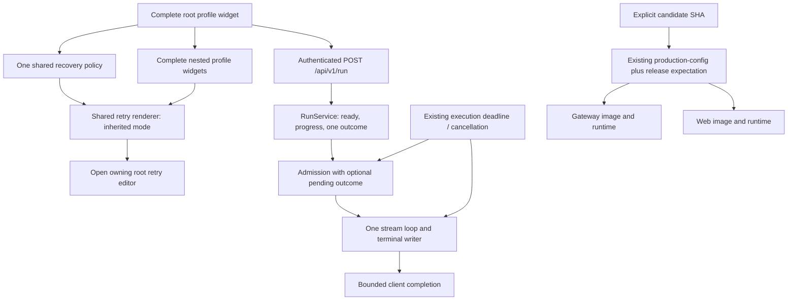

# Harden-LLM recovery reliability and production closeout plan

## 1. Title and metadata

- Project: Harden-LLM.
- Version: 1.2; implementation status: In progress (P00-P01 complete; P02-P04 pending).
- Document ID: PLAN-HLLM-RECOVERY-CLOSEOUT-001.
- Date: 2026-09-21 UTC.
- Owners: repository maintainer for acceptance and production operation; implementing coding agent for code, tests, and release evidence.
- Baseline checkout: `faf7411e25a3c968a2dac7a473b41abfa74a612b`, branch `main`.
- Canonical contracts: `api/openapi.yaml`; `docs/adr/ADR-HLLM-024-bounded-recovery-and-progress.md`; `docs/adr/ADR-HLLM-025-recursive-profile-widget.md`.
- Test authorities: `AGENTS.md`, `docs/liveview-go-testing-guidelines.md`, `plans/from_utility-llm/harden-llm-self-hosted-test-spec.md`, and `plans/from_utility-llm/phoenix-liveview-frontend-spec.md`.

This plan closes four observed gaps: an SSE gateway fix was pushed but only the frontend was deployed; the SSE admission path can consume and lose a completed result; existing repeated-request coverage does not deterministically exercise the failed event ordering; and nested recovery widgets describe inheritance without displaying the effective retry settings. Deliver one bounded stream lifecycle, controlled regressions, reusable inherited retry controls, and production evidence tied to both affected services. This document defines future work; its presence does not certify implementation or deployment.

### Observed baseline

Read-only Docker inspection and the production configuration check on the document date established:

| Component | Running release | Image identity |
| --- | --- | --- |
| Web | `3201fd249f86031292be1c47acf64e0eb8a4540b` | `sha256:299439921295e6037a0cc01e1b1893e5bd1c2e441b740021479ca6666c1e5276` |
| Gateway | `12b0478af9ef59c36a08011c5556d8e37ff9625c` | `sha256:9395f2465e32a5f3b00802e5eff24ad7d98f5d717e63acd0a0aeba84f6618673` |

- Both containers were healthy. `production-config check` returned `equivalent` because the descriptor expected this mixed release.
- Commit `3201fd2` fixes closure capture in `internal/gateway/httpapi/resources.go`; that code is absent from the running gateway.
- In that file, admission can receive `outcomes`, consume `ready`, and enter a second loop that waits for the already-consumed outcome. The loop watches the request context rather than its derived execution context.
- `cmd/harden-llm-gateway/server.go` has a separate HTTP write timeout. It can eventually interrupt the connection; it does not deliver the missing terminal result or prove compliance with a shorter requested deadline.
- `internal/gateway/run_test.go` repeats a fast SSE request four times. Its SSE requests do not use the test's existing context, and `io.ReadAll` can await the broader test timeout.
- `target_recovery_editor/1` displays inheritance text without values. The `maxAttempts` tooltip incorrectly says the profile and model stay the same.
- Previous green release results are historical evidence. New code requires new evidence; historical health checks do not prove the SSE completion path.

## 2. Design consensus and trade-offs

| Topic | Verdict | Decision and rationale |
| --- | --- | --- |
| Four findings | DECISION | Keep one coordinated document and release; retain separate requirements and verification for each finding. |
| Release correctness | FOR | Compare the explicitly intended candidate SHA with each selected application's descriptor, image label, and runtime identity. Descriptor consistency alone cannot detect an omitted deployment. |
| Deployment tooling | DECISION | Extend `scripts/production-config.mjs` with an optional explicit release expectation; keep its source loading, scoped apply, and redaction. Do not add a deployment framework. |
| SSE repair | FOR | Preserve a completed outcome across admission, centralize terminal emission, and observe the existing execution deadline. Keep the stable worker-owned channel fix. |
| Polling or detached jobs | AGAINST | These defects are in the current request-bound SSE transport. No new job API, polling service, database, or queue is needed. |
| Test design | FOR | Make a small package-private admission/stream boundary testable with channels and controlled completion. Keep actual RunService/Postgres coverage for the distinct integration boundary. |
| Repeated requests as proof | AGAINST | Repetition and the race detector supplement explicit event-order assertions; they cannot replace them. |
| Recursive UI | FOR | Continue using the complete profile widget. Extract the existing retry fields into one renderer with editable/inherited modes. |
| Retry ownership | DECISION | One root policy owns categories, total attempts, and backoff. Nested widgets display its current values and navigate to its editor; they do not own new budgets. |
| Scope of publication | DECISION | Push source and evidence to Git; build immutable application images and apply the existing local Compose deployment. Do not claim a registry/package publication unless one actually occurs. |
| Browser/provider certification | DECISION | Use deterministic component/HTTP tests and production health/auth probes. Browser layout and paid-provider execution require separate explicit requests. |
| Timeout thresholds | AGAINST | Do not raise application, client, test-tier, or CI limits to obtain green results. Record new focused watchdogs in the planned ADR; any later threshold change requires an ADR. |

## 3. PRD / stakeholder and system needs

- Problem: successful model work can appear unfinished; a release can report success while its backend remains old; nested settings conceal the active policy.
- Users: REST clients, agent frameworks, client-test authors, operators, and users of the workspace, Profiles, and embedded profile widgets.
- Value: prompt and unambiguous completion, bounded diagnosis, clear shared settings, and auditable deployment.
- Business goals: reduce wasted execution and debugging time; maintain the reusable API/widget architecture; complete production delivery without unnecessary infrastructure.
- Success metrics: zero lost or duplicate terminal events in the controlled matrix; zero channel races or owned workers left after cleanup; zero implicit timeout increases; every requested application matches the candidate SHA; all five retry categories and three numeric values appear correctly in applicable nested panels.
- Scope: Go HTTP SSE orchestration, its cheap and integration tests, the existing production configuration tool, Phoenix retry rendering/navigation, canonical test registration, and release receipts.
- Non-goals: new model selection rules, pricing changes, provider retries, per-target retry budgets, database migrations, trace storage redesign, browser automation, paid calls, or generic release orchestration.
- Dependencies: pinned Go/Elixir/OTP/Node; existing isolated Postgres/Garage runner; approved production descriptor and environment files; Docker access; source push access.
- Risks: deadline/completion precedence could lose diagnostics; read-only checkbox hidden fields could serialize unintended values; stale host UI state could reopen the wrong widget; a release check could reject legitimate infrastructure versions.
- Assumptions: existing production authorization remains valid for this closeout; baseline credentials and accounts remain available; `main` still contains the baseline before integration. Refresh all mutable assumptions in P00 and before P04.
- Evidence limits: local stubs establish lifecycle and contract behavior, not live model behavior. HTTP health proves availability, not browser layout or streamed inference through production proxies.

## 4. SRS / canonical requirements

Acceptance criteria belong to the requirements below. Test mappings appear in Sections 7 and 10.

| ID | Type | Requirement and acceptance criteria |
| --- | --- | --- |
| REQ-331 | reliability | Release verification takes an explicit full candidate SHA independent of the descriptor. A stale but internally consistent application descriptor, wrong image label, or old runtime fails candidate verification. An apply may start from an old runtime only when its desired descriptor and built images match the candidate. |
| REQ-332 | func | An admitted run with a writable client emits exactly one `run.completed` or `run.failed`, including when completion precedes stream setup. Pending progress is drained before terminal emission; the HTTP handler returns without waiting for a second outcome. Execution occurs once. |
| REQ-333 | reliability | Admission and streaming observe the existing effective execution deadline and client cancellation. Expiry before admission yields the existing JSON timeout response; expiry after admission attempts one failed terminal and returns. Disconnects/write errors cancel execution without waiting for a non-cooperative worker. |
| REQ-334 | int | Keep authenticated `POST /api/v1/run`, JSON default transport, pre-admission validation errors, unsupported resume handling, envelope version, event sequence, and result/error shapes. Preserve known run/call/trace IDs; never invent missing results, token accounting, or persisted state. |
| REQ-335 | reliability | Package-private lifecycle tests force the pending-result, later-result, expiration, cancellation, and write-error states without sleeps, public providers, or Docker. Workers close stable channel references and can publish a late result without blocking a departed handler. Test cleanup joins every cooperative test-owned worker. |
| REQ-336 | func | Root and nested retry sections use one retry-control renderer. Every applicable nested panel shows the root's five categories, total attempt limit, and two backoff values as disabled, non-submitting controls, labeled inherited. Values reflect unsaved root edits, including empty categories and zero delays. |
| REQ-337 | func | `Edit shared retry policy` opens the owning root configuration and retry section. It affects only the current widget instance and does not change policy, selection, branch enablement, or saved profiles. A standalone target without an owning root does not render a broken navigation action. |
| REQ-338 | data | Preserve the finite six-node topology, leaf target wire shape, generation-relative targets, null disabled branches, and root-only policy mutation. Reject forged nested policy edits. Replace stale same-model help with wording covering original generation, repair, escalation, and rerun calls. |
| REQ-339 | reliability | Deploy both changed application services from the recorded release candidate, retain independently verified rollback identities, and report branch, SHA, image identities, URLs, test evidence, and probe results. Correct the prior web-only release claim. Publication evidence must identify its actual destination. |
| REQ-340 | security | Diagnostic evidence contains bounded state, IDs, durations, statuses, and counters; it excludes credentials, request/response contents, and full container environments. Existing timeout and attempt limits remain unchanged; failures cannot be converted into success by retries, skipped assertions, or deadline increases. |

Error and precedence rules:

1. Client cancellation or failed writes terminate delivery and cancel execution; a disconnected client is not owed a successfully delivered terminal event.
2. A pending or already-buffered completed outcome is authoritative and goes through one terminal writer. Do not relabel an already-completed success solely because delivery reached the deadline.
3. With no available outcome, an expired execution context yields `run_timeout`. Before admission, retain HTTP 504 JSON; after admission, retain HTTP 200 SSE with `run.failed` and `data.error.code = run_timeout`.
4. At expiry, inspect a pending outcome and perform at most one nonblocking completion read. Do not wait for another outcome or drain newly arriving progress indefinitely.
5. A synthesized deadline response contains only known identity and the existing error envelope; use a null result when no result is available. Do not claim run persistence or fabricate usage.
6. Keep the worker's one buffered outcome slot and stable progress reference. The HTTP handler never closes a producer-owned channel. A cooperative worker observes cancellation; arbitrary blocked code cannot be forcibly terminated by Go.
7. Keep the existing server write-timeout safeguard. This plan does not claim a hard wall-clock delivery guarantee to a non-reading client.



```text
People: operator / agent developer / profile-widget user
  Harden-LLM system
    Phoenix frontend
      Complete profile widget -> shared editable/inherited retry fields
    Go gateway
      REST admission -> request-bound SSE delivery -> RunService
    Existing stores: Postgres history; Garage artifacts; existing telemetry
  Deployment host
    Explicit candidate SHA + approved descriptor -> production-config
      -> gateway image/container
      -> web image/container
External systems: authenticated REST clients and existing configured providers
```

## 5. Iterative implementation and test plan

### Strategy and controls

- Finding 1, deployment omission: P01 and P04.
- Finding 2, lost SSE result: P02.
- Finding 3, timing-dependent regressions: P02, with registration in P00.
- Finding 4, inherited retry UI: P03.
- Dependency order: P00 -> P01 -> P02 -> P03 -> P04. Complete subtasks sequentially; a documented blocker permits independent investigation, never dependent implementation or promotion.
- `branch_limits`: one implementation branch, at most two considered designs per unresolved boundary, one active phase, one expensive verification process. No subagent delegation is required.
- `reflection_passes`: two, after design/extraction and before candidate promotion.
- `early_stop%`: 0 for required acceptance work. After a failed verification command, preserve evidence and diagnose before further implementation or another expensive gate; do not retry an ambiguous run automatically.
- Threshold control: create `docs/adr/ADR-HLLM-026-recovery-closeout-verification.md` in P00 for the new watchdogs and release-intent rule. Existing thresholds remain intact. Measured overruns trigger diagnosis, not automatic changes.
- Iteration: no more than three unsuccessful local hypotheses for one defect before writing a causal note and revisiting the design. This is not permission to stop required work while meaningful progress remains possible.
- Checkpoints: record commit and evidence references at phase exits. Git tags/restore points are phase boundaries, not implementation subtasks. Never overwrite or discard unrelated changes.
- Standards tailoring: this is informed by requirements, test-documentation, and lifecycle standards; it claims no ISO/IEEE/FAA compliance. No safety-critical assurance level, tool qualification, or certification claim is made.
- Phase estimates below are planning judgments, not measured probabilities. Interaction counts denote touched component boundaries. YAGNI score is 1–5, where 5 means all proposed surfaces are needed for this scope.

### Risk register and suspension

| Risk | Trigger | Mitigation / resume condition |
| --- | --- | --- |
| Baseline drift | Candidate ancestry, image, descriptor, or working tree differs | Record the new baseline and scope its diff before implementation/promotion. |
| Inadequate test seam | A regression depends on which ready channel Go selects | Expose the already-consumed pending outcome at the package-private response-loop boundary; do not add a test-only scheduler hook. |
| Deadline race | Both cancellation and completion become observable | Apply the precedence rules and assert exactly one terminal event. |
| Worker leak | Handler returns but a fixture stays blocked | Release fixture gates during cleanup, cancel, and await explicit done channels. |
| UI payload pollution | Inherited fields emit enabled hidden inputs | Omit names/change handlers and disable visible and hidden inputs; assert serialized draft equality. |
| Wrong release scope | Only web is listed for the candidate gate | P04 always names gateway and web; compare each to the candidate and retain their distinct rollback records. |
| Partial deployment | One service applies and the second fails | Report partial state; restore the affected service using its recorded rollback descriptor/image. Never claim full completion. |
| Missing production authority/source | Descriptor, image, credentials, or Docker access unavailable | Preserve local results and stop promotion with the concrete missing prerequisite. Do not source credentials from containers. |

Resume at the first failed subtask after its prerequisite is restored. A failing required test, changed public contract, new migration, or proposed timeout increase suspends the affected phase. Scope expansion requires an explicit decision; browser/provider work is not an automatic recovery action.

### Phase P00: Baseline and verification contracts are reproducible

- Goal: freeze the four findings, IDs, watchdog policy, and evidence locations before application changes.
- Scope / requirements: REQ-331 through REQ-340.
- Surfaces: this plan; `scripts/verify-test-tiers.mjs`; `test/test-tiers.json`; both canonical test specifications; planned ADR-HLLM-026; `docs/adr/README.md`.
- Lifecycle evidence: current Git/runtime observations; source pointers in Section 1; static registration results; validation that later agents can execute each command; phase-boundary SHA; assumptions about production ownership and no threshold increases.

- P00.S01 Record the actual source and running components
  - Action: inspect Git state, both application labels/digests, descriptor consistency, and the gateway diff from its running release.
  - Why now: the starting state determines what must be delivered.
  - Files/surfaces: `internal/gateway/httpapi/resources.go`; `frontend/lib/harden_llm_web/live/profile_widget_component.ex`; private production descriptor; Docker application containers.
  - Requirement link: REQ-331, REQ-339.
  - Verification link: EVAL-004 baseline inspection.
  - Verification mode: VERIFY.
  - Command/procedure: `git status --short --branch`; `git rev-parse HEAD`; `docker inspect harden-llm-harden-llm-web-1 harden-llm-harden-llm-gateway-1 --format '{{.Name}} {{.Image}} {{index .Config.Labels "org.opencontainers.image.version"}}'`; existing `node scripts/production-config.mjs check --descriptor /home/kirill/.config/harden-llm/production.json`.
  - Expected result: baseline recorded without treating equivalence as candidate acceptance.
  - Evidence produced: sanitized baseline in the execution log.
  - Stop/escalate condition: overlapping user edits, unexpected component identity, or unreadable approved configuration.
  - Unlocks: P00.S02.

- P00.S02 Add failing registration checks for closeout cases
  - Action: extend the existing tier verifier to require the new local test IDs and frontend companion IDs in their intended existing tasks and canonical specifications.
  - Why now: coverage must be discoverable by normal gates.
  - Files/surfaces: `scripts/verify-test-tiers.mjs`.
  - Requirement link: REQ-335, REQ-340.
  - Verification link: TEST-268.
  - Verification mode: RED.
  - Command/procedure: `node scripts/verify-test-tiers.mjs`.
  - Expected result: failure names missing closeout registration; existing policy checks still execute.
  - Evidence produced: failing command output and traceability-tagged verifier diff.
  - Stop/escalate condition: failure is unrelated to the added registration assertions.
  - Unlocks: P00.S03.

- P00.S03 Register cases and record bounded verification decisions
  - Action: append the case definitions to the canonical specifications; register IDs using Section 7; record watchdog and release-intent decisions in ADR-HLLM-026 and its index.
  - Why now: the failing registration contract now defines the required shape.
  - Files/surfaces: `test/test-tiers.json`; `plans/from_utility-llm/harden-llm-self-hosted-test-spec.md`; `plans/from_utility-llm/phoenix-liveview-frontend-spec.md`; new `docs/adr/ADR-HLLM-026-recovery-closeout-verification.md`; `docs/adr/README.md`.
  - Requirement link: REQ-331, REQ-335, REQ-340.
  - Verification link: TEST-268.
  - Verification mode: GREEN.
  - Command/procedure: `node scripts/verify-test-tiers.mjs`.
  - Expected result: all IDs have one owning task; fast/release remain browser-free; existing timeouts and task scheduling are unchanged.
  - Evidence produced: green registration output, specifications, ADR, and phase checkpoint.
  - Stop/escalate condition: ID collision, proposed budget increase, or duplicated task ownership.
  - Unlocks: P00.S04.

- P00.S04 Review registration ownership and document the checkpoint
  - Action: record `No refactor needed`: this phase adds entries to existing authorities rather than new orchestration; inspect the completed registration diff.
  - Why now: phase exit requires consistent discovery and bounded scope.
  - Files/surfaces: `scripts/verify-test-tiers.mjs`; `test/test-tiers.json`; canonical specifications and ADR-HLLM-026.
  - Requirement link: REQ-335, REQ-340.
  - Verification link: TEST-268.
  - Verification mode: VERIFY.
  - Command/procedure: `node scripts/verify-test-tiers.mjs`; `git diff HEAD --check`.
  - Expected result: registration passes and no execution lane, timeout, or unrelated policy changed.
  - Evidence produced: reviewed diff and phase checkpoint.
  - Stop/escalate condition: extra orchestration or ambiguous verification ownership remains.
  - Unlocks: phase exit.

- Exit: proceed when registration passes and baseline is recorded; escalate ambiguous ownership/IDs; stop a proposed public-contract or budget expansion.
- Metrics: Confidence 96%; Long-term robustness 94%; Internal interactions 4; External interactions 1; Complexity 20%; Feature creep 2%; Technical debt 3%; YAGNI 5/5; MoSCoW Must; Scope local specification plus read-only host inspection; Architectural changes count 0. Rationale: existing policy and tooling provide the necessary structure.

### Phase P01: Production verification detects a stale desired release

- Goal: a descriptor and runtime that agree on an old application cannot pass an explicitly newer release expectation.
- Scope / requirements: REQ-331, REQ-339, REQ-340.
- Surfaces: `scripts/production-config.mjs`; `scripts/test/production_config_test.mjs`; `docs/environment.md`; `docs/self-hosting.md`.
- Lifecycle evidence: release-intent requirement; existing configuration ownership/comparison functions; fake Docker boundary and CLI rejection checks; validation against the observed mixed-release mistake; code/test checkpoint; no additional deployment service or credential source.

- P01.S01 Add failing release-intent rejection cases
  - Action: extend the current Node fixtures with gateway/web labels and old/candidate SHAs. Assert that an expected candidate rejects a stale equivalent descriptor, stale desired image, missing label, incomplete identity overrides, and unhealthy/missing candidate runtime. Add malformed SHA and incompatible scoped-option cases when the argument parser is implemented.
  - Why now: recreate the false-positive deployment check before changing the tool.
  - Files/surfaces: `scripts/test/production_config_test.mjs`; existing exported `runCheck` and `runApply`.
  - Requirement link: REQ-331, REQ-340.
  - Verification link: TEST-260.
  - Verification mode: RED.
  - Command/procedure: `node --test scripts/test/production_config_test.mjs`.
  - Expected result: stale-intent assertions fail against current behavior; no real Docker operation or secret file is used.
  - Evidence produced: tagged tests and failing assertion output.
  - Stop/escalate condition: RED relies only on missing imports or fixture failures rather than ignored release intent.
  - Unlocks: P01.S02.

- P01.S02 Add explicit candidate verification to the existing tool
  - Action: implement `--expected-release` as a full 40-hex SHA, requiring explicit application services. Add `expectedRelease` to `runCheck` options and a backward-compatible final options argument to `runApply`. Validate desired identity overrides and desired image OCI version before any no-op or apply; compare actual image labels/releases and running/healthy state after inspection/application. Preserve existing checks without the option.
  - Why now: the stale-descriptor regression supplies the oracle.
  - Files/surfaces: `scripts/production-config.mjs`; documentation examples in `docs/environment.md` and `docs/self-hosting.md`.
  - Requirement link: REQ-331, REQ-339, REQ-340.
  - Verification link: TEST-260.
  - Verification mode: GREEN.
  - Command/procedure: `node --test scripts/test/production_config_test.mjs`.
  - Expected result: all intent cases pass; old actual runtime is a permitted pre-apply difference when desired image/descriptor match; wrong desired intent blocks before `up`; post-apply still requires convergence. `--resolve-only` cannot claim candidate verification.
  - Evidence produced: code/docs diff and green test output.
  - Stop/escalate condition: credentials appear in reports, ordinary checks change meaning, or unselected infrastructure is constrained to the candidate SHA.
  - Unlocks: P01.S03.

- P01.S03 Review the shared release-validation boundary
  - Action: confirm check/apply use one validation helper and record `No refactor needed` when that condition holds. If duplication remains, complete and document a REFACTOR correction before advancing.
  - Why now: the new argument must not create two different acceptance rules.
  - Files/surfaces: `scripts/production-config.mjs`; `scripts/test/production_config_test.mjs`.
  - Requirement link: REQ-331, REQ-340.
  - Verification link: TEST-260.
  - Verification mode: VERIFY.
  - Command/procedure: `node --test scripts/test/production_config_test.mjs`.
  - Expected result: one reusable validation path, unchanged ordinary check/apply semantics, and passing regressions.
  - Evidence produced: review note and test result.
  - Stop/escalate condition: duplicate logic or ambiguity about pre-apply versus post-apply identity remains.
  - Unlocks: P01.S04.

- P01.S04 Record static-lane measurements
  - Action: run the existing static lane and preserve its timing/results.
  - Why now: close the helper/API boundary before stream work.
  - Files/surfaces: `scripts/production-config.mjs`; `scripts/test/production_config_test.mjs`; `tmp/test-feedback/recovery-closeout-static.json`.
  - Requirement link: REQ-331, REQ-340.
  - Verification link: TEST-260, TEST-268, EVAL-001.
  - Verification mode: MEASURE.
  - Command/procedure: `node scripts/run-test-tier.mjs --task go-static --output tmp/test-feedback/recovery-closeout-static.json`.
  - Expected result: accepted lane, zero cleanup errors, all stale-intent cases rejected with zero mutating subprocesses.
  - Evidence produced: runner JSON, raw red/green evidence references, phase checkpoint.
  - Stop/escalate condition: any existing static/security contract fails.
  - Unlocks: phase exit.

- Exit: proceed on all intent/security assertions; escalate unknown application identity fields; stop expansion into a new deployment framework.
- Metrics: Confidence 93%; Long-term robustness 95%; Internal interactions 3; External interactions 1; Complexity 35%; Feature creep 5%; Technical debt 4%; YAGNI 5/5; MoSCoW Must; Scope local tool plus Docker contract; Architectural changes count 0. Rationale: an explicit candidate input fixes the missing comparison while preserving scoped apply.

### Phase P02: SSE completion and deadline handling are bounded and deterministically covered

- Goal: no consumed outcome is lost and no writable admitted stream waits beyond its execution deadline for a second result.
- Scope / requirements: REQ-332 through REQ-335, REQ-340.
- Surfaces: `internal/gateway/httpapi/resources.go`; new `internal/gateway/httpapi/sse_test.go`; `internal/gateway/run_test.go`; `scripts/test/run_progress_test.mjs` as a retained client contract check.
- Lifecycle evidence: admission/terminal precedence requirements; private Go channel boundary; controlled package tests and real RunService/Postgres integration; validation that test clients finish without timeout extensions; exact code checkpoint; explicit treatment of non-cooperative workers and non-reading clients.

- P02.S01 Expose admission state at a package-private stream boundary
  - Action: mechanically extract admission and stream writing from `runSSE` into small private functions in the same file. Carry the existing admission outcome as an explicit optional pending result; keep transport behavior unchanged during extraction. Keep worker launch/cancel ownership in `runSSE` and keep the stable captured channel. Do not change `Config.Runs`, export an executor interface, or add a scheduling hook.
  - Why now: tests must directly supply the already-consumed outcome instead of depending on Go's selection between simultaneously ready channels.
  - Files/surfaces: `internal/gateway/httpapi/resources.go`; existing integration route coverage.
  - Requirement link: REQ-332, REQ-334, REQ-335.
  - Verification link: TEST-267.
  - Verification mode: REFACTOR.
  - Command/procedure: `make test-integration`.
  - Expected result: current integration assertions pass; no intended observable change. The missing pending-result handling remains for the next failing regression.
  - Evidence produced: mechanical extraction diff and integration result.
  - Stop/escalate condition: extraction changes result precedence, schemas, execution count, or requires a public abstraction. A failure blocks acceptance of the extraction.
  - Unlocks: P02.S02.

- P02.S02 Add failing controlled lifecycle regressions
  - Action: add tests that directly enter the production stream function with an already-consumed success/failure and an empty outcome channel; add later completion, expired execution context with live request, cancellation, write failure, and stable channel ownership cases. Use done/ack channels and bounded cleanup; parse SSE envelopes instead of searching only for strings.
  - Why now: the test boundary now makes the lost-result and deadline defects reproducible without random selection.
  - Files/surfaces: new `internal/gateway/httpapi/sse_test.go`, with `SPEC-HARDEN-LLM-SELF-HOSTED-TESTS-001` and TEST-261/262/263 tag comments.
  - Requirement link: REQ-332, REQ-333, REQ-334, REQ-335, REQ-340.
  - Verification link: TEST-261, TEST-262, TEST-263.
  - Verification mode: RED.
  - Command/procedure: `go test ./internal/gateway/httpapi -run '^TestSSE' -count=1 -timeout=60s`.
  - Expected result: pending-outcome and execution-deadline cases fail their bounded completion assertions; existing ownership/transport cases may already pass. No compile-only failure counts as RED.
  - Evidence produced: failing case names, terminal-event counts, joined fixture cleanup, and test diff.
  - Stop/escalate condition: ordering depends on sleeps, repetitions, or a random select; test cleanup leaves a blocked goroutine.
  - Unlocks: P02.S03.

- P02.S03 Consume pending outcomes and observe execution expiry
  - Action: process pending admission outcomes through the same finalizer as later outcomes; apply Section 4 precedence; observe execution and request cancellation during admission and streaming; cancel on write failure; preserve best-effort bounded progress draining and existing error shapes. Keep channel capacity and worker close ownership intact.
  - Why now: behavioral failures now identify the missing state transitions.
  - Files/surfaces: `internal/gateway/httpapi/resources.go`.
  - Requirement link: REQ-332, REQ-333, REQ-334, REQ-335, REQ-340.
  - Verification link: TEST-261, TEST-262, TEST-263.
  - Verification mode: GREEN.
  - Command/procedure: `go test ./internal/gateway/httpapi -run '^TestSSE' -count=1 -timeout=60s`.
  - Expected result: one terminal on writable completed/deadline streams, prompt cancellation/write-error return, no second execution, and no lost buffered result.
  - Evidence produced: implementation diff and identical-command green output.
  - Stop/escalate condition: new timeout, altered accounting, duplicate terminal, or handler waits for worker completion after cancellation.
  - Unlocks: P02.S04.

- P02.S04 Bound native HTTP coverage and retain the real persistence boundary
  - Action: add/retain a local HTTP-server case for admission-to-SSE framing and disconnect propagation; attach the existing test context to SSE/resume requests in `run_test.go`; bound body reads and close them on all exits. Keep the current repeated integration cases and their assertions; deterministic tests now supply the race oracle. Run the client parser's existing missing-terminal/error tests.
  - Why now: private transition tests need corroboration at HTTP and RunService boundaries.
  - Files/surfaces: `internal/gateway/httpapi/sse_test.go`; `internal/gateway/run_test.go`; `scripts/test/run_progress_test.mjs`.
  - Requirement link: REQ-332, REQ-333, REQ-334, REQ-335, REQ-340.
  - Verification link: TEST-261, TEST-262, TEST-263, TEST-267.
  - Verification mode: VERIFY.
  - Command/procedure: `make test-integration`; `node --test scripts/test/run_progress_test.mjs`.
  - Expected result: real authenticated RunService/Postgres path preserves progress, terminal output, single execution, persistence, and resume rejection; client EOF without terminal remains failure.
  - Evidence produced: native HTTP assertions, integration result, client result, context-bound test diff.
  - Stop/escalate condition: direct integration execution lacks runner-owned endpoints or a test accepts cancellation as successful completion.
  - Unlocks: P02.S05.

- P02.S05 Review terminal and channel ownership
  - Action: confirm every writable terminal path uses one finalizer and each channel has one close owner; record `No refactor needed` if these invariants already hold. Otherwise document and complete a REFACTOR correction before measurement.
  - Why now: the green implementation must not leave competing completion paths.
  - Files/surfaces: `internal/gateway/httpapi/resources.go`; `internal/gateway/httpapi/sse_test.go`.
  - Requirement link: REQ-332, REQ-333, REQ-335.
  - Verification link: TEST-261, TEST-262, TEST-263.
  - Verification mode: VERIFY.
  - Command/procedure: `go test ./internal/gateway/httpapi -run '^TestSSE' -count=1 -timeout=60s`.
  - Expected result: one terminal implementation, stable channel ownership, and all lifecycle assertions passing.
  - Evidence produced: ownership review note and focused test result.
  - Stop/escalate condition: terminal duplication or test-only execution branches remain.
  - Unlocks: P02.S06.

- P02.S06 Measure lifecycle repeatability under the race detector
  - Action: execute the controlled matrix repeatedly under `-race`, then the managed integration-race lane.
  - Why now: both cheap state transitions and service boundaries are green.
  - Files/surfaces: `internal/gateway/httpapi/resources.go`; `internal/gateway/httpapi/sse_test.go`; `internal/gateway/run_test.go`.
  - Requirement link: REQ-332, REQ-333, REQ-335, REQ-340.
  - Verification link: TEST-261, TEST-262, TEST-263, TEST-267, EVAL-002.
  - Verification mode: MEASURE.
  - Command/procedure: `go test -race ./internal/gateway/httpapi -run '^TestSSE' -count=20 -timeout=60s`; `make test-integration-race`.
  - Expected result: zero race reports, missing/duplicate terminals, watchdog failures, or fixture leaks; repeated execution supplements the forced-order matrix.
  - Evidence produced: case counts, elapsed times, worker-done assertions, race-lane result, phase checkpoint.
  - Stop/escalate condition: flake or overrun; capture the failing ordering and diagnose without another unexamined rerun.
  - Unlocks: phase exit.

- Exit: proceed on exact terminal/deadline/cleanup assertions and real integration; escalate an unmodelled admission outcome; stop any proposed runtime-budget expansion.
- Metrics: Confidence 90%; Long-term robustness 96%; Internal interactions 4; External interactions 1; Complexity 55%; Feature creep 4%; Technical debt 5%; YAGNI 5/5; MoSCoW Must; Scope gateway-local plus HTTP/Postgres boundary; Architectural changes count 1, a private stream-state boundary. Rationale: concurrency needs explicit ordering and cleanup while the public API remains unchanged.

### Phase P03: Nested widgets show the effective shared retry policy

- Goal: every applicable repair/rerun panel displays the active retry values through the same controls as the root and offers navigation to the owning editor.
- Scope / requirements: REQ-336, REQ-337, REQ-338, REQ-340.
- Surfaces: `frontend/lib/harden_llm_web/live/profile_widget_component.ex`; `frontend/lib/harden_llm_web/profile_widget_state.ex`; component/state/embedding tests; the existing core input renderer, inspected for hidden fields.
- Lifecycle evidence: root-only policy requirements; existing full widget and finite-role architecture; LiveView events and pure serialization assertions; validation of visible inherited values and instance ownership; frontend code checkpoint; no browser-layout claim or schema migration.

- P03.S01 Add failing inherited-value and owner-navigation assertions
  - Action: cover all five recovery targets, root draft changes, empty categories, zero delays, instance isolation, and the edit-root action. Replace assertions that require absent nested retry controls with assertions requiring disabled, unnamed controls; retain assertions forbidding recursive repair/rerun and budget writes.
  - Why now: the earlier tests encode the incomplete presentation and need a stronger oracle before rendering changes.
  - Files/surfaces: `frontend/test/harden_llm_web/live/profile_widget_component_test.exs`; `frontend/test/harden_llm_web/live/profile_widget_state_test.exs`; `frontend/test/harden_llm_web/live/embedding_live_test.exs`.
  - Requirement link: REQ-336, REQ-337, REQ-338, REQ-340.
  - Verification link: TEST-264, TEST-265, TEST-266.
  - Verification mode: RED.
  - Command/procedure: `(cd frontend && mix test test/harden_llm_web/live/profile_widget_component_test.exs test/harden_llm_web/live/profile_widget_state_test.exs test/harden_llm_web/live/embedding_live_test.exs --seed 104729)`.
  - Expected result: missing inherited values/navigation fail; unchanged policy, topology, and serialization assertions remain binding.
  - Evidence produced: tagged frontend regressions and failing assertion output.
  - Stop/escalate condition: a change weakens the root-only policy oracle or needs actual browser geometry to establish the claimed result.
  - Unlocks: P03.S02.

- P03.S02 Reuse retry controls and route edits to their owner
  - Action: extract the existing category/numeric markup into `retry_policy_controls/1` with editable/inherited modes. Pass the owning root's effective draft policy and root editor identity through `recovery_fields/1`, `repair_plan_fields/1`, `rerun_plan_fields/1`, `recovery_target_fields/1`, `profile_widget_node/1`, `target_profile_config/1`, and `profile_editor/1` into `target_recovery_editor/1`. Add the instance-local edit-root event and correct the tooltip.
  - Why now: the failing tests define exact values, ownership, and navigation.
  - Files/surfaces: `frontend/lib/harden_llm_web/live/profile_widget_component.ex`; `frontend/lib/harden_llm_web/profile_widget_state.ex` only if a capability helper is needed.
  - Requirement link: REQ-336, REQ-337, REQ-338, REQ-340.
  - Verification link: TEST-264, TEST-265, TEST-266.
  - Verification mode: GREEN.
  - Command/procedure: `(cd frontend && mix test test/harden_llm_web/live/profile_widget_component_test.exs test/harden_llm_web/live/profile_widget_state_test.exs test/harden_llm_web/live/embedding_live_test.exs --seed 104729)`.
  - Expected result: inherited controls match the current root draft; edit-root opens its configuration/retry fold through existing parent UI notifications; no profile save or run occurs.
  - Evidence produced: shared-renderer diff and identical-command green output.
  - Stop/escalate condition: selected target profile defaults overwrite the root policy, new nested retry fields enter the wire document, or another widget changes.
  - Unlocks: P03.S03.

- P03.S03 Review recursive rendering and form boundaries
  - Action: retain one category list and numeric-control definition; namespace all IDs; remove `name` and change-event bindings from inherited controls; disable hidden checkbox inputs as well as visible inputs. Derive permissions from server-owned roles. Preserve source-generation target behavior and disabled branches. Record `No refactor needed` if extraction already eliminated duplicate markup.
  - Why now: disabled appearance alone does not establish safe form serialization or component reuse.
  - Files/surfaces: `frontend/lib/harden_llm_web/live/profile_widget_component.ex`; `frontend/lib/harden_llm_web/components/core_components.ex` for inspection; the three frontend test files.
  - Requirement link: REQ-336, REQ-337, REQ-338.
  - Verification link: TEST-264, TEST-265, TEST-266.
  - Verification mode: VERIFY.
  - Command/procedure: `(cd frontend && mix format --check-formatted && mix test test/harden_llm_web/live/profile_widget_component_test.exs test/harden_llm_web/live/profile_widget_state_test.exs test/harden_llm_web/live/embedding_live_test.exs --seed 104729)`.
  - Expected result: single shared renderer; empty/null/zero values preserved; forged nested policy events leave canonical state unchanged; new IDs do not collide.
  - Evidence produced: rendered HTML/payload assertions, formatting result, review note.
  - Stop/escalate condition: global DOM selectors, duplicated root policy state, or a required generic core-input change without its own regression. Complete a documented REFACTOR correction before advancing if duplication remains.
  - Unlocks: P03.S04.

- P03.S04 Measure broad fast feedback for the combined changes
  - Action: execute the existing fast selector with persisted output and record its task results and frontend timings.
  - Why now: all four workstreams have local implementation and focused coverage.
  - Files/surfaces: `scripts/run-test-tier.mjs`; `test/test-tiers.json`; `tmp/test-feedback/recovery-closeout-fast.json`.
  - Requirement link: REQ-335, REQ-336, REQ-337, REQ-338, REQ-340.
  - Verification link: TEST-264, TEST-265, TEST-266, TEST-268, EVAL-003.
  - Verification mode: MEASURE.
  - Command/procedure: `node scripts/run-test-tier.mjs --task fast --output tmp/test-feedback/recovery-closeout-fast.json`.
  - Expected result: accepted fast gate, zero failures/cleanup errors, no browser/container/provider task; existing budgets unchanged.
  - Evidence produced: runner report, UI behavior matrix, phase checkpoint.
  - Stop/escalate condition: any failure, policy drift, or unexplained timing increase.
  - Unlocks: phase exit.

- Exit: proceed when displayed values, root navigation, and serialization pass in supported hosts; escalate absent owner context; stop any proposal for per-target retry budgets.
- Metrics: Confidence 94%; Long-term robustness 95%; Internal interactions 5; External interactions 1; Complexity 45%; Feature creep 3%; Technical debt 3%; YAGNI 5/5; MoSCoW Must; Scope frontend-local with unchanged REST serialization; Architectural changes count 0. Rationale: the existing complete widget needs shared policy props and one renderer, not another widget hierarchy.

### Phase P04: Both application fixes are deployed and the evidence is accurate

- Goal: the intended gateway and web candidate is running on production, with reproducible verification and independently recorded rollback identities.
- Scope / requirements: REQ-331 through REQ-340, especially REQ-339.
- Surfaces: `Dockerfile`; `frontend/Dockerfile`; `scripts/production-config.mjs`; private `/home/kirill/.config/harden-llm/production.json`; `docs/release-certification.md`; main branch and the production endpoints.
- Lifecycle evidence: requirement-to-component mapping; exact candidate and image labels; full release result and candidate-aware runtime checks; validation that users receive both fixes; Git/image/descriptor checkpoints; partial-cutover/rollback risks.

- P04.S01 Certify and push the complete candidate
  - Action: integrate the verified changes using the repository's branch policy; obtain a clean candidate commit, run the existing release gate once, record its result, and push that exact candidate to main. Audit the deployed-gateway-to-candidate diff, including dependency files, before promotion. Do not reuse the earlier 27-task result as current evidence.
  - Why now: release certification is justified only after all fixes are complete.
  - Files/surfaces: affected source/test files; `test/test-tiers.json`; `docs/adr/ADR-HLLM-026-recovery-closeout-verification.md`; Git main; release report.
  - Requirement link: REQ-331 through REQ-340.
  - Verification link: TEST-270, EVAL-004.
  - Verification mode: MEASURE.
  - Command/procedure: `make test-release`; `git diff HEAD --check`; candidate assignment and push commands in Section 9.2. Use the runner's existing `--output` form instead of a second release execution when saving machine-readable evidence.
  - Expected result: every selected required task accepted, zero cleanup errors, immutable candidate recorded and available on remote main.
  - Evidence produced: release output/report hash, candidate SHA, component diff, remote SHA.
  - Stop/escalate condition: any failing gate, unexpected migration/configuration change, or concurrent main update that changes the candidate.
  - Unlocks: P04.S02.

- P04.S02 Demonstrate the current deployment fails the candidate gate
  - Action: run the new explicit candidate check against both applications before changing their descriptor or runtime.
  - Why now: prove that the acceptance gate detects the original omission.
  - Files/surfaces: `scripts/production-config.mjs`; current production descriptor and application containers.
  - Requirement link: REQ-331, REQ-339.
  - Verification link: TEST-269.
  - Verification mode: RED.
  - Command/procedure: `node scripts/production-config.mjs check --descriptor /home/kirill/.config/harden-llm/production.json --services harden-llm-gateway,harden-llm-web --expected-release "$HLLM_RELEASE_SHA"`.
  - Expected result: a nonzero result identifies old desired/runtime identity; no service changes. If an external operator already deployed the exact candidate, record that state and retain P01's negative fixture evidence instead of forcing production backward.
  - Evidence produced: sanitized mismatch output and before-container identities.
  - Stop/escalate condition: equivalent old services pass, or the candidate variable is empty/unvalidated.
  - Unlocks: P04.S03.

- P04.S03 Build both immutable images and prepare rollback configuration
  - Action: build the gateway and web from the clean candidate using their existing Dockerfiles; inspect version labels and image IDs; record both current rollback tags/digests and a private descriptor copy. Update only application image overrides, expected images, and application release identities in the descriptor. Inspect migration diff before accepting image-only rollback.
  - Why now: release intent and negative acceptance evidence exist before preparing production changes.
  - Files/surfaces: root/frontend Dockerfiles; local Docker image store; private production descriptor and private rollback copy.
  - Requirement link: REQ-331, REQ-339, REQ-340.
  - Verification link: TEST-260, TEST-269, EVAL-004.
  - Verification mode: VERIFY.
  - Command/procedure: exact build/inspection commands in Section 9.2; repeat TEST-269's command after preparing the desired descriptor and expect only old-runtime differences.
  - Expected result: both desired images carry `$HLLM_RELEASE_SHA`; each digest is recorded independently; existing runtime is still unchanged; rollback tags resolve to recorded IDs.
  - Evidence produced: candidate image identities and sanitized before/desired/rollback table.
  - Stop/escalate condition: reused release tag with different content, label mismatch, missing rollback image, or schema changes that invalidate image-only rollback.
  - Unlocks: P04.S04.

- P04.S04 Apply the candidate to gateway and web
  - Action: use the explicit candidate-aware scoped apply for gateway, then web. After each apply inspect its health and identity; after both, run the exact candidate check used for RED.
  - Why now: certified images and rollback configuration are available.
  - Files/surfaces: `scripts/production-config.mjs`; approved descriptor; `harden-llm-harden-llm-gateway-1` and `harden-llm-harden-llm-web-1`.
  - Requirement link: REQ-331, REQ-339, REQ-340.
  - Verification link: TEST-269.
  - Verification mode: GREEN.
  - Command/procedure: scoped apply commands in Section 9.2, followed by `node scripts/production-config.mjs check --descriptor /home/kirill/.config/harden-llm/production.json --services harden-llm-gateway,harden-llm-web --expected-release "$HLLM_RELEASE_SHA"`.
  - Expected result: both applications match the intended candidate and are healthy; unselected infrastructure/container identities and retained volumes are unchanged.
  - Evidence produced: apply outputs, both runtime labels/digests, health states, unchanged-service comparison.
  - Stop/escalate condition: partial apply, health failure, wrong image, or unrelated recreation. Restore the affected service through its rollback descriptor and report the actual state.
  - Unlocks: P04.S05.

- P04.S05 Publish accurate release evidence and validate availability
  - Action: execute Section 9.3's bounded HTTP/auth probes, run a full descriptor check, and correct the earlier web-only receipt with a dated correction plus a new two-component receipt. Commit/push documentation separately; retain the application SHA in both images. Record `No refactor needed`: this step applies existing operational interfaces and edits evidence only.
  - Why now: a healthy container and source push alone do not establish the release boundary.
  - Files/surfaces: `docs/release-certification.md`; production web/API endpoints; remote main; this plan's execution log.
  - Requirement link: REQ-331, REQ-334, REQ-339, REQ-340.
  - Verification link: TEST-269, EVAL-004.
  - Verification mode: VERIFY.
  - Command/procedure: Section 9.3's exact probe block; `node scripts/production-config.mjs check --descriptor /home/kirill/.config/harden-llm/production.json`; `git diff HEAD --check`; `git push origin main`; `git fetch origin`; `git status --short --branch`; `git rev-parse HEAD origin/main`.
  - Expected result: prescribed HTTP statuses and both candidate identities pass; source/docs are pushed; prior deployment overclaim is corrected; browser/provider limits are explicit.
  - Evidence produced: release receipt with application/documentation SHAs, image identities, URLs, tests, probes, rollback, and actual publication destinations.
  - Stop/escalate condition: any required probe fails or documentation implies browser/provider/registry verification that did not occur.
  - Unlocks: phase exit and completion.

- Exit: proceed to completion only with both intended images and all required evidence; escalate missing authority/source; stop and recover a failed cutover. Existing production authorization covers this scoped delivery; do not ask again unless the target/scope changes.
- Metrics: Confidence 92%; Long-term robustness 96%; Internal interactions 4; External interactions 3; Complexity 50%; Feature creep 2%; Technical debt 3%; YAGNI 5/5; MoSCoW Must; Scope non-local production operation; Architectural changes count 0. Rationale: two application images and an independent candidate check close the observed delivery gap.

## 6. Evaluations

Budget estimates are planning expectations, not permission to raise existing runner limits. The new focused watchdogs are recorded in ADR-HLLM-026 before implementation. Stop on an unexplained overrun and retain diagnostics.

```yaml
evaluations:
  - id: EVAL-001
    purpose: adversarial
    metrics: [stale_intent_rejections, unauthorized_mutations, exposed_secrets, static_lane_duration]
    thresholds: {rejection_fraction: 1.0, unauthorized_mutations: 0, exposed_secrets: 0, required_failures: 0}
    seeds: [104729]
    runtime_budget: "Existing go-static limit: 120000 ms; typical warm run under 120 s"
  - id: EVAL-002
    purpose: adversarial
    metrics: [terminal_counts, missing_results, race_reports, fixture_workers_remaining, completion_duration]
    thresholds: {writable_completed_terminal_count: 1, missing_results: 0, race_reports: 0, fixture_workers_remaining: 0, per_case_watchdog_ms: 2000}
    seeds: [104729]
    runtime_budget: "Focused race command: 60 s test timeout, 20 controlled repetitions; managed race lane keeps its 3000000 ms limit"
  - id: EVAL-003
    purpose: dev
    metrics: [inherited_controls_correct, wire_mutations_from_display, cross_instance_changes, fast_lane_duration]
    thresholds: {correct_controls_per_visible_target: 8, wire_mutations_from_display: 0, cross_instance_changes: 0, required_failures: 0, cleanup_errors: 0}
    seeds: [104729]
    runtime_budget: "Focused frontend suite normally 5-60 s warm; existing frontend deterministic limit 900000 ms"
  - id: EVAL-004
    purpose: holdout
    metrics: [required_tasks_accepted, candidate_component_matches, probe_statuses, unrelated_recreations, evidence_completeness]
    thresholds: {all_selected_tasks_accepted: true, candidate_component_matches: 2, failed_required_probes: 0, unrelated_recreations: 0, cleanup_errors: 0}
    seeds: [104729]
    runtime_budget: "Release normally 15-30 min on the reference host; existing task/CI limits unchanged; apply wait 300 s per invocation; HTTP probe 20 s each"
```

- EVAL-001 command: `node scripts/run-test-tier.mjs --task go-static --output tmp/test-feedback/recovery-closeout-static.json`; fixture-case results come from TEST-260.
- EVAL-002 commands: `go test -race ./internal/gateway/httpapi -run '^TestSSE' -count=20 -timeout=60s`; `make test-integration-race`. Controlled cases, not selection probabilities, define coverage.
- EVAL-003 command: `node scripts/run-test-tier.mjs --task fast --output tmp/test-feedback/recovery-closeout-fast.json`.
- EVAL-004 commands: `node scripts/run-test-tier.mjs --task release --output tmp/test-feedback/recovery-closeout-release.json`, TEST-269, and Section 9.3. This is a composition holdout using the real deployment boundary, not independent semantic/provider certification.
- Record observed durations and counts. Report mean/std/95% CI only when repeated observations support them; a single release run has no defensible confidence interval.

## 7. Tests

### 7.1 Inventory and registration

- Go standard `testing`, `httptest`, contexts/channels, and `-race`: root `*_test.go`, `internal/**/*_test.go`; database tests use `integration` tags and the runner-owned service pool.
- ExUnit, Phoenix LiveViewTest/ConnCase, private Req stubs: `frontend/test/**/*_test.exs`.
- Node built-in test runner: `scripts/test/*.mjs`, `frontend/assets/test/*.mjs`.
- Static policies: `scripts/verify-test-tiers.mjs`, `internal/testkit/*_test.go`.
- Existing commands: `make test-fast`, `make verify`, `make test-unit`, `make test-api`, `make test-integration`, `make test-integration-race`, `make test-release`, `node scripts/run-test-tier.mjs --task fast|release --output PATH`, `mix test`, `mix format --check-formatted`, and direct `node --test` selections used below.
- P01 creates the currently absent `--expected-release` option before P04 may invoke it. No new test runner or package dependency is required.
- Register TEST-260 in `go-static`; TEST-261/262/263 in `go-api`; TEST-264/265/266 with WEB-TEST-100/101/102 in `frontend-deterministic`; TEST-267 in `go-integration`. Extend the existing verifier for TEST-268 without introducing another execution lane.
- TEST-268 is the existing standalone hierarchy-verifier command; TEST-269 is explicit operator-run production acceptance; TEST-270 is the existing aggregate release selector. Document these ownership exceptions instead of placing a production command inside fast or release execution.
- Every created/modified test file includes `SPEC-HARDEN-LLM-SELF-HOSTED-TESTS-001` and the applicable numeric TEST tag comments. Frontend tests additionally include `SPEC-HARDEN-LLM-PHOENIX-LIVEVIEW-001` and their WEB-TEST-100, WEB-TEST-101, or WEB-TEST-102 companion tags; dual tags satisfy both numbering policies.

### 7.2 Suites overview

| Suite | Purpose | Runner / command | Runtime budget | When |
| --- | --- | --- | --- | --- |
| Unit | Release-intent comparison | Node / TEST-260 command | Under 10 s warm | Pre-commit and existing static CI |
| Unit | Controlled SSE lifecycle | Go / TEST-261 command | Under 5 s warm normally; 2 s case watchdog | Pre-commit and fast CI |
| Unit | Shared policy widgets | ExUnit / TEST-264 command | 5-60 s warm estimate | Pre-commit and fast CI |
| Integration | HTTP, RunService, Postgres, races | `make test-integration`; `make test-integration-race` | Existing manifest limits; typically minutes | Before production and explicit CI integration |
| Static | Tier and traceability policy | TEST-268 command | Under 5 s | Phase checkpoints |
| E2E | Production component identity | TEST-269 command; EVAL-004 probes | Under 60 s for identity; 20 s per HTTP probe | Explicit deployment only |
| Perf | Bounded lifecycle/runner timing | EVAL-001/002/003 reports | Their defined budgets | Candidate validation |
| E2E | Browser-free aggregate release | TEST-270 command | Existing limits; 15-30 min reference estimate | Explicit release or scheduled release CI |

Data Drift: not applicable; no model evaluation dataset or new stored-data semantics. No browser suite or paid-provider suite is selected by this plan.

### 7.3 Concrete definitions

#### TEST-260: Candidate identity is independent of descriptor consistency

- Type: unit; verifies REQ-331, REQ-339, REQ-340.
- Location: `scripts/test/production_config_test.mjs` (extend).
- Command: `node --test scripts/test/production_config_test.mjs`.
- Fixtures/data: existing private temporary dotenv fixtures; deterministic fake Docker runner; separate gateway/web services; old/candidate 40-hex SHAs and 64-hex image IDs; synthetic secret sentinel.
- Deterministic controls: no real Docker/network/private production reads; record every fake subprocess; no ambient application variables.
- Pass criteria: reject stale desired release even if runtime equals descriptor; reject desired OCI-label mismatch and missing candidate fields before `up`; allow old actual runtime to transition to a valid candidate; require the candidate running and healthy after apply; repeated equivalent apply is non-mutating; infrastructure scope remains independent; output never contains the secret sentinel.
- Additional CLI cases: invalid SHA, omitted service selection, unknown/non-application service, and candidate mode combined with resolve-only fail without Docker mutation. Add these after argument support exists; missing-option errors alone are not the initial behavioral RED.
- Expected runtime: under 10 s warm.

#### TEST-261: Pending and later outcomes each terminate once

- Type: unit; verifies REQ-332, REQ-334, REQ-335, REQ-340.
- Location: `internal/gateway/httpapi/sse_test.go` (create).
- Command: `go test ./internal/gateway/httpapi -run '^TestSSE' -count=1 -timeout=60s`.
- Fixtures/data: controlled admission result; pending success/failure; buffered progress with fixed run/call/trace IDs; local flusher/recorder and one native `httptest` transport case.
- Deterministic controls: directly supply an already-consumed pending outcome with an empty future-outcome channel; release later outcomes through acknowledged channels; no sleep or random-select coverage claims; two-second watchdog cancels and cleans up on failure.
- Pass criteria: exactly one terminal, consecutive envelope sequences, progress preceding terminal, preserved IDs and result/error data, prompt handler completion, one invocation. Validation before admission remains ordinary JSON; resume remains rejected. Pending result wins when expiry is also observable.
- Expected runtime: under 5 s warm normally; command timeout 60 s is a test-process safeguard, not an application timeout.

#### TEST-262: Deadline and cancellation release the handler

- Type: unit; verifies REQ-333, REQ-334, REQ-335, REQ-340.
- Location: `internal/gateway/httpapi/sse_test.go` (create).
- Command: `go test ./internal/gateway/httpapi -run '^TestSSE' -count=1 -timeout=60s`.
- Fixtures/data: live request context plus expired execution context; controlled Done/Err deadline signal; pre/post-admission cases; worker that waits on a cleanup gate after receiving cancellation.
- Deterministic controls: use an already-expired real context for deadline classification and an explicitly signaled test context for ordering; no scheduling sleeps. Keep request context live when expiring execution. Join the worker only during bounded test cleanup.
- Pass criteria: pre-admission HTTP 504 JSON; post-admission one writable `run.failed` with `run_timeout`; no fabricated result/accounting; client cancellation sends no new work; handler returns while a deliberately delayed worker still awaits its cleanup gate; completion already pending/buffered is not discarded.
- Expected runtime: under 5 s warm normally; two-second per-case watchdog.

#### TEST-263: Channel and writer ownership survive termination

- Type: unit; verifies REQ-332, REQ-333, REQ-335, REQ-340.
- Location: `internal/gateway/httpapi/sse_test.go` (create).
- Command: `go test ./internal/gateway/httpapi -run '^TestSSE' -count=1 -timeout=60s`.
- Fixtures/data: progress channel held by worker; response reader disabled after drain; buffered late outcome; writer that reports an error on a defined write; explicit worker/handler done channels.
- Deterministic controls: channel acknowledgments establish ownership transitions; worker result is released after handler return; cleanup always releases gates; no process-wide goroutine-count heuristics.
- Pass criteria: no send/close panic or race; handler never closes producer channel; one late result send completes without a receiver; no writes after handler completion; all cooperative fixture workers exit.
- Expected runtime: under 5 s warm normally; EVAL-002 adds 20 race-enabled repetitions under the same 60 s command cap.

#### TEST-264: Shared retry controls display inherited effective values

- Type: unit; verifies REQ-336, REQ-338, REQ-340.
- Frontend companion: WEB-TEST-100.
- Location: `frontend/test/harden_llm_web/live/profile_widget_component_test.exs` (extend).
- Command: `(cd frontend && mix test test/harden_llm_web/live/profile_widget_component_test.exs test/harden_llm_web/live/profile_widget_state_test.exs test/harden_llm_web/live/embedding_live_test.exs --seed 104729)`.
- Fixtures/data: existing full recovery policy/APIFixtures; root values that deliberately differ from selected repair-profile defaults; empty retryOn, maxAttempts 4, zero delays, and edited values.
- Deterministic controls: async ConnCase/private Req ownership; `render_async(view, 1_000)` at existing save boundaries; no browser, sleeps, or timeout increases.
- Pass criteria: five categories plus three numbers shown correctly in all five applicable target panels; same shared control renderer at root/nested levels; nested visible/hidden inputs disabled with no names/change bindings; root edits propagate; no same-model tooltip claim; full profile configuration remains present.
- Expected runtime: 5-60 s warm for the three-file selection.

#### TEST-265: Edit-shared-policy navigation stays inside its widget

- Type: unit; verifies REQ-337, REQ-338.
- Frontend companion: WEB-TEST-101.
- Locations: `frontend/test/harden_llm_web/live/profile_widget_component_test.exs`; `frontend/test/harden_llm_web/live/embedding_live_test.exs` (extend).
- Command: `(cd frontend && mix test test/harden_llm_web/live/profile_widget_component_test.exs test/harden_llm_web/live/profile_widget_state_test.exs test/harden_llm_web/live/embedding_live_test.exs --seed 104729)`.
- Fixtures/data: workspace, profile-definition host, two existing embedding instances with different policies, and target-only host without root ownership.
- Deterministic controls: real LiveView events and scoped selectors; await existing asynchronous host updates; count profile-save and run calls in private stubs.
- Pass criteria: action opens the correct root configuration/retry section and synchronizes host fold state; other instance unchanged; policy/draft selection unchanged; zero profile-save/run calls; target-only host has no broken edit-root action.
- Expected runtime: included in the same 5-60 s three-file selection.

#### TEST-266: Inherited presentation never creates a new policy

- Type: unit; verifies REQ-336, REQ-337, REQ-338, REQ-340.
- Frontend companion: WEB-TEST-102.
- Locations: `frontend/test/harden_llm_web/live/profile_widget_state_test.exs`; `frontend/test/harden_llm_web/live/profile_widget_component_test.exs` (extend).
- Command: `(cd frontend && mix test test/harden_llm_web/live/profile_widget_component_test.exs test/harden_llm_web/live/profile_widget_state_test.exs test/harden_llm_web/live/embedding_live_test.exs --seed 104729)`.
- Fixtures/data: complete canonical draft before/after disclosure/navigation; null branches; generation-relative leaves; forged target maxAttempts/retryOn/backoff fields; rerun repair sibling paths.
- Deterministic controls: exact map equality and serialized payload assertions; existing pure state functions; separate private fixtures per test.
- Pass criteria: only a root policy change can alter shared values; forged target policy edits are rejected/ignored without mutation; no nested RecoveryPolicy is serialized; no search enabled in repair; no repair/rerun below terminal targets; disabled branches stay null; no default materialization merely from viewing.
- Expected runtime: included in the same 5-60 s three-file selection.

#### TEST-267: Actual RunService preserves the SSE and persistence contract

- Type: integration; verifies REQ-332, REQ-333, REQ-334, REQ-335.
- Location: `internal/gateway/run_test.go` (extend; retain existing test tags/assertions).
- Command: `make test-integration`.
- Fixtures/data: existing `TestRunRoute`, `recordingRuntimeCaller`, `failureRuntimeCaller`, `blockingRuntimeCaller`, owner-scoped profile and real leased Postgres.
- Deterministic controls: existing runner-owned endpoints; attach the existing 60-second test context to stream/resume HTTP requests; close bodies in cleanup; cap fixture response capture and fail oversized capture instead of accepting truncation.
- Pass criteria: progress and one terminal decoded successfully, single execution per POST, authenticated ownership and persistence preserved, unsupported resume does not invoke runtime, cancellation releases test work. Existing assertions remain; the repeated fast cases are not presented as proof of forced ordering.
- Expected runtime: approximately 1-4 min warm for the managed lane; unchanged manifest cap 2400000 ms. Race variant is `make test-integration-race` under its existing cap.

#### TEST-268: Closeout verification remains discoverable and bounded

- Type: static; verifies REQ-335, REQ-340.
- Location: `scripts/verify-test-tiers.mjs` (extend).
- Command: `node scripts/verify-test-tiers.mjs`.
- Fixtures/data: `test/test-tiers.json`, Makefile, and both canonical test specifications.
- Deterministic controls: repository files only, no Docker/network; stable ordering of missing IDs.
- Pass criteria: new local IDs are defined/registered once in the specified existing lanes; frontend dual IDs documented; operational/aggregate exceptions explicit; fast/release contain no browser tasks; existing timeout values and hierarchy remain unchanged.
- Expected runtime: under 5 s.

#### TEST-269: Both running applications match the intended candidate

- Type: e2e; verifies REQ-331, REQ-339, REQ-340.
- Location: `scripts/production-config.mjs` (operator acceptance command; option added in P01).
- Command: `node scripts/production-config.mjs check --descriptor /home/kirill/.config/harden-llm/production.json --services harden-llm-gateway,harden-llm-web --expected-release "$HLLM_RELEASE_SHA"`.
- Fixtures/data: actual approved production descriptor and both actual application containers; candidate SHA from the certified clean commit, never inferred from the descriptor.
- Deterministic controls: explicit Docker context/project/services; read-only check; immutable candidate; no provider or browser call.
- Pass criteria: exit 0 only when both descriptor expectations, resolved images, actual image IDs, OCI version labels, release variables, and running health match; old gateway with new web fails. This does not prove live inference or browser rendering.
- Expected runtime: under 60 s. Required HTTP/auth probes are additionally specified by EVAL-004 and Section 9.3.

#### TEST-270: The complete candidate passes the required release graph

- Type: integration; verifies REQ-332 through REQ-340.
- Location: `test/test-tiers.json` (existing aggregate graph, invoked through Makefile and `scripts/run-test-tier.mjs`).
- Command: `make test-release`.
- Fixtures/data: existing deterministic suites, integration pools, backend Compose smoke, frontend release/assets/security checks; no public provider fixture.
- Deterministic controls: pinned tools, manifest seed 104729, existing service isolation/limits, no browser opt-in.
- Pass criteria: every selected task accepted, zero failed tasks and cleanup errors, and unchanged required assertions. The report-producing equivalent in EVAL-004 replaces this invocation; do not execute both solely to obtain two logs.
- Expected runtime: 15-30 min reference estimate; all manifest/CI limits remain unchanged. A task-count match alone is not acceptance.

### 7.4 Manual checks

None required for acceptance. Browser geometry, focus movement, and real-provider behavior are explicitly outside the evidence claimed here. The edit-root action is accepted through server-owned disclosure state and payload behavior, not an unobserved focus/scroll assertion.

## 8. Data contract

The REST schema and database versions do not change. The canonical policy remains:

```text
recoveryPolicy
  maxAttempts: integer 1..10              # one total provider-call budget
  retryOn: unique existing category list
  backoff: {baseDelayMs, maxDelayMs}
  jsonRepair: null | {initial: RecoveryTarget, escalation: null | RecoveryTarget}
  rerun: null | {target: RecoveryTarget, jsonRepair: null | RepairPlan}

RecoveryTarget
  {source: generation}
  OR {source: profile, profileId, optional modelId/reasoningEffort/providerOptions}

SSE envelope
  {schemaVersion: 1, sequence: positive integer,
   optional runId/callId/traceId, type, data}
```

- Keep the existing bounded legacy policy reader; this work neither broadens it nor removes it.
- `rerun.jsonRepair` remains a sibling of `rerun.target`; repair leaves never acquire retry, repair, or rerun subtrees.
- New frontend props such as `shared_recovery_policy` and root-editor identity are render state, never saved-profile/request fields. Propagate the current canonical root draft, not a copy of each target profile's saved recovery settings.
- Use one shared control renderer; inherited mode emits no submitting field names and no policy-change bindings. Preserve empty arrays, zero, false, null, and invalid root draft values visibly without silently substituting defaults.
- Internal admission state may carry an optional pending `runOutcome`. It is not serialized as a new API object.
- The production descriptor stays schemaVersion 1. Release intent is an independent CLI argument, not a value silently filled from that descriptor.
- Runtime evidence contains service names, commit SHAs, image identities, health/status, timestamps, durations, and command results. Exclude prompts, outputs, bearer/session data, raw dotenv/container environments, and credential bindings.
- Retain existing Postgres/Garage/cache/session/telemetry data. No profile synchronization or saved-profile mutation is used as a deployment probe.

## 9. Reproducibility

### 9.1 Tools, seeds, and bounded execution

- Reference platform: Linux Docker host, same architecture as the existing images; Go 1.26.6 from `go.mod`, Node 22.22.1 from CI, Elixir 1.20.2 and OTP 28.4.3 from repository/CI pins. Use Docker 29+ and Compose 2.40+ as documented in `docs/self-hosting.md`.
- Use seed 104729 for ExUnit and canonical runner selections. The Go event-order matrix uses explicit channels, not a randomness seed as a scheduling guarantee.
- Export the pinned frontend toolchain before Mix or mixed gates:

```bash
export PATH=/home/kirill/.local/elixir-1.20.2/bin:/home/kirill/.local/otp-28.4.3/bin:$PATH
```

- Existing base images stay pinned by `Dockerfile` and `frontend/Dockerfile`; do not update image/tool/dependency versions merely to execute this plan.
- Use the canonical runner for integration endpoints. A direct tagged Go invocation without `HARDEN_LLM_TEST_POSTGRES_ENDPOINT` is not valid integration evidence.
- New lifecycle case watchdog: two seconds to expose a missing completion, with explicit cancellation/cleanup. Do not use that duration to schedule the ordering itself. Existing LiveView async waits remain at their current values.
- Do not add sleeps, automatic test retries, larger maxAttempts, or longer client/provider/CI timeouts. Capture ordering/state, active phase, and existing timing evidence on failure.

### 9.2 Candidate, image, apply, and rollback procedure

These commands run only after P01 implements the option and P00-P03 have passed. Start in a clean checkout containing the intended candidate; integrate with main without discarding concurrent work. Record the candidate before the later documentation-only commit.

```bash
git fetch origin
git status --short --branch
git diff HEAD --check
export HLLM_RELEASE_SHA="$(git rev-parse HEAD)"
test "${#HLLM_RELEASE_SHA}" -eq 40
test -z "$(git status --porcelain)"
node scripts/run-test-tier.mjs --task release --output tmp/test-feedback/recovery-closeout-release.json
git push origin HEAD:main
git ls-remote origin refs/heads/main
test "$(git ls-remote origin refs/heads/main | cut -f1)" = "$HLLM_RELEASE_SHA"
```

Compare the returned remote SHA to `$HLLM_RELEASE_SHA`; stop if it differs. Confirm that the migration diff from the actual running gateway is empty before classifying rollback as image-only. The baseline gateway's SHA is recorded in Section 1; substitute a newly observed running SHA if production changed.

```bash
git diff --name-only 12b0478af9ef59c36a08011c5556d8e37ff9625c "$HLLM_RELEASE_SHA" -- internal/postgres/migrations
node scripts/production-config.mjs check --descriptor /home/kirill/.config/harden-llm/production.json --services harden-llm-gateway,harden-llm-web --expected-release "$HLLM_RELEASE_SHA"
```

The first candidate check is expected to fail before the cutover. Record that failure; do not mask unexpected failures with an unconditional success suffix. Build once, sequentially, and retain the tags/digests:

```bash
docker build --build-arg VERSION="$HLLM_RELEASE_SHA" --tag "harden-llm-gateway:release-$HLLM_RELEASE_SHA" --file Dockerfile .
docker build --build-arg VERSION="$HLLM_RELEASE_SHA" --tag "harden-llm-web:release-$HLLM_RELEASE_SHA" --file frontend/Dockerfile frontend
docker image inspect "harden-llm-gateway:release-$HLLM_RELEASE_SHA" "harden-llm-web:release-$HLLM_RELEASE_SHA" --format '{{.Id}} {{index .Config.Labels "org.opencontainers.image.version"}}'
docker inspect harden-llm-harden-llm-gateway-1 harden-llm-harden-llm-web-1 --format '{{.Name}} {{.Config.Image}} {{.Image}} {{index .Config.Labels "org.opencontainers.image.version"}}'
docker ps --filter label=com.docker.compose.project=harden-llm --format '{{.ID}} {{.Names}} {{.Status}}'
```

- Before building, reject any existing release tag pointing to a different identity; do not overwrite a published candidate tag.
- Save the current descriptor to a private checkpoint with restricted permissions; record its path in private operator evidence. Use a task-specific `mktemp -d` directory if needed. Do not commit dotenv or private descriptor copies.
- Update only `services.<application>.expectedImage`, application `identityEnvironment`, application `serviceEnvironmentOverrides`, and `serviceImageOverrides`. Web carries both `HARDEN_LLM_RELEASE` and `HARDEN_LLM_WEB_RELEASE`; gateway carries `HARDEN_LLM_RELEASE`.
- The checked descriptor's `composeRoot` currently points to this repository; its `applicationRoot` and production dotenv point to `/home/kirill/p/harden-llm-production`. Do not build from that older checkout or repurpose it without recording a deliberate source change.

```bash
node scripts/production-config.mjs apply --descriptor /home/kirill/.config/harden-llm/production.json --services harden-llm-gateway --expected-release "$HLLM_RELEASE_SHA"
node scripts/production-config.mjs apply --descriptor /home/kirill/.config/harden-llm/production.json --services harden-llm-web --expected-release "$HLLM_RELEASE_SHA"
node scripts/production-config.mjs check --descriptor /home/kirill/.config/harden-llm/production.json --services harden-llm-gateway,harden-llm-web --expected-release "$HLLM_RELEASE_SHA"
node scripts/production-config.mjs check --descriptor /home/kirill/.config/harden-llm/production.json
docker inspect harden-llm-harden-llm-gateway-1 harden-llm-harden-llm-web-1 --format '{{.Name}} {{.Image}} {{index .Config.Labels "org.opencontainers.image.version"}} {{.State.Health.Status}} {{.RestartCount}}'
```

Execute each apply only after its predecessor succeeds; a shell session must not continue automatically after an error. The existing tool applies with `--no-build --no-deps --pull never --wait`; keep this boundary.

Rollback uses the recorded old image and identity for each service separately; old gateway and web SHAs differ. Restore that service's descriptor entries from the private checkpoint, inspect the rollback image ID, and call the same scoped apply with that service's old SHA as the explicit expectation. Recheck health/auth after rollback and report an incomplete candidate deployment. Do not delete volumes, migrate backward, or relabel the old image as the new candidate.

### 9.3 Exact browser-free production probes

Run after both applications pass TEST-269. This uses only read-only endpoints and a malformed run body that `decodeJSON` rejects before RunService/provider execution. It creates no inference run, profile save, or login session. The token remains in process memory and is never printed.

```bash
node --input-type=module <<'NODE'
import assert from 'node:assert/strict';
import { readFileSync } from 'node:fs';
import { parseEnv } from 'node:util';
const descriptor = JSON.parse(readFileSync('/home/kirill/.config/harden-llm/production.json', 'utf8'));
const token = parseEnv(readFileSync(descriptor.productionEnvFile, 'utf8')).HARDEN_LLM_STATIC_TOKEN;
assert.ok(token, 'approved static credential is unavailable');
const api = 'https://harden-llm-api.prls.co';
const cases = [
  ['web health', 'https://harden-llm.prls.co/healthz', 200, false],
  ['web login', 'https://harden-llm.prls.co/login', 200, false],
  ['api health', `${api}/healthz`, 200, false],
  ['api readiness', `${api}/readyz`, 200, false],
  ['profiles auth', `${api}/api/v1/profiles`, 200, true],
  ['history auth', `${api}/api/v1/history?limit=1`, 200, true],
  ['history anonymous', `${api}/api/v1/history?limit=1`, 401, false],
  ['SSE pre-admission rejection', `${api}/api/v1/run`, 400, true, true],
];
for (const [name, url, expected, authenticated, malformed] of cases) {
  const response = await fetch(url, {
    method: malformed ? 'POST' : 'GET', redirect: 'manual',
    headers: {
      ...(authenticated ? { Authorization: `Bearer ${token}` } : {}),
      ...(malformed ? { Accept: 'text/event-stream', 'Content-Type': 'application/json' } : {}),
    },
    ...(malformed ? { body: '{' } : {}),
    signal: AbortSignal.timeout(20_000),
  });
  console.log(JSON.stringify({ name, status: response.status }));
  assert.equal(response.status, expected, `${name}: unexpected status`);
  if (malformed) assert.match(response.headers.get('content-type') ?? '', /application\/json/);
  await response.body?.cancel();
}
NODE
```

Do not infer successful inference streaming from the malformed-body probe. Actual terminal semantics are certified by the local production-code tests and real-service integration; the production probes establish deployment identity, routing, authentication, and availability.

## 10. Requirements Traceability Matrix

Commands assume repository root and the pinned PATH from Section 9.1. Multiple paths in a cell are exactly the definition's locations, not additional suites. TEST-269 uses the candidate variable defined and validated in Section 9.2.

| Phase | REQ-### | TEST-### | Test Path | Command |
| --- | --- | --- | --- | --- |
| P00 | REQ-335, REQ-340 | TEST-268 | `scripts/verify-test-tiers.mjs` | `node scripts/verify-test-tiers.mjs` |
| P01 | REQ-331, REQ-339, REQ-340 | TEST-260 | `scripts/test/production_config_test.mjs` | `node --test scripts/test/production_config_test.mjs` |
| P02 | REQ-332, REQ-334, REQ-335, REQ-340 | TEST-261 | `internal/gateway/httpapi/sse_test.go` | `go test ./internal/gateway/httpapi -run '^TestSSE' -count=1 -timeout=60s` |
| P02 | REQ-333, REQ-334, REQ-335, REQ-340 | TEST-262 | `internal/gateway/httpapi/sse_test.go` | `go test ./internal/gateway/httpapi -run '^TestSSE' -count=1 -timeout=60s` |
| P02 | REQ-332, REQ-333, REQ-335, REQ-340 | TEST-263 | `internal/gateway/httpapi/sse_test.go` | `go test ./internal/gateway/httpapi -run '^TestSSE' -count=1 -timeout=60s` |
| P02 | REQ-332, REQ-333, REQ-334, REQ-335 | TEST-267 | `internal/gateway/run_test.go` | `make test-integration` |
| P03 | REQ-336, REQ-338, REQ-340 | TEST-264 | `frontend/test/harden_llm_web/live/profile_widget_component_test.exs` | `(cd frontend && mix test test/harden_llm_web/live/profile_widget_component_test.exs test/harden_llm_web/live/profile_widget_state_test.exs test/harden_llm_web/live/embedding_live_test.exs --seed 104729)` |
| P03 | REQ-337, REQ-338 | TEST-265 | `frontend/test/harden_llm_web/live/profile_widget_component_test.exs`; `frontend/test/harden_llm_web/live/embedding_live_test.exs` | `(cd frontend && mix test test/harden_llm_web/live/profile_widget_component_test.exs test/harden_llm_web/live/profile_widget_state_test.exs test/harden_llm_web/live/embedding_live_test.exs --seed 104729)` |
| P03 | REQ-336, REQ-337, REQ-338, REQ-340 | TEST-266 | `frontend/test/harden_llm_web/live/profile_widget_state_test.exs`; `frontend/test/harden_llm_web/live/profile_widget_component_test.exs` | `(cd frontend && mix test test/harden_llm_web/live/profile_widget_component_test.exs test/harden_llm_web/live/profile_widget_state_test.exs test/harden_llm_web/live/embedding_live_test.exs --seed 104729)` |
| P04 | REQ-331, REQ-339, REQ-340 | TEST-269 | `scripts/production-config.mjs` | `node scripts/production-config.mjs check --descriptor /home/kirill/.config/harden-llm/production.json --services harden-llm-gateway,harden-llm-web --expected-release "$HLLM_RELEASE_SHA"` |
| P04 | REQ-332, REQ-333, REQ-334, REQ-335, REQ-336, REQ-337, REQ-338, REQ-339, REQ-340 | TEST-270 | `test/test-tiers.json` | `make test-release` |

## 11. Execution log template

Copy this entry at each phase boundary. Leave unavailable metrics explicitly unmeasured; never fill estimates into the result fields.

```text
Phase ID:
Phase Status: Pending
Completed Steps:
Requirement links:
Design/code surface evidence:
Verification method and exact commands:
Validation purpose:
Configuration checkpoint / source SHA:
Quantitative Results:
  sample count:
  metrics mean +/- std:
  95% CI:
  single-observation metrics with CI not applicable:
  terminal counts / race reports / cleanup errors:
Evidence paths / hashes:
Issues/Resolutions:
Failed Attempts:
Deviations:
Risks and assumptions:
Unresolved decisions:
Lessons Learned:
ADR Updates:
Next unlocked subtask:
```

Set `Phase Status: Done` only after its exit gates pass. Initial phase statuses: P00 Pending; P01 Pending; P02 Pending; P03 Pending; P04 Pending. Document preparation is not implementation completion.

### Execution record

#### Phase P00

- Phase Status: Done.
- Completed Steps: P00.S01-P00.S04.
- Requirement links: REQ-331, REQ-335, REQ-339, REQ-340.
- Design/code surface evidence: `scripts/verify-test-tiers.mjs` now enforces the closeout registrations and operational exceptions; `test/test-tiers.json` registers TEST-260 through TEST-268 and WEB-TEST-100 through WEB-TEST-102 in existing lanes; the canonical backend/frontend test specifications define the cases; ADR-HLLM-026 records candidate intent, SSE precedence, inherited controls, and threshold policy.
- Verification method and exact commands: `node scripts/verify-test-tiers.mjs`; `git diff --check`.
- Validation purpose: prove the new cases are discoverable without adding a runner, browser lane, provider call, or timeout budget.
- Configuration checkpoint / source SHA: baseline `faf7411e25a3c968a2dac7a473b41abfa74a612b`; production remains web `3201fd249f86031292be1c47acf64e0eb8a4540b` / gateway `12b0478af9ef59c36a08011c5556d8e37ff9625c`; descriptor-only check remains internally equivalent.
- Quantitative Results: sample count 1 verifier run; metrics mean/std and 95% CI not applicable; terminal counts 1 accepted verifier, 0 cleanup errors; wall time less than 1 s.
- Evidence paths / hashes: `docs/adr/ADR-HLLM-026-recovery-closeout-verification.md`; canonical specs; manifest; verifier output `{"accepted":true,"manifest":"test/test-tiers.json","fastTaskCount":9}`.
- Issues/Resolutions: the first verifier RED correctly reported missing TEST-260 registration; adding the existing-lane registrations and spec entries resolved it. Frontend TEST IDs are represented by WEB-TEST companions rather than duplicated in the backend specification.
- Failed Attempts: initial combined patch did not apply because manifest sections differed; no repository state was changed by that failed patch.
- Deviations: none; no execution lane, existing timeout, browser/provider authorization, or public contract changed.
- Risks and assumptions: TEST-269 remains an explicit operator check and is not automatically safe for fast/release; production authority and the old gateway identity must be refreshed before P04.
- Unresolved decisions: none for P00.
- Lessons Learned: registration must distinguish backend TEST IDs from frontend WEB-TEST companion IDs; descriptor equivalence is not candidate evidence.
- ADR Updates: ADR-HLLM-026 created and indexed.
- Things to check afterwards: before P04, re-observe the running service identities and verify the candidate gate rejects this mixed baseline; do not reuse the historical release receipt.
- Next unlocked subtask: P01.S01.

#### Phase P01

- Phase Status: Done.
- Completed Steps: P01.S01-P01.S04.
- Requirement links: REQ-331, REQ-339, REQ-340.
- Design/code surface evidence: `scripts/production-config.mjs` accepts `--expected-release`, validates a full lowercase SHA, limits candidate mode to the gateway/web application services, compares desired OCI image metadata and release values, and checks running labels, release environment, running state, and health. `docs/environment.md` and `docs/self-hosting.md` document the independent candidate check and scoped apply.
- Verification method and exact commands: RED `node --test scripts/test/production_config_test.mjs` (stale intent assertions failed before implementation); GREEN same command (13/13 passed); `node scripts/run-test-tier.mjs --task go-static --output tmp/test-feedback/recovery-closeout-static.json`; real read-only candidate check with the current HEAD SHA; `node scripts/verify-test-tiers.mjs`; `git diff --check`.
- Validation purpose: prevent an internally equivalent old descriptor/runtime from passing a newer release acceptance check while preserving ordinary check/apply behavior and secret redaction.
- Configuration checkpoint / source SHA: P01 source is not yet committed; P00 checkpoint `677e7eb`; current production candidate check against `677e7eb` exited 2 and identified gateway/web desired and runtime candidate mismatches without mutating services.
- Quantitative Results: focused Node sample 13 tests, 0 failures; static lane accepted 1 task, 0 cleanup errors; candidate host check exit 2 as expected; no timeout or retry budget changed. Mean/std and 95% CI not applicable.
- Evidence paths / hashes: `tmp/test-feedback/recovery-closeout-static.json`; focused test output; candidate mismatch output contains only field names and approved source paths.
- Issues/Resolutions: static lane first failed because the verifier’s direct frontend-spec filename exposed forbidden frontend vocabulary in the backend production surface scan. Resolution: discover the `*-frontend-spec.md` filename instead of embedding that path; static lane then passed.
- Failed Attempts: the initial RED test used human-readable release labels and correctly failed the new SHA validator; fixtures were corrected to use 40-hex candidate values. No production mutation occurred.
- Deviations: none. Candidate intent is an optional backward-compatible boundary; no deployment framework or new release task was added.
- Risks and assumptions: candidate mode requires the desired image to already exist locally with an OCI version label; apply still permits stale runtime differences only for selected manageable services. The actual descriptor must be edited from a private checkpoint before P04, and its candidate image digests must be inspected before apply.
- Unresolved decisions: none for P01.
- Lessons Learned: candidate verification must separate desired metadata defects from stale runtime state; otherwise a safe old-runtime transition would be blocked or an invalid image could be applied.
- ADR Updates: ADR-HLLM-026 now has executable release-intent evidence through TEST-260.
- Things to check afterwards: run the candidate check once before descriptor changes and once after each scoped apply; confirm old infrastructure services and retained volumes are not selected; never use `--resolve-only` as candidate evidence.
- Next unlocked subtask: P02.S01.

## 12. Appendix: ADR index

- ADR-HLLM-015, `docs/adr/ADR-HLLM-015-parallel-test-feedback-hierarchy.md`: cheap feedback by default; browser execution remains explicit.
- ADR-HLLM-020, `docs/adr/ADR-HLLM-020-recovery-policy-and-execution.md`: one recovery policy, total attempt budget, and execution ownership.
- ADR-HLLM-024, `docs/adr/ADR-HLLM-024-bounded-recovery-and-progress.md`: finite stages and request-bound progress under the shared deadline.
- ADR-HLLM-025, `docs/adr/ADR-HLLM-025-recursive-profile-widget.md`: full widget reuse with finite server-owned roles and root policy ownership.
- ADR-HLLM-026, `docs/adr/ADR-HLLM-026-recovery-closeout-verification.md` (create in P00): independent release intent, pending-outcome/deadline precedence, deterministic lifecycle evidence, and new two-second focused watchdog; existing runtime/tier thresholds remain unchanged.

## 13. Consistency check

- Four findings map explicitly to P01/P04, P02, P02/P00, and P03.
- Every REQ-331 through REQ-340 appears in the RTM; every TEST-260 through TEST-270 has a concrete definition and command.
- Frontend cases retain the repository's WEB-TEST companion identifiers.
- P01, P02, P03, and the production cutover require behavioral RED before GREEN; the same test IDs and commands are used for each pair.
- Mechanical stream extraction is an explicitly behavior-preserving refactor; tests must fail on behavior, not absent symbols.
- Every subtask states its dependencies, files, requirement/test/eval links, verification mode, result, evidence, stop condition, and next step.
- No browser, paid-provider, polling/job service, per-target budget, database migration, or timeout increase is implicitly introduced.
- New CLI syntax is implemented in P01 before operational use in P04. All other commands use existing repository entrypoints or standard Git/Docker/Go/Node/Mix tools.
- Candidate-aware verification checks both applications; descriptor equivalence and health alone cannot close the release.
- Phase metrics are estimates; execution evidence remains blank until work occurs.
- Document validation completed at creation: 5 phases, 23 ordered subtasks, 10 requirements, and 11 defined tests; all subtask fields, RTM command matches, references, and planned new paths passed a repository-local Node assertion check. This is plan validation, not application-test evidence.
