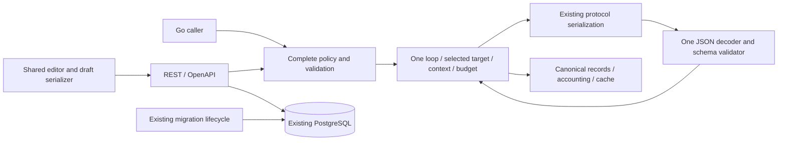

# 1. Retries and repair architecture implementation plan

- Project: Harden LLM, self-hosted Go gateway and Phoenix Trace Studio.
- Document ID: `PLAN-HARDEN-LLM-RECOVERY-001`.
- Version: 2.0.0.
- Date: 2026-09-14.
- Owners: repository maintainer for contracts/cutover; Go maintainer for execution/data; Phoenix maintainer for editors; implementing engineer for evidence.
- Baseline: `dev` at `1770443592a63c85c6e48d5c68d6e573d4b89ea4`.
- Status: implementation in progress on `feat/recovery-policy`; phase results are recorded in Section 11.
- Canonical specifications: `plans/from_utility-llm/harden-llm-self-hosted-implementation-plan.md`, `plans/from_utility-llm/self-hosted-go-stack-spec.md`, `plans/from_utility-llm/harden-llm-self-hosted-test-spec.md` and `plans/from_utility-llm/phoenix-liveview-frontend-spec.md`.

Replace competing retry/repair settings and execution paths with one explicit policy, one selected target, one execution loop and one shared editor. Remove fallback routing, escalation, heuristic JSON repair and compatibility execution paths. Transition existing saved data with one ordinary PostgreSQL migration. This document plans implementation and local certification; it does not authorize production migration/deployment, browser execution or paid provider calls.

## 2. Design consensus and trade-offs

| Topic | Verdict | Decision and repository rationale |
| --- | --- | --- |
| Complete policy | DECISION | `client.go`, `internal/retry/retry.go` and Phoenix currently supply different defaults. Create defaults once in Go; require a complete policy at execution/persistence boundaries. False, zero and an empty retry list retain their explicit meanings. |
| Target selection | DECISION | Remove `BackupProfiles`, repair escalation and their configuration/UI/graph validation. Every attempt uses the initially selected profile/model/endpoint/options; unavailable targets fail within the configured budget. |
| Execution ownership | FOR | Replace `internal/runtime/execute.go`'s nested backup/retry loops and parallel repair/target maps with one loop. Carry repair context in the prepared work that actually survives a transport retry. |
| Structured parsing | DECISION | `internal/schema/schema.go` currently coerces numeric strings, invokes heuristic JSON repair and treats Gemini differently. Use one strict decoder and schema validator; invalid output is explicitly repaired or rejected. |
| Repair payload | FOR | Request the original schema through the existing provider serialization boundary. Delete the metadata envelope that runtime later discards; preserve valid user values and target options. |
| Retry delay | DECISION | Honor 429/503 Retry-After with `max(calculatedBackoff, serverDelay)` and the caller's context. One target needs no origin cooldown registry or eligibility scheduler. |
| Frontend ownership | FOR | Share draft transformation, serializer, controls, help and styles through the existing ProfileWidgetState/component. Go owns semantic validation; the UI owns local input syntax and presentation. |
| Stored data | DECISION | Existing Migrate already locks, transacts and records versions. Use one SQL migration, not an offline converter, resolution manifest, new administrative CLI or retained old-format reader. |
| Historical results | DECISION | ADR-HLLM-018 requires live/history/trace results to share one strict schema. Migrate retired attempt metadata once to result v3; preserve output, targets, accounting and original requests. Do not introduce a second history decoder or executable old-request projection. |
| Extra machinery | AGAINST | No provider chains, retry-original mode, adapters, workflow service, policy service, new evaluation package, custom migration runner, arbitrary case-count target or speculative performance optimization. |

The chosen trade-off is an explicit coordinated breaking change for maintained callers. It reduces supported paths and makes failures explainable. It also removes automatic cross-model availability and implicit JSON salvage; those behaviors are intentionally outside the new contract.

## 3. PRD / stakeholder and system needs

- Problem: displayed controls can differ from execution; valid strings can be changed before validation; repair context can be lost after a transport failure; redundant settings multiply maintenance paths.
- Users: Go/REST consumers, Trace Studio operators and repository maintainers.
- Value/business goals: predictable provider work, faithful structured values, understandable controls and fewer implementation owners.
- Success metrics: zero named policy/identity/value/accounting violations; no budget overruns; complete save/run/cURL agreement; only the specified data-migration changes; deleted competing execution/default/parser/UI paths.
- Scope: recovery policy, current API/data contracts, parser/repair, execution/waiting, canonical diagnostics/cache projection, both editors, ordinary data migration and regression coverage.
- Non-goals: new providers, model selection/failover, independent repair-model settings, workflow infrastructure, schema-language expansion, UI redesign, generic migration/import conversion, browser automation or deployment.
- Dependencies: existing public Go boundary, OpenAPI, provider serializers, profile/credential ownership, PostgreSQL migrations, canonical accounting/cache and test runner.
- Risks: breaking callers/configuration, mixed old/new writers during cutover, malformed saved settings, stale structured cache projections and overstating deterministic evidence.
- Assumptions: calls remain synchronous and context-bounded; owned callers can be updated together; synthetic fixtures are sufficient for implementation; actual deployment/configuration availability is established before operational cutover.

## 4. SRS / canonical requirements

Section 8 defines the detailed data and execution contract. Acceptance criteria here do not imply that implementation has occurred.

| Requirement | Type | Acceptance criteria |
| --- | --- | --- |
| REQ-201 | func | One complete RecoveryPolicy has maxAttempts, retryOn, repairInvalidOutput and backoff. One Go constructor supplies new defaults; one validator rejects missing/partial/invalid policies. Explicit false, zero and empty lists are never replaced by defaults. |
| REQ-202 | reliability | One execution loop uses one immutable selected target and one call-wide budget/context. At most maxAttempts execution slots and model invocations occur; preflight failure consumes none. No fallback, escalation, hidden retry layer or budget reset exists. |
| REQ-203 | data | One decoder/validator preserves valid JSON types and numeric precision for every protocol. No coercion, heuristic salvage, trailing-data acceptance or provider-specific structured parser remains. |
| REQ-204 | func | Invalid structured output either fails or requests repair against the original schema on the selected target. Repair context survives transport retries; initial and repair responses share validation. No retry-original mode or repair metadata envelope remains. |
| REQ-205 | reliability | Only configured transient categories repeat. Backoff honors explicit zero and valid 429/503 Retry-After; cancellation/deadline prevents further dispatch. There is no cooldown registry or target scheduler. |
| REQ-206 | int | Public Go, REST, profiles, client state, bundles and owned callers use one current complete policy. Existing profiles response supplies defaults. Current run/history/trace results share result v3; strict wire examples and frontend decoders agree. |
| REQ-207 | func | Both editors share one draft transformation, serializer, field/help component and styles. Save/reload/run/cURL preserve the same policy. Invalid controls have useful errors; the existing clickable information control remains wired. |
| REQ-208 | data | One standard migration converts existing mutable settings and retired result metadata transactionally. Original requests, output, target snapshots, accounting, credential ciphertext, owners and unrelated data are preserved. Old imports/reruns fail clearly; no runtime converter, compatibility aliases or silent preference reset exists. |
| REQ-209 | data | Ordered canonical records derive directly from dispatched work. Provider-used state, repair identity, result producer and accounting remain accurate. Cache hits invoke neither search nor model; recovery settings remain outside semantic cache identity and the structured projection changes explicitly. |
| REQ-210 | security | Existing owner isolation, endpoint validation, credential handling and redaction remain intact. Migration touches no credential material; tests use synthetic/local fixtures. Prior model output cannot select another target or alter tool permissions. |
| REQ-211 | nfr | Competing recovery paths and duplicated logic/styles are deleted before completion. Same-command failing/passing evidence, canonical test tags, explicit parity deviations and complete traceability support the final implementation. |
| REQ-212 | perf | First-attempt success performs one model invocation and cache hits none. Work is bounded by the existing context and configured budget. Existing runners/resource limits are reused; no arbitrary benchmark corpus, timing SLA or new test framework is introduced. |

Errors and telemetry use the existing error envelope and canonical record. Invalid configuration fails before dispatch with a field path. Authentication, refusal, cancellation and overall deadline remain terminal. Attempt number, operation, target, provider-used state, failure and wait come from current dispatched work; logs contain bounded categories/identifiers and redacted data, not credentials or unbounded prompt/output copies.



```text
C4 context: operator and Go/REST consumer -> Harden LLM -> selected provider
Containers: Phoenix --REST/OpenAPI--> Go gateway -> PostgreSQL/artifact storage
Components: public Go policy boundary -> runtime loop -> provider serialization
                                             |              |
                                             +-- shared validator
                                             +-- canonical record/accounting/cache
Data change: existing PostgreSQL Migrate -> one SQL migration
Ownership: Phoenix uses REST; gateway uses public Go; no new service or adapter layer.
```

## 5. Iterative implementation and test plan

### 5.1 Strategy and lifecycle controls

- Execute P00–P03 sequentially; one subtask at a time. A RED step succeeds by producing the expected failing assertion. Compilation, setup failure and zero matched cases do not count.
- Work on a feature branch from current dev. Push verified phase checkpoints; keep preview deployment disabled until application, migration and configuration formats are aligned. No main/production promotion is part of this plan.
- Every GREEN uses the same TEST IDs and exact commands as its RED. Existing passing assertions remain holdouts; changes to their intended oracle require the recorded contract decision, not an attempt to hide failure.
- Apply `gofmt` to changed Go files and `mix format` to changed Elixir files; use the pinned toolchain from Section 9. Execute the broad fast gate at coherent implementation checkpoints, without rerunning passed suites merely to collect duplicate evidence.
- Evidence is the code/specification diff, command output and Section 11 log tied to a source SHA. No new evidence manifest, evaluation framework or runner task is required.
- Each phase records requirement links, design/code surfaces, verification output, validation purpose, source/configuration checkpoint, risks, assumptions and unresolved operational decisions. Checkpoints occur at phase boundaries, not as coding subtasks.
- Standards tailoring: this is standards-informed lifecycle documentation, not ISO/IEEE/FAA compliance or safety-critical certification. Additional assurance planning would be required for safety-critical use.
- Planning metrics are observable scope/exit conditions. Do not invent confidence, robustness, complexity or debt percentages, statistical intervals from a single run, or a pre-implementation “No refactor needed” verdict. Consolidation is explicit and its actual result is recorded.
- Compute controls: `branch_limits: 1` implementation alternative; `reflection_passes: 1` consolidation review per phase; `early_stop%: 100` of dependent work stops on a failed acceptance condition. These are working limits, not new software.
- Proceed when the phase's required cases/evals pass and evidence is linked. Suspend dependent work for unstable tests, missing external contracts or ambiguous persisted meaning. Resume after the cause is resolved with unchanged acceptance controls, or a documented ADR changes scope/thresholds.

| Risk | Trigger | Mitigation |
| --- | --- | --- |
| Mixed writable formats | Old caller/service remains during cutover | Prepare current callers/configuration, stop old writers, use the ordinary migration, then start matching components. |
| Malformed saved data | Invalid types/ranges | Abort the migration transaction with document identity/field; correct that configuration explicitly before retrying. |
| Lost execution identity | Repair receives a transient failure | Carry operation/request/target together and assert the captured dispatch sequence. |
| Semantic data changes | Numeric strings, salvage or old cached projection | Strict shared validation, value-preservation cases and one explicit structured projection version. |
| Scope expansion | New converter, scheduler, options or test infrastructure appears | Stop the affected step and compare it with the deletion inventory and non-goals. |

### Phase P00: The contract and deletion scope are fixed

- Phase goal: Record one agreed implementation target with executable acceptance controls.
- Scope/objectives: REQ-201 through REQ-212; contract/specification changes and the inventory needed for the coordinated cutover.
- Impacted surfaces: This plan; `docs/adr/ADR-HLLM-020-recovery-policy-and-execution.md` (create); `docs/adr/README.md`; the four canonical specifications listed in Section 1; `fixtures/parity/manifest.json`.
- Lifecycle evidence: requirements = the scope above; design/code = listed surfaces and ADR; verification = subtask commands; validation purpose = Confirm the design covers actual callers and stored formats without introducing another execution or compatibility path. Configuration checkpoint = phase-end source SHA, tool versions and fixture/migration identity; risks/assumptions = Owned callers and operator configuration must be accounted for before the breaking contract is deployed.
- Phase metrics: Confidence and robustness: pending executable evidence. Internal interactions: public Go, runtime, gateway, storage, Phoenix. External interactions: current callers/configuration only. Complexity: one selected target; feature creep: excluded features stay excluded; debt: a concrete deletion inventory. YAGNI: no speculative infrastructure. MoSCoW: Must. Scope: repository-wide contract. Architectural changes planned: one policy and one execution loop, zero new services.

- `P00.S01 Inventory recovery owners and stored formats`
  - Action: Inspect current policy/default/parser/routing/result owners and every in-repository caller; record exact removed symbols and affected external formats in ADR-HLLM-020. Confirm Section 8 against version-1 documents and canonical result v2.
  - Why now: The cutover must remove actual competing paths rather than add a new path beside them.
  - Files/surfaces: `types.go`; `client.go`; `profiles.go`; `internal/retry/retry.go`; `internal/runtime/execute.go`; `internal/schema/schema.go`; `internal/gateway/resources.go`; `api/openapi.yaml`; `frontend/lib/harden_llm_web/profile_widget_state.ex`.
  - Requirement link: REQ-201 through REQ-212.
  - Verification link: TEST-201.
  - Verification mode: VERIFY.
  - Command/procedure: N/A — bounded source inspection of the listed owners; write the deletion/caller inventory into the ADR.
  - Expected result: Every behavior and stored format has one named owner; any contradiction in Section 8 is resolved before implementation.
  - Evidence produced: ADR inventory and requirement links.
  - Stop/escalate condition: An external caller or stored format cannot be identified without expanding repository scope.
  - Unlocks: P00.S02.

- `P00.S02 Record the contract and register acceptance cases`
  - Action: Create ADR-HLLM-020, update canonical specs/catalogs and register intentional parity deviations. Add plan test tags to existing gate files where required; keep the existing runner selection unchanged.
  - Why now: The new assertions need an explicit contract and recognized traceability before implementation.
  - Files/surfaces: P00 document surfaces; `internal/testkit/static_traceability_test.go`; `internal/testkit/test_tier_policy_test.go`; `internal/testkit/release_gate_test.go`.
  - Requirement link: REQ-201 through REQ-212.
  - Verification link: TEST-201.
  - Verification mode: VERIFY.
  - Command/procedure: `make test-static`
  - Expected result: Specification/static checks pass; decisions match Sections 2, 4 and 8.
  - Evidence produced: Static output and reviewed specification diff.
  - Stop/escalate condition: An acceptance threshold or ownership decision is still ambiguous.
  - Unlocks: Phase exit.

Exit: all phase assertions/evaluations pass, lifecycle evidence is recorded and the deletion/scope inventory is current. A missing contract decision escalates; an acceptance condition requiring expanded scope stops dependent work.

### Phase P01: One policy drives one execution loop and both editors

- Phase goal: Implement the complete current behavior without parallel retry, repair or UI paths.
- Scope/objectives: REQ-201 through REQ-207 and REQ-209 through REQ-212; all application contract changes land together on the feature branch.
- Impacted surfaces: `types.go`; `client.go`; `profiles.go`; `internal/profiles/profiles.go`; `internal/retry/retry.go`; `internal/runtime/execute.go`; `internal/runtime/repair.go`; `internal/providers/payload.go`; `internal/providers/router.go`; `internal/schema/schema.go`; `internal/gateway/resources.go`; `internal/gateway/httpapi/resources.go`; `api/openapi.yaml`; `frontend/lib/harden_llm_web/profile_widget_state.ex`; `frontend/lib/harden_llm_web/profile_defaults.ex`; `frontend/lib/harden_llm_web/live/profile_widget_component.ex`; `frontend/lib/harden_llm_web/live/profiles_live.ex`; `frontend/lib/harden_llm_web/live/workspace_live.ex`; `frontend/lib/harden_llm_web/harden_api.ex`.
- Lifecycle evidence: requirements = the scope above; design/code = listed surfaces and ADR; verification = subtask commands; validation purpose = Prove actual requests, returned values and user-visible policy agree, including the reproduced repair -> 503 -> repair-success defect. Configuration checkpoint = phase-end source SHA, tool versions and fixture/migration identity; risks/assumptions = Backend/frontend/storage formats change together; this phase is not deployable against an unmigrated database.
- Phase metrics: Confidence and robustness: measured by named deterministic cases. Internal interactions: one shared policy, runtime, provider boundary and editor state. External interactions: unchanged provider protocols. Complexity: one loop; feature creep: zero additional routing modes; debt: old active paths removed. YAGNI: existing components only. MoSCoW: Must. Scope: cross-component. Architectural changes: the planned policy and loop; no new framework.

- `P01.S01 Add failing value and repair-payload cases`
  - Action: Add TEST-203 and TEST-204 assertions at existing schema and public client boundaries, including numeric strings and the original-schema repair response.
  - Why now: These reproduce semantic data changes and the unnecessary repair envelope before changing implementation.
  - Files/surfaces: `internal/schema/schema_test.go`; `client_test.go`.
  - Requirement link: REQ-203, REQ-204, REQ-210.
  - Verification link: TEST-203, TEST-204.
  - Verification mode: RED.
  - Command/procedure: `go test ./internal/schema -run '^TestRecovery' -count=1 -timeout=60s -v`; `go test . -run '^TestRecovery' -count=1 -timeout=60s -v`
  - Expected result: Runnable assertions fail on coercion, salvage or repair-envelope behavior; failures are not compilation/setup failures.
  - Evidence produced: Named failing cases and redacted captured payloads.
  - Stop/escalate condition: The failure does not exercise the real parser/provider boundary.
  - Unlocks: P01.S02.

- `P01.S02 Use one decoder and original-schema repair`
  - Action: Remove numeric-string conversion, heuristic JSON repair and the Gemini-specific parser branch. Use the same decoder/validator for initial and repair responses; request the original schema through existing protocol serialization and remove envelope extraction.
  - Why now: P01.S01 supplies failing behavioral coverage.
  - Files/surfaces: `internal/schema/schema.go`; `internal/runtime/repair.go`; `internal/providers/payload.go`; related dependency entries and parity fixtures.
  - Requirement link: REQ-203, REQ-204, REQ-210.
  - Verification link: TEST-203, TEST-204.
  - Verification mode: GREEN.
  - Command/procedure: `go test ./internal/schema -run '^TestRecovery' -count=1 -timeout=60s -v`; `go test . -run '^TestRecovery' -count=1 -timeout=60s -v`
  - Expected result: The same assertions pass; valid values are preserved and invalid values enter explicit repair or fail.
  - Evidence produced: Implementation diff and matching passing output.
  - Stop/escalate condition: A provider protocol requires changing the supported schema contract.
  - Unlocks: P01.S03.

- `P01.S03 Add failing policy and execution cases`
  - Action: Add TEST-202, TEST-205, TEST-206 and TEST-207. Rename repair_backup_test.go to repair_test.go while retaining still-relevant assertions. Capture the repair transport-retry regression, current wire versions and rejection of removed fields.
  - Why now: The policy, dispatch identity and REST changes must be covered before their coordinated replacement.
  - Files/surfaces: `client_test.go`; `internal/runtime/repair_test.go`; `internal/retry/retry_test.go`; `internal/gateway/run_validation_test.go`; `internal/gateway/openapi_contract_test.go`.
  - Requirement link: REQ-201, REQ-202, REQ-204, REQ-205, REQ-206, REQ-209, REQ-210, REQ-212.
  - Verification link: TEST-202, TEST-205, TEST-206, TEST-207.
  - Verification mode: RED.
  - Command/procedure: `go test . -run '^TestRecovery' -count=1 -timeout=60s -v`; `go test ./internal/runtime -run '^TestRecovery' -count=1 -timeout=60s -v`; `go test ./internal/retry -run '^TestRecovery' -count=1 -timeout=60s -v`; `go test ./internal/gateway -run '^TestRecoveryContract' -count=1 -timeout=60s -v`
  - Expected result: Behavioral assertions fail for the intended missing behavior. Minimal inert type declarations may permit compilation; no test-only behavior replaces the production boundary.
  - Evidence produced: Failing contract, dispatch, accounting and wait cases.
  - Stop/escalate condition: A failure comes only from missing declarations, zero matched cases or unavailable infrastructure.
  - Unlocks: P01.S04.

- `P01.S04 Replace recovery ownership throughout the backend`
  - Action: Introduce the complete policy, sole default constructor and validator; expose the public type without duplicating an internal policy model. Replace nested retry/backup loops with Section 8's loop. Update all Go callers, profile/state/bundle/run contracts, current result v3 and strict OpenAPI examples. Serve defaults in the existing profiles response and remove old routing/policy fields and builders.
  - Why now: All backend behavioral changes now have failing coverage; a coordinated edit avoids temporary adapters.
  - Files/surfaces: P01 backend surfaces; existing gateway serializers/decoders and in-repository callers identified in P00.
  - Requirement link: REQ-201, REQ-202, REQ-204, REQ-205, REQ-206, REQ-209, REQ-210, REQ-212.
  - Verification link: TEST-202, TEST-205, TEST-206, TEST-207.
  - Verification mode: GREEN.
  - Command/procedure: `go test . -run '^TestRecovery' -count=1 -timeout=60s -v`; `go test ./internal/runtime -run '^TestRecovery' -count=1 -timeout=60s -v`; `go test ./internal/retry -run '^TestRecovery' -count=1 -timeout=60s -v`; `go test ./internal/gateway -run '^TestRecoveryContract' -count=1 -timeout=60s -v`
  - Expected result: One complete policy reaches one loop; waits and records describe the dispatched work; all focused cases pass.
  - Evidence produced: Backend/contract diff and matching passing output.
  - Stop/escalate condition: Keeping compilation or behavior working would require a new compatibility adapter or another retry layer.
  - Unlocks: P01.S05.

- `P01.S05 Add failing shared-editor and wire-decoding cases`
  - Action: Tag the new frontend cases :recovery. Assert backend-supplied defaults, a common draft serializer, save/reload/run/cURL agreement, inline errors, removed routing controls, strict result v3 and an explicit error when an old request is rerun.
  - Why now: Backend examples now define the actual current wire contract for both editors.
  - Files/surfaces: The six frontend test files listed under TEST-209.
  - Requirement link: REQ-201, REQ-206, REQ-207, REQ-208, REQ-209.
  - Verification link: TEST-209.
  - Verification mode: RED.
  - Command/procedure: `(cd frontend && mix test --only recovery --seed 104729)`
  - Expected result: Both editor entrypoints demonstrate the missing behavior with element-driven events and validated wire fixtures.
  - Evidence produced: Failing frontend assertions with WEB aliases.
  - Stop/escalate condition: A stub response disagrees with the backend/OpenAPI examples.
  - Unlocks: P01.S06.

- `P01.S06 Share policy controls and serialization`
  - Action: Put recovery draft parsing/serialization in ProfileWidgetState and render the fields/help once through the existing shared component. Load backend defaults, preserve explicit false/zero/empty values, use the same serializer at save/run/cURL boundaries, update strict decoders and remove fallback/escalation/parse-retry controls and duplicated helpers/styles.
  - Why now: P01.S05 supplies the frontend regression oracle.
  - Files/surfaces: P01 frontend surfaces and the existing shared stylesheet owning these controls.
  - Requirement link: REQ-201, REQ-206, REQ-207, REQ-208, REQ-209.
  - Verification link: TEST-209.
  - Verification mode: GREEN.
  - Command/procedure: `(cd frontend && mix test --only recovery --seed 104729)`
  - Expected result: Both editors agree with backend policy; clickable help remains wired; no frontend semantic defaults or history converter exists.
  - Evidence produced: Frontend diff and matching passing output.
  - Stop/escalate condition: The design requires a second serializer or provider policy logic in Phoenix.
  - Unlocks: P01.S07.

- `P01.S07 Consolidate recovery code and fixtures`
  - Action: Remove leftover wrappers, state maps, duplicate controls and now-unused dependencies from the implemented paths. Align intentional parity fixtures and formatting without changing accepted assertions.
  - Why now: The full behavior is green, so consolidation can be judged against its public invariants.
  - Files/surfaces: P01 surfaces; `go.mod`; `go.sum`; existing affected parity fixtures.
  - Requirement link: REQ-201 through REQ-207, REQ-209 through REQ-212.
  - Verification link: TEST-202, TEST-203, TEST-205, TEST-206, TEST-207, TEST-209.
  - Verification mode: REFACTOR.
  - Command/procedure: `go test . -run '^TestRecovery' -count=1 -timeout=60s -v`; `go test ./internal/schema -run '^TestRecovery' -count=1 -timeout=60s -v`; `go test ./internal/runtime -run '^TestRecovery' -count=1 -timeout=60s -v`; `go test ./internal/retry -run '^TestRecovery' -count=1 -timeout=60s -v`; `go test ./internal/gateway -run '^TestRecoveryContract' -count=1 -timeout=60s -v`; `(cd frontend && mix test --only recovery --seed 104729)`
  - Expected result: Focused assertions remain green; the source inventory has one owner per behavior.
  - Evidence produced: Consolidation diff, formatting output and focused results.
  - Stop/escalate condition: An assertion would need weakening to make the consolidation pass.
  - Unlocks: P01.S08.

- `P01.S08 Measure integrated recovery invariants`
  - Action: Run the broad deterministic gate and record EVAL-201 from its actual cases and task results; do not create a new evaluation package or duplicate test matrix.
  - Why now: Focused backend and frontend changes are integrated and ready for the ordinary coding-loop gate.
  - Files/surfaces: Existing test suites and `test/test-tiers.json` selection, unchanged.
  - Requirement link: REQ-201 through REQ-207, REQ-209 through REQ-212.
  - Verification link: TEST-210, EVAL-201.
  - Verification mode: MEASURE.
  - Command/procedure: `make test-fast`
  - Expected result: All selected tasks pass with zero named invariant violations; timings are observations, not model-quality claims.
  - Evidence produced: Fast-gate output, EVAL-201 results and source identity.
  - Stop/escalate condition: Any required task fails or is skipped.
  - Unlocks: Phase exit.

Exit: all phase assertions/evaluations pass, lifecycle evidence is recorded and the deletion/scope inventory is current. A missing contract decision escalates; an acceptance condition requiring expanded scope stops dependent work.

### Phase P02: Existing saved data supports the single current contract

- Phase goal: Perform the finite data transition through the repository's existing PostgreSQL migration mechanism.
- Scope/objectives: REQ-206, REQ-208, REQ-209 and REQ-210; stored profiles/state and canonical result metadata, plus current external configuration preparation.
- Impacted surfaces: `internal/postgres/migrations/0006_recovery_policy.sql` (create); `internal/postgres/repository_test.go`; `internal/gateway/resource_routes_test.go`; `internal/postgres/store.go` existing Migrate/Ready behavior; `internal/gateway/resources.go`; `cmd/harden-llm-gateway/shared_profiles.go` existing sync-profiles entrypoint; `docs/preview-environments.md`.
- Lifecycle evidence: requirements = the scope above; design/code = listed surfaces and ADR; verification = subtask commands; validation purpose = Prove the real database accepts only the current writable format after one transactional conversion without changing execution facts or credentials. Configuration checkpoint = phase-end source SHA, tool versions and fixture/migration identity; risks/assumptions = Old writers and old external configuration cannot remain active across the cutover; original omitted values cannot reveal preferences that were never persisted.
- Phase metrics: Confidence and robustness: real transaction, ownership and restart assertions. Internal interactions: JSONB documents and existing migration lifecycle. External interactions: operator configuration files only. Complexity: one SQL migration; feature creep: no converter service/CLI; debt: no live legacy reader. YAGNI: only existing saved formats. MoSCoW: Must. Scope: data and cutover configuration. Architectural additions: zero.

- `P02.S01 Add failing migration preservation cases`
  - Action: Extend repository_test.go with the version-5 fixtures in TEST-208, asserting exact Section 8 transformations, unchanged independent data and transactional rejection. Extend existing resource-route cases for backend defaults and canonical result read-back. Reuse PostgresLease and Store.Migrate.
  - Why now: Cheap current-format cases already exist; a real transaction is the distinct boundary that requires integration coverage.
  - Files/surfaces: `internal/postgres/repository_test.go`; `internal/gateway/resource_routes_test.go`.
  - Requirement link: REQ-206, REQ-208, REQ-209, REQ-210.
  - Verification link: TEST-208.
  - Verification mode: RED.
  - Command/procedure: `make test-integration`
  - Expected result: Runnable database assertions fail because the new migration/transformation is absent; service setup succeeds.
  - Evidence produced: Failing migration assertions and redacted fixture comparison.
  - Stop/escalate condition: The runner cannot lease its owned database, or the failure is only service startup.
  - Unlocks: P02.S02.

- `P02.S02 Migrate saved policies and retired result metadata`
  - Action: Add one embedded SQL migration implementing Section 8. Use existing advisory-lock/transaction/version handling; update expected migration versions. Remove the result-read nullability normalizer once the migration canonicalizes stored attempts.
  - Why now: P02.S01 protects both transformed and preserved data; no separate converter is needed.
  - Files/surfaces: `internal/postgres/migrations/0006_recovery_policy.sql`; `internal/postgres/repository_test.go`; `internal/gateway/resource_routes_test.go`; `internal/gateway/resources.go`.
  - Requirement link: REQ-206, REQ-208, REQ-209, REQ-210.
  - Verification link: TEST-208.
  - Verification mode: GREEN.
  - Command/procedure: `make test-integration`
  - Expected result: All transformation, atomicity, ownership and repeated/concurrent migration assertions pass through the normal startup mechanism.
  - Evidence produced: SQL diff and matching integration output.
  - Stop/escalate condition: A document needs a guessed semantic value or a credential/history-content rewrite beyond Section 8.
  - Unlocks: P02.S03.

- `P02.S03 Document the coordinated configuration cutover`
  - Action: Document the ordered stop-writers, database migration, current-format configuration and matching-service startup procedure. Update existing synthetic shared-profile examples and import assertions; retain sync-profiles for its existing provisioning purpose. Remove any proposed converter commands or compatibility instructions.
  - Why now: The tested data migration makes a concrete operational procedure possible.
  - Files/surfaces: `docs/preview-environments.md`; existing trusted shared-profile examples/tests identified in P00; current import/decoder surfaces.
  - Requirement link: REQ-206, REQ-208, REQ-210, REQ-211.
  - Verification link: TEST-207, TEST-201.
  - Verification mode: REFACTOR.
  - Command/procedure: `go test ./internal/gateway -run '^TestRecoveryContract' -count=1 -timeout=60s -v`; `make test-static`
  - Expected result: Only current configuration/import formats are documented and accepted; no automatic deployment or data mutation is performed by this subtask.
  - Evidence produced: Cutover procedure, current-format examples and passing contract/static output.
  - Stop/escalate condition: An owned external configuration cannot be prepared in the current format before deployment.
  - Unlocks: P02.S04.

- `P02.S04 Measure migration lifecycle integrity`
  - Action: Run the existing integration race task and record EVAL-202, using the same TEST-208 assertions under the race detector.
  - Why now: The ordinary integration run is green; concurrency and migration lifecycle are the remaining distinct storage boundary.
  - Files/surfaces: `internal/postgres/repository_test.go` and existing integration race runner.
  - Requirement link: REQ-208, REQ-209, REQ-210.
  - Verification link: TEST-208, EVAL-202.
  - Verification mode: MEASURE.
  - Command/procedure: `make test-integration-race`
  - Expected result: No race reports or preservation/atomicity violations; no new runner task or resource lock is introduced.
  - Evidence produced: Existing race-task log and EVAL-202 results.
  - Stop/escalate condition: Any race, partial conversion or ownership regression occurs.
  - Unlocks: Phase exit.

Exit: all phase assertions/evaluations pass, lifecycle evidence is recorded and the deletion/scope inventory is current. A missing contract decision escalates; an acceptance condition requiring expanded scope stops dependent work.

### Phase P03: The final implementation has one supported path and passing gates

- Phase goal: Close the deletion inventory and certify the coordinated implementation without deploying it.
- Scope/objectives: REQ-201 through REQ-212; final consolidation, cross-system verification and reviewable evidence.
- Impacted surfaces: All changed application/specification/test files; this plan's execution log; existing fast/static/release gates.
- Lifecycle evidence: requirements = the scope above; design/code = listed surfaces and ADR; verification = subtask commands; validation purpose = Confirm the final branch contains the chosen architecture, the necessary data transition and reproducible results. Configuration checkpoint = phase-end source SHA, tool versions and fixture/migration identity; risks/assumptions = Local certification cannot establish deployed behavior, browser layout or live-model repair quality.
- Phase metrics: Confidence and robustness: final command results and deletion inventory. Internal interactions: final integrated system. External interactions: none beyond existing local test services. Complexity: one current implementation; feature creep/debt: every introduced path has an in-scope purpose. YAGNI: no deferred cleanup or unused extension points. MoSCoW: Must. Scope: release review. Architectural additions: zero.

- `P03.S01 Close the deletion and ownership inventory`
  - Action: Compare the final source with P00's inventory; delete remaining recovery aliases, backup/escalation scheduling, retry-original mode, parser salvage, repair envelopes, duplicated state/defaults/styles and unused dependencies. Preserve unrelated features that happen to use the word fallback.
  - Why now: All behavioral and migration cases exist to protect final structural cleanup.
  - Files/surfaces: All changed source, fixtures and dependency files.
  - Requirement link: REQ-201 through REQ-212.
  - Verification link: TEST-210.
  - Verification mode: REFACTOR.
  - Command/procedure: `make test-fast`
  - Expected result: The broad fast gate passes; inventory confirms one policy, loop, parser/validator, serializer and control implementation, with zero compatibility execution paths.
  - Evidence produced: Final diff, completed deletion inventory and fast-gate output.
  - Stop/escalate condition: Cleanup would remove an unrelated feature or require weakening a current assertion.
  - Unlocks: P03.S02.

- `P03.S02 Certify the integrated implementation`
  - Action: Run the existing browser-free release gate and record EVAL-203 against the final source and configuration. Investigate a failed boundary by adding its lowest-sufficient regression before changing behavior.
  - Why now: The change crosses execution, REST, frontend and storage; the release gate adds the real service/lifecycle boundaries.
  - Files/surfaces: Existing release tasks; all tests in Section 7.
  - Requirement link: REQ-202, REQ-206, REQ-208 through REQ-212.
  - Verification link: TEST-211, EVAL-203.
  - Verification mode: MEASURE.
  - Command/procedure: `make test-release`
  - Expected result: All selected tasks pass with no disabled cases; evidence states exactly which local boundaries ran.
  - Evidence produced: Release output, EVAL-203 results, source SHA and tool/service identities.
  - Stop/escalate condition: A required service boundary fails or the proposed fix would expand scope.
  - Unlocks: P03.S03.

- `P03.S03 Finalize traceability and the review checkpoint`
  - Action: Fill the execution log/RTM with actual results, unresolved operational prerequisites and the final deletion inventory; validate documentation/whitespace and create the phase-boundary review checkpoint.
  - Why now: Implementation and certification evidence are complete enough for review.
  - Files/surfaces: This plan, canonical catalogs, ADR-HLLM-020 and changed documentation.
  - Requirement link: REQ-211.
  - Verification link: TEST-201.
  - Verification mode: VERIFY.
  - Command/procedure: `make test-static`; `git diff HEAD --check`
  - Expected result: Traceability and whitespace checks pass; operational readiness is distinguished from deployment.
  - Evidence produced: Reviewable checkpoint, completed log and explicit evidence limits.
  - Stop/escalate condition: A requirement lacks passing evidence or an untested change appeared after certification.
  - Unlocks: Phase exit.

Exit: all phase assertions/evaluations pass, lifecycle evidence is recorded and the deletion/scope inventory is current. A missing contract decision escalates; an acceptance condition requiring expanded scope stops dependent work.

## 6. Evaluations

Evaluations summarize existing executable assertions, not a second implementation or synthetic model-quality benchmark. Named adversarial cases belong in the owning Go tests. Record actual case/task totals and elapsed time; do not target arbitrary counts or rerun a passing gate solely for statistics.

```yaml
evaluations:
  - id: EVAL-201
    purpose: dev
    tests: [TEST-202, TEST-203, TEST-204, TEST-205, TEST-206, TEST-207, TEST-209, TEST-210]
    command: make test-fast
    metrics: [policy_disagreements, valid_value_changes, identity_errors, budget_overruns, failed_tasks, elapsed_seconds]
    thresholds: {policy_disagreements: 0, valid_value_changes: 0, identity_errors: 0, budget_overruns: 0, failed_tasks: 0}
    seeds: {exunit: 104729, go: fixed_named_cases_and_injected_clock_randomness}
    runtime_budget: existing fast task limits; hosted job envelope 20 minutes
  - id: EVAL-202
    purpose: adversarial
    tests: [TEST-208]
    command: make test-integration-race
    metrics: [unexpected_data_changes, partial_migrations, ownership_errors, race_reports, elapsed_seconds]
    thresholds: {unexpected_data_changes: 0, partial_migrations: 0, ownership_errors: 0, race_reports: 0}
    seeds: {data: fixed_version_5_documents_with_test_owned_identifiers}
    runtime_budget: existing integration race task limits; hosted integration envelope 90 minutes
  - id: EVAL-203
    purpose: holdout
    tests: [TEST-211]
    command: make test-release
    metrics: [failed_tasks, skipped_required_tasks, elapsed_seconds]
    thresholds: {failed_tasks: 0, skipped_required_tasks: 0}
    seeds: {data: existing_release_fixtures}
    runtime_budget: existing release task limits; hosted job envelope 180 minutes
```

Threshold changes require an ADR. Passing deterministic cases establishes the specified invariants; it does not measure a live model's likelihood of producing a correct repair.

## 7. Tests

### 7.1 Test inventory

- Go `testing`/`httptest`: root `*_test.go` and `internal/**/*_test.go`; existing `make test-unit`, `make test-parity`, `make test-api` and focused `go test` commands below.
- PostgreSQL/Garage integration: existing integration build tags, PostgresLease and `scripts/run-test-tier.mjs` through `make test-integration` and `make test-integration-race`. Use the runner to provision services/leases.
- Phoenix ExUnit/ConnCase/LiveViewTest/Req.Test: `frontend/test/**/*_test.exs`; existing `mix test` and its built-in `--only recovery` tag selection added to the cases, not a new runner.
- Plain Node `node:test` and static/parity checks: existing `scripts/test/*.mjs` and `internal/testkit/*_test.go` through `make test-fast`/`make test-static`.
- Existing `make test-release` provides browser-free cross-system certification. Browser opt-in commands exist but are outside this plan.
- New TEST IDs below label assertions in existing files; the only test-file move is `repair_backup_test.go` to `repair_test.go`. Changed tests carry their TEST ID plus `SPEC-HARDEN-LLM-SELF-HOSTED-TESTS-001`; frontend cases also carry the listed WEB alias and `SPEC-HARDEN-LLM-PHOENIX-LIVEVIEW-001`. Retain existing relevant canonical tags.

### 7.2 Test suites overview

| Suite | Purpose / runner | Command | Runtime budget | When |
| --- | --- | --- | --- | --- |
| Unit | Go, ExUnit, LiveView and plain Node invariants | `make test-fast` | Existing 20-minute hosted envelope | Coding checkpoints / CI |
| Integration | Actual storage/API lifecycle via existing runner | `make test-integration`; `make test-integration-race` | Existing integration task limits / 90-minute hosted envelope | Storage changes / CI |
| E2E | Existing browser-free cross-system release tasks | `make test-release` | Existing 180-minute hosted envelope | Final coordinated implementation |
| Perf | Invocation/budget bounds in runtime assertions; no separate benchmark | `go test ./internal/runtime -run '^TestRecovery' -count=1 -timeout=60s -v` | 60-second package timeout | Coding checkpoints / CI |
| Data Drift | Exact migration fixture preservation in repository tests | `make test-integration` | Same integration run; not a second suite | Data migration / CI |
| Static | Existing specification, parity and source policy checks | `make test-static` | Existing gate limits; record duration | Contract/docs checkpoints / CI |

### 7.3 Test definitions

All focused `TestRecovery...` functions and frontend tags below are added by the indicated RED step before their first invocation. Required handlers/integration assertions remain in the existing broad suites.

- `TEST-201 — Existing specification and static gate`
  - Type / verifies: static; REQ-211.
  - Location: `internal/testkit/static_traceability_test.go`.
  - Command: `make test-static`
  - Fixtures/data: Canonical catalogs, parity manifest and existing static checks; add only traceability tags where needed.
  - Deterministic controls: Existing runner; no new plan linter or fixture framework.
  - Pass criteria: Catalog links and existing static assertions pass; no unrecorded parity deviation.
  - Expected runtime: Existing local gate; record wall time, without introducing a timing threshold.

- `TEST-202 — Complete public policy`
  - Type / verifies: unit; REQ-201, REQ-206.
  - Location: `client_test.go`.
  - Command: `go test . -run '^TestRecovery' -count=1 -timeout=60s -v`
  - Fixtures/data: Add TestRecoveryPolicy: complete defaults, omitted/partial/null policy, unknown categories, duplicate categories, empty retryOn, explicit false, zero delays, maxAttempts 1 and 10, and invalid limits.
  - Deterministic controls: Local client/provider fixtures; no credentials or public network.
  - Pass criteria: One default constructor and validator serve current callers; explicit values survive; invalid input makes zero provider calls.
  - Expected runtime: 60-second package timeout; report observed duration.

- `TEST-203 — Strict value-preserving structured output`
  - Type / verifies: unit; REQ-203.
  - Location: `internal/schema/schema_test.go`.
  - Command: `go test ./internal/schema -run '^TestRecovery' -count=1 -timeout=60s -v`
  - Fixtures/data: Add TestRecoveryValues: postal codes, numeric string enums, large integers, decimals, nested arrays, null, trailing data, fenced JSON, malformed JSON and schema mismatches.
  - Deterministic controls: Fixed inline JSON and schemas; existing decoder and validator boundary.
  - Pass criteria: Valid JSON values retain their types and precision; invalid syntax/schema fails without coercion or heuristic salvage.
  - Expected runtime: 60-second package timeout; report observed duration.

- `TEST-204 — Original-schema repair across supported protocols`
  - Type / verifies: unit; REQ-204, REQ-210.
  - Location: `client_test.go`.
  - Command: `go test . -run '^TestRecovery' -count=1 -timeout=60s -v`
  - Fixtures/data: Add TestRecoveryRepairPayload using existing local HTTP/TLS fixtures for chat-completions, responses, gemini-generate-content and anthropic-messages; capture initial/repair requests and direct schema-valid responses.
  - Deterministic controls: Test-owned servers, fixed schema/output, no live keys; use the real provider serialization path.
  - Pass criteria: Repair preserves the selected target/options, requests the original schema, treats prior output as data and returns the direct validated value without a repair metadata envelope.
  - Expected runtime: 60-second package timeout; report observed duration.

- `TEST-205 — Bounded execution and canonical facts`
  - Type / verifies: unit; REQ-202, REQ-204, REQ-209, REQ-212.
  - Location: `internal/runtime/repair_test.go`.
  - Command: `go test ./internal/runtime -run '^TestRecovery' -count=1 -timeout=60s -v`
  - Fixtures/data: Rename existing repair_backup_test.go in P01.S03 and add TestRecoveryExecution: initial success; invalid output -> repair 503 -> repair success; repeated invalid repairs; exhausted budget; cancellation; prerequisite failure; cache hit; changed structured projection.
  - Deterministic controls: Existing runtime stubs, injected waits/randomness, fixed cache producers and counting dispatchers; no wall-clock sleeps.
  - Pass criteria: No more than maxAttempts slots or model invocations; all calls use the selected target; repair identity survives transport retries; records match dispatched work; cache hit invokes neither search nor model; result/provider accounting remain distinct.
  - Expected runtime: 60-second package timeout; report observed duration.

- `TEST-206 — Explicit retry categories and waiting`
  - Type / verifies: unit; REQ-201, REQ-205.
  - Location: `internal/retry/retry_test.go`.
  - Command: `go test ./internal/retry -run '^TestRecovery' -count=1 -timeout=60s -v`
  - Fixtures/data: Add TestRecoveryBackoff: every enabled/disabled category, all disabled, zero delays, cap/jitter boundaries, Retry-After on 429/503, malformed/past header, deadline before dispatch and cancellation during wait.
  - Deterministic controls: Injected clock, random source and waiter; local header parsing fixtures.
  - Pass criteria: Only listed transient categories repeat; valid server delay is never capped below its minimum; no wait or dispatch escapes context cancellation/deadline.
  - Expected runtime: 60-second package timeout; report observed duration.

- `TEST-207 — Current REST and persisted-document contract`
  - Type / verifies: unit; REQ-201, REQ-206, REQ-208, REQ-209, REQ-210.
  - Location: `internal/gateway/run_validation_test.go`; `internal/gateway/openapi_contract_test.go`.
  - Command: `go test ./internal/gateway -run '^TestRecoveryContract' -count=1 -timeout=60s -v`
  - Fixtures/data: Add TestRecoveryContractInput and TestRecoveryContractOpenAPI: required policy, profiles response defaults, current profile/state/bundle versions, result v3, old input rejection and examples shared with frontend tests.
  - Deterministic controls: Existing validators, strict decoders and OpenAPI example validation; no database for shape permutations.
  - Pass criteria: One current wire shape; exact required fields; no recovery aliases, retired routing controls, alternate history result schema or silently accepted old request. Integration handlers remain covered by TEST-208/TEST-211.
  - Expected runtime: 60-second package timeout; report observed duration.

- `TEST-208 — Ordinary migration preserves execution facts and ownership`
  - Type / verifies: integration; REQ-206, REQ-208, REQ-209, REQ-210.
  - Location: `internal/postgres/repository_test.go`; `internal/gateway/resource_routes_test.go`.
  - Command: `make test-integration`
  - Fixtures/data: Extend existing repository migration cases: migrate a database through version 5, seed two owners' profiles/state/results, credentials and unrelated data, then invoke Store.Migrate; include conflicting/invalid documents, absent fields, false/zero values, old request JSON, null attempts and real concurrent Migrate calls. Existing gateway resource-route cases assert the real profiles defaults response and canonical result read-back.
  - Deterministic controls: Existing PostgresLease and integration runner; synthetic data only; assert version 6 with existing migration history checks.
  - Pass criteria: Only Section 8 transformations occur; all other values/rows and credential ciphertext remain equal; invalid rows abort the entire migration; repeated/concurrent Migrate is safe; current history/trace contracts accept migrated results.
  - Expected runtime: Existing integration task timeout; hosted integration job envelope is 90 minutes, not a new performance target.

- `TEST-209 — Shared editor and strict frontend boundary`
  - Type / verifies: unit; REQ-201, REQ-206, REQ-207, REQ-208, REQ-209.
  - Location: `frontend/test/harden_llm_web/live/profile_widget_state_test.exs`; `frontend/test/harden_llm_web/live/profile_widget_component_test.exs`; `frontend/test/harden_llm_web/live/profiles_live_test.exs`; `frontend/test/harden_llm_web/live/workspace_live_test.exs`; `frontend/test/harden_llm_web/harden_api_test.exs`; `frontend/test/harden_llm_web/profile_widget_style_test.exs`.
  - Command: `(cd frontend && mix test --only recovery --seed 104729)`
  - Fixtures/data: Tag new/changed recovery cases with :recovery and register WEB-TEST-071, WEB-TEST-072, WEB-TEST-073. Use backend-validated response examples for new profile, existing profile, edited draft, save/reload/run/cURL, backend errors, current history and rejected old rerun.
  - Deterministic controls: Private Req.Test ownership, async cases where supported, test-owned component IDs and element-driven LiveView events; existing clickable help mechanism.
  - Pass criteria: Both editors use the same controls/help/styles and serializer; drafts preserve explicit values; no Phoenix semantic defaulting; error paths are visible; help trigger/binding remains present; strict decoder accepts the current contract. This does not certify browser execution or layout.
  - Expected runtime: Existing Mix timeouts; within the existing fast-job envelope of 20 minutes.

- `TEST-210 — Broad deterministic development gate`
  - Type / verifies: static; REQ-211, REQ-212.
  - Location: `internal/testkit/test_tier_policy_test.go`.
  - Command: `make test-fast`
  - Fixtures/data: Existing Go, static/parity, Phoenix and dependency-free Node tasks including the new cases above.
  - Deterministic controls: Pinned tools; existing worker/resource limits; no new runner task, Docker, browser or public provider.
  - Pass criteria: Every selected task passes; new focused cases are discovered by normal suites; no weakened assertions or excluded required cases.
  - Expected runtime: Existing fast-job envelope of 20 minutes; record actual duration.

- `TEST-211 — Cross-system browser-free certification`
  - Type / verifies: integration; REQ-202, REQ-206, REQ-208, REQ-209, REQ-210, REQ-211, REQ-212.
  - Location: `internal/testkit/release_gate_test.go`.
  - Command: `make test-release`
  - Fixtures/data: Existing release tasks with current fixtures, including real storage/API/lifecycle boundaries.
  - Deterministic controls: Existing Docker services, lease/resource ownership and release runner; no live-provider or browser path.
  - Pass criteria: All selected release tasks pass against the final source/configuration identity; local evidence is distinguished from hosted CI and deployment.
  - Expected runtime: Existing release-job envelope of 180 minutes; record actual duration.

TEST-208's additional race invocation is `make test-integration-race` with the same fixtures/assertions; its canonical RTM command is the ordinary integration invocation above.

### 7.4 Manual checks

No required browser/manual gate is introduced. Clickable-help binding and shared markup are checked in LiveView/component tests; actual browser behavior and layout are not certified.

## 8. Data contract

### 8.1 Complete policy and single ownership

The current profile, client-state and run-request contracts contain the same required `recoveryPolicy` object. A run request supplies it explicitly; omission does not inherit or merge another policy. A caller may copy a profile's complete policy or use the public default constructor before execution.

```json
{
  "recoveryPolicy": {
    "maxAttempts": 4,
    "retryOn": ["network", "rate_limit", "server_error", "empty_response", "provider_retry"],
    "repairInvalidOutput": true,
    "backoff": {"baseDelayMs": 500, "maxDelayMs": 8000}
  }
}
```

- The example defines defaults for newly created policies. Implement one default constructor and one semantic validator in the existing backend policy owner; the public package exposes that type/API without a duplicate internal policy representation. Existing `internal/retry` has no profile dependency and can own the shared type/defaults used by runtime/profiles and exposed by the public package.
- `maxAttempts` is an integer from 1 through 10. `retryOn` is a required unique array drawn only from the five categories above; `[]` disables ordinary retries. `repairInvalidOutput` is a required Boolean. Both delay integers are required: base 0..60000 ms, maximum 0..600000 ms, maximum >= base. Zero/zero means no calculated delay.
- Missing/null/partial objects, unknown policy fields/categories, duplicate categories and invalid ranges fail. REST decoding checks required-field presence; an explicit false or zero remains a value. Public Go uses the complete typed policy and its validator; its zero-value maxAttempts is invalid.
- Defaults are copied only when creating a new policy. `GET /api/v1/profiles` adds required `result.defaults.recoveryPolicy` beside `result.profiles` using that constructor. Both editors obtain it through HardenAPI; no new defaults endpoint, per-keystroke validation RPC or mirrored Phoenix defaults are added.
- Profile defaults hold recoveryPolicy as a first-class profile property, not an alias inside provider options. Client state stores the same complete object. The UI serializer constructs this object once for save/run/cURL; Go performs semantic validation.
- Remove flat retry aliases, `structuredRepairRetry`, parse-retry flags, `BackupProfiles`/`backupProfiles`, repair escalation settings and graph builders from current inputs and code. Unknown recovery controls inside free-form provider options are rejected rather than forwarded.
- Repair applies to structured calls. The stored preference can remain true for text calls, where it is inactive; the UI explains that scope without mutating the policy or main model options.

### 8.2 Single execution loop

1. Validate the complete request/policy and prepare the selected target/options once. Perform the existing semantic cache lookup once; a hit returns immediately with no search/model call.
2. Keep current prepared work containing request, operation (initial or repair), selected target and repair feedback together. For each slot up to maxAttempts, check context, execute that work and append its canonical attempt facts directly.
3. A transient failure repeats the same prepared work only if its category is listed and budget remains. In particular, a repair transport retry stays a repair with identical target/options/feedback.
4. Invalid structured output creates the next repair request only when repairInvalidOutput is true and a slot remains. Include the original task, latest invalid output and bounded validation feedback; request the original schema. Do not nest prior repair prompts or add a repair response envelope.
5. Before any next slot, use the same backoff/context wait, including for a newly prepared repair; Retry-After contributes only when provided by the failure. Success returns the validated value. Disabled recovery, exhausted budget, refusal, authentication/other terminal failure or context termination returns the actual terminal failure. No branch chooses another profile/model/origin.

Each started execution slot produces one ordered record, even if an existing prerequisite fails before inference; then providerUsed is false. Static preflight failure produces no slot. Search keeps its existing contract/owner and cannot create a hidden model-retry loop. Initial success uses one inference; all attempted inference calls and any retries/repairs share the same maxAttempts bound.

Compute capped exponential backoff with the existing jitter behavior, honoring zero. Preserve valid Retry-After from 429 and 503; wait for the maximum of calculated and server-directed delay. Invalid/past headers add no positive server minimum. Use the existing caller context for cancelable waiting; if the required delay cannot fit the remaining deadline, return the existing deadline outcome without dispatch. No origin registry, target eligibility state or independent recovery timeout is added.

### 8.3 Parsing, records and cache

- Decode exactly one JSON value with number precision preserved, require EOF after whitespace, then validate the original contracted schema. Do not widen the schema dialect or change schema shorthand handling.
- Malformed/fenced JSON, trailing content and type/schema mismatches are invalid output. Remove heuristic salvage and blanket numeric-string conversion; valid strings such as `"02139"` stay strings.
- All protocols share structured output parsing after their existing protocol response extraction. Keep provider protocol serialization in its established owner; add no protocol adapter layer.
- Repair feedback uses the existing request/output size limits plus at most 32 validation errors and 8 KiB of validation feedback. These are explicit new bounds in ADR-HLLM-020, not a new history/context manager. Prior output is quoted data and cannot change target, credentials or tool permissions.
- Retain canonical selected/actual target snapshots, result source, ordered attempts and result/provider accounting. Remove `retryLocalNumber` and `backupIndex` from the current attempt contract and writers; the single global number remains.
- Bump canonical RunResult from v2 to v3 for the removed fields; live run, history result and trace record continue to reference the same schema. Do not add an alternate history result type or decoder.
- Keep recovery controls outside semantic cache identity. Bump the existing structured response-projection version from v1 to v2 for changed output semantics; do not read an older structured key on a miss. Preserve text cache semantics, cache producer identity and accounting ownership.

### 8.4 One finite data transition

Use `internal/postgres/migrations/0006_recovery_policy.sql` through the existing embedded migration mechanism. Its existing lock, transaction and applied-version record provide concurrency, atomicity and repeat protection. Add no migration engine, persistent mapping table, converter service/CLI, hashes/resolution manifests or runtime old-format reader.

| Stored surface | One-time transformation |
| --- | --- |
| Profile v1 | Move recovery settings into first-class recoveryPolicy; bump profile schemaVersion to 2; remove old retry/repair/fallback/escalation controls from current writable fields. Preserve unrelated options, profile identity and credential binding. |
| Client state v1 | Convert stored retry/repair fields to complete recoveryPolicy; bump state schemaVersion to 2; remove old controls. Preserve selected profile, prompts, schema, reasoning, cache/search, UI state and other independent preferences. |
| RunResult v2 | Bump schemaVersion to 3; remove only attempt retryLocalNumber/backupIndex; normalize null attempts to an empty array. Preserve every other execution value, including numbers, target snapshots, output and accounting. |
| Original run requests, attempts/events, artifacts and credentials | Keep original content and ownership. Historical request JSON is evidence, not an executable policy. Immutable artifact exports retain their original document representation. |

Historical policy mapping is fixed in this migration, separate from current default creation:

- For profiles, a present flat maxAttempts/baseDelayMs/maxDelayMs or enableRetryOn429/enableRetryOn5xx/enableRetryOnNetworkError takes the existing flat-field precedence over its nested structuredRepairRetry counterpart. When both are present, the flat value wins, matching the existing editor's precedence; then remove the nested alias. This is one fixed data mapping, not a conflict-resolution framework.
- A profile's absent retry settings use the historical values 4 attempts, 500/8000 ms and enabled network/rate-limit/server/empty/provider retries. `structuredRepairRetry: false` or an explicit nested `enabled: false` disables repair; absent repair settings use the historical Trace Studio default, enabled.
- For client state, map maxAttempts, initialBackoffMs, maximumBackoffMs and retryNetwork/retryRateLimit/retryServerError/retryEmpty by presence; absent values use historical execution defaults 4, 500/8000 and enabled categories. Map the required stored structuredRepair Boolean directly; provider_retry was implicitly enabled and becomes explicit.
- Retained explicit zero delays and false flags remain zero/false. Out-of-range values and invalid types abort the transaction; zero maxAttempts is invalid, not a request for a default. Omitted fields cannot recover values that old omitempty serialization never persisted.
- Remove parse-retry as an independent behavior. Only the mapped repair preference decides whether invalid output is repaired; no retry-original equivalent is created. Remove configured backup/escalation routing as the intentional contract change.
- These historical constants live only in the migration. They are not a second active defaults implementation. Validate exact migrated output against the current policy contract using TEST-207/TEST-208.

Current bundle/profile/state formats use schemaVersion 2; encrypted credential format/version stays unchanged. Existing external config files and exported bundles are not database rows: prepare current-format files explicitly before cutover, and reject old imports with a clear error. The existing trusted sync-profiles command remains a provisioning command; it is not a general database migration or a promise to preserve ciphertext when rewriting credentials.

Cutover order: prepare maintained callers/current configuration; stop old writers; take the normal recoverable database/configuration checkpoint; apply the standard migration; start matching gateway/frontend/configuration; use existing HTTP health/auth and administrative provisioning checks. A failed migration leaves its transaction unapplied. An old binary is not a valid rollback against migrated formats; restore the matching database/configuration and component checkpoint. Operational execution remains separately authorized.

History continues to display one canonical result format after migration. Rerunning a stored request requires that it already satisfies the current run input contract; otherwise present an explicit unsupported-request error. Do not invent rerunRequest/rerunError wire projections, fill in missing old preferences, reset histories or add a legacy execution path.

### 8.5 Privacy and data quality

Use two-owner synthetic migration fixtures and local provider responses. Never copy production prompts, credentials, sessions or raw traces into the repository. Preserve existing authorization and redaction; report invalid documents by identity and field without dumping their contents. Exact before/after comparisons allow only the transformations listed above.

## 9. Reproducibility

- Follow `AGENTS.md` and `docs/liveview-go-testing-guidelines.md`; use T0–T2 for logic/UI and T3 for actual storage/migration/race boundaries.
- Reference environment: Linux/bash; Go 1.26.6, Node 22.22.1, Elixir 1.20.2 and OTP 28.4.3. Record actual versions at phase checkpoints.
- Before any local Mix/fast/release command on the reference host:

```bash
export PATH=/home/kirill/.local/elixir-1.20.2/bin:/home/kirill/.local/otp-28.4.3/bin:$PATH
```

- Reuse the existing test runner's four CPU slots, worker limits and owned services. Service images from `deploy/test/compose.integration.yml` are `postgres:17.6-alpine` and `dxflrs/garage:v2.3.0`. No GPU/browser/DOM emulator is required.
- Focused frontend cases use ExUnit seed 104729; broad gates retain their configured seed and record it. Go cases use fixed data and injected time/randomness; no random corpus count or new seed environment variable.
- Integration service/lease variables come from the existing runner. Do not bypass it with an unprovisioned integration command or reuse an unrelated process's database.
- Record commit, commands, exit status, matched case/task totals, observed elapsed time and relevant non-secret configuration. Report mean/deviation/intervals only when actual repeated observations justify them; do not repeat checks just to manufacture statistics.
- This plan update itself needs only document consistency/path/command/whitespace checks. Application builds and execution gates belong to implementation.

## 10. Requirements Traceability Matrix

| Phase | REQ-### | TEST-### | Test Path | Command |
| --- | --- | --- | --- | --- |
| P01 | REQ-201 | TEST-202 | `client_test.go` | `go test . -run '^TestRecovery' -count=1 -timeout=60s -v` |
| P01 | REQ-201 | TEST-207 | `internal/gateway/run_validation_test.go; internal/gateway/openapi_contract_test.go` | `go test ./internal/gateway -run '^TestRecoveryContract' -count=1 -timeout=60s -v` |
| P01 | REQ-202 | TEST-205 | `internal/runtime/repair_test.go` | `go test ./internal/runtime -run '^TestRecovery' -count=1 -timeout=60s -v` |
| P01 | REQ-203 | TEST-203 | `internal/schema/schema_test.go` | `go test ./internal/schema -run '^TestRecovery' -count=1 -timeout=60s -v` |
| P01 | REQ-204 | TEST-204 | `client_test.go` | `go test . -run '^TestRecovery' -count=1 -timeout=60s -v` |
| P01 | REQ-204 | TEST-205 | `internal/runtime/repair_test.go` | `go test ./internal/runtime -run '^TestRecovery' -count=1 -timeout=60s -v` |
| P01 | REQ-205 | TEST-206 | `internal/retry/retry_test.go` | `go test ./internal/retry -run '^TestRecovery' -count=1 -timeout=60s -v` |
| P01 | REQ-206 | TEST-207 | `internal/gateway/run_validation_test.go; internal/gateway/openapi_contract_test.go` | `go test ./internal/gateway -run '^TestRecoveryContract' -count=1 -timeout=60s -v` |
| P01 | REQ-206 | TEST-209 | `frontend/test/harden_llm_web/live/profile_widget_state_test.exs; frontend/test/harden_llm_web/live/profile_widget_component_test.exs; frontend/test/harden_llm_web/live/profiles_live_test.exs; frontend/test/harden_llm_web/live/workspace_live_test.exs; frontend/test/harden_llm_web/harden_api_test.exs; frontend/test/harden_llm_web/profile_widget_style_test.exs` | `(cd frontend && mix test --only recovery --seed 104729)` |
| P01 | REQ-207 | TEST-209 | `frontend/test/harden_llm_web/live/profile_widget_state_test.exs; frontend/test/harden_llm_web/live/profile_widget_component_test.exs; frontend/test/harden_llm_web/live/profiles_live_test.exs; frontend/test/harden_llm_web/live/workspace_live_test.exs; frontend/test/harden_llm_web/harden_api_test.exs; frontend/test/harden_llm_web/profile_widget_style_test.exs` | `(cd frontend && mix test --only recovery --seed 104729)` |
| P02 | REQ-208 | TEST-208 | `internal/postgres/repository_test.go; internal/gateway/resource_routes_test.go` | `make test-integration` |
| P01 | REQ-208 | TEST-209 | `frontend/test/harden_llm_web/live/profile_widget_state_test.exs; frontend/test/harden_llm_web/live/profile_widget_component_test.exs; frontend/test/harden_llm_web/live/profiles_live_test.exs; frontend/test/harden_llm_web/live/workspace_live_test.exs; frontend/test/harden_llm_web/harden_api_test.exs; frontend/test/harden_llm_web/profile_widget_style_test.exs` | `(cd frontend && mix test --only recovery --seed 104729)` |
| P01 | REQ-209 | TEST-205 | `internal/runtime/repair_test.go` | `go test ./internal/runtime -run '^TestRecovery' -count=1 -timeout=60s -v` |
| P02 | REQ-209 | TEST-208 | `internal/postgres/repository_test.go; internal/gateway/resource_routes_test.go` | `make test-integration` |
| P01 | REQ-210 | TEST-204 | `client_test.go` | `go test . -run '^TestRecovery' -count=1 -timeout=60s -v` |
| P02 | REQ-210 | TEST-208 | `internal/postgres/repository_test.go; internal/gateway/resource_routes_test.go` | `make test-integration` |
| P00 | REQ-211 | TEST-201 | `internal/testkit/static_traceability_test.go` | `make test-static` |
| P03 | REQ-211 | TEST-210 | `internal/testkit/test_tier_policy_test.go` | `make test-fast` |
| P03 | REQ-211 | TEST-211 | `internal/testkit/release_gate_test.go` | `make test-release` |
| P01 | REQ-212 | TEST-205 | `internal/runtime/repair_test.go` | `go test ./internal/runtime -run '^TestRecovery' -count=1 -timeout=60s -v` |
| P03 | REQ-212 | TEST-211 | `internal/testkit/release_gate_test.go` | `make test-release` |

## 11. Execution log template

Rows remain Pending until their implementation and required evidence are complete. For quantitative results, record actual counts/durations; mean +/- std and 95% CI apply only to a defensible repeated sample.

| Phase | Status | Completed Steps | Quantitative Results | Issues/Resolutions | Failed Attempts | Deviations | Lessons Learned | ADR Updates |
| --- | --- | --- | --- | --- | --- | --- | --- | --- |
| P00 | Done | P00.S01, P00.S02 | `make test-static`: exit 0; 17 Node cases passed | Full Go/REST/UI/storage/configuration inventory recorded | None | None | Captured source evidence remains immutable; accepted differences are explicit | ADR-HLLM-020 accepted for implementation |
| P01 | Pending | | | | | | | |
| P02 | Pending | | | | | | | |
| P03 | Pending | | | | | | | |

For each phase, append its source/configuration checkpoint, command evidence, requirement/surface links, validation purpose, risks/assumptions and unresolved operational prerequisites. A planning review is not implementation evidence.

### 11.1 P00 checkpoint

- Source baseline: `1770443592a63c85c6e48d5c68d6e573d4b89ea4`; fetched origin/dev matches.
- Branch: `feat/recovery-policy`; preview deployment not enabled.
- Requirements/design evidence: ADR-HLLM-020 ownership/deletion inventory and canonical specification/catalog changes.
- Verification: `make test-static` exit 0; existing static and fixture-integrity checks passed; Node 17/17. Command output captured at `/tmp/harden-recovery-p00-static.log` during this execution.
- Validation purpose: fix the current contract and identify every recovery owner before changing behavior.
- Risks: external configuration/callers must be prepared before a future coordinated operational cutover; no deployment occurred.

## 12. Appendix: ADR index

| ADR | Path | Decision |
| --- | --- | --- |
| ADR-HLLM-014 | `docs/adr/ADR-HLLM-014-embedded-widget-runtime-parity.md` | Existing widget/runtime parity baseline; record intentional recovery deviations. |
| ADR-HLLM-015 | `docs/adr/ADR-HLLM-015-parallel-test-feedback-hierarchy.md` | Reuse test hierarchy and explicit browser opt-in policy. |
| ADR-HLLM-018 | `docs/adr/ADR-HLLM-018-canonical-execution-accounting-and-recovery.md` | Preserve one canonical execution/accounting owner; ADR-HLLM-020 supersedes retired retry diagnostics and documents the v3 data transition. |
| ADR-HLLM-019 | `docs/adr/ADR-HLLM-019-cached-web-search-routing.md` | Preserve search ownership and cache-hit behavior. |
| ADR-HLLM-020 | `docs/adr/ADR-HLLM-020-recovery-policy-and-execution.md` (create in P00) | Adopt the explicit policy, selected-target loop, strict original-schema repair, shared UI and finite migration; remove competing paths. |

## 13. Consistency check

- Every REQ has an RTM row and every referenced TEST is concretely defined in Section 7.3.
- RTM paths/commands match those definitions; the extra TEST-208 race invocation is explicitly documented.
- Phases and subtasks are ordered, contain verification modes/dependencies/evidence/stop conditions, and provide auditable lifecycle evidence.
- Behavioral GREEN steps follow matching runnable RED commands; structural consolidation retains the same assertions.
- Every planned test location exists or is the explicit test-file rename; future SQL/ADR files have creation steps before use.
- Current policy fields/defaults, result/data versions, immutable execution facts and deliberate removals agree throughout.
- Metrics use observable outcomes rather than unsupported percentages; evaluations reuse actual gates with no extra framework or arbitrary corpus.
- No compatibility converter, fallback/escalation execution, duplicated serializer/defaults/styles, new service or unapproved browser/provider/deployment step remains in scope.
- All implementation statuses stay Pending until executed; documentation checks do not imply application tests or deployment passed.
