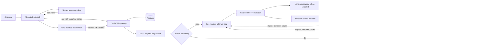

# 1. Retries & Repair boundary consolidation

- Project: harden-llm self-hosted gateway and Phoenix Trace Studio.
- Version: 1.1.0; status: proposed implementation plan, all phases pending.
- Owners: repository maintainers for Go runtime/providers and Phoenix workspace; executing engineer records phase evidence and the maintainer reviews architectural changes.
- Date: 2026-09-15.
- Document ID: PLAN-HLLM-RECOVERY-BOUNDARIES-001.
- Baseline: branch `feat/recovery-policy`, source `d93cc00a95415648b6926a62ba190de58f61707a`.
- Predecessor: `plans/retries-repair-architecture-implementation-plan.md`; preserve its completed execution history.

Consolidate recovery ownership at the provider and workspace boundaries while retaining the complete RecoveryPolicy, fixed target, strict original-schema validation and single runtime attempt loop introduced by ADR-HLLM-020. Correct classification, transport recovery, completion admission, accounting, cache projection and draft persistence with deterministic regressions before implementation. Reuse existing packages, LiveView state ownership and test gates; add no service, compatibility path, policy control or deployment step.

## 2. Design consensus and trade-offs

### 2.1 Repository evidence and root causes

The following are source-level findings corroborated by deterministic local probes against the baseline; they are not claims about a deployed build. Permanent regressions must reproduce them using Section 7 fixtures rather than depending on temporary probe files.

| Boundary | Observed failure | Root cause and owning surface |
| --- | --- | --- |
| Failure classification | Missing schema fields named `refusalReason` or `content_filter_reason` become refusals; HTTP 400/401/403 bodies saying NETWORK_ERROR repeat; 429/503 lose their server-delay category. | Boolean flags, codes and message substring rules compete in `internal/retry/retry.go`; provider errors lack one authoritative kind. |
| Provider envelope | Malformed whole-response JSON triggers semantic repair without a valid extracted prior model output; Responses stream error codes can become terminal unknown errors. | Envelope decoding and model-output validation share Parse flags; stream normalization fails to assign documented kinds in `internal/providers/normalize.go` and `internal/providers/router.go`. |
| Network execution | DNS fails before cache lookup and the loop; unexpected EOF and request-local timeouts do not recover consistently; Jina drops Retry-After. | `Router.Prepare` resolves DNS, transport resolves again, and model/search HTTP error paths differ in `internal/providers/router.go`, `internal/providers/endpoint.go` and `internal/providers/web_search.go`. |
| Completion/cache | Delta-only or explicitly incomplete Responses streams can return valid-looking JSON and populate cache. | `collectResponsesEventStream` reconstructs success from partial text; completion is not an admission condition. |
| Accounting | Empty attempt 11/3 tokens and 0.1 cost followed by success 17/5 and 0.2 is recorded as only 17/5 and 0.2. | `normalizeResponse` returns before usage/cost extraction for empty/refused results. |
| Dispatch facts | A failed DNS lookup with zero model request writes is reported as providerUsed=true. | `internal/runtime/execute.go` and `internal/runtime/telemetry.go` infer work from the absence of BeforeProviderError. |
| Active UI policy | Recovery-only edit displays 7 while stored value remains 4; restoring another profile replaces saved policy 1 with profile default 4. | Host form and widget main_form both own policy; widget update/reset emits feedback in `frontend/lib/harden_llm_web/live/profile_widget_component.ex`. |
| State persistence | An older save of 7 can finish after a newer save of 9 and leave storage at 7. | `frontend/lib/harden_llm_web/live/workspace_live.ex` starts overlapping whole-state saves; its separate UI coalescer writes that same state. Ignoring an obsolete async result cannot undo an HTTP write already made. |
| Backoff | After the cap is reached, distinct random inputs all yield the same 8-second wait. | Jitter precedes clipping in `internal/retry/retry.go`. |

Existing tests cover substantial policy/loop behavior but often start with already classified fake errors, assert outgoing UI values without stored reload, restore only the current profile, or supply incomplete synthetic completion envelopes. Add boundary fixtures at those owners; preserve existing output, accounting, security and budget assertions.

### 2.2 Decisions and alternatives

| Topic | Verdict | Rationale |
| --- | --- | --- |
| Consolidate existing boundaries | DECISION | Keep one complete policy, one loop, one active host draft and one state writer. Fix the concrete ownership violations above without introducing an orchestration layer. |
| Independent patches at each caller | AGAINST | Additional flags, message exceptions and save guards retain competing owners and make future failures harder to classify. |
| SDK-managed retries | AGAINST | A second retry owner would obscure maxAttempts across the four supported protocol families and semantic repair. |
| Remove semantic repair entirely | AGAINST | Native structured output does not eliminate parse/schema failures; bounded repair is an intended user control. |
| Generic recovery/workflow service | AGAINST | Existing runtime and LiveView processes already own the required lifecycles; no demonstrated need justifies another scheduler, queue or service. |
| Explicit failure kind | FOR | Assign one existing category at the source. Runtime applies policy once; telemetry projects facts without default-policy reclassification. Unknown failures remain terminal. |
| Original-schema repair | DECISION | Only completed, extracted model output that fails strict parsing/schema validation is repairable. Preserve target, options, original schema and prior output as data through a transport retry. |
| Completion authority | DECISION | Responses uses its final response object, never delta/done reconstruction. Other protocols admit documented successful stop markers and reject explicit limits/refusals/unsupported terminal states. No automatic continuation, token-limit increase or alternate target. |
| Transport normalization | DECISION | Keep static validation in Prepare, move DNS to the guarded transport inside the attempt loop, and share HTTP failure normalization between model and Jina requests. Preserve native/Jina routing and search memo ownership. |
| Provider-use meaning | DECISION | Observe the model HTTP transport's request-header-write event using standard-library httptrace.WroteHeaders. The existing Boolean denotes observed request dispatch, not remote execution or exact billing; partial writes remain financially ambiguous. Keep this fact separate from attempt slots. |
| Workspace persistence | DECISION | Generalize the existing UI-save coalescer into the sole complete-state writer: one in-flight write and one latest pending snapshot. Remove parallel draft/UI writers; no action queue, state revision service or cross-tab conflict protocol. |
| Cache transition | DECISION | Set the inner ResponseProjection.Version to v3 for both call kinds; keep the outer operation-v2 cache namespace unchanged. Old projection keys are unreachable, not automatically expired: this checkout has no cache TTL. No compatibility lookup, migration or purge is added. |
| Waiting | DECISION | Apply full jitter within the capped exponential window, then honor valid Retry-After as a lower bound. The parent context bounds the wait. No origin-wide scheduler or circuit breaker. |
| Verification architecture | DECISION | Real provider bytes and stateful REST stubs at T0–T2 cover permutations; existing browser-free release checks cover distinct storage/process/race boundaries once the implementation is complete. No DOM emulator or new runner. |

Protocol completion rules derive from the Responses terminal-event contract, Anthropic stop reasons and Gemini finish reasons; the decision to stop on output limits instead of continuing is this project's scope choice. [Responses streaming events](https://developers.openai.com/api/reference/resources/responses/streaming-events#response.incomplete), [Anthropic stop reasons](https://platform.claude.com/docs/en/build-with-claude/handling-stop-reasons), [Gemini finish reasons](https://ai.google.dev/api/generate-content#FinishReason).

Full jitter and server-directed waiting follow the existing policy controls with the corrected ordering. [AWS backoff and jitter](https://aws.amazon.com/blogs/architecture/exponential-backoff-and-jitter/), [HTTP Retry-After](https://www.rfc-editor.org/rfc/rfc9110.html#name-retry-after). LiveView async-result replacement is not a storage ordering guarantee. [Phoenix start_async/3](https://hexdocs.pm/phoenix_live_view/Phoenix.LiveView.html#start_async/3).

## 3. PRD / stakeholder and system needs

- Problem: recovery controls currently disagree with persistence and several real provider failure boundaries, allowing missed recovery, inappropriate retries, incomplete cached output and understated provider work.
- Users: Trace Studio operators editing profiles/runs; REST and Go callers expecting bounded recovery; maintainers investigating attempts and costs.
- Value: the selected policy determines observable behavior; history/cache/accounting explain what happened without a second interpretation path.
- Business goals: reduce repeat investigations and avoid avoidable provider requests; keep one maintainable implementation per behavior.
- Success metrics: zero unexpected retries, repair eligibility violations, incomplete cache admissions, lost known accounting contributions or stale final state in the defined matrices; attempt slots never exceed maxAttempts; state writes in flight never exceed one per LiveView; every selected certification task passes.
- Scope: explicit failure normalization, guarded request execution, cancellation, jitter, completion, partial accounting, one cache projection, active policy ownership and workspace state persistence.
- Non-goals: new provider capabilities, model escalation, schema salvage/coercion, SDK retry adoption, workflow infrastructure, cross-tab merge semantics, server idempotency protocol, UI redesign, database migration, historical backfill, production promotion, browser or paid-provider certification.
- Dependencies: existing Go runtime/provider/schema/accounting/cache packages; `api/openapi.yaml`; Phoenix/Req/LiveView; `test/test-tiers.json`; existing Docker services for final certification; ADR-HLLM-015/016/018/019/020.
- Risks: stricter completion exposes nonconforming fixtures/providers; transport changes could weaken endpoint restrictions; cache cold misses may increase provider work temporarily; a save failure can leave durable state behind the visible draft.
- Assumptions: current complete-policy and v2/v3 document contracts remain authoritative; each LiveView owns its own editing session; cross-session last-write behavior remains unchanged; public deployments are separate from local completion.

## 4. SRS / canonical requirements

| ID | Type | Requirement and acceptance criteria |
| --- | --- | --- |
| REQ-213 | func | Assign one failure kind at its originating boundary. Parent cancellation/deadline is terminal; real HTTP status precedes contradictory body hints; documented protocol error codes map explicitly. Schema error wording cannot imply refusal/network failure. Malformed provider envelopes are terminal protocol errors, distinct from model-output parse errors. |
| REQ-214 | reliability | Prepare performs static endpoint/credential validation with zero DNS/network work. The existing guarded transport resolves and pins allowed addresses within the shared attempt loop. Section 8.4 defines transport categories and precedence, including transient handshake timeouts versus terminal certificate/configuration failures. Model and Jina HTTP errors preserve Retry-After consistently. |
| REQ-215 | func | Preserve one target and one maxAttempts budget for initial work, transport retries and semantic repairs. Retry of repair preserves its schema, prior output, validation feedback and target/options. Explicit disabled categories prevent repetition; neither dispatch nor waiting outlives the parent context. |
| REQ-216 | reliability | Admit output only from a successful complete provider response. Responses requires a valid completed final object; EOF without terminal is interrupted transport. Explicit limit/refusal and malformed/unsupported terminal states are terminal. Only completed extracted output failing strict syntax/schema validation is eligible for semantic repair. |
| REQ-217 | data | Normalize every available usage/cost contribution before output-dependent failure returns. Provider totals include failed attempts; result totals describe the delivered result. Unknown dispatched work remains incomplete, preserving known subtotals. All projections use internal/accounting arithmetic without inventing zero cost or reconstructing history. |
| REQ-218 | data | Cache only completed accepted output with canonical accounting under response projection v3 for both call kinds. Never query old v1/v2 response-projection keys; cache hits dispatch neither DNS/search nor model work. Recovery policy remains excluded from semantic operation identity; result-producer attribution is preserved. |
| REQ-219 | func | WorkspaceLive and each EmbeddingLive instance own their active policy; ProfilesLive owns its standalone profile form. The widget renders supplied policy and emits edit intents. Selection installs one complete snapshot; hydration/history restore preserve supplied policy. Section 8.7 defines which current draft or saved record each save/run/cURL/export action reads. |
| REQ-220 | reliability | All complete workspace-state writes use one in-flight writer and one latest pending snapshot per LiveView, including UI changes and history restore. Final storage/reload equals the last successful visible draft; write failure is visible, retains the draft, and does not automatically repeat the same failed snapshot. |
| REQ-221 | int | Preserve the current public Go and REST policy shape, required presence, validation ranges, explicit empty/false/zero values, profile/state/bundle v2 and RunResult v3. Go owns semantic defaults/validation; Phoenix uses the OpenAPI boundary. No retired fields or compatibility reader are introduced. |
| REQ-222 | perf | Use the single delay formula and clock contract in Section 8.5. Randomness still varies delay at the cap; zero calculated backoff does not cancel a server minimum. Cancellation/deadline prevents subsequent dispatch. |
| REQ-223 | nfr | Remove superseded classification heuristics, partial-output reconstruction, duplicated active policy ownership and parallel state writers. Reuse existing test/runtime infrastructure, keep all required assertions, register traceability and pass existing fast and final release gates within their operational envelopes. |
| REQ-224 | security | Preserve HTTPS/host/address/rebinding/credential-origin restrictions and redaction. Carry observed model-dispatch facts and bounded failure metadata to attempts/telemetry without reclassifying free text. Search-only/pre-dispatch failures cannot claim model dispatch; request dispatch is not evidence of remote execution or exact billing. |

Failure metadata consists of the canonical category and bounded status/code/type/request ID, with Retry-After carried to the decision owner. Raw provider output remains data in existing permitted artifacts/repair input; do not copy credentials, prompts or arbitrary bodies into error labels and ordinary telemetry.



```text
C4 context/container view: harden-llm system
[Person: operator / external API caller]
    |
    +--> [Phoenix container]
    |      Host draft -> shared widget
    |      Host draft -> one state writer -> REST
    |
    +--> [Go gateway container]
           REST/OpenAPI -> profiles/state/history -> [Postgres]
           runtime component: static preparation -> cache lookup
             -> cache miss: one budget + one selected target
             -> provider component: guarded DNS/HTTP + protocol completion
                   -> [External Jina, only when selected]
                   -> [External selected model endpoint]
             -> accounting on success/error; accepted output -> schema/cache
             -> canonical record -> [Existing cache/artifact storage]
             -> telemetry/history projections
No new container, service, scheduler or persistence schema.
```

## 5. Iterative implementation and test plan

### 5.1 Execution controls and lifecycle rules

This plan is standards-informed, not an ISO/IEEE/FAA compliance claim. It is ordinary application engineering; no safety-critical assurance level, independence or certification qualification is asserted.

- Execute P00 through P04 in order, one subtask at a time. A documented blocker permits investigation, not dependent implementation or a green phase status.
- RED must execute an assertion that fails for the intended invariant; compilation errors, zero selected cases and infrastructure failures are not acceptable RED evidence. GREEN uses exactly the same test ID and command. Retain the oracle during cleanup.
- Prefix new Go cases as specified in Section 7.3; add the specified ExUnit tags before using their selectors. No new executable command or runner is needed.
- Each created/modified Go test file carries `// SPEC-HARDEN-LLM-SELF-HOSTED-TESTS-001 TEST-213` using the appropriate concrete registered ID. ExUnit files carry the equivalent `#` comment plus `SPEC-HARDEN-LLM-PHOENIX-LIVEVIEW-001` and WEB-TEST-074 or WEB-TEST-075. Keep existing tags.
- Preserve assertion purpose. When the approved completion/classification/jitter contract deliberately changes an old expected value, record the old/new expectation and ADR-HLLM-021 rationale; keep captured files and hashes in `fixtures/parity/` unchanged and identify the difference in `fixtures/parity/manifest.json`. Do not replace a failing boundary with an unproved fake.
- An eval is a named interpretation of existing test outputs, not a new program. Named cases and counted requests/writes provide exact invariant metrics. Threshold changes require an ADR before execution resumes.
- Continue the verified feature branch; if HEAD or the working tree changes, record and review the delta before RED. At each green phase boundary record source/configuration identity, `git diff HEAD --check`, focused/aggregate results and remaining risks, then commit and push the verified checkpoint to its feature branch. Checkpoints are not implementation subtasks; no production push/promotion is implied.
- Preserve predecessor completion evidence; new execution data belongs in Section 11. A future deployment must separately identify branch/SHA/images/URL and browser-free HTTP checks.

```yaml
branch_limits:
  active_implementation_branches: 1
  design_candidates: 5
reflection_passes: 2
"early_stop%": 100
```

The five design candidates are the alternatives in Section 2.2. Reflection pass 1 reviews requirement/ownership coverage; pass 2 reviews evidence and deletion of superseded paths. Early completion requires 100% of required phase gates; these controls never justify skipping failing acceptance. Do not repeat green gates without changed source, failed evidence or an unresolved concern.

Phase percentages below are subjective planning estimates, not measured reliability, coverage or statistical confidence. Interaction counts describe touched logical boundaries, not request volume. YAGNI uses 1–5, with 5 meaning only demonstrated needs. Zero debt/creep is a scope target, not a claim that the repository has no debt.

### Phase P00: Failure kinds determine recovery consistently

- Phase goal: each provider/runtime failure has one kind and one policy decision.
- Scope/objectives: REQ-213, REQ-215, REQ-223, REQ-224; establish the follow-up ADR and classify real boundary failures without changing the policy wire shape.
- Impacted surfaces: `internal/retry/retry.go`, `internal/providers/normalize.go`, `internal/providers/router.go`, `internal/runtime/execute.go`, `internal/runtime/repair.go`, `internal/runtime/telemetry.go`, `internal/traces/traces.go`, `internal/schema/schema_test.go`; canonical specifications and test catalog.
- Lifecycle evidence: requirements and source ownership in the new ADR; real provider-byte regression logs; validation that policy decisions reflect actual failure kind; baseline/checkpoint SHA and tool versions; risk of changing intentional message-only provider_retry recognition, which remains narrow and protocol-local.

- `P00.S01 Record decisions and register verification cases`
  - Action: Create `docs/adr/ADR-HLLM-021-recovery-boundary-ownership.md`; register this plan's requirements/tests and WEB IDs in canonical specifications; record intentional source-parity differences in the existing manifest; add holdout/gate traceability comments. Identify the exact clauses superseded in ADR-HLLM-016/020 without rewriting prior execution history.
  - Why now: Definitions and accepted trade-offs must precede altered behavior.
  - Files/surfaces: `docs/adr/README.md`; `fixtures/parity/manifest.json`; new ADR; `plans/from_utility-llm/self-hosted-go-stack-spec.md`; `plans/from_utility-llm/harden-llm-self-hosted-test-spec.md`; `plans/from_utility-llm/phoenix-liveview-frontend-spec.md`; `internal/testkit/static_traceability_test.go`; `client_test.go`; `internal/gateway/run_validation_test.go`; `internal/gateway/openapi_contract_test.go`; `internal/testkit/test_tier_policy_test.go`; `internal/testkit/release_gate_test.go`
  - Requirement link: REQ-223
  - Verification link: TEST-212
  - Verification mode: VERIFY
  - Command/procedure: `make test-static`
  - Expected result: Static catalog/policy checks pass with no application behavior change.
  - Evidence produced: ADR, catalog diff and static log.
  - Stop/escalate condition: An ID collision or contract disagreement prevents registration.
  - Unlocks: P00.S02

- `P00.S02 Add failing provider classification cases`
  - Action: Add the complete classification matrix, including malformed envelope versus model JSON and misleading schema-field names.
  - Why now: Reproduce the source-boundary defect before changing classification.
  - Files/surfaces: `internal/retry/retry_test.go`; `internal/providers/normalization_test.go`; `internal/runtime/repair_test.go`; `internal/runtime/telemetry_test.go`; `internal/traces/parity_test.go`
  - Requirement link: REQ-213, REQ-215, REQ-224
  - Verification link: TEST-213
  - Verification mode: RED
  - Command/procedure: `go test ./internal/retry ./internal/providers ./internal/runtime ./internal/traces -run '^TestRecoveryBoundaryClassification' -count=1 -timeout=60s -v`
  - Expected result: Named classification/repair eligibility assertions fail on the baseline.
  - Evidence produced: Regression source and assertion failures.
  - Stop/escalate condition: Failure is only compilation, missing selection or fixture setup.
  - Unlocks: P00.S03

- `P00.S03 Assign failure kinds at their source`
  - Action: Replace competing ProviderError flags with one existing category; normalize HTTP and documented protocol codes at provider boundaries; classify parent cancellation separately from attempt-local timeout; update constructors/consumers together. Keep the narrow Responses directive recognizer at its protocol parser.
  - Why now: P00.S02 supplies failing semantic oracles.
  - Files/surfaces: `internal/retry/retry.go`; `internal/providers/normalize.go`; `internal/providers/router.go`; `internal/runtime/execute.go`; `internal/runtime/repair.go`; existing test constructors
  - Requirement link: REQ-213, REQ-215, REQ-224
  - Verification link: TEST-213
  - Verification mode: GREEN
  - Command/procedure: `go test ./internal/retry ./internal/providers ./internal/runtime ./internal/traces -run '^TestRecoveryBoundaryClassification' -count=1 -timeout=60s -v`
  - Expected result: Classification matrix passes; policy/budget and original-schema repair remain unchanged.
  - Evidence produced: Code diff and matching passing log.
  - Stop/escalate condition: A fix requires new public categories, message guessing or a second retry owner.
  - Unlocks: P00.S04

- `P00.S04 Remove duplicate failure interpretation`
  - Action: Delete broad message classifiers and retired flags; pass canonical metadata into telemetry/traces without default-policy reclassification. Adapt affected existing fixtures to the explicit kind while retaining their original assertions.
  - Why now: The passing typed boundary permits safe deletion of competing interpretations.
  - Files/surfaces: `internal/retry/retry.go`; `internal/runtime/telemetry.go`; `internal/traces/traces.go`; affected existing test constructors
  - Requirement link: REQ-213, REQ-223, REQ-224
  - Verification link: TEST-213
  - Verification mode: REFACTOR
  - Command/procedure: `go test ./internal/retry ./internal/providers ./internal/runtime ./internal/traces -run '^TestRecoveryBoundaryClassification' -count=1 -timeout=60s -v`
  - Expected result: Same behavior assertions pass with one classification owner.
  - Evidence produced: Deletion inventory and focused log.
  - Stop/escalate condition: Cleanup introduces new behavior; add failing coverage before proceeding.
  - Unlocks: P00.S05

- `P00.S05 Measure classification and broad regression outcomes`
  - Action: Execute the broad deterministic gate; record failed invariant count, selected case/task counts and whole-command duration.
  - Why now: Validate the change across existing consumers after focused cleanup.
  - Files/surfaces: `test/test-tiers.json`; `internal/testkit/test_tier_policy_test.go`
  - Requirement link: REQ-213, REQ-223
  - Verification link: TEST-221, EVAL-301
  - Verification mode: MEASURE
  - Command/procedure: `make test-fast`
  - Expected result: Zero classification violations and all selected fast tasks pass.
  - Evidence produced: EVAL-301 log and phase checkpoint evidence.
  - Stop/escalate condition: Any required task fails or a new selector is absent from normal discovery.
  - Unlocks: P00 exit

- Exit gate: P00.S01–P00.S05 accepted; same-command RED/GREEN evidence retained; static/fast gates pass.
- Metrics: Confidence 88% — concrete reproductions bound the work; long-term robustness 90% — explicit source kinds remove text-dependent decisions; internal interactions 5 — retry, providers, runtime, traces and catalogs; external interactions 1 — provider error envelopes; complexity 40% — all constructors must move together; feature creep 0% — no policy expansion; technical debt 0% target — retire all competing flags/heuristics in scope; YAGNI 5/5 — reuse current categories and loop; MoSCoW Must — later phases need stable failure semantics; local/non-local scope non-local — Go consumers share the error contract; architectural changes count 1 — one failure-kind owner.

### Phase P01: Transport failures stay inside the bounded attempt budget

- Phase goal: transient request failures can recover without escaping the selected budget, endpoint restrictions or parent deadline.
- Scope/objectives: REQ-214, REQ-215, REQ-222, REQ-224; network work belongs inside execution and waiting remains bounded.
- Impacted surfaces: `internal/providers/endpoint.go`, `internal/providers/router.go`, `internal/providers/web_search.go`, `internal/runtime/types.go`, `internal/runtime/execute.go`, `internal/runtime/telemetry.go`, `internal/retry/retry.go`.
- Lifecycle evidence: endpoint/dispatch ownership diff and ADR clauses; deterministic resolver/read/timeout/header/wait logs; validation of bounded availability and accurate dispatch facts; pinned configuration and phase SHA; security and ambiguous request-delivery risks retained explicitly.

- `P01.S01 Add failing transport and dispatch cases`
  - Action: Add the Section 8.4 resolver/cache/read/timeout/security/search matrix and a repair interrupted by transient transport failure. Assert partial-result dispatch, callback/metric agreement, non-2xx status precedence on interrupted bodies, and terminal trace outcomes independently of policy.
  - Why now: P00 provides stable failure kinds for the network boundary.
  - Files/surfaces: `internal/providers/requests_test.go`; `internal/providers/endpoint_policy_test.go`; `internal/providers/web_search_test.go`; `internal/runtime/repair_test.go`; `internal/runtime/telemetry_test.go`
  - Requirement link: REQ-214, REQ-215, REQ-224
  - Verification link: TEST-214
  - Verification mode: RED
  - Command/procedure: `go test ./internal/providers ./internal/runtime -run '^TestRecoveryBoundaryTransport' -count=1 -timeout=60s -v`
  - Expected result: DNS/cache, read/timeout recovery or dispatch assertions fail for the intended defects.
  - Evidence produced: Boundary regressions with request and resolver counts.
  - Stop/escalate condition: A fixture uses public DNS, weakens endpoint protection or infers dispatch from a fake error label.
  - Unlocks: P01.S02

- `P01.S02 Consolidate guarded request execution`
  - Action: Split static validation from DNS/address resolution in the existing guard; keep resolution/pinned dialing inside Execute. Share model/Jina HTTP failure normalization for Do/read/status/Retry-After, distinguishing root cancellation from request timeout and terminal security/size failures. Implement the exact dispatch field/callback and category precedence in Section 8.4, update their public descriptions, and remove BeforeProviderError inference.
  - Why now: P01.S01 bounds both availability and security changes.
  - Files/surfaces: `internal/providers/endpoint.go`; `internal/providers/router.go`; `internal/providers/web_search.go`; `internal/runtime/types.go`; `internal/runtime/search.go`; `internal/runtime/execute.go`; `internal/runtime/telemetry.go`; `types.go`; `api/openapi.yaml`; `docs/api-and-library.md`
  - Requirement link: REQ-214, REQ-215, REQ-224
  - Verification link: TEST-214
  - Verification mode: GREEN
  - Command/procedure: `go test ./internal/providers ./internal/runtime -run '^TestRecoveryBoundaryTransport' -count=1 -timeout=60s -v`
  - Expected result: Transport cases pass with shared budget and observed model dispatch; search routing/memo semantics are preserved.
  - Evidence produced: Code diff and matching transport log.
  - Stop/escalate condition: Address restrictions, credential origins or parent cancellation need a bypass to pass.
  - Unlocks: P01.S03

- `P01.S03 Add failing capped jitter cases`
  - Action: Add exact Section 8.5 arithmetic cases, fixed-date model/Jina header normalization, capped windows, server minimums and deadline cancellation.
  - Why now: Transport semantics are stable before altering wait arithmetic.
  - Files/surfaces: `internal/retry/retry_test.go`; `internal/providers/requests_test.go`; `internal/runtime/repair_test.go`
  - Requirement link: REQ-215, REQ-222
  - Verification link: TEST-215
  - Verification mode: RED
  - Command/procedure: `go test ./internal/retry ./internal/providers ./internal/runtime -run '^TestRecoveryBoundaryTiming' -count=1 -timeout=60s -v`
  - Expected result: Distinct random fractions expose collapsed waits at the cap.
  - Evidence produced: Timing case failures with expected durations.
  - Stop/escalate condition: The oracle uses probabilistic distribution thresholds or real backoff sleeping.
  - Unlocks: P01.S04

- `P01.S04 Apply full jitter before the server minimum`
  - Action: Implement the single Section 8.5 formula in retry.Delay; wire the internal router clock into model/Jina header normalization and retain existing runtime random/wait dependencies.
  - Why now: P01.S03 supplies the exact arithmetic oracle.
  - Files/surfaces: `internal/retry/retry.go`; `internal/runtime/execute.go`; `internal/providers/router.go`; `internal/providers/web_search.go`
  - Requirement link: REQ-215, REQ-222
  - Verification link: TEST-215
  - Verification mode: GREEN
  - Command/procedure: `go test ./internal/retry ./internal/providers ./internal/runtime -run '^TestRecoveryBoundaryTiming' -count=1 -timeout=60s -v`
  - Expected result: Every injected fraction produces the specified delay and cancellation prevents another dispatch.
  - Evidence produced: Formula diff and matching passing log.
  - Stop/escalate condition: Passing requires raising maxAttempts, ignoring Retry-After or extending the parent deadline.
  - Unlocks: P01.S05

- `P01.S05 Remove duplicate network and timing paths`
  - Action: Consolidate common Do/read/status normalization and guard rules within providers; retain protocol-specific response parsing. Remove superseded wrappers and timing copies without introducing a generic middleware framework.
  - Why now: Both network and timing behavior now have direct regressions.
  - Files/surfaces: `internal/providers/router.go`; `internal/providers/web_search.go`; `internal/providers/endpoint.go`; `internal/retry/retry.go`; `internal/runtime/search.go`
  - Requirement link: REQ-214, REQ-222, REQ-223, REQ-224
  - Verification link: TEST-214, TEST-215
  - Verification mode: REFACTOR
  - Command/procedure: `go test ./internal/providers ./internal/runtime -run '^TestRecoveryBoundaryTransport' -count=1 -timeout=60s -v`; then `go test ./internal/retry ./internal/providers ./internal/runtime -run '^TestRecoveryBoundaryTiming' -count=1 -timeout=60s -v`
  - Expected result: Both matrices pass; one HTTP failure normalizer and one delay calculator remain.
  - Evidence produced: Deletion diff and both focused logs.
  - Stop/escalate condition: A shared helper would require unrelated search/model lifecycle abstraction.
  - Unlocks: P01.S06

- `P01.S06 Measure bounded recovery across the fast suite`
  - Action: Record request/attempt maxima, DNS counts, capped-delay values and aggregate task results.
  - Why now: Confirm consumer behavior after the transport and timing changes.
  - Files/surfaces: `test/test-tiers.json`; `internal/testkit/test_tier_policy_test.go`
  - Requirement link: REQ-214, REQ-215, REQ-222, REQ-224
  - Verification link: TEST-221, EVAL-301
  - Verification mode: MEASURE
  - Command/procedure: `make test-fast`
  - Expected result: Zero budget/security/timing violations; all selected tasks pass.
  - Evidence produced: EVAL-301 results and phase checkpoint evidence.
  - Stop/escalate condition: Any selected task fails or canonical dispatch facts disagree across projections.
  - Unlocks: P01 exit

- Exit gate: P01.S01–P01.S06 accepted; two RED/GREEN pairs and security holdouts pass.
- Metrics: Confidence 85% — resolver/timeout boundaries require careful local fixtures; long-term robustness 91% — one guarded execution path removes inconsistent retry scope; internal interactions 4 — endpoint guard, HTTP normalization, runtime facts and retry timing; external interactions 2 — model and Jina HTTP; complexity 55% — context and transport errors interact; feature creep 0% — existing routing/budget only; technical debt 0% target — delete duplicate failure/wait paths; YAGNI 5/5 — standard-library tracing and current injection points suffice; MoSCoW Must — availability and endpoint integrity are binding; local/non-local scope non-local — transport facts reach runtime/telemetry; architectural changes count 1 — network execution and dispatch facts have one boundary owner.

### Phase P02: Only completed output is cached with accurate accounting

- Phase goal: incomplete output never becomes a successful cached result and known work survives every failure path.
- Scope/objectives: REQ-216, REQ-217, REQ-218, REQ-224; completion admission precedes parsing/repair/cache writes.
- Impacted surfaces: `internal/providers/router.go`, `internal/providers/normalize.go`, `internal/runtime/execute.go`, `internal/accounting/accounting.go`, `internal/cachekey/cache.go`, `internal/traces/traces.go`.
- Lifecycle evidence: protocol terminal fixtures, known/unknown accounting assertions and cache hit/miss logs; validation of trustworthy results/costs; source and response-projection v3 checkpoint; risks of stricter protocol admission and cold-cache provider work.

- `P02.S01 Add failing terminal response cases`
  - Action: Add the complete completion matrix and distinguish final authoritative output from partial deltas, malformed envelopes and unsupported terminal states. Apply the Section 8.6 synthetic/captured fixture rules, retaining raw rejection and original extraction oracles.
  - Why now: P00/P01 provide typed errors and interrupted-transport behavior.
  - Files/surfaces: `internal/providers/normalization_test.go`; `internal/providers/requests_test.go`
  - Requirement link: REQ-213, REQ-216
  - Verification link: TEST-216
  - Verification mode: RED
  - Command/procedure: `go test ./internal/providers -run '^TestRecoveryBoundaryCompletion' -count=1 -timeout=60s -v`
  - Expected result: Incomplete/delta-only or explicit-limit outputs fail the expected rejection assertions.
  - Evidence produced: Protocol-byte fixtures, provenance notes and failure log.
  - Stop/escalate condition: A fixture is altered to hide the existing output/accounting expectation rather than represent the documented protocol.
  - Unlocks: P02.S02

- `P02.S02 Admit only complete provider responses`
  - Action: Use the Responses completed final object as output authority, require documented terminal success, and reject limit/refusal/malformed/unsupported states before semantic output validation. Remove partial text success reconstruction.
  - Why now: P02.S01 defines which bytes may become usable output.
  - Files/surfaces: `internal/providers/router.go`; `internal/providers/normalize.go`; affected existing protocol fixtures
  - Requirement link: REQ-213, REQ-216
  - Verification link: TEST-216
  - Verification mode: GREEN
  - Command/procedure: `go test ./internal/providers -run '^TestRecoveryBoundaryCompletion' -count=1 -timeout=60s -v`
  - Expected result: Completion matrix passes and only completed invalid model output reaches semantic repair.
  - Evidence produced: Parser diff, documented fixture corrections and matching passing log.
  - Stop/escalate condition: A supported provider contract requires automatic continuation or an alternate acceptance path.
  - Unlocks: P02.S03

- `P02.S03 Add failing accounting and cache transition cases`
  - Action: Add Section 8.6 accounting-quality and partial-read regressions, including missing/invalid components, partial-priced versus reported-exact cost, prior totals surviving errors, and incomplete-output cache rejection. Distinguish inner projection v3 from the unchanged outer operation-v2 namespace in parity/cache tests.
  - Why now: Completion behavior is defined before certifying durable admission/accounting.
  - Files/surfaces: `internal/providers/normalization_test.go`; `internal/providers/requests_test.go`; `internal/runtime/repair_test.go`; `internal/accounting/accounting_test.go`; `internal/cachekey/cache_test.go`; `internal/traces/parity_test.go`
  - Requirement link: REQ-217, REQ-218, REQ-224
  - Verification link: TEST-217
  - Verification mode: RED
  - Command/procedure: `go test ./internal/providers ./internal/runtime ./internal/accounting ./internal/cachekey ./internal/traces -run '^TestRecoveryBoundaryAccountingCache' -count=1 -timeout=60s -v`
  - Expected result: Known totals or old-cache bypass assertions fail on the current implementation.
  - Evidence produced: Accounting/cache fixtures and numeric failure log.
  - Stop/escalate condition: The fixture assumes unknown work is free or depends on production cache contents.
  - Unlocks: P02.S04

- `P02.S04 Preserve partial accounting and switch the current projection`
  - Action: Implement Section 8.6 envelope/accounting propagation, component validation and cost certainty through existing ProviderResult and internal/accounting. Preserve prior totals on failure. Replace call-kind version branching in the provider operation builder with the single inner projection v3 constant; keep the outer namespace and captured parity evidence unchanged.
  - Why now: P02.S03 protects arithmetic and the cache contract change.
  - Files/surfaces: `internal/providers/normalize.go`; `internal/providers/router.go`; `internal/runtime/execute.go`; `internal/accounting/accounting.go`; `internal/cachekey/cache.go`; `internal/providers/requests_test.go`; `internal/traces/traces.go`
  - Requirement link: REQ-217, REQ-218, REQ-224
  - Verification link: TEST-217
  - Verification mode: GREEN
  - Command/procedure: `go test ./internal/providers ./internal/runtime ./internal/accounting ./internal/cachekey ./internal/traces -run '^TestRecoveryBoundaryAccountingCache' -count=1 -timeout=60s -v`
  - Expected result: Known totals and uncertainty are correct; only v3 accepted results are served/written.
  - Evidence produced: Accounting/projection diff and matching passing log.
  - Stop/escalate condition: A fix requires a result schema migration, cache compatibility lookup or historical accounting rewrite.
  - Unlocks: P02.S05

- `P02.S05 Consolidate response admission and ledger projection`
  - Action: Remove duplicated extraction/early-return accounting and partial-success reconstruction; keep protocol completion readers small and route arithmetic through internal/accounting only.
  - Why now: Both output and ledger invariants are green.
  - Files/surfaces: `internal/providers/normalize.go`; `internal/providers/router.go`; `internal/runtime/execute.go`; `internal/accounting/accounting.go`; `internal/traces/traces.go`
  - Requirement link: REQ-216, REQ-217, REQ-218, REQ-223
  - Verification link: TEST-216, TEST-217
  - Verification mode: REFACTOR
  - Command/procedure: `go test ./internal/providers -run '^TestRecoveryBoundaryCompletion' -count=1 -timeout=60s -v`; then `go test ./internal/providers ./internal/runtime ./internal/accounting ./internal/cachekey ./internal/traces -run '^TestRecoveryBoundaryAccountingCache' -count=1 -timeout=60s -v`
  - Expected result: Both matrices retain their accepted output, totals and cache oracles.
  - Evidence produced: Ownership/deletion diff and focused logs.
  - Stop/escalate condition: Cleanup adds a second envelope format, arithmetic path or projection version selector.
  - Unlocks: P02.S06

- `P02.S06 Measure completion and accounting outcomes`
  - Action: Record rejected incomplete admissions, ledger deltas, old-key lookups and broad task results.
  - Why now: Validate accounting/cache changes across current clients and history projections.
  - Files/surfaces: `test/test-tiers.json`; `internal/testkit/test_tier_policy_test.go`
  - Requirement link: REQ-216, REQ-217, REQ-218, REQ-223
  - Verification link: TEST-221, EVAL-301
  - Verification mode: MEASURE
  - Command/procedure: `make test-fast`
  - Expected result: Zero incomplete admissions, lost known contributions or old-key lookups; all selected tasks pass.
  - Evidence produced: EVAL-301 results and phase checkpoint evidence.
  - Stop/escalate condition: A legacy fixture or consumer relies on partial success and its supported contract is unresolved.
  - Unlocks: P02 exit

- Exit gate: P02.S01–P02.S06 accepted; original result-value oracles retained; v3-only cache admission and accounting pass.
- Metrics: Confidence 87% — failures are reproducible with finite protocol envelopes; long-term robustness 93% — completion and accounting become explicit admission invariants; internal interactions 5 — provider parsing, runtime, accounting, cache and traces; external interactions 4 — supported protocol families; complexity 55% — terminal states and unknown accounting interact; feature creep 0% — no model continuation or history rewrite; technical debt 0% target — one current projection and arithmetic owner; YAGNI 5/5 — versioned cache identity already exists; MoSCoW Must — invalid durable results are unacceptable; local/non-local scope non-local — normalization changes cached/public result meaning; architectural changes count 1 — canonical response admission owns completion and partial accounting.

### Phase P03: Workspace policy survives edits, restoration and saves

- Phase goal: rendered policy and the last successfully saved complete workspace draft agree.
- Scope/objectives: REQ-219, REQ-220, REQ-221; controlled shared editor plus one ordered state writer.
- Impacted surfaces: `frontend/lib/harden_llm_web/live/profile_widget_component.ex`, `frontend/lib/harden_llm_web/profile_widget_state.ex`, `frontend/lib/harden_llm_web/live/workspace_live.ex`, `frontend/lib/harden_llm_web/live/workspace_live.html.heex`, `frontend/lib/harden_llm_web/live/embedding_live.ex`, `frontend/lib/harden_llm_web/live/profiles_live.ex`, `frontend/lib/harden_llm_web/harden_api.ex`.
- Lifecycle evidence: public LiveView-event and stateful REST read-back logs; validation of operator-visible persistence and consistent action-specific policy sources; source/toolchain checkpoint; risk that pending restore/UI metadata is omitted and assumption of per-LiveView ordering only.

- `P03.S01 Add failing host-policy ownership cases`
  - Action: Add Section 8.7 recovery edits, atomic selection, restoration and in-flight profile-save cases in WorkspaceLive and independently prefixed EmbeddingLive instances. Retain ProfilesLive coverage; distinguish current-draft run/save, persisted bundle export after save, and captured-request cURL policy.
  - Why now: The current complete-policy wire contract is already protected by Go holdouts.
  - Files/surfaces: `frontend/test/harden_llm_web/live/profile_widget_state_test.exs`; `frontend/test/harden_llm_web/live/profile_widget_component_test.exs`; `frontend/test/harden_llm_web/live/profiles_live_test.exs`; `frontend/test/harden_llm_web/live/workspace_live_test.exs`; `frontend/test/harden_llm_web/live/embedding_live_test.exs`
  - Requirement link: REQ-219, REQ-221
  - Verification link: TEST-218
  - Verification mode: RED
  - Command/procedure: `(cd frontend && mix test --only recovery_boundary_owner --seed 104729)`
  - Expected result: Policy reset/feedback or serializer disagreement fails through public events.
  - Evidence produced: WEB-TEST-074 cases and selected failure log.
  - Stop/escalate condition: Coverage asserts only internal assigns or recreates Go semantic defaults in Phoenix.
  - Unlocks: P03.S02

- `P03.S02 Make the host draft authoritative`
  - Action: Implement the host/widget event and action-source contracts in Section 8.7 across WorkspaceLive, EmbeddingLive and ProfilesLive. Compose widget profile saves from host policy; preserve newer edits when an older profile save completes. Retain unrelated profile editing and the existing shared serializer.
  - Why now: P03.S01 captures the conflicting authorities and their visible consequences.
  - Files/surfaces: `frontend/lib/harden_llm_web/live/profile_widget_component.ex`; `frontend/lib/harden_llm_web/profile_widget_state.ex`; `frontend/lib/harden_llm_web/live/workspace_live.ex`; `frontend/lib/harden_llm_web/live/embedding_live.ex`; `frontend/lib/harden_llm_web/live/profiles_live.ex`
  - Requirement link: REQ-219, REQ-221
  - Verification link: TEST-218
  - Verification mode: GREEN
  - Command/procedure: `(cd frontend && mix test --only recovery_boundary_owner --seed 104729)`
  - Expected result: All editor contexts use exactly the active supplied policy without feedback resets.
  - Evidence produced: Ownership diff and matching passing log.
  - Stop/escalate condition: Implementation requires a second default constructor or full unrelated profile-editor rewrite.
  - Unlocks: P03.S03

- `P03.S03 Add failing ordered persistence cases`
  - Action: Exercise every existing LiveView state-save entrypoint and Section 8.7 writer transition through a process-owned stateful API stub. Hold writes across recovery/UI/restore edits; cover failure, task exit, expired auth, duplicate renders and edit-away/back; assert exact wire fields, stored state and reload.
  - Why now: Active draft ownership is stable before persistence ordering is changed.
  - Files/surfaces: `frontend/test/harden_llm_web/live/workspace_live_test.exs`
  - Requirement link: REQ-219, REQ-220
  - Verification link: TEST-219
  - Verification mode: RED
  - Command/procedure: `(cd frontend && mix test --only recovery_boundary_persistence --seed 104729)`
  - Expected result: Missing recovery save or overlapping writer/read-back assertions fail deterministically.
  - Evidence produced: WEB-TEST-075 cases, request sequence and stored-state failures.
  - Stop/escalate condition: Ordering depends on arbitrary sleeps or only on LiveView ignoring old async results.
  - Unlocks: P03.S04

- `P03.S04 Route all state saves through one writer`
  - Action: Generalize start_ui_save/finish_ui_save into the sole Section 8.7 lifecycle with one in-flight write, one latest pending snapshot and process-local mutation sequence. Route all state-save entrypoints through the canonical builder; keep task metadata outside the wire document and update template pending-state bindings.
  - Why now: P03.S03 protects persistent state ordering and error behavior.
  - Files/surfaces: `frontend/lib/harden_llm_web/live/workspace_live.ex`; `frontend/lib/harden_llm_web/live/workspace_live.html.heex`; existing `HardenAPI.save_state` calls in `frontend/lib/harden_llm_web/harden_api.ex`
  - Requirement link: REQ-219, REQ-220
  - Verification link: TEST-219
  - Verification mode: GREEN
  - Command/procedure: `(cd frontend && mix test --only recovery_boundary_persistence --seed 104729)`
  - Expected result: Final stored/reloaded state matches the latest successful draft with peak in-flight writes of one.
  - Evidence produced: Writer diff, failure handling evidence and matching passing log.
  - Stop/escalate condition: A solution adds a third save mechanism, automatic same-snapshot retries or a cross-tab revision protocol.
  - Unlocks: P03.S05

- `P03.S05 Delete superseded widget and save paths`
  - Action: Remove the second active recovery-policy copy, policy feedback echoes and separate save_draft/save_ui orchestration; retain one serializer, existing shared styles/help and one complete-state builder.
  - Why now: Ownership and persistence now have passing external-event/read-back oracles.
  - Files/surfaces: `frontend/lib/harden_llm_web/live/profile_widget_component.ex`; `frontend/lib/harden_llm_web/profile_widget_state.ex`; `frontend/lib/harden_llm_web/live/workspace_live.ex`; `frontend/lib/harden_llm_web/live/workspace_live.html.heex`; `frontend/lib/harden_llm_web/live/embedding_live.ex`
  - Requirement link: REQ-219, REQ-220, REQ-221, REQ-223
  - Verification link: TEST-218, TEST-219
  - Verification mode: REFACTOR
  - Command/procedure: `(cd frontend && mix test --only recovery_boundary_owner --seed 104729)`; then `(cd frontend && mix test --only recovery_boundary_persistence --seed 104729)`
  - Expected result: Both focused suites pass without duplicate active state or save logic.
  - Evidence produced: Deletion inventory and focused logs.
  - Stop/escalate condition: Cleanup changes unrelated profile semantics or introduces duplicated markup/styles.
  - Unlocks: P03.S06

- `P03.S06 Measure stored-state consistency and broad outcomes`
  - Action: Record stored/reloaded equality, peak concurrent writes and all fast-task results.
  - Why now: Validate ownership and persistence across the frontend and backend contract suites.
  - Files/surfaces: `test/test-tiers.json`; `internal/testkit/test_tier_policy_test.go`
  - Requirement link: REQ-219, REQ-220, REQ-221, REQ-223
  - Verification link: TEST-221, EVAL-301
  - Verification mode: MEASURE
  - Command/procedure: `make test-fast`
  - Expected result: Zero final-state mismatches; peak writes <=1; all selected tasks pass.
  - Evidence produced: EVAL-301 log and phase checkpoint evidence; browser layout remains untested.
  - Stop/escalate condition: An affected required case fails or frontend fixture shape is not backend-validated.
  - Unlocks: P03 exit

- Exit gate: P03.S01–P03.S06 accepted; both new tags are discovered in ordinary Mix execution; persistence assertions include stored read-back/reload.
- Metrics: Confidence 88% — public-event and controlled HTTP ordering fixtures reproduce the defects; long-term robustness 94% — one draft and writer prevent reset/order divergence; internal interactions 4 — host draft, widget, serializer and API state writer; external interactions 1 — existing REST state/profile boundary; complexity 50% — restore metadata and in-flight edits must agree; feature creep 0% — no UI redesign or cross-session conflict protocol; technical debt 0% target — remove superseded owners/writers; YAGNI 5/5 — generalize the existing coalescer; MoSCoW Must — operator choices must survive saving; local/non-local scope local to frontend ownership with REST holdouts — no backend schema change; architectural changes count 2 — active policy ownership and ordered state persistence.

### Phase P04: Current contracts and cross-system behavior are certified

- Phase goal: final source satisfies current contracts and all required local certification gates with a complete deletion/evidence record.
- Scope/objectives: REQ-213 through REQ-224; certify prior changes without introducing new runtime behavior.
- Impacted surfaces: `api/openapi.yaml`, current public/wire holdouts, `internal/testkit/release_gate_test.go`, `test/test-tiers.json`, ADR index and canonical specifications.
- Lifecycle evidence: requirement matrix, source/deletion review, holdout and release logs; validation of current API/storage/process behavior; final SHA/configuration identity and phase statuses; external deployment/browser/provider boundaries explicitly remain uncertified.

- `P04.S01 Audit sole ownership and current contracts`
  - Action: Compare the final diff against the deletion inventory in Section 8 and current public/REST holdouts. Record “No refactor needed” only after confirming no duplicated behavior, stale path or unnecessary abstraction remains; otherwise return the finding to its owning phase and add coverage for any new behavior.
  - Why now: Implementation phases must be complete before the final certification candidate is selected.
  - Files/surfaces: `api/openapi.yaml`; `docs/adr/ADR-HLLM-021-recovery-boundary-ownership.md`; `client_test.go`; `internal/gateway/run_validation_test.go`; `internal/gateway/openapi_contract_test.go`
  - Requirement link: REQ-215, REQ-221, REQ-223
  - Verification link: TEST-220
  - Verification mode: VERIFY
  - Command/procedure: `go test . ./internal/gateway -run '^TestRecovery' -count=1 -timeout=60s -v`
  - Expected result: Current holdouts pass; review records No refactor needed because every scoped behavior has one owner and the deletion inventory is empty.
  - Evidence produced: Holdout log and evidence-backed ownership review.
  - Stop/escalate condition: A public schema/version change or duplicate path remains unresolved.
  - Unlocks: P04.S02

- `P04.S02 Measure final browser-free certification`
  - Action: Execute the existing release gate once on the complete implementation; record every selected task, boundary result and duration. If a distinct service/race defect appears, reproduce its root invariant cheaply before fixing it in the owning phase.
  - Why now: The reviewed candidate now warrants cross-system certification.
  - Files/surfaces: `test/test-tiers.json`; `internal/testkit/release_gate_test.go`; `deploy/test/compose.integration.yml`
  - Requirement link: REQ-214, REQ-215, REQ-217, REQ-218, REQ-220, REQ-221, REQ-223, REQ-224
  - Verification link: TEST-222, EVAL-302
  - Verification mode: MEASURE
  - Command/procedure: `make test-release`
  - Expected result: All selected tasks pass under existing budgets with no browser/live-provider task.
  - Evidence produced: Release task logs, service/image identities, source/configuration identity and measured wall time.
  - Stop/escalate condition: A required service/tool is unavailable, a task fails, or verification requires unauthorized browser/provider work.
  - Unlocks: P04.S03

- `P04.S03 Finalize traceability and execution evidence`
  - Action: Update the new ADR, canonical specifications and Section 11 with actual phase evidence, projection v3 and remaining operational boundaries. Preserve old plan history. Validate static registration and whitespace; application changes at this step return to their owning RED/GREEN phase and invalidate affected certification.
  - Why now: Only successful certification supports final completion statements.
  - Files/surfaces: This plan; `docs/adr/README.md`; `docs/adr/ADR-HLLM-021-recovery-boundary-ownership.md`; canonical specifications
  - Requirement link: REQ-223
  - Verification link: TEST-212
  - Verification mode: VERIFY
  - Command/procedure: `make test-static`; then `git diff HEAD --check`
  - Expected result: Catalog/whitespace checks pass and every completed status links to actual evidence.
  - Evidence produced: Final RTM, pending-to-done execution entries and final source checkpoint.
  - Stop/escalate condition: Missing evidence is presented as success or any final code/configuration delta is uncertified.
  - Unlocks: P04 exit

- Exit gate: all phases accepted, all required local tasks green, every requirement covered and no scoped deletion item unresolved. A local plan/implementation completion statement does not imply deployment.
- Metrics: Confidence 90% — independent existing holdouts and real service/race gates validate the candidate; long-term robustness 92% — evidence and ownership review limit future divergence; internal interactions 3 — contract/static, task manifest and release lifecycle; external interactions 2 — local Postgres/Garage service boundaries; complexity 30% — verification infrastructure already exists; feature creep 0% — certification cannot add features; technical debt 0% target — review closes the scoped deletion inventory; YAGNI 5/5 — reuse existing gates; MoSCoW Must — completion requires passing evidence; local/non-local scope non-local — backend/frontend/storage boundaries are certified together; architectural changes count 0 — this phase only certifies prior architecture changes.

### 5.2 Risk register and suspend/resume policy

| Risk | Trigger | Mitigation / resume evidence |
| --- | --- | --- |
| Security weakening | Static/DNS split permits an unapproved host, address, redirect or credential origin. | Keep the existing guard and pinned-address transport; resume only with the endpoint matrix passing without bypasses. |
| Timeout misclassification | An attempt timeout repeats after the parent deadline or parent cancellation becomes repairable. | Inspect parent context at the decision boundary; require exact no-next-dispatch assertions. |
| Protocol incompatibility | A maintained endpoint omits documented completion or a fixture relies on partial reconstruction. | Compare the actual supported wire contract and fixture provenance; correct synthetic envelopes without changing expected results. A new acceptance path requires an ADR and scope decision. |
| Misstated costs | Unknown dispatched work becomes exact zero or failed known usage is omitted. | Preserve partial ledger certainty and known subtotals; require accounting and projection equality cases. |
| Cold cache | Projection v3 prevents reuse of previously populated keys. | Record expected cold misses; old rows remain stored without automatic expiry; no bulk purge or old-key lookup. Assess operational cutover separately. |
| Lost draft on failure | A whole-state save fails or pending restore metadata is dropped. | Keep draft, expose error, coalesce only the latest complete snapshot and prove stored reload. Cross-tab last-write behavior is an explicit non-goal. |
| Ambiguous remote execution | Request write/read fails after headers were emitted. | Bound additional attempts and label dispatch/accounting certainty accurately. Do not promise exactly-once billing or automatically replay an ambiguous gateway run. |
| Test oracle drift | A test passes after expectations are weakened or required cases are excluded. | Reject that change; retain original assertion intent and document protocol-fixture corrections separately. |
| Environment/concurrent changes | HEAD, tools, shared service ownership or required gate availability changes. | Record the delta/blocker; resume from the last green checkpoint with affected focused coverage. Never claim an unexecuted gate passed. |

Suspend dependent work for unresolved contract ambiguity, unstable deterministic fixtures, missing required external boundary evidence or a required scope expansion. Continue independent diagnosis within scope. Resume only when the triggering condition has concrete resolution evidence; elapsed time, rerunning an ambiguous failure, or exhausted effort is not acceptance.

## 6. Evaluations

These evaluations reuse existing commands and their assertion outputs. EVAL-301 applies only requirements implemented through the current phase; future-phase cases become binding when introduced. EVAL-302 covers the final candidate. EVAL-303 names adversarial cases already in the focused suites, so a RED/GREEN invocation supplies its evidence without an extra framework or repeated successful invocation.

```yaml
evaluations:
  - id: EVAL-301
    purpose: dev
    tests: [TEST-221]
    command: make test-fast
    metrics: [invariant_violations, attempt_budget_violations, accounting_mismatches, incomplete_cache_admissions, stale_final_states, peak_state_writes, selected_tasks_passed, wall_seconds]
    thresholds:
      invariant_violations: 0
      attempt_budget_violations: 0
      accounting_mismatches: 0
      incomplete_cache_admissions: 0
      stale_final_states: 0
      peak_state_writes: "<= 1 per LiveView"
      selected_tasks_passed: "all selected tasks; no exclusions"
      wall_seconds: "within existing task and 20-minute fast CI envelopes"
    seeds: [104729]
    runtime_budget: "test/test-tiers.json task budgets; frontend 900 seconds, client core 120 seconds; fast CI 20 minutes"
  - id: EVAL-302
    purpose: holdout
    tests: [TEST-222]
    command: make test-release
    metrics: [selected_tasks_passed, storage_contract_violations, race_failures, wall_seconds]
    thresholds:
      selected_tasks_passed: "all selected tasks"
      storage_contract_violations: 0
      race_failures: 0
      wall_seconds: "within existing task and 180-minute release CI envelopes"
    seeds: [104729]
    runtime_budget: "existing release limits; integration 2400 seconds, integration-race 3000 seconds, Compose 1800 seconds; release CI 180 minutes"
  - id: EVAL-303
    purpose: adversarial
    tests: [TEST-213, TEST-214, TEST-215, TEST-216, TEST-217, TEST-218, TEST-219]
    commands: "Use the exact corresponding Section 7.3 command when its RED/GREEN subtask runs."
    metrics: [misleading_error_retries, unsafe_dispatches, incomplete_cache_admissions, lost_known_accounting, stale_final_states, capped_jitter_violations]
    thresholds:
      misleading_error_retries: 0
      unsafe_dispatches: 0
      incomplete_cache_admissions: 0
      lost_known_accounting: 0
      stale_final_states: 0
      capped_jitter_violations: 0
    seeds: [104729]
    runtime_budget: "Go focused commands: 60 seconds per package; ExUnit: existing 900-second frontend task envelope"
```

Report exact counts and pass/fail before durations. A single deterministic execution has no meaningful sample standard deviation or 95% confidence interval; record sample size 1 and that limitation. Repeated timing measurements are justified only by an observed performance concern, using unchanged fixtures/commands and recording sample size, mean, sample standard deviation and 95% interval. Planning confidence percentages are excluded from evaluation results.

## 7. Tests

### 7.1 Test inventory

| Framework/runner | Existing commands | Locations and use |
| --- | --- | --- |
| Go testing, httptest and race detector | `make test-unit`; `make test-parity`; `make test-api`; `make test-observability`; `make test-race` | `*_test.go`, `internal/**/*_test.go`, `cmd/**/*_test.go`; default-tag unit/contract cases use local boundaries. |
| Static/parity checks | `make test-static`; `git diff HEAD --check` | `internal/testkit/*_test.go`, `cmd/loki-schema-guard/`, `scripts/verify-parity-fixtures.mjs`, `scripts/test/*.mjs`. |
| Real service integration | `make test-integration`; `make test-integration-race`; `make verify` | Existing integration-tag files under `internal/`; `deploy/test/compose.integration.yml`; aggregate verify requires Docker. |
| ExUnit/ConnCase/LiveViewTest and Req.Test | `(cd frontend && mix test)` | `frontend/test/**/*_test.exs`; new tags select Section 7.3 cases; exact pinned Elixir/OTP required. |
| Plain Node node:test | `node --test frontend/assets/test/client_core.test.mjs` | `frontend/assets/test/client_core.test.mjs`; production client core, no DOM emulator. |
| Existing tier scheduler | `make test-fast`; `make test-release` | `scripts/run-test-tier.mjs`, `test/test-tiers.json`, `.github/workflows/test-hierarchy.yml`. |
| Browser opt-in, excluded here | `make test-browser`; `make test-browser-compose`; `(cd frontend && mix test --only browser)` | Existing Wallaby/browser tests; only a separate explicit user request authorizes execution. |

There is no package.json-driven runner in this checkout. Focused Go commands below use existing go test selectors; create their named test functions in the RED subtask before the first invocation. Formatting uses existing `gofmt` for changed Go files and `mix format` for changed Elixir files; this plan does not add build/test scripts.

### 7.2 Test suites overview

| Suite | Purpose | Runner / command | Runtime budget | When |
| --- | --- | --- | --- | --- |
| Unit | Failure, policy, completion, accounting and client invariants | Go: `make test-unit`; frontend: `(cd frontend && mix test)`; focused commands in Section 7.3 | Existing go-unit/frontend task budgets of 900 seconds; focused Go 60 seconds/package | Coding/pre-commit and CI |
| Static | Traceability, boundaries, parity provenance and task policy | Existing Make/Go/Node: `make test-static` | Existing go-static envelope 120 seconds | Docs changes, phase checkpoints and CI |
| Integration | Real storage/API/lifecycle/race boundaries | Existing tier runner: `make test-integration`; `make test-integration-race` | Existing 40/50-minute task envelopes; integration CI 90 minutes | Final changed-boundary certification and CI |
| E2E | Browser-free complete local system certification | Existing release runner: `make test-release` | Release CI 180 minutes; Compose task 30 minutes | Final cross-system candidate and applicable CI |
| Perf | Exact wait/budget behavior, not a throughput benchmark | Go: TEST-215 command in Section 7.3 | 60 seconds/package | Timing implementation and fast CI discovery |

No data-drift/model-quality suite is needed: the acceptance target is deterministic protocol/state correctness. No nightly or browser job is added.

### 7.3 Test definitions

The IDs below are allocated by this plan and must be registered in P00.S01 before new source comments reference them. Each is a concrete suite selection with the listed file set; the RTM repeats that exact set and command. Existing test files are extended, not duplicated.

### TEST-212: Canonical registration and repository policy

- id: TEST-212
- name: Canonical registration and repository policy
- type: static
- verifies: REQ-223
- location: `internal/testkit/static_traceability_test.go`
- command: `make test-static`
- fixtures/mocks/data: Register this catalog in the canonical backend test specification and WEB-TEST-074/WEB-TEST-075 in the frontend specification. Preserve existing static oracles and captured parity provenance.
- deterministic controls: Existing static runner; offline, credential-free; no new plan validator or runner dependency.
- pass_criteria: All selected checks pass; each new test ID has exactly one canonical definition and a source comment; no required fixture or policy guard is removed.
- expected_runtime: Estimated within the existing 120-second go-static task envelope; record actual whole-command duration.

### TEST-213: Failure classification at the provider boundary

- id: TEST-213
- name: Failure classification at the provider boundary
- type: unit
- verifies: REQ-213, REQ-215, REQ-224
- location: `internal/retry/retry_test.go`; `internal/providers/normalization_test.go`; `internal/runtime/repair_test.go`; `internal/runtime/telemetry_test.go`; `internal/traces/parity_test.go`
- command: `go test ./internal/retry ./internal/providers ./internal/runtime ./internal/traces -run '^TestRecoveryBoundaryClassification' -count=1 -timeout=60s -v`
- fixtures/mocks/data: Add TestRecoveryBoundaryClassification-prefixed cases: missing refusalReason/content_filter_reason schema fields; HTTP 400/401/403/429/503 with contradictory NETWORK_ERROR bodies; HTTP-200 Responses failed events with server_error/rate_limit_exceeded; malformed provider envelope versus invalid extracted model JSON; explicit refusal; unknown error; existing narrowly recognized provider_retry directive and negative lookalikes. Capture original and repair payloads through the real router. Include canceled-parent precedence and canonical attempt/telemetry/trace categories under non-default policies.
- deterministic controls: Synthetic local HTTP/TLS responses, complete fixed policy, retryOn=[] and each relevant category enabled, counting executor, injected waits; no public DNS or credentials.
- pass_criteria: Schema field names never change failure kind; 400/401/403 are terminal; 429/503 retain category and Retry-After; documented stream errors normalize correctly; malformed envelopes never request semantic repair; validly completed invalid model output can request repair only when enabled and budget remains; sensitive body text is absent from errors/telemetry.
- expected_runtime: Estimated below 60 seconds per package, enforced by the command; report named subtest counts and duration.

### TEST-214: Bounded transport recovery and observed dispatch

- id: TEST-214
- name: Bounded transport recovery and observed dispatch
- type: unit
- verifies: REQ-214, REQ-215, REQ-224
- location: `internal/providers/requests_test.go`; `internal/providers/endpoint_policy_test.go`; `internal/providers/web_search_test.go`; `internal/runtime/repair_test.go`; `internal/runtime/telemetry_test.go`
- command: `go test ./internal/providers ./internal/runtime -run '^TestRecoveryBoundaryTransport' -count=1 -timeout=60s -v`
- fixtures/mocks/data: Add TestRecoveryBoundaryTransport-prefixed cases: resolver failure then success; cache hit while resolver would fail; repeated resolver failure; rejected host/private address/rebinding/redirect; TLS or configuration failure; connection reset, unexpected EOF and per-request timeout across all four protocol families; canceled/deadline-expired parent; oversized response; Jina 429/503 with Retry-After=37; search failure before model dispatch; request write followed by read failure. Exercise repair -> transport retry -> repair success with unchanged target/schema/prior output. Include transient versus permanent DNS, handshake timeout versus certificate failure, status-bearing interrupted error bodies, and repeated trace callbacks. Follow Section 8.4 precedence.
- deterministic controls: Process-owned resolver/dialer and httptest fixtures; channel-controlled requests, injected clock/wait; synthetic credentials; existing endpoint allowlists, no external network. Use ordinary transport tracing for dispatch assertions.
- pass_criteria: Prepare and cache hits perform zero DNS/dial operations; transient transport work consumes the same maxAttempts budget; at most one resolution per model or search HTTP request execution, with no extra Prepare lookup; address/credential-origin protections remain intact; request timeout can repeat only while parent is live and network is allowed; terminal failures never repeat; Jina preserves server delay; providerUsed is false before model request headers are written and true after that observed event; runtime and telemetry agree. The returned partial ProviderResult and telemetry completion callback carry the same observation on every error path; exhausted local timeout remains failure/network, parent deadline is timeout, and disabled categories do not change reported failure kinds.
- expected_runtime: Estimated below 60 seconds per package; bounded channel deadlines replace sleeps.

### TEST-215: Full jitter, server minimum and parent deadline

- id: TEST-215
- name: Full jitter, server minimum and parent deadline
- type: unit
- verifies: REQ-215, REQ-222
- location: `internal/retry/retry_test.go`; `internal/providers/requests_test.go`; `internal/runtime/repair_test.go`
- command: `go test ./internal/retry ./internal/providers ./internal/runtime -run '^TestRecoveryBoundaryTiming' -count=1 -timeout=60s -v`
- fixtures/mocks/data: Add TestRecoveryBoundaryTiming-prefixed cases: attempts 1..10; random fractions 0, 0.25, 0.5, 0.75 and 1; capped and uncapped backoff; zero base/max; Retry-After seconds/date/oversized/invalid/past; cancellation before and during wait; deadline shorter than server minimum.
- deterministic controls: Fixed injected clock, explicit random fractions and recording waiter; no statistical randomness or wall-clock backoff.
- pass_criteria: Exact durations match the single Section 8.5 formula, including injected 1 and integer rounding; different fractions remain distinct at the cap. Fixed-date Retry-After survives the real model/Jina normalizer. Cancellation/deadline prevents the next dispatch; no increase in attempt budget.
- expected_runtime: Estimated below 60 seconds per package; arithmetic/wait control cases require no real backoff delay.

### TEST-216: Provider completion precedes output acceptance

- id: TEST-216
- name: Provider completion precedes output acceptance
- type: unit
- verifies: REQ-213, REQ-216
- location: `internal/providers/normalization_test.go`; `internal/providers/requests_test.go`
- command: `go test ./internal/providers -run '^TestRecoveryBoundaryCompletion' -count=1 -timeout=60s -v`
- fixtures/mocks/data: Add TestRecoveryBoundaryCompletion-prefixed cases: delta-only SSE; output_text.done without response.completed; response.incomplete with valid-looking JSON; completed response containing the authoritative full output; differing delta versus final output; malformed event/envelope; nonstream Responses status; completion/limit/refusal/unknown markers for Chat Completions, Gemini and Anthropic, including native-search final answers. Include raw captured Responses envelopes missing status, plus explicitly annotated test-local completed copies as specified in Section 8.6; preserve captured hashes and original extraction/accounting expectations.
- deterministic controls: Fixed byte streams split at event/line boundaries, local response bodies, original schemas and synthetic usage. Amend the existing completed SSE fixture to include its documented final output while retaining its expected output/accounting assertions.
- pass_criteria: Only the documented successful terminal envelope supplies accepted output; partial text cannot become success; missing Responses terminal event is interrupted transport; complete malformed envelopes and explicit limit/refusal/unsupported terminal states do not repair or cache; valid completed but schema-invalid output reaches semantic validation.
- expected_runtime: Estimated below the 60-second package timeout; no model sampling.

### TEST-217: Failed-attempt accounting and cache admission

- id: TEST-217
- name: Failed-attempt accounting and cache admission
- type: unit
- verifies: REQ-217, REQ-218, REQ-224
- location: `internal/providers/normalization_test.go`; `internal/providers/requests_test.go`; `internal/runtime/repair_test.go`; `internal/accounting/accounting_test.go`; `internal/cachekey/cache_test.go`; `internal/traces/parity_test.go`
- command: `go test ./internal/providers ./internal/runtime ./internal/accounting ./internal/cachekey ./internal/traces -run '^TestRecoveryBoundaryAccountingCache' -count=1 -timeout=60s -v`
- fixtures/mocks/data: Add TestRecoveryBoundaryAccountingCache-prefixed cases: completed empty output with usage 11 input/3 output and cost 0.1 followed by valid 17/5 and 0.2; refused/limited/schema-invalid responses, failed SSE terminal envelopes and native-search failures carrying usage; missing usage/cost after dispatch; wholly pre-dispatch failure; interrupted output followed by success; old v1/v2 cache entries versus current v3; cache hit after changing only recovery policy; current history/trace projections. Include bounded read errors after a complete usage-bearing event, partial required usage fields, negative/nonintegral tokens, impossible cache/reasoning subtotals, checked overflow, partial-priced cost, separately reported exact cost, and valid prior totals followed by invalid accounting. Exercise the real Router.Prepare projection for both call kinds.
- deterministic controls: Synthetic accounting ledgers; existing accounting equality/tolerance conventions for decimal costs; fixed cache producer, recording cache and transport; no stored production output.
- pass_criteria: Known provider totals are 28 input/8 output/0.3, result totals 17/5/0.2; every failed response retains available accounting; unknown portions remain visibly incomplete rather than exact zero; only completed validated results write cache; no v1/v2 lookup occurs; v3 cache hit preserves producer/result accounting and records zero new provider use; traces project the same canonical facts. Incomplete usage never becomes complete through zero coercion; derived partial cost never becomes exact; separately reported valid total cost remains exact. Invalid accounting terminates without erasing prior totals. Cumulative stream usage is counted once. Inner projection v3 changes the operation hash while the outer operation-v2 namespace and captured hashes remain unchanged.
- expected_runtime: Estimated below 60 seconds per package; record observed counts/durations.

### TEST-218: One active recovery policy across editor contexts

- id: TEST-218
- name: One active recovery policy across editor contexts
- type: unit
- verifies: REQ-219, REQ-221
- location: `frontend/test/harden_llm_web/live/profile_widget_state_test.exs`; `frontend/test/harden_llm_web/live/profile_widget_component_test.exs`; `frontend/test/harden_llm_web/live/profiles_live_test.exs`; `frontend/test/harden_llm_web/live/workspace_live_test.exs`; `frontend/test/harden_llm_web/live/embedding_live_test.exs`
- command: `(cd frontend && mix test --only recovery_boundary_owner --seed 104729)`
- fixtures/mocks/data: Add :recovery_boundary_owner cases and WEB-TEST-074: recovery-only edit; explicit empty categories/false/zero; profile switch with model/reasoning/policy together; history restoration into a different selected profile; same-profile restore holdout; profile save, run, captured-request cURL, and saved-profile export after save; two independently prefixed EmbeddingLive instances, profile-save completion after a newer policy edit, and backend field errors.
- deterministic controls: Private Req.Test ownership, supervised test processes, async cases where supported, unique IDs and element-driven LiveView events; backend/OpenAPI-validated wire fixtures. Do not assert only private assigns.
- pass_criteria: Host draft is the sole active policy authority; widget render updates do not emit policy overrides; explicit selection installs a complete draft atomically; restoration preserves the saved policy; each action reads its Section 8.7 source: current run/profile save use the active policy, bundle export uses persisted profiles, historical cURL uses captured policy. WorkspaceLive, EmbeddingLive and ProfilesLive retain help binding and visible validation errors; one embedding instance cannot alter another.
- expected_runtime: Estimated within the existing 900-second frontend-deterministic task budget and 20-minute fast job envelope; record selected case count and duration.

### TEST-219: One ordered workspace state writer

- id: TEST-219
- name: One ordered workspace state writer
- type: unit
- verifies: REQ-219, REQ-220
- location: `frontend/test/harden_llm_web/live/workspace_live_test.exs`
- command: `(cd frontend && mix test --only recovery_boundary_persistence --seed 104729)`
- fixtures/mocks/data: Add :recovery_boundary_persistence cases and WEB-TEST-075: stored maxAttempts=4 edited to 7 then reload; hold save of 7 while editing 9 and toggling UI; restore a different profile while a save is pending; rapid edits coalesce to latest complete state; API error and task exit; newer pending draft after an older failure; save success after an explicit subsequent edit. Cover all existing state-save callers, duplicate render feedback, explicit edit away/back after failure, expired authentication, and restore completion while newer edits are pending. Assert the exact existing state wire key set, excluding task/history metadata.
- deterministic controls: One test-owned stateful REST stub with explicit receive/release barriers and child-process allowance. Observe requests and stored read-back; no sleeps, global Req mode, or retries that conceal ordering.
- pass_criteria: At most one state write is in flight per LiveView; after old write completes, exactly the latest pending complete snapshot follows; after successful drain, storage/reload equals the latest visible draft including UI/reasoning and restored request fields; process-local restoration metadata is absent from JSON. Failure retains the draft and remains visible until a newer successful save; no autonomous retry of the failed mutation occurs, while an explicit edit away/back can save. Expired auth stops pending dispatch; every former save path uses the same writer.
- expected_runtime: Estimated within the existing 900-second frontend task budget; record peak in-flight writes and selected case count.

### TEST-220: Current public and REST contract holdout

- id: TEST-220
- name: Current public and REST contract holdout
- type: unit
- verifies: REQ-215, REQ-221
- location: `client_test.go`; `internal/gateway/run_validation_test.go`; `internal/gateway/openapi_contract_test.go`
- command: `go test . ./internal/gateway -run '^TestRecovery' -count=1 -timeout=60s -v`
- fixtures/mocks/data: Retain current policy validation, repair payload and OpenAPI/import fixtures. Keep the original assertions and selector; mechanically adapt fake error/dispatch metadata only to preserve fixture meaning under the new internal type. The implementation is not its own oracle.
- deterministic controls: Existing local provider/handler fixtures; explicit policy values, current v2 stored documents/v3 results; no database or public network required.
- pass_criteria: Current field presence/ranges, explicit empty/false/zero, rejection of retired input and original-schema repair payloads still pass; disabled recovery makes exactly the same bounded execution choice.
- expected_runtime: Estimated below 60 seconds per package; existing selector is already populated.

### TEST-221: Broad deterministic development gate

- id: TEST-221
- name: Broad deterministic development gate
- type: static
- verifies: REQ-223
- location: `internal/testkit/test_tier_policy_test.go`
- command: `make test-fast`
- fixtures/mocks/data: Existing manifest-selected Go, parity/static, Phoenix and plain Node cases, including all new focused cases through normal discovery.
- deterministic controls: Pinned tools and test/test-tiers.json resource limits; offline, credential-free, no Docker, browser or DOM emulator.
- pass_criteria: Every selected task passes; no new case is excluded from the broad suite; no assertion or required task is weakened.
- expected_runtime: Existing fast CI envelope: 20 minutes; record observed whole-command duration, not an invented latency SLA.

### TEST-222: Final cross-system certification

- id: TEST-222
- name: Final cross-system certification
- type: integration
- verifies: REQ-214, REQ-215, REQ-217, REQ-218, REQ-220, REQ-221, REQ-223, REQ-224
- location: `internal/testkit/release_gate_test.go`
- command: `make test-release`
- fixtures/mocks/data: Existing browser-free release composition: real Postgres/Garage, gateway lifecycle, concurrency/race, deterministic frontend and local fake provider boundaries.
- deterministic controls: Existing owned Docker leases/ports and test/test-tiers.json; current lockfiles and source identity; no live-provider or browser task.
- pass_criteria: Every selected task passes on the final implementation identity; storage/API/race boundaries agree with the cheap regressions; report actual selected tasks rather than assuming a historical count.
- expected_runtime: Existing release CI envelope: 180 minutes; integration package tasks retain their 40/50-minute limits and Compose retains its 30-minute limit.

### 7.4 Manual checks

None are required for acceptance. Actual browser interaction/layout and live-provider semantic quality are outside this plan's certification. Source/ownership review complements the executable controls and does not substitute for them.

## 8. Data contract

### 8.1 Current policy snapshot

```json
{
  "recoveryPolicy": {
    "maxAttempts": 4,
    "retryOn": ["network", "rate_limit", "server_error", "empty_response", "provider_retry"],
    "repairInvalidOutput": true,
    "backoff": {"baseDelayMs": 500, "maxDelayMs": 8000}
  }
}
```

- Snapshot is the existing default constructor's complete value, not a rule for filling missing fields on execution. `maxAttempts` is 1..10; retryOn is a unique explicit array of supported categories; baseDelayMs is 0..60000; maxDelayMs is 0..600000 and >= baseDelayMs. Empty retryOn, false and zero remain intentional values.
- `api/openapi.yaml` remains the public contract. Profiles/state/bundles stay v2 and RunResult stays v3; the existing migration is neither rewritten nor repeated as a new migration.
- Internal failure metadata uses one existing category plus bounded code/type/status/request ID/Retry-After. Add `ProviderDispatched bool` with `json:"-"` to `runtime.ProviderResult`; it accompanies both success and error returns. Section 8.4 defines the observation, its consumers and its limits. No new public/persisted provider-envelope field is introduced.
- `ResponseProjection.Version` becomes one `"v3"` constant in the provider operation builder, replacing `responseProjectionVersion(callType)`. Operation kind already distinguishes outputs. `cachekey.DefaultVersion` remains `"operation-v2"`; public `cacheVersion` retains its independent meaning. Recovery policy does not affect semantic identity. Raw provider envelope version and historical artifacts remain unchanged. Old projection rows remain stored until an explicit existing purge; this plan adds neither expiry nor cleanup machinery.

### 8.2 Completion and recovery invariants

| Provider boundary | Accepted completion | Terminal rejection / retry distinction |
| --- | --- | --- |
| OpenAI Responses JSON/SSE | `status=completed`; SSE must include a completed final response object carrying its final output. | Missing SSE terminal means interrupted transport. Explicit incomplete, refused, failed or malformed final objects cannot succeed; documented failed codes may select an enabled transient retry. Limits/content-filter states never trigger semantic repair. |
| Chat Completions, including compatible protocol | Successful final choice with `finish_reason=stop`, followed by existing output validation. | Length/content-filter/refusal/unsupported terminal markers cannot become success or repair input. No tool continuation is added. |
| Gemini generateContent | Candidate `finishReason=STOP`, followed by existing output validation. | MAX_TOKENS is a limit; safety/block markers are explicit refusals; OTHER/unknown/missing terminal markers are not invented refusals or successes. |
| Anthropic Messages | `stop_reason=end_turn` or `stop_sequence`, followed by existing output validation. | max_tokens/model_context_window_exceeded are limits; refusal is explicit; pause_turn/tool_use without completed answer remains unsupported terminal work. |

- Complete-but-empty model output follows the explicit empty_response category; complete invalid structured output follows semantic repair only when enabled. Provider envelope/SSE syntax errors are protocol failures, never repair input.
- Every retry/repair retains the selected target and original schema; strict values/types/precision remain unchanged. Prior output/validation feedback are data, not instructions to change tools or target.
- Jina prerequisites keep existing cache/search memo behavior. Their requests do not set model providerUsed. Search failure consumes an execution slot but can involve zero model dispatch.
- `providerUsed` reflects the request-header-write observation; it cannot prove the provider completed or charged a request. Missing post-dispatch accounting stays uncertain. Gateway transport failure is not authorization to replay an ambiguous run.
- Accounting is extracted once from valid protocol envelopes before completion/output errors are returned; Section 8.6 defines partial-read and data-quality behavior. Delta text cannot supply output or invented accounting.
- One complete workspace snapshot uses the existing state wire fields. Restoration task metadata stays process-local; Section 8.7 defines writer transitions and failure behavior.

### 8.3 Ownership and deletion inventory

| Owner retained | Superseded path to remove |
| --- | --- |
| Provider-boundary explicit failure kind; runtime policy decision | Parse/Refusal/Empty/Timeout flag combinations, generic error-message classifiers and default-policy telemetry/trace reclassification. |
| Existing endpoint guard and shared HTTP normalization | Prepare-time DNS, duplicated model/Jina Do/read/status rules, provider-use inference from BeforeProviderError. |
| Protocol terminal envelope and internal/accounting | Delta/done success reconstruction, early returns that discard known ledger values and duplicated arithmetic. |
| One current response projection v3 | Text-v1/structured-v2 branching and any proposed old-key lookup. |
| Editor host's active policy and shared rendering/serialization | Authoritative policy in both host form and widget main_form, reset feedback overriding restored policy, independent selection/control message updates. |
| One generalized workspace state writer | Separate save_draft/save_ui orchestration and any other overlapping complete-state save path. |

Fixtures use synthetic bodies, credentials and owners; never import production sessions, datasets or raw diagnostics. Keep existing redaction, field-size limits and credential isolation. Preserve cache producer attribution and known accounting rather than estimating missing facts.

### 8.4 Transport, dispatch and error ownership

Use one endpoint guard per egress policy: the model client's static validation and transport share its guard; Jina keeps its distinct origin policy. Remove the duplicate model guard construction. DNS resolution/pinned dialing remains in request execution, after cache lookup and inside the attempt budget. Share Do/read/status/Retry-After normalization, not model/search orchestration.

| Boundary fact | Canonical category / outcome |
| --- | --- |
| Parent context canceled | `canceled`, terminal; check again before waiting or dispatch. |
| Parent deadline expired | `timeout`, terminal. |
| Request-local deadline or transient DNS/connect/read/handshake timeout while parent is live | `network`; retry only when enabled and budget remains. Exhaustion is failure/network, not a parent timeout. |
| Connection reset, unexpected EOF or missing Responses SSE terminal | `network`, subject to the same policy/budget. |
| Permanent DNS failure, invalid configuration, certificate verification failure, endpoint/address/rebinding/redirect rejection or response-size limit | `other`, terminal, with a bounded reason code. |
| HTTP 429 / 5xx / other non-2xx | `rate_limit` / `server_error` / `other`; diagnostic body text cannot override status. |
| Malformed complete protocol envelope or unsupported completion | `other`, terminal; never semantic repair. |

Parent cancellation/deadline and explicit security/size rejection take precedence. Otherwise, when a non-2xx status is available it determines the category even if the diagnostic body is missing, malformed or interrupted. A 2xx body-read failure follows transport classification; successfully decoded failed protocol envelopes follow the documented protocol-code mapping. Do not infer category from arbitrary error strings.

- Attach `httptrace.WroteHeaders` only to the model request. Set a request-local, concurrency-safe Boolean monotonically to true on observation; never reset it in another callback. Copy it into every returned ProviderResult, including Do/read/normalization errors. Search requests cannot set it.
- Runtime uses this fact for attempt `providerUsed` and the aggregate `providerInvoked`. Change `Telemetry.StartProvider`'s completion callback to `func(providerDispatched bool, err error)` and pass the same fact to span attributes and provider metrics. Delete `BeforeProviderError` and all inference from error absence/type. Successful local executor fixtures explicitly report dispatch when that is their intended meaning.
- Zero observed headers is not proof of zero remote bytes or zero charge. Preserve validated reported accounting regardless of this Boolean; never use it to overwrite known cost. The observation is local dispatch evidence, not a billing/idempotency guarantee.
- Telemetry and traces project the canonical category directly, even when the selected policy disables it; only runtime decides recovery. Update existing public field descriptions in `types.go`, `api/openapi.yaml` and `docs/api-and-library.md` without changing their shape/version.

### 8.5 One delay calculation

For retry number `n >= 1`, in integer milliseconds:

```text
window = min(maxDelayMs, baseDelayMs * 2^(n - 1))
fraction = clamp(random(), 0, 1)
jitterMs = floor(window * fraction)
delayMs = max(jitterMs, validRetryAfterMs)
```

- Saturate multiplication at the configured maximum; zero base/max gives zero window. Treat a non-finite injected fraction as zero. Production randomness returns [0,1); injected 1 exercises the exact upper bound.
- Invalid/past Retry-After contributes zero; retain existing bounded parsing for seconds/date/oversized input. Round a positive fractional-millisecond server minimum upward. A valid server minimum may exceed maxDelayMs because maxDelayMs caps only backoff. The parent context bounds actual waiting.
- Add one internal provider-router clock dependency (`Config.Now`, default `time.Now`) and pass it to model/Jina Retry-After normalization. Reuse runtime's existing random/wait dependencies. This is a test seam, not a public recovery-policy setting or clock service. Fixed-date tests must exercise the real header normalization path, not just the date parser.

### 8.6 Accounting and fixture contracts

- Keep the direct `(ProviderResult, error)` result contract. Decode each complete protocol envelope once, normalize its accounting, then evaluate completion/search/output/schema errors. The Responses collector returns a parsed terminal object alongside its error for failed/incomplete/refused responses; it must not discard an available object or reconstruct one from text deltas.
- For bounded partial reads, inspect only complete JSON objects or complete SSE events already received. Preserve validated usage/cost if present while returning the original read/completion failure. Never repair truncated JSON, concatenate deltas into success or double-count cumulative usage across events; use the latest valid cumulative usage observation. If no valid accounting is present, retain uncertainty.
- Required usage totals must be present, integral, nonnegative and arithmetically consistent with the protocol's inclusive/exclusive components. Missing required totals are unknown, not zero. Optional cache/reasoning fields can default to zero only where the supported protocol contract gives omission that meaning. Record those per-protocol rules beside the normalizer and fixtures.
- Replace token coercion/clamping with validated components. Preserve independently valid known components as `UsagePartial`, or `UsageUnavailable` when none are known. Negative/nonintegral values, impossible component arithmetic or checked overflow produce a terminal bounded accounting error; no invalid ledger enters `AddLedger`, and previously accumulated valid totals survive with incomplete certainty. Keep the existing public statuses and checked arithmetic owner.
- Pricing derived from partial usage is partial/unknown even when all known components have prices. A separately validated provider-reported total cost may remain exact despite missing token details. Known failed-attempt contributions and unknown dispatched work combine without upgrading certainty to complete/exact; pre-dispatch absence is not an invented zero-cost observation.

Preserve these component relationships from the existing normalizers while replacing missing-value coercion; supported field spellings remain protocol-local:

| Protocol | Required totals for complete usage | Component relationship |
| --- | --- | --- |
| Responses | Input and output totals | Input includes cache components; output includes reasoning. Subtract only validated components to obtain exclusive counts. |
| Chat Completions / compatible | Prompt and completion totals | Same exclusive-component arithmetic as Responses. |
| Gemini | Prompt and candidate totals | Prompt includes cached input; candidate output and reported thoughts remain separate components. |
| Anthropic | Input and output totals | Cache-read/cache-creation counts are separate from input; no separate reasoning component is inferred. |

Missing required totals prevent complete usage even if some components are valid. A declared zero remains known zero. Omission of optional components retains the supported protocol's zero semantics; malformed present values do not use that omission rule.

- P02 fixture updates distinguish synthetic fixtures from captured parity evidence. Add required completion fields to synthetic successful envelopes while preserving output/schema/accounting assertions. Keep captured files and hashes unchanged. Where a captured envelope lacks a now-required marker, assert raw-envelope rejection, then use an explicitly documented test-local copy with only that marker added to retain the original extraction/accounting oracle. Register the intentional difference in `fixtures/parity/manifest.json`; no runtime compatibility path is allowed.
- For operation parity, preserve captured operation/hash assertions and explicitly compare a copied current expectation with projection `"v3"` for both text and structured calls. Do not obtain the expected version from the production constant. This covers both the old recorded contract and the intentional new identity.

### 8.7 Draft ownership and ordered persistence

- `WorkspaceLive` owns its active policy; `EmbeddingLive` owns one policy per widget prefix; `ProfilesLive` owns its standalone profile form. Keep unrelated widget profile-editing fields. At render/profile-save, compose them with the supplied host policy rather than retaining another authoritative policy in `main_form`.
- Widget policy events contain edit intent; the host applies the shared field transformation once. One explicit selection message carries profile ID, model, reasoning, policy and provider options together. Hydration/history restoration install their supplied snapshot without selection-default/reset echoes. A profile-save completion refreshes persisted profile data without replacing edits made while it was in flight. Backend defaults apply only when creating a new draft.

| Action | Policy source |
| --- | --- |
| Current run | Active host draft at action time. |
| Widget profile save | Active host policy composed with that profile's editable fields. |
| Standalone ProfilesLive save | Its own active profile form through the shared serializer. |
| Profile bundle export | Persisted profiles; save first to include an edit. Export does not implicitly save the workspace draft. |
| Trace cURL / history restore | Captured request policy, including for the latest run; later draft edits do not change it. Restoration installs it as the active draft. |

The canonical workspace-state builder emits exactly the existing fields: `schemaVersion`, `selectedProfileId`, `modelId`, `systemPrompt`, `userPrompt`, `schemaShorthand`, `callType`, `schema`, `reasoningEffort`, `reasoningByProfile`, `recoveryPolicy`, `cacheMode`, `webSearch`, `ui`. Do not persist history lists, task references, save status or restoration callback metadata. Keep history deletion/clear commands separate from the state writer; their resulting draft changes still use that writer.

| Writer event | Required transition |
| --- | --- |
| Visible draft mutation, idle | Build complete state; advance a process-local mutation sequence; start the sole `:save_state` task with snapshot/sequence. |
| Visible draft mutation, writing | Replace the one pending snapshot/sequence with the newest complete state. Do not start a concurrent save. |
| Duplicate render/hydration feedback | No mutation sequence, write or policy echo. |
| Write succeeds | Mark only that snapshot saved; never replace the newer visible draft. Start the newest pending mutation once, if present. |
| API error or task exit | Clear in-flight state, expose failure and keep the draft. Start only an already-pending newer mutation; do not enqueue the failed mutation again. |
| Authentication expires | Use the existing session-expiry path; dispatch no pending write with the expired session. |

The sequence is local bookkeeping, never a wire revision or database field. An explicit edit away and back is a new mutation even if its value equals a failed snapshot; it can save normally. Passive rerenders cannot retry it. All existing HardenAPI.save_state call sites, including ordinary/recovery edits, UI toggles, restore, clear/new prompt and generation-related draft changes, route through this one lifecycle and builder. Remove the old `:save_draft`/`:save_ui` orchestration and associated template pending flags. No action queue, alternate writer, automatic retry or cross-session conflict service is introduced.

## 9. Reproducibility

- Baseline: `d93cc00a95415648b6926a62ba190de58f61707a`; record each phase commit and final tested source tree. Do not infer current hosted/deployed identity from the checkout.
- Reference environment observed during planning: Linux x86_64, 12 logical CPUs, kernel `7.0.0-31-generic`, Go `1.26.6`, Node `v22.22.1`. Equivalent CI hosts are acceptable; retain existing worker/lease limits and record actual hardware for timing comparisons.
- Frontend environment before Mix, fast or release commands:

```bash
export PATH=/home/kirill/.local/elixir-1.20.2/bin:/home/kirill/.local/otp-28.4.3/bin:$PATH
```

- Pinned Elixir 1.20.2 and OTP 28.4.3; retain `go.mod`, `go.sum`, `frontend/mix.exs`, `frontend/mix.lock` and runner configuration. No dependency upgrade is required by this plan.
- ExUnit seed 104729; Go timing fixtures inject exact random fractions and clocks, not global RNG seeds. Go focused selectors use `-count=1 -timeout=60s -v`; asynchronous fixtures use channel/process barriers with bounded termination and private ownership.
- Existing integration services: `postgres:17.6-alpine` and `dxflrs/garage:v2.3.0` from `deploy/test/compose.integration.yml`; record resolved image digests at certification. Use runner-owned namespaces, ports, fixtures and cleanup.
- No provider credentials are needed. Let the existing runner create service connection variables and leases; never echo secrets. No browser driver is required or started.
- Retain exact commands, named case counts, assertion output, duration, source/tool/image identity and redacted failure artifacts in phase evidence. Temporary RCA probes are provenance only, not dependencies or final certification.

## 10. Requirements Traceability Matrix

| Phase | REQ-### | TEST-### | Test Path | Command |
| --- | --- | --- | --- | --- |
| P00 | REQ-213 | TEST-213 | `internal/retry/retry_test.go`; `internal/providers/normalization_test.go`; `internal/runtime/repair_test.go`; `internal/runtime/telemetry_test.go`; `internal/traces/parity_test.go` | `go test ./internal/retry ./internal/providers ./internal/runtime ./internal/traces -run '^TestRecoveryBoundaryClassification' -count=1 -timeout=60s -v` |
| P00 | REQ-215 | TEST-213 | `internal/retry/retry_test.go`; `internal/providers/normalization_test.go`; `internal/runtime/repair_test.go`; `internal/runtime/telemetry_test.go`; `internal/traces/parity_test.go` | `go test ./internal/retry ./internal/providers ./internal/runtime ./internal/traces -run '^TestRecoveryBoundaryClassification' -count=1 -timeout=60s -v` |
| P00 | REQ-224 | TEST-213 | `internal/retry/retry_test.go`; `internal/providers/normalization_test.go`; `internal/runtime/repair_test.go`; `internal/runtime/telemetry_test.go`; `internal/traces/parity_test.go` | `go test ./internal/retry ./internal/providers ./internal/runtime ./internal/traces -run '^TestRecoveryBoundaryClassification' -count=1 -timeout=60s -v` |
| P00 | REQ-223 | TEST-212 | `internal/testkit/static_traceability_test.go` | `make test-static` |
| P00 | REQ-223 | TEST-221 | `internal/testkit/test_tier_policy_test.go` | `make test-fast` |
| P01 | REQ-214 | TEST-214 | `internal/providers/requests_test.go`; `internal/providers/endpoint_policy_test.go`; `internal/providers/web_search_test.go`; `internal/runtime/repair_test.go`; `internal/runtime/telemetry_test.go` | `go test ./internal/providers ./internal/runtime -run '^TestRecoveryBoundaryTransport' -count=1 -timeout=60s -v` |
| P01 | REQ-215 | TEST-214 | `internal/providers/requests_test.go`; `internal/providers/endpoint_policy_test.go`; `internal/providers/web_search_test.go`; `internal/runtime/repair_test.go`; `internal/runtime/telemetry_test.go` | `go test ./internal/providers ./internal/runtime -run '^TestRecoveryBoundaryTransport' -count=1 -timeout=60s -v` |
| P01 | REQ-224 | TEST-214 | `internal/providers/requests_test.go`; `internal/providers/endpoint_policy_test.go`; `internal/providers/web_search_test.go`; `internal/runtime/repair_test.go`; `internal/runtime/telemetry_test.go` | `go test ./internal/providers ./internal/runtime -run '^TestRecoveryBoundaryTransport' -count=1 -timeout=60s -v` |
| P01 | REQ-215 | TEST-215 | `internal/retry/retry_test.go`; `internal/providers/requests_test.go`; `internal/runtime/repair_test.go` | `go test ./internal/retry ./internal/providers ./internal/runtime -run '^TestRecoveryBoundaryTiming' -count=1 -timeout=60s -v` |
| P01 | REQ-222 | TEST-215 | `internal/retry/retry_test.go`; `internal/providers/requests_test.go`; `internal/runtime/repair_test.go` | `go test ./internal/retry ./internal/providers ./internal/runtime -run '^TestRecoveryBoundaryTiming' -count=1 -timeout=60s -v` |
| P02 | REQ-213 | TEST-216 | `internal/providers/normalization_test.go`; `internal/providers/requests_test.go` | `go test ./internal/providers -run '^TestRecoveryBoundaryCompletion' -count=1 -timeout=60s -v` |
| P02 | REQ-216 | TEST-216 | `internal/providers/normalization_test.go`; `internal/providers/requests_test.go` | `go test ./internal/providers -run '^TestRecoveryBoundaryCompletion' -count=1 -timeout=60s -v` |
| P02 | REQ-217 | TEST-217 | `internal/providers/normalization_test.go`; `internal/providers/requests_test.go`; `internal/runtime/repair_test.go`; `internal/accounting/accounting_test.go`; `internal/cachekey/cache_test.go`; `internal/traces/parity_test.go` | `go test ./internal/providers ./internal/runtime ./internal/accounting ./internal/cachekey ./internal/traces -run '^TestRecoveryBoundaryAccountingCache' -count=1 -timeout=60s -v` |
| P02 | REQ-218 | TEST-217 | `internal/providers/normalization_test.go`; `internal/providers/requests_test.go`; `internal/runtime/repair_test.go`; `internal/accounting/accounting_test.go`; `internal/cachekey/cache_test.go`; `internal/traces/parity_test.go` | `go test ./internal/providers ./internal/runtime ./internal/accounting ./internal/cachekey ./internal/traces -run '^TestRecoveryBoundaryAccountingCache' -count=1 -timeout=60s -v` |
| P02 | REQ-224 | TEST-217 | `internal/providers/normalization_test.go`; `internal/providers/requests_test.go`; `internal/runtime/repair_test.go`; `internal/accounting/accounting_test.go`; `internal/cachekey/cache_test.go`; `internal/traces/parity_test.go` | `go test ./internal/providers ./internal/runtime ./internal/accounting ./internal/cachekey ./internal/traces -run '^TestRecoveryBoundaryAccountingCache' -count=1 -timeout=60s -v` |
| P03 | REQ-219 | TEST-218 | `frontend/test/harden_llm_web/live/profile_widget_state_test.exs`; `frontend/test/harden_llm_web/live/profile_widget_component_test.exs`; `frontend/test/harden_llm_web/live/profiles_live_test.exs`; `frontend/test/harden_llm_web/live/workspace_live_test.exs`; `frontend/test/harden_llm_web/live/embedding_live_test.exs` | `(cd frontend && mix test --only recovery_boundary_owner --seed 104729)` |
| P03 | REQ-221 | TEST-218 | `frontend/test/harden_llm_web/live/profile_widget_state_test.exs`; `frontend/test/harden_llm_web/live/profile_widget_component_test.exs`; `frontend/test/harden_llm_web/live/profiles_live_test.exs`; `frontend/test/harden_llm_web/live/workspace_live_test.exs`; `frontend/test/harden_llm_web/live/embedding_live_test.exs` | `(cd frontend && mix test --only recovery_boundary_owner --seed 104729)` |
| P03 | REQ-219 | TEST-219 | `frontend/test/harden_llm_web/live/workspace_live_test.exs` | `(cd frontend && mix test --only recovery_boundary_persistence --seed 104729)` |
| P03 | REQ-220 | TEST-219 | `frontend/test/harden_llm_web/live/workspace_live_test.exs` | `(cd frontend && mix test --only recovery_boundary_persistence --seed 104729)` |
| P04 | REQ-215 | TEST-220 | `client_test.go`; `internal/gateway/run_validation_test.go`; `internal/gateway/openapi_contract_test.go` | `go test . ./internal/gateway -run '^TestRecovery' -count=1 -timeout=60s -v` |
| P04 | REQ-221 | TEST-220 | `client_test.go`; `internal/gateway/run_validation_test.go`; `internal/gateway/openapi_contract_test.go` | `go test . ./internal/gateway -run '^TestRecovery' -count=1 -timeout=60s -v` |
| P04 | REQ-214 | TEST-222 | `internal/testkit/release_gate_test.go` | `make test-release` |
| P04 | REQ-215 | TEST-222 | `internal/testkit/release_gate_test.go` | `make test-release` |
| P04 | REQ-217 | TEST-222 | `internal/testkit/release_gate_test.go` | `make test-release` |
| P04 | REQ-218 | TEST-222 | `internal/testkit/release_gate_test.go` | `make test-release` |
| P04 | REQ-220 | TEST-222 | `internal/testkit/release_gate_test.go` | `make test-release` |
| P04 | REQ-221 | TEST-222 | `internal/testkit/release_gate_test.go` | `make test-release` |
| P04 | REQ-223 | TEST-222 | `internal/testkit/release_gate_test.go` | `make test-release` |
| P04 | REQ-224 | TEST-222 | `internal/testkit/release_gate_test.go` | `make test-release` |

## 11. Execution log template

This section is intentionally unexecuted. Fill it during implementation; use only Pending or Done for phase status and put blockers in Issues/Resolutions. A completed subtask record includes its exact command, result, source identity and evidence location. Do not populate metrics from planning estimates.

| Phase | Phase Status | Completed Steps | Quantitative Results: metrics mean +/- std, 95% CI | Issues/Resolutions | Failed Attempts | Deviations | Lessons Learned | ADR Updates |
| --- | --- | --- | --- | --- | --- | --- | --- | --- |
| P00 | Pending | | | | | | | |
| P01 | Pending | | | | | | | |
| P02 | Pending | | | | | | | |
| P03 | Pending | | | | | | | |
| P04 | Pending | | | | | | | |

```yaml
execution_entry:
  phase:
  phase_status: Pending
  source_sha:
  configuration_identity:
  tool_and_service_versions:
  completed_steps: []
  verification_commands: []
  evidence_locations: []
  quantitative_results:
    invariant_counts:
    selected_cases_and_tasks:
    timing_sample_size:
    metrics_mean:
    metrics_std:
    metrics_95_percent_ci:
    statistical_limitations:
  issues_resolutions: []
  failed_attempts: []
  deviations: []
  lessons_learned: []
  adr_updates: []
```

## 12. Appendix: ADR index

| ADR | Decision / relationship |
| --- | --- |
| ADR-HLLM-015 — `docs/adr/ADR-HLLM-015-parallel-test-feedback-hierarchy.md` | Retain cheap parallel feedback and explicit browser opt-in; no new runner or DOM dependency. |
| ADR-HLLM-016 — `docs/adr/ADR-HLLM-016-widget-draft-and-data-contract.md` | Preserve unrelated widget/profile draft semantics; the new ADR replaces only conflicting active recovery-policy ownership. |
| ADR-HLLM-018 — `docs/adr/ADR-HLLM-018-canonical-execution-accounting-and-recovery.md` | Keep canonical accounting/projection ownership; correct missing contributions and observed dispatch facts without history rewriting. |
| ADR-HLLM-019 — `docs/adr/ADR-HLLM-019-cached-web-search-routing.md` | Preserve native/Jina routing, search memo and cache ownership while sharing HTTP failure normalization. |
| ADR-HLLM-020 — `docs/adr/ADR-HLLM-020-recovery-policy-and-execution.md` | Retain complete policy, fixed target, original-schema repair and one loop; later boundary admission/cache changes are documented separately. |
| ADR-HLLM-021 — `docs/adr/ADR-HLLM-021-recovery-boundary-ownership.md` | Create in P00.S01: explicit failure/dispatch facts, complete-response admission, partial accounting, projection v3, host policy ownership, ordered persistence and full jitter. |

Any changed acceptance threshold, supported protocol completion rule or public schema requirement requires an ADR update before affected implementation continues. This plan proposes ADR-HLLM-021; it does not claim that ADR or any phase implementation already exists.

## 13. Consistency check

- Twelve requirements, REQ-213 through REQ-224, have executable RTM coverage. Eleven test definitions, TEST-212 through TEST-222, specify existing paths, commands, deterministic fixtures and pass criteria.
- Five ordered phases contain 26 subtasks, each with all required fields and an explicit verification mode. Seven behavioral GREEN subtasks follow matching RED subtasks with identical test IDs and commands.
- Each implementation phase contains a cleanup subtask and a measured fast gate. Final certification contains the evidence-conditioned No refactor needed review and measured release gate.
- All phase, eval and RTM test references resolve to Section 7.3; RTM file sets and commands match those definitions. No manual check substitutes for an automated acceptance control.
- New selectors/tags are created in their RED steps; existing commands, scheduler and resource budgets remain authoritative. The only proposed new non-test architecture document is created before behavior changes; no application dependency or executable runner is proposed.
- Current policy/REST versions and prior implementation history are preserved. The cache projection changes explicitly, without a migration, historical rewrite or old-key reader.
- Phase metrics are populated planning judgments; executable invariant thresholds and existing operational envelopes are the binding acceptance controls. Execution results remain blank and phase status Pending until evidence exists.
- Scope excludes production deployment, browser layout and paid-provider certification. Final reporting must distinguish those boundaries from completed local implementation and tests.
- Retained v1.0.0 plan-authoring evidence on 2026-09-15: the one-off structural audit passed all 26 subtask field/ordering checks, seven RED/GREEN pair matches, 29 exact RTM rows, YAML parsing and repository-path checks. `make test-static` passed the Go policy checks, 33 parity fixtures and 17 Node tests; tracked-diff and new-file whitespace checks passed. Implementation and release gates remain pending.
- Revision v1.1.0 verification on 2026-09-15: repeated the one-off structural audit for all 26 subtasks, seven matching RED/GREEN pairs, 29 exact RTM rows, 12 covered requirements, ordered sections, YAML and repository paths. `make test-static` passed Go policy checks, 33 parity fixtures and 17 Node tests. Tracked-diff and new-file whitespace checks passed. This revision changes only the plan; all implementation phases remain Pending.
