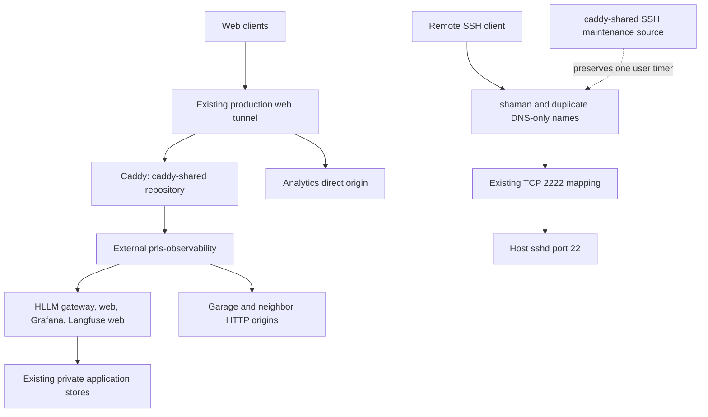

# 1. Shared Caddy and Shaman access ownership transition

- Project: Harden-LLM / proposed private `prls-co/caddy-shared`.
- Version: 3.0, implementation handoff.
- Document ID: `PLAN-HLLM-SHARED-CADDY-001`.
- Date: 2026-09-26.
- Owners: Kirill (scope and remote-device SSH acceptance); implementing agent (HLLM/shared ingress); Analytics maintainer (network attachment); Kirill (unversioned host SSH source and remote acceptance); Ops maintainer (inventory).
- Status: implementation in progress; P00/P01 complete and additive origin source merged to HLLM `main` as `4acde9bfa97c59b2ea0cb66448e929d8c63130f0` (PR #70). P02 remains in progress: the scoped network attachment is deployed, but live checks found a Langfuse bind-address requirement and Analytics issue #15 remains open. Source correction is in branch `codex/shared-caddy-langfuse-bind-20260926`; production Caddy ownership has not changed.
- Source reviewed: Harden-LLM `main`, `4acde9bfa97c59b2ea0cb66448e929d8c63130f0`. Runtime facts below are dated inspection evidence to refresh again before P05; SSH inventory was refreshed at P00.

Move production Caddy and its existing web Cloudflare Tunnel connector into an independent repository, preserve routing, complete Harden-LLM cleanup, then add a duplicate native SSH address. Transfer SSH/Mosh maintenance source last, only after Kirill confirms successful login and fresh reconnect from a remote device. Retain both SSH names permanently. The result separates deployment ownership while keeping ordinary GitHub/Compose workflows and the current single-host architecture.

## 2. Design consensus and trade-offs

| Topic | Verdict | Decision and grounded rationale |
| --- | --- | --- |
| Independent ingress owner | FOR | HLLM currently supplies production Caddy files and app dependencies. Move Caddy plus its web connector together to `caddy-shared`; app outages must not prevent router startup. |
| Shared network | DECISION | Reuse external `prls-observability`, already shared with Garage; retain its existing provisioning owner. Avoid a new network migration project. |
| Traffic sequencing | DECISION | Prepare HLLM first, then transfer the connector's entire route set in one bounded handoff. Its current identity serves several applications, so traffic cannot move independently per repository. |
| Preserve production inputs | FOR | Retain tunnel identity, credentials, DNS, state, pins, TLS, bindings and route policy. Upgrades or rotations add unrelated failure causes. |
| HA, backups and automation framework | AGAINST | No snapshots, backup system, HA rollout, generic router generator, new deployment API or shared runner. A host/router failure still affects consumers. |
| Temporary HTTPS candidate | FOR | Separate hostname, tunnel identity, private connector network and scratch state exercise real public ingress before handoff. Never mix divergent connectors on the production tunnel. |
| Native SSH duplicate | FOR | DNS-only `shaman1.prls.co` points to retained DNS-only `shaman.prls.co`. Same host/port/path: useful for acceptance, not independent disaster recovery. |
| SSH transport migration | AGAINST | Host sshd stays outside Caddy and cloudflared. Keep TCP/2222 to host22 and Mosh UDP60000–60020, keys and authentication. Only maintenance ownership moves. |
| SSH user gate | DECISION | No installed maintenance changes until Kirill personally logs in and reconnects through the duplicate from a remote device. Both names remain afterward. |
| HLLM test/preview edge | FOR | Local smoke and preview Caddy/tunnels are needed isolated fixtures, not obsolete production ownership. Make inherited test Caddy explicit before root removal. |
| Other repositories | DECISION | Create focused GitHub issues; their owners change code. Analytics shared connectivity is a web-cutover prerequisite. The local SSH source has no GitHub owner; record and retire it after the remote-device gate. Unrelated consumer cleanup does not block web completion. |
| Lean verification | DECISION | Use existing Go/Node gates and standard-library Python for new owner checks. No browser or paid provider calls. Tests observe changed boundaries without adding a production control plane. |

Compose merges may retain ports/mounts and resolve paths against the first file. Therefore the candidate is a standalone model, and HLLM merged fixtures are rendered explicitly. [Docker merge rules](https://docs.docker.com/compose/how-tos/multiple-compose-files/merge/).

Cloudflare proxy status changes the addresses returned by DNS; the native SSH names must stay DNS-only. [Cloudflare proxy status](https://developers.cloudflare.com/dns/proxy-status/). Preserve origin server name, HTTP Host and CA verification separately in tunnel configuration. [Cloudflare origin parameters](https://developers.cloudflare.com/cloudflare-one/networks/connectors/cloudflare-tunnel/configure-tunnels/origin-parameters/).

## 3. PRD / stakeholder and system needs

- Problem: a library/application repository owns shared ingress and live bind-mounted routes. Removing it carelessly can disrupt unrelated apps or strand access maintenance.
- Users: HLLM operators/consumers, neighboring service owners, and Kirill connecting remotely to Shaman.
- Value: independent router deployment, smaller HLLM production surface, explicit operational ownership, preserved remote access.
- Business goals: finish the web split without bundling neighbor feature work; preserve robust LLM calls/statistics/history and existing observability; keep development straightforward.
- Success metrics: zero new route regressions; no HLLM runtime mounts or app dependencies in shared ingress; exactly one production Caddy/state writer and one web connector; exactly one SSH updater; two retained direct SSH names; all required source/CI/runtime receipts recorded.
- Scope: static routes, Compose ownership, origin attachments, independent fixtures, shared repository CI, bounded handoff/rollback, duplicate DNS, SSH maintenance source adoption, owner issues and Ops records.
- Non-goals: application API changes, Garage migration, tracing/storage redesign, snapshots, secrets rotation, SSH authentication redesign, browser layout certification, live inference, HA or a second host.
- Dependencies: Docker/Compose and pinned tools; GitHub rights; exact-zone DNS and temporary-tunnel rights; private runtime inputs; existing authorized HTTP account/artifact; Analytics owner adding the gateway to `prls-observability`; Kirill's SSH confirmation; exact local source/install inventory and later source retirement.
- Risks: merged fixture inheritance, old live mounts, mistaken aliases, state double writers, inherited unhealthy neighbors, conflicting `shaman1` record/wildcard, missing management permissions, SSH timer duplication.
- Assumptions: brief web interruptions acceptable; no credential rotation requested; private state is retained in place without a backup project; current production app images can remain while infrastructure source changes.
- Execution boundary: a future instruction must start implementation. Phases may be scheduled separately. Web completion is P06; SSH ownership completion is P08; overall closeout is P09.

### 3.1 Reviewed inventory and prerequisites

| Surface | Recorded state | Required refresh |
| --- | --- | --- |
| Production Caddy | `harden-llm-caddy-1`, ID `69ae2df941e5f68322a729eb26128491f1f519fa5f9b457963c9b77b117a017c`; mounts under this checkout; shared and HLLM-private networks | Refresh exact container ID, source paths, image ID, restart/startup owner before P05 |
| Production connector | `shaman-harden-llm-cloudflared-1`, ID `207f876e7dc12cf061bee3496369e230c0673290d70379d97396bf127aa7c622`; only HLLM private network | Refresh ID/project/config/tunnel identity privately before P05; leave `shaman-api-cloudflared-1` untouched |
| State/bindings | `harden-llm_caddy-data`, `harden-llm_caddy-config`; `127.0.0.1:80:80`, `127.0.0.1:443:443` | Actual physical mounts and loopback bindings |
| HLLM origins | Gateway/Grafana shared; web/Langfuse web private | Alias uniqueness; add only `hllm-prod-web` and `hllm-prod-langfuse` |
| Analytics | Running `prls-analytics-gateway-1` has `analytics-gateway` only on HLLM private network | Owner changes `../prls-analytics/deploy/compose.service.yaml` to add shared alias, retaining attachments; required before P02 exit |
| Neighbor services | Allure, Platform and API origins include pre-existing stopped services. Allure's container exited 2026-09-24T18:39:02Z (exit 137, `OOMKilled=false`); the saved unauthenticated 401 is only Caddy's auth challenge, not an upstream health result. Four other neighbor routes recorded 502. | Preserve route/auth policy and the dated failure classification; do not restart neighbors or claim their upstreams are healthy |
| SSH | Native TCP/2222; user `shaman-public-ssh.timer`; source `../system_setup/public-access/` | Authoritative DNS, installed source/unit, normal timer result, fresh external login |
| Candidate names | `caddy-check.prls.co` for HTTPS; `shaman1.prls.co` for SSH | Exact authoritative record and wildcard ownership; `shaman1` previously resolved Cloudflare addresses, so availability is unproved |

Prepare in an isolated worktree: the running Caddy reads this checkout's bind mounts. Never remove or rewrite those live files before P05 acceptance. Do not attach ingress to another app's private/control network or use a hardcoded container IP to bypass Analytics's missing alias.

## 4. SRS / canonical requirements

Requirements are document-scoped. Acceptance here defines outcomes; executable mappings are in sections 7 and 10.

| ID | Type | Requirement and acceptance criteria |
| --- | --- | --- |
| REQ-001 | func | Production Caddy and web connector have independent `caddy-shared` source/runtime ownership; neither depends on HLLM services, mounts or private network. |
| REQ-002 | func | Preserve the complete inventoried route set, Host/path/query, auth exceptions, headers, caps, redirects and artifact signature behavior; zero new failures relative to a dated, classified baseline. |
| REQ-003 | int | All running retained origins resolve uniquely from `prls-observability`; Analytics direct routing works; only required web-facing HLLM services gain attachments; stores/workers remain private. |
| REQ-004 | security | Preserve verified origin TLS/SNI/CA, private credentials and loopback bindings; isolate candidate identity/state; never disable certificate verification or publish secret evidence. |
| REQ-005 | data | Reuse exact physical production Caddy volumes with at most one writer; candidate/test state is separate; no volume deletion or replacement. |
| REQ-006 | func | HLLM production no longer owns Caddy/routes/edge inputs; explicit isolated backend/frontend smoke and preview fixtures retain their original behavioral assertions. |
| REQ-007 | reliability | Prepare scoped rollback before handoff; readiness decision within 120s, complete web acceptance within 300s; any new regression triggers rollback before cleanup. |
| REQ-008 | int | Retain canonical direct SSH and add a DNS-only duplicate using the same port/host; preserve keys, authentication and Mosh range; canonical record is never deleted. |
| REQ-009 | reliability | Installed SSH maintenance adoption is blocked until Kirill confirms remote duplicate login and a separate reconnect. Silence, server probes and an already-open session cannot satisfy this gate. |
| REQ-010 | func | Shared repo owns the access-specific source, installed behavior stays equivalent, exactly one user timer/updater runs, and old source installation authority is retired by its owner. |
| REQ-011 | nfr | Record verified main commits, hosted CI, component image IDs, runtime owner/URL and acceptance separately; web cleanup finishes before the user SSH wait. |
| REQ-012 | perf | Verification uses bounded lowest-sufficient checks with no browser/provider calls; broad release gate follows existing runner budgets, without duplicate expensive runs for unchanged source. |
| REQ-013 | int | Neighbor code changes go through verified GitHub owner issues; Analytics connectivity and local SSH source retirement have deployment/source evidence before their dependent gates pass. |
| REQ-014 | data | Baselines/evidence are dated and source-bound; store credentials/sessions/signed queries privately; logs contain only safe metadata, fingerprints and outcome summaries. |

Error handling: stop on wrong owner, alias collision, unknown route baseline, TLS failure, missing permission or ambiguous production difference. Preserve redacted diagnostics and existing telemetry. Do not retry an ambiguous state-changing operation, hide skipped checks, manufacture a healthy baseline or weaken an assertion.



```text
C4 context: Kirill/operators + app users -> Shaman host + Cloudflare + GitHub
  caddy-shared repository
    Containers: Caddy + existing web connector
    Interfaces: public HTTPS; external shared bridge; retained Caddy volumes
    Host source: SSH/Mosh maintenance -> existing user timer -> DNS/router
  harden-llm repository
    Containers: gateway, optional web, telemetry, private stores
    Interfaces: OpenAPI/HTTP and shared origin aliases; isolated test/preview edge
  Neighbor repositories
    Own origins and their deployment; communicate through explicit HTTP aliases
  Remote access
    DNS-only names -> existing router mapping -> native host sshd
    No dependency on Caddy/web connector; same host remains a shared failure point
```

## 5. Iterative implementation and test plan

This plan is standards-informed; it makes no ISO/IEEE/FAA compliance or safety-critical assurance claim. Execute one subtask at a time. A recorded RED means the intended invariant failed; an import error, unavailable runner, empty discovery or malformed fixture is not valid failing coverage. Add a grep-able `TEST-###` comment to every created/modified test and register HLLM IDs in `plans/from_utility-llm/harden-llm-self-hosted-test-spec.md` under `SPEC-HARDEN-LLM-SELF-HOSTED-TESTS-001`. Shared IDs are cross-referenced in its README; recheck proposed ID availability before adding them.

All commands below run from the active HLLM checkout/worktree root unless stated otherwise. Proposed shared tests are created in their named RED step before invocation; each provides `unittest.main()` and resolves its repository using `__file__`. They are test code, not a new production management service. Live checks require `CSH_LIVE_READS=1`, fail closed on missing inputs and are excluded from PR CI. Shared CI uses synthetic inputs only.

Compute controls: `branch_limits=2` candidate approaches per blocked design; `reflection_passes=2` (before implementation and before exit); `early_stop%=100` required assertions, not partial coverage. Stop the current mutation immediately on a safety-invariant failure. After two unsuccessful distinct approaches, record the blocker and request the missing decision; do not run an unbounded retry loop. Reliability thresholds require ADR-CSH-004 amendments to change.

### 5.1 Risks, suspension and resumption

| Risk | Trigger | Mitigation / suspension |
| --- | --- | --- |
| SSH loss | Canonical DNS/port/auth drift, missing external session | Stop handoff; preserve canonical and existing session; no sshd/router restart. |
| Wrong origin | Duplicate alias, Analytics absent from shared network | Block P02 exit/P05; issue #15 and deployed alias evidence, no IP workaround. |
| Concurrent state writers | Old and new production Caddy active | Stop candidate immediately; retain old owner until controlled P05 sequence. |
| Live source removal | Planned edit touches running bind mount | Prepare isolated worktree; promote removal only in P06. |
| Fixture regression | Root Caddy removed while smoke still inherits it | Explicit fixture service/config, merged-model regression, existing smoke gate. |
| Unknown neighbor failure | Baseline missing or changed | Classify with owner before cutover; no silently accepted new failure. |
| DNS or tunnel rights missing | Exact operation denied | Suspend only dependent phase; no credential requests in chat or privilege bypass. |
| Duplicate address occupied | Exact/wildcard DNS belongs to another service | Do not overwrite; select an available name with owner agreement and record it. |
| Scope expansion | New network/backup framework or unrelated app fix proposed | Stop that addition; use a separate owner issue. |
| User unavailable | No explicit duplicate SSH confirmation | Stay at P07 after web completion; no time-based automatic approval. |

Resume by refreshing relevant Git heads, dirty state, container/DNS identities, prior gate and private inputs. Re-run evidence invalidated by drift. Never pause mid-handoff with unknown serving ownership: accept or roll back first. Unrelated consumer issues may remain open with owners; Analytics connectivity, user SSH confirmation and old SSH source retirement are mandatory for their dependent completion claims.

Phase metrics below are heuristic planning estimates, not measured availability or certification. Percentages describe expected confidence, durability, effort/risk and avoidable scope/debt; YAGNI is 0–10, where 0 means all work is immediately necessary. Interaction counts estimate touched component/owner boundaries. Configuration checkpoints are phase-boundary records, not implementation subtasks.

### Phase P00: A current route and access baseline exists

- Phase goal: Make every later comparison and rollback refer to identified current resources
- Scope/objectives: REQ-001, REQ-002, REQ-004, REQ-005, REQ-007, REQ-008, REQ-013, REQ-014.
- Impacted surfaces: `docker-compose.yml`, `deploy/caddy/`, `deploy/frontend/`, private production descriptor, Docker, Cloudflare DNS/tunnels, `../system_setup/public-access/`.
- Lifecycle evidence: listed requirements/surfaces; diff and command results; goal acceptance; checkpoint and unresolved risks below.
- Configuration checkpoint: Record heads/dirty trees, private baseline.json, route inventory and retained acceptance inputs; production unchanged.
- Risks/assumptions: Runtime observations can drift; exact DNS/tunnel permissions and alias occupancy are unresolved.
- Estimated metrics: Confidence 90% (known contracts); long-term robustness 94% (explicit gates); internal interactions 3 (components); external interactions 4 (owners); complexity 25% (coordination); feature creep 5% (bounded scope); technical debt 5% (simple contracts); YAGNI 1/10 (needed); MoSCoW Must (dependency); non-local scope (surfaces above); architectural changes 0 (ownership/connectivity).

- P00.S01 Record source and runtime ownership
  - Action: Inspect only allowlisted metadata; capture immutable old IDs, context, image IDs, mounts, volumes, bindings, restart/startup owners and private file paths. Inspect exact-zone/tunnel permissions without exposing credentials
  - Why now: Establish facts before creating source or resources
  - Files/surfaces: Private baseline.json described in section 8; HLLM/source and live edge.
  - Requirement link: REQ-001, REQ-004, REQ-005, REQ-014.
  - Verification link: N/A — bounded inspection.
  - Verification mode: VERIFY.
  - Command/procedure: N/A — bounded inspection using `git status --short --branch`, `git rev-parse HEAD`, `git remote -v`, and selected Docker project/service/image/network/mount/port fields; record source and observed time.
  - Expected result: Baseline contains all required fields; unrelated dirty work remains untouched.
  - Evidence produced: Private baseline plus redacted ownership table.
  - Stop/escalate condition: Unknown context, mount owner or permission; do not dump full environments.
  - Unlocks: P00.S02.

- P00.S02 Record route and SSH acceptance inputs
  - Action: Inventory every connector rule and Caddy site; perform bounded HTTP/DNS/banner observations; classify old failures; locate approved account and existing artifact hash; record canonical SSH and candidate-name ownership
  - Why now: A trustworthy comparison is needed before moving routes
  - Files/surfaces: Section 8 route table, Cloudflare authoritative records, installed SSH unit/timer.
  - Requirement link: REQ-002, REQ-007, REQ-008, REQ-013, REQ-014.
  - Verification link: N/A — bounded inspection.
  - Verification mode: VERIFY.
  - Command/procedure: N/A — inspect each section 8 route with 5s connect/15s total HTTP limits and normal TLS; retain status/safe headers only; read authoritative records and selected `systemctl --user show` fields; never execute the reconciler.
  - Expected result: No unclassified route or conflicting proposed DNS mutation; acceptance fixture exists.
  - Evidence produced: Dated route outcomes, DNS ownership, acceptance-fixture reference and access baseline.
  - Stop/escalate condition: Missing authorized account/artifact, unexplained route difference, or unavailable authoritative DNS.
  - Unlocks: P00.S03.

- P00.S03 Confirm the existing configuration guardrails
  - Action: Execute existing source/scope checks. No refactor needed: this phase gathers evidence without changing runtime behavior
  - Why now: Conclude baseline with the existing deterministic controls
  - Files/surfaces: scripts/test/production_config_test.mjs.
  - Requirement link: REQ-006, REQ-014.
  - Verification link: TEST-233, TEST-234.
  - Verification mode: VERIFY.
  - Command/procedure: `node --test scripts/test/production_config_test.mjs`.
  - Expected result: Existing source precedence/scope/redaction checks pass.
  - Evidence produced: Diff and dated, redacted results at the tested SHA.
  - Stop/escalate condition: Pre-existing failure needs classification before implementation.
  - Unlocks: phase exit.

- Exit gates: proceed when baseline and acceptance prerequisites are complete; unavailable external permissions are explicitly scoped to dependent phases; record blockers and stop on scope expansion.

### Phase P01: The independent web owner passes isolated checks

- Phase goal: Prepare deployable shared source while the existing router serves production
- Scope/objectives: REQ-001, REQ-002, REQ-004, REQ-005, REQ-007, REQ-012, REQ-014.
- Impacted surfaces: `../caddy-shared/compose.yaml`, `Caddyfile`, `routes/*.caddy`, `cloudflared/config.yml`, `.env.example`, `tests/`, `.github/workflows/verify.yml`, `README.md`.
- Lifecycle evidence: listed requirements/surfaces; diff and command results; goal acceptance; checkpoint and unresolved risks below.
- Configuration checkpoint: Publish reviewed shared source/CI checkpoint; retain original owner; no production connector started.
- Risks/assumptions: Candidate must preserve effective source/live differences and literal-dollar auth inputs.
- Estimated metrics: Confidence 88% (known contracts); long-term robustness 94% (explicit gates); internal interactions 5 (components); external interactions 2 (owners); complexity 45% (coordination); feature creep 10% (bounded scope); technical debt 8% (simple contracts); YAGNI 1/10 (needed); MoSCoW Must (dependency); non-local scope (surfaces above); architectural changes 1 (ownership/connectivity).

- P01.S01 Create the repository and failing owner coverage
  - Action: Verify the intended GitHub remote does not already exist; create private prls-co/caddy-shared when absent. Add TestOwner and route fixtures before production Compose/routes. Missing target files must fail descriptive assertions; fixtures self-check before the intended failure
  - Why now: Ownership and policy acceptance precede copied configuration
  - Files/surfaces: ../caddy-shared/tests/test_config.py; ../caddy-shared/tests/test_routes.py.
  - Requirement link: REQ-001, REQ-002, REQ-004, REQ-005, REQ-007, REQ-012, REQ-014.
  - Verification link: TEST-285, TEST-286.
  - Verification mode: RED.
  - Command/procedure: `python3 ../caddy-shared/tests/test_config.py TestOwner`; then `python3 ../caddy-shared/tests/test_routes.py`.
  - Expected result: Both commands discover cases and fail for missing independent owner/routing implementation.
  - Evidence produced: New test files with ID comments; valid RED logs; verified private repository identity.
  - Stop/escalate condition: Repository already exists with conflicting scope; fixture/runner error or zero discovery.
  - Unlocks: P01.S02.

- P01.S02 Implement the two-service shared owner
  - Action: Copy effective routes and original pinned images; declare external state/network, unique caddy-shared alias, private inputs and unchanged loopback ports. Preserve Analytics direct route and all TLS settings. Add synthetic-only CI and README commands; use section 8 construction contract
  - Why now: Failing owner/policy checks define the change
  - Files/surfaces: ../caddy-shared/compose.yaml; Caddyfile; routes/; cloudflared/config.yml; .github/workflows/verify.yml.
  - Requirement link: REQ-001, REQ-002, REQ-004, REQ-005, REQ-007, REQ-012, REQ-014.
  - Verification link: TEST-285, TEST-286.
  - Verification mode: GREEN.
  - Command/procedure: `python3 ../caddy-shared/tests/test_config.py TestOwner`; then `python3 ../caddy-shared/tests/test_routes.py`.
  - Expected result: Same checks pass with actual candidate configuration and real isolated Caddy.
  - Evidence produced: Diff and dated, redacted results at the tested SHA.
  - Stop/escalate condition: Any route loss, TLS bypass, product mount/dependency or production resource used as fixture.
  - Unlocks: P01.S03.

- P01.S03 Measure fixture route isolation
  - Action: Record duration, assertion counts, cleanup and unaffected-route result with one origin deliberately unavailable
  - Why now: Reliability boundary now has an executable candidate
  - Files/surfaces: ../caddy-shared/tests/test_routes.py.
  - Requirement link: REQ-002, REQ-007, REQ-012.
  - Verification link: TEST-286; EVAL-301.
  - Verification mode: MEASURE.
  - Command/procedure: `python3 ../caddy-shared/tests/test_routes.py`.
  - Expected result: EVAL-301 thresholds pass.
  - Evidence produced: Diff and dated, redacted results at the tested SHA.
  - Stop/escalate condition: Timeout or unaffected route fails; do not loosen the threshold.
  - Unlocks: P01.S04.

- P01.S04 Review the owner surface for unnecessary machinery
  - Action: Remove duplication only if found and repeat the same checks. Otherwise record: No refactor needed, because configuration is static and checks use standard-library fixtures
  - Why now: Review the green implementation before publication
  - Files/surfaces: ../caddy-shared production and test files.
  - Requirement link: REQ-001, REQ-004, REQ-014.
  - Verification link: TEST-285, TEST-286.
  - Verification mode: VERIFY.
  - Command/procedure: `python3 ../caddy-shared/tests/test_config.py TestOwner`; then `python3 ../caddy-shared/tests/test_routes.py`.
  - Expected result: Focused source, complete assertions and hosted synthetic CI pass.
  - Evidence produced: Diff and dated, redacted results at the tested SHA.
  - Stop/escalate condition: Unnecessary generator/deploy service, leaked secret or incomplete assertion transfer.
  - Unlocks: phase exit.

- Exit gates: proceed when independent owner/route checks and shared CI pass, with production still on the original owner; record blockers and stop on scope expansion.

### Phase P02: Shared ingress can reach every required running origin

- Phase goal: Add only needed HLLM attachments and obtain deployed Analytics connectivity
- Scope/objectives: REQ-003, REQ-011, REQ-012, REQ-013.
- Impacted surfaces: `deploy/frontend/compose.frontend.yml`, `deploy/langfuse/compose.private.yml`, `internal/deploytest/shared_caddy_test.go`, private HLLM descriptor, Analytics owner issue.
- Lifecycle evidence: listed requirements/surfaces; diff and command results; goal acceptance; checkpoint and unresolved risks below.
- Configuration checkpoint: Promote additive HLLM commit after checks; record two-service apply and deployed Analytics alias; no production Caddy removal.
- Risks/assumptions: Analytics is a real external prerequisite; do not substitute another gateway/IP.
- Estimated metrics: Confidence 82% (known contracts); long-term robustness 93% (explicit gates); internal interactions 4 (components); external interactions 3 (owners); complexity 40% (coordination); feature creep 8% (bounded scope); technical debt 8% (simple contracts); YAGNI 1/10 (needed); MoSCoW Must (dependency); non-local scope (surfaces above); architectural changes 1 (ownership/connectivity).

- P02.S01 Add failing additive attachment assertions
  - Action: Create TestSharedIngressAttachments for web/Langfuse web private-plus-shared aliases and exclusion of stores/workers
  - Why now: Capture intended network delta before editing overlays
  - Files/surfaces: internal/deploytest/shared_caddy_test.go.
  - Requirement link: REQ-003, REQ-012.
  - Verification link: TEST-287.
  - Verification mode: RED.
  - Command/procedure: `go test ./internal/deploytest/... -run ^TestSharedIngressAttachments$ -count=1`.
  - Expected result: Fails on absent hllm-prod-web and hllm-prod-langfuse attachments.
  - Evidence produced: Diff and dated, redacted results at the tested SHA.
  - Stop/escalate condition: Test passes without proving current missing attachments.
  - Unlocks: P02.S02.

- P02.S02 Add the HLLM origin attachments and bind Langfuse on both interfaces
  - Action: Use mapping networks with existing harden-private plus prls-observability aliases hllm-prod-web and hllm-prod-langfuse. Set only `langfuse-web` `HOSTNAME: 0.0.0.0`; preserve its image/URLs and every existing attachment. Keep Langfuse worker and stores private. This bind is required because the live image was listening only on `eth0` after the second network was attached.
  - Why now: Cheap failure identifies the bounded source edit
  - Files/surfaces: deploy/frontend/compose.frontend.yml; deploy/langfuse/compose.private.yml.
  - Requirement link: REQ-003, REQ-012.
  - Verification link: TEST-287.
  - Verification mode: GREEN.
  - Command/procedure: `go test ./internal/deploytest/... -run ^TestSharedIngressAttachments$ -count=1`.
  - Expected result: Same assertions pass; only the two intended service network definitions and Langfuse web's required bind setting change.
  - Evidence produced: Diff and dated, redacted results at the tested SHA.
  - Stop/escalate condition: Alias conflict or unintended store/worker/public URL change.
  - Unlocks: P02.S03.

- P02.S03 Add failing live origin acceptance
  - Action: Add TestOrigins with baseline-driven unique target identity and response assertions. Create/update focused Analytics GitHub issue after remote/duplicate inspection; owner adds shared alias while retaining current attachments
  - Why now: Source correctness is insufficient for production origin reachability
  - Files/surfaces: ../caddy-shared/tests/test_live.py; ../prls-analytics/deploy/compose.service.yaml via owner issue.
  - Requirement link: REQ-003, REQ-013.
  - Verification link: TEST-288.
  - Verification mode: RED.
  - Command/procedure: `CSH_LIVE_READS=1 python3 ../caddy-shared/tests/test_live.py TestOrigins`.
  - Expected result: Fails on current missing deployed origins with selected metadata evidence.
  - Evidence produced: Diff and dated, redacted results at the tested SHA.
  - Stop/escalate condition: Unknown target identity or an unrelated live mutation in the probe.
  - Unlocks: P02.S04.

- P02.S04 Deploy the additive source and accept Analytics connectivity
  - Action: Run make test-fast with pinned PATH, publish verified source through main checks, then section 8 scoped two-service production-config apply. Add `langfuse-web` to the private descriptor using its current container/image identity; allow `networks` and the exact required `HOSTNAME` environment difference only. HLLM web remains networks-only. Retain all other descriptor identities/allowances. Analytics owner deploys its change; do not modify that checkout.
  - Why now: Both source and live failing checks exist; old ingress stays serving
  - Files/surfaces: HLLM overlays/private descriptor; Analytics issue/runtime.
  - Requirement link: REQ-003, REQ-011, REQ-013.
  - Verification link: TEST-288.
  - Verification mode: GREEN.
  - Command/procedure: `make test-fast`; section 8.3 scoped check/apply; then `CSH_LIVE_READS=1 python3 ../caddy-shared/tests/test_live.py TestOrigins`.
  - Expected result: All running origins respond from shared network; existing public HLLM path unchanged.
  - Evidence produced: Diff and dated, redacted results at the tested SHA.
  - Stop/escalate condition: Unreviewed config difference, missing Analytics owner deployment or failed hosted check.
  - Unlocks: P02.S05.

- P02.S05 Measure shared-network reachability
  - Action: Record alias uniqueness, origin identity and request duration for every retained running origin
  - Why now: Readiness of the new owner depends on these exact connections
  - Files/surfaces: ../caddy-shared/tests/test_live.py.
  - Requirement link: REQ-003, REQ-012, REQ-013.
  - Verification link: TEST-288; EVAL-302.
  - Verification mode: MEASURE.
  - Command/procedure: `CSH_LIVE_READS=1 python3 ../caddy-shared/tests/test_live.py TestOrigins`.
  - Expected result: EVAL-302 passes, including Analytics.
  - Evidence produced: Diff and dated, redacted results at the tested SHA.
  - Stop/escalate condition: Any wrong/duplicate alias or unexplained response change.
  - Unlocks: P02.S06.

- P02.S06 Confirm attachment scope remains small
  - Action: No refactor needed: two explicit service attachments reuse the existing external network
  - Why now: Close connectivity independently from ownership removal
  - Files/surfaces: internal/deploytest/shared_caddy_test.go; ../caddy-shared/tests/test_live.py.
  - Requirement link: REQ-003, REQ-012.
  - Verification link: TEST-287, TEST-288.
  - Verification mode: VERIFY.
  - Command/procedure: `go test ./internal/deploytest/... -run ^TestSharedIngressAttachments$ -count=1`; then `CSH_LIVE_READS=1 python3 ../caddy-shared/tests/test_live.py TestOrigins`.
  - Expected result: No private-store expansion or app image change.
  - Evidence produced: Diff and dated, redacted results at the tested SHA.
  - Stop/escalate condition: Runtime/source mismatch or missing baseline comparison.
  - Unlocks: phase exit.

- Exit gates: proceed when additive source/CI and all running shared origins pass; known stopped neighbors have dated contracts and owner issues; record blockers and stop on scope expansion.

### Phase P03: HLLM removal and isolated fixtures are release-ready

- Phase goal: Prepare a fully tested final HLLM tree without altering live edge mounts
- Scope/objectives: REQ-001, REQ-002, REQ-006, REQ-012, REQ-014.
- Impacted surfaces: `docker-compose.yml`, production-config and descriptors, `deploy/images.lock.json`, smoke fixtures, deploy tests, test tier manifest, current docs.
- Lifecycle evidence: listed requirements/surfaces; diff and command results; goal acceptance; checkpoint and unresolved risks below.
- Configuration checkpoint: Commit final removal in isolated worktree; retain test/CI evidence; do not promote it into live checkout until P06.
- Risks/assumptions: Root inheritance and tagged-test omission can create false passing fast gates.
- Estimated metrics: Confidence 88% (known contracts); long-term robustness 95% (explicit gates); internal interactions 7 (components); external interactions 2 (owners); complexity 60% (coordination); feature creep 10% (bounded scope); technical debt 8% (simple contracts); YAGNI 1/10 (needed); MoSCoW Must (dependency); local scope (surfaces above); architectural changes 1 (ownership/connectivity).

- P03.S01 Add failing final ownership and fixture assertions
  - Action: Add TestSharedIngressOwnership; rename existing tagged function to TestComposeDeploymentContract and update its ownership oracle without dropping retained invariants. Extend source/scope tests for edge removal. Add grep-able IDs and catalog entries before implementation
  - Why now: Production removal and fixture preservation require explicit failing coverage
  - Files/surfaces: internal/deploytest/shared_caddy_test.go; internal/deploytest/compose_caddy_test.go; scripts/test/production_config_test.mjs.
  - Requirement link: REQ-001, REQ-006, REQ-012, REQ-014.
  - Verification link: TEST-289, TEST-033, TEST-233, TEST-234.
  - Verification mode: RED.
  - Command/procedure: `go test ./internal/deploytest/... -run ^TestSharedIngressOwnership$ -count=1`; then `go test -tags=compose ./internal/deploytest/... -run ^TestComposeDeploymentContract$ -count=1`; then `node --test scripts/test/production_config_test.mjs`.
  - Expected result: New ownership/fixture assertions fail against current production Caddy; unchanged guardrails retain their purpose.
  - Evidence produced: Diff and dated, redacted results at the tested SHA.
  - Stop/escalate condition: Wrong assertion oracle, missing test discovery, or mechanical count changes.
  - Unlocks: P03.S02.

- P03.S02 Remove production edge ownership and make fixtures explicit
  - Action: Apply section 8.4 file checklist: remove production service/routes/inputs, add complete backend and frontend test Caddy, preserve preview edge, transfer shared-route assertions and register tagged contract for release
  - Why now: All changed ownership/fixture invariants have failing checks
  - Files/surfaces: Section 8.4 exact HLLM file checklist.
  - Requirement link: REQ-001, REQ-002, REQ-006, REQ-012, REQ-014.
  - Verification link: TEST-289, TEST-033, TEST-233, TEST-234.
  - Verification mode: GREEN.
  - Command/procedure: `go test ./internal/deploytest/... -run ^TestSharedIngressOwnership$ -count=1`; then `go test -tags=compose ./internal/deploytest/... -run ^TestComposeDeploymentContract$ -count=1`; then `node --test scripts/test/production_config_test.mjs`.
  - Expected result: Same checks pass; assertion transfer ledger has no lost policy coverage.
  - Evidence produced: Diff and dated, redacted results at the tested SHA.
  - Stop/escalate condition: Live bind-mounted tree edited, missing preview/smoke inputs or altered application contract.
  - Unlocks: P03.S03.

- P03.S03 Certify the prepared final HLLM tree
  - Action: Execute native interpolation, broad fast gate and browser-free release gate once on the final tree; retain individual task results
  - Why now: Full Compose/trace/artifact boundaries remain distinct from static assertions
  - Files/surfaces: Makefile; test/test-tiers.json; affected deployment/test files.
  - Requirement link: REQ-002, REQ-006, REQ-012, REQ-014.
  - Verification link: TEST-235, TEST-034, TEST-033; EVAL-303.
  - Verification mode: MEASURE.
  - Command/procedure: `make test-production-config`; `make test-fast`; `make test-release` (includes TEST-034 and registered TEST-033).
  - Expected result: EVAL-303 passes; required tasks executed, including tagged contract and existing smoke.
  - Evidence produced: Diff and dated, redacted results at the tested SHA.
  - Stop/escalate condition: Any skipped required task, browser/provider launch or assertion weakening.
  - Unlocks: P03.S04.

- P03.S04 Review removed assertions and retained fixtures
  - Action: No refactor needed if the result has one owner per production assertion and explicit test fixtures; otherwise simplify duplication and repeat affected checks
  - Why now: Prevent deletion from masquerading as successful migration
  - Files/surfaces: internal/deploytest/prls_observability_test.go; explicit smoke configs; assertion transfer ledger.
  - Requirement link: REQ-001, REQ-006, REQ-012.
  - Verification link: TEST-289, TEST-033.
  - Verification mode: VERIFY.
  - Command/procedure: `go test ./internal/deploytest/... -run ^TestSharedIngressOwnership$ -count=1`; then `go test -tags=compose ./internal/deploytest/... -run ^TestComposeDeploymentContract$ -count=1`.
  - Expected result: Production backend count 13, optional web/initializer separate, smoke required count 15 and frontend fixture count 16 retained.
  - Evidence produced: Diff and dated, redacted results at the tested SHA.
  - Stop/escalate condition: Unmapped deleted assertion or fixture tied to production network/state.
  - Unlocks: phase exit.

- Exit gates: proceed when prepared removal tree passes local and hosted required checks, with no change to live mounted source; record blockers and stop on scope expansion.

### Phase P04: A temporary public HTTPS path proves the candidate

- Phase goal: Exercise candidate public TLS and origin forwarding before production ownership changes
- Scope/objectives: REQ-004, REQ-005, REQ-007.
- Impacted surfaces: `../caddy-shared/compose.canary.yaml`, `cloudflared/config.canary.yml`, candidate DNS/tunnel, scratch state.
- Lifecycle evidence: listed requirements/surfaces; diff and command results; goal acceptance; checkpoint and unresolved risks below.
- Configuration checkpoint: Record exact candidate SHA/IDs/results; production DNS/tunnel/state unchanged; stop candidate processes before P05.
- Risks/assumptions: Separate origin Host, SNI and CA; no assumption that shaman1 is an HTTPS test name.
- Estimated metrics: Confidence 80% (known contracts); long-term robustness 94% (explicit gates); internal interactions 4 (components); external interactions 3 (owners); complexity 55% (coordination); feature creep 10% (bounded scope); technical debt 8% (simple contracts); YAGNI 1/10 (needed); MoSCoW Must (dependency); non-local scope (surfaces above); architectural changes 1 (ownership/connectivity).

- P04.S01 Add failing candidate isolation and public-path checks
  - Action: Create TestCanary classes for static isolation and live identity/readyz. Use actual candidate absence as live RED; fixture errors do not count
  - Why now: Public candidate must have independent identity/state before startup
  - Files/surfaces: ../caddy-shared/tests/test_config.py; ../caddy-shared/tests/test_live.py.
  - Requirement link: REQ-004, REQ-005, REQ-007.
  - Verification link: TEST-296, TEST-290.
  - Verification mode: RED.
  - Command/procedure: `python3 ../caddy-shared/tests/test_config.py TestCanary`; then `CSH_LIVE_READS=1 python3 ../caddy-shared/tests/test_live.py TestCanary`.
  - Expected result: Missing canary resources/path fail the intended assertions.
  - Evidence produced: Diff and dated, redacted results at the tested SHA.
  - Stop/escalate condition: Any probe reaches production and claims it is the candidate.
  - Unlocks: P04.S02.

- P04.S02 Create the isolated HTTPS candidate
  - Action: Use section 8.5 standalone Compose and available caddy-check hostname with separate temporary tunnel. Copy only its public scratch root certificate to tunnel trust; use actual API Host/SNI
  - Why now: Isolation and forwarding failures are defined
  - Files/surfaces: ../caddy-shared/compose.canary.yaml; cloudflared/config.canary.yml; temporary DNS/tunnel.
  - Requirement link: REQ-004, REQ-005, REQ-007.
  - Verification link: TEST-296, TEST-290.
  - Verification mode: GREEN.
  - Command/procedure: `python3 ../caddy-shared/tests/test_config.py TestCanary`; then `CSH_LIVE_READS=1 python3 ../caddy-shared/tests/test_live.py TestCanary`.
  - Expected result: Same checks pass through actual candidate with normal public and origin TLS.
  - Evidence produced: Diff and dated, redacted results at the tested SHA.
  - Stop/escalate condition: Production identity/state/ports reused, wrong CA, or DNS name owned by another service.
  - Unlocks: P04.S03.

- P04.S03 Measure candidate readiness and identity
  - Action: Record public TLS, origin identity, duration and unchanged production resource fingerprints
  - Why now: A successful response alone could come from the wrong owner
  - Files/surfaces: ../caddy-shared/tests/test_live.py.
  - Requirement link: REQ-004, REQ-007.
  - Verification link: TEST-290; EVAL-304.
  - Verification mode: MEASURE.
  - Command/procedure: `CSH_LIVE_READS=1 python3 ../caddy-shared/tests/test_live.py TestCanary`.
  - Expected result: EVAL-304 passes.
  - Evidence produced: Diff and dated, redacted results at the tested SHA.
  - Stop/escalate condition: Timeout, wrong owner or unverified TLS.
  - Unlocks: P04.S04.

- P04.S04 Confirm candidate isolation before handoff
  - Action: No refactor needed: standalone model prevents inherited production mounts/ports. Stop only candidate processes before P05; retain their acceptance evidence
  - Why now: Avoid collisions during final production deployment
  - Files/surfaces: ../caddy-shared/compose.canary.yaml.
  - Requirement link: REQ-004, REQ-005, REQ-007.
  - Verification link: TEST-296.
  - Verification mode: VERIFY.
  - Command/procedure: `python3 ../caddy-shared/tests/test_config.py TestCanary`.
  - Expected result: Static isolation remains valid; no candidate writer or port conflict remains.
  - Evidence produced: Diff and dated, redacted results at the tested SHA.
  - Stop/escalate condition: Ambiguous process identity or shared production volume.
  - Unlocks: phase exit.

- Exit gates: proceed when public candidate and shared main CI pass and the HLLM final tree has release evidence; record blockers and stop on scope expansion.

### Phase P05: Production web ingress runs under the shared owner

- Phase goal: Transfer the existing entire production connector route set and accept or roll back
- Scope/objectives: REQ-001, REQ-002, REQ-004, REQ-005, REQ-007, REQ-011.
- Impacted surfaces: Production Caddy/web connector, retained volumes, shared main, route baseline, external SSH session.
- Lifecycle evidence: listed requirements/surfaces; diff and command results; goal acceptance; checkpoint and unresolved risks below.
- Configuration checkpoint: Record old/new IDs, source and image identities, interruption time, all route outcomes; retain stopped original containers until P06.
- Risks/assumptions: No simultaneous production writers/connectors; no whole-stack down or host restart.
- Estimated metrics: Confidence 82% (known contracts); long-term robustness 95% (explicit gates); internal interactions 5 (components); external interactions 4 (owners); complexity 65% (coordination); feature creep 5% (bounded scope); technical debt 5% (simple contracts); YAGNI 1/10 (needed); MoSCoW Must (dependency); non-local scope (surfaces above); architectural changes 1 (ownership/connectivity).

- P05.S01 Add failing production ownership acceptance
  - Action: Create TestIngress covering shared ownership plus preserved route behavior; obtain CHECK-001 fresh external login and keep session open; refresh immediate baseline and rollback IDs
  - Why now: All required preflight evidence must precede the interruption
  - Files/surfaces: ../caddy-shared/tests/test_live.py; private baseline/acceptance inputs.
  - Requirement link: REQ-001, REQ-002, REQ-004, REQ-005, REQ-007, REQ-011.
  - Verification link: TEST-291; CHECK-001.
  - Verification mode: RED.
  - Command/procedure: `CSH_LIVE_READS=1 python3 ../caddy-shared/tests/test_live.py TestIngress`; CHECK-001 procedure in section 7.4.
  - Expected result: Intended shared-owner assertion fails while old-owner routes are recorded; external login succeeds.
  - Evidence produced: Diff and dated, redacted results at the tested SHA.
  - Stop/escalate condition: Unavailable login/account/artifact, stale baseline, missing pre-pulled image or failing required CI.
  - Unlocks: P05.S02.

- P05.S02 Transfer the production Caddy and connector
  - Action: Execute section 8.6 exact scoped order: old connector stop, old Caddy stop, new Caddy start/verified origin, new connector start with retained identity. Run acceptance immediately; roll back on any new regression
  - Why now: Source, origin and candidate gates passed and live failing coverage exists
  - Files/surfaces: Shared production Compose, immutable old IDs, original state/TLS/DNS.
  - Requirement link: REQ-001, REQ-002, REQ-004, REQ-005, REQ-007, REQ-011.
  - Verification link: TEST-291.
  - Verification mode: GREEN.
  - Command/procedure: Section 8.6 handoff/rollback recipe; then `CSH_LIVE_READS=1 python3 ../caddy-shared/tests/test_live.py TestIngress`.
  - Expected result: Same command passes with exactly one shared owner and preserved behavior.
  - Evidence produced: Diff and dated, redacted results at the tested SHA.
  - Stop/escalate condition: Readiness unresolved at 120s, acceptance exceeds 300s, or any new route/TLS/auth/state regression.
  - Unlocks: P05.S03.

- P05.S03 Measure public acceptance and independent SSH
  - Action: Record interruption/readiness/acceptance duration, per-route comparison, signed artifact hash and another fresh external canonical SSH login
  - Why now: Production identity transfer needs measured end-to-end evidence
  - Files/surfaces: ../caddy-shared/tests/test_live.py; remote SSH client.
  - Requirement link: REQ-002, REQ-007, REQ-008, REQ-011.
  - Verification link: TEST-291; EVAL-305; CHECK-001.
  - Verification mode: MEASURE.
  - Command/procedure: `CSH_LIVE_READS=1 python3 ../caddy-shared/tests/test_live.py TestIngress`; CHECK-001 fresh reconnect procedure.
  - Expected result: EVAL-305 and CHECK-001 pass; no new regression.
  - Evidence produced: Diff and dated, redacted results at the tested SHA.
  - Stop/escalate condition: New failure requires immediate rollback before cleanup.
  - Unlocks: P05.S04.

- P05.S04 Confirm the accepted owner and rollback boundary
  - Action: No refactor needed: retain the tested candidate configuration without opportunistic changes
  - Why now: Finish acceptance before deleting original restartable resources
  - Files/surfaces: Shared Compose/source; old stopped container IDs.
  - Requirement link: REQ-001, REQ-005, REQ-007, REQ-011.
  - Verification link: TEST-291.
  - Verification mode: VERIFY.
  - Command/procedure: `CSH_LIVE_READS=1 python3 ../caddy-shared/tests/test_live.py TestIngress`.
  - Expected result: Accepted shared owner matches recorded main; old owner stopped; proceed directly to P06 cleanup.
  - Evidence produced: Diff and dated, redacted results at the tested SHA.
  - Stop/escalate condition: Owner drift or unaccepted route; roll back while old containers remain.
  - Unlocks: phase exit.

- Exit gates: proceed when all public acceptance and external SSH checks pass; otherwise restore old owner and stop the phase; record blockers and stop on scope expansion.

### Phase P06: HLLM web ownership is fully retired

- Phase goal: Complete HLLM production cleanup before waiting for duplicate SSH acceptance
- Scope/objectives: REQ-001, REQ-006, REQ-011.
- Impacted surfaces: Prepared HLLM removal commit, actual private descriptor, original edge containers/startup configuration, temporary HTTPS resources.
- Lifecycle evidence: listed requirements/surfaces; diff and command results; goal acceptance; checkpoint and unresolved risks below.
- Configuration checkpoint: Promote verified HLLM final tree to main; record final descriptor/runtime and shared main; web transition complete.
- Risks/assumptions: Old-container start rollback ends only after accepted source/runtime handoff.
- Estimated metrics: Confidence 90% (known contracts); long-term robustness 95% (explicit gates); internal interactions 5 (components); external interactions 3 (owners); complexity 45% (coordination); feature creep 5% (bounded scope); technical debt 5% (simple contracts); YAGNI 1/10 (needed); MoSCoW Must (dependency); non-local scope (surfaces above); architectural changes 0 (ownership/connectivity).

- P06.S01 Add failing retired-owner acceptance
  - Action: Add TestHllmOwner checking actual descriptor, mounts, old container/startup inventory, canary resources and unchanged app image identities
  - Why now: P05 traffic success does not establish legacy owner removal
  - Files/surfaces: ../caddy-shared/tests/test_live.py.
  - Requirement link: REQ-001, REQ-006, REQ-011.
  - Verification link: TEST-292.
  - Verification mode: RED.
  - Command/procedure: `CSH_LIVE_READS=1 python3 ../caddy-shared/tests/test_live.py TestHllmOwner`.
  - Expected result: Fails on remaining old owner/removal source or temporary resources.
  - Evidence produced: Diff and dated, redacted results at the tested SHA.
  - Stop/escalate condition: Only documentation checked while runtime remains unexamined.
  - Unlocks: P06.S02.

- P06.S02 Promote the removal and retire obsolete resources
  - Action: Merge/push tested removal to main with required CI; update private descriptor separately. Remove exact stopped old edge containers without volumes; retire only their startup definitions and temporary HTTPS DNS/tunnel/scratch resources. Preserve all unrelated connectors/preview infrastructure
  - Why now: Accepted shared owner no longer reads HLLM source; removal coverage is RED
  - Files/surfaces: Section 8.4 HLLM files; private production descriptor; exact retired resource IDs.
  - Requirement link: REQ-001, REQ-006, REQ-011.
  - Verification link: TEST-292.
  - Verification mode: GREEN.
  - Command/procedure: Section 8.6 cleanup rules; then `CSH_LIVE_READS=1 python3 ../caddy-shared/tests/test_live.py TestHllmOwner`.
  - Expected result: Same check passes; no HLLM ownership path can restart old edge; app images unchanged.
  - Evidence produced: Diff and dated, redacted results at the tested SHA.
  - Stop/escalate condition: Cleanup references ambiguous resource, active original writer or shared volume.
  - Unlocks: P06.S03.

- P06.S03 Measure web completion after cleanup
  - Action: Repeat runtime-owner and public-route acceptance; compare app image IDs and identify new rollback owner
  - Why now: Cleanup itself can reveal hidden dependencies
  - Files/surfaces: ../caddy-shared/tests/test_live.py.
  - Requirement link: REQ-001, REQ-002, REQ-006, REQ-011.
  - Verification link: TEST-292, TEST-291; EVAL-306.
  - Verification mode: MEASURE.
  - Command/procedure: `CSH_LIVE_READS=1 python3 ../caddy-shared/tests/test_live.py TestHllmOwner`; then `CSH_LIVE_READS=1 python3 ../caddy-shared/tests/test_live.py TestIngress`.
  - Expected result: EVAL-306 passes; shared-repo configuration rollback is now documented.
  - Evidence produced: Diff and dated, redacted results at the tested SHA.
  - Stop/escalate condition: Any new failure or HLLM bind mount remains.
  - Unlocks: P06.S04.

- P06.S04 Confirm production and fixture ownership are separate
  - Action: No refactor needed: HLLM retains only application deployment and isolated test/preview edge
  - Why now: Close the web transition before the SSH user wait
  - Files/surfaces: internal/deploytest/shared_caddy_test.go; internal/deploytest/compose_caddy_test.go.
  - Requirement link: REQ-001, REQ-006, REQ-012.
  - Verification link: TEST-289, TEST-033.
  - Verification mode: VERIFY.
  - Command/procedure: `go test ./internal/deploytest/... -run ^TestSharedIngressOwnership$ -count=1`; then `go test -tags=compose ./internal/deploytest/... -run ^TestComposeDeploymentContract$ -count=1`.
  - Expected result: Source checks and published main agree with live cleanup.
  - Evidence produced: Diff and dated, redacted results at the tested SHA.
  - Stop/escalate condition: Missing final-main CI or final source differs materially from certified tree.
  - Unlocks: phase exit.

- Exit gates: proceed when web source, CI, runtime, cleanup and rollback records are complete; SSH may remain under its old maintainer safely; record blockers and stop on scope expansion.

### Phase P07: The duplicate SSH address is accepted by Kirill

- Phase goal: Add a second direct address while preserving current installed access maintenance
- Scope/objectives: REQ-008, REQ-009, REQ-010.
- Impacted surfaces: Authoritative DNS, `../caddy-shared/ssh/access.json`, staged SSH source, `docs/ssh-access.md`, private user receipt.
- Lifecycle evidence: listed requirements/surfaces; diff and command results; goal acceptance; checkpoint and unresolved risks below.
- Configuration checkpoint: Publish staged source and both-address docs; record explicit remote login/reconnect receipt; old installed owner remains.
- Risks/assumptions: Name availability unproved; public banner/DNS cannot prove authenticated remote access.
- Estimated metrics: Confidence 85% (known contracts); long-term robustness 94% (explicit gates); internal interactions 3 (components); external interactions 3 (owners); complexity 40% (coordination); feature creep 5% (bounded scope); technical debt 5% (simple contracts); YAGNI 1/10 (needed); MoSCoW Must (dependency); non-local scope (surfaces above); architectural changes 0 (ownership/connectivity).

- P07.S01 Add failing duplicate-address and access-contract checks
  - Action: Create TestContract and TestAlias before adding DNS/staged source; include pending-receipt case that rejects adoption state. Inspect exact authoritative name/wildcard owner again
  - Why now: Preserve original access and define the human gate before adding alias
  - Files/surfaces: ../caddy-shared/tests/test_ssh.py.
  - Requirement link: REQ-008, REQ-009, REQ-010.
  - Verification link: TEST-297, TEST-293.
  - Verification mode: RED.
  - Command/procedure: `python3 ../caddy-shared/tests/test_ssh.py TestContract`; then `CSH_LIVE_READS=1 python3 ../caddy-shared/tests/test_ssh.py TestAlias`.
  - Expected result: Missing duplicate/source contract fails; pending receipt cannot authorize adoption.
  - Evidence produced: Diff and dated, redacted results at the tested SHA.
  - Stop/escalate condition: Existing proposed name belongs to another service, or tests change DNS themselves.
  - Unlocks: P07.S02.

- P07.S02 Add the duplicate DNS and stage unchanged maintenance source
  - Action: Create available DNS-only CNAME to canonical shaman.prls.co; stage section 8.7 exact source files and installed service definition with private references only. Do not install/restart anything
  - Why now: Failing checks describe the additive change; web work is finished
  - Files/surfaces: Authoritative duplicate record; ../caddy-shared/ssh/; docs/ssh-access.md.
  - Requirement link: REQ-008, REQ-009, REQ-010.
  - Verification link: TEST-297, TEST-293.
  - Verification mode: GREEN.
  - Command/procedure: `python3 ../caddy-shared/tests/test_ssh.py TestContract`; then `CSH_LIVE_READS=1 python3 ../caddy-shared/tests/test_ssh.py TestAlias`.
  - Expected result: Same commands pass; original A record, installed files, ports, keys and timer unchanged.
  - Evidence produced: Diff and dated, redacted results at the tested SHA.
  - Stop/escalate condition: Canonical DNS mutation, proxy enabled, source/installed discrepancy or attempted reinstall.
  - Unlocks: P07.S03.

- P07.S03 Measure duplicate connectivity and present remote commands
  - Action: Record canonical/duplicate DNS and banner observations; give Kirill exact new-address SSH command and trusted host-key fingerprint via established channel
  - Why now: User testing should start only after server-side prerequisites pass
  - Files/surfaces: ../caddy-shared/tests/test_ssh.py; docs/ssh-access.md.
  - Requirement link: REQ-008, REQ-009.
  - Verification link: TEST-293; EVAL-307.
  - Verification mode: MEASURE.
  - Command/procedure: `CSH_LIVE_READS=1 python3 ../caddy-shared/tests/test_ssh.py TestAlias`.
  - Expected result: EVAL-307 passes; limitations clearly distinguish duplicate name from independent failover.
  - Evidence produced: Diff and dated, redacted results at the tested SHA.
  - Stop/escalate condition: Wrong destination/key; never bypass host-key checking.
  - Unlocks: P07.S04.

- P07.S04 Record Kirill’s explicit remote acceptance
  - Action: Keep all original access running. Ask Kirill to execute CHECK-002 login, disconnect and reconnect from a remote device; record confirmation only after his reply
  - Why now: This is the explicit user-controlled boundary before any installed ownership change
  - Files/surfaces: Private access-confirmation.json.
  - Requirement link: REQ-009.
  - Verification link: CHECK-002.
  - Verification mode: VERIFY.
  - Command/procedure: CHECK-002 in section 7.4; no server-side command substitutes for the two user connections.
  - Expected result: Kirill confirms both successful connections through the actual chosen alias.
  - Evidence produced: Actual user message reference, tested alias/device category and login/reconnect timestamps.
  - Stop/escalate condition: No reply, ambiguous reply or failure: remain at this step indefinitely.
  - Unlocks: P07.S05.

- P07.S05 Confirm the staged source still preserves access
  - Action: No refactor needed: this phase adds an alias and records unchanged maintenance source
  - Why now: Guard against drift during the human wait
  - Files/surfaces: ../caddy-shared/tests/test_ssh.py; staged access files.
  - Requirement link: REQ-008, REQ-009, REQ-010.
  - Verification link: TEST-297, TEST-293.
  - Verification mode: VERIFY.
  - Command/procedure: `python3 ../caddy-shared/tests/test_ssh.py TestContract`; then `CSH_LIVE_READS=1 python3 ../caddy-shared/tests/test_ssh.py TestAlias`.
  - Expected result: Both names and unchanged installed owner match the accepted contract.
  - Evidence produced: Diff and dated, redacted results at the tested SHA.
  - Stop/escalate condition: DNS/source drift after user test invalidates dependent evidence.
  - Unlocks: phase exit.

- Exit gates: proceed when both automated checks and explicit CHECK-002 pass; without confirmation P08 remains blocked and canonical stays active; record blockers and stop on scope expansion.

### Phase P08: One shared repository owns SSH maintenance

- Phase goal: Adopt equivalent access maintenance under shared source with exactly one updater
- Scope/objectives: REQ-008, REQ-009, REQ-010, REQ-013.
- Impacted surfaces: `../caddy-shared/ssh/`, stable installed paths/user unit, unversioned local source retirement.
- Lifecycle evidence: listed requirements/surfaces; diff and command results; goal acceptance; checkpoint and unresolved risks below.
- Configuration checkpoint: Shared main and deployed source recorded; exact unversioned source retirement and hashes recorded; both names retained.
- Risks/assumptions: A successful oneshot is normally inactive afterward; inspect exit result, not active state alone.
- Estimated metrics: Confidence 84% (known contracts); long-term robustness 95% (explicit gates); internal interactions 4 (components); external interactions 3 (owners); complexity 50% (coordination); feature creep 5% (bounded scope); technical debt 5% (simple contracts); YAGNI 1/10 (needed); MoSCoW Must (dependency); non-local scope (surfaces above); architectural changes 1 (ownership/connectivity).

- P08.S01 Add failing installed-owner acceptance
  - Action: Create TestOwner checking valid user receipt, installed/source equivalence, single timer, post-handoff scheduled result and retirement of old installation authority
  - Why now: Human gate passed; ownership consolidation still lacks runtime/source proof
  - Files/surfaces: `../caddy-shared/tests/test_ssh.py`; private local receipt and installed access-specific files under `/home/kirill/p/system_setup/public-access/`.
  - Requirement link: REQ-009, REQ-010, REQ-013.
  - Verification link: TEST-294.
  - Verification mode: RED.
  - Command/procedure: `CSH_LIVE_READS=1 python3 ../caddy-shared/tests/test_ssh.py TestOwner`.
  - Expected result: Fails because old source/installer is still authoritative; no installed changes occur.
  - Evidence produced: Diff and dated, redacted results at the tested SHA.
  - Stop/escalate condition: Receipt missing or synthetic, checks invoke live reconciler, or sshd restart proposed.
  - Unlocks: P08.S02.

- P08.S02 Adopt equivalent maintenance and retire the old source owner
  - Action: Compare source/installed bytes and modes. Keep identical installed files; replace only reviewed differences at same paths after cheap contract checks. Keep unit names/timer schedule; daemon-reload only if unit content changes. Observe next normal timer run. After runtime checks pass, retire the exact unversioned local source files and record their hashes; there is no system_setup GitHub owner/repository.
  - Why now: Failing owner check and confirmed duplicate access bound the transfer
  - Files/surfaces: Section 8.7 stable installed paths; exact local files in `../system_setup/public-access/` and Ops documentation.
  - Requirement link: REQ-008, REQ-009, REQ-010, REQ-013.
  - Verification link: TEST-294.
  - Verification mode: GREEN.
  - Command/procedure: `python3 ../caddy-shared/tests/test_ssh.py TestContract`; section 8.7 adoption procedure; then `CSH_LIVE_READS=1 python3 ../caddy-shared/tests/test_ssh.py TestOwner`.
  - Expected result: Same owner test passes with one updater, normal post-handoff result, preserved keys/auth/ports and retired old installer.
  - Evidence produced: Diff and dated, redacted results at the tested SHA.
  - Stop/escalate condition: Needed root authorization unavailable, unexpected file drift, failed normal run or owner retirement incomplete.
  - Unlocks: P08.S03.

- P08.S03 Measure the adopted timer and retained addresses
  - Action: Observe one normal post-handoff timer result within 360s and both DNS/banner paths; do not manually trigger a second updater. Request renewed remote acceptance if effective behavior changed
  - Why now: Source adoption must be tied to a successful installed execution
  - Files/surfaces: ../caddy-shared/tests/test_ssh.py.
  - Requirement link: REQ-008, REQ-009, REQ-010, REQ-013.
  - Verification link: TEST-294, TEST-293; EVAL-308.
  - Verification mode: MEASURE.
  - Command/procedure: `CSH_LIVE_READS=1 python3 ../caddy-shared/tests/test_ssh.py TestOwner`; then `CSH_LIVE_READS=1 python3 ../caddy-shared/tests/test_ssh.py TestAlias`.
  - Expected result: EVAL-308 passes; exactly one maintainer and unchanged canonical record.
  - Evidence produced: Diff and dated, redacted results at the tested SHA.
  - Stop/escalate condition: Missing/failed scheduled execution, duplicate timer or unexpected access change.
  - Unlocks: P08.S04.

- P08.S04 Confirm no access redesign entered the handoff
  - Action: No refactor needed: preserve the installed behavior and retire duplicate source authority
  - Why now: Close SSH ownership without coupling it to web deployments
  - Files/surfaces: ../caddy-shared/ssh/; tests/test_ssh.py.
  - Requirement link: REQ-008, REQ-009, REQ-010.
  - Verification link: TEST-297, TEST-294.
  - Verification mode: VERIFY.
  - Command/procedure: `python3 ../caddy-shared/tests/test_ssh.py TestContract`; then `CSH_LIVE_READS=1 python3 ../caddy-shared/tests/test_ssh.py TestOwner`.
  - Expected result: Both names remain; no web dependency, sshd/router/Docker restart or authentication change.
  - Evidence produced: Diff and dated, redacted results at the tested SHA.
  - Stop/escalate condition: Original address scheduled for deletion or old installer can overwrite adopted source.
  - Unlocks: phase exit.

- Exit gates: proceed when shared source, normal timer execution, both names and owner retirement are proven; otherwise report SSH ownership incomplete; record blockers and stop on scope expansion.

### Phase P09: The complete transition has source and production evidence

- Phase goal: Publish final operational records and eliminate unrecorded transition work
- Scope/objectives: REQ-011, REQ-013, REQ-014.
- Impacted surfaces: Shared/HLLM README and plans, `../ops/tech/`, owner issues, main/CI/runtime receipts.
- Lifecycle evidence: listed requirements/surfaces; diff and command results; goal acceptance; checkpoint and unresolved risks below.
- Configuration checkpoint: Record final main SHAs, CI URLs, source/image identities, live checks and clean scoped trees; archive this plan as completed only then.
- Risks/assumptions: An issue being closed or a push succeeding does not prove runtime acceptance.
- Estimated metrics: Confidence 92% (known contracts); long-term robustness 95% (explicit gates); internal interactions 4 (components); external interactions 4 (owners); complexity 35% (coordination); feature creep 5% (bounded scope); technical debt 5% (simple contracts); YAGNI 1/10 (needed); MoSCoW Must (dependency); non-local scope (surfaces above); architectural changes 0 (ownership/connectivity).

- P09.S01 Add failing closeout evidence validation
  - Action: Add TestCloseout for required records, source-bound acceptance, Ops owner map and prerequisite resolutions; use synthetic missing-field/redaction cases
  - Why now: Completion requires machine-checkable record completeness plus prior live evidence
  - Files/surfaces: ../caddy-shared/tests/test_closeout.py.
  - Requirement link: REQ-011, REQ-013, REQ-014.
  - Verification link: TEST-295.
  - Verification mode: RED.
  - Command/procedure: `python3 ../caddy-shared/tests/test_closeout.py`.
  - Expected result: Missing final records fail with specific fields; fabricated success cannot satisfy live evidence provenance.
  - Evidence produced: Diff and dated, redacted results at the tested SHA.
  - Stop/escalate condition: Checker accepts empty, stale or secret-bearing evidence.
  - Unlocks: P09.S02.

- P09.S02 Publish final ownership and consumer records
  - Action: Update section 8.8 exact Ops/current-doc paths, verified neighbor issues and supported access instructions. Publish verified shared/HLLM/Ops documentation commits to intended main branches; record actual hosted checks and deployed source/image identities
  - Why now: Closeout failure identifies missing records; runtime work is already accepted
  - Files/surfaces: Section 8.8 docs/issue map; shared acceptance receipt.
  - Requirement link: REQ-011, REQ-013, REQ-014.
  - Verification link: TEST-295.
  - Verification mode: GREEN.
  - Command/procedure: `python3 ../caddy-shared/tests/test_closeout.py`.
  - Expected result: Same check passes; mandatory prerequisites resolved; ordinary follow-ups have owners and do not masquerade as gates.
  - Evidence produced: Diff and dated, redacted results at the tested SHA.
  - Stop/escalate condition: Unpushed required change, missing deployed identity or secret material in records.
  - Unlocks: P09.S03.

- P09.S03 Measure final route and ownership state
  - Action: Run read-only final acceptance using the accepted current baseline; record every required gate and remaining nonblocking issue
  - Why now: Final records must correspond to current runtime
  - Files/surfaces: Shared tests and acceptance receipts.
  - Requirement link: REQ-001, REQ-002, REQ-008, REQ-010, REQ-011, REQ-013, REQ-014.
  - Verification link: TEST-295, TEST-291, TEST-293, TEST-294; EVAL-309.
  - Verification mode: MEASURE.
  - Command/procedure: `python3 ../caddy-shared/tests/test_closeout.py`; then `CSH_LIVE_READS=1 python3 ../caddy-shared/tests/test_live.py TestIngress`; then `CSH_LIVE_READS=1 python3 ../caddy-shared/tests/test_ssh.py TestAlias`; then `CSH_LIVE_READS=1 python3 ../caddy-shared/tests/test_ssh.py TestOwner`.
  - Expected result: EVAL-309 passes; zero new regressions or missing required receipts.
  - Evidence produced: Diff and dated, redacted results at the tested SHA.
  - Stop/escalate condition: Runtime drift, mandatory unresolved owner issue or invalidated user receipt.
  - Unlocks: P09.S04.

- P09.S04 Confirm complete and minimal ownership
  - Action: No refactor needed: only the application, isolated fixtures and shared access owner remain in their intended repositories. Inspect scoped Git state and main equality
  - Why now: Avoid reporting deployment or publication from a local-only patch
  - Files/surfaces: HLLM, caddy-shared and Ops Git metadata; final receipt.
  - Requirement link: REQ-011, REQ-013, REQ-014.
  - Verification link: TEST-295.
  - Verification mode: VERIFY.
  - Command/procedure: `python3 ../caddy-shared/tests/test_closeout.py`; `git status --short --branch`, `git rev-parse HEAD`, `git ls-remote origin refs/heads/main` in each affected repository.
  - Expected result: Required commits pushed, scoped worktrees clean, source/runtime and documentation agree.
  - Evidence produced: Diff and dated, redacted results at the tested SHA.
  - Stop/escalate condition: Missing CI/runtime evidence or unrelated dirty files incorrectly claimed as task completion.
  - Unlocks: phase exit.

- Exit gates: proceed when all mandatory phases/gates pass with no unowned transition work; report optional neighbor follow-ups separately; record blockers and stop on scope expansion.

## 6. Evaluations

Initial thresholds are decisions in ADR-CSH-004. Change them only through an explicit ADR amendment, never to hide a failed run. These evaluations aggregate the named tests and their structured redacted output; they introduce no separate runner. Measure whole-command wall time including setup; record warm/cold state. A holdout here is production acceptance after isolated fixture development, not an independent statistical sample or a claim of long-term availability.

```yaml
evaluations:

  - id: EVAL-301
    purpose: adversarial
    tests: [TEST-286]
    metrics: ["unaffected_route_success", "policy_failures", "elapsed_seconds"]
    thresholds: {"unaffected_route_success": true, "policy_failures": 0, "elapsed_seconds_max": 120}
    seeds: [104729]
    runtime_budget: "120s"
  - id: EVAL-302
    purpose: dev
    tests: [TEST-288]
    metrics: ["wrong_origin_count", "required_running_origins_reachable", "elapsed_seconds"]
    thresholds: {"wrong_origin_count": 0, "required_running_origins_reachable": "100%", "elapsed_seconds_max": 90}
    seeds: [104729]
    runtime_budget: "90s"
  - id: EVAL-303
    purpose: dev
    tests: [TEST-235, TEST-034, TEST-033, TEST-289]
    metrics: ["required_gate_pass_rate", "skipped_required_tasks", "browser_or_provider_calls"]
    thresholds: {"required_gate_pass_rate": "100%", "skipped_required_tasks": 0, "browser_or_provider_calls": 0}
    seeds: [104729]
    runtime_budget: "Existing task deadlines; initial scheduling allocation 3600s, report cold-start overrun separately"
  - id: EVAL-304
    purpose: dev
    tests: [TEST-290, TEST-296]
    metrics: ["candidate_identity_match", "tls_bypass_count", "elapsed_seconds"]
    thresholds: {"candidate_identity_match": true, "tls_bypass_count": 0, "elapsed_seconds_max": 60}
    seeds: [104729]
    runtime_budget: "60s public check; static check <=60s"
  - id: EVAL-305
    purpose: holdout
    tests: [TEST-291]
    metrics: ["new_route_regressions", "readiness_decision_seconds", "acceptance_seconds"]
    thresholds: {"new_route_regressions": 0, "readiness_decision_seconds_max": 120, "acceptance_seconds_max": 300}
    seeds: [104729]
    runtime_budget: "300s; rollback immediately on confirmed regression"
  - id: EVAL-306
    purpose: holdout
    tests: [TEST-292, TEST-291]
    metrics: ["legacy_runtime_owners", "hllm_runtime_mounts", "changed_app_images", "new_route_regressions"]
    thresholds: {"legacy_runtime_owners": 0, "hllm_runtime_mounts": 0, "changed_app_images": 0, "new_route_regressions": 0}
    seeds: [104729]
    runtime_budget: "360s"
  - id: EVAL-307
    purpose: dev
    tests: [TEST-293]
    metrics: ["supported_direct_names", "canonical_record_changes", "probe_seconds"]
    thresholds: {"supported_direct_names": 2, "canonical_record_changes": 0, "probe_seconds_max": 45}
    seeds: [104729]
    runtime_budget: "45s; human confirmation has no timeout"
  - id: EVAL-308
    purpose: holdout
    tests: [TEST-294, TEST-293]
    metrics: ["updater_count", "post_handoff_scheduled_run_success", "observation_seconds"]
    thresholds: {"updater_count": 1, "post_handoff_scheduled_run_success": true, "observation_seconds_max": 360}
    seeds: [104729]
    runtime_budget: "360s observation plus <=45s address probe"
  - id: EVAL-309
    purpose: holdout
    tests: [TEST-295, TEST-291, TEST-293, TEST-294]
    metrics: ["missing_required_receipts", "new_regressions", "required_requirements_covered"]
    thresholds: {"missing_required_receipts": 0, "new_regressions": 0, "required_requirements_covered": "100%"}
    seeds: [104729]
    runtime_budget: "405s combined read-only checks; no repeated timer wait"
```

For EVAL-303 use the P03.S03 aggregate commands, then the targeted ownership check if not already recorded for that exact tree. Other eval commands are their listed section 7.3 commands, sequentially. Production probes keep their own connection/request deadlines; readiness polling does not authorize repeated deployment attempts. For a single observation report the value and `n=1`; standard deviation and 95% CI are not estimable.

## 7. Tests

### 7.1 Test inventory

- Existing Go `testing`: root/internal `*_test.go`; focused commands in definitions below. Compose-tagged deployment checks are not included by default-tag Go invocations.
- Existing Node `node:test`: `scripts/test/*_test.mjs`; `node --test scripts/test/production_config_test.mjs`, `make test-production-config` and `node scripts/verify-test-tiers.mjs`.
- Existing ExUnit/LiveView: `frontend/test/**/*_test.exs`; `cd frontend && mix test`, using pinned PATH. Broad `make test-fast` already runs the deterministic frontend/client checks.
- Existing tier runner: `scripts/run-test-tier.mjs`, selected by `make test-fast`, `make test-compose`, `make test-release`; policy in `test/test-tiers.json`. Preserve resource ownership, cleanup and existing timeouts.
- Proposed shared tests: standard-library Python `unittest` in `../caddy-shared/tests/test_*.py`. No pip framework. P01 creates config/route tests; subsequent RED steps add named classes before invoking their commands. Fixture containers are created only by the explicit route suite; live checks never deploy.
- Every new or modified test has its ID in a source comment. Retain the existing test catalog's assertions and IDs. New IDs 285–297 are proposed and must be collision-checked when execution begins.
- No browser suite, DOM emulator, paid-provider command or application build is required for this plan revision. Future implementation uses release checks because this is a cross-system deployment change; browser layout remains unverified.

### 7.2 Test suites overview

| Suite | Purpose | Runner / exact command | Budget | When |
| --- | --- | --- | --- | --- |
| Unit | HLLM origin/source ownership and scope | Go/Node targeted section 7.3 commands; `make test-fast` | Existing fast task deadlines | Pre-commit, CI |
| Static | Shared model, canary isolation, access contract | Python targeted section 7.3 commands; `node scripts/verify-test-tiers.mjs` | 15–60s each | Pre-commit, CI with synthetic inputs |
| Integration | Native Compose semantics and isolated routing | `make test-production-config`; TEST-286 command | 120s each proposed/native task | CI, affected changes |
| E2E | Existing isolated Compose smoke | `make test-compose`, included in `make test-release` | Existing resource-runner deadline | Release CI, focused debugging |
| E2E / Integration | Actual public routing, origins and installed owner | Opt-in TEST-288, TEST-290–294 commands | Per-definition deadlines | Authorized phase acceptance; no automatic PR/nightly use |
| Perf | Bounded transition and checks | Section 6 eval commands | Per-eval deadline | Phase acceptance |
| Data Drift | Configuration/runtime drift, not model drift | TEST-292 and TEST-295 commands | 60s / 15s | Cleanup and closeout |

### 7.3 Test definitions

Paths are relative to the HLLM worktree root, including explicit sibling prefixes. All Python commands are proposed until their creation step completes. An empty selected test set is a failing harness condition; CI must assert positive discovered test counts. Test fixtures and production inputs are separate.

- **TEST-033: Merged production and fixture contract**
  - Type: integration; verifies: REQ-002, REQ-003, REQ-006, REQ-012.
  - Location: `internal/deploytest/compose_caddy_test.go`. P03.S01 renames the existing function before this command is used.
  - Command: `go test -tags=compose ./internal/deploytest/... -run ^TestComposeDeploymentContract$ -count=1`.
  - Fixtures/mocks/data: Synthetic four-file production and six-file frontend-smoke models; no running containers.
  - Deterministic controls: Offline Compose rendering; 120s timeout.
  - Pass criteria: Production has 13 backend services plus optional web and initializer; no Caddy; smoke has complete test-owned Caddy; retained non-edge assertions pass.
  - Expected runtime: 10–60s.

- **TEST-034: Isolated Compose smoke**
  - Type: e2e; verifies: REQ-002, REQ-006, REQ-012.
  - Location: `internal/smoke/compose_smoke_test.go`. Existing.
  - Command: `make test-compose`.
  - Fixtures/mocks/data: Existing synthetic providers, private data, test Garage/Caddy and signed artifact.
  - Deterministic controls: Existing resource-owning runner, unique project, pinned images and cleanup.
  - Pass criteria: All existing service, trace, signature and secret-redaction assertions pass; production resources unused.
  - Expected runtime: 5–15min warm; retain configured runner timeout.

- **TEST-233: Configuration source ownership**
  - Type: unit; verifies: REQ-006, REQ-014.
  - Location: `scripts/test/production_config_test.mjs`. Existing; extended P03.S01.
  - Command: `node --test scripts/test/production_config_test.mjs`.
  - Fixtures/mocks/data: Existing synthetic descriptors/env files including dollar-containing values.
  - Deterministic controls: Node built-in runner; no live credentials or Docker daemon.
  - Pass criteria: Precedence, missing-input, conflict and redaction assertions remain; final HLLM requirements omit only edge-owned inputs.
  - Expected runtime: 1–10s.

- **TEST-234: Scoped production apply**
  - Type: unit; verifies: REQ-006, REQ-007, REQ-014.
  - Location: `scripts/test/production_config_test.mjs`. Existing; extended P03.S01.
  - Command: `node --test scripts/test/production_config_test.mjs`.
  - Fixtures/mocks/data: Existing fake Docker responses and synthetic descriptors.
  - Deterministic controls: No actual production apply; deterministic subprocess doubles.
  - Pass criteria: No-op and selected-service behavior preserved; only reviewed differences accepted; final HLLM rejects selection of removed Caddy.
  - Expected runtime: 1–10s.

- **TEST-235: Native Compose input semantics**
  - Type: integration; verifies: REQ-006, REQ-014.
  - Location: `scripts/test/production_config_compose_test.mjs`. Existing.
  - Command: `make test-production-config`.
  - Fixtures/mocks/data: Synthetic dotenv, descriptors and interpolation/quoting cases.
  - Deterministic controls: Native config rendering only; existing 120s task budget.
  - Pass criteria: Literal dollars and source precedence match actual Compose; no secret values in diagnostics.
  - Expected runtime: 1–30s.

- **TEST-285: Shared owner configuration**
  - Type: static; verifies: REQ-001, REQ-002, REQ-004, REQ-005, REQ-014.
  - Location: `../caddy-shared/tests/test_config.py`. P01.S01.
  - Command: `python3 ../caddy-shared/tests/test_config.py TestOwner`.
  - Fixtures/mocks/data: Reviewed route inventory and synthetic credential/auth inputs.
  - Deterministic controls: Pinned Caddy, Compose config only, scratch paths; <=60s.
  - Pass criteria: Exactly two production services; external retained state/network; loopback bindings; no HLLM mounts/dependencies; full ingress inventory, verified TLS/SNI/CA, literal dollars and private mounts correct.
  - Expected runtime: 5–60s.

- **TEST-286: Route policy and failure isolation**
  - Type: integration; verifies: REQ-002, REQ-004, REQ-007, REQ-012.
  - Location: `../caddy-shared/tests/test_routes.py`. P01.S01.
  - Command: `python3 ../caddy-shared/tests/test_routes.py`.
  - Fixtures/mocks/data: Actual candidate route files, real pinned Caddy, pinned body-draining Python HTTP origins, synthetic auth and escaped artifact URI/query.
  - Deterministic controls: Seed 104729; unique Docker containers/network and tmpfs state; a free `/28` from documentation-only `192.0.2.0/24`; one ephemeral loopback TLS port; 120s; no public calls.
  - Pass criteria: Correct Host/path/query/headers, auth exceptions, redirects and cap boundaries; wrong CA/SNI rejected; unavailable origin leaves another route healthy; fixture teardown complete.
  - Expected runtime: 30–120s.

- **TEST-287: Additive origin attachments**
  - Type: unit; verifies: REQ-003, REQ-012.
  - Location: `internal/deploytest/shared_caddy_test.go`. P02.S01.
  - Command: `go test ./internal/deploytest/... -run ^TestSharedIngressAttachments$ -count=1`.
  - Fixtures/mocks/data: Compose source fixtures and expected per-service attachments.
  - Deterministic controls: Go default tags, no Docker or public network.
  - Pass criteria: Web and Langfuse web retain private network and add unique shared aliases; no database/worker attachment or URL/image change.
  - Expected runtime: 1–15s.

- **TEST-288: Live shared-network origins**
  - Type: integration; verifies: REQ-003, REQ-011, REQ-013.
  - Location: `../caddy-shared/tests/test_live.py`. P02.S03.
  - Command: `CSH_LIVE_READS=1 python3 ../caddy-shared/tests/test_live.py TestOrigins`.
  - Fixtures/mocks/data: P00 baseline, selected Docker metadata and bounded diagnostic client on prls-observability.
  - Deterministic controls: Explicit live opt-in; 5s connect/15s request; 90s total; read-only app requests.
  - Pass criteria: Every running retained origin resolves uniquely to intended container and responds as baselined, including direct Analytics; recorded stopped origins retain contracts.
  - Expected runtime: 10–90s.

- **TEST-289: HLLM final ownership**
  - Type: unit; verifies: REQ-001, REQ-006, REQ-012.
  - Location: `internal/deploytest/shared_caddy_test.go`. P03.S01.
  - Command: `go test ./internal/deploytest/... -run ^TestSharedIngressOwnership$ -count=1`.
  - Fixtures/mocks/data: Final source, production manifest, test manifest, smoke/preview source.
  - Deterministic controls: Offline; existing Go runner.
  - Pass criteria: No production Caddy inventory/routes; explicit isolated smoke/frontend fixtures; preview preserved; tagged contract is registered for release.
  - Expected runtime: 1–15s.

- **TEST-290: Public candidate path**
  - Type: e2e; verifies: REQ-004, REQ-007.
  - Location: `../caddy-shared/tests/test_live.py`. P04.S01.
  - Command: `CSH_LIVE_READS=1 python3 ../caddy-shared/tests/test_live.py TestCanary`.
  - Fixtures/mocks/data: Temporary HTTPS hostname, scratch candidate identities, API readyz baseline.
  - Deterministic controls: Normal public TLS; 5s connect/15s request; 60s total; no inference.
  - Pass criteria: Candidate owns responding path; original Host/SNI reaches actual API; scratch CA validates; original production identities/DNS remain unchanged.
  - Expected runtime: 10–60s.

- **TEST-291: Production route and owner acceptance**
  - Type: e2e; verifies: REQ-001, REQ-002, REQ-004, REQ-005, REQ-007, REQ-011.
  - Location: `../caddy-shared/tests/test_live.py`. P05.S01.
  - Command: `CSH_LIVE_READS=1 python3 ../caddy-shared/tests/test_live.py TestIngress`.
  - Fixtures/mocks/data: Immediate route baseline, approved test account, existing signed artifact plus expected hash, live container identities.
  - Deterministic controls: Read-only probes except supported test-account login/logout; private credentials; 300s overall, 120s readiness decision.
  - Pass criteria: Exactly one serving shared Caddy/connector; preserved volumes/images/TLS/DNS; all healthy routes retained; auth/redirect/headers exact; signed bytes/hash and unsigned denial pass; zero new regressions.
  - Expected runtime: 30–300s.

- **TEST-292: Retired HLLM runtime owner**
  - Type: integration; verifies: REQ-001, REQ-006, REQ-011.
  - Location: `../caddy-shared/tests/test_live.py`. P06.S01.
  - Command: `CSH_LIVE_READS=1 python3 ../caddy-shared/tests/test_live.py TestHllmOwner`.
  - Fixtures/mocks/data: Final HLLM source/private descriptor, Docker metadata and startup inventory.
  - Deterministic controls: Read-only selected fields; 60s total.
  - Pass criteria: Old edge containers/startup entries gone; no shared runtime HLLM mounts; production descriptor omits Caddy; app images unchanged; temporary HTTPS resources removed.
  - Expected runtime: 5–60s.

- **TEST-293: Duplicate native SSH route**
  - Type: integration; verifies: REQ-008, REQ-009.
  - Location: `../caddy-shared/tests/test_ssh.py`. P07.S01.
  - Command: `CSH_LIVE_READS=1 python3 ../caddy-shared/tests/test_ssh.py TestAlias`.
  - Fixtures/mocks/data: Authoritative DNS read, public resolution, bounded TCP banner, canonical baseline.
  - Deterministic controls: Read-only DNS; 45s total; never authenticates as or impersonates the user.
  - Pass criteria: Both names resolve to intended direct host path; duplicate is DNS-only CNAME to retained DNS-only canonical; port 2222 responds; original record unchanged.
  - Expected runtime: 5–45s.

- **TEST-294: Adopted single SSH maintainer**
  - Type: integration; verifies: REQ-008, REQ-009, REQ-010, REQ-013.
  - Location: `../caddy-shared/tests/test_ssh.py`. P08.S01.
  - Command: `CSH_LIVE_READS=1 python3 ../caddy-shared/tests/test_ssh.py TestOwner`.
  - Fixtures/mocks/data: Confirmed user receipt, source/installed hashes/modes, user unit metadata, post-handoff normal timer execution, pre-removal local source hashes and absence receipt.
  - Deterministic controls: Read-only; no reconciler invocation by test; 45s sample, observe normal timer for <=360s.
  - Pass criteria: Receipt present; one updater/timer; source matches installed behavior; old installer retired; normal scheduled run succeeds; keys/ports/auth/sshd uptime unchanged.
  - Expected runtime: 5–45s sample; <=360s observation.

- **TEST-295: Recorded transition closure**
  - Type: static; verifies: REQ-011, REQ-013, REQ-014.
  - Location: `../caddy-shared/tests/test_closeout.py`. P09.S01.
  - Command: `python3 ../caddy-shared/tests/test_closeout.py`.
  - Fixtures/mocks/data: Redacted acceptance receipt, main/CI/runtime identities, Ops records and required owner issue resolutions.
  - Deterministic controls: No remote mutation; missing/stale fields fail; <=15s.
  - Pass criteria: Every required gate has source-bound evidence; Analytics connectivity is deployed; SSH local source retirement is recorded; other consumer issues have owners; all three documentation/repository heads recorded; secrets absent.
  - Expected runtime: 1–15s.

- **TEST-296: Isolated canary configuration**
  - Type: static; verifies: REQ-004, REQ-005, REQ-007.
  - Location: `../caddy-shared/tests/test_config.py`. P04.S01.
  - Command: `python3 ../caddy-shared/tests/test_config.py TestCanary`.
  - Fixtures/mocks/data: Standalone canary Compose, synthetic temporary identity/CA and origin options.
  - Deterministic controls: Config only; no production start; <=60s.
  - Pass criteria: No host ports/production volumes/production tunnel ID; private candidate network and unique alias; correct SNI/Host/CA; no verification bypass.
  - Expected runtime: 5–60s.

- **TEST-297: Native access source contract**
  - Type: static; verifies: REQ-008, REQ-009, REQ-010.
  - Location: `../caddy-shared/tests/test_ssh.py`. P07.S01.
  - Command: `python3 ../caddy-shared/tests/test_ssh.py TestContract`.
  - Fixtures/mocks/data: ssh/access.json, copied source and installed-unit reference; pending/confirmed synthetic receipts.
  - Deterministic controls: Standard-library parsing/mocked external commands, sh -n for wrapper; never executes live reconciler.
  - Pass criteria: Canonical retained, duplicate direct, port/range unchanged; one timer; pending receipt blocks declared adoption; source has stable paths and no web dependency.
  - Expected runtime: 1–15s.

### 7.4 Human checks

- **CHECK-001 — canonical external SSH survives web transfer.** Immediately before P05 and after its route acceptance, an operator on a genuinely remote device opens a new authenticated connection using `ssh -o ControlMaster=no -o ControlPath=none -p 2222 kirill@shaman.prls.co`. Verify the existing trusted host-key fingerprint, run `hostname`, record success/time, and retain the original session during handoff. A server-side connection, banner or reused multiplexed session cannot satisfy this check. No authentication secrets enter the log.
- **CHECK-002 — Kirill accepts duplicate SSH.** Present the actual reserved alias and known public host-key fingerprint. For `shaman1.prls.co`, Kirill executes `ssh -o ControlMaster=no -o ControlPath=none -p 2222 kirill@shaman1.prls.co` from his remote device, authenticates, runs `hostname`, disconnects, then repeats a fresh connection. He explicitly confirms both successes and the hostname used. Record that message/date and device category in the private receipt. If a different alias was agreed, supply its exact command before testing. Optional Mosh acceptance uses `mosh --ssh="ssh -p 2222" kirill@shaman1.prls.co` when Mosh is part of his client workflow; it does not replace the two SSH connections. Keep both names and the old installed maintenance untouched while waiting.

## 8. Data contract and operational interfaces

### 8.1 Evidence schema and invariants

Use small JSON evidence files, not a database or deployment framework. `../caddy-shared/docs/consumers.md` holds reviewed route ownership; private host evidence lives under `~/.config/caddy-shared/transition/`. Commit only redacted summaries and nonsecret source contracts.

| Record | Required fields / constraints |
| --- | --- |
| `baseline.json` | schemaVersion=1; observedAt UTC; Git heads; Docker context; immutable old container IDs; Compose projects; image references/IDs; physical volumes; bindings; startup owners; config/credential paths; tunnel identity; public root fingerprint; all route rows; canonical DNS; installed access hashes/modes; artifact/account references without values |
| Route row | hostname, method/path, owner, connector destination, intended container alias/port, SNI/CA policy, auth/redirect/cap, observed status/safe headers/TLS, observation time, healthy or pre-existing-failure classification, owner issue for failure |
| `ssh/access.json` | schemaVersion=1; canonical=`shaman.prls.co`; duplicate=verified chosen name; duplicateType=CNAME; duplicateTarget=canonical; proxied=false; externalPort=2222; hostPort=22; moshRange=[60000,60020]; adoptionRequiresUserConfirmation=true; stable installed paths and unit names |
| `access-confirmation.json` | status=pending or confirmed; actual alias; user message reference; remote device category; login and reconnect UTC times. Only Kirill's explicit successful reply may produce confirmed. |
| `acceptance.json` | schemaVersion=1; tested source SHAs; main SHAs/CI references; component image IDs; runtime owner/URL; executed commands/exit codes/durations; route outcomes; user receipt reference; issue resolutions; phase state; rollback owner |

Data invariants: retained state has one writer; no fixture uses production state; no credentials, auth hashes, cookies, bearer sessions, signed query strings, CA private keys or provider outputs in committed evidence. Read production Compose/inspect data in memory with allowlisted output; never print full environments. Redact before storing diagnostics, not only before replying.

### 8.2 Route and shared-owner construction contract

Record every actual connector rule; the reviewed baseline has fifteen named HTTPS-to-Caddy entries, direct Analytics, then a 404 fallback. Four nested agent entries require individual baseline classification; do not infer working Caddy sites from connector entries.

| Hostname | Preserved destination / required assertion |
| --- | --- |
| `harden-llm.prls.co` | `hllm-prod-web:4000`; `/healthz` 200; existing login behavior; `/metrics` 404; 3MB cap |
| `harden-llm-api.prls.co` | `harden-llm-gateway:8080`; `/readyz` 200; supported HTTP auth/denial; 8MB |
| `harden-llm-artifacts.prls.co` | `garage-shared:3900`; valid signed bytes/hash, unsigned denial, exact Host/path/query; 64MB |
| `harden-llm-grafana.prls.co` | `grafana:3000`; `/api/health` and existing auth; 8MB |
| `harden-llm-langfuse.prls.co` | `hllm-prod-langfuse:3000`; `/api/public/health`, canonical URL preserved; 16MB |
| `allure.prls.co` | `allure:3000`; UI/history Basic Auth; only `/api/reports/*` bypasses edge Basic Auth, upstream authorization retained; 64MB. Its container was already stopped at P00; unauthenticated 401 proves only the edge challenge, not upstream availability. |
| `platform.prls.co` | `platform-web:4000`; retain current headers/cap/auth/health baseline |
| `masked-recall-api.prls.co` | `prls-agent-platform-shared-masked-recall-api-1:8080`; keep explicit target avoiding conflicting legacy alias |
| `product-opportunity-api.prls.co` | `product-opportunity-api:8080`; retain policy and dated origin baseline |
| `synthetic-product-dataset-api.prls.co` | `synthetic-product-dataset-api:8080`; retain policy and dated origin baseline |
| `analytics.prls.co` | Connector directly to `http://analytics-gateway:8080`; preserve this path and separately retain source Caddy route |
| `admin-aiknowledge.prls.co` | Caddy origin returns 308 to `https://analytics.prls.co/dataset-reach`; public path currently returns 307 to `/login`. These are observed at different layers; preserve both and compare the same layers after cutover. |
| `platform.prod.agents.prls.co` | Preserve connector entry and observed Caddy/TLS behavior; classify existing failures |
| `masked-recall-api.prod.agents.prls.co` | Same inventory obligation; no invented replacement site |
| `product-opportunity-api.prod.agents.prls.co` | Same inventory obligation |
| `synthetic-product-dataset-api.prod.agents.prls.co` | Same inventory obligation |

- `../caddy-shared/compose.yaml`: services only `caddy` and `cloudflared`; explicit project `caddy-shared`; external `prls-observability`; Caddy alias `caddy-shared`; no application dependency/private-network attachment/build context; retained bounded logs/restart policy.
- Production volume declarations use `external: true` and exact existing physical names. Preserve both loopback port bindings and original UID/readability of private files. Do not change working credential ownership blindly.
- `Caddyfile` retains global server options and `security_headers`, importing `routes/*.caddy`. New `routes/harden-llm.caddy` combines root HLLM sites and frontend site; `routes/prls-agents.caddy`, `routes/prls-analytics.caddy`, `routes/prls-tests.caddy` preserve existing neighbors. Remove the old overlay import only after routes are represented.
- `cloudflared/config.yml`: same production UUID/rule order/fallback, per-host origin SNI and CA pool; `noTLSVerify` is omitted so cloudflared keeps its verified-TLS default (false); change Caddy address to `https://caddy-shared:443`; direct Analytics remains direct. Never set `noTLSVerify: true`.
- Private `~/.config/caddy-shared/runtime.env` supplies existing values. `.env.example` contains synthetic inputs only. Parse dotenv with its actual semantics; never shell-source it. Synthetic dollar-containing auth fixtures protect interpolation.
- Pinned initial Caddy: `caddy:2.11.4-alpine@sha256:5f5c8640aae01df9654968d946d8f1a56c497f1dd5c5cda4cf95ab7c14d58648`.
- Pinned initial connector: `cloudflare/cloudflared@sha256:e39ee8da81ad5e05d77f38d2f51c60ca51bf2a8450ac3abab50c17fdb91d91bf`.
- TEST-286 exercises real candidate files with controlled origins, parsed cap units and exact boundary payloads, escaped artifact paths/query, wrong/valid auth, Allure report-path exception, web metrics denial, redirects, TLS failures and one unavailable origin. Its Allure upstream is synthetic; it proves route/auth policy, not production Allure availability. No production report writes or Garage admin/RPC route.

### 8.3 Additive HLLM deployment interface

Keep the production descriptor's existing four-file order: root Compose, pinned Langfuse upstream, private Langfuse overlay, frontend overlay. The private descriptor manages `harden-llm-web` but omits the running `langfuse-web` service, so add an explicit Langfuse service identity using its current container and image. Add only `networks` to `harden-llm-web.allowedDifferenceFields`; allow only `networks` and the exact `HOSTNAME=0.0.0.0` environment difference for `langfuse-web`. Preserve all other descriptor allowances and image/release identities; do not change `serviceImageOverrides` or pass `--expected-release`. Apply only after a fresh check reports exactly `harden-llm-web.networks`, `langfuse-web.networks`, and `langfuse-web.environment.HOSTNAME`.

```bash
node scripts/production-config.mjs check --descriptor /home/kirill/.config/harden-llm/production.json --services harden-llm-web,langfuse-web
node scripts/production-config.mjs apply --descriptor /home/kirill/.config/harden-llm/production.json --services harden-llm-web,langfuse-web
node scripts/production-config.mjs check --descriptor /home/kirill/.config/harden-llm/production.json --services harden-llm-web,langfuse-web
```

Execute lines individually: check exits 0 when equivalent, 2 for differences requiring review, 1 for an error. Apply only after the differences are exactly those listed above. The existing implementation uses selected-service `--no-build --no-deps --pull never --wait`; no broad Compose recreation or image rebuild is needed. The pinned Langfuse service has no container healthcheck, so `--wait` proves only that its container is running. Require a successful shared-network `/api/public/health` response before phase exit. This matches Langfuse's [upstream Compose guidance](https://github.com/langfuse/langfuse/blob/main/docker-compose.build.yml); the listener inspection below is the version-specific evidence.

### 8.4 Exact HLLM removal and fixture checklist

| File | Required edit |
| --- | --- |
| `docker-compose.yml` | Remove production `caddy` and its two volume declarations only; retain app/shared networks and all app state. |
| `deploy/frontend/compose.frontend.yml` | Remove production Caddy augmentation; keep additive web network and other overlay behavior. |
| `deploy/langfuse/compose.private.yml` | Keep additive Langfuse web network; retain private workers/stores and upstream provenance. |
| `deploy/images.lock.json` | Remove production `images.caddy`; keep separately pinned smoke/preview Caddy. |
| `scripts/production-config.mjs` | Remove only required `PRLS_ALLURE_HOST`, `PRLS_TESTS_BASIC_AUTH_USER`, `PRLS_TESTS_BASIC_AUTH_HASH`; preserve Laminar/Loki, precedence, scope and redaction. |
| `config/production-config.example.json` and actual private descriptor | Remove `services.caddy` and edge-only overrides/inputs separately; preserve app image/release and all public URLs. Private descriptor never enters Git. |
| `scripts/test/production_config_test.mjs` | Replace Allure-based precedence fixture with a retained variable such as `PRLS_LAMINAR_PROJECT_API_KEY`; preserve original assertion purpose and add final Caddy-selection rejection. |
| `scripts/test/production_config_compose_test.mjs` | Retain native quoting/interpolation checks and existing ID; adjust only fixtures required by ownership removal. |
| `deploy/test/compose.smoke.yml` | Define complete pinned test Caddy service, synthetic env, existing smoke ports, project-owned state/network, config and dependencies formerly inherited from root. |
| New `deploy/test/Caddyfile.smoke` | Preserve smoke API/Grafana/Langfuse/artifact TLS, headers and caps; no neighbor or production resource dependencies. |
| New `deploy/test/Caddyfile.frontend-smoke` and `deploy/test/compose.frontend-smoke.yml` | Import base smoke config, add frontend site/policy, select test Caddyfile and web dependency; mount test directory at `/etc/caddy/test`. |
| `internal/smoke/frontend_fixture_test.go` | Append new frontend smoke overlay after existing five files; retain 16 required services. Render config only unless separately authorized to launch its browser fixture. |
| `internal/smoke/harness_compose.go` | Preserve 15 required smoke services including test Caddy/Garage; maintain trace, signed artifact and secret assertions. |
| `internal/deploytest/compose_caddy_test.go` | Rename main function as section 7; update production count to explicit 13 backend list; render four-file production and six-file frontend smoke; keep all non-edge assertions. |
| `internal/deploytest/prls_observability_test.go` | Remove only production Caddy ownership assertions; transfer route/auth assertions into shared tests with a before/after ledger; retain telemetry/dashboard/Loki assertions. |
| `test/test-tiers.json`, `scripts/verify-test-tiers.mjs` | Add/protect `go-compose-contract`: TEST-033, T1, cpu, forbidden network, no credentials/dependencies, cleanupOwner runner, requiredFor release, timeout 120000ms, exact section 7 command and affected pathSelectors. Preserve existing smoke task/ID. |
| `deploy/caddy/`, `deploy/frontend/Caddyfile.frontend` | Delete old production copies only after shared routes and independent test replacements exist and P05 ends live mounts. |
| `deploy/preview/`, `scripts/preview-environment.mjs`, `scripts/setup-preview-host.mjs` | Inspect references; retain separate preview Caddy/tunnel, network, pins and functionality. |
| Test catalog, `docs/requirements-traceability.md`, `docs/architecture.md`, `docs/self-hosting.md`, `docs/environment.md`, `docs/preview-environments.md`, `docs/codebase-reduction-manifest.json` | Update current topology/ownership/commands; keep historical evidence historical; distinguish production count from fixture counts. |

Use `rg` on removed paths, Caddy volume/service names and edge-only variables before deletion. Classify each hit as current production, retained fixture/preview or history; do not delete every Caddy reference. Run `node scripts/verify-test-tiers.mjs` after registration edits.

### 8.5 Isolated HTTPS candidate recipe

Create standalone `../caddy-shared/compose.canary.yaml`, not an override of production. Services `caddy-canary` and `cloudflared-canary` share a project-private network; only candidate Caddy also joins `prls-observability`. Use private alias `caddy-shared-canary`, no shared `caddy` or `caddy-shared` alias, no host bindings, and two project-owned scratch volumes.

Use production route files/image and confirmed internal TLS mode. Start candidate Caddy first; obtain only public `/data/caddy/pki/authorities/local/root.crt` from scratch state for temporary connector `caPool`. Its temporary ingress hostname is the approved HTTPS name, origin `https://caddy-shared-canary:443`, `originServerName` and `httpHostHeader` both `harden-llm-api.prls.co`, `noTLSVerify: false`, then 404 fallback. Separate tunnel identity/credential and DNS point solely to this candidate. Do not copy CA private keys or use production volumes. Validate native configuration before starting the connector; TEST-290 then requests `/readyz` with ordinary certificate verification and correlates actual candidate identity. Host-bound login/cookie/signed-artifact behavior is still tested on real production names in P05.

### 8.6 Production handoff, rollback and cleanup

Populate task-specific variables from the verified baseline before executing commands: context, immutable old IDs and original public root path. Never source a secret env file. Pre-pull exact pinned images and validate candidate config with disposable state before outage. Confirm original mounts remain intact, Analytics accepted, main/CI recorded and CHECK-001 successful.

```bash
CADDY_SHARED_COMPOSE=(docker --context "$CADDY_SHARED_CONTEXT" compose
  --project-directory /home/kirill/p/caddy-shared
  --project-name caddy-shared
  --env-file /home/kirill/.config/caddy-shared/runtime.env
  -f /home/kirill/p/caddy-shared/compose.yaml)
"${CADDY_SHARED_COMPOSE[@]}" config --quiet
```

Each line below is a separate operation; inspect outcome before advancing. The origin probe executes on the Docker host, where the preserved loopback binding exists.

```bash
docker --context "$CADDY_SHARED_CONTEXT" stop "$CADDY_OLD_CONNECTOR_ID"
docker --context "$CADDY_SHARED_CONTEXT" stop "$CADDY_OLD_EDGE_ID"
"${CADDY_SHARED_COMPOSE[@]}" up -d --no-deps --no-build --pull never caddy
curl --connect-timeout 5 --max-time 15 --fail --cacert "$CADDY_ORIGINAL_ROOT_CERT" --resolve harden-llm-api.prls.co:443:127.0.0.1 https://harden-llm-api.prls.co/readyz
"${CADDY_SHARED_COMPOSE[@]}" up -d --no-deps --no-build --pull never cloudflared
```

TEST-291 uses `POST /api/v1/auth/login`, `GET /api/v1/auth/session`, `POST /api/v1/auth/logout` from `api/openapi.yaml`, plus unauthenticated denial. Keep returned session material in memory and revoke only the test session. Obtain the existing authorized artifact URL through `GET /api/v1/traces/{traceID}/artifacts/{artifactID}`; keep its signed query private and compare expected bytes/hash. Do not call `/api/v1/run` or save profiles.

Immediately run TEST-291. A config-validation success is not readiness. Choose rollback by 120s if readiness remains unresolved; complete acceptance by 300s; immediately roll back a confirmed new TLS/auth/route failure. Preserve the failure and elapsed time.

```bash
"${CADDY_SHARED_COMPOSE[@]}" stop cloudflared
"${CADDY_SHARED_COMPOSE[@]}" stop caddy
docker --context "$CADDY_SHARED_CONTEXT" start "$CADDY_OLD_EDGE_ID"
curl --connect-timeout 5 --max-time 15 --fail --cacert "$CADDY_ORIGINAL_ROOT_CERT" --resolve harden-llm-api.prls.co:443:127.0.0.1 https://harden-llm-api.prls.co/readyz
docker --context "$CADDY_SHARED_CONTEXT" start "$CADDY_OLD_CONNECTOR_ID"
```

After rollback, compare original routes and CHECK-001; the shared-owner assertion correctly remains failing. Report rollback success separately from transition acceptance. Do not repeatedly invoke a test requiring new ownership and call that restored production unhealthy.

After P05 acceptance, P06 removes exact stopped old IDs with `docker rm` without `-v`, retires only their startup definitions, and removes temporary HTTPS records/tunnel/state by recorded identities. Never use whole-stack `down`, orphan removal, volume/network prune or restart Docker/sshd. Retain production Caddy volumes and both SSH DNS names. Once old containers are removed, the simple start rollback ends; future configuration rollback uses the accepted shared owner's prior Git/config revision. Recreating historical HLLM ownership requires a separate explicit procedure.

### 8.7 Native SSH alias and maintenance adoption

Inspect exact authoritative DNS plus wildcard ownership. Add only the unused duplicate as CNAME to `shaman.prls.co`, DNS-only, with recorded TTL/ID. Canonical remains DNS-only and maintained by the existing updater. The duplicate is not included in temporary HTTPS cleanup.

| New shared source | Existing installed target / treatment |
| --- | --- |
| `ssh/shaman-public-ssh-reconcile` | `~/.local/bin/shaman-public-ssh-reconcile`; preserve Python behavior/mode |
| `ssh/shaman-public-ssh.service` | `~/.config/systemd/user/shaman-public-ssh.service`; capture installed nonsecret unit because matching source was absent |
| `ssh/shaman-public-ssh.timer` | `~/.config/systemd/user/shaman-public-ssh.timer`; keep unit name/schedule |
| `ssh/mosh-server` | `~/.local/bin/mosh-server`; preserve wrapper; syntax-check with `sh -n` |
| `ssh/99-shaman-public.conf`, `ssh/shaman-sshd.local` | Compare actual installed sshd/Fail2ban fragments; source relocation does not require reinstall/restart |
| Private credential reference | Keep `~/.config/shaman-public-ssh/cloudflare.env` outside Git; do not print its value |

P07 copies access-specific source from `../system_setup/public-access/` and documents installed differences without overwriting installed files. TEST-297 parses Python syntax without running its main and uses mocked DNS/router subprocesses for static contract cases. Do not relocate general host setup.

After CHECK-002, matching installed files need no write. For necessary reviewed content changes, retain preceding source and atomically replace in the same directory with original mode; fail on unexplained drift. Inspect an in-flight service before touching units; never launch concurrent reconcilers. Existing timer observation is `systemctl --user show shaman-public-ssh.timer -p ActiveState -p FragmentPath -p NextElapseUSecRealtime` and service outcome via `systemctl --user show shaman-public-ssh.service -p ExecMainStatus -p ExecMainStartTimestamp -p ExecMainExitTimestamp`. Keep the active timer and a future trigger. The inspected schedule is every five minutes, randomized by up to 15 seconds; allow 360s for one normal post-handoff execution, with short nonblocking observations. An inactive successful oneshot is normal. No sshd/Docker/router restart is part of adoption.

The inspected `system_setup` source directory is not a Git repository and has no remote; there is no GitHub issue owner to assign. After the shared source is committed and CHECK-002 passes, retire only the exact copied source files in `/home/kirill/p/system_setup/public-access/`, record their pre-removal hashes, and update Ops documentation. Installed binaries/units and the single timer remain at their stable paths. TEST-294 verifies source/runtime equivalence and the old source files are absent; no system_setup commit is required.

### 8.8 Repository publication and Ops interfaces

- Use an isolated HLLM feature worktree from the current dev/main policy; verified additive commit goes first, final removal promotes only after P05. Preserve unrelated dirty work and never force-push.
- Shared repository is private `prls-co/caddy-shared`. Confirm identity/existence first; ordinary GitHub creation and CI are sufficient. Publish config source; use pinned upstream images. No app package/image publication is necessary when application source is unchanged.
- HLLM's existing `.github/workflows/test-hierarchy.yml` and preview workflows do not establish an automatic production main handoff. Use the explicit scoped deployment recipes and record actual results.
- Update `../ops/tech/shared-caddy.md` (new), `../ops/tech/index.xml`, `../ops/tech/technical_system_map.xml`, `../ops/tech/repositories/harden-llm.xml`, and new `../ops/tech/repositories/caddy-shared.xml`. Link shared network's actual provisioning owner and preserve historical records.
- Update shared `README.md`, `docs/consumers.md`, `docs/ssh-access.md` and HLLM current operational docs. Keep this file the canonical transition plan; shared README links to it and owns its concise runtime evidence. Do not copy a second divergent full plan.
- Create/update issues in actual owner repositories identified from `git remote -v`: Analytics connectivity (#15), Agent Platform Infra ingress ownership (#21), and other inventoried consumer repositories still naming HLLM as Caddy owner. Retire the unversioned `system_setup/public-access` source locally after CHECK-002; no GitHub repository exists for it. Inspect existing issues first. Leave unrelated unpublished Agent Platform Infra work untouched.
- Each issue includes current source/runtime evidence, required change, preserved settings, acceptance, rollback, owner and blocking phase. Use structured arguments or a UTF-8 body file with `gh issue create --body-file`; never embed secrets. Other owners implement their code.
- Final report distinguishes source/main/hosted CI, deployment source, component image IDs, environment URL, browser-free acceptance, and unresolved nonblocking consumer issues. Record that browser layout and live provider behavior were not checked.

## 9. Reproducibility

- Seed: 104729 for synthetic fixture choices; production checks are baseline comparisons, not seeded simulations.
- Host: reference Linux Shaman with existing Docker Engine/Compose, network/state and Cloudflare access. Record actual kernel/architecture, CPU/RAM, Docker/Compose/Python versions and warm image/cache state in execution evidence; do not assume these are identical across runners.
- Pinned HLLM tools from repository CI: Go 1.26.6, Node 22.22.1, Elixir 1.20.2, OTP 28.4.3. Refresh against source before execution; record any mismatch rather than using a different version silently.
- Before frontend or broad HLLM gates: `export PATH=/home/kirill/.local/elixir-1.20.2/bin:/home/kirill/.local/otp-28.4.3/bin:$PATH`.
- Shared Python uses the host's recorded standard library version and no additional framework. Pin Docker fixture references selected during P01; reuse existing Caddy digest and local controlled HTTP origin code.
- Environment: synthetic values in CI; `CSH_LIVE_READS=1` only at authorized live gates; task-specific Docker context/IDs/root path populated from baseline; actual private runtime inputs read from recorded host files. Never repurpose HOME or CODEX_HOME.
- Reset fixtures by their exact owned project/resource IDs; no global cleanup. Retain safe failure diagnostics. Preserve existing resource-runner serialization for named Docker resources and do not bypass it with raw smoke commands.
- Compare equivalent source/config trees before reusing retained certification; a later evidence-only commit does not require repeating the expensive suite, while material deployment/test changes invalidate affected gates.

## 10. Requirements Traceability Matrix

Every row uses the exact section 7.3 path/command. Human checks remain outside this matrix.

| Phase | REQ-### | TEST-### | Test Path | Command |
| --- | --- | --- | --- | --- |

| P00 | REQ-014 | TEST-233 | `scripts/test/production_config_test.mjs` | `node --test scripts/test/production_config_test.mjs` |

| P00 | REQ-007 | TEST-234 | `scripts/test/production_config_test.mjs` | `node --test scripts/test/production_config_test.mjs` |

| P01 | REQ-001 | TEST-285 | `../caddy-shared/tests/test_config.py` | `python3 ../caddy-shared/tests/test_config.py TestOwner` |

| P01 | REQ-004 | TEST-285 | `../caddy-shared/tests/test_config.py` | `python3 ../caddy-shared/tests/test_config.py TestOwner` |

| P01 | REQ-005 | TEST-285 | `../caddy-shared/tests/test_config.py` | `python3 ../caddy-shared/tests/test_config.py TestOwner` |

| P01 | REQ-002 | TEST-286 | `../caddy-shared/tests/test_routes.py` | `python3 ../caddy-shared/tests/test_routes.py` |

| P01 | REQ-007 | TEST-286 | `../caddy-shared/tests/test_routes.py` | `python3 ../caddy-shared/tests/test_routes.py` |

| P02 | REQ-003 | TEST-287 | `internal/deploytest/shared_caddy_test.go` | `go test ./internal/deploytest/... -run ^TestSharedIngressAttachments$ -count=1` |

| P02 | REQ-013 | TEST-288 | `../caddy-shared/tests/test_live.py` | `CSH_LIVE_READS=1 python3 ../caddy-shared/tests/test_live.py TestOrigins` |

| P03 | REQ-006 | TEST-289 | `internal/deploytest/shared_caddy_test.go` | `go test ./internal/deploytest/... -run ^TestSharedIngressOwnership$ -count=1` |

| P03 | REQ-006 | TEST-033 | `internal/deploytest/compose_caddy_test.go` | `go test -tags=compose ./internal/deploytest/... -run ^TestComposeDeploymentContract$ -count=1` |

| P03 | REQ-012 | TEST-034 | `internal/smoke/compose_smoke_test.go` | `make test-compose` |

| P03 | REQ-014 | TEST-235 | `scripts/test/production_config_compose_test.mjs` | `make test-production-config` |

| P04 | REQ-004 | TEST-296 | `../caddy-shared/tests/test_config.py` | `python3 ../caddy-shared/tests/test_config.py TestCanary` |

| P04 | REQ-007 | TEST-290 | `../caddy-shared/tests/test_live.py` | `CSH_LIVE_READS=1 python3 ../caddy-shared/tests/test_live.py TestCanary` |

| P05 | REQ-011 | TEST-291 | `../caddy-shared/tests/test_live.py` | `CSH_LIVE_READS=1 python3 ../caddy-shared/tests/test_live.py TestIngress` |

| P06 | REQ-006 | TEST-292 | `../caddy-shared/tests/test_live.py` | `CSH_LIVE_READS=1 python3 ../caddy-shared/tests/test_live.py TestHllmOwner` |

| P07 | REQ-008 | TEST-293 | `../caddy-shared/tests/test_ssh.py` | `CSH_LIVE_READS=1 python3 ../caddy-shared/tests/test_ssh.py TestAlias` |

| P07 | REQ-009 | TEST-297 | `../caddy-shared/tests/test_ssh.py` | `python3 ../caddy-shared/tests/test_ssh.py TestContract` |

| P08 | REQ-010 | TEST-294 | `../caddy-shared/tests/test_ssh.py` | `CSH_LIVE_READS=1 python3 ../caddy-shared/tests/test_ssh.py TestOwner` |

| P08 | REQ-013 | TEST-294 | `../caddy-shared/tests/test_ssh.py` | `CSH_LIVE_READS=1 python3 ../caddy-shared/tests/test_ssh.py TestOwner` |

| P09 | REQ-011 | TEST-295 | `../caddy-shared/tests/test_closeout.py` | `python3 ../caddy-shared/tests/test_closeout.py` |

| P09 | REQ-014 | TEST-295 | `../caddy-shared/tests/test_closeout.py` | `python3 ../caddy-shared/tests/test_closeout.py` |

## 11. Execution log template

Copy this blank record for each phase during implementation. Planning does not mark an execution phase Done. Use Pending until its exit gate passes; place a blocker in Issues/Resolutions. Blank fields below are intentional execution-log fields, not unresolved implementation decisions.

```text
Phase:
Phase Status: Pending/Done
Completed Steps:
Source SHA / configuration checkpoint / deployed image identities:
Commands, exit codes, elapsed time and evidence references:
Quantitative Results: metric, n, mean +/- std, 95% CI:
Issues/Resolutions:
Failed Attempts:
Deviations:
Lessons Learned:
ADR Updates:
User confirmation reference when required:
Next permitted action:
```

For one observation, record its value and explain that standard deviation/95% CI are not estimable. Do not invent statistical confidence from binary acceptance checks.

### 11.1 Execution records

#### Phase P00: Complete — 2026-09-26

- Completed steps: P00.S01–P00.S03. Captured the HLLM production Caddy and connector identities, mounts, networks, ports and images; recorded the 17 ingress rows in the private baseline; checked the production descriptor and installed Caddy configuration; opened owner follow-ups Analytics #15 and Agent Platform Infra #21.
- Evidence: private `/home/kirill/.config/caddy-shared/transition/baseline.json` (mode 0600); production HLLM configuration checks passed, including 13 existing checks. The baseline is dated and must be refreshed before P05.
- Production impact: read-only. No DNS, production container, network attachment, mounted config, volume or deployed service changed. The P00 table classified stopped neighbors generally, but omitted Allure from the route-row classification; P02.S03 corrected the interpretation using its stopped container metadata. Four other stopped routes and nested-agent TLS failures are classified in the private baseline; they are not attributed to this transition.
- Issues/resolutions: confirmed Analytics currently lacks `prls-observability`; its owner issue #15 is a P02 prerequisite. The inspected `system_setup/public-access/` has no Git remote/repository, so its exact local source retirement belongs to P08; there is no issue to assign.
- Next permitted action: finish P01 owner source/CI publication while the existing production ingress remains authoritative.

#### Phase P01: Complete — 2026-09-26

- Completed steps: P01.S01–P01.S04 local work. Created the private `prls-co/caddy-shared` repository; added the two-service Compose owner, retained production routes and connector configuration, synthetic-only CI, operator README, TEST-285 and TEST-286. Review found no generator/deploy service or duplicated route source to remove.
- Source checkpoint: owner/fixture commit `1417365063fb86f5124893d8fad70f00b529685f` passed hosted run `36226989677` in 38s. Commit `7381f35d73304e8b982fd537907b504dcbb5cd04` pinned the current Actions and runner and passed run `36227101995` in 44s. The follow-up `85c89cacb010383e1b810deca85c3f713cc24b3f` adds guarded live-origin checks and their required-file CI assertion; it is on owner `main`, and hosted run `36228832161` passed in 37s. `prls-co/caddy-shared` is private and defaults to `main`. HLLM plan is in isolated worktree `/home/kirill/p/harden-llm-shared-caddy`, branch `codex/shared-caddy-transition-main`, based on current `origin/main` `435fc62a0870b14c9c7dad9d248ef982e72b9bf0`; `origin/dev` is 159 commits behind and is not used as the base.
- Commands/results on the race fix: `python3 tests/test_config.py TestOwner` — exit 0, 1 unittest case, 18.847s. `python3 tests/test_routes.py` — exit 0, 1 unittest case, 21.428s; EVAL-301 passed (`unaffected_route_success=true`, `policy_failures=0`, `elapsed_seconds=21.428`, n=1; CI threshold <=120s). `git diff --check` — exit 0. No labeled test containers or networks remained.
- Failed attempts and resolutions: the intended initial RED runs both discovered their cases and failed only because owner files were absent. Early route-fixture attempts exposed exhausted default Docker address pools, tmpfs `docker cp` limitations and a fake origin that returned without consuming request bodies. The first GitHub run then exposed a startup race: Caddy started before the detached origin was serving, so the first route returned 502. The fixture now waits for successful HTTP responses on all four ports before Caddy starts. It still uses a non-overlapping documentation-only `/28`, reads the temporary public test CA with `docker exec cat`, and uses a pinned Python origin that drains bodies. No production route or assertion was weakened.
- Production impact: none. The candidate Compose model uses synthetic values; TEST-286 uses exact uniquely named disposable resources, its own temporary Caddy CA/state and a loopback-only random TLS port. The production tunnel has not been started and production DNS is unchanged.
- Risks/open items: first hosted run `36226809161` exposed the fixed TEST-286 fixture-startup race; run `36226989677` passed on the fixed test source but warned that the old action tags used Node 20 and `ubuntu-latest` was scheduled to migrate. Commit `7381f35` pins `ubuntu-24.04`, `checkout@v7`, and `setup-python@v7`; run `36227101995` passed without those warnings. The latest owner `main` run `36228832161` also passes with TEST-288 present. Analytics owner issue #15 remains open and blocks P02 exit. Production Caddy/tunnel/DNS have not changed.
- Next permitted action: begin P02.S01 with failing Go coverage for the two additive HLLM service attachments; retain every current production owner until later phase gates pass.

#### Phase P02: Source attachments and read-only origin gate in progress — 2026-09-26

- Branch correction: current HLLM `origin/main` is `435fc62a0870b14c9c7dad9d248ef982e72b9bf0`; `origin/dev` is `1770443592a63c85c6e48d5c68d6e573d4b89ea4`, 159 commits behind main. Before committing, moved the task work onto `codex/shared-caddy-transition-main` based on `origin/main`. The exact two overlay files are identical at both bases; no unrelated dev commits are included.
- P02.S01: added TEST-287, then ran the exact targeted Go command. Initial compile exposed use of `equalStrings` defined only under the `compose` build tag; replaced that dependency with `reflect.DeepEqual`. The first subsequent Go attempt hit `/tmp` tmpfs pressure (456 MB free at 98%); no files/caches were deleted. Setting `TMPDIR=/home/kirill/.cache/tmp` moved only temporary build files to the root filesystem. RED was then valid: it reported missing `hllm-prod-web` and `hllm-prod-langfuse` shared attachments. No container was started by TEST-287.
- P02.S02: added `prls-observability` only to `harden-llm-web` with alias `hllm-prod-web` and `langfuse-web` with alias `hllm-prod-langfuse`; retained `harden-private`. Langfuse worker, ClickHouse, MinIO, Redis and Postgres remain private. `TMPDIR=/home/kirill/.cache/tmp go test ./internal/deploytest/... -run '^TestSharedIngressAttachments$' -count=1` passed (1 targeted test, 0.003s); `git diff --check` and `gofmt -d` passed. No app image, public URL, production container or deployment changed.
- P02.S03: created TEST-288 as an explicit `CSH_LIVE_READS=1` check using selected Docker labels/network aliases plus one uniquely named, `--rm` Python HTTP probe on `prls-observability`. It makes bounded GETs only, reads no app credentials, caps response reads, and prints no bodies/IPs. Initial RED on the unchanged production topology: 3/6 reachable, 0 wrong-origin owners, elapsed 19.598s; gateway `/readyz`=200, Grafana `/api/health`=200, Garage root=403 matched baseline. Web, Langfuse web and direct Analytics were unattached, failed DNS resolution, and matched their P00 baseline responses 200/200/302. The exact TEST-288 failure records those missing aliases; no production resource was changed and the probe was cleaned up.
- Additional route finding: Allure service `prls-agent-platform-shared/allure` exited at `2026-09-24T18:39:02.877509578Z`, exit 137, `OOMKilled=false`; it still has `allure` configured on `prls-observability`. No cause is inferred. P00's unauthenticated `allure.prls.co/` 401 only tests the edge Basic Auth gate; TEST-288 records this stopped upstream separately and does not claim Allure health or start it.
- Fast gate: first `make test-fast` attempt stopped before frontend assertions because locked Elixir dependencies were absent in the new worktree. Fetched the existing locked dependencies with pinned Elixir/OTP and reran unchanged: exit 0, all 10 registered fast tasks passed. `mix deps.get` reported `lazy_html 0.1.11` as LOW advisory `EEF-CVE-2026-92106`; `frontend/mix.exs` declares it `only: :test`, so it is not part of the production runtime. No dependency version/lockfile was changed in this transition; keep this as a separate test-tooling follow-up.
- Descriptor discovery: a read-only scoped `production-config check` for `harden-llm-web,langfuse-web` stopped with `service langfuse-web is not in the descriptor`. The mode-0600 private descriptor currently lists Caddy, Collector, Loki, web and gateway, but not Langfuse. Its `composeRoot` is the existing `/home/kirill/p/harden-llm` main checkout, not this worktree. No production apply or file change occurred. Section 8.3 now requires adding only an explicit current-image Langfuse service identity and a networks-only allowance before the main-based source is checked/applied; a check must show exactly the intended network changes.
- Blocker/risk: Analytics issue [#15](https://github.com/prls-co/prls-analytics/issues/15) remains open. After our two selected HLLM services are deployed, TEST-288 must reach at least 5/6; P02 cannot exit until Analytics owner deploys the additive shared alias and all six origins pass. Agent Platform owner issue [#21](https://github.com/prls-co/agent-platform-infra/issues/21) updates the ingress ownership lock after production acceptance; it does not ask that stopped neighbors be started.
- Next permitted action: see the P02 correction record below. P02 cannot exit until both HLLM origins and Analytics pass TEST-288.

#### P02 production attachment correction — in progress, 2026-09-26

- HLLM source publication: PR [#70](https://github.com/prls-co/harden-llm/pull/70) merged to `main` as `4acde9bfa97c59b2ea0cb66448e929d8c63130f0`. TEST-287, local `make test-fast` (all 10 registered tasks), two hosted `fast T0-T2` runs, Go/JavaScript Actions analysis and CodeQL passed. Browser and release jobs were skipped according to repository policy; this change does not authorize browser testing. The production checkout was fast-forwarded to this SHA. Its pre-existing untracked plan draft was preserved under `/home/kirill/.cache/hllm-shared-caddy-transition/pre-main-plan.md`; its content differences are superseded by the tracked, dated plan.
- Descriptor preparation: retained file mode `0600`; the private descriptor was extended with the exact running Langfuse container/image identity. A candidate read-only `production-config check` reported only `harden-llm-web.networks` and `langfuse-web.networks`. The actual descriptor then permitted networks for web and Langfuse while preserving every previous allowance. Fresh check repeated the same exact delta. No environment, image, mount or release differences were permitted at this point.
- Scoped deployment: `production-config apply --services harden-llm-web,langfuse-web` completed with `runtime: verified; applied: yes`; the post-apply scoped check returned `equivalent` and `action: no service recreation required`. This attached only those two services to `prls-observability`; Caddy, tunnel, DNS and every private Langfuse worker/store were untouched. No app image was pulled or rebuilt.
- First live TEST-288 result after the attachment: failed, 3/6 matched and zero wrong-origin owners. Gateway `/readyz`=200, Grafana `/api/health`=200, Garage `/`=403 as baselined, and Allure remained stopped with edge challenge 401. The web origin returned 301 versus public-route baseline 200; Langfuse shared alias refused TCP; Analytics had no shared attachment/alias. The temporary `--rm` probe exited and no probe container remained.
- RCA, web oracle: TEST-288 sent the public Host header but omitted `X-Forwarded-Host` and `X-Forwarded-Proto`. A Caddy-equivalent HTTPS request with both headers returned web `/healthz`=200, matching the public baseline; the unforwarded 301 was a probe contract defect. `TestProbeContract` now checks that generated live requests preserve this context, and CI runs it without touching live services.
- RCA, Langfuse runtime: current Langfuse image had no HTTP healthcheck. Docker reported the container running while its server listened on `eth0` only; the `hllm-prod-langfuse` shared-network endpoint refused TCP, while the existing private-network `langfuse-web:3000` and public HTTPS health endpoint returned 200. The official [Langfuse Compose example](https://github.com/langfuse/langfuse/blob/main/docker-compose.build.yml) sets `HOSTNAME: 0.0.0.0` because Docker's generated `HOSTNAME` otherwise binds the server to one interface. A new failing TEST-287 assertion confirmed the HLLM overlay lacked this setting.
- Correction in progress: HLLM branch `codex/shared-caddy-langfuse-bind-20260926` adds only `HOSTNAME: 0.0.0.0` to `langfuse-web` and extends TEST-287. Caddy owner branch `codex/caddy-live-origin-context-20260926` adds the HTTPS forwarding contract and its fast unit check. These source changes must pass local and hosted gates before merge. Then update the private descriptor to allow only the additional `langfuse-web.environment.HOSTNAME` change, require a fresh scoped diff containing exactly that plus the two network deltas, apply only the selected web services, and verify direct shared health plus public health before TEST-288.
- Risk/failure behavior: `production-config --wait` only proved that the Langfuse container was running because the pinned image has no healthcheck; it did not prove the HTTP listener was ready. Do not proceed to P03 or cut over Caddy until TEST-288 reports all six required origins reachable with unique correct owners and no unexplained status changes. Analytics issue [#15](https://github.com/prls-co/prls-analytics/issues/15) remains open and blocks P02 after HLLM's fix.
- Current production state: both HLLM services are attached to `prls-observability`; Langfuse requires the source/environment correction above for shared-network listening. Independent public HTTPS checks for HLLM `/healthz` and Langfuse `/api/public/health` each returned 200 through the old Caddy. Production Caddy/tunnel/routes/DNS remain unchanged. No Analytics container or network was modified.
- Next permitted action: finish the focused tests on both source branches, publish each through hosted CI, apply Langfuse's exact `HOSTNAME` setting through the updated production descriptor, then rerun shared-origin acceptance. Do not treat the prior 3/6 result as green or close P02 before Analytics is deployed.

## 12. Appendix: ADR index

These decisions are defined by this plan; execution may add concise repository ADR records without changing their scope silently.

| ADR | Decision |
| --- | --- |
| ADR-CSH-001 | One repository owns existing production Caddy/web connector; retain identity/state/routes and reuse external shared network. |
| ADR-CSH-002 | HLLM removes production ownership but retains explicit isolated smoke/frontend and preview edge fixtures with their original assertions. |
| ADR-CSH-003 | Native SSH remains independent; add DNS-only duplicate, retain canonical permanently, wait for Kirill's login/reconnect, then adopt one existing maintainer. |
| ADR-CSH-004 | Use lowest-sufficient bounded verification and section 6 thresholds; no browsers/providers or invented statistical assurance; amend ADR before changing thresholds. |
| ADR-CSH-005 | Other repositories own their code changes; Analytics connectivity and evidence-backed local SSH source retirement are explicit prerequisites; ordinary consumer follow-ups remain separate. |

## 13. Consistency check

- All fourteen requirements have RTM mappings; every listed test has a concrete path, command, fixtures, controls, pass criteria and expected runtime.
- Phases P00–P09 have ordered steps, explicit modes, lifecycle evidence, dependencies, gates and planning metrics.
- Behavior-changing steps follow failing coverage using the same targeted command/ID; human acceptance supplements executable checks and controls the explicit SSH pause.
- New test commands become executable in their specified creation step. Existing tagged deployment test is renamed before its new selector is invoked; it is added to release registration before certification.
- Every phase includes a VERIFY review of refactor need; if unnecessary structure is found, perform the refactor and repeat affected tests before exit. Thresholded phases include measured evaluations.
- Exact operational order is baseline, shared source, origin attachments, prepared HLLM removal, isolated HTTPS candidate, production handoff, HLLM cleanup, duplicate SSH/user wait, SSH source adoption, closeout.
- Original SSH remains live throughout and afterward. Temporary HTTPS cleanup never includes either SSH record. User silence cannot advance P07.
- Documentation validation: 42 ordered steps, 18 defined tests, 14 mapped requirements, nine parseable YAML evaluations, matching RED/GREEN commands, valid Bash syntax and clean whitespace. Application tests were not executed.
- Production DNS, Caddy, tunnel and edge routes remain unchanged. The scoped P02 apply did change only the network attachments of `harden-llm-web` and `langfuse-web`; direct shared-origin acceptance is still blocked until Langfuse binds on all interfaces and Analytics joins the shared network.
